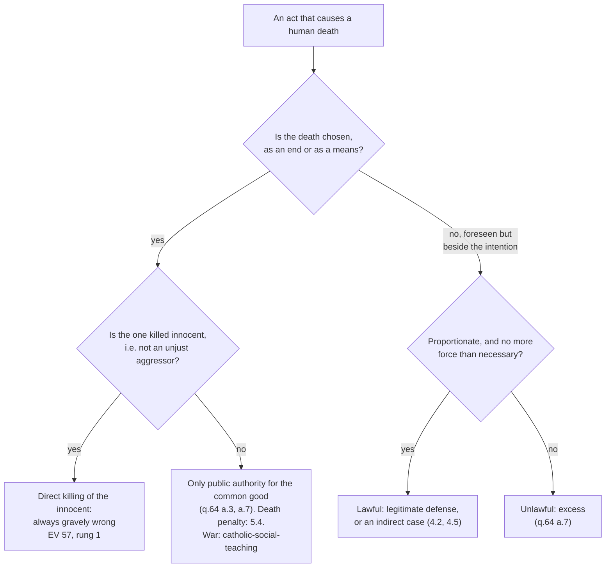

# Moral Theology · Lesson 5.1: The inviolability of innocent life

> ⏱ ~15 min · Module 5: Life · Builds on: [4.2 Double effect and cooperation as Catholic method](04-02-double-effect-and-cooperation-as-catholic-method.md), [4.4 Veritatis Splendor](04-04-veritatis-splendor.md) · Unlocks: [5.2 Abortion](05-02-abortion.md), [5.3 Euthanasia and the end of life](05-03-euthanasia-and-the-end-of-life.md), [5.4 The death penalty and CCC 2267](05-04-the-death-penalty-and-ccc-2267.md)

## Why this matters

Every lesson in this module applies one norm: **the direct killing of an innocent human being is always gravely wrong.** Abortion (5.2) and euthanasia (5.3) are applications of it. The death penalty (5.4) is the case where the victim is not innocent. So you need its exact wording, scope and level first; the level is the highest of any moral teaching in this course. You also need to see why someone who holds it absolutely may still kill an attacker.

## The idea

"Thou shalt not kill" (Exodus 20:13, Douay–Rheims) cannot mean *never cause a death*. The same Law acquits a householder who kills a burglar breaking in (Exodus 22:2). It also commands executions. The Hebrew verb in the commandment, *ratsach*, is not the general word for killing. It names homicide within the community: it is used of the accidental manslayer who flees to a city of refuge (Numbers 35:11), and once, in Numbers 35:30, of executing a murderer. So the bare word does not fix the commandment's scope. The tradition read the scope from a sharper verse: "The innocent and just person thou shalt not put to death" (Exodus 23:7). (This is the fifth commandment in the Catholic and Lutheran numbering, the sixth in the Jewish and Reformed.)

The tradition narrowed the commandment with two qualifiers, and each does real work.

- **Innocent.** Not "morally sinless". The Latin *in-nocens* means "not harming". An innocent is someone who is not engaged in unjust aggression. An attacker in a psychotic episode is morally blameless and still, for this purpose, not innocent.
- **Direct.** The death is *chosen*, as an end or as a means. A death that follows from an act chosen for another reason, and is foreseen but not chosen, falls under [double effect](../reference.md#double-effect) ([4.2](04-02-double-effect-and-cooperation-as-catholic-method.md)), not under this norm.

Put together: never choose the death of someone who is not unjustly attacking. The rest of the module works out who is innocent and what counts as choosing.

## Source

Aquinas, *Summa Theologiae* II-II q.64 a.6, "Whether it is lawful to kill the innocent?", *respondeo* (English Dominican Province):

> An individual man may be considered in two ways: first, in himself; secondly, in relation to something else. If we consider a man in himself, it is unlawful to kill any man, since in every man though he be sinful, we ought to love the nature which God has made, and which is destroyed by slaying him. Nevertheless, as stated above (Article 2) the slaying of a sinner becomes lawful in relation to the common good, which is corrupted by sin. On the other hand the life of righteous men preserves and forwards the common good, since they are the chief part of the community. Therefore it is in no way lawful to slay the innocent.

Read the structure. **"In himself"** gives the default: every human life is to be loved as God's work, *even the sinner's*. The only exception Aquinas admits runs through **"in relation to the common good"**, and a.3 restricts that to public authority. **"In no way"** is absolute because the innocent person supplies nothing that could trigger the exception. Note what Aquinas's "innocent" means here. It means righteous as against guilty, because his exception is punishment. The modern "not harming" sense comes from the self-defense case, which Aquinas handles differently, in the next article.

## The argument

1. Every human being, considered in himself, is to be loved as God's work, and killing destroys that work (a.6). *In words:* there is a standing presumption against every killing, the guilty included.
2. God alone is Lord of life and death (a.6 ad 1; *Evangelium Vitae* 55). No human has dominion over another's life by his own right.
3. Any lawful killing must therefore be justified by something other than the victim's life "in himself": his wrongdoing or his aggression.
4. The innocent, by definition, supply neither.
5. ∴ To choose the death of an innocent person, as an end or as a means, is always gravely wrong.
6. Self-defense does not violate (5). The defender chooses to stop the attack. The attacker's death is "beside the intention", and the act is lawful if the force is proportionate (q.64 a.7). *In words:* self-defense is not an exception to the norm. It falls outside it, because the killing is not what is chosen.

Step 6 is where [double effect](../reference.md#double-effect) begins, historically. [`ethics` 3.2](../../ethics/lessons/03-02-the-doctrine-of-double-effect.md) reads a.7 as the secular principle's seed and flags how much of the later four-condition formula it contains as disputed. The Catechism takes the same line: legitimate defense is **not an exception** to the ban on murdering the innocent (CCC 2263). It then quotes a.7 (CCC 2263–2264) and adds that defense can be a grave duty for someone responsible for others (CCC 2265).

**Evangelium Vitae 57.** John Paul II's encyclical (25 March 1995) did not arrive out of nowhere. The 1991 consistory of cardinals asked him to reaffirm the inviolability of life with Petrine authority. At Pentecost 1991 he wrote to every bishop for their cooperation (EV 5). Paragraph 57 then moves in three steps (paraphrased):

- **The evidence.** Innocent life's inviolability is taught by Scripture, upheld by Tradition and proposed by the Magisterium. Its constancy shows the supernatural sense of the faith (citing *Lumen Gentium* 12).
- **The formula.** By the authority Christ conferred on Peter and his successors, and in communion with the bishops, the pope **confirms** that the direct and voluntary killing of an innocent human being is always gravely immoral. He grounds this in the natural law (Romans 2:14–15), Scripture, Tradition, and the teaching of the **ordinary and universal Magisterium**, citing *Lumen Gentium* 25.
- **The scope.** Such a killing is never licit, as an end or as a means. No one may ask for it or consent to it. No authority may permit it.

**Mark the levels.** See [the levels](../reference.md#the-levels-in-moral-theology) and the ladder in [`fundamental-theology` 4.4](../../fundamental-theology/lessons/04-04-the-ladder-of-doctrinal-authority.md).

- **The norm of EV 57 is rung 1: divinely revealed, taught infallibly by the ordinary universal magisterium.** The verb is *confirm*, not *define*. The ground is the bishops' concurring teaching, cited from *Lumen Gentium* 25. So the reading theologians commonly give is that the pope is **not** issuing an *ex cathedra* definition. He is attesting that the teaching is already infallible by the ordinary universal route ([`fundamental-theology` 4.2](../../fundamental-theology/lessons/04-02-infallibility-and-its-conditions.md)). The CDF's 1998 *Doctrinal Commentary* on the *Professio fidei* (§11) confirms the placement. Among its examples for the **first** paragraph, truths to be believed as divinely revealed, it lists the doctrine on the grave immorality of directly and voluntarily killing an innocent human being, citing EV 57.
- **For contrast, euthanasia (EV 65) is rung 2 on the commentary's own sorting.** The same §11 discusses it among truths held definitively, the **second** paragraph, as connected with revelation. Both have the same firmness of assent and a different motive. 5.3 owns it.
- **Legitimate defense is lawful, and can be a duty.** This is constant teaching, restated at CCC 2263–2265 and EV 55: **authentic ordinary magisterium** at least. No act this lesson has found proposes it as definitive, so don't promote it.
- **"Innocent" means "not an unjust aggressor", not "sinless".** This is **common teaching** (rung 4). EV 55 supports it by attributing the death to the aggressor even when he lacks the use of reason and so bears no moral responsibility. But no act defines the term.
- **Whether a private defender may ever *intend* the attacker's death.** Aquinas says no, and reserves that intention to public authority (a.7). No magisterial act settles how that sentence is read. It is a **theologians' question**.

## The rule

The top question is the one every hard case in this module fights over. Is a given death really *chosen*? That is [4.5](04-05-describing-the-object.md)'s debate about describing the [moral object](../reference.md#the-moral-object).

## Worked examples

**Example 1: a clean case.** A shop owner is attacked by a man with a machete. The only way she can stop him is to shoot. He dies. Run the tree. What she chose was *stopping the attack*. His death followed from the only effective means, foreseen, and it is not what her act aims at. She used no more force than the threat required. So the act is **lawful legitimate defense**, and CCC 2263 says it is not an exception to the fifth commandment. Now change one fact. He drops the machete and runs, and she shoots him in the back "so he never comes back". The attack is over. What she now chooses is his death, as punishment or as protection against a future threat. A private person may do neither (q.64 a.3). The act is **unlawful**.

**Example 2: where it strains.** An attacker holds a knife to a hostage's throat, using him as a shield. A police marksman can stop the attacker only by a shot that will pass near the hostage and may kill him. Two lines of analysis pull apart.

- *The attacker.* Stopping him is legitimate defense of another person, and for a public officer it may be a grave duty (CCC 2265). Aquinas even allows the officer to *intend* the attacker's death for the common good (a.7).
- *The hostage.* He is innocent. If the marksman's plan works *through* the hostage's death, the death is chosen as a means, and EV 57 forbids it absolutely. If the hostage's death is only a risk of a shot aimed at the attacker, it is beside the intention. Then the question is proportion: the risk to the hostage against the lives the shot saves.

The norm doesn't move. What strains is the description: is the risk to the hostage part of the plan, or a side effect? That is 4.5's question. What the norm never allows is shooting the hostage to reach the attacker because "more lives are saved": that chooses an innocent's death as a means.

## Watch out

- **"The Church teaches that you may never kill."** It teaches that you may never *directly* kill the *innocent*. Legitimate defense can even be a duty (CCC 2265). The pacifist reading of Exodus 20:13 is not the Church's reading.
- **Understating EV 57: "an encyclical, so authentic but non-definitive teaching."** The genre's default is overridden by the formula and by the 1998 commentary's first-paragraph placement. The norm is **rung 1**.
- **Overstating EV 57: "an *ex cathedra* definition".** The pope *confirms* an ordinary-universal teaching. He does not define. The level is the same, but the route is different, and you must name the right one.
- **Promoting the application with the norm.** "Direct killing of the innocent is always wrong" is rung 1. "This particular procedure is a direct killing" is a separate claim, and it has its own level, often freely disputed (4.5).
- **"Innocent means sinless."** Then a blameless psychotic attacker could never be resisted with lethal force, and a guilty but harmless prisoner would fall outside the norm. Then EV 55 would be wrong about the one, and q.64 a.3 would be needed to protect the other.

## One-liner

> Never choose the death of someone who is not unjustly attacking. EV 57 *confirms* this as infallible ordinary-universal teaching (rung 1), and self-defense sits outside it rather than being an exception to it, because the attacker's death is not what the defender chooses.

## Problems

**P1 (🟢)** *(Exegetical)* Aquinas, ST II-II q.64 a.7, the end of the *respondeo* and the reply to Objection 4 (English Dominican Province). Objection 4 had argued that since no one may commit adultery to save his life, no one may kill to save it either:

> But as it is unlawful to take a man's life, except for the public authority acting for the common good, as stated above (Article 3), it is not lawful for a man to intend killing a man in self-defense, except for such as have public authority, who while intending to kill a man in self-defense, refer this to the public good, as in the case of a soldier fighting against the foe, and in the minister of the judge struggling with robbers, although even these sin if they be moved by private animosity.
>
> The act of fornication or adultery is not necessarily directed to the preservation of one's own life, as is the act whence sometimes results the taking of a man's life.

(a) What may a private defender intend, and what may a soldier intend? Which words mark the difference? (b) Why does the reply to Objection 4 refuse the parallel with adultery? Name the words that carry the reply. **Two sentences per part.**

**P2 (🟡)** *(Exegetical)* Three **invented** cases. For each, say whether the act is **legitimate defense**, **direct killing of the innocent**, or **unlawful for another reason**, and name the deciding fact and text. **Two sentences per case.**

1. A patient in a psychotic episode attacks a nurse with a scalpel. The only way to stop him in time is a blow that kills him.
2. Kidnappers holding five hostages tell the negotiator they will release all five if he shoots a sixth, uninvolved hostage. He does.
3. A security guard subdues an armed robber, who is now handcuffed on the floor. The guard shoots him, reasoning that the robber would kill again if released.

**P3 (🔴)** *(Exegetical)* Give each claim its level, and **name the act or text that fixes it**, or say that none does. **One or two sentences each.**

1. Legitimate defense can be a grave duty for someone responsible for the lives of others.
2. In the norm against killing the innocent, "innocent" means "not engaged in unjust aggression", not "free of sin".
3. A private person defending himself may never intend the attacker's death.
4. Killing in self-defense is a justified exception to the fifth commandment.

Solutions

**P1** *(Exegetical (a) · Exegetical (b))*

**Must hit, strict (a):** a private defender may intend only the defense, the saving of his life. He may **not intend** the killing: "it is not lawful for a man to intend killing a man in self-defense". A soldier or officer of the judge **may intend** it, because he "refer[s] this to the public good". The difference rests on "except for the public authority acting for the common good" and "except for such as have public authority". There is a limit even so: "even these sin if they be moved by private animosity".

**Must hit, strict (b):** adultery is "not necessarily directed to the preservation of one's own life", but the defensive act is: it is the act "whence sometimes results" the death. The reply turns on what the act is *ordered to*. Defense is of its nature aimed at preserving life, and the death *results*, beside the intention. Adultery has no such order to life. So the parallel fails.

**Wrong turns:** reading (a) as "the soldier may kill, the private man may not". Both may kill. What differs is what each may *intend*. Reading (b) as "killing is less grave than adultery", which reverses Objection 4's own premise and misses the point about the act's direction. Answering from the four modern conditions rather than from the text.

**Model answer:** (a) The private defender may intend to save his life but not to kill; only those with public authority may intend the killing, referring it to the public good, as a soldier does. "Except for such as have public authority" marks the line, and "private animosity" corrupts even them. (b) Adultery is not by its nature ordered to saving one's life, but the defensive act is, and the death merely "results" from it. The words "not necessarily directed to the preservation of one's own life" carry the disanalogy.

**P2** *(Exegetical)*

**Must hit, strict:**

1. **Legitimate defense.** The patient is morally blameless but is an unjust aggressor in fact, so he is not "innocent" in the norm's sense. EV 55 attributes the death to the aggressor even when he lacks the use of reason. The blow was the only effective means (q.64 a.7, moderation).
2. **Direct killing of the innocent.** The sixth hostage attacks no one, and his death is the very means by which the others are freed. EV 57 excludes it "as a means to a good end". The number saved is irrelevant.
3. **Unlawful for another reason.** The attack is over, so there is no defense. Killing to prevent future crime is punishment, which belongs only to public authority acting through due process (q.64 a.3). The robber is guilty but not innocent, so this is not EV 57's case.

**Wrong turns:** calling case 1 direct killing of the innocent because the patient is not culpable; that confuses "innocent" with "sinless". Calling case 3 legitimate defense because the robber "is dangerous"; a future danger is not a present attack. Treating case 2 as a proportion question.

**Model answer:** as above, two sentences each.

**P3** *(Exegetical)*

**Must hit, strict:**

1. **Authentic ordinary magisterium (at least rung 3).** CCC 2265 teaches it, and EV 55 quotes it. No act proposes it as definitive, so don't promote it.
2. **Common teaching (rung 4).** No act defines the term. EV 55's attribution of the death to an aggressor who lacks the use of reason supports it.
3. **No magisterial level; a theologians' question.** It is Aquinas's position (q.64 a.7). The Catechism quotes a.7's double-effect sentences (CCC 2263–2264) but settles nothing about intending death, and Aquinas's readers dispute what the sentence excludes.
4. **Rejected as stated.** CCC 2263 says legitimate defense is *not* an exception to the prohibition against murdering the innocent. It falls outside the norm, because the death is not intended.

**Wrong turns:** promoting 1 to rung 1 because it is closely tied to EV 57; the tie is not a proposal. Calling 3 "Catholic teaching" because Aquinas says it. Accepting 4 as a harmless paraphrase; the "outside, not exception" structure is what keeps the norm absolute.

**Model answer:** as above.

## Flashback

**From Lesson [4.4](04-04-veritatis-splendor.md) (Veritatis Splendor):** *(Exegetical, close reading and apply.)* Daniel 13:22–23 (Douay–Rheims). Two elders threaten to accuse Susanna of adultery, a capital charge, unless she lies with them:

> Susanna sighed, and said: I am straitened on every side: for if I do this thing, it is death to me: and if I do it not, I shall not escape your hands. But it is better for me to fall into your hands without doing it, than to sin in the sight of the Lord.

*Veritatis Splendor* 52 adds a point, here paraphrased: coercion or circumstances can always prevent a person from doing some good action, but nothing can force him to do an action a negative precept forbids, above all if he is ready to die rather than do evil.

(a) Susanna could be reading her choice as a weighing of two outcomes, or as a refusal to do a kind of act whatever it costs. Which reading do the words of verse 23 support, and which words decide it? (b) A case written for the problem. Pedro is jailed by a regime for two years. He cannot attend Sunday Mass, and his jailers order him to sign a statement falsely accusing a neighbour of treason. Using VS 52, say which of the two obligations his situation suspends and which it cannot, and why. **Two sentences per part.**

Solution

**Must hit, strict (a):** a **refusal of a kind of act**, not a weighing. The decisive words are **"without doing it"** against **"to sin"**. Both alternatives end in death ("it is death to me" / "I shall not escape your hands"), so no outcome is left to weigh. What she compares is her own *doing* of the act with *suffering* what others will do to her, which is the object taken from the acting person's perspective (VS 78). VS 91 cites her as a witness that one may not do evil to draw good from it.

**Must hit, strict (b):** the **Sunday obligation** is suspended. It is a **positive** precept: it binds universally, but what it demands here and now depends on circumstances, and prison can prevent the act (VS 52, 67). The **false accusation** cannot be excused by his situation. Bearing false witness falls under a **negative** precept that binds *semper et pro semper*, and no one can be forced to do the forbidden act, even at the cost of his life (VS 52).

**Wrong turns:** in (a), reading "it is better for me" as a comparison of outcomes: the two branches have the same outcome, and "better" ranks doing against suffering. In (b), saying Pedro sins by missing Mass, or saying fear makes the false statement right. Fear can lessen his guilt ([2.1](02-01-the-voluntary.md)) but does not change the act.

**Model answer:** (a) The verse supports a refusal of a kind of act. Both branches end in death, so what "better" ranks is "without doing it" against "to sin": her own act against what is done to her. (b) Prison suspends the Sunday obligation, a positive precept whose demand depends on circumstances and which he can be prevented from keeping. It cannot suspend the ban on false witness, a negative precept binding always, which no coercion can force him to break, even if refusing costs his life.

## Connections

- **Backward:** [4.2](04-02-double-effect-and-cooperation-as-catholic-method.md) supplies the manual conditions that step 6 depends on. [4.4](04-04-veritatis-splendor.md) names homicide among intrinsically evil acts, and this lesson gives the norm behind that entry its own, higher level. [`fundamental-theology` 4.1](../../fundamental-theology/lessons/04-01-the-magisterium.md) and [4.5](../../fundamental-theology/lessons/04-05-reading-a-documents-weight.md) use the killing of the innocent and EV's formulas as test cases of the ordinary universal magisterium. [`old-testament` 2.6](../../old-testament/lessons/02-06-covenant-and-law.md) covers the Decalogue as law.
- **Forward:** [5.2](05-02-abortion.md) applies the norm to the unborn (EV 62). [5.3](05-03-euthanasia-and-the-end-of-life.md) applies it at the end of life (EV 65, rung 2 on the commentary's sorting). [5.4](05-04-the-death-penalty-and-ccc-2267.md) takes up the non-innocent and q.64 a.2. [4.5](04-05-describing-the-object.md) handles the cases where "direct" is contested.
- **Sideways:** [`ethics` 3.2](../../ethics/lessons/03-02-the-doctrine-of-double-effect.md) treats a.7 as the root of the secular principle: one principle in two settings. [`catholic-social-teaching`](../../catholic-social-teaching/syllabus.md) takes public authority's use of force into just war, and [`philosophy-of-law`](../../philosophy-of-law/syllabus.md) 6.3 classifies self-defense in law as a justification, not an excuse. Cards: [the inviolability of innocent life](../reference.md#the-inviolability-of-innocent-life), [Evangelium Vitae 57](../reference.md#evangelium-vitae-57), [legitimate defense](../reference.md#legitimate-defense).
