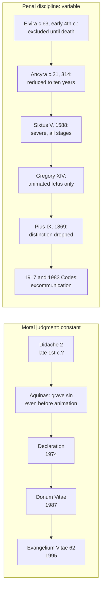

# Moral Theology · Lesson 5.2: Abortion

> ⏱ ~15 min · Module 5: Life · Builds on: [5.1 The inviolability of innocent life](05-01-the-inviolability-of-innocent-life.md), [4.5 Describing the object](04-05-describing-the-object.md) · Unlocks: [5.5 Assisted reproduction and the embryo](05-05-assisted-reproduction-and-the-embryo.md)

## Why this matters

Abortion is the moral teaching most often misreported, and in both directions. One side says the Church "only recently" opposed it, or opposed it only after the soul arrived. The other side treats every sentence on the subject, including penalties, embryology and theories of the soul, as equally fixed. This lesson separates three things the tradition itself keeps apart: the **moral judgment**, the **theory of when the soul is infused**, and the **penal discipline**. Only the first is the teaching. It has one of the highest authority levels any moral norm carries.

## The idea

The teaching fits in one sentence. **Direct abortion, willed as an end or as a means, is always gravely wrong, because it is the deliberate killing of an innocent human being** (*Evangelium Vitae* 62, 1995). It is [5.1](05-01-the-inviolability-of-innocent-life.md)'s norm applied to the unborn. "Direct" carries the weight. What is excluded is killing that is chosen. A death that is foreseen but not chosen falls under a different analysis, [double effect](../reference.md#double-effect), and the hard cases of that kind belong to [4.5](04-05-describing-the-object.md).

Over two thousand years, three things changed and one did not:

- **Discipline changed.** Penances and penalties have been harsher and milder, broader and narrower.
- **The theory of ensoulment changed.** For most of the Middle Ages the common view was that the rational soul arrives weeks after conception.
- **Embryology changed.** The mechanics of conception were worked out only in the modern period.
- **The moral judgment did not change.** No period of the Church's history held procured abortion to be morally indifferent, at any stage.

Keep that four-way split in view and most of the history, and most of the polemics, sort themselves out.

## Source

The *Didache*, ch. 2, 1–2 (*Ante-Nicene Fathers* vol. 7), dated roughly 50–150 with the core usually placed early ([`patristics` 1.2](../../patristics/lessons/01-02-first-clement-and-the-didache.md)):

> And the second commandment of the Teaching; Thou shalt not commit murder, thou shalt not commit adultery, thou shalt not commit pæderasty, thou shalt not commit fornication, thou shalt not steal, thou shalt not practice magic, thou shalt not practice witchcraft, thou shalt not murder a child by abortion nor kill that which is begotten.

Three things in the passage matter. **Placement**: the prohibition sits inside an expansion of the Decalogue, beside "Thou shalt not commit murder". It is treated as part of the moral law, not as a church rule. **The verb**: the child is *murdered*, the same verb as the commandment. **The pairing**: abortion and infanticide are named together as one wrong at two moments, the practices by which the Greco-Roman world got rid of unwanted children. One caution: the manuscript reads "the new-born child" in the last clause, and most editors emend it to "that which is begotten" (ANF's note). Either way, the unborn child stands in the first clause. The text makes no distinction by stage and offers no theory of the soul.

## The argument

1. **It is always gravely wrong to kill an innocent human being directly** ([5.1](05-01-the-inviolability-of-innocent-life.md); EV 57).
2. **From conception, the embryo is a living human individual.** The *Declaration on Procured Abortion* (CDF, 1974) 12–13 argues this: from fertilization there begins a life that belongs to neither father nor mother but to a new human being, and it would never become human if it were not human already (paraphrased). Genetics confirms it but is not its basis. *In words:* the embryo is not a part of the mother or a potential something else. It is a new member of our species at its earliest stage.
3. **Direct abortion is the chosen killing of that individual,** as an end or as a means (EV 62). *In words:* its [object](../reference.md#the-moral-object) is killing the child, whatever the further motive.
4. **So direct abortion is gravely wrong, and wrong in itself.** No intention or circumstance can make it licit. EV 62 says so and classes it with the acts it calls intrinsically illicit ([intrinsically evil acts](../reference.md#intrinsically-evil-acts); the [three fonts](../reference.md#the-three-fonts)).

**The ensoulment objection, at its strength.** Premise 2 says "human individual". A defender of [delayed animation](../reference.md#delayed-animation) presses on the word *person*. Aquinas held that the rational soul is not present from the start. The embryo has "the nutritive soul from the beginning, then the sensitive, lastly the intellectual soul", and the last "is created by God at the end of human generation" (ST I q.118 a.2 ad 2). The penal law of his day tracked this. In II-II q.64 a.8 ad 2 the man who strikes a pregnant woman is guilty of homicide if death results to her "or of the animated fetus". The modern form of the objection is not antiquarian. Joseph Donceel (1970) argued on hylomorphic grounds that a rational soul needs a body organized enough to receive it. Norman Ford (1988) argued from twinning: an embryo that can still divide in two is not yet one individual. If either is right, early abortion would not be homicide, and premise 2 would fail for the first days or weeks.

**Why the teaching never rested on the answer.** The Church's reply has three parts.

- **History.** Medieval authors who held delayed animation still judged procured abortion a grave sin at every stage. They graded the *penalty*, not the permission (*Declaration* 7, which cites Aquinas's commentary on the *Sentences*, IV d.31). Innocent XI's 1679 condemnation of laxist propositions included one that excused abortion before animation (*Declaration* 7, paraphrased).
- **The moral argument is independent of the metaphysics.** The *Declaration*'s note 19 sets the question of ensoulment aside as unresolved. It then gives two reasons the norm stands either way. First, even on late animation, the embryo is a human life preparing for and calling for a soul. Second, it is enough that the soul's presence is *probable*, and the contrary can never be proved. To kill is to accept the risk of killing a man. EV 60 restates the second reason: the mere probability that a person is present would justify an absolute prohibition.
- **The practical criterion.** *Donum Vitae* (CDF, 1987) I.1 says the Magisterium has not expressly committed itself to a philosophical thesis. It asks, rhetorically, how a human individual could fail to be a human person. It then fixes the norm: from conception the embryo is to be respected and treated as a person, and its rights, first the right to life, recognized (paraphrased). EV 60 quotes this.

*In words:* the Church answers "treat as a person" without defining "is a person". The objection targets a premise the argument does not need.

**Mark the levels.** See [the levels in moral theology](../reference.md#the-levels-in-moral-theology).
- **Direct abortion is always gravely immoral: taught infallibly by the ordinary and universal magisterium.** [EV 62](../reference.md#evangelium-vitae-62) confirms it with a formula invoking Petrine authority and the bishops' unanimous agreement. It is commonly read as a confirmation, not an *ex cathedra* definition. It is at least **definitive (rung 2)**. On the natural reading it is **rung 1**, because EV 62 grounds it in the written Word of God. It also defines direct abortion as a case of the killing of the innocent, and the CDF's 1998 commentary on the *Professio fidei* places EV 57's norm in the first paragraph. That commentary does not name abortion, so the placement is an inference; say so. Calling the teaching "a prudential judgment" understates it.
- **The embryo is to be treated as a person from conception: authentic ordinary magisterium** (*Donum Vitae* I.1, restated in EV 60).
- **When the rational soul is infused: freely disputed.** The Magisterium has declined to commit itself. "The Church teaches immediate ensoulment" overstates.
- **The penalties: canonical discipline,** changeable by the legislator and not doctrine. EV 62 names the present automatic excommunication.

## Two tracks

The lower track moves. The upper does not. Ancyra's canon 21 shows the pattern early: a former decree had excluded women who "destroy that which they have conceived" until the hour of death, and the council, "desirous to use somewhat greater lenity", reduced this to ten years of penance (NPNF 2nd ser. vol. 14). Leniency in the penance, with no doubt about the sin. The identification of the "former decree" with Elvira c.63, and Elvira's date, are conventional but uncertain.

## Worked examples

**Example 1: the clean case.** A woman eight weeks pregnant, facing real hardship, chooses an abortion by a procedure whose purpose is to end the pregnancy by ending the child's life. Object: the death of the child, willed as the means to relief. The end, relief from hardship, is good. The circumstances, including pressure and fear, may greatly reduce her *culpability* ([2.1](02-01-the-voluntary.md); [3.4](03-04-sin-mortal-and-venial.md)). Neither changes the object. Verdict: direct abortion, gravely wrong in itself. Whether it is a *mortal sin for her* is a separate question about knowledge and consent.

**Example 2: where the argument strains.** Take a drug whose sole designed action is to prevent an already-fertilized embryo from implanting, taken four days after conception. The delayed-animation objection is at its strongest here, since Ford's twinning argument covers exactly this window. The Church's reply runs through note 19 and EV 60: the embryo is a human life ordered to personhood, and a person is at least probably present. So the probability argument carries the verdict. A manual probabilist ([probabilism](../reference.md#probabilism), [4.1](04-01-casuistry-and-the-probabilism-controversy.md)) might ask why a probable opinion that no person is present doesn't license the act. The manuals' own answer, common teaching rather than magisterial, was that probabilism covers doubts about *law*. When the doubt is one of *fact* and an innocent life is at stake, one must take the safer course. The hunter who is unsure whether the movement in the brush is a deer or a man may not fire. The argument strains at a different point: it needs the probability of a person to be more than negligible, and the objector disputes exactly that. Cases where the child's death is foreseen but not chosen, such as the cancerous uterus, craniotomy and ectopic pregnancy, are not decided here. They go to [4.5](04-05-describing-the-object.md).

## Watch out

- **Understating the level.** The condemnation of direct abortion is not an authentic-but-reformable teaching awaiting development. EV 62 confirms it as taught by the ordinary and universal magisterium, so it is at least rung 2.
- **Overstating the level.** The Church has not defined that the soul is infused at conception, and the 1974 *Declaration* says the question is open. It also has not defined when an embryo "becomes a person". The binding norm is *treat as a person*.
- **You might think a change in penalty is a change in teaching.** Sixtus V, Gregory XIV and Pius IX legislated about *who incurs which penalty*. Excommunication is canonical discipline. Dropping the "animated fetus" limit in 1869 changed the reach of a penalty, not the moral judgment.
- **"Direct" is not "physically immediate".** The word concerns what is chosen as end or means. The hard cases turn on how the object is described (4.5).

## One-liner

> Direct abortion has been judged gravely wrong from the *Didache* to *Evangelium Vitae*. Theories of the soul and scales of penalty changed around a judgment that did not, and that judgment is now confirmed as taught infallibly by the ordinary and universal magisterium.

## Problems

**P1 (🟢)** *(Exegetical)* Read the *Didache* passage in **Source** again. (a) Name two features of the text that show abortion is treated as a violation of the moral law and not as a community rule. (b) The manuscript's last clause reads "the new-born child", emended by most editors to "that which is begotten". Does the choice between the readings affect whether the passage forbids abortion? Say which words decide it. Two sentences per part.

**P2 (🟡)** *(Exegetical)* Assign each claim its level on the ladder of [`fundamental-theology` 4.4](../../fundamental-theology/lessons/04-04-the-ladder-of-doctrinal-authority.md), and name the act or document that fixes it. (i) Direct abortion always constitutes a grave moral disorder. (ii) The rational soul is infused at the moment of conception. (iii) The human embryo is to be respected and treated as a person from conception. (iv) A person who actually procures an abortion incurs automatic excommunication. One line each, plus one sentence on which of the four could be changed by a future pope without contradicting anything.

**P3 (🔴)** *(Exegetical)* An **invented** op-ed paragraph, written for this problem:

> "The Church's absolutism on abortion is newer than people think. Aquinas taught that the early embryo has no human soul, so for most of Christian history early abortion was not considered a serious matter. Only in 1869, when Pius IX changed the rules on excommunication, did the Church begin to treat abortion from conception as grave. The teaching is a Victorian innovation, and what one pope made, another can unmake."

Diagnose the paragraph: find the three distinct errors (one historical, one about Aquinas, one about the relation of discipline to doctrine), correct each from the sources in this lesson, and state the level of the teaching the last sentence says can be "unmade". 150 words.

Solutions

**P1** *(Exegetical)*

**Must hit, strict (a):** Any two of the following. **Placement**: the prohibition is part of "the second commandment of the Teaching", an expansion of the Decalogue beside "Thou shalt not commit murder" (the ANF notes key the neighbouring precepts to Ex 20). **The verb**: "murder a child", the commandment's own verb. **Company**: it is listed with adultery, theft and false witness, not with ritual or discipline.
**Must hit, strict (b):** No. The first clause, "murder a child by abortion", already forbids abortion. The textual question affects only whether the second clause adds infanticide ("the new-born") or restates the prohibition ("that which is begotten").
**Wrong turns:** resting the argument on the disputed second clause. Claiming the passage distinguishes early from late abortion, or contains any theory of the soul; it has neither.
**Model answer:** (a) The prohibition stands inside the "second commandment", an expansion of the Decalogue beside "Thou shalt not commit murder", and it uses the same verb: the child is *murdered*. (b) The reading does not matter for abortion, because "murder a child by abortion" in the first clause decides it; the variant only settles whether the second clause names infanticide or repeats the first.

**P2** *(Exegetical)*

**Must hit, strict:** (i) **Infallibly taught by the ordinary and universal magisterium**, confirmed by *Evangelium Vitae* 62 (1995). At least **rung 2**, and on the natural reading **rung 1**. Full credit for "at least definitive, commonly read as proposed as revealed" with the reason (EV 62 grounds it in the written Word of God and treats it as a case of the EV 57 norm, which the 1998 CDF commentary places in the first paragraph). (ii) **Freely disputed**: no act proposes it. The *Declaration on Procured Abortion* n.19 and *Donum Vitae* I.1 expressly decline to commit to it. (iii) **Authentic ordinary magisterium**: *Donum Vitae* I.1 (CDF, 1987), restated in EV 60. (iv) **Canonical discipline**, not doctrine: the penal law named in EV 62. **Changeable:** only (iv). A future pope could alter the penalty without contradicting any teaching.
**Wrong turns:** calling (i) "ex cathedra" or "solemnly defined"; it is a confirmation of ordinary universal teaching. Calling (i) "authentic, non-definitive" (understating). Calling (ii) Church teaching. Treating (iv) as a doctrinal claim whose change would reverse (i).
**Model answer:** (i) Infallibly taught by the ordinary universal magisterium, confirmed in EV 62: at least rung 2, naturally read as rung 1. (ii) Freely disputed; the 1974 *Declaration* (n.19) and *Donum Vitae* leave it open. (iii) Authentic ordinary magisterium, *Donum Vitae* I.1. (iv) Canonical discipline in current penal law, cited by EV 62. Only (iv) could be changed by a future pope without contradicting any teaching.

**P3** *(Exegetical)*

**Must hit, strict:** **Historical**: the judgment is attested from the start: *Didache* 2, Ancyra c.21 (314) treating abortion as grave sin needing years of penance, Sixtus V (1588) and Innocent XI (1679), long before 1869. **Aquinas**: he held delayed animation (ST I q.118 a.2 ad 2), but that bears on whether early abortion is *homicide*. He and his contemporaries still judged it a grave sin (*Declaration* 7); only the penalty was graded. **Discipline vs doctrine**: *Apostolicae Sedis* (1869) removed the "animated fetus" limit from a *penalty*. A change in who is excommunicated is not the origin of a moral judgment. **Level**: infallibly taught by the ordinary universal magisterium (EV 62), at least rung 2, so "another can unmake" is false.
**Wrong turns:** conceding "not a serious matter" for early abortion because of Aquinas. Correcting the history but not the inference from penalty to doctrine. Calling EV 62 an *ex cathedra* definition.
**Model answer:** The paragraph makes three errors. Historically, the judgment is ancient: the *Didache* forbids murdering a child by abortion, and Ancyra (314) treats it as a grave sin needing ten years' penance. On Aquinas: he did hold that the rational soul comes late (ST I q.118 a.2 ad 2), but medieval authors, him included, still called procured abortion a grave sin at every stage; delayed animation graded the penalty, not the permission. On 1869: Pius IX's *Apostolicae Sedis* dropped the "animated" limit that Gregory XIV had put on excommunication. It widened a penalty and created no teaching. The judgment itself is confirmed in EV 62 as taught infallibly by the ordinary and universal magisterium, at least rung 2. No pope can unmake it; a pope can only change the penalty.

## Flashback

**From Lesson [4.5](04-05-describing-the-object.md) (Describing the object: the debate after *Veritatis Splendor*):** *(Exegetical.)* An **invented** memo to a hospital ethics committee, not the words of any real person:

> "Re: the pregnant patient in Room 4, whose life is threatened. *Veritatis Splendor* 78 tells us to judge the act from the perspective of the acting person. Our team's only intention is to save the mother, so whatever procedure we use is indirect by definition. The Holy Office's replies of 1884 and 1889 infallibly settled that operations on the mother's organism are lawful. Some will cite Rhonheimer, but his vital-conflict view is simply proportionalism, which the Church has condemned, so it carries no weight either way."

Name three errors. Correct each, and give the level wherever one is involved. **150 words or fewer.**

Solution

**Must hit, strict:**

- **"Indirect by definition."** The perspective of the acting person is not whatever the agent says he intends. *Veritatis Splendor* 78 (authentic ordinary magisterium, rung 3) makes the object the proximate end of the choice and excludes the purely subjective as well as the merely physical. A death willed as a **means** is direct, whatever the further aim (*Evangelium Vitae* 62).
- **The Holy Office replies.** They are **rung 3**: "cannot be safely taught" is a caution, not a definition. They were also **negative**, refusing to allow directly destructive operations such as craniotomy. The permission for operations on the mother's organism is the manual rule Coppens states, not the replies' own teaching.
- **Rhonheimer.** He is **not a proportionalist**: he denies weighing lives and claims to say what the choice is. Whether his view collapses into proportionalism is the critics' charge, and his account is **freely disputed (rung 5)**, neither taught nor condemned.

**Wrong turns:** overcorrecting to "the team's intention is irrelevant", which is the physicalism *Veritatis Splendor* 78 also rejects. Treating the replies as having no authority, when rung 3 still asks for religious submission. Calling Rhonheimer's view taught.

**Model answer:** as above.

## Connections

- **Backward:** [5.1](05-01-the-inviolability-of-innocent-life.md) supplies the norm and the EV 57 form of confirmation that EV 62 repeats. [2.2](02-02-the-moral-object.md) supplies "the object", which is what "direct" is about. [`fundamental-theology` 4.4](../../fundamental-theology/lessons/04-04-the-ladder-of-doctrinal-authority.md) supplies the ladder, and [`patristics` 1.2](../../patristics/lessons/01-02-first-clement-and-the-didache.md) the *Didache*'s date and text.
- **Forward:** [4.5](04-05-describing-the-object.md) takes the indirect cases. [5.3](05-03-euthanasia-and-the-end-of-life.md) meets the same confirmation formula in EV 65, which the 1998 commentary places in the second paragraph. [5.5](05-05-assisted-reproduction-and-the-embryo.md) applies *Donum Vitae*'s "treat as a person" to IVF and frozen embryos.
- **Sideways:** the ensoulment objection is a hylomorphism question from [`thomistic-synthesis`](../../thomistic-synthesis/syllabus.md) ([5.3](../../thomistic-synthesis/lessons/05-03-the-human-soul-in-the-system.md)) on the soul as form of the body. The probability argument is a decision under moral uncertainty, the problem [`decision-theory`](../../decision-theory/syllabus.md) formalizes and [4.1](04-01-casuistry-and-the-probabilism-controversy.md) handles casuistically. See the course [syllabus](../syllabus.md).
