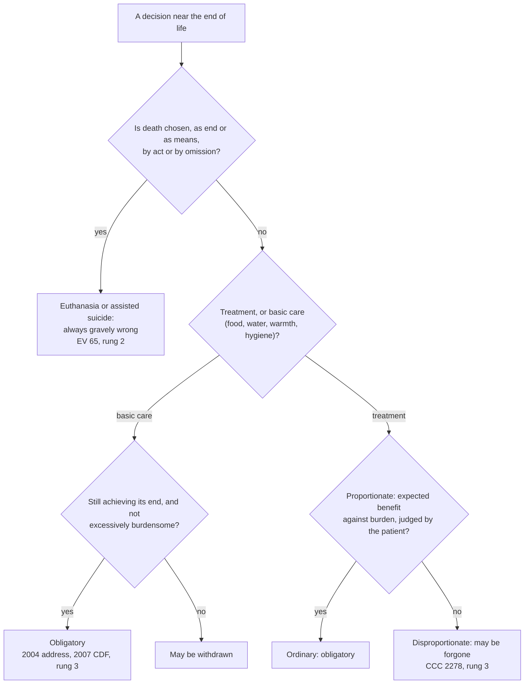

# Moral Theology · Lesson 5.3: Euthanasia and the end of life

> ⏱ ~15 min · Module 5: Life · Builds on: [5.1 The inviolability of innocent life](05-01-the-inviolability-of-innocent-life.md), [4.2 Double effect and cooperation as Catholic method](04-02-double-effect-and-cooperation-as-catholic-method.md), [4.5 Describing the object](04-05-describing-the-object.md) · Unlocks: [5.4 The death penalty and CCC 2267](05-04-the-death-penalty-and-ccc-2267.md)

## Why this matters

The Church forbids euthanasia absolutely. She also teaches that no one is bound to use every available treatment, and that pain may be relieved even at the risk of shortening life. Critics call this incoherent: the patient ends up dead in every case. Clinicians ask for something more practical: which of the decisions they make every week does the teaching allow? This lesson gives you the line the Church draws, the tool for applying it (proportionate and disproportionate means), and the one place where recent teaching narrowed that tool: nutrition and hydration.

## The idea

Three decisions can end in the same death.

1. A physician injects a lethal drug to end a patient's suffering.
2. A patient declines a third round of surgery that offers little and costs him greatly, and dies of his disease.
3. A nurse raises a morphine dose to control pain, knowing it may shorten life.

The teaching forbids the first and permits the second and third. The line does **not** run between acting and omitting. An omission can be euthanasia, and a positive act (the dose) can be licit. The line runs through **what is chosen**. In (1) death is the means of ending suffering. In (2) what is chosen is freedom from a burden, and the death, caused by the disease, is accepted. In (3) what is chosen is relief, and the risk of death is a side effect ([double effect](../reference.md#double-effect), from [4.2](04-02-double-effect-and-cooperation-as-catholic-method.md)). It is 5.1's norm again. You may never choose the death of an innocent person, your own included. You need not choose every means of postponing it.

## Source

Aquinas, *Summa Theologiae* II-II q.64 a.5, reply to Objection 3 (English Dominican Province). The objection had argued that one may kill oneself to avoid a greater evil, "an unhappy life":

> Man is made master of himself through his free-will: wherefore he can lawfully dispose of himself as to those matters which pertain to this life which is ruled by man's free-will. But the passage from this life to another and happier one is subject not to man's free-will but to the power of God. Hence it is not lawful for man to take his own life that he may pass to a happier life, nor that he may escape any unhappiness whatsoever of the present life.

Read the two halves. **"Master of himself"** grants a real sphere of self-disposal. A patient's authority to refuse burdensome treatment lives here, and the modern documents keep that decision with the patient. **"Subject not to man's free-will but to the power of God"** removes one thing from that sphere: the passage out of life itself. And **"any unhappiness whatsoever"** closes the door on the obvious rejoinder that *this* suffering is extreme enough. The *respondeo* adds the ground: life is God's gift and subject to him, "Who kills and makes to live" (Deuteronomy 32:39). Euthanasia requested by the patient is this act done by another's hand. So *Evangelium Vitae* 65 says it carries the malice of suicide or of murder, depending on the circumstances.

## The argument

1. It is always gravely wrong to choose the death of an innocent human being, as an end or as a means ([5.1](05-01-the-inviolability-of-innocent-life.md); EV 57). The patient, including the patient who asks, is innocent in that sense.
2. **Euthanasia** is an act *or omission* that of itself and by intention causes death, in order to eliminate suffering (EV 65, taking the definition from the CDF's *Declaration on Euthanasia*, 5 May 1980, part II). *In words:* the method and the intention define it, not the medical setting. The 1980 English text and CCC 2277 read "of itself *or* by intention"; EV 65's English reads "and". Build nothing on the conjunction.
3. ∴ Euthanasia is always gravely wrong, whatever the motive, and consent does not change this. *Samaritanus Bonus* (CDF, dated 14 July 2020, made public September 2020) adds that it is intrinsically evil (part V.1).
4. Yet there is a duty to preserve life, and it binds only to **ordinary** means: means that impose no extraordinary burden on oneself or others. That is Pius XII's formulation, in his address to anesthesiologists of 24 November 1957. The distinction is usually traced to sixteenth-century Dominican moralists. The 1980 Declaration (part IV) prefers the words **proportionate / disproportionate** and supplies the test: weigh the treatment's type, complexity, risk, cost and availability against the expected result, given the patient's state and resources.
5. Forgoing disproportionate means is therefore not suicide or euthanasia. It accepts the human condition in the face of death (EV 65; CCC 2278). *In words:* one does not will death here, one accepts that one cannot prevent it.
6. The decision belongs to the patient if competent, otherwise to those entitled to speak for him (CCC 2278; Declaration IV). The "normal care due to the sick" may never be interrupted (Declaration IV; CCC 2279).
7. Pain relief that risks shortening life is licit when death is neither end nor means but foreseen and tolerated (CCC 2279). Pius XII said so in a *different* 1957 address, of 24 February (cited at EV 65, n. 79). Depriving the dying of consciousness needs a serious reason, since they must be able to prepare to meet God (EV 65). *Samaritanus Bonus* V.7 extends the permission to deep palliative sedation even where it hastens death, provided the intention to kill is excluded.
8. **Nutrition and hydration**, even by tube, are a natural means of preserving life, not a medical act. They are "in principle, ordinary and proportionate", and so obligatory for as long as they achieve their end of nourishing the patient. So said John Paul II's address of 20 March 2004 (§4) and the CDF's responses to the US bishops of 1 August 2007, which apply this to the "permanent vegetative state". The CDF's accompanying commentary names the exceptions: feeding physically impossible (remote places, extreme poverty); the body no longer assimilates it; in rare cases, excessive burden or significant discomfort.

**Mark the levels.** Ladder: [the levels](../reference.md#the-levels-in-moral-theology), from [`fundamental-theology` 4.4](../../fundamental-theology/lessons/04-04-the-ladder-of-doctrinal-authority.md).

- **The wrongness of euthanasia is definitive (rung 2 on the CDF's sorting).** EV 65 uses 5.1's confirmation formula. The pope confirms, in communion with the bishops, a doctrine taught by the ordinary and universal magisterium. The CDF's 1998 *Doctrinal Commentary* on the *Professio fidei* (§11) discusses it among the second paragraph's examples, truths connected with revelation by logical necessity. It adds at once that Scripture excludes the self-determination euthanasia presupposes, and some theologians read that sentence as leaving room for rung 1. *Samaritanus Bonus* calls it definitive teaching. The firmness of assent is the same at rungs 1 and 2. What is not open is rung 3.
- **Forgoing disproportionate means, and pain relief at the risk of life: authentic ordinary magisterium (rung 3),** constant since Pius XII and restated in 1980, 1995 and the Catechism. No act proposes them as definitive.
- **Nutrition and hydration as "in principle" obligatory, the vegetative state included: rung 3.** These are CDF responses approved by Benedict XVI in the ordinary form, following a papal address. Before 2004 the application was argued among Catholics. After 2007 it is not a free question (the *Humani Generis* principle, fundamental-theology 4.4).
- **Whether *this* treatment is disproportionate for *this* patient is no magisterial question at all.** The Declaration hands it to the conscience of the patient, of those who speak for him, and of the physicians.

## The rule

Pain relief and sedation sit on the "no" branch of the first question. They are licit when relief is what is chosen and the risk of death is tolerated (CCC 2279).

## Worked examples

**Example 1: a clean case.** A competent patient with advanced amyotrophic lateral sclerosis (ALS) has been on a ventilator for months. He can no longer speak. He needs constant suctioning, and the machine will not reverse the disease. He asks for it to be withdrawn, with sedation to spare him the distress of breathlessness. Run the tree. Question 1: what he chooses is freedom from a means he judges gravely burdensome. His death will come from the disease, which the machine has only been holding off. Question 2: ventilation is **treatment**, not basic care. Question 3: the burden is great and ongoing, and the benefit is prolongation without improvement. The patient is the one entitled to weigh that, and it is exactly the judgment Pius XII's 1957 address concerned. Verdict: **licit to withdraw.** Sedation aimed at the distress, and not at death, is licit too (CCC 2279; SB V.7). Now the minimal pair. Change one thing: the same withdrawal is requested *so that he will die* before his savings run out. The ventilator, the physician's hands and the physical sequence are all the same, but now death is the means. The act becomes euthanasia by omission. The permission rested on the burden of the means, never on the wish to die.

**Example 2: where it strains.** A woman has been in a vegetative state for three years after cardiac arrest. She breathes unaided and is fed by a gastrostomy tube. Her family asks for the feeding to stop. First give the pre-2004 argument at its strength, as its Catholic defenders made it. Pius XII grounded the ordinary-means duty in life's subordination to spiritual ends. A patient who can never again know, love or pray gains no benefit the tradition cared about. Tube-feeding is placed surgically and managed clinically, so it is treatment. So it may be disproportionate, and stopping it merely allows the underlying catastrophe to run its course. The 2004 and 2007 reply denies the premises, not the method. Feeding is a natural means, not therapy. Its benefit is nourishment, which it achieves. And since the only cause of death on withdrawal is starvation, stopping it knowingly in order to end her life is "euthanasia by omission" (2004, §4). Verdict: **continue the feeding**, unless one of the CDF's named exceptions applies. Where it strains: *Samaritanus Bonus* V.8 repeats that such measures can become disproportionate in some cases. How rare "rare" is, in advanced dementia or at the very end of life, is left to prudence.

## Watch out

- **"Letting die is always fine; killing is always wrong."** The line is not act versus omission. An omission chosen to cause death is euthanasia (EV 65). A dose that risks death can be licit (CCC 2279).
- **Understating EV 65: "Church teaching on euthanasia is a strong prudential position."** It is confirmed as ordinary universal teaching and sorted as definitive. Treating it as rung 3 is an exegetical error.
- **Overstating the 2007 responses: "defined," or "rung 2."** They are CDF responses approved in ordinary form: rung 3. They are binding, but not definitive.
- **Promoting the application with the principle.** "Disproportionate means may be forgone" is rung 3. "Dialysis is disproportionate for Mrs. K." carries no level. It is her judgment, formed by the criteria.
- **"Extraordinary" means "high-tech."** A simple treatment can be disproportionate for one patient (unbearable burden, no benefit), and a complex one can be ordinary for another. The test is the relation of burden to benefit, not the equipment.

## One-liner

> Never choose death, by act or omission (EV 65, definitive); never be bound to disproportionate means (rung 3); relieve pain even at risk of life when death is not what you choose; and keep feeding, since food and water are care, not treatment (2007, rung 3).

## Problems

**P1 (🟢)** *(Exegetical)* Three **invented** cases. For each, say whether the decision is **obligatory care declined** (and so wrong), a **licit forgoing of disproportionate means**, or **licit withdrawal of basic care**, and name the deciding fact and the text. **Two sentences per case.**

1. A 40-year-old, otherwise healthy, has a bacterial pneumonia that a week of antibiotics will almost certainly cure. He refuses them because, he says, he is tired of living.
2. A 79-year-old with end-stage heart failure declines a third open-heart operation. It offers a small chance of modest extension, and it means weeks in intensive care.
3. A patient in the last days of multi-organ failure has a feeding tube. His gut no longer absorbs the feeds, and they are pooling and causing vomiting.

**P2 (🟡)** *(Exegetical)* Give each claim its level and **name the act that fixes it**, or say that none does. **One or two sentences each.**

1. Euthanasia is a grave violation of the law of God, since it is the deliberate killing of a human person.
2. Artificial nutrition and hydration must, in principle, be given to a patient in a permanent vegetative state.
3. From a (fictional) Catholic hospital's policy manual: "Tube feeding of a patient in a vegetative state will be reviewed by the ethics committee after twelve months."
4. Painkillers may be used to relieve the dying even at the risk of shortening life, if death is neither intended nor a means.

**P3 (🔴)** *(Exegetical (a) · Exegetical (b))* An **invented** memo to a hospital ethics committee reads:

> Our Catholic colleagues already remove ventilators knowing the patient will die. The patient ends up just as dead as with a lethal injection, which would be quicker and kinder. As Rachels showed, killing and letting die have no moral difference in themselves. The Catholic line is a squeamish distinction between doing and allowing.

(a) Name the premise about the Catholic position that the memo gets wrong. Say what the teaching's line actually rests on, citing the text. (b) Name the point on which EV 65 *agrees* with Rachels. **Three sentences per part.**

Solutions

**P1** *(Exegetical)*

**Must hit, strict:**

1. **Obligatory care declined: wrong.** Antibiotics here are cheap, low-burden and highly effective, so they are ordinary means. Everyone has a duty to care for his health (Declaration IV; Pius XII 1957). Declining them *in order to* die is an omission that of itself and by intention causes death, which is suicide by omission (EV 65's definition; q.64 a.5). His guilt may be reduced if despair or depression is at work (Declaration II), but the act's character does not change.
2. **Licit forgoing of disproportionate means.** The burden (weeks in intensive care, surgical risk) is out of proportion to a small, modest benefit. The patient is the one entitled to weigh it (Declaration IV; CCC 2278). Refusal is not suicide (EV 65).
3. **Licit withdrawal of basic care.** Food and water are obligatory only while they achieve their end. When the body cannot assimilate them and they cause harm, they may be stopped (2007 CDF commentary; SB V.3). Death then comes from the disease, not from starvation.

**Wrong turns:** calling case 1 "his right to refuse treatment". The tradition's permission covers disproportionate means, and these are not. Calling case 3 "euthanasia by omission" on the strength of the 2004 address. The address makes the obligation hold only while feeding attains its finality. Treating case 2 as suspect because death follows. Death follows in the licit cases too.

**Model answer:** as above.

**P2** *(Exegetical)*

**Must hit, strict:**

1. **Definitive teaching: rung 2 on the CDF's sorting.** EV 65 confirms it as taught by the ordinary and universal magisterium. The 1998 *Doctrinal Commentary* §11 lists it among the second paragraph's examples, and *Samaritanus Bonus* V.1 calls it definitive. Credit for noting that some theologians read §11 as leaving room for rung 1. The firmness of assent is the same.
2. **Authentic ordinary magisterium (rung 3).** The act is the CDF's 2007 responses, approved by Benedict XVI in ordinary form, following John Paul II's 2004 address. "In principle" leaves the named exceptions.
3. **No magisterial level.** It is an institutional rule. It binds staff as policy, not consciences as doctrine. Note too that the teaching sets no time limit: the 2004 address rejects prolonged duration as a ground for stopping.
4. **Rung 3.** Pius XII (24 February 1957), the 1980 Declaration III, EV 65 and CCC 2279 teach it. It is constant but not proposed as definitive.

**Wrong turns:** putting 1 at rung 3 because it appears in an encyclical, since the formula and the commentary override the genre's default. Calling 1 "defined". Putting 2 at rung 2 because it is "about killing". Treating 3 as carrying the Church's authority because the hospital is Catholic.

**Model answer:** as above.

**P3** *(Exegetical (a) · Exegetical (b))*

**Must hit, strict (a):** the memo assumes the Catholic line is **doing versus allowing**. It is not. It is **what is chosen**: death as end or means, against relief from a disproportionate burden with death accepted (CCC 2278; EV 65). The ventilator withdrawal is licit *because* the means is disproportionate and death is not chosen. Withdrawn *in order that* the patient die, it would itself be euthanasia.

**Must hit, strict (b):** EV 65 defines euthanasia as an act **or omission**. So it agrees that bare omission does not make a death innocent: letting die *to bring about death* is as wrong as killing. That is Rachels's Jones case.

**Wrong turns:** defending the act/omission distinction as such. This concedes the memo's framing and contradicts EV 65. Answering by consequences ("injection is not kinder"), which misses the structural error. For the secular debate on doing and allowing, see ethics 3.1.

**Model answer:** (a) The memo assumes the Church permits letting die and forbids killing, but EV 65 and CCC 2278 draw the line by the object of choice. Forgoing a disproportionate means accepts a death one cannot prevent, while euthanasia chooses death as the means to end suffering, by act or omission. A ventilator withdrawn in order to kill would be forbidden too. (b) Because EV 65 includes omissions, the Church agrees with Rachels that allowing a death one intends is no better than causing it. Jones is guilty on Catholic principles. What Rachels's pair cannot touch is a withdrawal in which death is not intended at all.

## Flashback

**From Lesson [5.1](05-01-the-inviolability-of-innocent-life.md) (The inviolability of innocent life):** *(Exegetical.)* Exodus 22:2–3 (Douay–Rheims):

> If a thief be found breaking open a house or undermining it, and be wounded so as to die: he that slew him shall not be guilty of blood. But if he did this when the sun is risen, he hath committed murder, and he shall die.

(a) Verse 3's "when the sun is risen" sets up a contrast with a break-in in the dark. Using 5.1's rule (is the death chosen? is the one killed an unjust aggressor? was more force used than necessary?), explain why the same killing of a thief is acquitted in one case and called murder in the other. (b) Someone argues: "This verse shows the commandment has exceptions: here God permits killing." Correct the argument from the Catechism. **Two sentences per part.**

Solution

**Must hit, strict (a):** the thief is equally guilty in both verses, so **his guilt is not what decides**. What decides is **necessity against a present threat**. In the dark the householder cannot tell whether the intruder means to kill, or stop him any other way; the intruder is an unjust aggressor, and the blow is defense with the death beside the intention (q.64 a.7). By daylight the thief can be seen, identified and brought to justice. Killing him then uses **more force than necessary** (q.64 a.7), or amounts to a private punishment, which belongs only to public authority (q.64 a.3). This is 5.1's reading of the verse through its categories, not a claim about the verse's original setting.

**Must hit, strict (b):** CCC 2263 says legitimate defense is **not an exception** to the prohibition against murdering the innocent. The acquitted killing falls **outside** the norm: the thief is not innocent in the sense of "not harming", and his death is not what the defender chooses. Verse 3's "murder" shows the norm keeping its full force once defense no longer covers the act.

**Wrong turns:** saying the night thief is guilty and the day thief innocent; "innocent" here means not engaged in unjust aggression, and guilt of theft is the same in both. Reading verse 2 as permission to kill in defense of property as such, which neither the verse nor 5.1 claims. Accepting "exception" as a harmless word, when the "outside, not exception" structure is what keeps the norm absolute.

**Model answer:** (a) In the dark the householder faces an intruder whose aim he cannot know and cannot stop by lesser means, so the killing is defense against an unjust aggressor, with the death beside the intention. By day the thief can be recognized and brought to justice, so killing him is more force than necessary, or private punishment, and the verse calls it murder. (b) CCC 2263 denies that legitimate defense is an exception: it falls outside the ban because the attacker is not innocent and his death is not chosen. The word "murder" in verse 3 shows the ban on killing is untouched wherever defense does not apply.

## Connections

- **Backward:** [5.1](05-01-the-inviolability-of-innocent-life.md) supplies the norm and the confirmation formula. [4.2](04-02-double-effect-and-cooperation-as-catholic-method.md) supplies the conditions behind pain relief. [4.5](04-05-describing-the-object.md) supplies the debate about describing the [moral object](../reference.md#the-moral-object) that Example 1's minimal pair turns on. [Formal and material cooperation](../reference.md#formal-and-material-cooperation) ([3.5](03-05-social-sin-and-cooperation-in-the-sins-of-others.md), 4.2) governs clinicians and chaplains near legalized euthanasia (SB V.1, V.11).
- **Forward:** [5.4](05-04-the-death-penalty-and-ccc-2267.md) takes q.64 into the one case where the person killed is not innocent. Boss problem 5 sets a clinical case on this lesson's tools. [`sacraments-and-liturgy`](../../sacraments-and-liturgy/syllabus.md) owns anointing and viaticum, which SB V.11 withholds from someone persisting in a request for euthanasia.
- **Sideways:** [`ethics` 3.1](../../ethics/lessons/03-01-doing-and-allowing.md) gives Rachels's argument and the secular defenses of the distinction. The Catholic reply relocates the line rather than defending it. [`ethics` 3.2](../../ethics/lessons/03-02-the-doctrine-of-double-effect.md) treats the pain-relief case as secular double effect: one principle in two settings. Cards: [euthanasia](../reference.md#euthanasia), [proportionate and disproportionate means](../reference.md#proportionate-and-disproportionate-means), [artificial nutrition and hydration](../reference.md#artificial-nutrition-and-hydration), [pain relief and palliative sedation](../reference.md#pain-relief-and-palliative-sedation).
