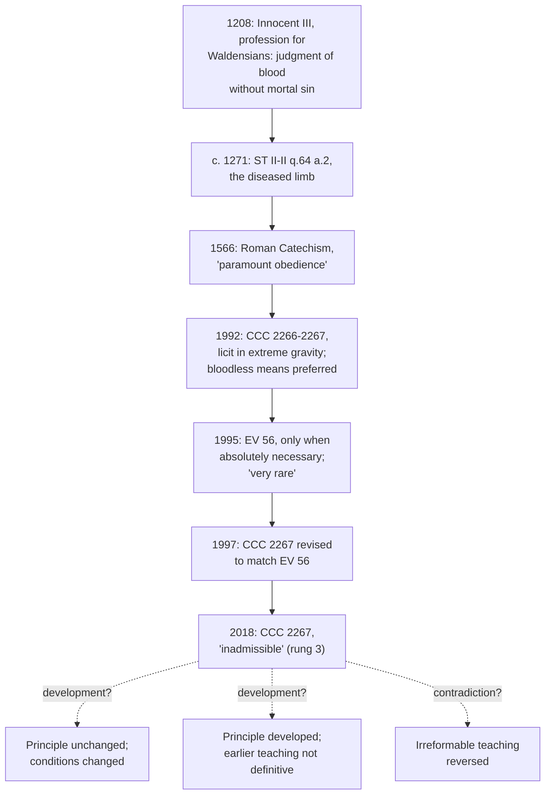

# Moral Theology · Lesson 5.4: The death penalty and CCC 2267

> ⏱ ~15 min · Module 5: Life · Builds on: [5.1 The inviolability of innocent life](05-01-the-inviolability-of-innocent-life.md), [`fundamental-theology` 5.2 Newman's theory of development](../../fundamental-theology/lessons/05-02-newmans-theory-of-development.md) · Unlocks: [5.5 Assisted reproduction and the embryo](05-05-assisted-reproduction-and-the-embryo.md)

## Why this matters

[5.1](05-01-the-inviolability-of-innocent-life.md) fixed a norm about the **innocent**. This lesson is about the guilty. For most of its history the Church taught that public authority may execute a grave criminal. Since 2018 the Catechism says the death penalty is **"inadmissible"**. Some Catholic theologians call that a development, and others call it a contradiction. It is the course's sharpest test of the [levels](../reference.md#the-levels-in-moral-theology): the old teaching, the new text and the dispute must each be marked exactly. This lesson does not decide between the readings.

## The idea

Two questions are easily run together.

- **The question of principle.** Can the state *ever* rightly take a criminal's life? Is execution the kind of act that could be just?
- **The question of application.** *Should* this state, with these prisons, execute anyone now?

For eight centuries the tradition said yes to the first and left the second to rulers. From 1995 the popes answered the second more and more firmly: no, almost never. The 2018 text gives reasons, the person's dignity among them, that seem to reach back into the first question. Whether they actually do is the whole dispute.

## Source

Aquinas, *Summa Theologiae* II-II q.64 a.2, "Whether it is lawful to kill sinners?", *respondeo* (English Dominican Province):

> Now every part is directed to the whole, as imperfect to perfect, wherefore every part is naturally for the sake of the whole. For this reason we observe that if the health of the whole body demands the excision of a member, through its being decayed or infectious to the other members, it will be both praiseworthy and advantageous to have it cut away. Now every individual person is compared to the whole community, as part to whole. Therefore if a man be dangerous and infectious to the community, on account of some sin, it is praiseworthy and advantageous that he be killed in order to safeguard the common good, since "a little leaven corrupteth the whole lump" (1 Corinthians 5:6).

Look at three words. **"Dangerous and infectious"**: the justification is harm to the community, not simply guilt. **"Common good"**: the killing serves the whole, and a.3 reserves it to public authority. **"Part to whole"** carries the analogy, and the analogy has limits. A person is not *only* a part; a.6 insisted that "in himself" every man is to be loved. The reply to Objection 3 supplies what makes the exception possible:

> Hence, although it be evil in itself to kill a man so long as he preserve his dignity, yet it may be good to kill a man who has sinned, even as it is to kill a beast.

By grave sin, Aquinas says, a man "falls away from the dignity of his manhood". In 2018 the Catechism affirms the opposite: dignity is not lost even after very serious crimes.

## The argument

**Aquinas's case, reconstructed.**

1. A part exists for the sake of its whole (q.64 a.2).
2. Each person is related to the political community as part to whole.
3. When a member endangers the whole body, cutting it off is praiseworthy.
4. By grave sin a man loses the dignity that otherwise makes killing him evil in itself (ad 3).
5. Only public authority has care of the common good, so only it may do this (a.3).
6. ∴ Public authority may lawfully execute a criminal who is dangerous to the community.

*In words:* the guilty man's life lacks the innocent's protection, and the ruler who guards the whole may remove him.

**The tradition's acceptance.** In a profession of faith prescribed for Durand of Huesca and his Waldensian companions (letter *Eius exemplo*, 18 December 1208), Innocent III required them to affirm that the secular power can exercise a "judgment of blood" without mortal sin, provided it proceeds by judgment and not in hatred. The *Roman Catechism* (1566), issued under Pius V at Trent's direction, puts it more strongly (Donovan's translation, 1829):

> The use of the civil sword, when wielded by the hand of justice, far from involving the crime of murder, is an act of paramount obedience to this commandment which prohibits murder.

**The narrowing, 1992–1997.** The 1992 Catechism said that traditional teaching recognized public authority's right to punish with penalties proportionate to the crime, "not excluding, in cases of extreme gravity, the death penalty" (CCC 2266 in the first edition, as reported in secondary sources). It added that if bloodless means are sufficient, authority must limit itself to them. *Evangelium Vitae* 56 (1995) kept that bloodless-means principle and kept redress of the disorder as the primary purpose of punishment. It then judged that authority should not go as far as execution except where it is absolutely necessary, meaning there is no other way to defend society. It added that because penal systems have steadily improved, such cases are today "very rare, if not practically non-existent". The Latin typical edition of the Catechism (1997) wrote that judgment into CCC 2267. In the CDF's summary, that text no longer presents execution as a penalty proportionate to the crime. It allows it only as the sole practicable way to defend lives. *In words:* the principle was kept, and its use was confined almost to nothing.

**The 2018 revision.** On 11 May 2018 Francis approved a new CCC 2267. The CDF's rescript is dated 1 August and was published on 2 August. In paraphrase, the text says: execution was long considered an appropriate, if extreme, response. Awareness has since grown that dignity is not lost even after very serious crimes. There is a new understanding of what penal sanctions are for. Detention now protects citizens without taking away the guilty person's chance of redemption. Therefore, "in the light of the Gospel", the death penalty is "inadmissible" as an attack on the inviolability and dignity of the person, and the Church works for its abolition worldwide.

The CDF's **letter to bishops**, of the same date, calls the revision an authentic development "not in contradiction" with prior teaching (§8), citing Vincent of Lérins. It says earlier teaching can be explained by the social context it was given in, when punishment was understood differently and it was harder to stop a criminal from striking again. It also says the duty of authority to defend citizens stands, citing CCC 2265–2266 (§7).

**The dispute.** Neither side here is a straw man.

- **The contradiction worry** (Edward Feser and Joseph Bessette, *By Man Shall His Blood Be Shed*, 2017, paraphrased). The legitimacy of capital punishment in principle is taught by Scripture (Genesis 9:6, Romans 13:4), by the Fathers and Doctors, and by popes without a break. So it is irreformable, and a Church that reversed it would admit it had erred in morals. Whether to use the penalty is a prudential matter, and on that Catholics may argue. Written before 2018, the book implies that "inadmissible" preserves continuity only if it is read as a judgment about present conditions.
- **The development case** (E. Christian Brugger, *Capital Punishment and Roman Catholic Moral Tradition*, 2003, paraphrased in outline). The tradition's acceptance was authoritative but never proposed definitively. *Evangelium Vitae* and the 1997 text had already moved the justification away from retribution and toward the defense of society. On the logic of that shift, deliberately killing someone who is no longer a threat can be excluded in principle. So a development toward holding the penalty wrong in itself is possible.

They agree on the history. They disagree about **the level of the old teaching** and **what "inadmissible" asserts**.

**Newman's notes applied.** Reload them from [`fundamental-theology` 5.2](../../fundamental-theology/lessons/05-02-newmans-theory-of-development.md): they are evidence to be weighed, not a proof. The development reading appeals to **anticipation** (*Evangelium Vitae* 56 and 1997 point toward 2018) and to **conservative action**, since the duty to defend citizens and to punish proportionately is kept. The contradiction reading turns **conservative action** around: a practice once called "paramount obedience" to the fifth commandment is now called an attack on the person. It also appeals to **continuity of principles**, by asking whether premise 4 has been developed or simply reversed.

**Mark the levels.** Use the [ladder](../../fundamental-theology/lessons/04-04-the-ladder-of-doctrinal-authority.md) and [reading a document's weight](../../fundamental-theology/lessons/04-05-reading-a-documents-weight.md).

- **The 2018 text of CCC 2267 is authentic ordinary magisterium (rung 3).** It is a papal act inserting a text into the Catechism by rescript. It is not a solemn definition and not an infallible act. Religious submission is owed to it. What that submission is submission *to*, a principle or a judgment about present conditions, is exactly what the two readings dispute.
- **The earlier acceptance was never solemnly defined.** No council or *ex cathedra* act defined it. Whether the ordinary universal magisterium, together with Scripture, taught it as definitive is **disputed**: Feser and Bessette say yes, Brugger says no. Canon 749 §3 is the default-down rule both sides have to engage.
- ***Evangelium Vitae* 56 and the 1997 text are rung 3.** Their "very rare, if not practically non-existent" is a prudential judgment about facts. *EV* 56 does not fall under the confirming formula of *EV* 57.
- **The duty of authority to defend citizens and to punish in proportion to the crime (CCC 2265–2266) is rung 3, and unchanged.**
- **Whether execution is [intrinsically evil](../reference.md#intrinsically-evil-acts).** Before 2018 this was the tradition's position. The 2018 text does not use the phrase. Whether "inadmissible" implies it is half of the live dispute.

## Timeline

## Worked examples

**Example 1: marking the 2018 text.** Run the procedure from [`fundamental-theology` 4.4](../../fundamental-theology/lessons/04-04-the-ladder-of-doctrinal-authority.md). *The act:* a papal rescript approving a Catechism paragraph, with an explanatory CDF letter. *What it proposes it as:* Church teaching, "in the light of the Gospel", with no definitional formula and no appeal to the bishops' unanimous teaching of the kind found in *EV* 57. *Default down:* rung 3. "Infallible" overstates it; "a papal opinion Catholics may ignore" understates it.

**Example 2: where the readings split.** Take an invented case. An island territory has no secure prison, and a convicted multiple murderer has twice escaped and killed again. Under the 1997 text the case is **not excluded**: this may be the "only practicable way" to defend lives. Under the 2018 text, the reading turns on how you take "inadmissible".

- **Conditions reading.** The text's stated reasons include effective detention, and the letter says execution "becomes unnecessary" given modern systems (§7). Here the stated conditions fail, so the judgment may not apply.
- **Principle reading.** The first reason given, dignity that survives the crime, does not depend on prisons. So execution is inadmissible here as well, and the state must find another way.

The text supports each reading somewhere, which is why the case is hard. Brugger could still allow killing the escapee *in defense* ([legitimate defense](../reference.md#legitimate-defense)) while denying that it may be *punishment*.

## Watch out

- **Overstating the 2018 text:** "Infallibly, the death penalty is intrinsically evil." The text is rung 3, and it does not say "intrinsically evil".
- **Understating it:** "Just a prudential opinion, so Catholics may ignore it." Religious submission is owed to rung 3, whichever reading of "inadmissible" you take.
- **Overstating the old teaching:** "Trent defined it." The *Roman Catechism* is not a conciliar decree, and no act defined the licitness of the death penalty. Its level is exactly what the two sides dispute.
- **Collapsing the question of principle into application.** "The popes say it is never needed now" answers the second question. It does not settle the first.
- **Confusing this norm with 5.1's.** *EV* 57 concerns the *innocent*; *EV* 56 and *EV* 57 carry different levels.

## One-liner

> The Church long allowed the state to execute grave criminals, narrowed that almost to nothing (EV 56, 1997), and in 2018 called it "inadmissible" at rung 3. Development or contradiction turns on the old teaching's level and on what "inadmissible" asserts, and Catholics dispute both.

## Problems

**P1 (🟢)** *(Exegetical)* Genesis 9:5–6 and Romans 13:4 (Douay–Rheims):

> For I will require the blood of your lives at the hand of every beast, and at the hand of man, at the hand of every man, and of his brother, will I require the life of man. Whosoever shall shed man's blood, his blood shall be shed: for man was made to the image of God.
>
> For he is God's minister to thee, for good. But if thou do that which is evil, fear: for he beareth not the sword in vain. For he is God's minister: an avenger to execute wrath upon him that doth evil.

(a) What reason does Genesis 9:6 give for the penalty, and why do both sides of the 2018 dispute cite that clause? (b) Which words in Romans 13:4 give the ruler's punishment a retributive rather than purely defensive character? (c) The Hebrew of Genesis 9:6 has "*by man* shall his blood be shed", the phrase Feser and Bessette take for their title, and the Douay (following the Vulgate) lacks it. What reading does the missing phrase leave open? **Two sentences per part.**

**P2 (🟡)** *(Exegetical)* Two positions, invented for this problem and paraphrased:

> **A.** If "inadmissible" means the death penalty is wrong in principle, the 2018 text contradicts the Church, because Scripture and the unbroken tradition taught that it is licit in principle.
>
> **B.** "Inadmissible" does mean wrong in principle, and there is no contradiction: the old acceptance was authoritative but was never proposed as definitive, so it could be revised.

Both A and B read "inadmissible" the same way. (a) Name the single premise on which they disagree. (b) Say what evidence would move each side, and which canon both must engage. **150 words or fewer.**

**P3 (🔴)** *(Exegetical)* Give each claim its level and **name the act that fixes it**. **One or two sentences each.**

1. Cases in which executing an offender is absolutely necessary are today very rare, if not practically non-existent (CCC 2267, 1997 text).
2. The magistrate's use of the civil sword, wielded by justice, is obedience to the fifth commandment (*Roman Catechism*, 1566).
3. If bloodless means are sufficient to defend lives and public order, public authority must limit itself to them (*Evangelium Vitae* 56).

Solutions

**P1** *(Exegetical (a) · Exegetical (b) · Exegetical (c))*

**Must hit, strict (a):** the reason is "**for man was made to the image of God**". The penalty is grounded in the dignity of the *victim*. Retentionists read this as dignity demanding a proportionate response to murder. Abolitionist readers point out that the offender bears the same image, which is the 2018 text's ground ("dignity … not lost").

**Must hit, strict (b):** "**an avenger to execute wrath upon him that doth evil**", together with "**beareth not the sword in vain**". The ruler punishes *evil done*, not only a future threat. This is the retributive strand that *EV* 56 kept as punishment's primary purpose (redressing disorder).

**Must hit, strict (c):** without "by man", the verse can be read as a statement of divine retribution ("his blood *shall be* shed", by God or by events) rather than as a mandate for human courts. With it, the verse more readily authorizes human agents.

**Wrong turns:** treating Genesis 9:6 as a command addressed to Israel's courts only, when it is given to Noah, and so to all humanity, which is why the tradition reads it as natural law. Saying that Romans 13 "only" concerns defense. Claiming that the Douay's reading settles the dispute either way.

**Model answer:** (a) The shedder's blood is required "for man was made to the image of God", so the penalty answers an offense against the image. Both sides cite the clause, because the victim bears the image and so does the offender. (b) "Avenger to execute wrath upon him that doth evil" looks back to the evil done, which is retribution, and "the sword" names the means. (c) Without "by man", "his blood shall be shed" could be a prophecy of divine justice rather than a warrant for courts, and the title's phrase is the stronger warrant.

**P2** *(Exegetical)*

**Must hit, strict:** (a) The crux is **whether the licitness of the death penalty in principle was proposed definitively**, by the ordinary universal magisterium, or as revealed in Scripture. A affirms it. B denies it. (b) *Moves A:* evidence that the bishops and popes taught it as *to be held*, not merely as the accepted view. Constancy alone does not show definitive proposal. *Moves B:* evidence that Genesis 9:6 or Romans 13:4 *assert* licitness as revealed, or that the constant teaching was proposed as binding. Both must engage **can. 749 §3**: nothing counts as infallibly defined unless that is manifestly established.

**Wrong turns:** naming the crux as "what inadmissible means". Both A and B read it the same way, as the stem says. Giving a verdict, when none was asked. Calling constancy of teaching proof that it was proposed definitively.

**Model answer:** A and B differ only on whether the Church ever proposed the death penalty's licitness in principle as definitively to be held. A says Scripture and the unbroken tradition did so. B says the teaching, however constant, was authentic but not definitive. A would be moved by showing that the tradition's many statements accepted the practice without binding the faithful to it. B would be moved by showing that the popes and bishops proposed it as something to be held, or that Scripture asserts it. Both must reckon with can. 749 §3.

**P3** *(Exegetical)*

**Must hit, strict:**

1. **Authentic ordinary magisterium (rung 3).** The act is the Catechism's Latin typical edition, promulgated by John Paul II in 1997, adopting *EV* 56. The content is a **prudential judgment of fact** about penal systems. It is not a doctrinal principle, and it is not definitive.
2. **Authentic teaching of its time (rung 3), not a conciliar definition.** The act is the catechism issued under Pius V at the Council of Trent's direction. Trent did not define the matter. Whether this and the rest of the tradition together reach definitive status is the disputed question.
3. **Authentic ordinary magisterium (rung 3).** The act is the encyclical *Evangelium Vitae* (1995), restating the 1992 Catechism. *EV* 57's confirming formula does not reach it.

**Wrong turns:** "Trent taught it" for 2. Promoting 3 to rung 1 because it sits next to *EV* 57. Treating 1 as a doctrine about the penalty itself rather than an assessment of the facts.

**Model answer:** as above.

## Flashback

**From Lesson [5.2](05-02-abortion.md) (Abortion):** *(Exegetical, reconstruct.)* An **invented** seminar remark, written for this problem:

> "The Church admits it has never settled when the rational soul is infused, and Aquinas held it came weeks after conception. So the opinion that a five-day embryo is not yet a person is solidly probable, and a probabilist may follow a probable opinion that favours liberty."

Facts you need: the CDF's *Declaration on Procured Abortion* (1974), n.19, leaves the time of ensoulment open but holds the norm either way, arguing that the presence of a soul is at least probable and can never be disproved, and that to kill is then to accept the risk of killing a man; *Evangelium Vitae* 60 restates that the mere probability of a person would justify an absolute prohibition. (a) Reconstruct this **probability argument** in four numbered premises ending in the conclusion that directly killing the early embryo is gravely wrong. (b) Say which of your premises the remark attacks, and give the manuals' reply, with its level. **100 words or fewer in all.**

Solution

**Must hit, strict (a):** (1) Deliberately killing an innocent human person is always gravely wrong (EV 57). (2) To choose an act that may be such a killing, without being able to exclude it, is to accept the risk of killing a person, which is itself gravely wrong. (3) The early embryo's being a person is at least probable and cannot be disproved (n.19; EV 60). (4) So directly killing the early embryo is gravely wrong, however the ensoulment question is settled.

**Must hit, strict (b):** the remark grants (3) at least in part and attacks **(2)**: it treats a probable opinion that no person is present as licensing the act. The manuals' reply: probabilism covers doubts about **law**; when the doubt is one of **fact** and an innocent life is at stake, the safer course binds (the hunter unsure whether it is a deer or a man may not fire). Level: **common teaching of the manuals, not a magisterial act.**

**Wrong turns:** answering that "the Church teaches immediate ensoulment" (the timing is freely disputed; overstating). Resting premise (3) on genetics. Calling the law/fact distinction magisterial teaching. Conceding the remark because ensoulment is undefined, when the argument never needed it defined. Naming (1) as the target.

**Model answer:** (1) Directly killing an innocent person is always gravely wrong. (2) Knowingly choosing what may be such a killing accepts that risk and is also gravely wrong. (3) The early embryo is at least probably a person, and that cannot be disproved. (4) So directly killing it is gravely wrong. The remark attacks (2), treating a probable "no person" as a licence. The manuals answer that probabilism resolves doubts of law, not doubts of fact where innocent life is at stake; there one takes the safer course. That is common manual teaching, not a magisterial act.

## Connections

- **Backward:** [5.1](05-01-the-inviolability-of-innocent-life.md) fixed the norm about the innocent, and this lesson is the case that falls outside it. [`fundamental-theology` 5.2](../../fundamental-theology/lessons/05-02-newmans-theory-of-development.md) supplies Newman's notes, and [4.4](../../fundamental-theology/lessons/04-04-the-ladder-of-doctrinal-authority.md) supplies the ladder. [4.4](04-04-veritatis-splendor.md) defines what an intrinsically evil act is.
- **Forward:** Boss 5 asks for the verdict. [6.3](06-03-humanae-vitae-its-authority.md) runs the same "was it definitive?" question on *Humanae Vitae*. [`theology-of-debt`](../../theology-of-debt/syllabus.md) runs development against contradiction on usury.
- **Sideways:** [`philosophy-of-law`](../../philosophy-of-law/syllabus.md) 5.4 tests retribution and deterrence on capital punishment. [`catholic-social-teaching`](../../catholic-social-teaching/syllabus.md) owns public authority and war. Cards: [the death penalty and CCC 2267](../reference.md#the-death-penalty-and-ccc-2267), [the diseased limb argument](../reference.md#the-diseased-limb-argument), [Evangelium Vitae 56](../reference.md#evangelium-vitae-56).
