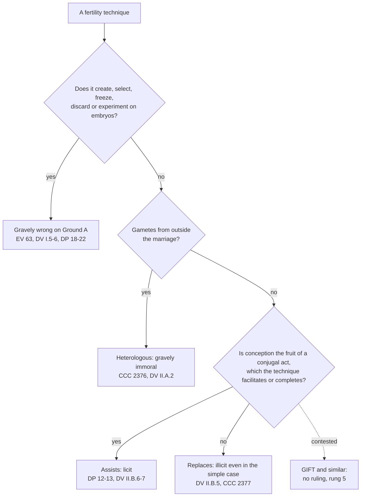

# Moral Theology · Lesson 5.5: Assisted reproduction and the embryo

> ⏱ ~15 min · Module 5: Life · Builds on: [5.1 The inviolability of innocent life](05-01-the-inviolability-of-innocent-life.md), [5.2 Abortion](05-02-abortion.md), [2.3 Intention and circumstances](02-03-intention-and-circumstances.md) · Unlocks: [6.1 The theology of the body and chastity](06-01-the-theology-of-the-body-and-chastity.md), [6.2 Humanae Vitae: the argument](06-02-humanae-vitae-the-argument.md)

## Why this matters

The Church's teaching on in vitro fertilization (IVF) rests on **two independent grounds**. One belongs to this module: the embryo's life. The other belongs to Module 6: the bond between procreation and the conjugal act. Running them together produces the commonest error: an IVF cycle that wastes no embryo must be fine. The CDF anticipated that inference and rejected it. This lesson teaches you to say which ground condemns which technique, at what level, and where the Magisterium has left a question open.

## The idea

Put two questions to any fertility technique.

1. **What happens to the embryos?** Are any created in order to be selected, frozen, discarded or used for research?
2. **Does it assist the conjugal act or replace it?** A technique that *assists* removes an obstacle, so that the spouses' own act of union can conceive a child. A technique that *replaces* the act makes conception the result of someone else's act in a laboratory.

The second question is answered whatever happens to the embryos. That is why a single-embryo IVF cycle with no freezing is still judged illicit, while surgery that repairs a blocked tube is praised.

The clinical facts needed are few. In IVF, eggs are fertilized in the laboratory and one or more embryos transferred; surplus embryos are commonly frozen. ICSI injects a single sperm into the egg. Preimplantation diagnosis biopsies embryos and transfers only those judged healthy ([`genetics` 2.4](../../genetics/lessons/02-04-chromosomal-mutations.md) describes the procedure).

## Source

Augustine, *On the Good of Marriage* 32 (*Nicene and Post-Nicene Fathers*, first series, vol. 3):

> Therefore the good of marriage throughout all nations and all men stands in the occasion of begetting, and faith of chastity: but, so far as pertains unto the People of God, also in the sanctity of the Sacrament, by reason of which it is unlawful for one who leaves her husband … to be married to another, so long as her husband lives, no not even for the sake of bearing children … But unto the faith of chastity pertains that saying, "The wife hath not power of her own body, but the husband: likewise also the husband hath not power of his own body, but the wife." … All these are goods, on account of which marriage is a good; offspring, faith, sacrament.

Read three phrases. **"Offspring, faith, sacrament"** is the triad of the goods of marriage, whose intimate connection *Donum Vitae* makes the basis of its analysis (II.B.4). **"No not even for the sake of bearing children"**: the good of offspring cannot be pursued by breaching the other goods. **"Hath not power of her own body, but the husband"** (1 Corinthians 7:4) is fidelity as mutual and exclusive. *Donum Vitae* restates it as the spouses' exclusive right to become father and mother **only through each other** (II.A.2).

## The argument

The two documents are [CDF instructions](../reference.md#donum-vitae-and-dignitas-personae). **_Donum Vitae_** (22 February 1987, signed by Cardinal Ratzinger) was approved by John Paul II, who ordered its publication. **_Dignitas Personae_** (dated 8 September 2008, approved by Benedict XVI) calls itself a doctrinal instruction and declares *Donum Vitae* fully valid in principles and judgments (DP 1).

**Ground A: the embryo.**

1. The human being is to be respected and treated as a person from conception (DV I.1; EV 60). *In words:* the teaching concerns how the embryo must be *treated*. Both documents decline to commit the Magisterium to a philosophical thesis about when the soul is present. EV 60 adds that the mere *probability* that a person is present would suffice to forbid killing the embryo.
2. So [the norm of 5.1](../reference.md#the-inviolability-of-innocent-life) covers the embryo. EV 63 applies the evaluation of abortion expressly to interventions that kill embryos, including research.
3. IVF as actually practised creates surplus embryos, freezes them, selects among them and discards some (DP 14–15). Preimplantation diagnosis is ordered to that selection (DP 22). "Embryo reduction" in a multiple pregnancy is direct abortion (DP 21).
4. ∴ Research on embryos, discard, selection and reduction are gravely wrong on Ground A. Freezing is also condemned: it exposes the embryo to death and deprives it of gestation (DV I.6; DP 18).

**Ground B: the inseparability of the two meanings.**

5. The conjugal act has a unitive and a procreative meaning, joined by God's design, which man may not break on his own initiative (HV 12, quoted at DV II.B.4). *In words:* one act, two meanings.
6. A child should come to be as the fruit of that act of mutual self-giving, not as the product of a technical procedure. A child is a gift, not something owed (DV II.B.4; CCC 2378).
7. In IVF, fertilization is the act of third parties outside the spouses' bodies. It is neither achieved nor willed as the fruit of a conjugal act, and it puts the embryo's origin under the power of technology (DV II.B.5; DP 17 applies this to ICSI).
8. Contraception seeks union while excluding procreation. IVF seeks procreation apart from union. DV II.B.4 calls the second an analogous separation of the goods and meanings of marriage.
9. The totality of the couple's married life cannot lend the procedure its moral quality: the procedure must be judged in itself (DV II.B.5). *In words:* this is [2.3](02-03-intention-and-circumstances.md) applied. A good intention, even the desire for a child, does not change the object.
10. ∴ Homologous IVF is illicit even in what *Donum Vitae* calls the **"simple case"**: the spouses' own gametes, no embryo destroyed, no masturbation (DV II.B.5).

**The practical rule.** Techniques that **substitute for** the conjugal act are excluded. Techniques that **aid** it, either by facilitating the act or by helping an act normally performed reach its end, are permitted (DV II.B.6–7; DP 12). The line is older than IVF: DV takes it from Pius XII's 1949 address to Catholic doctors. DP 13 names licit examples: hormonal treatment, surgery for endometriosis, repair of the fallopian tubes. Restorative programmes such as NaProTechnology belong to this class, though no document names them. **Gamete donation** fails both Ground B and fidelity: it is "heterologous" and gravely immoral (DV II.A.2; CCC 2376). Homologous techniques are judged perhaps less reprehensible, but still morally unacceptable (CCC 2377).

**The other side, at strength.** Richard McCormick, among other Catholic moralists, defended the simple case. On this view the unitive and procreative meanings must be held together across the whole of a marriage, not in each act. IVF extends a couple's love where nature fails, as medicine does elsewhere, and the child is welcomed as a gift however the gametes met. This is the "totality" argument of the *Humanae Vitae* majority report ([6.2](06-02-humanae-vitae-the-argument.md)) moved from contraception to conception. Step 9 is the Church's direct reply: the object of the laboratory act is judged in itself, and it is not an act of the spouses.

**Left open: embryo adoption.** Thousands upon thousands of frozen embryos exist (DP 18). DP 19 rejects using them for research, and rejects offering them to infertile couples as a *treatment*, for the same reasons as heterologous procreation and surrogacy. It calls "prenatal adoption", undertaken solely so that the embryos may be born, praiseworthy in intention, but says it presents "various problems not dissimilar to those mentioned above". It concludes that the situation is an injustice that cannot be resolved. It does not call adoption illicit. Catholic moralists had divided on it before 2008. Supporters, Grisez among them, treated it as a rescue: the woman gestates a child already in existence, and gestation is not the conjugal act. Opponents, Mary Geach and Nicholas Tonti-Filippini among them, held that becoming pregnant other than through one's husband violates what fidelity reserves to the spouses. DP 19's wording is read by some as a tilt against adoption and by others as a deliberate abstention.

**Mark the levels.** See [the levels](../reference.md#the-levels-in-moral-theology).

- **The norm behind Ground A is rung 1** (EV 57, EV 62). Its application to the embryo is taught expressly and repeatedly (DV I.5, EV 63, DP 19, CCC 2274–2275): **at least rung 3.** *That the embryo has a spiritual soul from fertilization* is **not taught**. DV I.1 and EV 60 decline the philosophical commitment on purpose. The moral duty does not depend on settling it.
- **The illicitness of IVF, including the simple case, is authentic ordinary magisterium (rung 3).** Documents of the CDF approved by the pope participate in his ordinary magisterium (*Donum Veritatis* 18, [`fundamental-theology` 4.3](../../fundamental-theology/lessons/04-03-religious-submission.md)). DP 37 asks the faithful to receive its contents with religious assent. Neither instruction was approved *in forma specifica*. No act proposes the teaching as definitive, so do not promote it.
- **Heterologous techniques are gravely immoral** (CCC 2376, DV II.A.2) and the **[aid/substitute principle](../reference.md#assist-and-replace)** (DV II.B.6–7, DP 12–13): **rung 3**.
- **The [inseparability principle](../reference.md#the-inseparability-principle)** (HV 12) is at least rung 3; whether it is infallibly taught is [6.3](06-03-humanae-vitae-its-authority.md)'s dispute.
- **Borderline techniques** such as GIFT, and **[embryo adoption](../reference.md#embryo-adoption)**: **rung 5**. No ruling; DP 19 raises problems but gives no verdict.

## The rule

A technique can fail at more than one gate. Ordinary IVF fails the first and the last. The dotted edge marks where the documents have not ruled.

## Worked examples

**Example 1: the simple case.** A married couple uses IVF with their own gametes. Sperm is retrieved surgically rather than by masturbation. One egg is fertilized and transferred, and nothing is frozen. Gate 1: no embryo is discarded or frozen, so Ground A is not engaged. Gate 2: the gametes are homologous. Gate 3: conception is the embryologist's act, not the fruit of the spouses' union, whatever acts of love precede or follow it. **Illicit, on Ground B alone** (DV II.B.5), at rung 3. The same section adds that the child so conceived is to be loved as God's gift: the judgment falls on the procedure, never on the child.

**Example 2: where the test strains.** In GIFT (gamete intrafallopian transfer), eggs are retrieved, and semen is collected from marital intercourse using a perforated sheath. Both are placed in the fallopian tube, and fertilization happens inside the woman's body. Does this help an act normally performed reach its end, in DV's terms, or replace it? Some Catholic moralists say it assists: the conjugal act occurred, and the technician only moves the gametes to where they can meet. Others say it replaces: conception results from the transfer, and the act is reduced to a means of collecting semen. The Magisterium has not ruled. The test is authoritative (rung 3). Its application here is freely disputed (rung 5). Each side is describing the [moral object](../reference.md#the-moral-object), so this is the same kind of dispute as [4.5](04-05-describing-the-object.md).

## Watch out

- **"The problem with IVF is the lost embryos."** That is one ground; DV II.B.5 condemns the simple case on the other.
- **Overstating: "IVF is infallibly condemned."** It is rung 3, taught in two approved CDF instructions and the Catechism. What is rung 1 is the norm against killing the innocent that Ground A invokes, not Ground B.
- **Understating: "a CDF instruction is only guidance."** DP is a doctrinal instruction asking religious assent (DP 1, 37).
- **"The Church teaches the embryo is ensouled at conception."** It teaches that the embryo must be *treated* as a person from conception. It explicitly declines the philosophical thesis (DV I.1; EV 60).
- **"Embryo adoption is condemned."** DP 19 raises problems. It does not issue a verdict. Equally, it is not endorsed.

## One-liner

> IVF fails twice: most of it kills or freezes embryos (the rung-1 norm, applied at rung 3), and all of it replaces the conjugal act (rung 3). Techniques that assist the act are licit, and embryo adoption is left open.

## Problems

**P1 (🟢)** *(Exegetical)* Five **invented** clinic descriptions. For each, answer **assists**, **replaces**, **heterologous**, or **no magisterial ruling**. Name the text, and name a second ground if one applies. **One sentence each.**

1. Laparoscopic surgery removes endometriosis. The couple then conceives through ordinary intercourse.
2. A couple uses ICSI with their own gametes. Three embryos are created, one is transferred, and two are frozen.
3. A woman receives intrauterine insemination with sperm from an anonymous donor because her husband is sterile.
4. A clinic gives ovulation-inducing medication and advises the couple on the timing of intercourse.
5. A couple uses GIFT, with semen collected from marital intercourse.

**P2 (🟡)** *(Exegetical)* Give each claim its level and **name the act that fixes it**, or say that none does. **One or two sentences each.**

1. Homologous IVF is illicit even when no embryo is lost.
2. The human embryo is animated by a spiritual soul from the moment of fertilization.
3. It is illicit for a married woman to gestate an abandoned frozen embryo.
4. Medical techniques that facilitate the conjugal act or help it reach its natural end may be used.

**P3 (🔴)** An **invented** case. Ruth and Daniel, married with three children, learn that a clinic will destroy its stored embryos in a month. Ruth proposes to have one transferred to her womb and to raise the child, solely so that it can be born.

(a) *(Exegetical)* What does DP 19 say about (i) giving frozen embryos to infertile couples as a treatment, and (ii) "prenatal adoption"? What does it not say? **Three sentences.**

(b) *(Evaluative)* Is Ruth's proposal licit? Take a side in **150 words or fewer**. Say how you describe the object of her act, and answer the strongest argument on the other side.

Solutions

**P1** *(Exegetical)*

**Must hit, strict:**

1. **Assists.** Removing an obstacle so that the conjugal act conceives. DP 13 lists surgery for endometriosis by name.
2. **Replaces** (DP 17: ICSI, like all IVF, is intrinsically illicit; DV II.B.5). **Second ground: Ground A**, because two embryos are frozen (DP 18; DV I.6).
3. **Heterologous**, which also replaces the act: gravely immoral (CCC 2376; DV II.A.2). It breaches the spouses' exclusive right to become parents only through each other.
4. **Assists.** DP 13 names hormonal treatments. Conception comes from the conjugal act.
5. **No magisterial ruling.** It is freely disputed whether GIFT assists or replaces. DV II.B.6–7 gives the test but does not apply it to GIFT.

**Wrong turns:** calling 2 wrong only because of the freezing. It would be illicit with one embryo and nothing frozen. Calling 5 "replaces" or "assists" as if the Church had settled it. Calling 4 illicit because the medication is "artificial" (DP 12).

**Model answer:** as above.

**P2** *(Exegetical)*

**Must hit, strict:**

1. **Rung 3, authentic ordinary magisterium.** DV II.B.5 (the "simple case"), DP 12, 16–17, and CCC 2377. These are CDF instructions approved by the pope in ordinary form (*Donum Veritatis* 18), and DP 37 asks for religious assent. No act proposes it as definitive.
2. **No magisterial act. The Magisterium expressly declines to commit itself** (DV I.1; EV 60). The question is philosophical and theological, and freely disputed. What *is* taught (at least rung 3) is that the embryo must be treated as a person from conception.
3. **No magisterial act; freely disputed (rung 5).** DP 19 says prenatal adoption presents "problems not dissimilar", but gives no verdict of illicitness.
4. **Rung 3.** DV II.B.6–7, DP 12–13 (with licit examples in DP 13).

**Wrong turns:** promoting 1 to rung 1 because Ground A's norm is rung 1. Treating 2 as taught because the duty to treat the embryo as a person is taught. Reading DP 19 as a condemnation, or as an approval.

**Model answer:** as above.

**P3** *(Exegetical (a) · Evaluative (b))*

**Must hit, strict (a):** (i) Offering embryos to infertile couples *as a treatment* is **not acceptable**, for the reasons that make heterologous procreation and surrogacy illicit. (ii) Prenatal adoption, solely so that the embryos may be born, is **praiseworthy in intention** but presents problems "not dissimilar" to those. DP 19 **does not declare it illicit**. It concludes that the injustice of the abandoned embryos cannot in fact be resolved.

**Must hit, any verdict (b):**
- **Describe the object** of Ruth's act: rescuing and gestating an existing child, or becoming pregnant other than through her husband.
- **Engage DP 19**: say whether its "problems not dissimilar" defeat the proposal, and why, or why not.
- **Test the analogy** to heterologous procreation or surrogacy: does it hold when no child is conceived by the act?
- **Reply** to the strongest opposing argument.

**Wrong turns:** answering "illicit because the Church condemned it", or "licit because the Church left it open". The level does not settle the case. Treating Ruth's act as IVF, when she conceives no one. Ignoring fidelity.

**Model answer (b), one of several (licit):** The object of Ruth's act is to save the life of an existing child by gestating and raising him. It is not to conceive a child, since conception happened long ago in the clinic. Heterologous procreation is wrong because a new person is generated apart from the spouses' union. Here no one is generated, so the analogy fails at its decisive point. The strongest objection is that pregnancy itself belongs within what fidelity reserves to the spouses, so becoming pregnant other than through one's husband violates the bond, as surrogacy does. But the surrogate carries a child produced *for* someone under a contract that treats gestation as a service. Ruth offers gestation as a mother's rescue, with Daniel's consent and for the child's own sake. DP 19 names problems but withholds a verdict, so the question is open. I judge the proposal a licit, heroic act.

## Flashback

**From Lesson [5.3](05-03-euthanasia-and-the-end-of-life.md) (Euthanasia and the end of life):** *(Exegetical.)* An **invented** case. Agnes, 88 and fully competent, has diabetic gangrene of the foot. Surgeons propose an above-knee amputation. It carries serious surgical risk at her age, it would mean months of rehabilitation away from home, and further surgery may follow. Without it, the infection will probably kill her within weeks. She declines, saying she cannot face the operation and the months after it, and would rather spend the time left to her at home. She keeps eating and drinking and accepts pain relief. Her son, a physician, objects: "Amputation is a routine operation, so it is an ordinary means. Refusing a routine operation that would probably save her life is suicide." (a) Answer both of the son's claims, naming the test and the text. (b) Whose judgment is it whether the operation is disproportionate for Agnes, and what magisterial level does that judgment carry? **Two sentences per part.**

Solution

**Must hit, strict (a):**
- **"Routine" is not the test.** Ordinary or proportionate is fixed by weighing the treatment's type, complexity, risk and cost against the expected result, *given this patient's state* (1980 Declaration IV). A common operation can be disproportionate for a frail 88-year-old.
- **Her refusal is not suicide.** What she chooses is freedom from a burden. The death that follows comes from the disease and is accepted, not chosen as end or means (EV 65; CCC 2278). The deciding fact is her reason. Had she refused *in order to* die, it would be suicide by omission, whatever the operation's burden.

**Must hit, strict (b):**
- **Agnes's.** A competent patient makes the judgment (CCC 2278; Declaration IV). Her son may advise her, but he does not decide while she is competent.
- **No magisterial level.** The principle that disproportionate means may be forgone is rung 3. Its application to Agnes is her conscience's judgment, formed by the criteria. No magisterial act rules on it.

**Wrong turns:** conceding that the operation is ordinary because it is common or low-tech. The test is burden against benefit for her, not the equipment. Treating "she will die without it" as proof of suicide, since death follows in the licit cases too. Giving the application rung 3 because the principle has it. Saying that the Church "permits her refusal" as a ruling on her case. Recasting her refusal as double effect: she performs no act with a bad effect, she forgoes a means.

**Model answer:** (a) Whether a means is ordinary depends on its burden and risk weighed against its expected benefit for this patient in her condition (Declaration IV), not on whether the operation is routine, and for Agnes the risk and months of rehabilitation are heavy against an uncertain gain. She chooses release from that burden and accepts a death caused by her disease, which EV 65 and CCC 2278 say is not suicide; had she refused in order to die, it would be. (b) The judgment is Agnes's, since she is competent (CCC 2278), and her son may advise but not decide. It carries no magisterial level: the principle she applies is rung 3, but whether this operation is disproportionate for her is a judgment of her conscience, not a teaching.

## Connections

- **Backward:** [5.1](05-01-the-inviolability-of-innocent-life.md) supplies Ground A's norm (EV 57). [5.2](05-02-abortion.md) supplies the teaching that the embryo is to be treated as a person from conception, and why it never depended on a theory of ensoulment. [2.3](02-03-intention-and-circumstances.md) supplies the reply to the "totality" argument: the desire for a child cannot redeem the object.
- **Forward:** [6.2](06-02-humanae-vitae-the-argument.md) owns the inseparability principle (HV 12) and the totality argument; this lesson ran them in reverse. [6.3](06-03-humanae-vitae-its-authority.md) owns the dispute over its level. [`sacraments-and-liturgy`](../../sacraments-and-liturgy/syllabus.md) takes up marriage and its goods as a sacrament.
- **Sideways:** [`genetics` 2.4](../../genetics/lessons/02-04-chromosomal-mutations.md) and [4.5](../../genetics/lessons/04-05-human-genetics-genome-medicine.md) present preimplantation testing as standard clinical practice; DP 22 is the Church's reply to it. Wojtyła's personalistic norm, never treat a person merely as a means, runs under DV's claim that a child may not be a product ([`phenomenology-and-personalism`](../../phenomenology-and-personalism/syllabus.md)). Cards: [the inseparability principle](../reference.md#the-inseparability-principle), [assist and replace](../reference.md#assist-and-replace), [Donum Vitae and Dignitas Personae](../reference.md#donum-vitae-and-dignitas-personae), [embryo adoption](../reference.md#embryo-adoption), [the inviolability of innocent life](../reference.md#the-inviolability-of-innocent-life).
