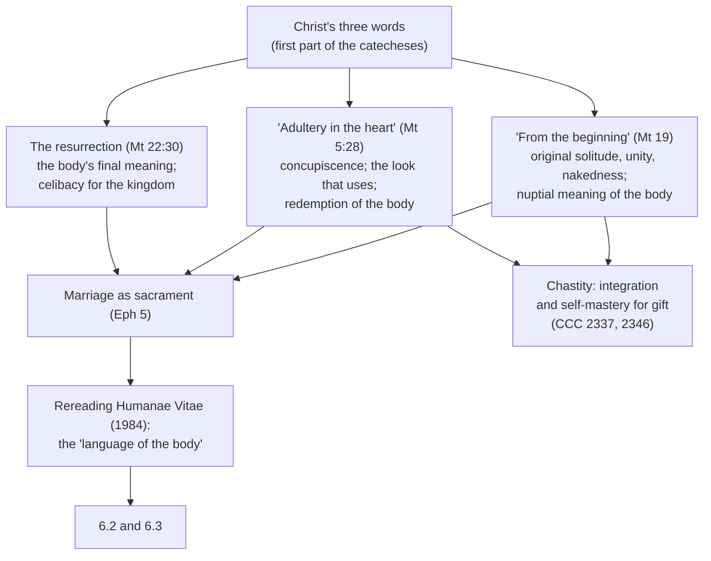

# Moral Theology · Lesson 6.1: The theology of the body and chastity

> ⏱ ~15 min · Module 6: Sexuality and truthfulness · Builds on: [3.1 Virtue, acquired and infused](03-01-virtue-acquired-and-infused.md), [4.4 Veritatis Splendor](04-04-veritatis-splendor.md) · Unlocks: [6.2 Humanae Vitae: the argument](06-02-humanae-vitae-the-argument.md), [6.3 Humanae Vitae: its authority](06-03-humanae-vitae-its-authority.md)

## Why this matters

Catholic sexual ethics usually reaches people as a list of prohibitions, and a list invites the obvious question: why these? The tradition's answer is not a longer list. It is a claim about what the body *is*, a virtue that makes a person able to live that truth, and a small set of norms that follow. Get this vision right and *Humanae Vitae* (6.2–6.3) reads as an application. Get it wrong, as prudishness or as technique, and every norm in this module looks arbitrary.

## The idea

**"From the beginning."** Asked about divorce, Jesus answers over Moses's head. The Creator "made them male and female", and Moses's permission came "by reason of the hardness of your heart: but from the beginning it was not so" (Matthew 19:4–8, Douay–Rheims). Creation, not the later concession, is the norm.

John Paul II built a whole catechesis on that phrase. In Wednesday general audiences from **5 September 1979 to 28 November 1984**, roughly 130 of them, he read three words of Christ: "the beginning" (Mt 19); the look of lust as "adultery in the heart" (Mt 5:27–28); and the resurrection, where "they shall neither marry nor be married" (Mt 22:30). He then read marriage as a sacrament through Ephesians 5. In the last audience he said "theology of the body" was a working term, and he called the whole cycle, in effect, an extended commentary on *Humanae Vitae*.

Its key idea is the **nuptial (spousal) meaning of the body**. In the audience of 16 January 1980 he said the body, male and female, is not only a source of procreation. From the beginning it can express love in which the person *becomes a gift*, and in giving fulfils the meaning of his existence. He anchors this in *Gaudium et Spes* 24: man, the one creature God willed for its own sake, finds himself only through "a sincere gift of himself". Wojtyła's philosophical groundwork, the [personalistic norm](../reference.md#the-personalistic-norm) and love as self-gift, is assumed from [`phenomenology-and-personalism`](../../phenomenology-and-personalism/syllabus.md) 5.2–5.3. Put simply: the person is never to be merely used, and love is a gift of the self.

**Chastity** is the virtue that makes that gift possible. The Catechism defines it as "the successful integration of sexuality within the person" (CCC 2337). It is a part of temperance (CCC 2341; ST II-II q.151), and every baptized person is bound to it according to his state: conjugal chastity for the married, continence for everyone else (CCC 2348–2350). Its key claim is that "self-mastery is ordered to the gift of self" (CCC 2346). You cannot give what you do not possess. [Virtue](03-01-virtue-acquired-and-infused.md) here works as 3.1 described: a stable disposition that makes the good act connatural, not a fence around a desire.

## Source

Aquinas, ST II-II q.153 a.2, "Whether no venereal act can be without sin?", *respondeo* (English Dominican Province):

> A sin, in human acts, is that which is against the order of reason. Now the order of reason consists in its ordering everything to its end in a fitting manner. Wherefore it is no sin if one, by the dictate of reason, makes use of certain things in a fitting manner and order for the end to which they are adapted, provided this end be something truly good. [...] Wherefore just as the use of food can be without sin, if it be taken in due manner and order, as required for the welfare of the body, so also the use of venereal acts can be without sin, provided they be performed in due manner and order, in keeping with the end of human procreation.

Read what the article refuses. Its objections argue that *every* sexual act is sinful, citing Augustine on how pleasure "casts down" the mind. Aquinas answers with the food analogy: sexuality is a good ordered to a true good, and sin lies in disorder, not in the act. The reply to Objection 2 goes further. Intense pleasure in a well-ordered act "is not opposed to the mean of virtue", because the mean is set by reason, not by quantity. What Aquinas does keep is Augustine's point that the passion's resistance to reason is a *penalty* of the first sin (ad 2, ad 3). That is a wound, not a guilt. The Thomist tradition is not prudish. It is exacting about order.

## The argument

Two routes reach the same norm. First, the personalist route of the catecheses:

1. The human person is a unity of body and soul, so the body expresses the person rather than being his tool (CCC 2332; the soul as form of the body, [`thomistic-synthesis` 5.3](../../thomistic-synthesis/lessons/05-03-the-human-soul-in-the-system.md)).
2. A person finds himself only through a sincere gift of self (GS 24), and may never be merely used (the personalistic norm).
3. The sexual act is by its nature a bodily act of total self-giving, open to a new life. *In words:* the body "says" something whether or not the speaker means it.
4. A bodily gift is true only if the personal gift behind it is total: exclusive and definitive, with nothing held back for the future. *Familiaris Consortio* 11 (1981) says the physical self-giving without that would be "a lie". *Persona Humana* 7 applies this to couples who intend to marry: sexual union is legitimate only once a definitive community of life has been established.
5. ∴ Genital acts outside marriage say with the body what the persons have not given. This is fornication (CCC 2353). Adultery adds injustice to the spouse and to the covenant (CCC 2380–2381).
6. Chastity, which integrates desire into the person, is the condition of the gift (CCC 2337, 2346).

Second, the Thomist route (II-II q.154 a.2). A sin directly against human life is mortal. The upbringing of a human child needs a father bound to a determinate woman over a long time. Fornication is an "indeterminate union", so it is opposed to the good of the child's upbringing. Aquinas meets the obvious objection head on: a man who provides for the child is not excused, because a matter under law "is judged according to what happens in general". The premises differ: the good of the offspring for Aquinas, the truth of the gift for John Paul II. The conclusion is the same.

**The case against, at strength.** Margaret Farley's *Just Love* (2006) proposes the framework many revisionists share. Judge sexual acts as you would any relationship, by norms of justice: no unjust harm, free consent, mutuality, equality, commitment, fruitfulness broadly understood, and social justice. On that view, committed non-marital or same-sex relationships can meet every norm, and marriage is one setting among several where they are met. The Catholic reply accepts the demand for justice and mutuality, which is premise 2. It denies that consent and mutuality settle what the act *means*: premise 3 holds that the body's gift is total whatever the partners intend. The CDF's *Notification* on the book (30 March 2012, approved by Benedict XVI) judged several of its positions contrary to Catholic teaching.

**Mark the levels.** On [the ladder](../reference.md#the-levels-in-moral-theology) ([`fundamental-theology` 4.4](../../fundamental-theology/lessons/04-04-the-ladder-of-doctrinal-authority.md)):

- **Fornication is gravely wrong: rung 2, on the 1998 CDF *Doctrinal Commentary*'s sorting.** Its §11 lists "the illicitness of prostitution and of fornication" among moral doctrines taught definitively by the ordinary universal magisterium, and cites CCC 2353. This is the same kind of placement as euthanasia in [5.1](05-01-the-inviolability-of-innocent-life.md).
- **Adultery is gravely wrong: at least rung 3** on the acts in this lesson (CCC 1756, 2380). As a Decalogue precept (Ex 20:14) it is commonly held to be revealed. No act checked here says so in those terms, so don't claim more than you can cite.
- ***Persona Humana*: rung 3 as an act.** It is a CDF declaration, approved and confirmed in ordinary form by Paul VI (audience of 7 November 1975) and dated 29 December 1975. Its contents can carry higher levels established by other acts.
- **The theology of the body: an audience catechesis, rung 3 at its lightest grade** ([`fundamental-theology` 4.5](../../fundamental-theology/lessons/04-05-reading-a-documents-weight.md)). Where it restates doctrine, it carries that doctrine's level. Its own categories (original solitude, nuptial meaning, the "language of the body") are papal theology that no act proposes as doctrine to be held. Its fame does not raise its weight.
- **Aquinas's upbringing argument: a theologian's argument (rung 4 at most).** The norm's level comes from magisterial acts, not from the argument. A weak argument does not lower the norm, and a strong one does not raise it.

## The map

## Worked examples

**Example 1: an engaged couple.** An engaged couple, wedding date set, reason that their love is "already conjugal" and that sex now only anticipates it. *Persona Humana* 7 takes up exactly this case. However firm the intention, such relations cannot guarantee the sincerity and fidelity of the bond, and union is legitimate only once a definitive community of life exists. Run the argument: the promise is not yet given, so the body gives what the persons have not yet given (premise 4). The act is fornication in species (CCC 2353). CCC 2350 gives the positive side: engagement is a time of continence, "an apprenticeship in fidelity". Whether a given couple sins *mortally* is still the three-condition question of [3.4](03-04-sin-mortal-and-venial.md). Grave matter is not a verdict on persons.

**Example 2: where the vision strains a list.** In the audience of 8 October 1980, John Paul II said the man in Matthew 5:28 commits adultery in the heart not because the woman is another man's wife, but because of *how* he looks. If he looked that way at his own wife, he would commit the same adultery in the heart. No act-type rule can capture this, because the act is licit. The fault is in the interior act: reducing the other to an object of one's own need. This is where the catecheses do their distinctive work, moving sexual ethics from permitted acts to the [virtue](../reference.md#chastity) that governs the heart. But this is exegesis in a catechesis. It adds no new norm, and it cannot be the basis for grading any particular marital act.

## Watch out

- **Prudishness is not the tradition.** Q.153 a.2 denies that the sexual act is sinful in itself, and its ad 2 says intense pleasure in an ordered act is no vice. The penal disorder of concupiscence is a wound, not a guilt.
- **Nor is the theology of the body a sex manual.** The catecheses concern the meaning of the gift and the virtue it needs. They promise no technique and grade no pleasure.
- **Overstating the catecheses.** "TOB is the Church's official doctrine of sexuality" promotes an audience cycle's categories to doctrine. Their level is rung 3 at its lightest grade, except where they restate doctrine.
- **Understating the norm.** "Premarital sex falls short of an ideal" misstates the level. The 1998 commentary sorts the illicitness of fornication at rung 2.
- **Chastity is not celibacy.** It binds the married too, as conjugal chastity (CCC 2349).

## One-liner

> The body speaks a gift, and chastity is the virtue that makes the gift true. Fornication and adultery say with the body what the persons have not given. The norm against fornication is rung 2 on the 1998 commentary's sorting, while the catecheses that frame it are papal theology at the lightest magisterial grade.

## Problems

**P1 (🟢)** *(Exegetical)* Matthew 19:3–8 (Douay–Rheims):

> And there came to him the Pharisees tempting him, saying: Is it lawful for a man to put away his wife for every cause? Who answering, said to them: Have ye not read, that he who made man from the beginning, made them male and female? And he said: For this cause shall a man leave father and mother, and shall cleave to his wife, and they two shall be in one flesh. Therefore now they are not two, but one flesh. What therefore God hath joined together, let no man put asunder. They say to him: Why then did Moses command to give a bill of divorce, and to put away? He saith to them: Because Moses by reason of the hardness of your heart permitted you to put away your wives: but from the beginning it was not so.

(a) The Pharisees appeal to Moses. To what does Jesus appeal instead, and which words rank the two? (b) Why does the passage allow John Paul II to build a sexual ethics on it, not only a teaching on divorce? **Two sentences per part.**

**P2 (🟡)** *(Exegetical)* An **invented** handout from a parish marriage-preparation weekend contains two paragraphs:

> **A.** Even in marriage, sexual pleasure is a concession to our fallen nature. The more intense it is, the further the soul falls from virtue, and the holiest couples keep it to a minimum.
>
> **B.** The theology of the body shows that Catholics have the best sex. Chastity for married people means maximizing mutual pleasure. Once you are married, whatever you both consent to is an expression of the nuptial meaning of the body.

For each paragraph, name the error and the text that refutes it. **Three sentences per paragraph.**

**P3 (🔴)** *(Exegetical)* For each claim, say whether it is (i) a **norm** about a kind of act, (ii) a claim about the **virtue**, or (iii) part of the **anthropological vision** behind both. Then give its level and **name the act that fixes it**. **One or two sentences each.**

1. Fornication is gravely contrary to the dignity of persons and of human sexuality (CCC 2353).
2. Chastity is the successful integration of sexuality within the person (CCC 2337).
3. From the beginning the body can express love in which the person becomes a gift (audience of 16 January 1980).
4. A husband who looks at his wife only as an object for his own gratification commits adultery in the heart (audience of 8 October 1980).

Solutions

**P1** *(Exegetical (a) · Exegetical (b))*

**Must hit, strict (a):** Jesus appeals to the Creator's act "from the beginning", Genesis 1:27 and 2:24 ("made them male and female"; "they two shall be in one flesh"), not to Mosaic law. The ranking is done by "permitted" (a concession, against the Pharisees' "command") and by "by reason of the hardness of your heart … but from the beginning it was not so": the concession answers sin, and the origin sets the norm.

**Must hit, strict (b):** the answer grounds marriage in what man and woman *are* by creation, male and female made for a one-flesh union. So it is a claim about the meaning of the sexed body, and that meaning bears on every use of sexuality, not only on divorce. John Paul II reads "the beginning" as the key to the body's original meaning (its nuptial meaning), which sin obscures but does not cancel.

**Wrong turns:** answering (a) with "Jesus overrules Moses by his own authority" and missing that the text appeals to creation. Quoting the Pharisees' "command" as if Jesus accepted the word. In (b), deriving sacramental indissolubility, which this course cedes to `sacraments-and-liturgy`, instead of the anthropological point.

**Model answer:** (a) Jesus appeals past Moses to the Creator who "from the beginning made them male and female" and joined them into "one flesh". "Permitted … by reason of the hardness of your heart" makes Moses a concession to sin, and "from the beginning it was not so" makes creation the norm. (b) Because the argument rests on what male and female are made for, it is a claim about the meaning of the sexed body as such. That is the premise John Paul II extends to all of sexual ethics as the nuptial meaning of the body.

**P2** *(Exegetical)*

**Must hit, strict (A):** the error is treating the sexual act or its pleasure as sinful or anti-virtuous in itself. ST II-II q.153 a.2 holds the ordered act is no sin (the food analogy), and ad 2 holds that intense pleasure in an act ordered by reason "is not opposed to the mean of virtue", because the mean is set by reason, not quantity. A strong answer grants the grain of truth: concupiscence's resistance to reason is a penalty of the first sin (ad 2, ad 3), but it is not guilt.

**Must hit, strict (B):** chastity is not the maximization of pleasure. It is the integration of sexuality within the person, with self-mastery ordered to the gift of self (CCC 2337, 2346). Consent does not make every marital act or look good: the audience of 8 October 1980 says a husband can commit adultery in the heart toward his own wife by reducing her to an object of his need. A strong answer adds that which marital acts are licit is 6.2's question.

**Wrong turns:** calling A "Augustinian and therefore Catholic teaching", since q.153 a.2 answers exactly those Augustinian objections. Refuting B only by saying the catecheses "are about spirituality", which misses that consent is the actual error. Using the level of the catecheses to dismiss B: the error is substantive, not a matter of weight.

**Model answer:** A makes pleasure itself the measure of vice. Aquinas denies that the ordered sexual act is a sin (q.153 a.2) and says its intensity is no departure from the mean, which reason sets (ad 2). What is true is that concupiscence's unruliness is a penalty of sin, a wound rather than a guilt. B turns chastity into technique and consent into the criterion. CCC 2337 and 2346 define chastity as integration ordered to the gift of self. The 8 October 1980 catechesis says a husband can commit adultery in the heart with his own wife, so marriage plus consent does not make every act a true gift.

**P3** *(Exegetical)*

**Must hit, strict:**

1. **Norm.** **Rung 2 on the 1998 CDF *Doctrinal Commentary*'s sorting**: §11 lists the illicitness of fornication among moral doctrines taught definitively by the ordinary universal magisterium, citing CCC 2353. (Answering "at least rung 3, from CCC 2353" alone misses the act that fixes it.)
2. **Virtue.** **Rung 3**: authentic ordinary magisterium in the Catechism (CCC 2337). No act proposes this definition as definitive.
3. **Vision.** **Rung 3 at its lightest grade.** It is a papal audience catechesis ([`fundamental-theology` 4.5](../../fundamental-theology/lessons/04-05-reading-a-documents-weight.md)), and its category, the nuptial meaning, is papal theology not proposed as doctrine to be held.
4. **Virtue** (an interior act of concupiscence, not a kind of external act). Also **rung 3 at its lightest grade**: it is the pope's exegesis of Matthew 5:28 in an audience catechesis, and it adds no new norm.

**Wrong turns:** promoting 3 or 4 because the theology of the body is famous or because John Paul II is a saint. Neither changes the genre. Calling 1 "a prudential judgment" or "an ideal". Classing 4 as a norm about marital acts: the act is licit, and what fails is the heart.

**Model answer:** as above.

## Flashback

**From Lesson [5.4](05-04-the-death-penalty-and-ccc-2267.md) (The death penalty and CCC 2267):** *(Exegetical, close reading.)* Augustine, *City of God* I.21 (Dods; *NPNF*, first series, vol. 2):

> However, there are some exceptions made by the divine authority to its own law, that men may not be put to death. These exceptions are of two kinds, being justified either by a general law, or by a special commission granted for a time to some individual. And in this latter case, he to whom authority is delegated, and who is but the sword in the hand of him who uses it, is not himself responsible for the death he deals. And, accordingly, they who have waged war in obedience to the divine command, or in conformity with His laws, have represented in their persons the public justice or the wisdom of government, and in this capacity have put to death wicked men; such persons have by no means violated the commandment, "Thou shalt not kill."

(a) Which of Augustine's two kinds of exception covers a magistrate who executes a convicted murderer, and which premise of Aquinas's argument in II-II q.64 does the passage anticipate? (b) Does the passage answer the question of principle or the question of application? Say how you can tell. (c) Aquinas's reply to Objection 3 rests the exception on the sinner's loss of "the dignity of his manhood". On what does Augustine rest it instead, and does the 2018 text's claim that dignity survives the crime answer Augustine's ground directly? **Two sentences per part.**

Solution

**Must hit, strict (a):** the magistrate falls under the **first kind, "a general law"**: he acts "in conformity with His laws" and represents "the public justice", not himself. That anticipates **premise 5**, that only public authority, which has care of the common good, may kill (q.64 a.3).

**Must hit, strict (b):** **the question of principle.** The passage says that killing by public justice under law does "by no means" violate the commandment. That is a claim about whether such an act can be just at all. It says nothing about whether a given ruler should use the power now.

**Must hit, strict (c):** Augustine rests the exception on **divine authority making an exception to its own law**, exercised through agents who are "the sword in the hand" of the one who commands. He does not argue from the criminal's lost dignity, so the 2018 claim that dignity is not lost **denies Aquinas's premise 4 but does not, by itself, meet Augustine's ground**. Anyone assessing the revision has to engage that ground separately.

**Wrong turns:** reading the passage as a prudential judgment about necessity, which is the question of application. Attributing premise 4 to Augustine. Treating the passage as proof that the teaching was proposed definitively: a Father's text is a witness to the tradition, not a magisterial act, and whether the tradition reached definitive status is the disputed question. Giving a development-or-contradiction verdict, which was not asked.

**Model answer:** (a) The magistrate acts under the first kind, a general law, since he represents "the public justice" and acts "in conformity with His laws". That anticipates Aquinas's premise 5: only public authority may kill (a.3). (b) It answers the question of principle, because it says that such killing does "by no means" violate the commandment. It is silent on whether any ruler should use the power in present conditions. (c) Augustine's ground is God's own authority making an exception to His law, with the executioner acting as "the sword in the hand" of another, not the criminal's forfeited dignity. So the 2018 claim that dignity survives the crime answers Aquinas's premise 4 but not Augustine's ground, which has to be engaged on its own terms.

## Connections

- **Backward:** [3.1](03-01-virtue-acquired-and-infused.md) supplies the account of virtue that chastity instantiates. [4.4](04-04-veritatis-splendor.md) and [2.2](02-02-the-moral-object.md) supply [intrinsically evil acts](../reference.md#intrinsically-evil-acts); CCC 1755 names fornication as a concrete act always wrong to choose. [3.4](03-04-sin-mortal-and-venial.md) keeps grave matter distinct from mortal sin. [`new-testament` 2.2](../../new-testament/lessons/02-02-matthew.md) reads Matthew's antitheses as text.
- **Forward:** [6.2](06-02-humanae-vitae-the-argument.md) applies the gift's totality to contraception, the catecheses' last cycle. [6.3](06-03-humanae-vitae-its-authority.md) asks what level that teaching carries. [`sacraments-and-liturgy`](../../sacraments-and-liturgy/syllabus.md) takes Ephesians 5 and indissolubility into marriage as a sacrament.
- **Sideways:** [`phenomenology-and-personalism`](../../phenomenology-and-personalism/syllabus.md) 5.2–5.3 owns the personalistic norm and betrothed love in *Love and Responsibility* (1960), the philosophy under the catecheses. [`church-history` 9.3](../../church-history/lessons/09-03-after-the-council.md) tells the story of 1968. Cards: [the theology of the body](../reference.md#the-theology-of-the-body), [the nuptial meaning of the body](../reference.md#the-nuptial-meaning-of-the-body), [chastity](../reference.md#chastity).
