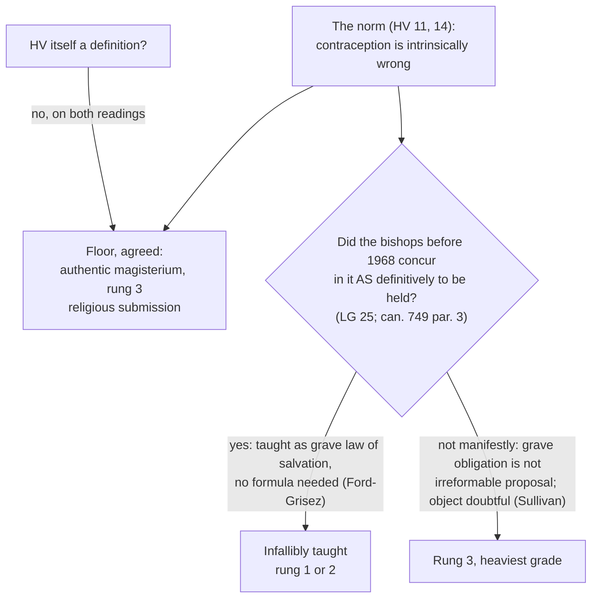

# Moral Theology · Lesson 6.3: *Humanae Vitae*: its authority

> ⏱ ~15 min · Module 6: Sexuality and truthfulness · Builds on: [6.2 *Humanae Vitae*: the argument](06-02-humanae-vitae-the-argument.md), [`fundamental-theology` 4.3 Religious submission](../../fundamental-theology/lessons/04-03-religious-submission.md) · Unlocks: [6.4 Truthfulness and the lie](06-04-truthfulness-and-the-lie.md)

## Why this matters

[6.2](06-02-humanae-vitae-the-argument.md) asked whether the argument works. This lesson asks a different question: **how firmly is the conclusion taught?** The answer does not depend on how good the argument is. *Humanae Vitae* is the third of the course's four standing test cases, and it can be misreported in both directions. "The pope infallibly defined it in 1968" is false. "It's one encyclical, so it's an opinion Catholics may set aside" is also false. The truth lies between them, and at its centre is a dispute that Catholic theologians in good standing have not settled. You need to be able to state both sides as their own defenders would.

## The idea

Keep three questions apart. Almost every confused sentence about *Humanae Vitae* runs them together.

1. **Is the encyclical a definition?** No. On this point both parties to the dispute agree.
2. **What is the floor?** The encyclical is an act of the authentic papal magisterium, so its central norm asks at least **religious submission of intellect and will**. That is rung 3 ([`fundamental-theology` 4.3](../../fundamental-theology/lessons/04-03-religious-submission.md)), and it sits at the heavy end of that rung.
3. **Was the norm already infallibly taught before 1968**, by the bishops dispersed through the world concurring in it (*Lumen Gentium* 25)? This is the live dispute. Notice what it is about. It concerns **the history of the norm, not the genre of the document**. If the answer is yes, the encyclical *confirmed* an infallible teaching, much as *Evangelium Vitae* 57 did for the killing of the innocent ([5.1](05-01-the-inviolability-of-innocent-life.md)). The difference is that Paul VI used no formula of confirmation.

## Source

Newman, *Letter to the Duke of Norfolk* (1875), §9, "The Vatican Definition". He has just quoted a Dublin theologian, Father O'Reilly, on how rarely infallibility is exercised:

> He, I am sure, would sanction me in my repugnance to impose upon the faith of others more than what the Church distinctly claims of them … To be a true Catholic a man must have a generous loyalty towards ecclesiastical authority, and accept what is taught him with what is called the *pietas fidei*, and only such a tone of mind has a claim, and it certainly has a claim, to be met and to be handled with a wise and gentle minimism.

The passage has two halves, and each side of this lesson's dispute lives in one of them. **"More than what the Church distinctly claims"** is the principle that can. 749 §3 would later write into law: no doctrine counts as infallibly defined unless this is manifestly evident. **"Generous loyalty"** and ***pietas fidei*** state the condition for using that principle. Minimism is owed to the loyal, not to the loophole-seeker. Newman's rule forbids inflating a level. It does not license looking for the lowest level one can defend in order to escape the teaching.

## The argument

**The floor, which both readings accept.**

1. *Humanae Vitae* (25 July 1968) is an encyclical. Paul VI says he examined the question personally because the commission's conclusions were not unanimous. He then answers by virtue of the mandate entrusted to him by Christ (HV 6; paraphrased). He addresses priests who teach moral theology and asks them for sincere obedience, inward as well as outward (HV 28; paraphrased).
2. The norm itself: every action specifically intended to prevent procreation, before, during or after intercourse, is excluded (HV 14). The encyclical calls deliberately contraceptive intercourse **intrinsically wrong** (HV 14; see [intrinsically evil acts](../reference.md#intrinsically-evil-acts)).
3. *Lumen Gentium* 25 says the weight of a papal act is read from **the character of the documents, frequent repetition of the doctrine, and the manner of speaking**. All three signs are strong here. *In words:* this is rung 3 at its heaviest.
4. Nothing in the encyclical uses a defining formula, and can. 749 §3 forbids presuming one. So HV is **not an *ex cathedra* definition**.

**Reading A: infallibly taught by the ordinary universal magisterium.** See [Ford and Grisez on infallibility](../reference.md#ford-and-grisez-on-infallibility). John C. Ford and Germain Grisez made the case in *Theological Studies* 39 (1978), pp. 258–312. Their argument, paraphrased:

- LG 25 sets conditions under which the bishops teach infallibly without a council. They must be dispersed through the world, in communion with one another and with the pope, and teaching authentically on faith or morals. And they must **agree on one judgment as definitively to be held**.
- Until at least 1962, the bishops everywhere taught that contraception is objectively, intrinsically and gravely evil. They did not present it as a probable opinion. They taught it as God's law, binding under pain of grave sin, and enforced it in the confessional. Pius XI's *Casti Connubii* (1930) §56 had restated it in deliberately solemn terms against the Anglican Lambeth Conference of 1930.
- Teaching a norm as a grave obligation of salvation, with no hint that it might change, **is** proposing it as definitive. The fourth condition does not require a technical formula.
- Specific moral norms fall within the object of infallibility, because keeping the natural law is necessary for salvation (HV 4).
- Therefore the concurrence was reached. Later dissent, including dissent by bishops, cannot undo a teaching that was already infallibly taught.

Defenders add two later texts. The 1998 CDF doctrinal commentary on the Profession of Faith (note 17) says the ordinary universal magisterium can be understood **diachronically**, across time. It adds that its intent to teach definitively need not be marked by solemn formulas. The Pontifical Council for the Family's *Vademecum for Confessors* (1997, part 2, n. 4) calls the teaching definitive and irreformable.

**Reading B: authoritative, but not shown to be infallibly taught.** See [Sullivan on the burden of proof](../reference.md#sullivan-on-the-burden-of-proof). Francis A. Sullivan, SJ, replied in *Magisterium: Teaching Authority in the Catholic Church* (1983, pp. 143–52). Grisez answered him in *The Thomist* 49 (1985). Sullivan's case, paraphrased:

- Can. 749 §3 puts the burden on anyone who claims infallibility, and LG 25's fourth condition is the demanding one. Bishops who teach a norm as gravely binding have not thereby been **shown** to propose it as irreformable. Proposing it as a grave obligation now is not the same as closing the question for ever.
- It is doubtful that a particular natural-law norm, which is not itself revealed, belongs to the object of infallibility at all. It would belong only if it were so bound up with revelation that the deposit could not be guarded without it.
- A doctrine infallibly taught should command a consensus of theologians that **perseveres**. The consensus on contraception broke after 1968.

Defenders add that Paul VI himself reopened the question for examination (HV 6) and invoked no infallible teaching. They also note that the 1998 commentary's moral examples of definitive doctrine are euthanasia, prostitution and fornication (§11), and that contraception is not among them. The commentary says its list is not exhaustive.

**Mark the levels.** See [the levels](../reference.md#the-levels-in-moral-theology) and [the level of *Humanae Vitae*](../reference.md#the-level-of-humanae-vitae).

- **HV is a definition: no.** Neither reading says it is.
- **The norm is at least authentic ordinary magisterium (rung 3), owed religious submission.** This is not disputed. Its markers are the heaviest that rung has.
- **Whether it is infallibly taught (rung 1 or 2) is freely disputed.** No magisterial act has settled the point. By contrast, the CDF's 1995 response did settle it for *Ordinatio Sacerdotalis*.
- **The assent owed** is firm and irrevocable if Reading A is right, and religious submission if Reading B is right. On neither reading is the teaching optional.

## Map of positions

## Worked examples

**Ex 1 (clean): the Winnipeg Statement.** See [the Winnipeg Statement](../reference.md#the-winnipeg-statement). The Canadian bishops, meeting in plenary assembly at St Boniface, Winnipeg, issued it on 27 September 1968. Run the procedure. *Source:* a bishops' conference, which teaches in its own territory, not for the universal Church. *Genre:* a pastoral statement. *Content (paraphrased):* it acknowledges that some Catholics find the teaching extremely difficult or impossible to make their own. It asks confessors for understanding. And it says that someone who, after honest effort, chooses the course that seems right to him does so in good conscience (§26). *Level:* no act of a conference can raise or lower the level of a universal norm. The conscience clause is a pastoral judgment, and [2.4](02-04-conscience-its-nature-and-its-errors.md)'s account of the erroneous conscience measures it. The debate also uses the statement as evidence. For Reading B, it shows the episcopal consensus fracturing. For Reading A, that fracture is irrelevant, because the concurrence that counts came before 1968. Later Canadian statements moved back toward the encyclical: a 1969 clarification, and a 2008 pastoral letter reported as reaffirming it. This lesson has not verified either document's text.

**Ex 2 (where it strains): the pile of repetitions.** See [what repetition does to a level](../reference.md#what-repetition-does-to-a-level). *Familiaris Consortio* 32 (1981) quotes HV 14 and calls such actions intrinsically immoral. FC 29 reports that the 1980 Synod of Bishops, together with the pope, firmly held HV's teaching. CCC 2370 calls contraception intrinsically evil, quoting HV 14 and FC 32. *Amoris Laetitia* 222 (2016) says HV 10–14 should be taken up anew. The 1997 *Vademecum* says "definitive". Does the pile raise the level? Take each kind of item in turn.

- **Frequency is one of LG 25's signs.** It shows how firmly the teaching is held. It moves the weight *within* rung 3. It is not one of the conditions for infallibility.
- **Repetition is also evidence of concurrence.** The 1980 synod is the strongest item for Reading A. Evidence of concurrence still needs the fourth condition, that the bishops concurred *as definitive*, and it is weighed under can. 749 §3.
- **The Catechism is a compendium.** It restates the norm, and "intrinsically evil" repeats HV 14. It cannot raise the norm's level ([`fundamental-theology` 4.5](../../fundamental-theology/lessons/04-05-reading-a-documents-weight.md)).
- **A pontifical council's pastoral guide asserts that the teaching is definitive.** It certifies that claim; it does not create the level. Readers disagree about how much the word proves.

So repetition can make the case for Reading A stronger. It cannot close the case. Closing it would take a definition, or an act like the 1995 response that declares the norm infallibly taught.

## Watch out

- **Overstating:** "*Humanae Vitae* is infallible." The document is not a definition. Only the norm's *prior* teaching is claimed to be infallible, and that claim is disputed.
- **Understating:** "An encyclical, so non-binding." Rung 3 asks for religious submission of intellect and will, and HV 28 asks for inward obedience. Non-definitive does not mean optional.
- **Level is not truth.** Sullivan did not argue that the teaching is false. Rung 3 means the teaching is not shown to be irreformable. It does not mean it is probably wrong.
- **Reception does not vote.** Widespread non-practice does not lower a level. Whether a theological consensus *persevered* is a criterion Sullivan used as evidence, and it is not a poll ([`fundamental-theology` 5.3](../../fundamental-theology/lessons/05-03-the-sensus-fidei.md)).
- **A bishops' conference is not the universal magisterium.** The Winnipeg Statement neither lowered the norm's level in Canada nor showed that the norm was ever optional.

## One-liner

> *Humanae Vitae* defined nothing and binds at least as heavy rung-3 teaching; whether the bishops had already taught its norm infallibly is the open question, and piling up repetitions weighs on that question without settling it.

## Problems

**P1 (🟢)** *(Exegetical.)* For each item, **name the act** (who, in what genre) and say in one clause what it can and cannot do to the level of HV's norm. **Two sentences per item.**

(a) The Winnipeg Statement §26 (1968).
(b) *Familiaris Consortio* 32 (1981).
(c) A theologian's journal article (1978) concluding that the norm has been infallibly taught.
(d) CCC 2370.

**P2 (🟡)** *(Exegetical.)* An **invented** parish bulletin, not the words of any real person:

> "Some still say Catholics may make up their own minds on contraception. Not so! *Humanae Vitae* was an infallible *ex cathedra* definition, and since John Paul II and the Catechism repeated it, it's now doubly infallible. The Canadian bishops' 1968 statement proves the teaching was optional in Canada until Rome corrected them. And anyone who thinks it isn't infallible is saying the Church could be wrong about it, which is heresy."

Name **four** errors about levels. For each, say in one sentence what is actually the case. **150 words or fewer.**

**P3 (🔴)** *(Exegetical.)* An invented moral teaching X appears in five papal encyclicals over eighty years. Each calls X "gravely binding", and none uses a defining formula or says X is "to be held definitively". (a) Which sign in LG 25 do the repetitions supply, and what does each new repetition change? (b) Name the one further thing that must be shown before X can be called infallibly taught by the ordinary universal magisterium. Say what can. 749 §3 does in the meantime. **120 words for (a) and (b) together.**

Solutions

**P1** *(Exegetical — strict.)*

**Must hit, strict:**
- (a) The act is a bishops' conference's pastoral statement: particular, not universal. It cannot raise or lower a universal norm's level. It is at most evidence in the debate about whether the bishops' consensus persevered, and its conscience counsel is judged by the teaching on conscience.
- (b) The act is a papal apostolic exhortation. It restates the norm ("intrinsically immoral") and so adds frequency, one of LG 25's signs, which increases the weight within rung 3. By itself it does not make the norm definitive.
- (c) This is not a magisterial act. It sits below the seam as theologians' testimony (it is Ford and Grisez). It can argue that the norm is infallibly taught, but it cannot make it so.
- (d) The act is the Catechism, a compendium. The paragraph keeps the weight of its sources (HV 14, FC 32). It locates the teaching and cannot grade it.

**Wrong turns:** treating (a) as having lowered the level "for Canada"; treating (b) or (d) as definitive because each repeats the norm; giving (c) any rung at all.

**Model answer:** (a) A conference's pastoral statement cannot change a universal norm's level; it is evidence about reception at most. (b) A papal exhortation restating the norm adds frequency, so more weight within rung 3, and does not make it definitive. (c) A theologian's article is testimony, not an act; it argues for a level and cannot confer one. (d) The Catechism is a compendium carrying HV 14's and FC 32's weight; it cannot raise it.

**P2** *(Exegetical — strict.)*

**Must hit, strict (any four):**
1. **"*Ex cathedra* definition."** HV defines nothing, and neither reading of the dispute says it does (can. 749 §3).
2. **"Doubly infallible" through repetition.** Repetition is an LG 25 sign of weight within rung 3. It is not a condition of infallibility, and the Catechism cannot raise a level.
3. **"Optional in Canada."** A bishops' conference cannot lower a universal norm's level. It was always at least rung 3.
4. **"Denying infallibility is heresy."** Whether the norm is infallibly taught is freely disputed. Heresy is obstinate denial of a rung-1 truth, and holding Reading B is neither.
5. (Also creditable) **"Make up their own minds."** The bulletin's target is also wrong: on either reading the norm is not optional.

**Wrong turns:** correcting the bulletin by saying the teaching is "only an opinion", which swaps one level error for the opposite one. Treating Reading B as a denial that the teaching is true.

**Model answer:** HV contains no definition, and both readings agree on that. Repetition adds weight within rung 3 but meets no condition of infallibility, and the Catechism cannot raise a level. A bishops' conference cannot make a universal norm optional anywhere, since it was always at least rung 3. Whether the norm is infallibly taught is disputed, so holding that it is not is not heresy, which requires obstinate denial of a revealed truth.

**P3** *(Exegetical — strict.)*

**Must hit, strict (a):** the sign is **frequent repetition of the same doctrine**, one of LG 25's three signs of the pope's mind. Each repetition increases the weight of religious submission owed within rung 3. None of them moves X to a new rung.

**Must hit, strict (b):** it must be shown that the bishops, dispersed and in communion with the pope, **concurred in proposing X as definitively to be held** (LG 25's fourth condition). Until that is manifestly established, can. 749 §3 keeps X at rung 3. The burden lies on the claim of infallibility.

**Wrong turns:** naming "a definition" as the only route up, which forgets the ordinary universal magisterium. Treating "gravely binding" as equivalent to "to be held definitively". Counting papal encyclicals as the ordinary *universal* magisterium, which is the bishops' concurrence and not the pope's ordinary teaching.

**Model answer:** (a) Frequency, one of LG 25's signs: each repetition increases the religious submission owed, still at rung 3. (b) That the bishops throughout the world, in communion with the pope, concurred in proposing X as definitively to be held. Until that is manifestly established, can. 749 §3 keeps X at rung 3.

## Flashback

**From Lesson [6.1](06-01-the-theology-of-the-body-and-chastity.md) (The theology of the body and chastity):** *(Exegetical.)* An **invented** case. Walter (72) and Irene (69), both widowed, live together and have sexual relations. They have promised each other privately to stay together for life, but they will not marry, because Irene would lose her late husband's survivor's pension. Walter argues: "First, Aquinas condemned fornication for the sake of the child's upbringing, and at our age no child can come, so his reason does not touch us. Second, we have promised each other for life, so our gift is total; the wedding is only paperwork." (a) What does Aquinas's own article (II-II q.154 a.2) say to Walter's first point, and what happens to the norm if you still find the argument weak? (b) Answer the second point from the personalist route, naming the premise and a text. (c) Does your analysis settle whether Walter and Irene are in mortal sin? **Two sentences per part.**

Solution

**Must hit, strict (a):** the same *respondeo* already meets the atypical case. A matter that falls under law is "judged according to what happens in general, and not according to what may happen in a particular case", as with the man who provides for his child. The norm does not stand or fall with this argument. Aquinas's reasoning is a theologian's argument (rung 4 at most), while the norm against fornication is **rung 2 on the 1998 CDF *Doctrinal Commentary*'s sorting (§11)**.

**Must hit, strict (b):** **premise 4.** The bodily gift is true only if the personal gift is total, exclusive and definitive (FC 11), and *Persona Humana* 7 holds union legitimate only once a definitive community of life has been *established*. PH 7 ties that to a conjugal contract sanctioned and guaranteed by society. A private promise arranged precisely to avoid that bond holds something back, so the act is fornication in species (CCC 2353).

**Must hit, strict (c):** **no.** The analysis fixes grave matter. Whether either of them sins mortally also needs full knowledge and deliberate consent, the three conditions of [3.4](03-04-sin-mortal-and-venial.md), and grave matter is not a verdict on persons.

**Wrong turns:** conceding the first point on the ground that the upbringing argument is the norm's only support. Answering the second point with the upbringing argument again, when the personalist route does not depend on fertility. Calling the norm "an ideal" (understates) or treating the theology of the body's categories as what fixes its level (the level comes from the 1998 commentary). Pronouncing them in mortal sin.

**Model answer:** (a) Aquinas answers that matters under law are judged by what happens in general, not by the particular case, which is how he dismisses the man who provides for his child. Even if that reply seems weak, the argument is only a theologian's (rung 4 at most), and the norm rests on the 1998 commentary's sorting at rung 2. (b) On premise 4, the body's gift is true only when the personal gift is total and definitive (FC 11), and PH 7 requires a definitive community of life actually established, which it ties to a publicly guaranteed conjugal contract. A private promise shaped to avoid that bond keeps something back, so the act remains fornication in species (CCC 2353). (c) No: that is grave matter, and mortal sin also needs full knowledge and deliberate consent (3.4), which no one can read off the case.

## Connections

- **Backward:** [6.2](06-02-humanae-vitae-the-argument.md) reconstructed the argument whose conclusion this lesson weighs. [1.3](01-03-natural-law-in-light-of-revelation.md) left open whether specific natural-law norms can be taught infallibly, and that is Reading B's second point. The rungs and can. 749 §3 come from [`fundamental-theology` 4.2](../../fundamental-theology/lessons/04-02-infallibility-and-its-conditions.md)–[4.5](../../fundamental-theology/lessons/04-05-reading-a-documents-weight.md). The story of 1968 is [`church-history` 9.3](../../church-history/lessons/09-03-after-the-council.md).
- **Forward:** Boss problem 6 in the [syllabus](../syllabus.md) asks you to state both readings and argue one. [6.4](06-04-truthfulness-and-the-lie.md) turns to the lie, where the 1994/1997 change to CCC 2483 raises a different question about levels.
- **Sideways:** *Evangelium Vitae* 57 ([5.1](05-01-the-inviolability-of-innocent-life.md)) is the contrast case: there the pope *did* invoke the ordinary universal magisterium with a formula of confirmation. The 2018 CCC 2267 ([5.4](05-04-the-death-penalty-and-ccc-2267.md)) and *Ordinatio Sacerdotalis* ([`fundamental-theology` 4.4](../../fundamental-theology/lessons/04-04-the-ladder-of-doctrinal-authority.md)) complete the set of cases where the level itself is argued. The Winnipeg Statement's conscience clause belongs with [2.5](02-05-the-primacy-of-conscience-rightly-understood.md).
