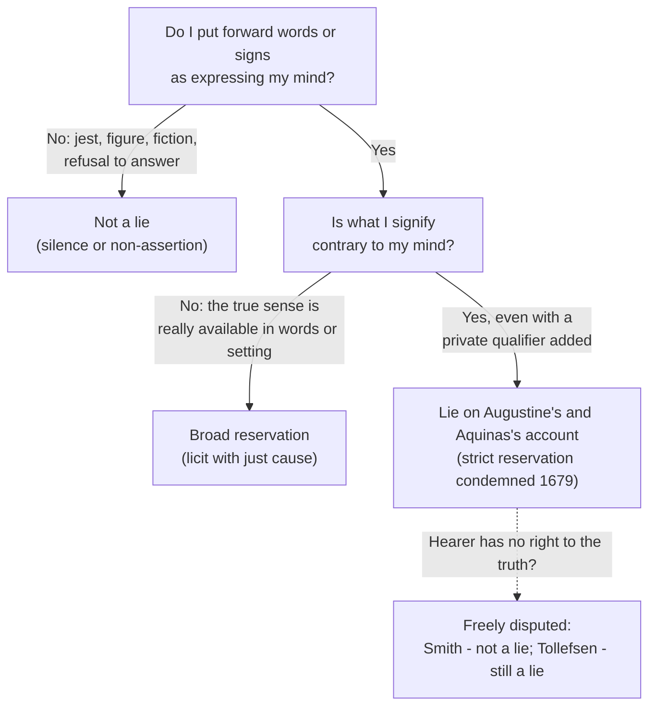

# Moral Theology · Lesson 6.4: Truthfulness and the lie

> ⏱ ~15 min · Module 6: Sexuality and truthfulness · Builds on: [2.3 Intention and circumstances](02-03-intention-and-circumstances.md), [4.4 Veritatis Splendor](04-04-veritatis-splendor.md) · Unlocks: Boss problem 6 in the [syllabus](../syllabus.md); [`apologetics-catholic-claims`](../../apologetics-catholic-claims/syllabus.md)

## Why this matters

Kant said you may not lie to the murderer at the door, and most readers take that as a reductio of Kant ([`ethics` 2.3](../../ethics/lessons/02-03-humanity-autonomy-and-the-lie.md)). Augustine and Aquinas reached the same verdict fifteen and five centuries earlier, and the Catechism still calls lying intrinsically disordered. Catholic moralists do not argue about *whether* lying may be done for a good end. They argue about *what a lie is*. In 2011 that question split the pro-life movement over undercover videos. This lesson gives you the tools to sort any deception into lie, reservation or silence, and to state the live dispute without settling it for either side.

## The idea

Three things can look alike from outside:

- **Silence.** I keep back something true. Nothing false is signified.
- **Reservation.** I say something true that the hearer may take in a false sense.
- **The lie.** I put forward as my mind what is not my mind.

The tradition holds that the first two may be done for good reason and the third may never be done. So everything turns on the boundary of the third. Draw it tightly, around every assertion contrary to one's mind, and the refugee-hider has to fall silent. Draw it by the hearer's rights, and some false statements stop being lies at all.

Both sides of the modern dispute agree that a lie is intrinsically evil. They disagree over which acts count as lies.

## Source

ST II-II q.110 a.3, "Whether every lie is a sin?" (English Dominican Province), the body of the article and a line from the reply to the fourth objection:

> Now a lie is evil in respect of its genus, since it is an action bearing on undue matter. For as words are naturally signs of intellectual acts, it is unnatural and undue for anyone to signify by words something that is not in his mind.

> Nevertheless it is lawful to hide the truth prudently, by keeping it back, as Augustine says (Contra Mend. x).

Read it slowly. **"In respect of its genus"** puts the evil in the [object](../reference.md#the-moral-object), before any end or consequence, so no good end can rescue it ([2.3](02-03-intention-and-circumstances.md)). **"Naturally signs"** is the whole argument: speech has a built-in purpose, and a lie turns it against that purpose. Notice what is missing. Nothing in the article mentions the *hearer's* rights. The fourth objection proposes the lesser-evil argument ("less harm is done by raising a false opinion … than by someone slaying or being slain"), and the reply refuses it. What the reply leaves open is **"hide the truth prudently, by keeping it back"**: silence and reserve, never false signs.

## The argument

1. **Truthfulness is a virtue.** It is a part of justice by which a person shows himself in word and deed as he is (II-II q.109; CCC 2468–2469). *In words:* we owe each other our real mind, because common life runs on trust.
2. **The lie defined.** Augustine, *On Lying* (c. 395), makes the fault lie in the speaker's mind, not in the facts. Whoever says what he believes, even falsely, does not lie. Whoever has one thing in his mind and utters another has a double heart. A false statement put forward with the will to deceive is, he says, beyond doubt a lie (*On Lying* 3–5). CCC 2482 opens with this formula. See [the definition of the lie](../reference.md#the-definition-of-the-lie).
3. **Aquinas sharpens the essence.** A lie can be false materially (the words are false), formally (the speaker wills to say the false) and effectively (he wills to deceive). The species comes from the **formal** falsehood; the will to deceive belongs to the lie's "perfection", not its species (q.110 a.1 and ad 3). *In words:* for Aquinas, what makes a lie is asserting against your own mind. Whether you succeed or even aim to deceive completes it but does not define it.
4. **Every lie is a sin** (q.110 a.3, the Source). This is Augustine's conclusion too: he runs through eight kinds, from lies in religious teaching to lies that save someone from bodily defilement, and forbids all eight (*On Lying* 25, 42). The midwives of Exodus 1 were rewarded "not for their lie" but for their fear of God (a.3 ad 2).
5. **Not every lie is mortal.** A lie is mortal when it is contrary to charity. That happens when it corrupts divine truth, gravely injures a neighbour or intends to, or causes grave scandal. The jocose and officious lie are venial in themselves (q.110 a.4; CCC 2484). The three conditions of [mortal sin](../reference.md#mortal-and-venial-sin) still apply ([3.4](03-04-sin-mortal-and-venial.md)).
6. **Concealment is not lying.** Augustine distinguishes hiding the truth from uttering a lie: we usually hide truths by holding our peace (*Against Lying* 23). He praises Firmus, bishop of Thagaste, who told imperial officers that he could neither lie nor betray the man he was hiding, and bore torture rather than do either (*On Lying* 23). Secrets must sometimes be kept, and no one is bound to reveal the truth to someone without a right to know it (CCC 2488–2489).
7. **Mental reservation.** The casuists built on premise 6 ([4.1](04-01-casuistry-and-the-probabilism-controversy.md)). In a **broad** reservation the qualifying sense is really available in the words or the setting. A confessor's "I do not know" means "I have no knowledge I can communicate", and anyone who knows what a confessor is can read it that way. In a **strict** reservation the qualifier exists only in the speaker's head. Navarrus defended it and Sanchez formulated it; Laymann answered that it is simply a lie, since the words as spoken say what the speaker knows to be false. Innocent XI condemned strict reservation, as Sanchez put it, on 2 March 1679 (propositions 26–27, among sixty-five laxist propositions). Broad reservation remains the manuals' common teaching when there is just cause. See [mental reservation](../reference.md#mental-reservation).
8. **The rival definition.** Grotius (*De iure belli ac pacis*, 1625, Book III ch. 1, on ruses and falsehood in war) defined a culpable falsehood as one that violates a right of the person addressed. Constant's "right to the truth" against Kant is the secular form ([`ethics` 2.3](../../ethics/lessons/02-03-humanity-autonomy-and-the-lie.md)). The 1994 English Catechism seemed to adopt it: to lie was to lead into error "someone who has the right to know the truth" (CCC 2483, 1994). The 1997 Latin *editio typica* drops the clause and reads simply *ad inducendum in errorem*, "to lead into error". See [the right to the truth](../reference.md#the-right-to-the-truth).

**The modern dispute.** In early 2011 Live Action released videos in which actors posing as sex traffickers sought help from Planned Parenthood clinics. **Christopher Tollefsen** (with Alexander Pruss; later *Lying and Christian Ethics*, 2014) held, paraphrased, that every assertion contrary to one's mind is a lie, whoever hears it. A lie divides the speaker's inner self from the self he presents and damages the trust that assertion depends on. The 1997 revision confirms Augustine and Aquinas, and the stings were lies. **Janet Smith** answered (*First Things*, June 2011, paraphrased) that the purpose of speech must be read in a fallen world. One who seeks to do grave evil forfeits the right to truth, much as an aggressor forfeits immunity from force. So a false statement to him is not a lie in the morally relevant sense, much as killing in self-defence is not murder. She read the 1997 change as a clarification of wording, citing John Paul II's statement that the revisions changed no doctrine. Both sides hold that lying is intrinsically evil. They divide over **what the object "lie" includes**.

**Mark the levels.** [The levels](../reference.md#the-levels-in-moral-theology), claim by claim:

- **That lying is intrinsically disordered, so that no good end justifies it**, is **at least authentic ordinary magisterium**. The Catechism names lying as intrinsically disordered (CCC 1753) and condemns it "by its very nature" (CCC 2485), restating a teaching constant from Augustine through Aquinas and the manuals. No act solemnly defines it. Whether it is also definitively taught belongs to the wider dispute over [intrinsically evil acts](../reference.md#intrinsically-evil-acts) ([4.4](04-04-veritatis-splendor.md)).
- **That a lie in itself is venial unless it gravely injures justice or charity** is **common teaching**, restated at CCC 2484.
- **The condemnation of strict mental reservation (1679)** is a papal censure of propositions: binding, but not a definition. Broad reservation with just cause is **common teaching**.
- **Whether every false assertion to an aggressor, or in undercover work, is a lie** is **freely disputed**. The 1997 text removed a clause. It did not add a condemnation of the right-to-truth view, and it does not settle the dispute by itself.

## The rule

## Worked examples

**Example 1: a clean case.** A job candidate is asked about a gap in her CV and answers, "I was travelling," when she was in prison. Step 1: she is asserting. Step 2: what she signifies is contrary to her mind. So it is a lie, on every definition: the employer has a legitimate interest in her answer, so it survives even the Grotian test. Its gravity depends on the harm (q.110 a.4; CCC 2484). Her fear lowers culpability without changing the object. Could she have said, "That's a period I'd rather discuss once I'm further in the process"? Yes. That is reserve, not deception.

**Example 2: where it strains.** A caller asks a butler whether his master is home. The master is upstairs and refusing callers, and the butler says, "He is not at home." For the manuals this was the model broad reservation, because the phrase conventionally meant "not receiving" and a sensible caller knew it. Now move the same words to a culture where no such convention exists. The qualifier is now private, and the phrase slides toward strict reservation. So a reservation's licitness depends on a *social fact*: whether hearers can actually read the true sense. Tollefsen's side presses this: much of what passes as broad reservation is a lie with better manners. Smith's side presses the other way: if the tradition already allows speech that it knows will mislead, the line between "permitting self-deception" and "false signification" is thinner than Augustine made it. The rule tells you how to classify the case. It does not tell you where a convention ends.

## Watch out

- **You might think the 1997 change settled the aggressor case.** It removed the right-to-know clause from 2483; 2489 still says no one is bound to reveal the truth to someone without the right to know it. Treating the dispute as closed **overstates** the act. Calling the prohibition on lying "a pious ideal" **understates** it: that lying is intrinsically disordered is at least authentic ordinary magisterium (CCC 1753).
- **You might quote the vatican.va English text of CCC 2483 as current.** At the time of writing it still prints the 1994 wording; check the Latin *editio typica* or the second English edition.
- **You might think "every lie is a sin" means "every lie is mortal."** Aquinas denies it (q.110 a.4).
- **You might think silence is always innocent.** Augustine notes that refusing to say whether someone is in a particular place can betray him as surely as a pointing finger (*On Lying* 24). Reserve must be prudent, not merely literal.
- **You might think the 1679 decree condemned all mental reservation.** It condemned the strict kind only.

## One-liner

> A lie is an assertion against your own mind, and it is never licit, though silence and genuine reserve often are; what Catholics still dispute is whether a false word to one with no right to the truth is a lie at all.

## Problems

**P1 (🟢)** *(Exegetical)* Classify each invented statement as **lie**, **broad reservation**, **strict reservation** or **silence / non-assertion**, and name the feature that decides it. **One sentence each.**

(a) A reporter is asked by a rival whether she is working on the mayor story and answers, "I don't talk about work in progress."
(b) In a firm where everyone knows that "Ms. Ruiz is in a meeting" is the receptionist's formula for "she is not taking calls", the receptionist says it while Ms. Ruiz sits at her desk.
(c) Asked by his wife whether he went to the casino this week, a man says, "I didn't go to the casino," silently adding "on Tuesday."
(d) Asked whether she has finished the essay, a student says "Yes" to avoid a late penalty, though she has not started it.

**P2 (🟡)** Augustine, *Against Lying* 23 (*NPNF* first series, vol. 3):

> It is not, however, the same thing to hide the truth as it is to utter a lie. For although every one who lies wishes to hide what is true, yet not every one who wishes to hide what is true, tells a lie. For in general we hide truths not by telling a lie, but by holding our peace. … Somewhat therefore of truth he left untold, not told aught of falsehood, when he left wife untold, and told of sister. … It is not then a lie, when by silence a true thing is kept back, but when by speech a false thing is put forward.

(a) State the distinction the passage draws, and the words that fix where a lie begins. *(Exegetical.)* (b) Abraham's "she is my sister" misled Pharaoh (Gen 12) and Abimelech (Gen 20). Explain why Augustine does not count it a lie, and say which kind of mental reservation it anticipates, with the reason. *(Exegetical.)* **Two sentences per part.**

**P3 (🔴)** An invented case. A charity investigator, suspecting a care home of forging residents' signatures, telephones posing as the daughter of a prospective resident and asks how "paperwork" is usually handled. Two positions, paraphrased: **A** says every assertion contrary to one's mind is a lie, so the call is a lie and is wrong whatever it exposes. **B** says the home's managers, set on fraud, have no right to the truth in this matter, so the pretext is not a lie in the morally relevant sense. (a) Name the single premise on which A and B divide, and say what each makes the object of the act. *(Exegetical.)* (b) Give the level of (i) "a lie is intrinsically disordered"; (ii) "the investigator's pretext is a lie". *(Exegetical.)* (c) Take either side on (ii) in **150 words or fewer**, answering the strongest point of the other. *(Evaluative.)*

Solutions

**P1** *(Exegetical)*

**Must hit, strict:** (a) **Silence / non-assertion**: she declines to answer and signifies nothing false. (b) **Broad reservation**: the true sense ("not available for calls") is really available from a convention the hearers share, so what is signified is not contrary to her mind. (c) **Strict reservation**: the qualifier exists only in his head and the words as spoken assert what he knows to be false, so it is a lie on Laymann's analysis, and of the kind condemned in 1679. (d) **Lie**: an assertion contrary to her mind. It is officious (self-serving), and venial unless it gravely injures justice or charity (q.110 a.4; CCC 2484).

**Wrong turns:** calling (b) a lie because the caller is misled. The test is whether the true sense is really available, not whether this hearer happens to read it. Calling (c) broad because "the words are literally true". The words he speaks, "I didn't go to the casino", are false; only the unspoken addition would make them true. Calling (d) mortal because every lie is a sin: sin and mortal sin are different claims.

**Model answer:** (a) Silence: a refusal asserts nothing. (b) Broad reservation: the office convention makes the true sense public. (c) Strict reservation, hence a lie: the saving qualifier is private. (d) A lie, officious and in itself venial.

**P2** *(Exegetical (a) · Exegetical (b))*

**Must hit, strict (a):** hiding the truth and lying are different acts. Every liar hides truth, but not everyone who hides truth lies. The line is **"by speech a false thing is put forward"**: a lie begins only when something false is asserted. **"By silence a true thing is kept back"** marks what is licit. Credit for linking this to q.110 a.3 ad 4, "hide the truth prudently, by keeping it back", which cites this part of the work.

**Must hit, strict (b):** Sarah really was his half-sister ("by father, not by mother", Gen 20:12), so "sister" was **true**. He **left something untold** ("wife") and **told nothing false**. This anticipates **broad** reservation: the true sense lies in the words themselves and needs no private qualifier. It is not strict, since no unspoken addition is needed to make the words true.

**Wrong turns:** saying Augustine excuses Abraham because his motive (saving his life) was good. The passage makes no appeal to motive, and *On Lying* forbids even life-saving lies. Calling it strict reservation because Abraham "meant" something different: the sense he intended is the words' ordinary sense.

**Model answer:** (a) To hide the truth is not to lie: one can keep back what is true by silence, but a lie begins only "when by speech a false thing is put forward". So the boundary is assertion of the false, not the hearer's being left uninformed. (b) Sarah really was his sister by the father, so Abraham said nothing false and only left "wife" untold. That is the pattern of broad reservation, a true statement that permits a mistaken inference, not the strict kind, which needs a private addition to be true.

**P3** *(Exegetical (a) · Exegetical (b) · Evaluative (c))*

**Must hit, strict (a):** they divide over **whether the hearer's lack of a right to the truth enters the definition (the object) of the lie**. For A, the object is **asserting against one's mind** (Augustine; q.110 a.1: the species comes from formal falsehood), so the hearer's rights affect only circumstances and gravity. For B, the object is **denying truth owed** (Grotius; the 1994 wording of CCC 2483; Smith), so a false statement to someone who has forfeited the right is a different kind of act, as killing in self-defence differs from murder. Both agree that lies are never licit.

**Must hit, strict (b):** (i) **At least authentic ordinary magisterium** (CCC 1753, 2485; constant teaching). Whether it is definitive belongs to the wider intrinsic-evil dispute, and no solemn definition exists. (ii) **Freely disputed.** The 1997 change removed a clause but condemned nothing; calling (ii) "Church teaching" in either direction is an error.

**Must hit, any verdict (c):** state the other side's strongest point in its own terms. Against B, that is the "naturally signs" argument (q.110 a.3), which makes no reference to the hearer, together with the 1997 deletion. Against A, it is the forfeiture analogy with force, together with CCC 2489's "No one is bound to reveal the truth to someone who does not have the right to know it". Then either (A) explain why speech differs from force, or (B) explain why forfeiture changes the object and not merely the circumstances. Say whether a pretext call is an assertion at all, or only a role; either answer passes if argued.

**Wrong turns:** arguing that exposing fraud justifies lying. Both A and B reject that; it is the end justifying the means ([2.3](02-03-intention-and-circumstances.md)). Treating (ii) as settled by the 1997 text. Assuming B permits lying; B denies that the act is a lie.

**Model answer (c), one of several (side A):** B's best point is that force against an aggressor is not murder, so why should speech to a fraudster be a lie? But force is licit against an aggressor because what makes killing murder is the victim's innocence, a fact about the one killed. What makes a lie a lie is a fact about the speaker's own sign: Aquinas's "naturally signs of intellectual acts" says nothing about the hearer. The investigator's words present as his mind what is not his mind, so the pretext is a lie, however good its target. The 1997 deletion of the right-to-know clause fits this reading, though it does not compel it. He has licit alternatives: silence, records requests, or testimony from staff.

## Flashback

**From Lesson [6.2](06-02-humanae-vitae-the-argument.md) (Humanae Vitae: the argument):** *(Exegetical.)* An invented case. A married couple with three children have a serious, well-grounded reason to avoid another pregnancy for some years. The husband proposes that they not abstain in the fertile days but practise withdrawal instead: "It uses no pill and no device, so it is natural. It is the same as NFP, and we mean exactly what NFP couples mean."
(a) Give the verdict on their plan of each of the three positions in 6.2: the majority report, *Humanae Vitae*, and Grisez–Finnis. Name the principle that decides each verdict. (b) Answer the husband's two claims, "natural" and "the same as NFP", from the text of *Humanae Vitae*. Then state the level of the norm that applies to the couple. **One sentence per position in (a); three sentences for (b).**

Solution

**Must hit, strict (a):** **Majority:** licit in principle. By **totality**, a marriage generously open to children may make particular acts infertile, and nothing here turns on the method. **Humanae Vitae:** excluded. By **inseparability** (HV 12), the couple deprive the act of its procreative meaning by their own initiative, and HV 14 excludes action to prevent procreation *during* intercourse as well as before or after it. **Grisez–Finnis:** excluded. Withdrawal is a distinct act chosen because they foresee that a new life might begin and want it not to, so it is a **contralife** choice. Abstaining would not be.

**Must hit, strict (b):** **"Natural" is not the criterion.** HV 16 praises intelligence directing nature, and HV 15 permits drugs with a contraceptive effect. What HV 14 forbids is an act specifically intended to prevent procreation, whether or not it uses a device. **"The same as NFP":** HV 16 grants that the *intention* may be the same. The difference is the *act*. NFP couples use the faculty as nature provides it and abstain when there is reason; this couple would engage in the act and obstruct the generative process within it. **Level:** the norm (HV 11, 14) is **at least authentic ordinary magisterium, owed religious submission**. Whether it is also infallibly taught is disputed, and it was never solemnly defined.

**Wrong turns:** accepting the plan because it uses no device, which makes "artificial" the test. Having the majority condemn it as "unnatural": the majority judged by the marriage as a whole, not by method. Grounding the Grisez–Finnis verdict in the frustration of a faculty or in HV 12; their argument looks at the will. Arguing that the couple's good reason settles it: HV 16 requires a well-grounded reason for periodic continence, but no reason licenses the contraceptive act. On the level: calling the norm "defined" or "infallible" overstates it; calling it "the pope's opinion" or a matter for private prudence understates it.

**Model answer:** (a) The majority would allow it, since by totality a generously fruitful marriage may make particular acts infertile. *Humanae Vitae* forbids it, since the couple break the unitive from the procreative meaning by their own initiative (HV 12), and HV 14 excludes prevention during the act. Grisez and Finnis forbid it as a chosen act against a foreseen possible life, a contralife will that abstaining does not involve. (b) HV's criterion is not artificial against natural but an act intended to prevent procreation (HV 14), which withdrawal is, device or no device. HV 16 concedes that the intention matches the NFP couple's but places the difference in the act: abstaining leaves the act whole, withdrawal obstructs it. The norm is at least authentic ordinary magisterium owed religious submission; whether it is infallibly taught is disputed.

## Connections

- **Backward:** [2.2](02-02-the-moral-object.md) and [2.3](02-03-intention-and-circumstances.md) supply the object and the rule that a good end cannot redeem it, and 2.3's Source was *Against Lying* 18. [4.1](04-01-casuistry-and-the-probabilism-controversy.md) gave the casuists who built mental reservation, and [4.4](04-04-veritatis-splendor.md) the level of intrinsically evil acts. The rungs come from [`fundamental-theology` 4.4](../../fundamental-theology/lessons/04-04-the-ladder-of-doctrinal-authority.md).
- **Forward:** Boss problem 6 in the [syllabus](../syllabus.md) reads Augustine's definition closely and puts it to the hardest case. [`apologetics-catholic-claims`](../../apologetics-catholic-claims/syllabus.md) can defend the absolute norm against its critics from the positions stated here.
- **Sideways:** Kant, Constant and the murderer at the door are [`ethics` 2.3](../../ethics/lessons/02-03-humanity-autonomy-and-the-lie.md). The dispute is the lie's version of the object question in [4.5](04-05-describing-the-object.md): is "killing an aggressor" or "false speech to a fraudster" a redescribed object or a smuggled end? Grotius's right-based definition, formed for ruses in war, belongs to the law of nations ([`philosophy-of-law`](../../philosophy-of-law/syllabus.md)).
