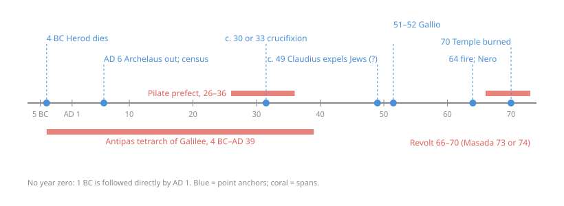

# The New Testament · Lesson 1.3: Under Rome

> ⏱ ~15 min · Module 1: The world of the New Testament and the making of the gospels · Builds on: [1.1 Reading the New Testament in the Church](01-01-reading-the-new-testament-in-the-church.md), [1.2 Second Temple Judaism](01-02-second-temple-judaism.md) · Unlocks: [1.5 From oral tradition to written gospel](01-05-from-oral-tradition-to-written-gospel.md), [2.3 Luke](02-03-luke.md), [4.2 Paul's life and letters](04-02-pauls-life-and-letters.md)

## Why this matters

Every New Testament date is borrowed. The gospels and Paul give no years; they give names: Herod, Pilate, Caiaphas, Claudius, Gallio. Each name is a window of years known from Roman and Jewish sources, so a date for a New Testament event is the overlap of those windows. This lesson builds the windows, and the political world the texts assume: a client king, his sons, Roman governors, taxes, patrons, and a revolt that ended with the Temple in ashes.

## The idea

Treat a passage like an undated letter that mentions "the tetrarch", "the governor", "Caesar". You cannot read off the year, but you can **fence** it: after the last of them took office, before the first of them left. Three overlapping terms can pin a scene to a few years.

The fence-posts for this course are eight [dating anchors](../reference.md#dating-anchors-of-the-new-testament-world):

| Anchor | What fixes it |
|---|---|
| **4 BC** Herod the Great dies | Josephus's reign-lengths plus a lunar eclipse he mentions before the death |
| **AD 6** Archelaus deposed; Judaea a Roman province; census of Quirinius | Josephus, *Antiquities* 17–18 |
| **26–36** Pontius Pilate governs Judaea | Josephus's tenures for Gratus and Pilate |
| **c. 30 or 33** the crucifixion | Pilate's term, Caiaphas, a Friday Passover |
| **c. 49** Claudius expels Jews from Rome | Suetonius plus a late date (hedged below) |
| **51–52** Gallio proconsul of Achaia | an inscription at Delphi ([4.2](04-02-pauls-life-and-letters.md) owns it) |
| **64** fire of Rome; Nero blames the Christians | Tacitus, *Annals* 15.44 |
| **70** the Temple burns | Josephus, *War* 6 |

One caution: there is **no year zero**. 1 BC is followed directly by AD 1, so any span that crosses the line is one year shorter than subtraction suggests. The era was computed in the sixth century by Dionysius Exiguus, for Easter tables, so "Jesus born about 5 BC" is no paradox.

## Source

Josephus, *Antiquities* 18.3.1 (Whiston's translation, public domain; Pilate's first act in office):

> But now Pilate, the procurator of Judea, removed the army from Cæsarea to Jerusalem, to take their winter quarters there, in order to abolish the Jewish laws. So he introduced Cæsar's effigies, which were upon the ensigns, and brought them into the city; whereas our law forbids us the very making of images; on which account the former procurators were wont to make their entry into the city with such ensigns as had not those ornaments. ... But they threw themselves upon the ground, and laid their necks bare, and said they would take their death very willingly, rather than the wisdom of their laws should be transgressed; upon which Pilate was deeply affected with their firm resolution to keep their laws inviolable, and presently commanded the images to be carried back from Jerusalem to Cæsarea.

Read it for the structure of power it assumes. The governor lives at **Caesarea** on the coast and comes up with troops; the crowd goes *to him* to petition. The flashpoint is **images**: the standards bore the emperor's likeness, which the Law forbade, and earlier governors had used plain ones. The sequel (18.3.2) is the same pattern with money: Pilate pays for an aqueduct from the "sacred money", meaning the Temple treasury, and his soldiers club the protesters. A governor could be moved by a crowd willing to die, and could kill one. The gospels' Pilate works in exactly this space (compare Luke 13:1).

Note the title "procurator": the stone under the Timeline disagrees.

## The argument

1. **Herod the Great (king 37–4 BC).** A Roman client king: he kept order, paid Rome, and rebuilt the Temple on a vast scale. Josephus gives his reign as 34 years from his capture of Jerusalem (37 BC) and mentions a lunar eclipse shortly before his death. Counted Josephus's way (the first partial year counts as year 1), that gives **4 BC**. That is the majority date; a minority, from W. E. Filmer (1966) on, argues for 1 BC, using a different eclipse. Since Matthew 2:1 puts Jesus's birth in Herod's reign, on the majority date he was born **before 4 BC**. *In words:* the "BC" birth follows from Herod's death, not from an evangelist's mistake.
2. **Herod's will split the kingdom among [three sons](../reference.md#herod-the-great-and-his-sons).** **Archelaus** got Judaea, Samaria and Idumaea, as ethnarch. Rome deposed him in **AD 6** and put Judaea under a Roman governor (Matthew 2:22). **Herod Antipas** got Galilee and Peraea as tetrarch, 4 BC to AD 39: the Herod who beheaded the Baptist, whom Jesus calls a fox (Luke 13:32). **Philip** got the north-east, from 4 BC until his death in Tiberius's twentieth year (*Ant.* 18.4.6), which is AD 33/34. *In words:* Jesus the Galilean lived under a Jewish client ruler; Jerusalem, where he died, lay under a Roman governor.
3. **The governors, and Pilate.** From AD 6 Judaea had equestrian (second-rank) Roman governors based at Caesarea. Josephus says Valerius Gratus came under Tiberius and stayed eleven years, then Pilate succeeded him. Pilate was sent to Rome after ten years and arrived after Tiberius had died, which was in March 37 (*Ant.* 18.2.2; 18.4.2). That gives [Pilate](../reference.md#pontius-pilate-prefect-of-judaea) the usual dates **26–36**, and the crucifixion falls inside them. Its year is disputed between **30** (John P. Meier, *A Marginal Jew* vol. 1, favours 7 April 30) and **33**; calendar and astronomy arguments divide.
4. **Galilee under Antipas.** Antipas rebuilt **Sepphoris**, four miles from Nazareth, as his capital. He then founded **Tiberias** on the lake, named for the emperor, on ground where graves had to be cleared (*Ant.* 18.2.1, 18.2.3). Whether Antipas's building squeezed the peasantry, as Richard Horsley argues, or left the rural economy largely intact, as Morten Hørning Jensen argues from the archaeology, is a live dispute. E. P. Sanders stresses a fact both sides must use: no Roman legion was stationed in Galilee in Jesus's lifetime. *In words:* Galilee felt Rome through Antipas's taxes and cities, not Roman soldiers.
5. **Taxation and patronage.** The [census of Quirinius](../reference.md#the-census-of-quirinius) (Josephus's "Cyrenius") registered the new province for tribute. Josephus dates the end of it to "the thirty-seventh year of Cæsar's victory over Antony at Actium" (*Ant.* 18.2.1), and Actium was 31 BC. It provoked Judas the Galilean's revolt (Acts 5:37). Luke 2:2 links the census to Jesus's birth, which sits badly with a birth before 4 BC. That problem belongs to [2.3](02-03-luke.md). The tribute question of Mark 12:14 uses a Latin loanword, *kēnsos*, meaning the Roman poll-tax. Patronage was the other glue: benefactors gave buildings, and received honour. Luke's centurion, who built the synagogue at Capernaum (7:5), is a patron. At 22:25, Jesus notes that rulers are called *euergetai*, "benefactors", and tells his disciples not to be like them.
6. **The revolt and the fall of the Temple.** War broke out in 66. Josephus has the sanctuary burn on the tenth of Lous (Ab), **70** (*War* 6.4.5); Masada fell in 73 or 74. [`church-history` 1.1](../../church-history/lessons/01-01-the-first-generation-and-its-sources.md) owns the event. Here 70 is a **dating anchor**: whether a text knows the Temple is gone is a main argument in dating the gospels, [1.5](01-05-from-oral-tradition-to-written-gospel.md)'s question.
7. **Paul's Rome.** Paul travelled Roman roads between Roman cities: Philippi, a colony (Acts 16:12), and Thessalonica on the Via Egnatia; Corinth, a colony refounded by Julius Caesar. Two anchors hold his chronology: **Gallio**, proconsul of Achaia (Acts 18:12), whose year, 51–52, [4.2](04-02-pauls-life-and-letters.md) reads from the Delphi inscription, and **Claudius's expulsion** of Jews from Rome (Acts 18:2; Example 2).

**Mark the levels.** One fact here is dogma: the Creed professes Jesus crucified under Pontius Pilate (rung 1), on apostolic witness, not on Josephus. Little else is Church teaching. Herod's death in 4 BC, Pilate's 26–36, the year of the crucifixion, the date of Claudius's edict: every one is a **historians' reconstruction** with no magisterial standing either way. The [ladder of levels](../../fundamental-theology/lessons/04-04-the-ladder-of-doctrinal-authority.md) does not apply to them. What *is* Church teaching is that the gospels have a [historical character](../reference.md#historical-character-of-the-gospels) and faithfully hand on what Jesus did and taught (Dei Verbum 19, paraphrased; weighed in [1.1](01-01-reading-the-new-testament-in-the-church.md)). That teaching makes the fit with Rome matter, but fixes no date. Whether a real chronological slip, such as Luke's census if it is one, touches [inerrancy](../../fundamental-theology/lessons/03-02-inerrancy.md) depends on what the author *asserts* and on a reading of Dei Verbum 11 that Catholics still dispute. See [church teaching vs hypothesis](../reference.md#church-teaching-vs-hypothesis).

## Timeline

The one inscription securely known to name Pilate in his lifetime was found at Caesarea in 1961, reused in the theatre; it is now in the Israel Museum. The damaged lines are usually restored as *[Ponti]us Pilatus [praef]ectus Iuda[ea]e*, dedicating a "Tiberieum" to the emperor. The surviving *-ectus* ending is why most historians read [prefect, not procurator](../reference.md#prefect-and-procurator). On the usual view Judaea's governors were prefects until 41, and "procurator", originally a financial title, became theirs only under Claudius; Tacitus and Josephus used the title of their own day. Luke 3:1 sidesteps the question with a generic verb: *hēgemoneuontos*, "while governing".

## Worked examples

**Example 1 (clean): fence Luke 3:1–2.** Luke dates the Baptist's call by seven names. Turn the five that are well documented into windows (Lysanias and Annas add little):

| Name in Luke | Window |
|---|---|
| Tiberius | 14–37 |
| Pilate, governing Judaea | 26–36 |
| Herod (Antipas), tetrarch of Galilee | 4 BC–AD 39 |
| Philip, tetrarch | 4 BC–AD 33/34 |
| Caiaphas high priest | appointed by Gratus, removed by Vitellius about 36/37 |

The intersection is **26 to 33/34**. Luke's own "fifteenth year" of Tiberius must fall inside it, and on either way of counting Tiberius's years (P1) it does. Names were how an ancient historian gave a date.

**Example 2 (hard): Claudius's expulsion, [c. 49?](../reference.md#claudius-and-chrestus)** Acts 18:2 says Aquila and Priscilla had lately come to Corinth from Italy "because that Claudius had commanded all Jews to depart from Rome." Suetonius (*Claudius* 25.4, about 120) says: *Iudaeos impulsore Chresto assidue tumultuantis Roma expulit*. In this lesson's translation: "He expelled from Rome the Jews, who were constantly rioting at the prompting of Chrestus." There is no year in either.

Where it strains:

- **Who is Chrestus?** Most scholars take *Chrestus* as a common misspelling of *Christus*, making the riots synagogue disputes over Jesus. But *Chrestus* was also a real slave name, and Suetonius writes as if the man were present in Rome. The Christian reading is probable, not proven.
- **What year?** The date 49 comes from Orosius, a fifth-century Christian historian, who places the edict in Claudius's ninth year and cites Josephus for it. No such passage survives in Josephus. Cassius Dio (60.6.6), under **41**, says instead that Claudius did not expel the Jews but banned their meetings. Gerd Lüdemann builds an early Pauline chronology on 41. Rainer Riesner defends 49, which fits Acts' "lately" and Gallio neatly.

The [crux](../../philosophical-method/lessons/04-03-finding-the-crux.md) is whether Dio and Suetonius describe **one** measure or **two**. The majority prefers 49, but the fit with Acts is itself part of what is being weighed: **c. 49, disputed**.

## Watch out

- **Level error, both directions.** "The Church teaches Jesus died in AD 33" is false: no date is Church teaching. Equally, "if Herod died in 4 BC, the gospels are unhistorical" misreads Dei Verbum 19, which commits the Church to the gospels' historical character, not to the Dionysian calendar.
- **"Pilate ruled Galilee."** He governed Judaea (with Samaria and Idumaea). Galilee was Antipas's until 39, which is why Luke's Pilate can send the Galilean Jesus to Herod (23:6–7).
- **Three Herods (plus two more).** Herod the Great (Matthew 2), Antipas (the Baptist's death, the passion in Luke), and Agrippa I (Acts 12, died 44), with Philip and Agrippa II (Acts 25–26) besides. Mark 6:14 calls Antipas "king"; the parallels in Matthew 14:1 and Luke 9:7 call him "tetrarch".

## One-liner

> The New Testament dates itself by Roman names: turn each name into a window of years, intersect the windows, and keep every resulting date as a reconstruction, never a doctrine.

## Problems

**P1 (🟢)** *(Formal)* Luke 3:1 (Douay–Rheims): "Now in the fifteenth year of the reign of Tiberius Caesar, Pontius Pilate being governor of Judea..." Augustus died on 19 August AD 14. Some scholars count Tiberius's reign instead from about AD 12, when he began to share Augustus's provincial command. (a) Give the fifteenth year on each reckoning, as a span of calendar years. (b) Luke 3:23 says Jesus was "beginning about the age of thirty years". If he was born in 5 BC, how old was he in each case? Show the arithmetic, including the year-zero step.

**P2 (🟡)** *(Exegetical)* An **invented** papyrus fragment: "In the days when the tetrarch Herod had lately founded his city on the lake and named it for Caesar, we went up to Jerusalem for Passover, and the prefect had come up from Caesarea with his soldiers." (a) Give the narrowest window of years the fragment allows, naming the anchor that sets each end. (b) Name the ruler of Galilee and the office of the man in Jerusalem, and say whether the fragment lets you name *which* prefect. Three sentences in all.

**P3 (🔴)** *(Exegetical)* An **invented** sermon: "Jesus grew up in Nazareth under the heel of Pilate, whose legions patrolled Galilee. Paul's friends Aquila and Priscilla had been driven out of Rome by Claudius. And when Paul wrote to the Romans, they could look back on the Temple already lying in ruins." (a) Which of the three sentences are anachronistic or wrong, and which anchor corrects each? (b) For each correction, say whether it rests on Church teaching or on a scholarly reconstruction. **120 words.**

Solutions

**P1** *(Formal)*

**Must hit, strict:** (a) From Augustus's death: year 1 runs from 19 August 14 to August 15, so year 15 runs from August 28 to August 29. From the co-regency: year 1 runs from 12 to 13, so year 15 runs from 26 to 27 (by the same count, $12 + 14 = 26$). Both lie inside Pilate's 26–36. (b) With no year zero, age in year $Y$ AD for a birth in year $B$ BC is $Y + B - 1$. In AD 28: $28 + 5 - 1 = 32$. In AD 26: $26 + 5 - 1 = 30$ (in 27, 31). Either way "about thirty" holds, more exactly on the early reckoning.

**Wrong turns:** answering $14 + 15 = 29$ (year 1 *is* AD 14–15, so year 15 starts at $14 + 14 = 28$). Answering $28 + 5 = 33$, which forgets that 1 BC is followed by AD 1. Treating Luke's "about" as a precise age.

**Model answer:** (a) From 14: August 28 to August 29. From about 12: 26 to 27. (b) $28 + 5 - 1 = 32$ on the first reckoning, and $26 + 5 - 1 = 30$ (or 31 in 27) on the second, since there is no year zero. Both fit "about thirty".

**P2** *(Exegetical)*

**Must hit, strict:** (a) After the founding of **Tiberias**, named for Tiberius, so after AD 14 (the city was founded under Tiberius; "lately" narrows it further, but only loosely). Before **39**, when Antipas was deposed. And a *prefect* in Jerusalem requires direct Roman rule, which held from AD 6 until 41. So **14–39**. (b) Galilee: **Herod Antipas**, tetrarch. Jerusalem: the **Roman prefect** of Judaea, coming up from Caesarea for the feast as in the Source. The window covers Gratus, Pilate and Pilate's short-lived successors, so the fragment **cannot** name him.

**Wrong turns:** naming Pilate because he is the famous one. Starting the window at 4 BC, from Antipas's accession, and ignoring the city. Reading "Herod" as Herod the Great (he was a king, not a tetrarch, and died before any prefect).

**Model answer:** The fragment fits 14–39: Tiberias honours Tiberius, who came to power in 14, and Antipas lost Galilee in 39. Galilee is ruled by Herod Antipas as tetrarch, and Jerusalem by a Roman prefect of Judaea who, like Pilate in Josephus, comes up from Caesarea with troops. It could be Gratus, Pilate or a successor; nothing in it decides which.

**P3** *(Exegetical)*

**Must hit, strict (a):** Sentence 1 is wrong twice. Galilee was under **Antipas** (4 BC–AD 39), not Pilate. Pilate arrived in **26**, when Jesus was an adult. And no legion was stationed in Galilee. Sentence 2 is **correct**, per Acts 18:2 (its date, c. 49, is disputed, but the claim is not). Sentence 3 is an anachronism. The Temple fell in **70**; Romans is dated by nearly all scholars to the mid-to-late 50s, and Paul is usually thought to have died under Nero.

**Must hit, strict (b):** every correction rests on a **scholarly reconstruction**: Josephus's tenures, the date of Romans. None is Church teaching. The date of Romans is a hypothesis, though a near-consensus one.

**Wrong turns:** flagging sentence 2 because the date of the edict is uncertain. Calling the date of Romans Church teaching, or the Temple's fall a "doctrine".

**Model answer:** The first sentence puts Galilee under Pilate. It was Antipas's until 39, and Pilate only came to Judaea in 26, when Jesus was grown. The second is fine: Acts 18:2 says so, even if the year of the edict is debated. The third is anachronistic. The Temple burned in 70, and Romans is dated by almost everyone to the mid-to-late 50s. All three checks rest on historical reconstruction (Josephus's chronology, the scholarly dating of Romans), not on Church teaching.

## Flashback

**From Lesson [1.1](01-01-reading-the-new-testament-in-the-church.md) (Reading the New Testament in the Church):** *(Exegetical.)* Two passages from John (Douay-Rheims):

> **12:16** These things his disciples did not know at the first: but when Jesus was glorified, then they remembered that these things were written of him and that they had done these things to him.
>
> **20:30–31** Many other signs also did Jesus in the sight of his disciples, which are not written in this book. But these are written, that you may believe that Jesus is the Christ, the Son of God: and that believing, you may have life in his name.

Dei Verbum 19 (paraphrased) maps three stages: what Jesus did and taught; the apostles' handing on of it, with the fuller understanding they gained from the Easter events and the Spirit; and the evangelists' writing, in which they selected some things, synthesized others and explained others with the churches' situation in view. (a) Which stage does each passage show from the inside, and which words show it? (b) John 20:30 admits that much was left out. Does that sit badly with the gospels' historical character as the Church teaches it? **Two sentences per part.**

Solution

**Must hit, strict (a):** **12:16 is stage 2.** "Did not know at the first" is stage 1 seen without understanding. "When Jesus was glorified (*edoxasthē*, John's word for the cross and resurrection), then they remembered" is the post-Easter fuller understanding Dei Verbum 19 names. **20:30–31 is stage 3.** "Not written in this book" is selection, and "these are written, that you may believe" is a writer shaping his material for his readers.
**Must hit, strict (b):** **No.** Selection is part of what Dei Verbum 19 itself describes, and historical character commits the Church to the truth of what is handed on, not to its completeness.
**Wrong turns:** reading "remembered" in 12:16 as "invented". The three stages allow reinterpretation in the light of Easter, and *Sancta Mater Ecclesia* rejects inflating the community's creativity. Assigning 20:30–31 to stage 1 because it mentions signs Jesus did. Treating "not written" as a concession of error: leaving out is not getting wrong.
**Model answer:** (a) John 12:16 shows stage 2: the disciples saw the events without understanding, and only after Jesus "was glorified" did they "remember" them as fulfilling Scripture. John 20:30–31 shows stage 3: the evangelist says he chose from "many other signs" and wrote with a purpose, "that you may believe". (b) No. Dei Verbum 19 says the evangelists selected from what was handed on, and the gospels' historical character concerns the truth of what they report, not a complete record.

## Connections

- **Backward:** [1.2](01-02-second-temple-judaism.md) gave the Jewish groups and the Temple; this lesson sets them under their Roman rulers. [1.1](01-01-reading-the-new-testament-in-the-church.md) gave Dei Verbum 19, which is why the fit with the Roman world matters.
- **Forward:** [1.5](01-05-from-oral-tradition-to-written-gospel.md) uses 70 to date the gospels. [2.3](02-03-luke.md) takes on Luke's census. [3.3](03-03-what-historians-broadly-agree-on.md) puts "crucified under Pontius Pilate" among the firmest facts. [4.2](04-02-pauls-life-and-letters.md) reads the Gallio inscription and rebuilds Paul's chronology from Claudius and Gallio. [6.5](06-05-revelation.md) reads Revelation under Nero or Domitian.
- **Sideways:** the events of 64 and 70 are told in [`church-history` 1.1](../../church-history/lessons/01-01-the-first-generation-and-its-sources.md) and [1.3](../../church-history/lessons/01-03-persecution-and-martyrdom.md). Fencing an undated text by overlapping windows is [inference to the best explanation](../../philosophical-method/lessons/02-01-inference-to-the-best-explanation.md) on a small scale. The Roman tribute and the tax-farming behind the gospels' "publicans" connect to [`history-of-debt`](../../history-of-debt/syllabus.md).
