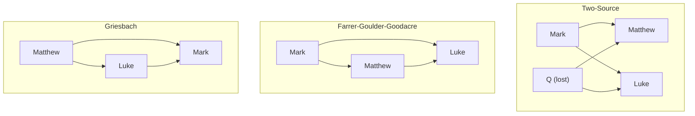

# The New Testament · Lesson 1.4: The Synoptic problem

> ⏱ ~15 min · Module 1: The world of the New Testament and the making of the gospels · Builds on: [1.1 Reading the New Testament in the Church](01-01-reading-the-new-testament-in-the-church.md), [1.3 Under Rome](01-03-under-rome.md) · Unlocks: [1.5 From oral tradition to written gospel](01-05-from-oral-tradition-to-written-gospel.md), [2.1 Mark](02-01-mark.md)

## Why this matters

Matthew, Mark and Luke are called the **Synoptics** because they can be "seen together" in parallel columns, and in those columns they share not just stories but whole sentences, word for word, in Greek. Oral memory does not do that; copying does. So one evangelist used another, and the question of who used whom decides how you read every gospel passage. If Matthew rewrote Mark, each change is Matthew's theology at work. If Mark shortened Matthew, the changes run the other way. This lesson lays out the data and the three live solutions. None of them is Church teaching.

## The idea

Sort the shared material into three piles:

- **Triple tradition:** stories in all three (the leper, the storm, the passion).
- **Double tradition:** some two hundred verses, mostly sayings, in Matthew and Luke but not Mark (the Lord's Prayer, the Beatitudes in two forms).
- **Special material:** what one gospel alone has, labelled **M** (Matthew's) and **L** (Luke's).

Now look at the triple tradition and notice where Mark sits. Matthew and Luke often agree with Mark; they rarely agree with each other *against* Mark. Mark is the **middle term**. That fact has three explanations. Mark came first and both others copied him. Or Mark came last and combined them. Or the three stand in a chain with Mark in the middle. The data do not pick among them by themselves. You weigh them as rival explanations, which is [inference to the best explanation](../../philosophical-method/lessons/02-01-inference-to-the-best-explanation.md).

## Source

The oldest testimony about how gospels were written is Papias, bishop of Hierapolis in the early second century, quoted by Eusebius, *Church History* III.39.15–16 (McGiffert's translation, NPNF 2nd series vol. 1):

> "This also the presbyter said: Mark, having become the interpreter of Peter, wrote down accurately, though not in order, whatsoever he remembered of the things said or done by Christ. For he neither heard the Lord nor followed him, but afterward, as I said, he followed Peter, who adapted his teaching to the needs of his hearers, but with no intention of giving a connected account of the Lord's discourses ... "
>
> "So then Matthew wrote the oracles in the Hebrew language, and every one interpreted them as he was able."

Read it for what it does not say. Papias says nothing about any evangelist using another's book. "Oracles" renders *ta logia*, which could mean sayings or a whole account of words and deeds; McGiffert's note says both readings have defenders. "The Hebrew language" renders *Hebraidi dialektō*, which could mean Hebrew or Aramaic, or even, as some scholars argue, a Hebrew *style* of arranging material. The difficulty: our Greek Matthew does not read like a translation. In the triple tradition it reproduces Mark's Greek word for word. So whatever Papias's Hebrew "oracles" were, most scholars doubt they were our Matthew. His "not in order" also shows that people were comparing orders of events by the early second century.

## The argument

1. **The overlap is huge.** B. H. Streeter (*The Four Gospels*, 1924) counted the substance of over 600 of Mark's 661 verses in Matthew, and about 350, just over half, in Luke. *In words:* nearly all of Mark is in Matthew and about half is in Luke.
2. **Order points to the middle term.** Where Matthew departs from Mark's order, Luke keeps it, and where Luke departs, Matthew keeps it (Streeter's third head, after Lachmann in 1835). The Downside Benedictine B. C. Butler (*The Originality of St Matthew*, 1951) named the mistake of reading this as a proof of Mark's priority the "Lachmann fallacy". A middle term fits Griesbach just as well. *In words:* order shows that Mark is in the middle, not that Mark is first.
3. **Direction: the case for Mark first.** Three features look like a later writer improving Mark rather than Mark spoiling a text in front of him.
   - **Harder readings.** Mark 6:5 says Jesus *could not* (*ouk edynato*) do any mighty work in Nazareth. Matthew 13:58 has "he did not many" there, "because of their unbelief". Changing "could not" into "did not" is easy to explain; the reverse is not.
   - **Rougher Greek.** Mark uses historic presents ("there *comes* to him a leper", Mark 1:40), his favourite *euthys* ("immediately") and strings of "and ... and". Matthew and Luke smooth these, each in his own way.
   - **The omission problem.** If Mark used Matthew and Luke, he left out the infancy narratives, the Sermon on the Mount, the Lord's Prayer and every resurrection appearance, while making the stories he kept *longer* with vivid detail.
   Most critical scholars find this decisive. A majority is still not a proof.
4. **The Two-Source hypothesis.** Matthew and Luke each used Mark, and also, independently, a lost sayings collection called **Q** (German *Quelle*, "source"), which explains the double tradition. H. J. Holtzmann (1863) gave it its classic form and Streeter refined it. Raymond Brown and Joseph Fitzmyer both adopted it as the most satisfactory working solution while calling it a hypothesis. **Q** survives in no manuscript and no ancient writer mentions it.
5. **Farrer–Goulder–Goodacre: Mark first, no Q.** Austin Farrer ("On Dispensing with Q", 1955), Michael Goulder and Mark Goodacre (*The Case Against Q*, 2002) keep Markan priority and drop Q. On their view Luke used Matthew as well as Mark. Their chief evidence is the **minor agreements**, places in the triple tradition where Matthew and Luke agree in wording against Mark. Two writers copying Mark independently should not agree so often. Q's defenders, such as John Kloppenborg, reply that Luke almost never has Matthew's additions to Mark's stories. Take the grainfield dispute, where Luke 6:1–5 lacks Matthew 12:5–7 on the priests who break the sabbath and "I will have mercy, and not sacrifice". A Luke who knew Matthew, they argue, should show it there.
6. **Griesbach: Matthew first, Mark last.** J. J. Griesbach (1789) proposed that Luke used Matthew and Mark combined both. William Farmer (*The Synoptic Problem*, 1964) revived the view. Its best datum is Mark's double phrases. Mark 1:32 has "when it was evening, after sunset", and Matthew 8:16 has only the first half ("when evening was come") and Luke 4:40 only the second ("when the sun was down"). It also has patristic support. Clement of Alexandria, per Eusebius VI.14, reports that "the Gospels containing the genealogies" were written first. Its opponents answer that doubled phrases are Mark's habit everywhere, not only where the others split them.

**Mark the levels.** Every solution above is a **scholarly hypothesis** with no magisterial standing either way (see [Church teaching vs hypothesis](../reference.md#church-teaching-vs-hypothesis)). What the Church teaches is Dei Verbum 19. The gospels faithfully hand on what Jesus really did and taught, and the evangelists selected, synthesized and explained with their churches in view ([historical character of the gospels](../reference.md#historical-character-of-the-gospels), [1.1](01-01-reading-the-new-testament-in-the-church.md)). That is conciliar teaching, and it says nothing about which gospel came first. The hard case is the early Pontifical Biblical Commission. Its response on Matthew (1911) upheld Matthew's priority and a Semitic original. Its response of 1912 on Mark, Luke and the Synoptic question told Catholic scholars not to embrace the Two-Source theory lightly. Those were disciplinary responses of their time, weighed with [`fundamental-theology` 4.5](../../fundamental-theology/lessons/04-05-reading-a-documents-weight.md). In 1955 the Commission's secretary and under-secretary, reviewing a new edition of the *Enchiridion Biblicum*, wrote that such responses left scholars free except where faith and morals were touched. How official that statement was is itself disputed. Since 1971 the Commission has been an advisory body of scholars. Today the order of the gospels is **freely disputed among Catholics**.

## The three hypotheses

All three make Mark the middle term. They differ on the arrows' direction and on whether a lost document is needed.

## Worked examples

**Example 1 (clean): the storm at sea** (Mark 4:35–41, Matthew 8:23–27, Luke 8:22–25, Douay–Rheims). The disciples wake Jesus:

| Mark 4:38 | Matthew 8:25 | Luke 8:24 |
|---|---|---|
| "Master, doth it not concern thee that we perish?" | "Lord, save us, we perish." | "Master, we perish." |

His reply: Mark, "have you not faith yet?"; Matthew, "O ye of little faith"; Luke, "Where is your faith?"

Run it with Mark first. Mark's disciples reproach their teacher and are told they have *no* faith. Matthew turns the reproach into a prayer ("Lord, save us") and gives them *little* faith. Luke drops the reproach and asks where their faith has gone. Each softens Mark independently and in his own style, and both changes fit their authors' treatment of the disciples elsewhere. Now run it Griesbach's way: Mark read two respectful versions and made the disciples *more* insolent and Jesus's verdict harsher. That is possible, but it has to be argued. This is the harder-reading argument at work: the rough version is easier to explain as the source.

**Example 2 (hard): "Who is it that struck thee?"** At the mockery after the night trial:

| Mark 14:65 | Matthew 26:68 | Luke 22:64 |
|---|---|---|
| "Prophesy." | "Prophesy unto us, O Christ. Who is he that struck thee?" | "Prophesy: Who is it that struck thee?" |

In Greek, Matthew and Luke share five identical words, *tis estin ho paisas se*, and Mark has none of them. Mark covers Jesus's face, so "Prophesy" makes sense in his account. Matthew has no blindfold, so in Matthew the question "who struck you?" hangs oddly.

- **Farrer–Goodacre:** easy. Luke read the question in Matthew.
- **Griesbach:** easy. Mark dropped it.
- **Two-Source:** strained. Two independent editors coining the same five words is unlikely. Streeter's answer was that the words were never in Matthew at all: they came from Luke and got into every surviving manuscript of Matthew by scribal assimilation. No manuscript of Matthew lacks them, so this is a conjecture.

This is the most famous of the [minor agreements](../reference.md#minor-agreements). It does not refute Q. It shows where Q's defenders have to pay.

## Watch out

- **"Catholics must hold that Matthew wrote first."** That turns a disciplinary response of 1912 into standing doctrine. The order of the gospels is freely disputed; Dei Verbum 19 is silent on it.
- **"Markan priority is established fact."** It is the majority hypothesis, not a result, and Q is a hypothesis stacked on it. Farrer and Griesbach defenders are not cranks.
- **"If Matthew rewrote Mark, the gospels aren't historical."** Dei Verbum 19 already says the evangelists selected, synthesized and explained. Redaction is what the Church's teaching describes, not a threat to it.
- **Papias as a synopsis.** Papias reports a Hebrew Matthew and a Petrine Mark. He says nothing about copying. Reading Griesbach or Markan priority into him is eisegesis.

## One-liner

> Mark is the middle term of the Synoptics; whether he stands first (with or without Q) or last is a hypothesis to weigh, not a doctrine to hold.

## Problems

**P1 (🟢)** *(Exegetical)* Assign each claim a status: **Church teaching** (name the document), **scholarly hypothesis**, or **historical report** (name the witness). One line each.

1. "Mark was written before Matthew."
2. "The four gospels faithfully hand on what Jesus really did and taught."
3. "Matthew wrote the oracles in the Hebrew language."
4. "Luke knew Matthew's gospel."
5. "Mark wrote down what Peter preached."

**P2 (🟡)** The healing of the leper, key phrases (Douay–Rheims, with the Greek where it decides):

| | Mark 1:40–45 | Matthew 8:2–4 | Luke 5:12–16 |
|---|---|---|---|
| Arrival | "And there came a leper to him" (*erchetai*, present tense) | "And behold (*idou*) a leper came" | "behold (*idou*) a man full of leprosy" |
| Plea | "If thou wilt thou canst make me clean." | "Lord (*kyrie*), if thou wilt ..." | "Lord (*kyrie*), if thou wilt ..." |
| Jesus | "having compassion on him, stretched forth his hand and touching him saith to him" (*... hēpsato kai legei autō*) | "stretching forth his hand, touched him, saying" (*hēpsato autou legōn*) | "stretching forth his hand, he touched him, saying" (*hēpsato autou legōn*) |
| Cure | "immediately" (*euthys*) | "forthwith" (*eutheōs*) | "immediately" (*eutheōs*) |
| After | "he strictly charged him and forthwith sent him away" (1:43) | not present | not present |

(a) *(Exegetical)* List the agreements of Matthew and Luke against Mark in this table, positive and negative. (b) *(Evaluative)* In 150 words or fewer, say whether the Two-Source hypothesis or the Farrer hypothesis explains this pericope better. Any verdict passes.

**P3 (🔴)** *(Exegetical)* An **invented** study-Bible note:

> "The Church's Biblical Commission settled in 1912 that Matthew wrote first, and Papias confirms that Matthew wrote in Hebrew. Our Greek Matthew is therefore the earliest gospel, and Mark is its abridgement, as Augustine said. Catholics who follow Markan priority depart from Church teaching."

(a) Name the two level errors. (b) Name what the note makes Papias say that he does not say, and the textual fact that tells against identifying his Hebrew work with our Greek Matthew. **Two sentences per part.**

Solutions

**P1** *(Exegetical)*

**Must hit, strict:** (1) **Hypothesis**: Markan priority, the majority view, with no magisterial standing. (2) **Church teaching**: Dei Verbum 19 (conciliar teaching; credit *Sancta Mater Ecclesia*). (3) **Historical report**: Papias, via Eusebius, *Church History* III.39.16. It is neither doctrine nor a hypothesis about copying. (4) **Hypothesis**, held by both Farrer–Goodacre and Griesbach and denied by the Two-Source view. (5) **Historical report**: Papias, from "the presbyter", via Eusebius III.39.15. It is evidence to weigh, and it says nothing about which gospel Mark used, if any.

**Wrong turns:** marking (1) as Church teaching "since 1965", when Dei Verbum names no order. Marking (3) as Church teaching because a Father said it. Marking (5) as support for Markan priority: a Petrine source for Mark is compatible with all three hypotheses.

**Model answer:** (1) Hypothesis (Markan priority). (2) Church teaching, Dei Verbum 19. (3) Report of Papias, in Eusebius III.39. (4) Hypothesis (Farrer and Griesbach say yes, Two-Source says no). (5) Report of Papias's presbyter, in Eusebius III.39.

**P2** *(Exegetical (a) · Evaluative (b))*

**Must hit, strict (a):** positive agreements against Mark: **"behold"** (*idou*), **"Lord"** (*kyrie*), the same participle construction **"touched him, saying"** (*hēpsato autou legōn*) in place of Mark's "touched and says to him", and **"immediately" as *eutheōs*** for Mark's *euthys*. Negative agreements: both lack **"having compassion"** and the **stern charge and sending away** of 1:43. Credit also: both drop Mark's historic present *erchetai*.

**Must hit, any verdict (b):** (1) Give the Two-Source explanation: each change is a typical independent improvement. *Idou* and *kyrie* are frequent in both writers, the participle smooths Mark's parataxis, *eutheōs* is the normal Greek form, and both tend to drop Jesus's strong emotions. (2) Give the Farrer explanation: Luke's agreement with Matthew in several places at once is what copying from Matthew predicts. (3) Weigh how many coincidences independence can absorb, and name the item that decides it for you.

**Wrong turns:** counting "stretching forth his hand" as a minor agreement; Mark has it too. Treating the minor agreements as refuting Markan priority. They cut against *Q*, and Farrer keeps Mark first. Using the Douay's "high priest" in Mark 1:44 as a difference: the Greek there is "the priest", and "high" comes from the Vulgate.

**Model answer (b), one of several:** The Two-Source view explains each agreement easily taken alone. Both evangelists like "behold" and "Lord", both routinely turn Mark's "and says" into a participle, and both drop Mark's emotions and his harsh "sent him away" out of reverence. The problem is the cluster: four positive and two negative agreements in five verses, all with the same result. On Farrer, Luke had Matthew's wording in front of him, and one cause explains six effects. Still, none of these changes is unusual for either writer, and a cluster of stylistic improvements is what two good Greek stylists correcting the same rough source might produce. On this pericope alone Farrer is more economical, but only slightly. The mockery's "Who is it that struck thee?" is a stronger case than this one.

**P3** *(Exegetical)*

**Must hit, strict (a):** (1) The 1912 response is treated as **settled doctrine**. It was a disciplinary response of the early Commission, whose later status is exactly what was loosened (1955) and changed (the Commission became advisory in 1971). The order is now **freely disputed**. (2) Markan priority is called a **departure from Church teaching**, but it is a scholarly hypothesis with no magisterial standing either way. Dei Verbum 19 teaches the gospels' historical character, not their order.

**Must hit, strict (b):** Papias does not say that **Matthew's book was the first gospel** or that **Mark used it**. He attests only a Hebrew work of "oracles" and a Mark based on Peter's preaching. The textual fact: our Greek Matthew **reproduces Mark's Greek wording** in the triple tradition and does not read as a translation. Credit also: *logia* need not mean a full gospel.

**Wrong turns:** calling Augustine's view heresy or error. It is a respectable ancient opinion (his "attendant and epitomizer", *Harmony of the Gospels* I.2.4) and is itself a hypothesis. Answering (a) by asserting Markan priority as fact, which only swaps the level error.

**Model answer:** (a) It turns the 1912 response, a disciplinary decision whose force later lapsed, into permanent teaching; the order of the gospels is now freely disputed. It also calls Markan priority a departure from Church teaching, when it is a hypothesis about which no Church teaching exists. (b) Papias reports a Hebrew collection of "oracles" and says nothing about which gospel came first or about Mark abridging anything. Our Greek Matthew copies Mark's Greek word for word, which a translation of a Hebrew original would not do.

## Flashback

**From Lesson [1.2](01-02-second-temple-judaism.md) (Second Temple Judaism):** *(Exegetical.)* Two positions on the Dead Sea Scrolls, paraphrased:

- **The majority:** the community at the Qumran settlement was Essene or closely related, and the Scrolls in the nearby caves were its library. The evidence: Pliny the Elder places Essenes on the Dead Sea's western shore; the Scrolls' rules for common property and initiation match what Josephus says of the Essenes; and the Scrolls are hostile to the Jerusalem priesthood.
- **Norman Golb:** the Scrolls were libraries brought from Jerusalem and hidden in the caves during the revolt against Rome.

(a) Name the single premise the majority needs and Golb must deny. (b) Name one kind of evidence that would move that premise, and say which way. (c) Give the question's level in one sentence. **100 words or fewer in total.**

Solution

**Must hit, strict (a):** the crux is **whether the scrolls in the caves belonged to the people living at the Qumran settlement**, the link between site and caves. Golb must deny that the collection was the settlement's own library. He need not deny that Essenes existed, or that Pliny and Josephus describe them accurately.
**Must hit, strict (b):** evidence bearing on that link. Physical or archaeological ties between the caves and the settlement favour the majority. A collection too varied in outlook to be one sect's library favours Golb. Either qualifies if the direction is stated.
**Must hit, strict (c):** a **historical reconstruction** on both sides, with **no magisterial standing** either way. The majority view is well evidenced, and a majority is not a proof.
**Wrong turns:** making the crux "whether the Essenes existed" or "whether Josephus is reliable", which both sides can grant. Offering Pliny's location as the decisive evidence: it puts Essenes near the Dead Sea, not their books in these caves. Treating the Essene identification as settled fact, or as something the Church teaches.
**Model answer:** (a) The crux is whether the cave scrolls were the Qumran settlement's own library; Golb denies it. (b) Physical ties between caves and settlement would favour the majority; a collection too diverse for one sect would favour Golb. (c) It is a historians' hypothesis with no magisterial standing.

## Connections

- **Backward:** [1.1](01-01-reading-the-new-testament-in-the-church.md) gave Dei Verbum 19's three stages. Everything here happens inside the third: the evangelists' writing. The weight of early Commission responses is read with [`fundamental-theology` 4.5](../../fundamental-theology/lessons/04-05-reading-a-documents-weight.md) and [the ladder](../../fundamental-theology/lessons/04-04-the-ladder-of-doctrinal-authority.md). The Church's documents on the method are in [`old-testament`](../../old-testament/syllabus.md) 1.2–1.3.
- **Forward:** [1.5](01-05-from-oral-tradition-to-written-gospel.md) asks what happened *before* the first gospel was written and how the gospels are dated. [2.1](02-01-mark.md)–[2.3](02-03-luke.md) read each evangelist's changes as theology, which is only possible once you have chosen a working hypothesis. [2.4](02-04-john-and-the-synoptics.md) asks the same dependence question of John. See [Markan priority](../reference.md#markan-priority), [the Two-Source hypothesis](../reference.md#two-source-hypothesis) and [the Griesbach hypothesis](../reference.md#griesbach-hypothesis) on the card.
- **Sideways:** weighing the three hypotheses is [inference to the best explanation](../../philosophical-method/lessons/02-01-inference-to-the-best-explanation.md), where scope and simplicity can pull apart. Q has scope, since it explains the double tradition in one stroke, but it is a posited document. Farrer posits nothing new, but must explain Luke's order without it, and Streeter's appeal to assimilation risks looking *ad hoc*. Papias and Eusebius reappear as witnesses to the canon in [6.6](06-06-the-formation-of-the-canon.md).
