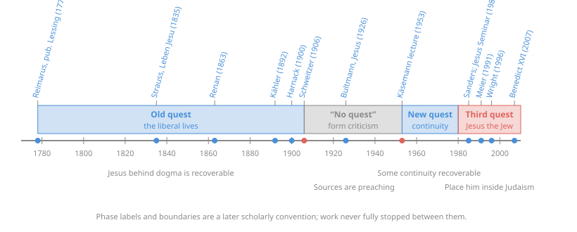

# The New Testament · Lesson 3.1: The quests

> ⏱ ~15 min · Module 3: The historical Jesus · Builds on: [1.5 From oral tradition to written gospel](01-05-from-oral-tradition-to-written-gospel.md), [2.1 Mark](02-01-mark.md) · Unlocks: [3.2 Sources and criteria](03-02-sources-and-criteria.md), [3.3 What historians broadly agree on](03-03-what-historians-broadly-agree-on.md)

## Why this matters

For two and a half centuries scholars have tried to recover Jesus as a historian with no faith commitments would describe him. The attempts come in phases, called "quests", and each phase was driven by an assumption about what the sources are and what faith needs from history. You cannot weigh any modern claim about Jesus without knowing which assumption it rests on, and exactly what the Church affirms here and what it leaves to scholars.

## The idea

Distinguish [three Jesuses](../reference.md#real-historical-and-gospel-jesus). The **real Jesus** is everything he was, said and did, most of it never written down. The **historical Jesus** is the modern construct: what a historian can recover using only public evidence and methods. John Meier makes this distinction at the start of *A Marginal Jew* (vol. 1, 1991). The **Jesus of the gospels** is the Jesus the four evangelists present, written in faith and for faith.

Each quest is a bet about the gap between the second and the third. The first questers bet the gap was huge and hid a Jesus *like us*: a moral teacher buried under dogma. Albert Schweitzer showed that they had mostly found themselves. Rudolf Bultmann concluded that the gap could not be crossed and that faith did not need it crossed. His pupils decided it must be crossed after all. Later scholars stopped asking how Jesus differed from Judaism and asked where he fit inside it.

Every one of these bets is a **scholarly hypothesis**. None has magisterial standing.

## Source

Three sayings about the kingdom, Douay–Rheims (Challoner):

> And after that John was delivered up, Jesus came into Galilee, preaching the gospel of the kingdom of God, And saying: The time is accomplished and the kingdom of God is at hand. Repent and believe the gospel. (Mark 1:14–15)

> Amen I say to you, you shall not finish all the cities of Israel, till the Son of man come. (Matthew 10:23)

> Amen I say to you that there are some of them that stand here who shall not taste death till they see the kingdom of God coming in power. (Mark 9:1; 8:39 in the Douay numbering)

The word that decides the reading is *ēngiken* (Mark 1:15), the perfect tense of *engizō*, "draw near". The lesson's translation is "the reign of God **has come near**". *Basileia* means "reign" as much as "realm": God's kingship being exercised, not a territory. Read *ēngiken* as "is imminent", with Matthew 10:23 and Mark 9:1 alongside it, and you get Schweitzer's Jesus, who expected the end within his hearers' lifetime. C. H. Dodd (*The Parables of the Kingdom*, 1935) read it as "has arrived", so that the kingdom is already present in Jesus's ministry. The liberal lives read the kingdom as an inner moral reign in the soul and hardly needed the tense at all. One verse, three Jesuses.

## The argument

1. **Reimarus: fraud.** Hermann Samuel Reimarus (d. 1768) left a manuscript that Lessing published anonymously as the Wolfenbüttel Fragments (1774–78). His Jesus was a political messiah who failed; the disciples then took the body and invented a spiritual redeemer. *Assumption:* the gospels are deliberate cover stories, and the historian's job is to see through them.
2. **Strauss: myth.** David Friedrich Strauss, *Das Leben Jesu* (1835–36), rejected two older explanations of the miracles. They were not supernatural, as the orthodox held. They were not misunderstood natural events either, as the rationalists held. They were **myth**: the early Church's faith, and Old Testament patterns, told as narrative. *Assumption:* the gospel form itself is faith, not report.
3. **The liberal lives.** Renan's *Vie de Jésus* (1863) and many German lives found a teacher of God's fatherhood and the soul's infinite worth. Harnack's lectures *Das Wesen des Christentums* (1900) are the classic statement. *Assumption:* beneath the dogma lies a Jesus congenial to modern ethics, and the historian can peel the dogma away.
4. **Kähler's objection (1892).** Martin Kähler, in *The So-Called Historical Jesus and the Historic, Biblical Christ*, argued that the Christ who has shaped history is the **preached** Christ. The reconstructed Jesus behind the gospels cannot bear the weight of faith. *Assumption:* the sources are proclamation all the way down.
5. **Schweitzer's verdict (1906).** Albert Schweitzer's *Von Reimarus zu Wrede* (English title *The Quest of the Historical Jesus*, 1910) surveyed the lives. He concluded that each author had built Jesus in the image of his own ideals. The Jesus the sources actually yield is a strange apocalyptic figure who expected the end of the age at once, on the evidence of texts like Matthew 10:23. He belongs to his own time, not to ours. The best-known image for this verdict is not Schweitzer's own. It is George Tyrrell's, about Harnack:

   > The Christ that Harnack sees, looking back through nineteen centuries of Catholic darkness, is only the reflection of a Liberal Protestant face, seen at the bottom of a deep well. (Tyrrell, *Christianity at the Cross-Roads*, 1909; p. 44 of the 1910 impression)

   *In words:* whoever looks for a Jesus like himself will find one.
6. **[Bultmann: the "no quest".](../reference.md#bultmann-and-kasemann)** [Form criticism](../reference.md#form-criticism) ([1.5](01-05-from-oral-tradition-to-written-gospel.md)) treated the gospel units as the preaching of communities. Rudolf Bultmann's *Jesus* (1926) held that we can know almost nothing of Jesus's life and personality. Theologically, faith needs only the **that** of Jesus: the bare fact that he came and was crucified. The proclaimed Christ, the kerygma, addresses the hearer directly, and trying to prop faith up with history is a search for security. *Assumption:* the gap is uncrossable, and it does not matter. The label "no quest" for 1906–53 is a later convention. Work went on meanwhile, especially in English (Dodd, T. W. Manson).
7. **Käsemann: the new quest (1953).** Ernst Käsemann was Bultmann's own pupil. On 20 October 1953, in a lecture to Bultmann's former students at Marburg, published in 1954, he argued that the gospels themselves insist that the exalted Lord *is* the earthly Jesus. Cut that link and the kerygma becomes a myth about a heavenly redeemer, a new docetism. Some sayings can still be recovered, chiefly those that fit neither contemporary Judaism nor the later Church. That test, dissimilarity, is examined in [3.2](03-02-sources-and-criteria.md). James M. Robinson named the movement in *A New Quest of the Historical Jesus* (1959). *Assumption:* the same kerygmatic sources, but continuity is theologically required.
8. **The third quest (from c. 1980).** N. T. Wright coined the label. Its founding books are E. P. Sanders, *Jesus and Judaism* (1985); John P. Meier, *A Marginal Jew* (vol. 1, 1991); and Wright's *Jesus and the Victory of God* (1996). They start from well-attested **deeds** (the Temple incident, the Twelve, the crucifixion) as well as sayings. They place Jesus **inside** Second Temple Judaism ([1.2](01-02-second-temple-judaism.md)), usually as an eschatological prophet of Israel's restoration. *Assumption:* the sources are faith documents *and* usable evidence, and context controls the reading.
9. **[The Jesus Seminar](../reference.md#the-jesus-seminar) (1985).** Founded by Robert Funk, the Seminar's fellows voted on each saying with coloured beads. Red meant Jesus said it; pink, probably something like it; grey, not his words but close to his ideas; black, later tradition. *The Five Gospels* (1993) printed the results in colour, and by its own count under a fifth of the sayings came out red or pink. Its Jesus was mainly a non-apocalyptic sage. Wright classed it as a revival of the new quest, not part of the third. Critics noted that a vote tallies opinions rather than weighing evidence.
10. **[Benedict XVI](../reference.md#benedict-xvi-on-historical-criticism), *Jesus of Nazareth* (vol. 1, 2007).** The foreword, paraphrased, makes three points. The historical-critical method is **indispensable**, because Christian faith rests on real events: the Word became flesh in history. It also has **limits**. It leaves a text in its past, it works by hypothesis, and it reads the words only as human words, so it needs a canonical, faith-guided reading to complete it. And the split since the 1950s between the "historical Jesus" and the "Christ of faith" has left believers unsure of the figure they trust. Benedict's own proposal is that the Jesus of the gospels is historically the most plausible and intelligible figure. He also said, in effect, that the book is **not an act of the magisterium**, and that readers are free to contradict it.

**[Mark the levels.](../reference.md#church-teaching-vs-hypothesis)** Church teaching: the four gospels have a [historical character](../reference.md#historical-character-of-the-gospels) and faithfully hand on what Jesus really did and taught, while the evangelists selected, synthesized and explained for their churches (Dei Verbum 19, paraphrased). That is a dogmatic constitution of an ecumenical council. It defines no new dogma, and how to weigh it is [`fundamental-theology` 4.5](../../fundamental-theology/lessons/04-05-reading-a-documents-weight.md). The same Council tells interpreters to study literary forms and the authors' intentions (Dei Verbum 12), so historical study is *commended*, not forbidden. What the Church refuses is a **split** in which the Christ of faith is not the Jesus who lived. It **endorses no reconstruction**. Reimarus's fraud, Strauss's myth, Schweitzer's apocalyptic Jesus, Sanders's list, the Seminar's sage: all are **hypotheses**, with no magisterial standing either way. So is the three-quest scheme itself. Benedict's book is a theologian's argument and carries **no magisterial level**.

## Timeline

## Worked examples

**Example 1 (clean): run [the quests](../reference.md#the-quests-for-the-historical-jesus) on Mark 1:15.** Ask each phase what "the reign of God has come near" means and why.
- *Liberal life:* an inner reign of God in the soul. The tense hardly matters, because the kingdom is a moral ideal.
- *Schweitzer:* the end of the age is imminent. Matthew 10:23 fixes the timetable, and it failed.
- *Bultmann:* the saying may well go back to Jesus, but that does not matter. What matters is the kerygma's call to decision now.
- *Third quest (Sanders, Wright):* Jewish restoration eschatology. God is about to restore Israel, and Jesus's deeds, choosing Twelve and acting in the Temple, enact it.

Each reading is fixed by the phase's **assumption** before the verse is read. That is Schweitzer's lesson, and it applies to his own reading too.

**Example 2 (hard): is "the Jesus of the gospels is the historical Jesus" a historical claim or a confession?** Benedict argues that the gospel figure explains the evidence better than the reconstructions do. Once you remove his relation to the Father, Benedict says, citing Schnackenburg, Jesus becomes unintelligible. As *argument*, this is an inference to the best explanation ([`philosophical-method` 2.1](../../philosophical-method/lessons/02-01-inference-to-the-best-explanation.md)). Historians can contest it, as they contest Sanders or Crossan. As *teaching*, the Church's commitment is narrower. The gospels hand on what Jesus really did and taught. It is not a commitment that any historian's method will reach the Jesus of faith. The strain is that Benedict's claim sits between the two. A Catholic may disagree with the pope's historical judgment, as the foreword itself allows, and still hold Dei Verbum 19 in full.

## Watch out

- **Hypothesis as teaching, and the reverse.** "Catholics must hold that Jesus expected no imminent end" or "Catholics must accept Sanders's facts" both promote a scholarly position into doctrine. "The gospels' historicity is just one scholarly view" demotes Dei Verbum 19 to a hypothesis. Both are level errors. (How the Church reads Jesus's words on "the day" is a doctrinal question, owned by [`christology` 4.2](../../christology/lessons/04-02-christs-human-knowledge-the-classical-account.md).)
- **"Historical Jesus" is not "real Jesus".** A historian's minimum does not claim that nothing more is true.
- **Tyrrell is not Schweitzer.** The deep-well image is Tyrrell's, written about Harnack, and it is often attributed to Schweitzer. Tyrrell was himself a Catholic modernist ([`church-history` 8.3](../../church-history/lessons/08-03-leo-xiii-and-the-modernist-crisis.md)). Quoting him is not quoting the magisterium.
- **The three-quest story is itself a construct.** It is a Wright-era periodization, and it undercounts the work done in English between 1906 and 1953.

## One-liner

> Every quest found a Jesus shaped by its assumption about the sources. The Church affirms that the gospels are historical and that their Christ is the Jesus who lived, and it endorses none of the reconstructions.

## Problems

**P1 (🟢)** *(Exegetical)* Match each invented one-line summary to the phase or figure whose working assumption it states: Reimarus, Strauss, the liberal lives, Bultmann, Käsemann, the third quest. One is used twice; say which. One line each.

1. "The miracle stories are neither fraud nor misunderstood natural events. They are the first believers' faith told as narrative."
2. "Beneath the creeds lies a teacher of God's fatherhood and the soul's worth, and the historian's task is to clear the creeds away."
3. "Faith needs only the fact that he came. His biography is out of reach, and seeking it is seeking a security faith does not need."
4. "If the exalted Lord is not the earthly Jesus, the gospel dissolves into myth. So we must, and can, recover some of what he said."
5. "Begin with secure deeds, such as the Temple incident and the Twelve, and read him inside the Judaism of his day."
6. "The gospels are a cover story; strip it away and you find a failed political claimant."
7. "A historian who reads the gospels as the preaching of communities should expect little biography, and that loss costs faith nothing."

**P2 (🟡)** *(Exegetical)* An **invented** op-ed:

> "The Catholic Church forbids historical study of Jesus. Vatican II declared the gospels historical, which settles every question in advance. And in 2007 the Pope himself wrote a book condemning the historical-critical method. So Catholics are bound to reject the Jesus Seminar's conclusions as heresy."

(a) Identify three errors of fact or level, citing the document or text that corrects each. (b) State the level of "the gospels have a historical character" and of "Jesus was an apocalyptic prophet". **150 words or fewer in all.**

**P3 (🔴)** *(Exegetical)* Paraphrased positions. **Bultmann:** the sources are proclamation. We can know almost nothing of Jesus's life and personality, and faith needs only the fact that he came, since grounding faith in historical research would make it depend on human works. **Käsemann:** the sources are proclamation too, but the gospels themselves tie the exalted Lord to the earthly Jesus. Without that continuity the kerygma becomes a myth, and some of Jesus's sayings are recoverable.
(a) Name the crux: the single premise one side affirms and the other denies. Say whether it is historical or theological. (b) Say what kind of evidence or argument would move it. (c) Say which side of the crux Dei Verbum 19 commits a Catholic to, and what it does *not* thereby commit a Catholic to. **Two sentences per part.**

Solutions

**P1** *(Exegetical)*

**Must hit, strict:** 1 **Strauss**. 2 **the liberal lives** (Harnack, Renan). 3 **Bultmann**. 4 **Käsemann**. 5 **the third quest** (Sanders). 6 **Reimarus**. 7 **Bultmann**, the one used twice: form-critical scepticism plus theological indifference.

**Wrong turns:** giving 1 to Reimarus. Reimarus alleged fraud, and Strauss explicitly rejected fraud and naturalism alike. Giving 7 to Kähler, who is not on the list; his point was that the *preached* Christ is the real one, close to Bultmann but not the form-critical argument. Giving 4 to the third quest: the "or else myth" argument is Käsemann's theological reason, not the third quest's historical one.

**Model answer:** 1 Strauss; 2 liberal lives; 3 Bultmann; 4 Käsemann; 5 third quest; 6 Reimarus; 7 Bultmann (used twice).

**P2** *(Exegetical)*

**Must hit, strict (a):** any three of these. (i) The Church does not forbid historical study. Dei Verbum 12 directs interpreters to literary forms and authorial intention, and Benedict's foreword calls the method indispensable. (ii) The 2007 book does not condemn the method: it affirms it and names its limits. And it is not magisterial, since Benedict says readers may contradict him. (iii) Dei Verbum 19 affirms that the gospels are historical. It does not settle every historical question or endorse any reconstruction. (iv) "Heresy" is the wrong level. The Seminar's conclusions are hypotheses that a Catholic may reject on the evidence. Some, such as denying that the gospels hand on what Jesus really did, conflict with Church teaching, but conflict with Dei Verbum 19 is not automatically heresy.

**Must hit, strict (b):** historical character: **Church teaching**, in a dogmatic constitution of an ecumenical council, not a new definition. Apocalyptic prophet: a **scholarly hypothesis**, freely disputed, with no magisterial standing.

**Wrong turns:** calling the historicity of the gospels a mere hypothesis, the reverse error. Calling Benedict's book "papal teaching".

**Model answer:** The Church commends historical study: Dei Verbum 12 requires attention to literary forms. Benedict's 2007 book calls the method indispensable while naming its limits, and it disclaims magisterial authority. Dei Verbum 19 affirms the gospels' historical character without endorsing or forbidding any reconstruction, so the Seminar's votes are hypotheses to be weighed, not heresies. (b) Historical character: Church teaching (conciliar dogmatic constitution). Apocalyptic prophet: scholarly hypothesis, no magisterial standing.

**P3** *(Exegetical)*

**Must hit, strict (a):** the crux is **whether faith's identity depends on continuity with the earthly Jesus**. Käsemann affirms it and Bultmann denies that faith needs more than the "that". It is **theological**, not historical, because the two largely share the form-critical view of the sources.

**Must hit, strict (b):** new data will not move it. What moves it is an argument about what the kerygma itself claims, for example that the Church wrote narrative *gospels* of the earthly Jesus rather than bare formulas, and about whether grounding faith in history really is a "work".

**Must hit, strict (c):** Dei Verbum 19 commits a Catholic to **continuity**: the gospels faithfully hand on what Jesus really did and taught. It does **not** commit a Catholic to Käsemann's method, to his criterion of dissimilarity, or to any reconstruction.

**Wrong turns:** calling the crux "how many sayings are authentic". Both men agreed the sources are preaching, and their quarrel was over whether that loss matters. Saying Dei Verbum 19 endorses the new quest.

**Model answer:** (a) The crux is whether Christian faith requires that the preached Christ be continuous with a recoverable earthly Jesus. Käsemann says yes and Bultmann says no, and the premise is theological, since both accept the form-critical picture of the sources. (b) Archaeology or new texts would not move it. What would is an argument about what the kerygma claims for itself: the very existence of narrative gospels suggests that the first preachers tied the Lord to the earthly Jesus. (c) Dei Verbum 19 puts a Catholic on the side of continuity, because the gospels faithfully hand on what Jesus really did and taught. It does not bind anyone to Käsemann's method or to any reconstruction, which remain hypotheses.

## Flashback

**From Lesson [2.4](02-04-john-and-the-synoptics.md) (John and the Synoptics):** *(Exegetical.)* The feeding of the five thousand is one of the few scenes John shares with the Synoptics. Douay–Rheims, abridged:

> **Mark 6:35–44:** And when the day was now far spent, his disciples came to him, saying: ... Send them away, that going into the next villages and towns, they may buy themselves meat to eat. And he answering said to them: Give you them to eat. And they said to him: Let us go and buy bread for two hundred pence ... And he commanded them that they should make them all sit down by companies upon the green grass. ... And they took up the leavings, twelve full baskets of fragments ...

> **John 6:4–15:** Now the pasch, the festival day of the Jews, was near at hand. ... he said to Philip: Whence shall we buy bread, that these may eat? ... Philip answered him: Two hundred pennyworth of bread is not sufficient ... Andrew ... saith to him: There is a boy here that hath five barley loaves and two fishes. ... Now those men, when they had seen what a miracle Jesus had done, said: This is of a truth the prophet that is to come into the world. Jesus therefore, when he knew that they would come to take him by force and make him king, fled again into the mountain himself alone.

(a) List three differences between the two accounts. One line each. (b) "Miracle" in John 6:14 renders *sēmeion*, "sign", and the next day brings a long discourse on the bread of life (6:26–58). Which feature of John's gospel does that pairing show, and how does it differ from the way the Synoptic Jesus teaches? (c) Which of John's Passovers is 6:4, and what does it contribute to the length of the ministry? Does Mark's account contradict it? **Two sentences each for (b) and (c).**

Solution

**Must hit, strict (a):** any three. In Mark the disciples raise the problem (6:35); in John Jesus raises it himself, to Philip (6:5). John names Philip and Andrew; Mark's disciples are unnamed. Only John has the boy and the *barley* loaves. Only John has the crowd hail Jesus as "the prophet", try to make him king, and Jesus withdraw (6:14–15). Only John dates the scene by a Passover. Only Mark has the seating "by companies upon the green grass".
**Must hit, strict (b):** John's pattern of **sign followed by discourse**: he calls the miracles signs and has a discourse unpack what the sign means (bread → "I am the bread of life"). The Synoptic Jesus does not expound his miracles in long discourses about himself; he teaches mainly in short sayings and parables about the kingdom.
**Must hit, strict (c):** It is the **second** of John's three Passovers (2:13, 6:4, 11:55), the middle marker that, with the other two, requires a ministry of **at least two years**. Mark names no Passover here, and his silence fails to require a longer ministry without establishing a shorter one. So there is no contradiction; his "green grass" is often read as a spring detail, which fits the season.
**Wrong turns:** listing the two hundred denarii as a difference; both have the same sum ("pence", "pennyworth"). Taking 6:4 for the Passover of the passion. Treating Mark's single narrated Passover as proof of a one-year ministry. Saying the Church teaches John's chronology; *Dei Verbum* 19 fixes none.
**Model answer:** (a) Jesus, not the disciples, raises the question of bread in John; John names Philip and Andrew; only John has the boy's barley loaves and the crowd's attempt to make Jesus king. (b) The pairing shows John's signs-with-discourse pattern: the feeding is a sign whose meaning the bread of life discourse spells out. The Synoptic Jesus does not explain his miracles in discourses about himself; he preaches the kingdom in parables. (c) It is the second of three Passovers, which together require at least two years. Mark names no Passover here, and a silence cannot contradict a positive count.

## Connections

- **Backward:** form criticism and Bultmann's reading of the gospel units are in [1.5](01-05-from-oral-tradition-to-written-gospel.md); Wrede, whose name ends Schweitzer's title, is the messianic secret of [2.1](02-01-mark.md); John's separate portrait, which most quests set aside as a source, is [2.4](02-04-john-and-the-synoptics.md).
- **Forward:** the tools the third quest uses, and their critics, are [3.2](03-02-sources-and-criteria.md). Sanders's list of secure facts is [3.3](03-03-what-historians-broadly-agree-on.md). The passion and resurrection texts, where the quests part most sharply, are [3.4](03-04-the-passion-and-resurrection-narratives.md).
- **Sideways:** Tyrrell, Loisy and Harnack in the modernist crisis are [`church-history` 8.3](../../church-history/lessons/08-03-leo-xiii-and-the-modernist-crisis.md). Weighing Benedict's "best explanation" claim uses [`philosophical-method` 2.1](../../philosophical-method/lessons/02-01-inference-to-the-best-explanation.md). Jesus's knowledge of "the day" as doctrine is [`christology` 4.2](../../christology/lessons/04-02-christs-human-knowledge-the-classical-account.md).
