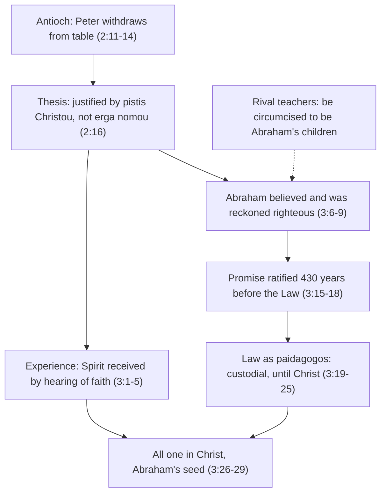

# The New Testament · Lesson 5.1: Galatians: faith, Law, and the Gentiles

> ⏱ ~15 min · Module 5: Justification in Galatians and Romans · Builds on: [4.2 Paul's life and letters](04-02-pauls-life-and-letters.md) · Unlocks: [5.2 Romans 1–4](05-02-romans-1-4-the-righteousness-of-god.md), [5.4 The New Perspective on Paul](05-04-the-new-perspective-on-paul.md)

## Why this matters

Galatians is where "justified by faith, not by works of the law" first appears. Luther built a Reformation on it, and Trent answered in the same words. Modern exegesis has since found that the sentence is less obvious than both sides assumed. Both of its key phrases are disputed, and the question Paul was actually answering was a practical one: must a Gentile who believes in Jesus be circumcised and keep the Jewish food laws? This lesson reads the argument as Paul built it, from a quarrel over dinner at Antioch to Abraham, and names the exact words each rival reading turns on.

## The idea

Picture the situation. Paul founded churches in Galatia among Gentiles. After he left, other Christian teachers arrived and told them they had to be circumcised: "they constrain you to be circumcised" (6:12). Their case was not crazy. God's covenant with Abraham carried circumcision as its sign (Genesis 17), and Jesus was a Jew. If Gentiles want to be Abraham's children, the obvious route is to join Abraham's people.

Paul's answer is that this reverses the order of things. Abraham was counted righteous by *believing*, before the Law of Moses existed. The Gentiles have received the Spirit by believing, before any circumcision. The Law had a real job, but a temporary one, like a slave who walks a child to school until the child comes of age. So requiring the Law of Gentile believers is not extra piety. It says that Christ was not enough (2:21).

Galatians is one of the seven [undisputed letters](../reference.md#undisputed-and-disputed-letters) ([4.2](04-02-pauls-life-and-letters.md)). Nobody's reading of it depends on an authorship theory.

## Source

Galatians 2:11–16, Douay–Rheims (Challoner):

> But when Cephas was come to Antioch, I withstood him to the face, because he was to be blamed. For before that some came from James, he did eat with the Gentiles: but when they were come, he withdrew and separated himself, fearing them who were of the circumcision. And to his dissimulation the rest of the Jews consented: so that Barnabas also was led by them into that dissimulation. But when I saw that they walked not uprightly unto the truth of the gospel, I said to Cephas before them all: If thou, being a Jew, livest after the manner of the Gentiles and not as the Jews do, how dost thou compel the Gentiles to live as do the Jews? We by nature are Jews: and not of the Gentiles, sinners. But knowing that man is not justified by the works of the law, but by the faith of Jesus Christ, we also believe in Christ Jesus, that we may be justified by the faith of Christ and not by the works of the law: because by the works of the law no flesh shall be justified.

Two phrases carry the argument. *Erga nomou*, "works of the law", occurs three times in 2:16. *Pistis Christou*, which the Douay keeps as "the faith of Jesus Christ", occurs twice. That literal rendering follows the Vulgate's *fidem Iesu Christi* and preserves an ambiguity most modern translations resolve. Note also *ean mē*, "but" in the Douay: it normally means "except", which is part of what [5.4](05-04-the-new-perspective-on-paul.md) argues over.

## The argument

1. **The Antioch incident** ([card](../reference.md#the-antioch-incident)). Jewish and Gentile believers at Antioch ate together; Cephas (Peter) did too. When "some came from James", he withdrew, and the other Jewish believers and Barnabas followed. Paul calls it *hypokrisis*, play-acting, since Peter's conduct no longer matched his convictions. His charge is that by withdrawing, Peter "compels" (*anankazeis*) Gentiles to live like Jews: if they want table fellowship with the Jewish believers, they must adopt Jewish food practice. *In words:* the first dispute was over a menu, and Paul saw a gospel in it. (The Jerusalem agreement just before this, 2:1–10, and its relation to Acts 15, belong to [4.2](04-02-pauls-life-and-letters.md) and [`church-history` 1.1](../../church-history/lessons/01-01-the-first-generation-and-its-sources.md).)
2. **Two loose ends in the text.** Greek has no quotation marks, so it is unclear where Paul's speech to Peter ends: at 2:14, or at 2:21, with 2:15–21 as its theological core. And Paul never says who won. Many interpreters, Dunn among them, infer from the silence that Paul lost at Antioch. It is an argument from silence, and should be held as one.
3. **The thesis, 2:16.** A person is not justified *ex ergōn nomou* but through *pistis Christou*. Both key phrases are disputed.
   - **[Works of the law](../reference.md#works-of-the-law).** On the traditional reading, the phrase means the deeds the Law commands, and behind them any human doing offered as grounds for standing with God. On James D. G. Dunn's reading (his 1982 lecture "The New Perspective on Paul"), it means the Law's practices in their role as markers of Jewish identity: circumcision, food laws, sabbath. Antioch is Dunn's best evidence, since the dispute was literally about food and circumcision. The traditional reading's best evidence is 3:10, where the curse falls on whoever does not keep "all things which are written in the book of the law". [5.4](05-04-the-new-perspective-on-paul.md) weighs the two.
   - **[*Pistis Christou*](../reference.md#pistis-christou).** As an *objective genitive*, Christ is the object of faith, so the phrase means "faith *in* Christ". As a *subjective genitive*, Christ is the subject, so it means "the faith*fulness* of Christ", his obedience unto death. Richard Hays (*The Faith of Jesus Christ*, 1983) argued for the subjective reading from the story Galatians 3–4 tells. Dunn defended the objective reading against him. Among Catholic exegetes the division runs the same way: Luke Timothy Johnson argued for Christ's own faith, and Fitzmyer, in his commentaries, the objective. The objective reading points to the middle clause, "we also believe in Christ Jesus", where the believing is plainly ours. The subjective reader answers that on the objective reading the verse says the same thing three times. *In words:* either we are justified by trusting Christ, or by Christ's fidelity, which we receive by trusting him; the second reading keeps human faith, but moves it.
4. **Experience, 3:1–5.** "Did you receive the Spirit by the works of the law or by the hearing of faith?" The Galatians' own reception of the Spirit came before and without circumcision. *In words:* God has already accepted them; circumcision cannot add to that.
5. **[Abraham and the promise](../reference.md#abraham-and-the-promise), 3:6–18.** Paul quotes Genesis 15:6: "Abraham believed God: and it was reputed to him unto justice" (3:6). Those "of faith" are therefore Abraham's children (3:7), and the promise "In thee shall all nations be blessed" (3:8, from Gen 12:3) was about Gentiles from the start. The Law, coming 430 years later, cannot cancel a ratified promise (3:15–17). The word *diathēkē* means both "covenant" and "last will", and Paul exploits both senses. *In words:* the promise came first and is unconditional, so a later law cannot add conditions to it.
6. **Why then the Law? 3:19–25.** It was "set because of transgressions, until the seed should come" (3:19). Its role was custodial: "we were kept under the law shut up" (3:23; *ephrouroumetha*, held under guard). Then comes 3:24: "the law was our pedagogue in Christ". The [*paidagōgos*](../reference.md#the-law-as-paidagogos) was not a teacher. He was the household slave who took a boy to school and back, watched his conduct, and was dismissed when the boy came of age. *Eis Christon* ("in Christ" in the Douay) can be temporal ("until Christ") or purposive ("to lead us to Christ"). The before/after frame of 3:23–25 ("before the faith came", "no longer under a pedagogue") makes the time limit the point either way. *In words:* the Law was a guardian for a minority, and minority ends.
7. **The conclusion, 3:26–29.** All the baptized are sons of God and "the seed of Abraham", with "neither Jew nor Greek". Circumcision is not an entry fee to a family the Gentiles already belong to.

**Mark the levels.** That Galatians is inspired, canonical scripture is **defined dogma** (rung 1; [the canon as defined](../../fundamental-theology/lessons/03-03-the-canon-as-defined.md)). That no one is justified by works done "through the teaching ... of the law, without the grace of God through Jesus Christ" is also defined, in Trent's Session VI, canon 1 (Waterworth); the decree's content belongs to `creation-grace-last-things`. Trent fixes *that* justification is by grace; it does not fix the grammar of 2:16. The meaning of *erga nomou*, the genitive in *pistis Christou*, where the speech at Antioch ends, and who won there are **scholarly questions with no magisterial standing**: freely disputed (rung 5 of [the ladder](../../fundamental-theology/lessons/04-04-the-ladder-of-doctrinal-authority.md)), with Catholic scholars on both sides. What *paidagōgos* meant in a Greek household is **philology**, settled by evidence and not by any level ([church teaching vs hypothesis](../reference.md#church-teaching-vs-hypothesis)).

## Argument map

## Worked examples

**Example 1 (clean): why a meal is a gospel issue.** Run step 1 carefully. Peter "livest after the manner of the Gentiles": he ate their food, at their table. His withdrawal forces a choice on the Gentile believers: stay a separate, second table, or keep kosher. Paul's verb is *compel*, though Peter commanded nothing. Paul judges the pressure by its effect, not its intent. The Gentiles are being made to judaize as the price of full fellowship. Then 2:15–16 draws the principle: even "we by nature Jews" know justification is not by the works of the law, so it cannot be demanded of Gentiles as a condition. Every step is on the page.

**Example 2 (hard, where the method strains): the singular "seed," 3:16.** Paul argues from grammar: the promise was to Abraham's "seed", "not ... seeds as of many ... but as of one ... which is Christ." Here close reading hits a snag. In Genesis the Hebrew *zera'* and the Greek *sperma* are collective nouns, "offspring", and Paul knows it, since 3:29 makes all the baptized "the seed of Abraham". So the singular is not a grammatical proof in the modern sense. Most commentators read it as a recognized Jewish exegetical move: a text read closely for a sense the plain grammar allows without requiring. Paul's point is that the promise is fulfilled in one representative, and everyone joined to him inherits it. The honest report is this: the argument works inside Paul's exegetical conventions, and a modern reader has to name those conventions rather than pretend the singular settles it. The same caution applies when Paul reads Genesis 15:6 as a text about Gentiles ([`old-testament`](../../old-testament/syllabus.md) reads Abraham from the other side).

## Watch out

- **A hypothesis promoted to teaching.** "The Church teaches that *pistis Christou* means faith in Christ", or that works of the law are identity markers: both are false. Trent defines that justification is by grace, not the genitive in 2:16. Both readings are live among Catholic exegetes.
- **Teaching demoted to hypothesis.** Galatians' *canonicity* is defined, not a scholarly consensus. Its Pauline authorship is the consensus, a historical judgment of a different kind.
- **"Pedagogue" as teacher.** The Douay's own note glosses it as "schoolmaster", and older English Bibles did the same. That makes the Law an educator who taught us Christ. The Greek word names a custodian, and the text stresses the "until".
- **"The Law was a mistake."** Paul says the opposite: "Was the law then against the promises of God: God forbid!" (3:21). Its role was temporary, not wrong.
- **Settling Antioch by what you need.** Jerome read the clash as staged; Augustine refused, because a staged rebuke puts a lie in scripture ([`patristics` 4.2](../../patristics/lessons/04-02-jerome.md)). The text shows a real rebuke and does not report its outcome.

## One-liner

> At Antioch a question about who eats with whom became Paul's thesis: Gentiles are Abraham's children by faith, as Abraham was, and the Law was their guardian only until Christ came.

## Problems

**P1 (🟢)** *(Exegetical)* Galatians 3:23–25, Douay–Rheims:

> But before the faith came, we were kept under the law shut up, unto that faith which was to be revealed. Wherefore the law was our pedagogue in Christ: that we might be justified by faith. But after the faith is come, we are no longer under a pedagogue.

The Greek of 3:24 is *ho nomos paidagōgos hēmōn gegonen eis Christon*. A reader says the verse pictures the Law as a **teacher who educated Israel up to Christ**; another says it pictures a **custodian whose authority expired when Christ came**. (a) Which reading does the passage support? Name **three** words or phrases that decide it. (b) Give the two possible translations of *eis Christon*, and say which the context favours. **Three sentences per part.**

**P2 (🟡)** Galatians 2:20, Douay–Rheims: "And that I live now in the flesh: I live in the faith of the Son of God, who loved me and delivered himself for me." Greek: *en pistei zō tē tou huiou tou theou tou agapēsantos me kai paradontos heauton hyper emou*.

(a) *(Exegetical)* Give the lesson's own translation of the italic phrase as an objective genitive and as a subjective genitive, and name the word or clause **in this verse** that each reading appeals to. **Four sentences or fewer.**
(b) *(Evaluative)* Which reading fits 2:20 better? **100 words or fewer**, any verdict. Meet the strongest point against your choice.

**P3 (🔴)** *(Exegetical)* An **invented** parish handout on Galatians:

> (1) In Galatians 3 Paul shows the Law of Moses was a divine mistake, later corrected: it came 430 years after Abraham and was "set because of transgressions". (2) Since the scholars have now agreed, Catholic teaching holds that "the faith of Jesus Christ" in 2:16 means Jesus's own faithfulness, not our faith in him. (3) Of course, whether Galatians belongs in the Bible at all is something historians are still working out.

For each numbered sentence, name the error, correct it, and state the right level or kind of claim. **Two sentences per sentence.**

Solutions

**P1** *(Exegetical (a) · Exegetical (b))*

**Must hit, strict (a):** the **custodian** reading. Any three of: "kept under the law" (*ephrouroumetha*, held under guard); "shut up" (*synkleiomenoi*); "before the faith came" and "unto that faith which was to be revealed" (a time limit); "no longer under a pedagogue" (the authority ends). Also credit the social fact that a *paidagōgos* was a slave-escort who supervised the child and did not teach him.
**Must hit, strict (b):** **temporal**, "until Christ", and **purposive**, "to lead us to Christ" (credit the Douay's "in Christ" as a third, local rendering). The context favours the temporal sense, because 3:23 and 3:25 frame the verse as *before* and *after*. Credit a purposive answer only if it keeps the time limit.
**Wrong turns:** taking the Douay note's "schoolmaster" at face value, so the Law "taught Christ". Treating "custodian" as contempt for the Law, when a guardian protects, and 3:21 denies that the Law is against the promises.
**Model answer:** (a) The custodian reading. "Kept under the law shut up" describes confinement under guard, not instruction, and "before the faith came" with "no longer under a pedagogue" puts an expiry date on it. The *paidagōgos* was the slave who escorted a boy and minded his conduct until he came of age. (b) *Eis Christon* can mean "until Christ" or "to lead us to Christ". The before/after frame of 3:23 and 3:25 favours "until". Even on the purposive reading, the guardian's job ends when the destination is reached.

**P2** *(Exegetical (a) · Evaluative (b))*

**Must hit, strict (a):** objective: "I live by faith **in** the Son of God"; subjective: "I live by the **faithfulness of** the Son of God". The objective reading appeals to "**I live**": the faith is how Paul lives now, his own act, as in 2:16's "we believe in Christ Jesus". The subjective reading appeals to the **participial clauses**, "who loved me and delivered himself for me": they describe Christ's own act, his fidelity shown in self-giving, and so tell us whose *pistis* is meant.
**Must hit, any verdict (b):** name the verse's evidence for your side; state the strongest point for the other (the one named in (a)); say why it does not decide the question for you. Recognize that the grammar alone allows both readings.
**Wrong turns:** claiming the genitive is grammatically unambiguous either way. Saying the subjective reading removes human faith, when "I live" still has Paul living by it on either reading. Settling (b) by Church authority: the question is freely disputed.
**Model answer (b), one of several:** Objective. "I live" makes *pistis* the mode of Paul's present life, and the natural sense of living "in faith" is believing. The participles are the strongest point against me: they fill the verse with Christ's own action. But they identify the Son, giving the object of Paul's faith its content. They do not tell us that *pistis* is the Son's. 2:16's unambiguous "we believe in Christ Jesus" tips a verse that the grammar leaves open.

**P3** *(Exegetical)*

**Must hit, strict:** (1) **Misreading.** Paul denies the Law is against the promises (3:21, "God forbid!"). The 430 years show that a later law cannot annul a ratified promise (3:17), and "until the seed should come" (3:19) with the *paidagōgos* (3:24) gives the Law a real but temporary role. (2) **A hypothesis stated as Church teaching, and a false consensus.** *Pistis Christou* is freely disputed (rung 5) with no magisterial act on the genitive. Scholars remain divided: Hays against Dunn, and among Catholics Johnson against Fitzmyer. (3) **Church teaching treated as a hypothesis.** Galatians' canonicity is **defined dogma** (the canon as defined at Trent, rung 1) and not a historians' question. Credit adding that Galatians is also among the undisputed letters, so even its human authorship is secure; the point, though, is that canonicity and authorship are different kinds of claim.
**Wrong turns:** correcting (2) by saying the Church teaches the *objective* reading, which repeats the error in the other direction. In (3), resting canonicity on the scholarly consensus about authorship. In (1), saying Paul rejects the Law as bad.
**Model answer:** (1) This misreads Galatians 3: Paul says the Law is not against the promises (3:21). The 430 years prove only that a later law cannot annul a ratified promise, and the Law's role as guardian "until the seed" was real and temporary. (2) This states a disputed hypothesis as Church teaching: the genitive in 2:16 is freely disputed among Catholics, with no magisterial act on it. Nor is there a scholarly consensus. (3) This treats defined dogma as an open question: Galatians' place in the canon was defined at Trent. Its Pauline authorship is also undisputed by scholars, but that is a different kind of claim.

## Flashback

**From Lesson [4.2](04-02-pauls-life-and-letters.md) (Paul's life and letters):** *(Exegetical.)* An **invented** introduction to Paul in a study Bible:

> "Paul's life is precisely dated: an inscription found at Delphi records his trial before Gallio in 51. For the years before that, Acts is the best guide, since it is fuller than the letters and was written by Paul's companion; so when Acts 9:24 says the Jews watched the gates of Damascus to kill him, and 2 Corinthians 11:32 says it was the governor under King Aretas, we should follow Acts. As for the letters, the Church has settled that all thirteen are Paul's own work, so the scholars' sort into 'undisputed' and 'disputed' letters is not open to a Catholic."

Find **three** errors and correct each, marking the level wherever Church teaching is claimed. **Two sentences per error.**

Solution

**Must hit, strict:**
1. **The inscription does not mention Paul.** It is a letter of Claudius that names Gallio as proconsul; its date (the 26th acclamation, 52) places Gallio's year in Achaia at about 51–52. Paul is tied to Gallio only by Acts 18:12, so the inscription gives one peg for his chronology, not a record of his trial.
2. **The method is backwards.** Paul's letters are first-hand and written at the time; Acts was written a generation later, and that its author was Paul's companion is a hypothesis resting on the "we" passages and on tradition. Knox's rule is letters first, Acts second: on who watched the gates, the default is 2 Corinthians 11:32, with the caveat that the letters are partisan.
3. **Level error.** That all thirteen letters are canonical and inspired is **defined dogma (rung 1)**, from Trent's canon. Who wrote each one is a **scholarly hypothesis**, and whether Trent's titles bind on human authorship is **freely disputed**, so the undisputed/disputed sort is open to Catholics; it measures historical confidence, not doctrinal weight.
**Wrong turns:** "correcting" (3) by saying the Church teaches that some letters are *not* Paul's; it teaches nothing either way on authorship. Saying the inscription dates Paul's *arrival* in Corinth. Swinging to "Acts is worthless" in (2), when Acts is the secondary source, and is used wherever the letters are silent.
**Model answer:** (1) The Delphi inscription is Claudius's letter naming Gallio as proconsul, which dates Gallio's year to about 51–52; it never mentions Paul. The link to Paul comes from Acts 18:12. (2) The letters are the primary source, first-hand and contemporary, and Acts is later and secondary, its author's companionship with Paul being a hypothesis. So by Knox's rule, 2 Corinthians' Aretas governor is the default account. (3) The canonicity of all thirteen is defined dogma, but their human authorship is a scholarly question, and whether Trent's titles bind on it is freely disputed. The sort is therefore open to Catholics.

## Connections

- **Backward:** [4.2](04-02-pauls-life-and-letters.md) dates Galatians and reads chapters 1–2 as autobiography. [`church-history` 1.1](../../church-history/lessons/01-01-the-first-generation-and-its-sources.md) has Antioch and the Jerusalem meeting as events. [`philosophical-method` 4.3](../../philosophical-method/lessons/04-03-finding-the-crux.md) supplies the crux tool used on *pistis Christou*.
- **Forward:** [5.2](05-02-romans-1-4-the-righteousness-of-god.md) reruns the argument calmly in Romans, with Abraham again and a new phrase, *dikaiosynē theou*. [5.4](05-04-the-new-perspective-on-paul.md) weighs Dunn's boundary markers against the traditional reading, which the [card](../reference.md#new-perspective-on-paul) summarizes. [6.3](06-03-james-faith-and-works.md) reads Abraham a second way, from Genesis 22.
- **Sideways:** Galatians 3:13, Christ "made a curse for us", is read as doctrine in [`christology` 5.4](../../christology/lessons/05-04-penal-substitution-and-the-catholic-assessment.md). The Catholic–Protestant dispute over justification belongs to [`creation-grace-last-things`](../../creation-grace-last-things/syllabus.md) and [`apologetics-catholic-claims`](../../apologetics-catholic-claims/syllabus.md). Jerome and Augustine's quarrel over Antioch is [`patristics` 4.2](../../patristics/lessons/04-02-jerome.md).
