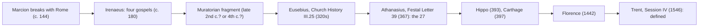

# The New Testament · Lesson 6.6: The formation of the canon

> ⏱ ~15 min · Module 6: The other letters, Revelation, and the canon · Builds on: [6.4 Peter, Jude, and the letters of John](06-04-peter-jude-and-the-letters-of-john.md), [1.5 From oral tradition to written gospel](01-05-from-oral-tradition-to-written-gospel.md) · Unlocks: Boss problem 6 in the [syllabus](../syllabus.md)

## Why this matters

Every lesson so far has asked who wrote a book and when. This one asks why those books are in the volume at all. No apostle left a list. What survives is a trail of witnesses: a bishop in Gaul defending four gospels, a fragment of uncertain date, a historian sorting books in the 320s, a bishop of Alexandria listing the twenty-seven in 367. Read the trail well and you can answer the popular myths precisely, and say what the Church defines about the result and what it leaves to historians.

## The idea

Think of a canon as settling from the middle outward, not being chosen from above.

- **The core settled early.** By the late second century the four gospels and Paul's letters were read in church almost everywhere and argued *from*, not argued *about*.
- **The edges took three centuries.** Hebrews, James, 2 Peter, 2–3 John, Jude and Revelation were accepted in some regions and doubted in others. Eusebius's word for "disputed" was [*antilegomena*](../reference.md#antilegomena), "the spoken-against".
- **Some books were near misses.** The Shepherd of Hermas, the Didache and the Apocalypse of Peter were read with respect in some churches and dropped later.
- **Some were never close.** Gospels circulating under apostles' names, such as Thomas, are rejected by every list that names them.

The Greek *kanōn* means a measuring rod, then a rule: the books the churches measured their teaching by. The lists came late and record a use that already existed. Use first, list second: that is the lesson in one line.

## Source

Irenaeus, *Against Heresies* III.11.7 (about 180; *Ante-Nicene Fathers* vol. 1, public domain). The famous four-winds argument follows in III.11.8. This is the less-quoted paragraph just before it:

> So firm is the ground upon which these Gospels rest, that the very heretics themselves bear witness to them, and, starting from these [documents], each one of them endeavours to establish his own peculiar doctrine. For the Ebionites, who use Matthew's Gospel only, are confuted out of this very same ... But Marcion, mutilating that according to Luke, is proved to be a blasphemer of the only existing God, from those [passages] which he still retains. Those, again, who separate Jesus from Christ ... preferring the Gospel by Mark, if they read it with a love of truth, may have their errors rectified. Those, moreover, who follow Valentinus, making copious use of that according to John ... shall be proved to be totally in error by means of this very Gospel ...

Read what this assumes. Each rival picks **one** of the four, and each of the four has a rival attached. The argument works only if both sides already treat those four books as the common ground where the fight happens. Only in III.11.9 does he attack a fifth, the Valentinians' newer *Gospel of Truth*.

## The argument

1. **Marcion as catalyst.** Around 144 Marcion broke with the Roman church, rejected the Jewish scriptures, and kept an edited Luke and ten letters of Paul. The event belongs to [`church-history` 1.2](../../church-history/lessons/01-02-bishops-canon-and-the-parting-of-the-ways.md). The historians' question is how much he caused. Adolf von Harnack (*Marcion*, 1921) argued that Marcion created the idea of a closed Christian scripture and the Church copied it in reply. Hans von Campenhausen (*The Formation of the Christian Bible*) kept a strong version of the thesis. Critics, John Barton among them, reply that the gospels and Paul were already cited as authoritative before Marcion. On their view he sped up a process he did not start. *In words:* Marcion forced the question of which books count, and scholars dispute whether he also invented it.

2. **Irenaeus's [fourfold gospel](../reference.md#the-fourfold-gospel), about 180.** The Source shows four books treated as shared ground. III.11.8 then argues that there can be neither more nor fewer, from the four zones of the world, the four winds, and the four faces of the cherubim. [`patristics` 2.1](../../patristics/lessons/02-01-irenaeus-against-the-gnostics.md) weighs that argument: weak as proof, strong as evidence that the number was already fixed. *In words:* by 180 the four were a settled number in Gaul and Asia, and nobody defends an optional number with cosmology.

3. **The [Muratorian fragment](../reference.md#the-muratorian-fragment).** This is a Latin list of New Testament books. Its beginning is lost. It survives in a seventh- or eighth-century manuscript that Muratori found at Milan and published in 1740. It accepts four gospels (Luke "third", John "fourth"), Acts, thirteen letters of Paul, Jude, two letters of John, Wisdom, Revelation, and the Apocalypse of Peter, which it says some will not have read in church. It rejects forged letters to the Laodiceans and Alexandrians. It says nothing of Hebrews, James or 1–2 Peter. Of the Shepherd it says that Hermas wrote it "very recently in our times in the city of Rome" while Pius was bishop (ANF vol. 5), so it may be read, but not publicly in church. **The date is disputed.** Most scholars take "in our times" at face value, and Pius's episcopate (about 140–155) then puts the list in the late second century at Rome. Albert Sundberg (1973) and Geoffrey Hahneman (*The Muratorian Fragment and the Development of the Canon*, 1992) argue for the fourth century, probably in the East. On their reading, "our times" means "recent compared with the apostles", and such lists are otherwise a fourth-century genre. Defenders of the early date, among them Everett Ferguson and Charles Hill, answer that the plain sense is the natural one. *In words:* the fragment is either our earliest list or one list among many from the 300s, and the majority view is not a proof.

4. **[Eusebius's categories](../reference.md#eusebius-on-the-accepted-and-disputed-books), *Church History* III.25 (finished in the 320s).** Eusebius sums up the churches' usage in three classes. The **accepted** (*homologoumena*) include the four gospels, Acts and Paul's letters. Hebrews is counted among Paul's, since he names it nowhere else in the chapter. The **disputed** (*antilegomena*), though recognised by many, include James, Jude and 2 Peter. The **rejected** (*notha*, "illegitimate") include the Shepherd and the Teachings of the Apostles, that is, the Didache. A fourth group, gospels such as those of Peter and Thomas, he calls heretics' fictions, not even to be ranked among the rejected. He wavers openly on Revelation, placing it among the accepted if that seems proper, and again among the rejected. (These are McGiffert's NPNF renderings; "acknowledged" and "spurious" are common alternatives.) *In words:* in the 320s the core was fixed; James, Jude, 2 Peter and 2–3 John were still disputed, and Revelation hung between classes.

5. **[Festal Letter 39](../reference.md#festal-letter-39) (367).** In 367 Athanasius used his annual Easter letter to list the books of the canon. His New Testament is exactly our twenty-seven, though in a different order: the gospels, Acts, the seven Catholic letters, fourteen of Paul with Hebrews after 2 Thessalonians, then Revelation. He adds: "Let no man add to these, neither let him take ought from these" (NPNF 2nd ser. vol. 4). He then names books outside the canon but appointed to be read by new converts, the Didache and the Shepherd among them. This is the earliest surviving list of exactly the twenty-seven, on present evidence (so Bruce Metzger, *The Canon of the New Testament*, 1987). *In words:* the first closed list of the full set is a bishop fencing his flock off from apocrypha.

6. **The African councils ([Hippo and Carthage](../reference.md#hippo-and-carthage)).** The synod of Hippo (393) and the Council of Carthage (397) listed the same twenty-seven for their churches. Hippo's list is preserved as canon 24 of the African code of 419, which counts fourteen letters of Paul, asks that the list be sent to Boniface of Rome for confirmation, and calls these "the things which we have received from our fathers to be read in church" (NPNF 2nd ser. vol. 14). These were regional synods. Some Eastern churches stayed slower to accept Revelation, and the Syriac churches the shorter Catholic letters.

7. **Definition.** The Council of Florence (1442) gave the list in its decree of union with the Copts. Trent (Session IV, 8 April 1546) defined it, fourteen letters of Paul and Revelation included. [`fundamental-theology` 3.3](../../fundamental-theology/lessons/03-03-the-canon-as-defined.md) owns that act and the Vatican I teaching that the Church *recognises* inspired books and does not make them so.

**Mark the levels.** That the twenty-seven books are sacred and canonical is **defined dogma** (rung 1 of [the ladder](../../fundamental-theology/lessons/04-04-the-ladder-of-doctrinal-authority.md)), by Trent's decree: see [the canon as defined](../reference.md#the-canon-as-defined). That canonicity is recognition and not conferral is conciliar teaching (Vatican I, via FT 3.3). **Everything else in this lesson is history, with no magisterial level:** Marcion's causal role, the Muratorian date, how to read Eusebius's classes, and "Athanasius first". Those are **scholarly judgments**, graded by the evidence ([church teaching vs hypothesis](../reference.md#church-teaching-vs-hypothesis)). Hippo and Carthage are regional synods, witnesses to the list rather than the act that defines it. Trent's naming of Paul, John and James as authors is a separate question, since canonicity does not settle human authorship ([6.1](06-01-the-disputed-pauline-letters-and-the-pastorals.md)). How far those attributions bind is freely disputed, and Boss problem 6 takes it up.

## Timeline

If the Muratorian late date is right, the fragment moves between Eusebius and Athanasius, and the second century has no list at all, only Irenaeus's four and the books the Fathers quote.

## Worked examples

**Example 1 (clean): tracking one book, 2 Peter.** Ask of each witness: does it name the book, and in what class? The Muratorian fragment is silent. Eusebius puts it among the disputed. Athanasius and Hippo include it. Trent defines it. The pattern of silence, then dispute, then acceptance is the reception history that [6.4](06-04-peter-jude-and-the-letters-of-john.md) weighed alongside the style and the use of Jude. Notice what it establishes. It tells you the book was doubted early. It does not tell you who wrote it, and the definition at the end does not tell you that either.

**Example 2 (hard): the Shepherd, a book with no box.** The Muratorian author says to read it, but not publicly in church. Eusebius ranks it among the rejected, the *notha*, which for him are still orthodox works that some Fathers had quoted. Athanasius puts it outside the canon but recommends it to new converts. Codex Sinaiticus, a fourth-century Bible, copies it after Revelation along with the Letter of Barnabas. So "canonical versus apocryphal" is too crude. For two centuries there was a middle class of books, orthodox and useful but not measuring rods. Yet it was not a second canon: every witness keeps the Shepherd off the list that governs teaching. The model that fits is a list plus a reading shelf, and Trent's decree addresses only the list.

## Watch out

- **Hypothesis stated as teaching:** "The Church teaches the Muratorian canon is second-century." It teaches nothing about the fragment's date. The date is a freely argued historical question, and a Catholic may side with Sundberg.
- **Teaching stated as hypothesis:** "Since scholars still dispute 2 Peter, its place in the canon is an open question for Catholics." Its canonicity is defined. What is open is its human author.
- **"Athanasius decided the canon."** He is the earliest surviving witness to the full list, not the person who decided it. His letter says it reminds readers of things they already know.
- **"Rejected" in Eusebius does not mean "heretical".** The *notha* include the Didache and the Shepherd, which were orthodox books. The heretical gospels sit in a lower class of their own.
- **Leaving out is not suppressing.** The Gospel of Thomas was named and rejected by the witnesses that mention it. It was not hidden from them. It was recovered in Coptic at Nag Hammadi in 1945.

## One-liner

> The churches used the books before anyone listed them: four gospels and Paul by 180, seven books disputed into the fourth century, all twenty-seven in Athanasius's list of 367, and defined at Trent.

## Problems

**P1 (🟢)** *(Exegetical)* Irenaeus, *Against Heresies* III.11.8 (ANF vol. 1), after pairing the four gospels with the four faces of the cherubim in Revelation 4:7 (lion, calf, man, eagle):

> For that according to John relates His original, effectual, and glorious generation from the Father, thus declaring, "In the beginning was the Word, and the Word was with God, and the Word was God." ... But that according to Luke, taking up [His] priestly character, commenced with Zacharias the priest offering sacrifice to God. For now was made ready the fatted calf, about to be immolated for the finding again of the younger son. Matthew, again, relates His generation as a man, saying, "The book of the generation of Jesus Christ, the son of David, the son of Abraham" ... Mark, on the other hand, commences with [a reference to] the prophetical spirit coming down from on high to men, saying, "The beginning of the Gospel of Jesus Christ, as it is written in Esaias the prophet,"--pointing to the winged aspect of the Gospel ...

(a) Give Irenaeus's creature for each gospel, and the feature of each text he uses to justify it. (b) What does the *method* of this argument show about how Irenaeus and his readers possessed these four books? Name one thing it does **not** show about the New Testament canon in 180. **Two sentences per part.**

**P2 (🟡)** *(Exegetical)* Assign each claim its status: a level on the ladder (name the act), or "historical judgment, no magisterial level" (say whether the evidence currently favours it). **One line each.**

1. The twenty-seven books of the New Testament are sacred and canonical.
2. The Muratorian fragment was written at Rome in the late second century.
3. Athanasius's Festal Letter 39 is the earliest surviving list of exactly the twenty-seven books.
4. The synod of Hippo (393) defined the canon for the whole Church.

**P3 (🔴)** *(Exegetical)* An **invented** post on a reading forum:

> "People don't realize the Bible we have was chosen by an emperor. At Nicaea in 325 Constantine sat the bishops down, had them vote out the gospels that didn't suit him, like Thomas, and then paid Eusebius to copy the winners. The Catholic Church only admitted this list was binding at Trent, over a thousand years later, which proves the canon is a political invention."

Name **three** factual errors and correct each from a source in this lesson. Then name the confusion of levels in the last sentence. **150 words or fewer.**

Solutions

**P1** *(Exegetical)*

**Must hit, strict (a):** **John = lion** (royal, "effectual" generation from the Father; his opening "In the beginning was the Word"). **Luke = calf** (priestly and sacrificial; he opens with Zacharias the priest offering sacrifice, and has the fatted calf of the prodigal son). **Matthew = man** (his humanity; he opens with the genealogy, "The book of the generation"). **Mark = eagle** ("winged"; he opens with the prophetic spirit, "as it is written in Esaias"). In each case the key is the gospel's **opening**, Luke's calf excepted.

**Must hit, strict (b):** the argument works from each gospel's **fixed opening words**, so it presupposes four distinct, written, named texts that his readers could check. The number and identity of the gospels were settled enough to allegorize. It does **not** show a closed list of the rest of the New Testament: nothing here settles Hebrews, the Catholic letters or Revelation. (Also acceptable: it does not show that every church everywhere held exactly these four, or that the symbolism was shared.)

**Wrong turns:** giving the later Western assignment, Mark lion and John eagle, which comes from Jerome. That is not what this text says. Treating the allegory as Irenaeus's *reason* for four, rather than his decoration of a four already held.

**Model answer:** (a) John is the lion, for his royal opening on the Word's generation from the Father. Luke is the calf, for Zacharias's sacrifice. Matthew is the man, for the genealogy. Mark is the eagle, for the prophetic Spirit descending in his opening citation of Isaiah. (b) He argues from each book's first lines, which only works if four distinct written gospels with fixed beginnings were already in his readers' hands. It says nothing about which letters, or whether Revelation, were scripture.

**P2** *(Exegetical)*

**Must hit, strict:**
1. **Defined dogma (rung 1)**, by the Council of Trent, Session IV (1546). Credit for naming Florence (1442) as the earlier conciliar list.
2. **Historical judgment, no magisterial level.** It is the majority view, but it is disputed (Sundberg, Hahneman: fourth century). The evidence is contested, and the problem does not ask for a verdict.
3. **Historical judgment, no magisterial level.** It is true on present evidence, and a newly found text could overturn it.
4. **False as stated.** Hippo was a regional synod. It witnesses the list and sent it to Rome for confirmation, but it defined nothing for the universal Church. Its list is the canon later defined at Trent. Its own act carries no rung-1 status.

**Wrong turns:** calling 3 "Church teaching" because it is true and about the canon. Calling 2 settled because it is the majority view. Accepting 4 because the list happens to match Trent's.

**Model answer:** (1) Rung 1, Trent Session IV. (2) History, no level; majority view, contested. (3) History, no level; true on current evidence. (4) Wrong: a regional synod's list, received later but not a universal definition.

**P3** *(Exegetical)*

**Must hit, strict:** any three of these errors, each with its correction.
- **Nicaea issued no list of scripture.** No canon of books is among its acts. The lists we have come from Eusebius, Athanasius and the African synods.
- **The disputes continued after 325.** Eusebius, writing in the 320s, still classes James, Jude and 2 Peter as disputed and wavers on Revelation. The first surviving list of the twenty-seven is from 367.
- **Constantine's order to Eusebius** (*Life of Constantine* IV.36) was for fifty copies of the scriptures for the new churches of his city. It says nothing about which books.
- **Thomas was never in contention.** Eusebius ranks it among heretics' fictions, below even the rejected books, and no list includes it.
- **The four gospels were already fixed by about 180** (Irenaeus), a century and a half before Nicaea.

**Levels:** Trent **defined** a list the churches had long used, and Florence had given it earlier. Its decree does not show the list was invented in 1546. On Catholic teaching, defining is recognising books already received as inspired, not creating their authority (Vatican I; FT 3.3).

**Wrong turns:** answering "the Church, not the emperor, chose", which keeps the error of choosing. Inventing a Nicene list of books from later legend.

**Model answer:** Nicaea produced a creed and canons, not a list of books. Eusebius in the 320s still reports James, Jude and 2 Peter as disputed, and the first full list of twenty-seven is Athanasius's in 367. Constantine's letter orders fifty copies of the scriptures without naming contents. Thomas was never a candidate: Eusebius files it with heretical forgeries. The last sentence treats Trent's definition as a first decision. In fact it solemnly defined a list that churches had used since the fourth century, and on Catholic teaching it recognised the books' authority rather than conferring it.

## Flashback

**From Lesson [6.4](06-04-peter-jude-and-the-letters-of-john.md) (Peter, Jude, and the letters of John):** *(Exegetical.)* Find the crux. 1 Peter 5:12 (Douay–Rheims): "By Sylvanus, a faithful brother unto you, as I think, I have written briefly". The Greek is *dia Silouanou ... egrapsa*, "through Silvanus ... I wrote". Two positions, paraphrased:

- **E. G. Selwyn** (commentary, 1946): Silvanus was Peter's secretary and drafted the letter. That explains why a Galilean fisherman's letter has polished Greek and quotes the Septuagint, and Peter can still be its author before his death.
- **The majority, toward which Brown's *Introduction* inclines**: the letter comes from a Roman circle loyal to Peter, c. 70–90, and 5:12 names Silvanus only as the man who **carried** it.

Two facts: Acts 15:23 uses "writing by the hand of" (*grapsantes dia cheiros*) for the Jerusalem letter that Judas and Silas **carried**, and Silas is the same man as Silvanus. Ignatius's letter to the Romans closes: "Now I write these things to you from Smyrna by the Ephesians" (ANF vol. 1), naming the people who took the letter.
(a) State the single question about 5:12 on which the two positions divide, and say which way the two facts push it. (b) Suppose the carrier reading wins. Why does that still not show that Peter did not write the letter? (c) Mark the levels of "1 Peter is canonical Scripture" and "Peter wrote 1 Peter". **Two sentences per part; one line per claim in (c).**

Solution

**Must hit, strict:** (a) The crux is whether ***dia Silouanou egrapsa* names the drafter or the carrier**: whether "through Silvanus" means Silvanus wrote the letter out or took it to its readers. Both parallels use the *dia* formula for **messengers who carried a letter**, so they push toward the carrier reading, which takes away Selwyn's explanation of the Greek. (b) The carrier reading **removes one explanation** of the polished Greek. It does not settle authorship: Peter could have used another, unnamed helper, and the rest of the case (the Greek, "Babylon" and a possible post-70 date) is **separate evidence**, each part disputed. At most it shifts the balance, and a majority is not a proof. (c) "1 Peter is canonical Scripture": **defined dogma, rung 1** (Trent, Session IV). "Peter wrote 1 Peter": **scholarly hypothesis, no magisterial standing either way**. Canonicity does not wait on it.
**Wrong turns:** making the crux "is the Greek too good for Peter?". That is the phenomenon both sides explain, not the point they divide on. Treating the carrier reading as proof of pseudonymity, or the secretary reading as proof of authenticity. Grading "Peter wrote 1 Peter" as Church teaching because Trent's list gives the letters under Peter's name. Trent defines the books, not their human authors ([6.2](06-02-hebrews.md) makes the same point for Hebrews).
**Model answer:** (a) The two sides divide on whether "through Silvanus I have written" makes Silvanus the drafter or the carrier. Acts 15:23 and Ignatius both use the formula for the men who carried a letter, which favours "carrier" and weakens Selwyn's account of the Greek. (b) Losing Silvanus as drafter removes one way of explaining the Greek, not the possibility that Peter wrote with other help. Authorship still turns on the rest of the evidence, including "Babylon" and the date, and each of those points is argued both ways. (c) Canonicity: defined dogma, Trent Session IV. Authorship: a scholarly hypothesis with no magisterial level.

## Connections

- **Backward:** Papias and Irenaeus as witnesses to the gospels' origins are in [1.5](01-05-from-oral-tradition-to-written-gospel.md). The disputed letters whose reception is traced here were weighed on internal evidence in [6.1](06-01-the-disputed-pauline-letters-and-the-pastorals.md), [6.2](06-02-hebrews.md), [6.3](06-03-james-faith-and-works.md) and [6.4](06-04-peter-jude-and-the-letters-of-john.md). Marcion as an event is [`church-history` 1.2](../../church-history/lessons/01-02-bishops-canon-and-the-parting-of-the-ways.md).
- **Forward:** Boss problem 6 in the [syllabus](../syllabus.md) sorts Eusebius's list in full, sets it against Athanasius, and asks whether a pseudonymous 2 Peter threatens canonicity. The Old Testament canon, the deuterocanonical books and Jerome's doubts are [`old-testament`](../../old-testament/syllabus.md) 6.1.
- **Sideways:** [`fundamental-theology` 3.3](../../fundamental-theology/lessons/03-03-the-canon-as-defined.md) is the doctrine at the end of this history, and [3.4](../../fundamental-theology/lessons/03-04-tradition.md) explains why a Church that recognised its books through use sees no rivalry between Scripture and Tradition. Irenaeus and Athanasius are read as theologians in [`patristics` 2.1](../../patristics/lessons/02-01-irenaeus-against-the-gnostics.md) and [3.1](../../patristics/lessons/03-01-athanasius.md).
