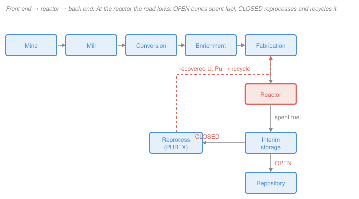

# Nuclear Fuel Cycle & Policy · Lesson 1.1: Fuel-cycle map & uranium resources

> ⏱ ~15 min · Module 1: The Front End — Mining, Conversion & Enrichment · Builds on: [`intro-nuclear-engineering`](../../intro-nuclear-engineering/syllabus.md) (fission energy, [3.1](../../intro-nuclear-engineering/lessons/03-01-fission-process-energy.md)) · Unlocks: [1.2 Mining & milling](01-02-mining-milling.md)

## Why this matters

Every argument about nuclear power — is the waste a dealbreaker? does it enable weapons? is it too expensive? — is really an argument about *where on the fuel cycle you are standing*. The same uranium atom is an ore body, a gas, a fuel pellet, a heat source, and a waste form at different stages, and the whole course is one walk down that road. This first lesson gives you the map you will annotate for the next eighteen lessons, plus the single fact that makes nuclear worth the trouble at all: the almost absurd amount of energy packed into a kilogram of a fairly ordinary metal.

## The idea

Think of the fuel cycle as a river with a fork. The **front end** takes uranium from rock to reactor-ready fuel: you *mine* ore, *mill* it into a uranium oxide powder ("yellowcake"), *convert* that to a gas, *enrich* the gas to raise the fissile U-235 fraction, and *fabricate* the enriched material into fuel assemblies. The reactor sits in the middle and does the only step that actually releases energy. The **back end** deals with what comes out: intensely hot, radioactive **spent fuel**.

At the reactor the river forks. In the **open** (once-through) cycle you cool the spent fuel, then send it to a repository — used once, buried forever. In the **closed** cycle you *reprocess* the spent fuel, chemically pulling out the leftover uranium and the plutonium that was bred inside it, and route those back to fabrication to be used again. Open is simpler and is what the US does; closed extracts more energy and shrinks the waste but needs a chemical plant that also separates weapon-usable plutonium — which is why "open vs. closed" is as much a policy choice as an engineering one.

Two numbers govern whether any of this is worth doing. First, **how much uranium is out there and at what grade** — a rich Canadian ore is one-fifth uranium by weight, while seawater is a few parts per billion, and everything in between is "available" only at some price. Second, **how much energy each kilogram delivers** — and here uranium wins by a factor of tens of thousands over coal, which is the entire reason we bother mining rock that's 99.9% something else.

## The formal version

**The cycle, as a sequence.** Front end: $\text{mine} \to \text{mill} \to \text{conversion} \to \text{enrichment} \to \text{fabrication}$; then the $\text{reactor}$; then back end: $\text{interim storage} \to [\text{reprocessing}] \to \text{disposal}$. The brackets mean the reprocessing step exists only in the closed cycle.

In words: the front end concentrates and enriches uranium into fuel, the reactor burns it, and the back end stores, optionally recycles, and finally disposes of what's left.

**Open vs. closed.** The two cycles are identical up to the reactor; they differ only at the fork:

$$\text{OPEN: spent fuel} \to \text{repository}, \qquad \text{CLOSED: spent fuel} \to \text{reprocess} \to \text{recycle} \to \cdots$$

In words: the open cycle treats spent fuel as waste; the closed cycle treats it as ore. The single tell for which cycle a country runs is whether it operates a **reprocessing plant** — every other facility is shared.

**Resources and grade.** Two definitions you must not conflate:

- **Ore grade** $g$ — the mass fraction of uranium in the rock, quoted in percent U or in parts per million (ppm), where $1\,\%\ \text{U} = 10{,}000\ \text{ppm}$. Grade tells you how much rock you move per kilogram of uranium: $\text{ore mass} = m_\text{U}/g$.
- **Reserves / resources** — the *quantity* of uranium recoverable below a stated cost, e.g. "resources recoverable at under 130 dollars per kilogram of uranium." This is an economic statement, not a geological one: raise the price you'll pay and the reserve number grows, because lower grades become worth mining.

In words: grade is a property of the rock; reserves are a property of the rock *and the price*. Uranium isn't scarce — it's everywhere in trace amounts; what's finite is uranium cheap enough to matter.

**Energy density.** Fission of one U-235 nucleus releases about $E_f \approx 200\ \text{MeV} = 3.2\times10^{-11}\ \text{J}$ (see [`intro-nuclear-engineering` 3.1](../../intro-nuclear-engineering/lessons/03-01-fission-process-energy.md)). Natural uranium is a fraction $x_f = 0.711\,\%$ U-235. The idealized once-through energy from 1 kg of natural uranium — fissioning just its U-235 — is

$$E = \underbrace{\frac{m\,x_f}{M_{235}}\,N_A}_{\text{number of U-235 atoms}}\times E_f,$$

with $m$ the uranium mass, $M_{235}=235\ \text{g/mol}$, and $N_A = 6.022\times10^{23}\ \text{mol}^{-1}$. In words: count the U-235 atoms, multiply by the energy each gives up. This is the calculation in Worked Example 1, and it lands near $6\times10^{11}\ \text{J/kg}$ — about four to five orders of magnitude above any chemical fuel.

## Picture

## Worked examples

**Example 1 (the energy-density argument, computed).** How much energy is in 1 kg of natural uranium, once-through, and how much coal does that replace?

Count the U-235 atoms in $m = 1000\ \text{g}$ of natural uranium ($x_f = 0.00711$):

$$N = \frac{m\,x_f}{M_{235}}\,N_A = \frac{1000 \times 0.00711}{235}\times 6.022\times10^{23} = 1.82\times10^{22}\ \text{atoms.}$$

Multiply by the per-fission energy $E_f = 3.2\times10^{-11}\ \text{J}$:

$$E = 1.82\times10^{22} \times 3.2\times10^{-11} = 5.8\times10^{11}\ \text{J} \approx 580\ \text{GJ.}$$

Coal carries about $29\ \text{MJ/kg} = 2.9\times10^{7}\ \text{J/kg}$. The coal mass with the same energy is

$$m_\text{coal} = \frac{5.8\times10^{11}}{2.9\times10^{7}} \approx 2.0\times10^{4}\ \text{kg} \approx 20\ \text{tonnes.}$$

So **1 kg of natural uranium $\approx$ 20 tonnes of coal** — a factor of about $2\times10^{4}$ *per unit mass*. (Real once-through fuel does a little better than this idealization in one way — roughly a third of an LWR's energy comes from plutonium bred and fissioned in place — and worse in another — a third of the U-235 is still there when the fuel is discharged. The two roughly cancel, and the honest delivered figure is still a few hundred GJ per kilogram of natural uranium. The order of magnitude is the point.)

**Example 2 (place the facilities on the map).** A country operates four facilities. Which cycle does each imply?

| Facility | Where on the map | Open, closed, or both? |
|---|---|---|
| Uranium **mill** | front end (ore → yellowcake, $\ce{U3O8}$) | **both** — shared front end |
| **Enrichment** plant | front end (raise U-235 fraction) | **both** — shared front end |
| **Dry-cask** storage pad | back end (interim storage) | **both** — but as an *end state* it signals open |
| **Reprocessing** plant | back end (split U, Pu, fission products) | **closed only** — the defining facility |

Reading: the mill and enrichment plant tell you nothing about the cycle — every reactor program needs them. Dry casks are interim storage in *both* cycles (fuel cools there whether it's headed for a repository or a reprocessing line), so casks alone don't decide it; a country whose casks are the *permanent* answer is running open. The one facility that pins down a **closed** cycle is the reprocessing plant: build one and you have chosen to recycle — and, incidentally, to separate plutonium, which is why this facility is the one safeguards inspectors care about most.

## Watch out

- **You might think "reserves" is a fixed geological number.** It isn't — it's uranium recoverable *below a price*. There is essentially unlimited uranium in seawater at a few parts per billion; whether it counts as a "resource" is a question about cost, not existence.
- **You might think the open cycle wastes almost all the energy, so closing it is obviously worth it.** Once-through does leave most of the potential energy in the ground and in the spent fuel — but recovering it means building reprocessing plants and separating plutonium, and uranium is currently cheap. The tradeoff is economic and political, not just thermodynamic; we'll quantify it in Module 4.
- **You might picture the fissile fraction as large.** Natural uranium is only 0.711% U-235 — less than one atom in a hundred is the part that readily fissions. The entire front end from enrichment onward exists to nudge that fraction up to a few percent.

## One-liner

> The fuel cycle is one river with a fork at the reactor — open buries spent fuel, closed recycles it — and the whole enterprise is justified by uranium's ~$10^4$-fold energy-density edge over coal, before you've bred a single atom of plutonium.

## Problems

**P1 (🟢)** Three uranium sources: a high-grade Canadian ore at 15% U, a typical sandstone deposit at 0.1% U, and seawater at 3.3 ppb ($3.3\times10^{-9}$ by mass). Assuming perfect recovery, how much of each must you process to obtain 1 kg of uranium? What does the spread tell you about why we don't mine the ocean?

**P2 (🟡)** Once-through, 1 kg of natural uranium delivers about 580 GJ by fissioning its U-235 (Example 1). A *breeder* fissions essentially all the uranium, not just the 0.711% that is U-235. By roughly what factor does the energy per kilogram of mined uranium increase, and what coal-equivalent mass does 1 kg then represent? (Connect your answer to why Module 4 cares about breeding.)

**P3 (🔴, optional)** A country builds: an in-situ-leach mine, a centrifuge enrichment plant, a **MOX** (mixed uranium–plutonium oxide) fuel-fabrication line, and a deep geologic repository — but **no reprocessing plant**. MOX fuel is made from separated plutonium. Is the declared cycle internally consistent? What is missing, and which cycle does a MOX line imply?

Solutions

**P1** Ore mass $= m_\text{U}/g$ with $m_\text{U} = 1\ \text{kg}$:

- Canadian, $g = 0.15$: $\ 1/0.15 = 6.7\ \text{kg}$ of ore.
- Sandstone, $g = 0.001$: $\ 1/0.001 = 1{,}000\ \text{kg} = 1\ \text{tonne}$ of ore.
- Seawater, $g = 3.3\times10^{-9}$: $\ 1/(3.3\times10^{-9}) = 3.0\times10^{8}\ \text{kg} = 3.0\times10^{5}\ \text{tonnes} \approx 300{,}000\ \text{tonnes}$ of water.

The grade spans nearly *eight orders of magnitude*, so the material you must handle spans the same range. Seawater holds an enormous *total* amount of uranium (billions of tonnes), but you'd pump 300,000 tonnes of water per kilogram recovered — the cost is in the moving and processing, not the uranium's absence. Grade, not total quantity, is what makes a deposit worth mining.

**P2** A breeder fissions all the uranium instead of only the U-235 fraction, so the energy per kilogram of mined uranium scales up by roughly

$$\frac{1}{x_f} = \frac{1}{0.00711} \approx 140\times.$$

That turns $580\ \text{GJ/kg}$ into about $580 \times 140 \approx 8\times10^{4}\ \text{GJ/kg} = 8\times10^{13}\ \text{J/kg}$. The coal-equivalent becomes

$$\frac{8\times10^{13}}{2.9\times10^{7}} \approx 2.8\times10^{6}\ \text{kg} \approx 2{,}800\ \text{tonnes of coal per kg of uranium},$$

i.e. an energy-density edge approaching $10^{6}$ over coal. This ~140× multiplier on the *fuel resource itself* — you'd no longer throw away the 99.3% that is U-238 — is exactly why breeding (Lesson [4.1](04-01-fast-reactors-breeding.md)) and the closed cycle are attractive when uranium is scarce or expensive: the same ore stretches roughly two orders of magnitude further.

**P3** **Not consistent as drawn.** MOX fuel requires *separated plutonium*, and plutonium comes only from **reprocessing** spent fuel — which this country has chosen not to build. A MOX fabrication line is a back-end recycling facility; it belongs to the **closed** cycle, whereas building a repository as the terminal step is the signature of the **open** cycle. To make the MOX line meaningful the country must either (i) add a reprocessing plant (going genuinely closed), or (ii) import separated plutonium or ready-made MOX from abroad. Absent that, the MOX line has no plutonium to fabricate. (The plutonium-separation step is also precisely what nonproliferation safeguards, Lesson [4.3](04-03-nonproliferation-safeguards-security.md), scrutinize — which is why a "closed" declaration draws inspector attention that an "open" one does not.)

## Connections

- **Backward:** the energy-density punchline rests on the ~200 MeV per fission and the 0.711% U-235 abundance from [`intro-nuclear-engineering` 3.1](../../intro-nuclear-engineering/lessons/03-01-fission-process-energy.md) — this lesson just multiplies that microscopic fact by Avogadro's number to get a per-kilogram engineering figure.
- **Forward:** the next five lessons zoom into the front-end boxes on the map — [1.2](01-02-mining-milling.md) turns ore into yellowcake, and [1.3](01-03-conversion-enrichment-mass-balance.md)–[1.5](01-05-enrichment-cascade-front-end-cost.md) do the mass balance, separative work, and cost of raising that 0.711% to a few percent. The back-end fork you drew here is Module 3's whole subject.
- **Sideways (energy economics):** the ~$10^4$ coal factor is the physical basis for nuclear's tiny fuel-cost share — a fuel so dense that fuel is a minor line item, which is exactly why *capital* dominates a reactor's LCOE (Lesson [4.4](04-04-nuclear-economics-lcoe.md)) and why halving fuel cost barely moves the busbar price.
