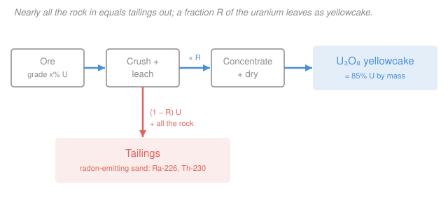

# Nuclear Fuel Cycle & Policy · Lesson 1.2: Mining & milling

> ⏱ ~15 min · Module 1: The Front End — Mining, Conversion & Enrichment · Builds on: [1.1 Fuel-cycle map & uranium resources](01-01-fuel-cycle-map-uranium-resources.md) · Unlocks: [1.3 Conversion & the enrichment mass balance](01-03-conversion-enrichment-mass-balance.md)

## Why this matters

Every gram of reactor fuel starts as rock with less uranium in it than a copper penny has copper. The first job of the fuel cycle is brute concentration: take ore that is often 99.9% waste and pull the uranium out as a shippable powder called **yellowcake** ($\ce{U3O8}$). Do that badly and you either leave uranium in the ground you paid to mine, or you leave behind a mountain of mildly radioactive sand that breathes radon for ten thousand years. Mining and milling are cheap compared to enrichment (Lesson 1.4) — but they are the front end's biggest *environmental* footprint, and the method you choose is mostly decided by the geology, not the engineer.

## The idea

Uranium ore is a needle-in-haystack problem where the haystack weighs a thousand tonnes. Two philosophies:

**Bring the rock to the chemistry (conventional mining + milling).** Dig the ore out — an **open pit** for shallow deposits, an **underground mine** for deep ones — haul it to a mill, crush it to sand, and soak it in acid or alkali so the uranium dissolves. Then chemically concentrate the pregnant liquid and dry it into yellowcake. Everything you dug that *wasn't* uranium becomes **tailings**: a slurry of spent sand that still holds the uranium's radioactive decay-family (radium, thorium) and slowly exhales radon gas.

**Bring the chemistry to the rock (in-situ leach, ISL / ISR).** If the uranium sits in a permeable, water-saturated sandstone, you don't dig at all. You drill wells, inject a leaching solution ("lixiviant") straight into the ore body, let it dissolve the uranium underground, and pump the loaded solution back up. The rock never moves. ISL is now the *dominant* method worldwide (most of Kazakhstan's output, which alone is ~40% of global supply) precisely because it skips the pit, the haul, and the surface tailings pile.

The unifying number in both is the **recovery fraction** $R$: the share of the uranium in the ore that you actually capture. It is never 1. Whatever you miss stays in the tailings (conventional) or in the depleted aquifer (ISL).

## The formal version

Define, for a mill producing yellowcake:

- $g$ — the **ore grade**, the mass fraction of *elemental* uranium in the ore (e.g. $g = 0.001$ for a $0.1\%$ deposit).
- $R$ — the **recovery fraction**, uranium captured ÷ uranium fed ($0 < R < 1$, typically $0.90$–$0.97$).
- $f_U$ — the uranium mass fraction *of yellowcake itself*. Yellowcake is $\ce{U3O8}$, so $f_U = \dfrac{3\,M_U}{3\,M_U + 8\,M_O} = \dfrac{714}{842} = 0.848$.
- $P$ — mass of $\ce{U3O8}$ product; $M_{\text{ore}}$ — mass of ore milled; $M_{\text{tail}}$ — mass of tailings.

**Uranium mass balance.** Uranium captured in the product equals the recovered share of uranium fed in the ore:

$$R\,g\,M_{\text{ore}} = f_U\,P.$$

*In words: (fraction recovered) × (uranium in the ore you milled) = (uranium locked in the yellowcake you made).* Solve for the ore you must mill:

$$\boxed{\,M_{\text{ore}} = \dfrac{f_U\,P}{R\,g}\,}$$

**Tailings.** The uranium is a negligible fraction of the ore's *mass*, so essentially the entire milled ore comes out as tailings:

$$M_{\text{tail}} \approx M_{\text{ore}}, \qquad \text{uranium still in tailings} = (1-R)\,g\,M_{\text{ore}} = \frac{1-R}{R}\,f_U\,P.$$

*In words: nearly every tonne you mine becomes tailings, and it carries off the $(1-R)$ slice of uranium you failed to recover — plus the entire radium/thorium decay chain, which doesn't dissolve and doesn't leave.* That last clause is the whole environmental story: the tailings are barely less radioactive than the ore, because the long-lived radon parents ($\ce{^{230}Th}$, $\ce{^{226}Ra}$) stay behind while only the uranium is skimmed off.

## Picture

## Worked examples

**Example 1 (mill mass balance — the workhorse).** A conventional mill runs ore of grade $0.1\%$ uranium at $R = 90\%$ recovery. How much ore must it mill to make **1 tonne of $\ce{U3O8}$**, and how much tailings does that leave?

Contained uranium in the product: $f_U P = 0.848 \times 1 = 0.848\ \text{t U}$. Using the boxed balance with $g = 0.001$, $R = 0.90$:

$$M_{\text{ore}} = \frac{f_U P}{R\,g} = \frac{0.848}{0.90 \times 0.001} = \frac{0.848}{0.0009} \approx 942\ \text{t ore}.$$

Tailings mass $\approx 942$ t — essentially *all* of it, since the 0.848 t of recovered uranium is a rounding error against 942 t of rock. The uranium *left in* those tailings:

$$(1-R)\,g\,M_{\text{ore}} = 0.10 \times 0.001 \times 942 \approx 0.094\ \text{t U} = 94\ \text{kg}.$$

So making one tonne of yellowcake means milling ~942 tonnes of ore, dumping ~941 tonnes of radon-emitting tailings, and abandoning ~94 kg of uranium in them. *This* is why grade matters so much — halve the grade and you double every one of those tonnages.

**Example 2 (ISL vs conventional — read the geology).** You hold two deposits, both grade $0.05\%$. Deposit A is a **roll-front in saturated, permeable sandstone**; Deposit B is a **hard-rock vein in low-permeability granite**. Which method for each, and how do the wastes compare?

- **Deposit A → ISL.** Permeable + saturated means a lixiviant can actually circulate through the ore and carry uranium to the recovery wells. No pit, no haul, no tailings pile. The radium and thorium are poorly soluble, so they mostly stay underground — you avoid the surface radon legacy entirely. The tradeoff is the *aquifer*: you've mobilized uranium (and possibly arsenic, selenium) into groundwater and must restore it afterward.
- **Deposit B → conventional.** Granite won't let solution flow, so ISL is physically impossible; you must mine and mill. At $0.05\%$ that is a lot of rock — by the boxed balance (take $R = 0.90$),

$$M_{\text{ore}} = \frac{0.848}{0.90 \times 0.0005} \approx 1{,}884\ \text{t ore per tonne }\ce{U3O8},$$

so ~1,884 t of tailings per tonne of yellowcake versus essentially none for ISL. The decision was never really the engineer's — permeability made it.

## Watch out

- **You might think a tonne of yellowcake is a tonne of uranium.** It isn't — $\ce{U3O8}$ is only $84.8\%$ uranium by mass (the rest is oxygen). Always convert with $f_U = 0.848$ before you feed the number into a conversion or enrichment balance (Lesson 1.3), or you'll overstate your uranium by ~18%.
- **You might think tailings are "spent" and therefore safe.** Milling removes the uranium but leaves its entire decay chain: $\ce{^{230}Th}$ (75,000-yr half-life) feeds $\ce{^{226}Ra}$, which feeds $\ce{^{222}Rn}$ — radon gas. The tailings keep exhaling radon for millennia and hold most of the ore's original radioactivity. Low-grade ore makes tailings only marginally less hot than the rock it came from.
- **You might think ISL is just "cleaner mining."** It moves the problem, it doesn't erase it: no tailings pile, but a contaminated aquifer that is genuinely hard to restore to baseline. "Less surface disturbance" is true; "no waste" is not.

## One-liner

> Milling concentrates ore into $\ce{U3O8}$ at a recovery $R < 1$, and $M_{\text{ore}} = f_U P/(Rg)$ says almost the entire mined mass — carrying the un-skimmed radium and thorium — ends up as radon-breathing tailings, which is exactly the waste ISL sidesteps by leaching underground.

## Problems

**P1 (🟢)** A mill runs ore of grade $0.2\%$ uranium at $R = 95\%$ recovery. How many tonnes of ore must it process to produce **1 tonne of $\ce{U3O8}$**, and roughly how much tailings results? How many kilograms of uranium are lost to those tailings?

**P2 (🟡)** Two deposits are milled at the same $R = 90\%$ recovery to make 1 tonne of $\ce{U3O8}$ each: Deposit A is high-grade at $2\%$ U (Athabasca-style); Deposit B is low-grade at $0.02\%$ U. Compute the ore (and thus tailings) each requires, and state the ratio. In one sentence, connect this to why ore grade — introduced back in [1.1](01-01-fuel-cycle-map-uranium-resources.md) — is the single biggest driver of a mine's waste footprint.

**P3 (🔴)** Your yellowcake will be shipped to a conversion plant (Lesson 1.3), but first a policy question. A regulator asks why an ISL operation, unlike a conventional mill, produces *no radon-emitting tailings pile* even though it extracts uranium from the same kind of radioactive ore. Answer in terms of what physically comes up the well versus what stays underground — and name the one waste burden ISL takes on *instead*.

Solutions

**P1.** Contained uranium in the product: $f_U P = 0.848 \times 1 = 0.848\ \text{t U}$. With $g = 0.002$, $R = 0.95$:

$$M_{\text{ore}} = \frac{f_U P}{R\,g} = \frac{0.848}{0.95 \times 0.002} = \frac{0.848}{0.0019} \approx 446\ \text{t ore}.$$

Tailings $\approx 446$ t (the recovered 0.848 t of uranium is negligible against the rock). Uranium lost to tailings:

$$(1-R)\,g\,M_{\text{ore}} = 0.05 \times 0.002 \times 446 \approx 0.0446\ \text{t} = 45\ \text{kg U}.$$

*Check.* Equivalently $\frac{1-R}{R} f_U P = \frac{0.05}{0.95}\times 0.848 = 0.0446$ t ✓. Better grade ($0.2\%$ vs Example 1's $0.1\%$) and higher recovery cut the ore from ~942 t to ~446 t — grade dominates. ✓

**P2.** Same product, $f_U P = 0.848\ \text{t U}$, $R = 0.90$.

Deposit A ($g = 0.02$):

$$M_{\text{ore}}^{A} = \frac{0.848}{0.90 \times 0.02} = \frac{0.848}{0.018} \approx 47\ \text{t ore (and }\approx 47\text{ t tailings)}.$$

Deposit B ($g = 0.0002$):

$$M_{\text{ore}}^{B} = \frac{0.848}{0.90 \times 0.0002} = \frac{0.848}{0.00018} \approx 4{,}711\ \text{t ore (and }\approx 4{,}711\text{ t tailings)}.$$

Ratio $= M_{\text{ore}}^{B}/M_{\text{ore}}^{A} = g_A/g_B = 0.02/0.0002 = 100$.

*Check.* Ore (hence tailings) scales as $1/g$, so a $100\times$ lower grade means $100\times$ the rock and $100\times$ the tailings for the same tonne of yellowcake. That is why grade — not tonnage of contained uranium — is the headline number for a deposit's environmental footprint: a "large" low-grade resource can be a waste catastrophe, while a small high-grade lens (Athabasca ores run several percent) is almost surgical. ✓

**P3.** Milling/leaching is chemically selective: the lixiviant dissolves and lifts **uranium**, but the uranium's decay daughters — $\ce{^{230}Th}$ and $\ce{^{226}Ra}$, the parents of radon $\ce{^{222}Rn}$ — are poorly soluble and largely stay put. In **conventional milling** those insoluble radium/thorium-bearing solids are physically dug up and dumped at the surface as tailings, so the radon source now sits in an open pile exhaling gas for millennia. In **ISL**, nothing is dug up: only the pregnant uranium solution comes up the recovery well, while the radium and thorium remain in the ore body deep underground where they were already. Hence no surface tailings pile and no new surface radon source. The burden ISL takes on *instead* is a **contaminated aquifer** — uranium (and often arsenic/selenium/radium traces) mobilized into groundwater that must be restored toward its pre-mining baseline, a slow and imperfect process. Net: ISL trades a permanent solid radon-emitting waste for a groundwater-remediation liability.

## Connections

- **Backward:** [1.1](01-01-fuel-cycle-map-uranium-resources.md) gave you ore grade and resources as *numbers on a map*; this lesson turns that grade into tonnes of rock, tonnes of tailings, and a shippable powder — the first physical step of the front end, and the reason a "resource" and a "reserve" are not the same thing (recovery and economics stand between them).
- **Forward:** [1.3 Conversion & the enrichment mass balance](01-03-conversion-enrichment-mass-balance.md) takes this $\ce{U3O8}$ (remembering it is only $84.8\%$ uranium), purifies it, and converts it to gaseous $\ce{UF6}$ so the isotopes can be separated — the yellowcake tonnage you just computed becomes the *feed* mass $F$ in that balance.
- **Sideways (radiation protection):** the radon-and-radium tailings legacy is a dosimetry problem — inhaled radon progeny are the dominant occupational and public dose pathway from the front end. That machinery (radon decay chains, inhalation dose, shielding) lives in [radiation-detection-shielding](../../radiation-detection-shielding/syllabus.md), and the underlying decay-chain physics comes from [intro-nuclear-engineering](../../intro-nuclear-engineering/syllabus.md).
