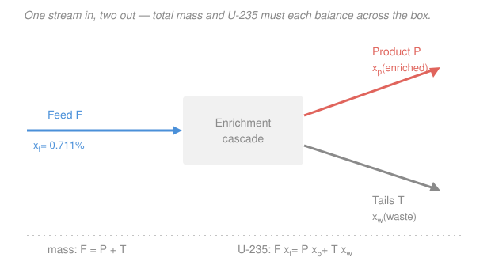

# Nuclear Fuel Cycle & Policy · Lesson 1.3: Conversion & the enrichment mass balance

> ⏱ ~15 min · Module 1: The Front End — Mining, Conversion & Enrichment · Builds on: [1.2 Mining & milling](01-02-mining-milling.md) · Unlocks: [1.4 The centrifuge & separative work](01-04-centrifuge-separative-work.md)

## Why this matters

A light-water reactor can't run on natural uranium: only $0.711\%$ of it is the fissile isotope $\ce{^{235}U}$, and the physics needs roughly three-to-five percent. So between the mill and the reactor sits an entire industry whose only job is to nudge that fraction upward. Before you can size that industry — how much ore-derived uranium you must feed it, how much enriched fuel comes out, how much depleted waste it leaves — you need one thing: a bookkeeping identity. This lesson is that identity. It's a two-line mass balance, and it governs the cost, the waste volume, and the proliferation footprint of the whole front end.

## The idea

You have a barrel of natural uranium: out of every 1000 atoms, about 7 are the useful $\ce{^{235}U}$ and 993 are the inert (for a thermal reactor) $\ce{^{238}U}$. Enrichment is *sorting*: you pour the barrel in and it comes out as two smaller barrels — a **product** barrel where the useful atoms are concentrated, and a **tails** (waste) barrel that's been picked over, poorer in $\ce{^{235}U}$ than nature.

No atoms are created or destroyed in the sorting. So two things are conserved, and that's the whole lesson: the **total** uranium that goes in equals what comes out, and the **$\ce{^{235}U}$** that goes in equals what comes out. Everything you'll compute — feed mass, tails mass, the tradeoff that sets fuel cost — falls out of those two sentences.

One physical wrinkle makes sorting possible at all. You can't chemically separate two isotopes of the same element — they're the same element. You separate them by *mass*, and $\ce{^{235}U}$ and $\ce{^{238}U}$ differ by only about $1\%$. To exploit even that sliver you need the uranium in a form that flows and diffuses: a gas. Hence **conversion** — the mill's yellowcake ($\ce{U3O8}$) is chemically turned into **uranium hexafluoride**, $\ce{UF6}$, the one uranium compound that's a gas at convenient temperatures (it sublimes around $56\,^\circ\text{C}$). Fluorine helps twice: it's the only common element with a single stable isotope, so *all* the mass difference between $\ce{^{235}UF6}$ and $\ce{^{238}UF6}$ comes from the uranium, not the fluorine.

## The formal version

Let a stream's **assay** $x$ be the mass fraction of $\ce{^{235}U}$ in its uranium. Three streams:

- **Feed** $F$ (kg of uranium) at assay $x_f$ — natural uranium, $x_f = 0.711\%$.
- **Product** $P$ at the desired enriched assay $x_p$.
- **Tails** (or waste) $T$ at the depleted assay $x_w$, with $x_w < x_f < x_p$.

**Total-mass conservation:**
$$F = P + T.$$
In words: every kilogram of uranium fed in leaves as either product or tails.

**$\ce{^{235}U}$ conservation:**
$$F\,x_f = P\,x_p + T\,x_w.$$
In words: the $\ce{^{235}U}$ atoms carried in by the feed are exactly the ones carried out by product and tails — the cascade just redistributes them.

Two equations, and if you fix the three assays plus one flow (say the product $P$ you need), everything else is determined. Substitute $T = F - P$ into the second equation and solve for the **feed-per-product ratio**:
$$\boxed{\;\frac{F}{P} = \frac{x_p - x_w}{x_f - x_w}\;}\qquad\text{and then}\qquad T = F - P.$$
In words: to make one unit of product you need $\frac{x_p - x_w}{x_f - x_w}$ units of feed — a number bigger than 1 (you concentrate the good stuff into a smaller barrel), and the leftover is tails.

Stare at the denominator $x_f - x_w$: it's the "grip" the process has on the feed. Lower the tails assay $x_w$ and that gap widens, so $F/P$ *shrinks* — you wring more $\ce{^{235}U}$ out of each kilogram of feed and need less ore-derived uranium. That's the **tails-assay tradeoff**, and it isn't free: pushing $x_w$ down means asking the cascade to do more separating, which costs *separative work* — the subject of Lesson 1.4. Feed on one pan of the scale, separative work on the other.

## Picture

## Worked examples

**Example 1 (the boss shape — feed and tails for a fixed product).** A utility needs $P = 1\ \text{kg}$ of uranium enriched to $x_p = 4.5\%$, drawn from natural feed $x_f = 0.711\%$, running the plant at a tails assay $x_w = 0.25\%$. Find the feed and tails masses.

Work in percent throughout (the units cancel, so no need to convert to fractions). Feed-per-product:
$$\frac{F}{P} = \frac{x_p - x_w}{x_f - x_w} = \frac{4.5 - 0.25}{0.711 - 0.25} = \frac{4.25}{0.461} = 9.22.$$
So $F = 9.22 \times 1\ \text{kg} \approx 9.2\ \text{kg}$ of natural uranium, and
$$T = F - P = 9.22 - 1 = 8.22 \approx 8.2\ \text{kg of tails}.$$

Sanity check on $\ce{^{235}U}$ conservation: in comes $F x_f = 9.22 \times 0.711 = 6.56$ (kg·%); out goes $P x_p + T x_w = 1 \times 4.5 + 8.22 \times 0.25 = 4.5 + 2.06 = 6.56$. ✓ The atoms balance. Note the scale of the front end: **over nine kilograms of natural uranium, and eight kilograms of depleted waste, for one kilogram of reactor fuel.**

**Example 2 (turn the tails knob — lower $x_w$ saves feed).** Same job — $1\ \text{kg}$ at $4.5\%$ from $0.711\%$ feed — but run the plant harder, at a tails assay $x_w = 0.20\%$. Recompute the feed.
$$\frac{F}{P} = \frac{4.5 - 0.20}{0.711 - 0.20} = \frac{4.30}{0.511} = 8.41,\qquad F \approx 8.4\ \text{kg},\qquad T = 7.4\ \text{kg}.$$

The feed **dropped** from $9.2\ \text{kg}$ to $8.4\ \text{kg}$ — about $0.8\ \text{kg}$ less natural uranium (and a smaller tails pile) for the identical product. Physically: a leaner tails assay means you left less $\ce{^{235}U}$ behind in the waste, so nature had to supply less to begin with. This is the tradeoff in action — and in 1.4 you'll see the bill for it arrive as extra separative work. Whether $0.20\%$ beats $0.25\%$ is an economics question: cheap uranium favors lazy (high) tails; expensive uranium favors leaner tails.

## Watch out

- **You might think** you can pick the tails assay $x_w$ freely with no consequence. **Actually** $x_w$ is the single most important economic dial in the front end: lowering it cuts your feed (uranium) bill but raises your separative-work bill, and the optimum sits where those two marginal costs meet (Lesson 1.5).
- **You might think** the enriched *product* is where most of the uranium ends up. **Actually** it's the opposite — roughly $85$–$90\%$ of the feed leaves as depleted tails. You concentrate a small amount of $\ce{^{235}U}$ into a small product stream and discard the bulk, now poorer than natural uranium, as "depleted uranium."
- **You might think** enrichment is a chemical process like the milling in 1.2. **Actually** the isotopes are chemically identical — separation is purely physical (by mass), which is exactly why you must first convert the yellowcake to gaseous $\ce{UF6}$; there is no chemistry that prefers $\ce{^{235}U}$ over $\ce{^{238}U}$.

## One-liner

> Enrichment is redistribution, not creation: fix the three assays and one flow, and $F = P + T$ together with $F x_f = P x_p + T x_w$ pin down everything — with the tails assay as the knob that trades uranium feed against separative work.

## Problems

**P1 (🟢)** A fabrication line needs $P = 2\ \text{kg}$ of uranium enriched to $x_p = 3.5\%$ from natural feed ($x_f = 0.711\%$), at a tails assay $x_w = 0.30\%$. Find the required feed mass $F$ and the tails mass $T$.

**P2 (🟡)** Now the feed is the fixed quantity: an enricher is handed exactly $F = 10\ \text{kg}$ of natural uranium ($x_f = 0.711\%$) and told to produce $5\%$ product ($x_p$) at a $0.30\%$ tails assay ($x_w$). How many kilograms of product $P$ and tails $T$ result? (You'll need to rearrange the feed-per-product relation — the unknown is now $P$, not $F$.)

**P3 (🔴, optional)** For a fixed job of $1\ \text{kg}$ product at $4.5\%$ from natural feed: compute the feed $F$ at a tails assay of $0.30\%$ and again at $0.15\%$, and report how much natural uranium the leaner setting saves. Then, in one sentence, say which cost (uranium feed or separative work — the latter is Lesson 1.4's topic) each setting is spending more of, and which way a *rising uranium price* should push the chosen tails assay.

Solutions

**P1** Feed-per-product ratio:
$$\frac{F}{P} = \frac{x_p - x_w}{x_f - x_w} = \frac{3.5 - 0.30}{0.711 - 0.30} = \frac{3.20}{0.411} = 7.79.$$
So $F = 7.79 \times 2 = 15.6\ \text{kg}$ of natural uranium, and $T = F - P = 15.6 - 2 = 13.6\ \text{kg}$ of tails.
Check: $F x_f = 15.6 \times 0.711 = 11.09$; $P x_p + T x_w = 2 \times 3.5 + 13.6 \times 0.30 = 7.0 + 4.07 = 11.07$. ✓ (rounding).

**P2** Here $F$ is known and $P$ is the unknown. Rearrange $\frac{F}{P} = \frac{x_p - x_w}{x_f - x_w}$ into
$$P = F\,\frac{x_f - x_w}{x_p - x_w} = 10 \times \frac{0.711 - 0.30}{5 - 0.30} = 10 \times \frac{0.411}{4.7} = 10 \times 0.0874 = 0.874\ \text{kg}.$$
Then $T = F - P = 10 - 0.874 = 9.13\ \text{kg}$ of tails.
Check ($\ce{^{235}U}$): $F x_f = 10 \times 0.711 = 7.11$; $P x_p + T x_w = 0.874 \times 5 + 9.13 \times 0.30 = 4.37 + 2.74 = 7.11$. ✓ Ten kilograms of natural feed buys less than a kilogram of $5\%$ product — the front end is uranium-hungry.

**P3** At $x_w = 0.30\%$:
$$F = 1 \times \frac{4.5 - 0.30}{0.711 - 0.30} = \frac{4.20}{0.411} = 10.2\ \text{kg}.$$
At $x_w = 0.15\%$:
$$F = 1 \times \frac{4.5 - 0.15}{0.711 - 0.15} = \frac{4.35}{0.561} = 7.75\ \text{kg}.$$
The leaner ($0.15\%$) tails setting uses $10.2 - 7.75 \approx 2.5\ \text{kg}$ **less** natural uranium per kilogram of product.
One-sentence tradeoff: the leaner $0.15\%$ setting spends less **uranium feed** but more **separative work** (it strips the tails harder), while the lazy $0.30\%$ setting does the reverse — so a rising uranium price makes feed the scarce input and pushes the economically optimal tails assay **downward** (strip harder, buy less ore).

## Flashback

**From Lesson 1.2 (Mining & milling):** A conventional mill processes $2{,}000$ tonnes of ore with an average grade of $0.15\%$ $\ce{U3O8}$ by mass, at a recovery fraction of $92\%$. How many kilograms of $\ce{U3O8}$ yellowcake does it recover, and how many kilograms of $\ce{U3O8}$ are lost to the tailings?

Solution

Contained $\ce{U3O8}$ in the ore: $2{,}000\ \text{tonnes} \times 0.0015 = 3.0\ \text{tonnes} = 3{,}000\ \text{kg}$.
Recovered at $92\%$: $0.92 \times 3{,}000 = 2{,}760\ \text{kg}$ of yellowcake.
Lost to tailings: $3{,}000 - 2{,}760 = 240\ \text{kg}$ of $\ce{U3O8}$ (the $8\%$ the process couldn't extract).
This recovered $\ce{U3O8}$ is exactly what conversion turns into $\ce{UF6}$ to begin this lesson's story — the mill's output is the enrichment feed. (To turn kg of $\ce{U3O8}$ into kg of uranium metal, multiply by the mass fraction of U in $\ce{U3O8}$, about $0.848$ — a conversion you'll use whenever the two chapters meet.)

## Connections

- **Backward:** the feed stream $F$ is precisely the mill's yellowcake from [1.2](01-02-mining-milling.md), converted to gaseous $\ce{UF6}$; and the reason enrichment is needed at all is the $0.711\%$ natural $\ce{^{235}U}$ abundance and its fission cross-section from the prereq [intro-nuclear-engineering](../../intro-nuclear-engineering/syllabus.md).
- **Forward:** [1.4](01-04-centrifuge-separative-work.md) puts a price on the tails-assay knob you met here — the separative work (SWU) that lowering $x_w$ demands — and [1.5](01-05-enrichment-cascade-front-end-cost.md) finds the economic optimum where feed cost and SWU cost balance.
- **Sideways (chemical/separations engineering & economics):** $F = P + T$ with $F x_f = P x_p + T x_w$ is the identical species-plus-total mass balance that governs any separator (distillation column, membrane, centrifuge) — and choosing $x_w$ is a constrained cost-minimization, the same marginal-cost-equals-marginal-cost logic that sets an optimum in microeconomics.
</content>
