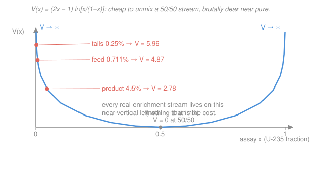

# Nuclear Fuel Cycle & Policy · Lesson 1.4: The centrifuge & separative work

> ⏱ ~15 min · Module 1: The Front End — Mining, Conversion & Enrichment · Builds on: [1.3 Conversion & the enrichment mass balance](01-03-conversion-enrichment-mass-balance.md) · Unlocks: [1.5 The enrichment cascade & front-end cost](01-05-enrichment-cascade-front-end-cost.md)

## Why this matters

The mass balance in [1.3](01-03-conversion-enrichment-mass-balance.md) told you *how much* uranium goes in and out — but not what enrichment *costs*. That cost isn't measured in kilograms; it's measured in **separative work**, the thermodynamic effort of unmixing two isotopes that differ in mass by less than 1.3%. Separative work is the single most traded quantity in the front end: enrichers sell it by the SWU, a utility buys thousands of SWU per reload, and the same math that prices your fuel is what nonproliferation analysts use to judge how close a stockpile of centrifuges sits to a bomb. Learn to compute a SWU and you can price enrichment and reason about proliferation with the same equation.

## The idea

Picture a washing machine on its spin cycle, but spinning a *gas* — uranium hexafluoride, $\ce{UF6}$ — at the rim of a rotor turning faster than the speed of sound. Centrifugal force flings the gas outward, and because the $^{238}\text{U}$ molecules are very slightly heavier than the $^{235}\text{U}$ ones, they crowd a hair more densely toward the wall. Skim gas from near the axis and it's a touch richer in $^{235}\text{U}$; skim from the wall and it's a touch poorer. One machine barely moves the needle — a per-pass enrichment gain of a percent or two — so you plumb thousands of them in series and parallel (the *cascade*, [1.5](01-05-enrichment-cascade-front-end-cost.md)) to climb from 0.711% to reactor grade. Centrifuges replaced the older **gaseous-diffusion** plants because they do the same job for roughly one-fiftieth of the electricity.

Now the key mental leap: **separation is work.** Nature likes things mixed — a uniform 50/50 blend is the state of maximum entropy, the "cheap" state. Pulling the isotopes apart pushes uphill against that tendency, and the further from 50/50 you already are, the harder each additional step becomes. So we need a bookkeeping quantity that measures *effort to unmix*, not mass moved. That quantity is **separative work**, and its natural currency is the **SWU** — the separative work unit, carrying units of kilograms (kg-SWU). A SWU is a fixed dollop of unmixing effort, and — this is the point most people miss — it is **independent of throughput**: it costs the same effort whether you shove it through one lazy machine for a year or a thousand fast ones for a day.

## The formal version

To each stream we assign a dimensionless **value** (or *separation potential*) that depends only on its assay $x$ (the mole fraction of $^{235}\text{U}$):

$$V(x) = (2x-1)\,\ln\!\frac{x}{1-x}.$$

*In words: $V(x)$ scores how far a stream sits from the do-nothing 50/50 mix — it is $0$ at $x=0.5$ and blows up toward either pure end.* You can check both facts by eye: at $x=0.5$ the factor $(2x-1)=0$; as $x\to0$ or $x\to1$ the logarithm diverges. The function is symmetric — $V(x)=V(1-x)$ — because unmixing doesn't care which isotope you call the "wanted" one; near-pure tails are as hard to make as near-pure product.

The **separative work** for an enrichment job is then the *value you created minus the value you started with*. A job splits a feed stream of mass $F$ at assay $x_f$ into a product stream $P$ at $x_p$ and a tails (waste) stream $T$ at $x_w$, obeying the balances from [1.3](01-03-conversion-enrichment-mass-balance.md): total mass $F=P+T$ and $^{235}\text{U}$ mass $Fx_f = Px_p + Tx_w$. The separative work required is

$$\boxed{\ \text{SWU} = P\,V(x_p) + T\,V(x_w) - F\,V(x_f)\ }$$

*In words: add up the value of everything that came out (product plus tails), subtract the value of what went in (feed) — the difference is the effort the cascade had to supply.* Two things about this formula earn their keep:

- **The tails term counts.** Making depleted tails is *also* unmixing — you drove the waste stream away from 50/50 too — so it adds to the bill. That single term is the source of the feed-vs-SWU tradeoff in [1.3](01-03-conversion-enrichment-mass-balance.md).
- **It's purely a state function.** $\text{SWU}$ depends only on the three assays and masses, not on how the cascade is built or how long it runs. That's why a SWU is a clean, tradeable commodity.

Each $V$ is dimensionless, so multiplying by a mass in kg gives $\text{SWU}$ in kg (hence "kg-SWU," usually just "SWU").

## Picture

Notice where the three real assays land: all three cling to the steep left wall, far below $x=0.5$. Enrichment never operates in the cheap valley — it lives on the cliff, which is exactly why it takes work.

## Worked examples

**Example 1 (the boss SWU — 1 kg of 4.5% fuel).** A utility wants $P = 1\ \text{kg}$ of uranium at $x_p = 4.5\%$, from natural feed $x_f = 0.711\%$, run to a tails assay $x_w = 0.25\%$. First the masses (from [1.3](01-03-conversion-enrichment-mass-balance.md), all fractions as decimals):

$$F = P\,\frac{x_p - x_w}{x_f - x_w} = 1\cdot\frac{0.045 - 0.0025}{0.00711 - 0.0025} = \frac{0.0425}{0.00461} \approx 9.22\ \text{kg}, \qquad T = F - P \approx 8.22\ \text{kg}.$$

Now the three values. Carry a few decimals — the SWU is a difference of larger numbers, so early rounding bites:

$$V(x_p) = (2\cdot0.045 - 1)\ln\frac{0.045}{0.955} = (-0.91)\ln(0.04712) = (-0.91)(-3.0551) = 2.780,$$

$$V(x_f) = (-0.98578)\ln\frac{0.00711}{0.99289} = (-0.98578)(-4.9391) = 4.869,$$

$$V(x_w) = (-0.995)\ln\frac{0.0025}{0.9975} = (-0.995)(-5.9890) = 5.959.$$

Assemble the bill:

$$\text{SWU} = P\,V(x_p) + T\,V(x_w) - F\,V(x_f) = (1)(2.780) + (8.22)(5.959) - (9.22)(4.869)$$
$$= 2.780 + 48.97 - 44.89 \approx 6.9\ \text{SWU}.$$

So one kilogram of 4.5% fuel demands about **6.9 SWU** on top of **9.2 kg** of natural uranium feed. Hold both numbers — the front-end cost in [1.5](01-05-enrichment-cascade-front-end-cost.md) is a price on the feed *plus* a separate price on the SWU.

**Example 2 (SWU vs. tails — the core tradeoff).** Keep the same product ($1\ \text{kg}$ at 4.5%) and feed (0.711%), but run the plant *harder* to a leaner tails, $x_w = 0.20\%$, wringing more $^{235}\text{U}$ out of the waste. The masses shift:

$$F = \frac{0.045 - 0.002}{0.00711 - 0.002} = \frac{0.043}{0.00511} \approx 8.41\ \text{kg}, \qquad T = F - P \approx 7.41\ \text{kg}.$$

Feed dropped from 9.22 to **8.41 kg** — leaner tails means you throw away less $^{235}\text{U}$, so you need less ore. Only $V(x_w)$ changes:

$$V(0.002) = (-0.996)\ln\frac{0.002}{0.998} = (-0.996)(-6.2126) = 6.188.$$

$$\text{SWU} = (1)(2.780) + (7.41)(6.188) - (8.41)(4.869) = 2.780 + 45.87 - 40.95 \approx 7.7\ \text{SWU}.$$

The SWU **rose** from 6.9 to **7.7** even though the feed fell. That is the whole game: **lower tails saves uranium but costs separative work.** You bought 0.8 kg of feed savings with 0.8 extra SWU of effort. Whether that trade is worth it is a price question — cheap uranium and pricey SWU pushes you toward *higher* tails (throw more away, do less work); expensive uranium and cheap SWU pulls you toward *leaner* tails. That optimum is the heart of [1.5](01-05-enrichment-cascade-front-end-cost.md).

## Watch out

- **You might think more SWU means more uranium.** It's the opposite. Feed and SWU trade *against* each other through the tails assay: driving tails leaner cuts feed and *raises* SWU. There's no single "amount of enrichment" — there's a feed number and a SWU number, and you pick where on the curve to sit.
- **You might think the tails value shouldn't count as work.** It must. Depleting the waste to 0.25% or 0.20% is unmixing too, and the $T\,V(x_w)$ term is often the largest of the three (here about 49 out of the ~52 units of created value). Drop it and your SWU is nonsense.
- **You might picture a SWU as an amount of $\ce{UF6}$ or a kilowatt-hour of electricity.** It's neither. A SWU is a quantum of *separation effort* — a state-function difference in value. The electricity to deliver it is a separate (and, for centrifuges, small) fact; that's why the technology switch from diffusion to centrifuge changed the energy bill without changing the SWU count for a given job.

## One-liner

> Separative work is the effort to unmix isotopes — $\text{SWU}=P\,V(x_p)+T\,V(x_w)-F\,V(x_f)$ with $V(x)=(2x-1)\ln\frac{x}{1-x}$ — and it trades against uranium feed through the tails assay you choose.

## Problems

**P1 (🟢)** Without a calculator, rank the value $V(x)$ of three streams from largest to smallest: natural uranium at 0.711%, half-and-half at 50%, and weapons-grade at 90%. State the one property of $V$ that settles it.

**P2 (🟡)** A small job needs $P = 0.5\ \text{kg}$ of product at $x_p = 20\%$ from feed $x_f = 0.711\%$ at tails $x_w = 0.30\%$. (a) Find $F$ and $T$. (b) Using $V(0.20)=0.832$, $V(0.00711)=4.869$, $V(0.003)=5.771$, compute the SWU. (c) In one sentence, say why this 0.5 kg job needs *more* SWU than the 1 kg, 4.5% job in Example 1, even though it makes half the mass.

**P3 (🔴)** The value function has a hidden symmetry. (a) Prove algebraically that $V(x) = V(1-x)$. (b) Use it to explain, in one sentence, why driving the *tails* down to a very lean 0.20% is comparably hard work per kilogram as making mildly enriched *product* — even though only the product is the thing you actually want.

Solutions

**P1.** $V$ is smallest near $x=0.5$ (it is exactly $0$ there) and grows as you move toward either pure end, symmetrically. So the stream *closest* to 50/50 has the *smallest* value and the stream *farthest* from it has the largest. Distances from 0.5: natural $|0.00711-0.5|=0.493$, weapons $|0.90-0.5|=0.40$, half-and-half $0$. Ranking largest → smallest value: **natural (0.711%) > weapons-grade (90%) > 50/50.** The settling property: $V(x)$ is symmetric about $x=0.5$ where it vanishes, and increases monotonically toward each end — so it rewards distance from the do-nothing mixture, in either direction. (Numerically $V(0.00711)=4.87$, $V(0.90)=1.76$, $V(0.5)=0$, confirming the ranking.)

**P2.** (a) With everything in decimals, $x_p=0.20$, $x_f=0.00711$, $x_w=0.003$:

$$F = P\,\frac{x_p-x_w}{x_f-x_w} = 0.5\cdot\frac{0.20-0.003}{0.00711-0.003} = 0.5\cdot\frac{0.197}{0.00411} = 0.5\times47.93 \approx 23.97\ \text{kg},$$
$$T = F-P \approx 23.47\ \text{kg}.$$

(b) 
$$\text{SWU} = P\,V(x_p)+T\,V(x_w)-F\,V(x_f) = (0.5)(0.832)+(23.47)(5.771)-(23.97)(4.869)$$
$$= 0.416 + 135.45 - 116.71 \approx 19.2\ \text{SWU}.$$

(c) Climbing to 20% is far higher up the value cliff than 4.5%, and it demands a huge feed ($\approx 24$ kg vs. 9 kg) whose depletion to tails is itself a mountain of separative work — assay reached, not mass produced, is what drives the SWU. *(Check the balance: $Fx_f = 23.97\times0.00711 = 0.1704$; $Px_p+Tx_w = 0.5\times0.20 + 23.47\times0.003 = 0.100+0.0704 = 0.1704$ ✓.)*

**P3.** (a) Substitute $1-x$ for $x$ in the definition and simplify the two factors. The prefactor becomes

$$2(1-x)-1 = 1-2x = -(2x-1),$$

and inside the logarithm the argument inverts,

$$\frac{1-x}{1-(1-x)} = \frac{1-x}{x} = \left(\frac{x}{1-x}\right)^{-1} \quad\Longrightarrow\quad \ln\frac{1-x}{x} = -\ln\frac{x}{1-x}.$$

Multiply the two:

$$V(1-x) = \big[-(2x-1)\big]\big[-\ln\tfrac{x}{1-x}\big] = (2x-1)\ln\frac{x}{1-x} = V(x). \ \checkmark$$

(b) Because $V$ only measures *distance from the 50/50 mix* and is blind to direction, a lean tails stream sits just as far out on the value cliff as a mildly enriched product — so depleting the waste demands roughly comparable separative work per kilogram, regardless of which stream you were "aiming" for. (Concretely from Example 2, $V(0.002)=6.19$ for the tails exceeds $V(0.045)=2.78$ for the product: the waste is *further* from 50/50 than the fuel, which is why the $T\,V(x_w)$ term dominates the SWU bill.)

## Flashback

**From Lesson 1.3 (the enrichment mass balance):** A utility needs $P = 2\ \text{kg}$ of uranium enriched to $x_p = 3.2\%$ from natural feed ($x_f = 0.711\%$), run to a tails assay of $x_w = 0.30\%$. Find the feed mass $F$ and the tails mass $T$, and confirm the $^{235}\text{U}$ balance closes.

Solution

Work in decimals. Feed from the mass balance:

$$F = P\,\frac{x_p - x_w}{x_f - x_w} = 2\cdot\frac{0.032 - 0.003}{0.00711 - 0.003} = 2\cdot\frac{0.029}{0.00411} = 2\times7.056 \approx 14.11\ \text{kg}.$$

Tails by total-mass balance:

$$T = F - P = 14.11 - 2 = 12.11\ \text{kg}.$$

*Check the $^{235}\text{U}$ balance* $Fx_f = Px_p + Tx_w$:

$$Fx_f = 14.11\times0.00711 = 0.1003\ \text{kg}, \qquad Px_p + Tx_w = 2\times0.032 + 12.11\times0.003 = 0.064 + 0.0363 = 0.1003\ \text{kg}.\ \checkmark$$

So each kilogram of 3.2% fuel needs about 7 kg of natural feed — the front-end feed multiplier is steep even before you count the SWU this lesson prices.

## Connections

- **Backward:** this lesson prices the mass balance of [1.3](01-03-conversion-enrichment-mass-balance.md). The feed/product/tails masses you solved there are exactly the $F,P,T$ that multiply the values here, and the tails-assay knob you met there is revealed as the feed-vs-SWU tradeoff.
- **Forward:** [1.5 The enrichment cascade & front-end cost](01-05-enrichment-cascade-front-end-cost.md) stacks single stages into an ideal cascade and puts a dollar price on each SWU and each kg of feed — turning the 6.9-SWU / 9.2-kg answer of Example 1 into a line item, and turning the tradeoff of Example 2 into an economic optimum for the tails assay.
- **Sideways (economics & nonproliferation):** SWU is a traded commodity with a spot price, so enrichment is a market as much as a physics problem — the same value-function accounting that a utility uses to budget fuel is what safeguards analysts in [4.3 Nonproliferation, safeguards & security](04-03-nonproliferation-safeguards-security.md) use to estimate how much separative work stands between a low-enriched stockpile and weapons-grade material.
