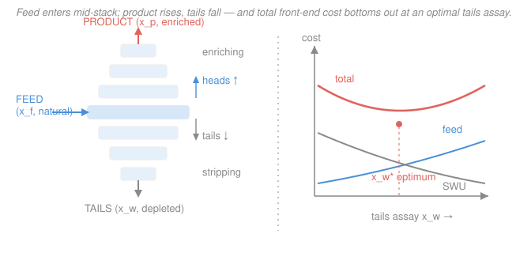

# Nuclear Fuel Cycle & Policy · Lesson 1.5: The enrichment cascade & front-end cost

> ⏱ ~15 min · Module 1: The Front End · Builds on: [1.4 The centrifuge & separative work](01-04-centrifuge-separative-work.md), [1.3 Conversion & the enrichment mass balance](01-03-conversion-enrichment-mass-balance.md) · Unlocks: Module 2 — [2.1 Fuel fabrication & assembly design](02-01-fuel-fabrication-assembly-design.md)

## Why this matters

A single centrifuge barely moves the needle — it nudges the U-235 fraction up by a factor of maybe 1.2 or 1.3. To climb from 0.711% natural uranium to 4.5% reactor fuel you need to chain hundreds of them into a **cascade**, and the geometry of that chain is what a separative-work unit (SWU) actually pays for. This lesson closes the front end by doing the two things a fuel buyer cares about: assembling the stages into a working cascade, and turning kilograms of feed and units of SWU into **dollars** — including the one free lever the buyer controls, the tails assay, whose best setting swings with the price of uranium.

## The idea

One centrifuge produces a slightly enriched **heads** stream and a slightly depleted **tails** stream. Neither is anywhere near where you want it. So you stack stages: feed the heads of one stage *up* into the next stage, and route the tails *down* into the previous one. Do this over and over and the tiny per-stage separation compounds, the way repeated small interest payments compound into real money.

The clever part is a rule: **never mix streams of different assay.** Mixing un-does separation — it is entropy you already paid SWU to fight. So each stage is fed only by streams that arrive at (nearly) its own assay. A cascade obeying this rule perfectly is an **ideal cascade**, and it has a signature diamond shape: fat in the middle where the feed comes in, tapering to thin streams at the top (a little highly-enriched product) and the bottom (a lot of barely-depleted tails).

The cascade splits at the feed point into two jobs. The **enriching section** (above the feed) pushes the U-235 fraction *up* toward product. The **stripping section** (below) wrings the leftover U-235 *out* of the down-flowing stream so you don't throw away too much. Where you stop stripping — the **tails assay** $x_w$ — is a dial. Strip harder (lower $x_w$) and you recover more U-235, so you buy *less* natural uranium; but wringing that last bit out takes *more* SWU. That tension has an economic sweet spot, and it moves.

## The formal version

**Per-stage separation factor.** Write a stage's separation as an **overall separation factor** $\alpha$ acting on the *abundance ratio* $r = \dfrac{x}{1-x}$ (moles of U-235 per mole of U-238), so that heads and tails satisfy

$$r_{\text{heads}} = \alpha\, r_{\text{tails}}, \qquad r \equiv \frac{x}{1-x}.$$

*In words: one stage multiplies the U-235-to-U-238 ratio by a fixed factor $\alpha$ slightly above 1.* Because ratios multiply, chaining $n$ ideal enriching stages multiplies the ratio by $\alpha^n$ — the separation compounds geometrically, which is why a factor as small as $\alpha \approx 1.25$ still reaches reactor grade in a couple of dozen stages.

**The cascade is stacked mass balances.** Each stage obeys the same feed = product + tails balance you met in [1.3](01-03-conversion-enrichment-mass-balance.md); the "no-mixing" rule is what glues neighboring stages together without wasting work. For the *whole plant* only the three external streams matter, and they obey the same two equations as a single separator:

$$F x_f = P x_p + T x_w, \qquad F = P\,\frac{x_p - x_w}{x_f - x_w},$$

with feed mass $F$, product mass $P$, tails mass $T = F-P$, and assays $x_f$ (feed), $x_p$ (product), $x_w$ (tails), all as U-235 mass fractions. *In words: whatever internal recycling the cascade does, the books still balance across the fence — total uranium in equals product plus tails, and total U-235 in equals U-235 out.*

**Separative work.** From [1.4](01-04-centrifuge-separative-work.md), the plant's separative work in SWU is

$$\text{SWU} = P\,V(x_p) + T\,V(x_w) - F\,V(x_f), \qquad V(x) = (2x-1)\ln\frac{x}{1-x},$$

where $V$ is the dimensionless **value function**. *In words: SWU is the "value" carried out in product plus tails minus the value that came in with feed — the amount of sorting the cascade performed, independent of price.*

**Front-end cost.** Money enters only now. The delivered cost of a batch of enriched uranium is the sum of four priced inputs:

$$C = \underbrace{F\,c_U}_{\text{uranium}} + \underbrace{F\,c_{\text{conv}}}_{\text{conversion}} + \underbrace{\text{SWU}\cdot c_S}_{\text{enrichment}} + \underbrace{P\,c_{\text{fab}}}_{\text{fabrication}},$$

with unit prices $c_U$ (dollars per kgU of natural uranium), $c_{\text{conv}}$ (dollars per kgU to convert to $\ce{UF6}$), $c_S$ (dollars per SWU), and $c_{\text{fab}}$ (dollars per kgU of finished fuel). *In words: pay for the uranium and its conversion by the kilogram of feed, pay for the sorting by the SWU, and pay for turning enriched $\ce{UF6}$ into fuel by the kilogram of product.* Feed and conversion scale with $F$; fabrication scales with $P$.

**The tails-assay optimum.** Only $F$ and SWU depend on $x_w$ (once $x_p$ and $P$ are fixed), and they move in *opposite* directions: lowering $x_w$ cuts $F$ but raises SWU. The total front-end cost is minimized where the marginal saving equals the marginal cost — lowering tails from $x_w^{(1)}$ to $x_w^{(2)}$ pays off exactly when

$$(c_U + c_{\text{conv}})\,\Delta F \;>\; c_S\,\Delta\text{SWU},$$

with $\Delta F$ the feed saved and $\Delta\text{SWU}$ the extra separative work. *In words: strip harder only while the uranium you rescue is worth more than the SWU it costs to rescue it.* The whole decision rides on the price ratio $(c_U+c_{\text{conv}})/c_S$: **a rising uranium price pushes the optimum toward lower tails assay** (rescue more), while cheap uranium and dear SWU push it higher (waste more, sort less).

## Picture

## Worked examples

Both use the Module-1 boss job: produce $P = 1\ \text{kg}$ of uranium at $x_p = 4.5\%$ from natural feed $x_f = 0.711\%$. Value-function numbers we will reuse (from $V(x)=(2x-1)\ln\frac{x}{1-x}$):

$$V(0.045) = 2.780, \quad V(0.00711) = 4.869, \quad V(0.0025) = 5.958, \quad V(0.0020) = 6.188.$$

**Example 1 (price out one batch — the four line items).** Take a tails assay $x_w = 0.25\%$ and unit prices $c_U = 100$ dollars/kgU, $c_{\text{conv}} = 15$ dollars/kgU, $c_S = 100$ dollars/SWU, $c_{\text{fab}} = 300$ dollars/kgU.

First the masses:

$$F = 1\cdot\frac{0.045 - 0.0025}{0.00711 - 0.0025} = \frac{0.0425}{0.00461} = 9.22\ \text{kg}, \qquad T = F - P = 8.22\ \text{kg}.$$

Then the separative work:

$$\text{SWU} = (1)(2.780) + (8.22)(5.958) - (9.22)(4.869) = 2.780 + 48.97 - 44.89 = 6.86\ \text{SWU}.$$

Now the four line items:

| Input | Amount | Unit price | Cost |
|---|---|---|---|
| Uranium (feed) | 9.22 kgU | 100 dollars/kgU | 922 dollars |
| Conversion | 9.22 kgU | 15 dollars/kgU | 138 dollars |
| Enrichment | 6.86 SWU | 100 dollars/SWU | 686 dollars |
| Fabrication | 1 kgU | 300 dollars/kgU | 300 dollars |

$$C = 922 + 138 + 686 + 300 \approx 2{,}050\ \text{dollars per kg of 4.5\% uranium}.$$

Uranium plus conversion is about half the bill, SWU a third, fabrication the rest — a typical front-end split. That 2,050 dollars is the number Module 2 will spread over the energy this kilogram produces.

**Example 2 (the tails optimum, and how a price flips it).** Should the utility strip to $0.25\%$ or push to $0.20\%$? Recompute the mass and SWU at $x_w = 0.20\%$:

$$F = \frac{0.045 - 0.0020}{0.00711 - 0.0020} = \frac{0.043}{0.00511} = 8.41\ \text{kg}, \qquad T = 7.41\ \text{kg},$$

$$\text{SWU} = (1)(2.780) + (7.41)(6.188) - (8.41)(4.869) = 2.780 + 45.88 - 40.97 = 7.69\ \text{SWU}.$$

So dropping the tails from $0.25\%$ to $0.20\%$ **saves** $\Delta F = 9.22 - 8.41 = 0.80\ \text{kgU}$ of feed but **costs** $\Delta\text{SWU} = 7.69 - 6.86 = 0.83$ extra SWU. Which wins depends on prices. Compare only the parts that move (feed + conversion + SWU); fabrication is fixed.

*Case A — cheap uranium ($c_U = 80$, $c_S = 100$, ignore conversion for clarity):*

$$C_{0.25} = (9.22)(80) + (6.86)(100) = 738 + 686 = 1{,}424, \qquad C_{0.20} = (8.41)(80) + (7.69)(100) = 673 + 769 = 1{,}442.$$

$0.25\%$ wins by 18 dollars — cheap uranium isn't worth the extra SWU to rescue.

*Case B — expensive uranium ($c_U = 150$, $c_S = 100$):*

$$C_{0.25} = (9.22)(150) + (6.86)(100) = 1{,}383 + 686 = 2{,}069, \qquad C_{0.20} = (8.41)(150) + (7.69)(100) = 1{,}262 + 769 = 2{,}031.$$

Now $0.20\%$ wins by 38 dollars. The break-even is the price ratio $c_U/c_S = \Delta\text{SWU}/\Delta F = 0.83/0.80 \approx 1.03$: once a kilogram of uranium costs more than about $1.03$ SWU, strip harder. *A rising uranium price flips the optimum toward lower tails* — exactly the lever enrichers pull when the uranium market tightens.

## Watch out

- **You might think more stages just means "more enriched," linearly.** It's geometric — each stage multiplies the *ratio* $x/(1-x)$ by $\alpha$, so assay climbs like $\alpha^n$. That is also why a cascade is far longer above the feed than a first guess suggests, and why highly-enriched material is only a few dozen more stages beyond low-enriched — the proliferation worry behind enrichment technology.
- **You might think lower tails assay is always "greener/better."** Lower tails wastes less uranium but consumes more separative work (energy and capital). The right tails assay is an *economic* optimum set by the uranium-to-SWU price ratio, not a physics constant — it drifts every time either price moves.
- **You might add fabrication into the tails-optimum comparison.** Don't. Fabrication scales with product $P$, which is fixed at 1 kg regardless of tails assay, so it's a constant that cancels. Only feed, conversion, and SWU vote on $x_w$.

## One-liner

> Stack barely-separating stages into an ideal cascade, then price the job as feed + conversion + SWU + fabrication — where the one free dial, the tails assay, is set by the uranium-to-SWU price ratio and slides lower as uranium gets dear.

## Problems

**P1 (🟢)** Using Example 1's job and prices ($F = 9.22$ kgU, SWU $= 6.86$, $c_U = 100$, $c_{\text{conv}} = 15$, $c_S = 100$ dollars/SWU, $c_{\text{fab}} = 300$, $P = 1$ kg), what fraction of the total front-end cost is the enrichment (SWU) line? If a new centrifuge generation halved $c_S$ to 50 dollars/SWU, what is the new total cost per kg?

**P2 (🟡)** A single centrifuge stage multiplies the abundance ratio $r = x/(1-x)$ by $\alpha = 1.25$. Working in the *dilute* approximation where the enriching section just multiplies $r$ by $\alpha$ each stage, how many stages does it take to climb from natural feed ($x_f = 0.711\%$) to product ($x_p = 4.5\%$)? What does this say about why one centrifuge is useless but a cascade isn't?

**P3 (🔴 — bridges to burnup & LCOE)** The 2,050-dollar kilogram of 4.5% fuel from Example 1 reaches a discharge burnup of $50\ \text{GWd/tHM}$ in the reactor. Converting to electricity at a thermal efficiency of $33\%$, what is the front-end fuel cost in **dollars per MWh of electricity**? (Ignore carrying charges and back-end costs.) Comment on whether the front end is a big share of a busbar cost around 60–90 dollars/MWh.

Solutions

**P1.** Line items: uranium $9.22\times100 = 922$, conversion $9.22\times15 = 138$, SWU $6.86\times100 = 686$, fabrication $1\times300 = 300$; total $= 2{,}046 \approx 2{,}050$ dollars. Enrichment fraction:

$$\frac{686}{2046} = 0.335 \approx 34\%.$$

Halving $c_S$ to 50 dollars/SWU drops the SWU line to $6.86\times50 = 343$ dollars, so

$$C_{\text{new}} = 922 + 138 + 343 + 300 = 1{,}703\ \text{dollars per kg}.$$

A ~17% cut in the total — enrichment is a big enough slice that cheaper SWU matters, and it also nudges the tails optimum *upward* (waste more uranium when sorting gets cheap).

**P2.** Abundance ratios: feed $r_f = \dfrac{0.00711}{0.99289} = 0.00716$; product $r_p = \dfrac{0.045}{0.955} = 0.04712$. The enriching section multiplies $r$ by $\alpha$ each stage, so we need $\alpha^n \ge r_p/r_f$:

$$\frac{r_p}{r_f} = \frac{0.04712}{0.00716} = 6.58, \qquad n = \frac{\ln 6.58}{\ln 1.25} = \frac{1.884}{0.223} = 8.4 \;\Rightarrow\; 9\ \text{stages}.$$

So even at $\alpha = 1.25$ a *single* stage barely lifts 0.711% toward 0.9%, but nine stacked stages reach reactor grade — separation compounds geometrically. (A real cascade needs more stages than this dilute count and a long stripping section too, but the compounding is the point: the cascade, not the centrifuge, is the machine.)

*Check.* $1.25^9 = 7.45 \ge 6.58$ ✓ while $1.25^8 = 5.96 < 6.58$, so 9 is the first sufficient integer. ✓

**P3.** One kilogram is $10^{-3}\ \text{tHM}$, so the thermal energy released is

$$E_{\text{th}} = 50\ \tfrac{\text{GWd}}{\text{tHM}} \times 10^{-3}\ \text{tHM} = 0.05\ \text{GWd} = 0.05 \times 24{,}000\ \text{MWh} = 1{,}200\ \text{MWh}_{\text{th}}.$$

(using $1\ \text{GWd} = 24\ \text{GWh} = 24{,}000\ \text{MWh}$). Electricity at $33\%$:

$$E_{\text{e}} = 0.33 \times 1{,}200 = 396\ \text{MWh}_{\text{e}}, \qquad \frac{2{,}050\ \text{dollars}}{396\ \text{MWh}_{\text{e}}} \approx 5.2\ \text{dollars/MWh}_{\text{e}}.$$

About 5 dollars/MWh — a small slice of a 60–90 dollars/MWh busbar cost (well under 10%). This is the punchline the economics module ([2.4 In-core fuel-cycle economics](02-04-in-core-fuel-cycle-economics.md), [4.4 Nuclear economics & LCOE](04-04-nuclear-economics-lcoe.md)) hammers: nuclear's cost is dominated by capital, not fuel, so even a big swing in enrichment price barely moves the electricity price — while the discount rate moves it a lot.

*Check.* Units: $\tfrac{\text{GWd}}{\text{tHM}}\times\text{tHM} = \text{GWd}$ ✓; dollars ÷ MWh = dollars/MWh ✓. Sanity: a 1 GWe plant burns ~20 tHM/yr, and 20,000 kg × 2,050 dollars ≈ 41M dollars/yr of front-end fuel against ~7.9 TWh sold ≈ 5 dollars/MWh — consistent. ✓

## Flashback

**From Lesson 1.4 (Separative work):** A medical-isotope program orders $P = 1\ \text{kg}$ of uranium enriched to $x_p = 3.6\%$ from natural feed ($x_f = 0.711\%$) at a tails assay of $x_w = 0.25\%$. Using $V(x) = (2x-1)\ln\frac{x}{1-x}$, find the feed mass and the SWU required. (Fresh numbers — same value-function machinery.)

Solution

Value functions: $V(0.036) = (2(0.036)-1)\ln\frac{0.036}{0.964} = (-0.928)(-3.288) = 3.051$; and (reused) $V(0.00711) = 4.869$, $V(0.0025) = 5.958$.

Feed and tails masses:

$$F = 1\cdot\frac{0.036 - 0.0025}{0.00711 - 0.0025} = \frac{0.0335}{0.00461} = 7.27\ \text{kg}, \qquad T = F - P = 6.27\ \text{kg}.$$

Separative work:

$$\text{SWU} = (1)(3.051) + (6.27)(5.958) - (7.27)(4.869) = 3.051 + 37.34 - 35.40 = 5.0\ \text{SWU}.$$

*Check.* Lower product enrichment (3.6% vs 4.5%) needs less feed (7.3 vs 9.2 kg) and less separative work (5.0 vs 6.9 SWU) than Example 1's job, as it must. ✓

## Connections

- **Backward:** the cascade stacks the single-stage mass balance of [1.3](01-03-conversion-enrichment-mass-balance.md) and prices the separative work of [1.4](01-04-centrifuge-separative-work.md); the whole front end started at the mine and mill of [1.1](01-01-fuel-cycle-map-uranium-resources.md)–[1.2](01-02-mining-milling.md).
- **Forward:** this 2,050-dollar/kg batch is the raw material for [2.1 Fuel fabrication](02-01-fuel-fabrication-assembly-design.md); [2.3 Burnup & the linear reactivity model](02-03-burnup-depletion-linear-reactivity-model.md) and [2.4 In-core fuel-cycle economics](02-04-in-core-fuel-cycle-economics.md) decide how much energy — and revenue — that enrichment buys, feeding the LCOE of [4.4](04-04-nuclear-economics-lcoe.md).
- **Sideways (economics & separations):** the tails-assay optimum is a textbook marginal-cost calculation — set the marginal saving equal to the marginal cost — the same constrained-optimization logic that governs any input substitution, here uranium-versus-SWU. The geometric stage-stacking of a cascade is the general principle behind chemical separation trains; the same math sizes distillation columns. And the short jump from low- to high-enriched uranium is the physical fact underlying the safeguards regime of [4.3 Nonproliferation & safeguards](04-03-nonproliferation-safeguards-security.md).
