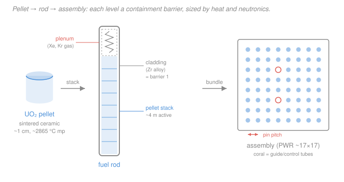
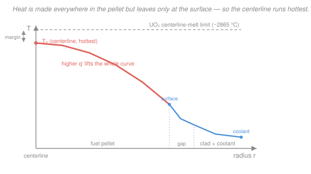

# Nuclear Fuel Cycle & Policy · Lesson 2.1: Fuel fabrication & assembly design

> ⏱ ~15 min · Module 2: In-Core — Fuel Management & Burnup · Builds on: [1.5 Enrichment cascade & front-end cost](01-05-enrichment-cascade-front-end-cost.md), [`intro-nuclear-engineering`](../../intro-nuclear-engineering/syllabus.md) · Unlocks: [2.2 Reactivity over life & reload management](02-02-reactivity-over-life-reload-management.md)

## Why this matters

You just spent real money turning ore into enriched $\ce{UF6}$ (Module 1). Now that expensive material has to be turned into something a reactor can actually burn for four or five years without failing — a little ceramic pellet inside a thin metal tube, ten million of them, each one hot enough at the center to be within a few hundred degrees of melting. Get the geometry wrong and you either melt the fuel (a bad day) or leave energy on the table (an expensive one). This lesson is where the physics of heat removal, the chemistry of the ceramic, and the neutronics of the lattice all collide in one object: the fuel rod.

## The idea

Here is the whole design problem in one sentence: **heat is generated throughout the volume of the fuel, but it can only escape through the surface.** Volume grows as radius cubed; surface grows as radius squared. So the fatter the fuel, the harder it is to get the heat out, and the hotter the center runs relative to the edge. That single fact — surface-limited cooling of a volume heat source — dictates almost every choice you're about to see.

The answer the industry settled on is a hierarchy, built from the atom outward:

- **Pellet.** Take the enriched uranium, convert it back from $\ce{UF6}$ to a black ceramic powder, $\ce{UO2}$, press it into a cylinder the size of a pencil eraser, and bake ("sinter") it at ~1700 °C into a dense, hard ceramic. Ceramic on purpose: it melts at ~2865 °C (metal uranium melts at 1132 °C) and it traps most of the radioactive fission fragments inside its crystal lattice. The pellet is thin so the center-to-surface temperature drop stays survivable.
- **Rod.** Stack a few hundred pellets in a thin tube of zirconium alloy — "cladding" — and seal it. Zirconium because it's nearly transparent to neutrons (it doesn't waste them) and tolerates heat and radiation. This sealed tube is **the first containment barrier**: the wall between the fission products and the coolant. Leave an empty space at the top, the **plenum**, for the gases fission will eventually breathe out.
- **Assembly.** Bundle a few hundred rods on a precise square grid — a PWR assembly is roughly $17\times17$ rods, a BWR one roughly $8\times8$ to $10\times10$ — held by spacer grids, with some lattice positions left open as guide tubes for control rods. A reactor core is ~150–250 of these assemblies.

Every level is a compromise between *make it thin so heat escapes and neutrons behave* and *make it big so you can build a gigawatt reactor out of a manageable number of parts*.

## The formal version

**Linear heat rate.** The natural way to measure how hard a rod is working is not total power but power per unit length:

$$q' = \frac{\text{power produced in the rod}}{\text{active fuel length}} \qquad \left[\tfrac{\text{kW}}{\text{m}}\right].$$

*In words: $q'$ is how many kilowatts each meter of rod must shed sideways into the coolant.* We use per-length (not per-volume or total) because heat leaves a long thin rod essentially radially, so a meter of rod at the top faces the same cooling job as a meter at the bottom — $q'$ is the quantity the coolant, the cladding, and the pellet centerline all "feel."

**Centerline temperature.** For a cylindrical pellet of radius $R_f$ making heat uniformly, steady-state conduction gives a **parabolic** temperature profile, hottest at the axis. The center-to-surface rise depends only on $q'$ and the fuel's thermal conductivity $k_f$ — remarkably, **not** on the pellet radius:

$$T_{\text{center}} - T_{\text{surface}} = \frac{q'}{4\pi k_f}.$$

*In words: the temperature drop from the middle of the pellet to its edge is set by the linear heat rate and the conductivity alone — double $q'$ and you double the center-to-edge rise.* This is the single most important design equation in the rod: it says the whole game is keeping $q'$ below the value that would push $T_{\text{center}}$ up to the $\ce{UO2}$ melting point. That ceiling — often quoted as a design limit near $q'_{\text{lim}} \approx 59\ \text{kW/m}$ ($590\ \text{W/cm}$) to keep a margin below melt — is the **centerline-melt limit**.

**Burnup.** How much energy we've extracted per unit of heavy metal loaded:

$$B = \frac{\text{thermal energy released}}{\text{mass of heavy metal}} \qquad \left[\tfrac{\text{GWd}}{\text{tHM}}\right],$$

where "heavy metal" (HM) means the uranium (plus any plutonium) mass, and GWd/tHM is gigawatt-days per tonne. *In words: burnup is the mileage of the fuel.* A modern PWR discharges fuel at ~50–60 GWd/tHM. You met the energy-per-fission side of this in [`intro-nuclear-engineering` 3.1](../../intro-nuclear-engineering/lessons/03-01-fission-process-energy.md); burnup is its cumulative bookkeeping, and Module 2.3 makes it the star.

**Fission-gas plenum.** Fission splits each uranium atom into two fragments, and a chunk of those fragments are noble gases — xenon and krypton (see [`intro-nuclear-engineering` 3.2](../../intro-nuclear-engineering/lessons/03-02-fission-products-neutron-yield.md)). At high pellet temperature these gases migrate out of the ceramic and collect in the rod's free volume, raising the internal pressure. The plenum is the reservoir that keeps that pressure from ever exceeding the ~15.5 MPa coolant pressure outside — which would balloon and crack the cladding. Rod internal pressure, roughly by the ideal gas law:

$$p_{\text{rod}} = \frac{n_{\text{gas}}\,R\,T}{V_{\text{free}}},$$

with $n_{\text{gas}}$ the moles of released gas, $T$ the gas temperature, $R=8.314\ \text{J/mol·K}$, and $V_{\text{free}}$ the plenum-plus-gap volume. *In words: more gas or less room means more pressure — so the plenum volume is sized for the gas you expect at end of life.*

**The four design drivers.** Everything above rolls up into four competing pressures on the designer:

1. **Heat removal** — keep $q'$ (hence pellet surface area per kW) high enough that the coolant can carry the heat away.
2. **No centerline melt** — keep $q'$ below the limit so $T_{\text{center}}$ stays under the $\ce{UO2}$ melting point.
3. **Cladding integrity vs. burnup** — the longer you burn, the more the clad is embrittled by radiation, corroded, and pressurized by fission gas; that caps achievable burnup.
4. **Neutronics** — the pin pitch (rod spacing) sets the water-to-fuel ratio, hence how well neutrons are moderated (slowed to thermal energies, [`intro-nuclear-engineering` 2.4](../../intro-nuclear-engineering/lessons/02-04-moderation-slowing-neutrons.md)). Too tight and the lattice is under-moderated; too loose and you waste neutrons in water.

## Picture

The radial temperature profile — the reason $q'$ is the master variable:

## Worked examples

**Example 1 — average linear heat rate, and the margin to melt.** A PWR core produces $P = 3400\ \text{MW}$ of thermal power. It holds 193 assemblies of $17\times17 = 289$ lattice positions, of which 264 are fuel rods (the rest are guide/instrument tubes), and the active fuel length is $L = 3.66\ \text{m}$. Find the *average* linear heat rate and compare it to the centerline-melt limit.

Number of fuel rods:

$$N = 193 \times 264 = 50{,}952\ \text{rods}.$$

Total active rod length:

$$N L = 50{,}952 \times 3.66\ \text{m} = 1.865\times 10^{5}\ \text{m}.$$

Average linear heat rate — spread the whole core power evenly over all that rod length:

$$\bar{q}' = \frac{P}{N L} = \frac{3.400\times 10^{9}\ \text{W}}{1.865\times 10^{5}\ \text{m}} = 1.82\times 10^{4}\ \tfrac{\text{W}}{\text{m}} \approx 18.2\ \tfrac{\text{kW}}{\text{m}}.$$

Compare to the limit $q'_{\text{lim}} \approx 59\ \text{kW/m}$: the *average* rod runs at about $18.2/59 \approx 31\%$ of the melt limit — a margin factor of ~3.2. That margin is not slack: the *hottest* rod in the core runs well above average. If the hot-channel peaking factor is ~2.5, the peak rod sees $2.5 \times 18.2 \approx 46\ \text{kW/m}$ — now only ~$46/59 \approx 78\%$ of the limit. The whole core power is capped by that one hottest spot, not the average.

**Example 2 — why higher burnup demands a bigger plenum.** A rod holds $m_{\text{HM}} = 1.8\ \text{kg}$ of heavy metal. Fission releases $E_f \approx 200\ \text{MeV} = 3.2\times 10^{-13}\ \text{J}$ per event, and the combined Xe+Kr yield is $Y_g \approx 0.30$ gas atoms per fission. Compare the released fission gas at low burnup ($B_1 = 30\ \text{GWd/tHM}$, release fraction $f_1 = 5\%$) versus high burnup ($B_2 = 60\ \text{GWd/tHM}$, $f_2 = 15\%$).

First, fissions at $B_1$. Energy released is burnup times mass; convert $\text{GWd}$ to joules ($1\ \text{GWd} = 10^{9}\ \text{W}\times 86400\ \text{s} = 8.64\times 10^{13}\ \text{J}$):

$$E_1 = B_1\, m_{\text{HM}} = 30\ \tfrac{\text{GWd}}{\text{tHM}} \times 1.8\times 10^{-3}\ \text{tHM} = 0.054\ \text{GWd} = 4.67\times 10^{12}\ \text{J}.$$

$$N_{\text{fis},1} = \frac{E_1}{E_f} = \frac{4.67\times 10^{12}}{3.2\times 10^{-13}} = 1.46\times 10^{25}\ \text{fissions}.$$

Gas atoms generated, then the fraction that actually escapes the ceramic:

$$n_{\text{gen},1} = \frac{Y_g N_{\text{fis},1}}{N_A} = \frac{0.30 \times 1.46\times 10^{25}}{6.022\times 10^{23}} = 7.27\ \text{mol}, \qquad n_{\text{rel},1} = f_1\, n_{\text{gen},1} = 0.05 \times 7.27 = 0.36\ \text{mol}.$$

Now double the burnup. Twice the fissions, so $n_{\text{gen},2} = 14.5\ \text{mol}$, but the release fraction has *also* tripled:

$$n_{\text{rel},2} = f_2\, n_{\text{gen},2} = 0.15 \times 14.5 = 2.18\ \text{mol}.$$

So released gas jumps from $0.36$ to $2.18\ \text{mol}$ — a factor of **~6**, not 2. Two effects multiply: $2\times$ from more fissions, $3\times$ from the higher release fraction (hotter, longer-irradiated fuel lets more gas out). Since $p_{\text{rod}} \propto n_{\text{gas}}/V_{\text{free}}$ at fixed temperature, holding the same end-of-life pressure would need roughly $6\times$ the plenum volume. That is exactly why high-burnup rod designs are built with taller plenums: **the gas grows faster than the burnup does.**

## Watch out

- **You might think a fatter pellet runs hotter at the center.** Not from radius alone — $T_{\text{center}}-T_{\text{surface}} = q'/4\pi k_f$ has no $R_f$ in it. What actually drives centerline temperature is the *linear* heat rate $q'$. A fatter pellet at the *same* $q'$ has the same centerline rise; the reason rods stay thin is heat *removal* (surface area) and neutronics, not the conduction drop.
- **You might think the average heat rate is what matters for melting.** It isn't — the core is limited by its hottest rod at its hottest axial spot. The average can sit at 30% of the melt limit while the peak location is at 80%. Design margins are written against the peak, via peaking factors.
- **You might think fission gas scales linearly with burnup.** It scales *faster* than linearly, because the release *fraction* climbs with burnup (and temperature) on top of there simply being more fissions. That super-linear growth is why plenum sizing, not the pellet, often sets the practical burnup ceiling.
- **You might think the cladding is there mainly for strength.** Its first job is to be the sealed **containment barrier** for fission products, and to be nearly invisible to neutrons — which is why it's zirconium alloy, not steel. Strength is necessary but secondary.

## One-liner

> A fuel rod is a thin ceramic-filled tube whose entire design is a truce between getting heat out (surface-limited, so keep $q'$ modest), not melting the center ($T_{\text{center}}-T_{\text{surface}}=q'/4\pi k_f$), holding in a rising tide of fission gas (the plenum), and letting neutrons flow (pin pitch).

## Problems

**P1 (🟢)** A BWR core produces $P = 3800\ \text{MW}$ thermal in $N = 46{,}000$ fuel rods with an active length $L = 3.7\ \text{m}$. Compute the average linear heat rate $\bar{q}'$ in kW/m. If the centerline-melt limit is $59\ \text{kW/m}$, what margin factor does the average rod enjoy?

**P2 (🟡)** Using $T_{\text{center}}-T_{\text{surface}} = q'/(4\pi k_f)$ with $\ce{UO2}$ conductivity $k_f = 3\ \text{W/m·K}$: (a) find the center-to-surface temperature rise at $q' = 20\ \text{kW/m}$. (b) If the pellet surface sits at $400\ \text{°C}$, what is the centerline temperature, and how does it compare to the $\ce{UO2}$ melting point of $2865\ \text{°C}$? (c) At roughly what $q'$ would the centerline reach melting (same surface temperature)?

**P3 (🔴)** A designer wants to push discharge burnup from $45$ to $65\ \text{GWd/tHM}$ on the same rod. Take the released fission gas to scale as (burnup) × (release fraction), with the release fraction rising from $6\%$ to $16\%$ over that range. By what factor does the released gas — and hence the required plenum volume at fixed pressure and temperature — increase? Name one other rod-design limit (besides plenum pressure) that this burnup increase pushes on.

Solutions

**P1.** Total active length $NL = 46{,}000 \times 3.7 = 1.702\times 10^{5}\ \text{m}$.

$$\bar{q}' = \frac{P}{NL} = \frac{3.800\times 10^{9}\ \text{W}}{1.702\times 10^{5}\ \text{m}} = 2.23\times 10^{4}\ \tfrac{\text{W}}{\text{m}} \approx 22.3\ \tfrac{\text{kW}}{\text{m}}.$$

Margin factor $= 59/22.3 \approx 2.6$. *Check.* A BWR runs a bit hotter per meter on average than the PWR in Example 1 (~18 kW/m) — consistent, since BWRs use fewer, somewhat harder-worked rods. Units: $\text{W}/\text{m}$ ✓.

**P2.** (a) With $k_f = 3\ \text{W/m·K}$ and $q' = 20{,}000\ \text{W/m}$:

$$\Delta T = \frac{q'}{4\pi k_f} = \frac{20{,}000}{4\pi \times 3} = \frac{20{,}000}{37.70} = 531\ \text{°C (a temperature difference, so °C = K here).}$$

(b) $T_{\text{center}} = 400 + 531 = 931\ \text{°C}$ — comfortably below the $2865\ \text{°C}$ melting point (a margin of ~1930 °C). *Check.* Real PWR centerline temperatures at nominal power are ~1000–1400 °C, in the right ballpark; $\ce{UO2}$'s low conductivity is what makes even 20 kW/m produce a ~500 °C internal drop.

(c) Set $\Delta T = 2865 - 400 = 2465\ \text{°C}$ and solve for $q'$:

$$q' = 4\pi k_f\,\Delta T = 37.70 \times 2465 = 9.29\times 10^{4}\ \tfrac{\text{W}}{\text{m}} \approx 93\ \tfrac{\text{kW}}{\text{m}}.$$

*Check.* This bare-conduction melt point (~93 kW/m) sits above the ~59 kW/m *design* limit — the design limit deliberately keeps margin, and in reality $k_f$ falls as the fuel heats, so true melt occurs somewhat below 93 kW/m. Consistent with a design limit set conservatively. ✓

**P3.** Released gas $\propto B \times f$. Ratio:

$$\frac{B_2 f_2}{B_1 f_1} = \frac{65 \times 0.16}{45 \times 0.06} = \frac{10.4}{2.7} = 3.85.$$

So released gas — and the plenum volume needed at fixed $p, T$ — grows by a factor of **~3.9**. One other limit pushed by higher burnup: **cladding integrity** — more neutron fluence embrittles the zirconium and thickens its corrosion/oxide and hydride layers, while the pellet swells against the clad (pellet–clad interaction). Any of these (embrittlement, corrosion, PCI) is an acceptable answer. *Check.* Both effects (more gas, weaker clad) worsen with burnup, which is exactly why utilities can't push burnup arbitrarily high even though the fuel still contains fissile material. ✓

## Flashback

**From Lesson 1.4 (The centrifuge & separative work):** Using the value function $V(x) = (2x-1)\ln\dfrac{x}{1-x}$, compute the separative work (SWU) needed to make $1\ \text{kg}$ of uranium product enriched to $x_p = 3.5\%$ from natural feed $x_f = 0.711\%$, at a tails assay $x_w = 0.20\%$. Also report the natural-uranium feed mass. (Fresh variant — lower product assay and tails than the boss problem.)

Solution

Work per kg of product, using assays as fractions: $x_p = 0.035$, $x_f = 0.00711$, $x_w = 0.002$.

**Feed and tails masses** from the mass balance $F = P\dfrac{x_p - x_w}{x_f - x_w}$ with $P = 1\ \text{kg}$:

$$F = 1 \times \frac{0.035 - 0.002}{0.00711 - 0.002} = \frac{0.033}{0.00511} = 6.46\ \text{kg feed}, \qquad T = F - P = 5.46\ \text{kg tails}.$$

**Value functions:**

$$V(x_p) = (2(0.035)-1)\ln\tfrac{0.035}{0.965} = (-0.93)(-3.317) = 3.085,$$
$$V(x_f) = (2(0.00711)-1)\ln\tfrac{0.00711}{0.99289} = (-0.9858)(-4.939) = 4.869,$$
$$V(x_w) = (2(0.002)-1)\ln\tfrac{0.002}{0.998} = (-0.996)(-6.211) = 6.186.$$

**Separative work:**

$$\text{SWU} = P\,V(x_p) + T\,V(x_w) - F\,V(x_f) = (1)(3.085) + (5.46)(6.186) - (6.46)(4.869).$$

$$= 3.085 + 33.78 - 31.45 = 5.41\ \text{SWU per kg product}.$$

*Check.* ~6.5 kg of natural uranium and ~5.4 SWU per kg of 3.5%-enriched product are textbook values for a low-tails job; both the feed and the SWU are smaller than the boss problem's 4.5% case, as expected for a lower target enrichment. Units: SWU (kg-SWU) ✓. Tie-in: this 3.5% product is the enriched material that Example 2's pellets are pressed from — Module 1 buys the SWU, Module 2 turns it into rods. ✓

## Connections

- **Backward:** the enriched $\ce{UF6}$ you priced in [1.5](01-05-enrichment-cascade-front-end-cost.md) is exactly what gets reconverted to $\ce{UO2}$ powder and pressed into these pellets — this lesson is where the front-end product becomes a physical reactor part, and the flashback's SWU is the cost embedded in each rod.
- **Forward:** [2.2 Reactivity over life & reload management](02-02-reactivity-over-life-reload-management.md) takes the assembly you just built and asks how its reactivity fades as burnup accumulates — and how burnable poisons and batch reloading manage that fade across a cycle.
- **Sideways (thermal-hydraulics & materials):** the linear-heat-rate/centerline-melt story is the fuel-side boundary condition for [`reactor-thermal-hydraulics`](../../reactor-thermal-hydraulics/syllabus.md), where the same $q'$ drives coolant temperature rise and the departure-from-nucleate-boiling limit; the cladding-integrity-vs-burnup driver is the subject of [`nuclear-materials`](../../nuclear-materials/syllabus.md) (irradiation embrittlement, corrosion, pellet–clad interaction). The pin-pitch/moderation driver bridges to the lattice physics of [`reactor-physics`](../../reactor-physics/syllabus.md).
