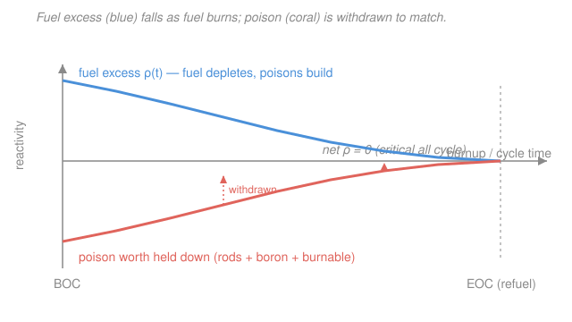

# Nuclear Fuel Cycle & Policy · Lesson 2.2: Reactivity over life & reload management

> ⏱ ~15 min · Module 2: In-Core — Fuel Management & Burnup · Builds on: [2.1 Fuel fabrication & assembly design](02-01-fuel-fabrication-assembly-design.md), [`intro-nuclear-engineering`](../../intro-nuclear-engineering/syllabus.md) (k-effective, four-factor, xenon) · Unlocks: [2.3 Burnup, depletion & the linear reactivity model](02-03-burnup-depletion-linear-reactivity-model.md)

## Why this matters

A reactor has to run for a year or two between refuelings, but its fuel is being eaten the entire time — U-235 fissions away and neutron-poisoning fission products pile up. If the core were built to be *just* critical on day one, it would go subcritical by day two and the plant would shut down. So you deliberately load a fresh core with far **more** reactivity than criticality needs — a full cycle's worth of surplus — and then spend the whole cycle holding that surplus down and letting it out at exactly the rate the fuel loses it. Get this wrong and you either can't complete a cycle (lost revenue) or you're sitting on a dangerously reactive core. Get the *reload strategy* wrong and you burn 30% less energy out of the same uranium. This lesson is the control logic of the whole in-core game.

## The idea

Picture the core's reactivity as a fuel gauge that only ever drains. Fresh fuel is a full tank of **excess reactivity**: the amount by which $k_\text{eff}$ exceeds 1 if nothing held it back. Over the cycle the tank drains — fuel depletes, and long-lived fission-product poisons (samarium, and the general junk) accumulate — until at **end-of-cycle (EOC)** the tank hits empty, $k_\text{eff}=1$ with nothing left to give. That empty point *defines* how long the cycle is.

Here's the tension: on day one the tank is full, so the core is wildly supercritical unless you push back. You can't just let it run hot — you need to keep $k_\text{eff}$ pinned at exactly 1 the entire time. So you insert an adjustable **negative reactivity** — a poison — equal to whatever surplus the fuel currently has, and you withdraw that poison at precisely the rate the fuel drains. Full tank, lots of poison. Empty tank, no poison. The net stays at zero (critical) from BOC to EOC (see the [Picture](#picture)).

You have three knobs for that poison, trading speed against uniformity:

- **Control rods** — solid neutron absorbers you mechanically drive in and out. Fast and precise, great for transients and shutdown, but a rod jammed deep in the core all cycle *distorts the power shape* (the flux tilts away from it) and wastes neutrons. So rods handle fast, local jobs, not the slow long-haul holddown.
- **Soluble boron / chemical shim** (PWRs only) — boric acid dissolved right in the coolant. It's spread perfectly **uniformly**, so it depresses reactivity everywhere without tilting the power. You adjust it *slowly* over weeks by diluting (add water) or borating. Perfect for the gradual cycle-long swing. (BWRs can't do this during operation — boron only goes in to scram — so they lean hard on the next knob.)
- **Burnable poisons** — a strong absorber (gadolinium $\ce{Gd2O3}$ mixed into some fuel pellets, or boron coatings/IFBA on the pellet surface) built right into the fuel. As it soaks up neutrons it *burns itself out*, disappearing on roughly the same schedule as the fuel depletes. It suppresses the big BOC surplus and then gets out of the way — **automatically flattening the excess-reactivity-versus-time curve** so you need far less soluble boron early.

Then there's the second big lever, which is about *where new fuel goes*, not poison: **batch reloading**. Don't dump the whole core and start over. Each cycle, replace only a fraction — $1/n$ — of the assemblies, and *shuffle* the partially-burned survivors to new positions. This flattens the power across the core and, crucially, squeezes far more total energy (burnup) out of every assembly before it's discharged.

## The formal version

**Excess reactivity.** Reactivity is the fractional distance of the core from critical:

$$\rho = \frac{k_\text{eff}-1}{k_\text{eff}}, \qquad \text{measured in pcm (percent-mille): } 1\ \text{pcm}=10^{-5},\ \ 1\%\,\Delta k = 1000\ \text{pcm}.$$

*In words: $\rho$ says how far above (or below) break-even the chain reaction is; we quote it in pcm because the numbers are tiny.* The **excess reactivity** $\rho_\text{ex}(t)$ is what the core would have with all poison removed. It starts positive at BOC and declines to zero at EOC.

**The holddown balance.** To keep the reactor exactly critical ($\rho_\text{net}=0$) at every instant, the inserted negative reactivity must cancel the fuel's surplus:

$$\rho_\text{ex}(t) \;+\; \underbrace{\rho_\text{rods} + \rho_\text{boron}(t) + \rho_\text{BP}(t)}_{\text{all negative}} \;=\; 0 .$$

*In words: fuel surplus + poison worth = 0, held true across the whole cycle by slowly pulling poison out.* At EOC every term has gone to zero together — no surplus left, no poison left to remove — and you must refuel.

**Reactivity depletion rate.** Empirically the excess falls roughly linearly with burnup $B$ (energy per unit fuel mass, in $\text{GWd/tHM}$ — gigawatt-days per tonne of heavy metal):

$$\rho_\text{ex}(B) \approx \rho_\text{BOC} - \alpha\, B, \qquad \alpha \equiv \left|\frac{d\rho}{dB}\right| \ \ \left[\tfrac{\text{pcm}}{\text{GWd/tHM}}\right].$$

*In words: every GWd/tHM you burn costs the core about $\alpha$ pcm of reactivity.* Setting $\rho_\text{ex}=0$ at the cycle-length burnup $B_c$ gives the budget rule the whole cycle must satisfy:

$$\boxed{\;\rho_\text{BOC} = \alpha\, B_c\;}$$

*In words: the fresh core's surplus must exactly equal the reactivity it will burn through in one cycle.* Burnable poison doesn't change $\rho_\text{BOC}$; it changes *who holds it down* — carrying a chunk of the surplus so soluble boron and rods don't have to.

**Soluble-boron worth.** Boron's reactivity effect is nearly linear in concentration:

$$\rho_\text{boron} = \beta_B \cdot C_B, \qquad \beta_B \approx -8\ \text{to}\ -10\ \tfrac{\text{pcm}}{\text{ppm}},$$

with $C_B$ the boron concentration in ppm (parts per million by weight). *In words: each extra ppm of boron in the coolant buys you roughly $-9$ pcm.* So "hold down $X$ pcm with boron" means dissolve $C_B = X/|\beta_B|$ ppm, then dilute toward zero as the cycle runs.

**Batch reloading & discharge burnup.** In an **$n$-batch** scheme, $1/n$ of the assemblies are fresh each cycle; an assembly stays $n$ cycles and is then discharged. The core is critical when the *average* reactivity of its $n$ batches sits at the critical threshold — which lets the older, depleted batches keep contributing past the point where they'd fail alone. The result, which we derive in [2.3](02-03-burnup-depletion-linear-reactivity-model.md), is the **linear reactivity model**:

$$B_n = \frac{2n}{n+1}\, B_1,$$

where $B_1$ is the burnup a single-batch (whole-core) reload reaches and $B_n$ is the discharge burnup of the $n$-batch scheme. *In words: splitting the reload into more batches lets each assembly burn longer before it leaves.* $B_2 = \tfrac43 B_1$, $B_3=\tfrac32 B_1$, $B_4=\tfrac85 B_1$ — rising, but with shrinking gains.

## Picture

The blue curve is the fuel's excess reactivity, draining as fuel depletes and poisons build. The coral curve is the *negative* poison worth you keep inserted — a mirror image, withdrawn steadily so that blue + coral lands on the grey zero line (critical) at every moment. Both hit zero together at EOC: the cue to refuel.

## Worked examples

**Example 1 — the reactivity budget (and what burnable poison buys).** A PWR must run a cycle of $B_c = 15\ \text{GWd/tHM}$ (core-average burnup gained in one cycle). Past the initial xenon transient, the fuel loses reactivity at $\alpha = 800\ \tfrac{\text{pcm}}{\text{GWd/tHM}}$. Differential boron worth is $\beta_B=-10\ \tfrac{\text{pcm}}{\text{ppm}}$. How much excess must the fresh core carry, and how much boron would it take if soluble boron alone held it all down — versus splitting the job with burnable poison?

The budget rule fixes the required BOC surplus:

$$\rho_\text{BOC} = \alpha\, B_c = 800 \times 15 = 12{,}000\ \text{pcm} = 12\%\,\Delta k .$$

*Boron-only.* To hold $12{,}000$ pcm with soluble boron:

$$C_B = \frac{\rho_\text{BOC}}{|\beta_B|} = \frac{12{,}000}{10} = 1{,}200\ \text{ppm at BOC},$$

diluted toward $\sim 0$ ppm by EOC. That's a lot of boron in the water — and heavily borated water makes the **moderator temperature coefficient** less negative (even positive), which is a safety problem (see [Watch out](#watch-out)).

*Split with burnable poison.* Suppose gadolinium pins are designed to carry $6{,}000$ pcm at BOC and burn out over the cycle. Then soluble boron only needs to hold the other half:

$$C_B = \frac{6{,}000}{10} = 600\ \text{ppm at BOC},$$

roughly halving the peak boron concentration and keeping the moderator coefficient safely negative. The burnable poison shoulders the early surplus and self-removes, flattening the curve — exactly the coral-versus-blue story in the [Picture](#picture). Control rods, meanwhile, are kept nearly all the way out during normal operation, held in reserve for transients and scram.

**Example 2 — why batch reloading beats a whole-core swap.** A single-batch core (fresh fuel everywhere, discharged all at once) reaches $B_1 = 18\ \text{GWd/tHM}$ before its excess runs out. Compare the discharge burnup for $n=1,2,3,4$ batches, and say where the energy gain comes from.

Apply $B_n = \tfrac{2n}{n+1}B_1$ with $B_1 = 18$:

$$B_1 = 18,\quad B_2 = \tfrac{4}{3}(18)=24,\quad B_3=\tfrac{3}{2}(18)=27,\quad B_4=\tfrac{8}{5}(18)=28.8\ \ \text{GWd/tHM}.$$

Going from a whole-core swap to a 3-batch scheme lifts discharge burnup from 18 to $27\ \text{GWd/tHM}$ — **50% more energy from the same enrichment**. Where does it come from? In a single-batch core, the *entire* core hits its reactivity floor at once, so nothing can burn past $B_1$. In a 3-batch core the fresh, reactivity-rich batch subsidizes the two older batches: the core stays critical on the *average*, so the oldest batch keeps fissioning well past $B_1$ and only leaves at $B_3=27$. More batches = more subsidy = deeper burn. The gains shrink ($18\to24\to27\to28.8$) because each added batch dilutes the fresh subsidy — and real limits (fuel-cladding integrity, enrichment cost, more frequent outages) stop you well before $n\to\infty$. We quantify all of this in [2.3](02-03-burnup-depletion-linear-reactivity-model.md).

The *shuffle* makes it work spatially: fresh assemblies and burned ones are interleaved so the power is flat, and modern PWRs use **low-leakage loading** — put the most-depleted assemblies on the core periphery (they leak neutrons, but they're low-worth anyway) and keep reactive fuel inside. That saves neutrons *and* lowers fast-neutron dose to the reactor vessel.

## Watch out

- **You might think excess reactivity is wasted or unsafe surplus.** It's neither — it's the fuel you're *going* to burn, just not yet. Every pcm of BOC excess is a pcm the fuel will lose by EOC; the poison system's only job is to meter it out. A core with no excess couldn't run a cycle at all.
- **You might think "just use more soluble boron, it's simplest."** Too much boron flips the **moderator temperature coefficient** toward positive: if a hot transient boils off moderator, you'd normally *lose* reactivity (self-correcting) — but boron-laden water means losing moderator also removes poison, adding reactivity. That's why burnable poisons exist partly as a *safety* device, not just convenience — and why BWRs, with no soluble boron in operation, rely on gadolinium.
- **You might conflate discharge burnup with average core burnup.** Discharge burnup $B_n$ is what the *oldest* assembly reaches when it leaves; the core at any instant is a mix of fresh and aged fuel, so its average burnup is lower. (For an $n$-batch scheme the EOC core-average conveniently equals $B_1$.) Utilities are paid on discharge burnup — energy extracted per unit uranium — so that's the number that drives the economics in [2.4](02-04-in-core-fuel-cycle-economics.md).

## One-liner

> A fresh core is loaded with a full cycle's excess reactivity, held down by rods, chemical shim, and self-depleting burnable poison and metered out to stay critical to EOC — while batch reloading and shuffling squeeze far more burnup from every assembly than a whole-core swap ever could.

## Problems

**P1 (🟢) — reactivity budget.** A core must complete a cycle of $B_c = 12\ \text{GWd/tHM}$, and its fuel depletes at $\alpha = 500\ \tfrac{\text{pcm}}{\text{GWd/tHM}}$. (a) What BOC excess reactivity (in pcm and in $\%\,\Delta k$) must the fresh core carry? (b) If burnable poison is designed to hold down 3,500 pcm of that at BOC, and the soluble-boron differential worth is $\beta_B = -8\ \tfrac{\text{pcm}}{\text{ppm}}$, what boron concentration (ppm) must the coolant carry at BOC to hold the *rest*?

**P2 (🟡) — batch reloading.** A single-batch core reaches $B_1 = 12\ \text{GWd/tHM}$. Using the linear reactivity model $B_n = \tfrac{2n}{n+1}B_1$: (a) find the discharge burnup for 2- and 3-batch schemes; (b) state the percentage gain in discharge burnup from going 1-batch → 3-batch; (c) give one concrete reason a utility wouldn't just keep raising $n$. *(Connects forward to [2.3](02-03-burnup-depletion-linear-reactivity-model.md) and to control-and-poisons physics in [`reactor-physics`](../../reactor-physics/syllabus.md).)*

Solutions

**P1.** (a) The budget rule $\rho_\text{BOC} = \alpha\,B_c$:

$$\rho_\text{BOC} = 500\ \tfrac{\text{pcm}}{\text{GWd/tHM}} \times 12\ \text{GWd/tHM} = 6{,}000\ \text{pcm} = 6\%\,\Delta k.$$

*Check.* Units: $\tfrac{\text{pcm}}{\text{GWd/tHM}}\times \text{GWd/tHM} = \text{pcm}$ ✓; and $6{,}000\ \text{pcm}\times \tfrac{1\%\,\Delta k}{1000\ \text{pcm}} = 6\%\,\Delta k$ ✓.

(b) Burnable poison carries 3,500 pcm, so soluble boron must hold the remainder:

$$\rho_\text{boron} = 6{,}000 - 3{,}500 = 2{,}500\ \text{pcm}, \qquad C_B = \frac{2{,}500\ \text{pcm}}{8\ \text{pcm/ppm}} = 312.5\ \text{ppm}.$$

*Check.* $312.5\ \text{ppm}\times 8\ \tfrac{\text{pcm}}{\text{ppm}} = 2{,}500\ \text{pcm}$ ✓, and $2{,}500 + 3{,}500 = 6{,}000\ \text{pcm}$ = the full BOC excess ✓. That boron is then diluted toward $\sim 0$ ppm as the cycle burns down.

**P2.** (a) With $B_1 = 12\ \text{GWd/tHM}$:

$$B_2 = \frac{2(2)}{3}\,(12) = \frac{4}{3}(12) = 16\ \text{GWd/tHM}, \qquad B_3 = \frac{2(3)}{4}\,(12) = \frac{3}{2}(12) = 18\ \text{GWd/tHM}.$$

(b) Gain from 1-batch (12) to 3-batch (18):

$$\frac{18 - 12}{12} = 0.50 = 50\%.$$

(c) Any one of: more batches need **higher enrichment** (more SWU/uranium cost) to keep the average reactivity above critical with more depleted fuel present; **more frequent** or more complex refueling and shuffle outages (lost generation); or the oldest fuel hitting **fuel/cladding burnup limits** (fission-gas release, cladding corrosion). Each caps $n$ well before the curve flattens.

*Check.* $B_2=16, B_3=18$ are increasing with shrinking steps ($+4$ then $+2$), matching the diminishing-returns shape of $\tfrac{2n}{n+1}$ ✓.

## Flashback

**From Lesson 2.1 (linear heat rate).** A reactor generates $P = 3{,}000\ \text{MW}$ of thermal power in a core of $40{,}000$ fuel rods, each with an active fuel length of $L = 3.6\ \text{m}$. Treating all the thermal power as generated in the rods, find the **average linear heat rate** $q' = P/(N\,L)$ in kW/m. If the hottest rod runs at a peaking factor of 2.4, what is its peak linear heat rate?

Solution

Average linear heat rate spreads the total power over all the rod length in the core:

$$q'_\text{avg} = \frac{P}{N\,L} = \frac{3{,}000\ \text{MW}}{40{,}000 \times 3.6\ \text{m}} = \frac{3.0\times 10^{6}\ \text{kW}}{1.44\times 10^{5}\ \text{m}} \approx 20.8\ \text{kW/m}.$$

Peak rod:

$$q'_\text{peak} = 2.4 \times 20.8 \approx 50\ \text{kW/m}.$$

*Check.* $3{,}000\ \text{MW} = 3.0\times10^{6}\ \text{kW}$; $40{,}000\times 3.6 = 1.44\times10^{5}\ \text{m}$ ✓. Both numbers are in the right ballpark for a PWR (average $\sim$17–21 kW/m; the peak-rod limit that protects the cladding is what a low-leakage, well-shuffled loading pattern exists to respect — tying this flashback straight back to the reload-management story above).

## Connections

- **Backward:** the burnable poison in this lesson is physically the gadolinium mixed into pellets and the boron coatings from [2.1](02-01-fuel-fabrication-assembly-design.md); the fission-gas plenum and cladding limits from 2.1 are exactly what cap the discharge burnup you're trying to raise. The very idea of $k_\text{eff}$, the four-factor formula, and xenon/samarium poisoning come from [`intro-nuclear-engineering`](../../intro-nuclear-engineering/syllabus.md).
- **Forward:** [2.3](02-03-burnup-depletion-linear-reactivity-model.md) derives $B_n=\tfrac{2n}{n+1}B_1$ from first principles and tracks plutonium buildup; [2.4](02-04-in-core-fuel-cycle-economics.md) turns "higher burnup, more batches" into dollars — the enrichment-versus-burnup optimum.
- **Sideways:** control rods, soluble-boron shim, moderator temperature coefficient, and xenon transients are the heart of [`reactor-physics`](../../reactor-physics/syllabus.md)'s control-and-poisons module — this lesson is the fuel-cycle-management view of the same machinery that course treats as reactor kinetics and control.
