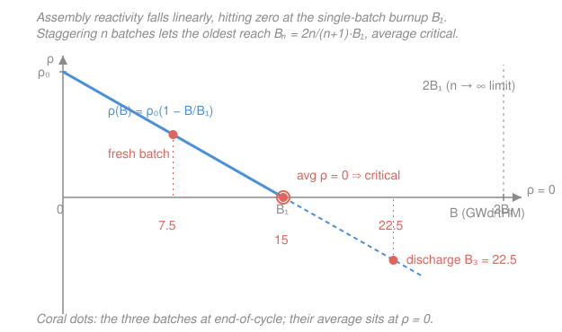

# Nuclear Fuel Cycle & Policy · Lesson 2.3: Burnup, depletion & the linear reactivity model

> ⏱ ~15 min · Module 2: In-Core — Fuel Management & Burnup · Builds on: [2.2 Reactivity over life & reload management](02-02-reactivity-over-life-reload-management.md), [`reactor-physics` syllabus](../../reactor-physics/syllabus.md) (burnup), [`intro-nuclear-engineering` 3.4 four-factor formula](../../intro-nuclear-engineering/lessons/03-04-criticality-four-factor-formula.md) · Unlocks: [2.4 In-core fuel-cycle economics](02-04-in-core-fuel-cycle-economics.md)

## Why this matters

Every dollar of enriched uranium you load wants to give back as much energy as possible before it comes out too depleted to sustain the chain reaction. **How much energy a tonne of fuel yields before discharge** — its burnup — is the single number that sets how often you refuel, how much waste you make, and how expensive your electricity is. The clever part is that you can squeeze far more out of the *same* fuel just by staggering how you reload it: split the core into more batches and the discharge burnup climbs toward twice what a single load could reach. This lesson gives you a one-line model that predicts that number, so in [2.4](02-04-in-core-fuel-cycle-economics.md) you can put a price on it.

## The idea

Picture a fresh fuel assembly as a battery of reactivity. When it's new it has *excess* reactivity — more neutron-multiplying power than the core needs, held back by control from [2.2](02-02-reactivity-over-life-reload-management.md). As it burns, three things eat that reactivity away: the fissile U-235 gets consumed, neutron-absorbing fission products pile up, and even the plutonium that breeds in can't quite keep pace. Track the assembly's reactivity against how much energy it has produced and you get, to a very good approximation, **a straight line sloping down** — full at the start, dead at some burnup $B_1$.

Now the trick. If you ran a whole core as one batch, you'd have to pull it the instant its reactivity hit zero — at burnup $B_1$. But a reactor doesn't need *every* assembly to be critical; it needs the *core average* to be critical. So load a mix: some fresh, some half-spent, some nearly dead. The fresh ones carry the tired ones. The oldest batch can be pushed well *past* $B_1$ into negative reactivity, because the fresh batches make up the difference. Averaging staggered assemblies is what lets you burn each one deeper — and the more batches you juggle, the deeper the oldest gets to go, up to a hard ceiling of $2B_1$.

## The formal version

**Burnup.** The **burnup** $B$ of fuel is the thermal energy it has released per unit mass of heavy metal (uranium + plutonium + heavier actinides) it started with:

$$B = \frac{\text{thermal energy produced}}{\text{initial heavy-metal mass}}, \qquad [B] = \frac{\text{GW}\cdot\text{d}}{\text{tHM}} = \text{GWd/tHM}.$$

*In words: burnup is miles-per-gallon run backwards — energy squeezed out per tonne of fuel loaded.* A useful rule of thumb, since fissioning one gram of a fissile nuclide releases roughly one megawatt-day of heat:

$$1\ \text{GWd/tHM} \;\approx\; \text{fissioning } 1\ \text{kg of fissile material per tonne of heavy metal.}$$

So a modern PWR discharge of $\sim 50\ \text{GWd/tHM}$ has fissioned on the order of 50 kg of fissile per tonne loaded (out of $\sim 45\text{–}50$ kg of U-235 in a tonne enriched to $4.5\text{–}5\%$ — plus bred plutonium, which is why the total can exceed the initial U-235).

**Depletion.** As burnup accumulates the fuel's composition marches:

- **Fissile U-235 burns down** (fission and radiative capture both destroy it).
- **Fission products build up**, some of them strong absorbers (Xe-135, Sm-149, and the slowly-accumulating rare earths) — reactivity poisons.
- **Plutonium breeds in** from U-238: $\ce{^{238}U ->[(n,\gamma)] ^{239}U ->[\beta^-] ^{239}Np ->[\beta^-] ^{239}Pu}$, and Pu-239 either fissions (giving energy) or captures on toward Pu-240, Pu-241, Pu-242.

The **conversion ratio** measures how well breeding offsets the loss:

$$\mathrm{CR} = \frac{\text{rate of new fissile produced}}{\text{rate of fissile destroyed}}.$$

*In words: CR is the fraction of the fissile you burn that gets replaced for free by plutonium bred from U-238.* A typical LWR has $\mathrm{CR} \approx 0.5\text{–}0.6$ — about half the consumed fissile is regenerated. That contribution grows over life: by discharge, plutonium fission supplies on the order of a **third of the total power** (near end-of-life it can be $\sim 40\%$ of all fissions). Breeding is what makes the reactivity decline *linear-ish* rather than a steep exponential.

**The linear reactivity model (LRM).** Bundle all of that into one assumption: an assembly's reactivity falls **linearly** with its own burnup,

$$\rho(B) = \rho_0\left(1 - \frac{B}{B_1}\right),$$

where $\rho_0$ is the fresh-fuel reactivity and $B_1$ is the burnup at which reactivity reaches zero — the **single-batch discharge burnup**. *In words: a fresh assembly starts at $\rho_0$ and loses reactivity at a constant rate, running dry exactly at $B_1$.*

Now build an **$n$-batch equilibrium core**: $n$ batches sharing the core, each one cycle older than the next, each gaining the same burnup increment $B_c$ per cycle. At **end of cycle (EOC)** — the moment just before the oldest batch is pulled — the batch burnups are

$$B_c,\ 2B_c,\ 3B_c,\ \dots,\ nB_c.$$

The oldest sits at the **discharge burnup** $B_n = nB_c$. The reactor is critical (with all excess reactivity used up at EOC) when the **batch-averaged reactivity is zero**:

$$\bar\rho = \frac{1}{n}\sum_{i=1}^{n}\rho(iB_c) = 0.$$

Because $\rho$ is *linear* in $B$, the average reactivity equals the reactivity at the average burnup — a fact we can exploit directly. The average burnup at EOC is

$$\bar B = \frac{1}{n}\sum_{i=1}^{n} iB_c = \frac{B_c}{n}\cdot\frac{n(n+1)}{2} = \frac{(n+1)}{2}B_c.$$

Set $\bar\rho = \rho_0(1-\bar B/B_1) = 0$, which forces $\bar B = B_1$:

$$\frac{(n+1)}{2}B_c = B_1 \quad\Longrightarrow\quad B_c = \frac{2B_1}{n+1}.$$

The discharge burnup is $B_n = nB_c$:

$$\boxed{\,B_n = \frac{2n}{n+1}\,B_1\,}$$

*In words: split the core into $n$ batches and you can burn each one to $\tfrac{2n}{n+1}$ times the single-batch limit.* As $n\to\infty$, $B_n \to 2B_1$ — you never get more than **double** the single-batch burnup, no matter how many batches. And the **average core burnup at EOC** is pinned at the single-batch value:

$$\bar B = \frac{n+1}{2n}\,B_n = B_1,$$

which just restates the criticality condition: whatever $n$ you choose, the *average* assembly is right at its reactivity-zero point $B_1$ at EOC, while the *oldest* has been pushed out to $B_n$.

## Picture

The blue line is one assembly's reactivity dying at $B_1$. The three coral dots are the batches of a 3-batch core at EOC ($7.5,\,15,\,22.5$ GWd/tHM for $B_1=15$): they lie on the line, so their **average reactivity equals the reactivity at their average burnup** $=B_1$, which is zero — the core is exactly critical while its oldest batch has been driven out to $B_3=22.5$.

## Worked examples

**Example 1 (the boss shape — batches to burnup).** A single-batch core would run to $B_1 = 15\ \text{GWd/tHM}$. Find the equilibrium discharge burnup for 2-, 3-, and 4-batch reload, and the average core burnup at EOC for the 3-batch case.

Straight from $B_n = \tfrac{2n}{n+1}B_1$:

$$B_2 = \frac{2\cdot 2}{3}\,(15) = \frac{4}{3}(15) = 20\ \text{GWd/tHM},$$
$$B_3 = \frac{2\cdot 3}{4}\,(15) = \frac{3}{2}(15) = 22.5\ \text{GWd/tHM},$$
$$B_4 = \frac{2\cdot 4}{5}\,(15) = \frac{8}{5}(15) = 24\ \text{GWd/tHM}.$$

Each extra batch buys less: $+5$, then $+2.5$, then $+1.5$ — diminishing returns as we crawl toward the $2B_1 = 30$ ceiling. For the 3-batch average core burnup, use $\bar B = \tfrac{n+1}{2n}B_n$:

$$\bar B = \frac{4}{6}\,(22.5) = \frac{2}{3}(22.5) = 15\ \text{GWd/tHM} = B_1.\ \checkmark$$

*Check.* Directly average the EOC burnups: $B_c = 2B_1/(n+1) = 30/4 = 7.5$, batches at $7.5,\,15,\,22.5$, mean $=45/3 = 15$. ✓ Exactly $B_1$, as the criticality condition demands.

**Example 2 (why you can't just crank $n$ — two real ceilings).** The formula says burnup keeps rising with $n$, so why do utilities stop around 3–4 batches and $\sim 50\text{–}60\ \text{GWd/tHM}$? Two hard limits, quantitatively:

1. **Materials damage in the cladding and fuel.** Sitting in the core longer means soaking up more fast-neutron fluence and more corrosion. Zircaloy cladding grows a thickening oxide layer and absorbs hydrogen (hydriding) that embrittles it, while fission gas released from the pellet climbs from a few percent at $30\ \text{GWd/tHM}$ to well over $10\%$ past $60\ \text{GWd/tHM}$, pressurizing the rod's plenum toward the $\sim 15.5\ \text{MPa}$ coolant pressure and threatening to balloon the clad. The US NRC has historically licensed rod-average burnup only to about $62\ \text{GWd/tHM}$ for exactly these reasons — a *material* wall, not a physics one.

2. **Enrichment cost and the $5\%$ cap.** Reaching higher $B_n$ needs a higher $\rho_0$, i.e. more initial fissile — roughly, discharge burnup scales with enrichment (about $4\%$ U-235 supports $\sim 40\ \text{GWd/tHM}$, $5\%$ supports $\sim 50\text{–}55$). But the separative work to enrich (Lesson [1.4](01-04-centrifuge-separative-work.md)) climbs steeply near $5\%$, and standard fuel fabrication, transport, and licensing are capped at $5\%$ enrichment. So you hit an enrichment ceiling before the burnup ceiling — and each extra batch (from the $2B_1$ asymptote) yields ever *less* burnup while forcing fuel to sit in-core longer, piling up carrying charges we'll price in [2.4](02-04-in-core-fuel-cycle-economics.md).

*Both push the same way:* the LRM's promised march to $2B_1$ is real in principle but gets clipped by metal and money long before you approach it.

## Watch out

- **You might think discharge burnup and average core burnup are the same number — they're not.** The *discharge* burnup $B_n$ is what the *oldest* batch reaches; the *average* core burnup at EOC is only $\tfrac{n+1}{2n}B_n = B_1$. For a 3-batch core the discharged fuel is at $22.5$ but the average assembly is at $15$. Quote the wrong one and your waste and economics numbers are off by up to $2\times$.
- **You might expect more batches to keep paying off.** $B_n \to 2B_1$ asymptotically — going from 1 to 2 batches gains you $33\%$, but 4 to 5 gains under $7\%$. There is no "many-batch" bonanza; the ceiling is firmly double.
- **You might think a discharged assembly is spent because it "ran out of uranium."** It hasn't — a $50\ \text{GWd/tHM}$ PWR discharge still holds roughly $0.8\%$ U-235 (above natural!) plus about $1\%$ plutonium. It's pulled because its *reactivity* went negative, not because the fissile is gone — which is the entire premise of reprocessing (Module 3).

## One-liner

> Assembly reactivity falls linearly to zero at $B_1$, so an $n$-batch core — critical when its batch-average sits at $B_1$ — can drive its oldest batch out to $B_n=\tfrac{2n}{n+1}B_1$, approaching but never beating $2B_1$.

## Problems

**P1 (🟢)** A single-batch core reaches $B_1 = 24\ \text{GWd/tHM}$. Under the linear reactivity model, what discharge burnup does a 3-batch reload scheme achieve, and by how much does moving from 2 batches to 3 batches raise the discharge burnup?

**P2 (🟡)** A utility wants an equilibrium *discharge* burnup of $B_n = 45\ \text{GWd/tHM}$ using a 3-batch scheme. (a) What single-batch burnup $B_1$ (equivalently, what fresh-fuel reactivity level) must the fuel be designed for? (b) What is the burnup increment $B_c$ added per cycle, and what is the average core burnup at EOC? (c) In one sentence, connect $B_1$ to the enrichment the fuel needs.

**P3 (🔴)** Show from the LRM that the *fractional* gain in discharge burnup from adding one batch, $\dfrac{B_{n+1}-B_n}{B_n}$, equals $\dfrac{1}{(n+1)(n+2)}$·(something you can simplify), and evaluate it for the step $n=3\to 4$. Use it to argue why utilities rarely go past 3–4 batches.

Solutions

**P1** With $B_1 = 24$:

$$B_3 = \frac{2\cdot 3}{3+1}B_1 = \frac{6}{4}(24) = 1.5\times 24 = 36\ \text{GWd/tHM}.$$
$$B_2 = \frac{2\cdot 2}{2+1}B_1 = \frac{4}{3}(24) = 32\ \text{GWd/tHM}.$$

Moving from 2 to 3 batches raises discharge burnup by $36 - 32 = 4\ \text{GWd/tHM}$ (a $12.5\%$ gain).

*Check.* Both lie below the $2B_1 = 48$ ceiling, and the 2→3 gain ($4$) is smaller than the 1→2 gain ($32-24=8$), as diminishing returns require. ✓

**P2** (a) Invert $B_n = \tfrac{2n}{n+1}B_1$ for $n=3$: $B_3 = \tfrac{3}{2}B_1$, so

$$B_1 = \frac{2}{3}B_3 = \frac{2}{3}(45) = 30\ \text{GWd/tHM}.$$

The fuel must be designed so a *single* load would run to $30\ \text{GWd/tHM}$ — i.e. it needs enough fresh-fuel reactivity $\rho_0$ that reactivity crosses zero only at $B=30$.

(b) Burnup per cycle: $B_c = \dfrac{2B_1}{n+1} = \dfrac{2(30)}{4} = 15\ \text{GWd/tHM}$ (equivalently $B_c = B_3/n = 45/3 = 15$). Average core burnup at EOC $= B_1 = 30\ \text{GWd/tHM}$ (or $\tfrac{n+1}{2n}B_3 = \tfrac{4}{6}(45)=30$). ✓

(c) A higher $B_1$ means a higher fresh-fuel reactivity $\rho_0$, which means more initial U-235 — so a $30\ \text{GWd/tHM}$ single-batch design needs a healthy enrichment (roughly $\sim 3.5\%$ by the "$4\% \Rightarrow 40\ \text{GWd/tHM}$" rule of thumb), and pushing $B_n$ higher pushes enrichment (and SWU from [1.4](01-04-centrifuge-separative-work.md)) up with it.

*Check.* Rebuild forward: $B_1=30$, 3 batches → $B_3 = 1.5(30) = 45$. ✓ Average $=30=B_1$. ✓

**P3** From $B_n = \tfrac{2n}{n+1}B_1$:

$$\frac{B_{n+1}-B_n}{B_n} = \frac{\tfrac{2(n+1)}{n+2}B_1 - \tfrac{2n}{n+1}B_1}{\tfrac{2n}{n+1}B_1} = \frac{\tfrac{n+1}{n+2} - \tfrac{n}{n+1}}{\tfrac{n}{n+1}}.$$

Combine the numerator over $(n+2)(n+1)$:

$$\frac{n+1}{n+2}-\frac{n}{n+1} = \frac{(n+1)^2 - n(n+2)}{(n+2)(n+1)} = \frac{n^2+2n+1 - n^2-2n}{(n+2)(n+1)} = \frac{1}{(n+2)(n+1)}.$$

Divide by $\tfrac{n}{n+1}$:

$$\frac{B_{n+1}-B_n}{B_n} = \frac{1}{(n+2)(n+1)}\cdot\frac{n+1}{n} = \frac{1}{n(n+2)}.$$

For $n=3\to 4$: $\dfrac{1}{3(5)} = \dfrac{1}{15} \approx 6.7\%$.

The fractional gain shrinks like $1/[n(n+2)]$ — quadratically. By $n=4$ each new batch adds under $7\%$ burnup, while the fuel must sit an extra fraction of a cycle in the core accruing carrying charges and material damage. Physics keeps offering more (up to $2B_1$), but the marginal burnup gets too small to justify the enrichment, dwell time, and cladding risk — so 3–4 batches is the sweet spot.

*Check.* Sum sense: for $n=1\to2$, $\tfrac{1}{1\cdot3}=33\%$; $2\to3$, $\tfrac{1}{2\cdot4}=12.5\%$; $3\to4$, $6.7\%$ — matching the absolute gains in Example 1 ($20,22.5,24$ from $B_1=15$: $+33\%,+12.5\%,+6.7\%$). ✓

## Flashback

**From Lesson 2.2 (reactivity budget & control):** A PWR begins its cycle with a fresh reload holding excess reactivity that soluble boron in the coolant holds down. The boron concentration is $1200\ \text{ppm}$ at beginning-of-cycle and its differential worth is $-7\ \text{pcm/ppm}$ (recall $1\ \text{pcm} = 10^{-5}$ in reactivity). (a) How much positive excess reactivity is the boron suppressing at BOC? (b) In one sentence, why must operators dilute the boron toward zero by end-of-cycle?

Solution

(a) The boron is holding down a positive excess equal in magnitude to the boron's total negative worth:

$$|\rho_{\text{boron}}| = 1200\ \text{ppm} \times 7\ \frac{\text{pcm}}{\text{ppm}} = 8400\ \text{pcm} = 8400\times 10^{-5} = 0.084 = 8.4\%\ \Delta k/k.$$

So the fresh core carries about $8.4\%$ excess reactivity at BOC, exactly cancelled by boron so the core sits at $k=1$.

(b) As fuel burns, its reactivity falls (the LRM line of this lesson), so to keep the core just critical operators must *remove* negative reactivity at the same rate — diluting the boron out — until, near EOC, essentially all the boron is gone and there is no more excess left to trade against, which defines the cycle's end.

*Check.* $8.4\%$ is a sensible fresh-cycle boron letdown worth, and the picture is consistent: boron worth (down) exactly tracks fuel reactivity (down) so their sum stays critical. ✓

## Connections

- **Backward:** the linear decline started in [2.2](02-02-reactivity-over-life-reload-management.md) as excess reactivity being burned off across a cycle; here we turn that curve into a formula for how deep each batch gets to go. The fresh-fuel reactivity $\rho_0$ traces back to the four factors of [`intro-nuclear-engineering` 3.4](../../intro-nuclear-engineering/lessons/03-04-criticality-four-factor-formula.md) — enrichment sets $\eta$, and burnup erodes it.
- **Forward:** [2.4 In-core fuel-cycle economics](02-04-in-core-fuel-cycle-economics.md) puts money on this — higher burnup spreads fixed fabrication and enrichment cost over more energy (cheaper per MWh) but demands more enrichment and longer dwell (carrying charges), and the optimum is where those cross.
- **Sideways (reactor physics):** burnup and depletion are the time-dependent face of the criticality math in the [`reactor-physics` syllabus](../../reactor-physics/syllabus.md); the same fuel-composition tracking (fission products, actinide chains) becomes the spent-fuel *source term* — decay heat and radiotoxicity — in Module 3 ([3.1](03-01-decay-heat-source-term.md), [3.2](03-02-spent-fuel-isotopics-radiotoxicity.md)), and the bred plutonium here is the feedstock for reprocessing and MOX ([3.5](03-05-recycling-mox-plutonium-balance.md)).
