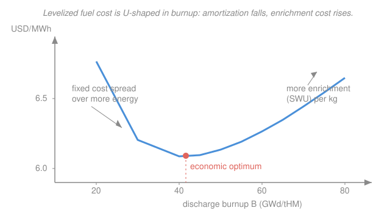

# Nuclear Fuel Cycle & Policy · Lesson 2.4: In-core fuel-cycle economics

> ⏱ ~15 min · Module 2: In-Core — Fuel Management & Burnup · Builds on: [2.3 Burnup, depletion & the linear reactivity model](02-03-burnup-depletion-linear-reactivity-model.md), [1.5 The enrichment cascade & front-end cost](01-05-enrichment-cascade-front-end-cost.md) · Unlocks: Module 3 ([3.1 Decay heat](03-01-decay-heat-source-term.md)) and [4.4 Nuclear economics & LCOE](04-04-nuclear-economics-lcoe.md)

## Why this matters

You have spent five lessons buying uranium, converting it, enriching it, and fabricating it into fuel — a pile of costs. Now the fuel earns its keep by making energy. The only number a utility cares about is the ratio: **dollars spent per megawatt-hour produced**. That single figure decides how hard to enrich, how long to leave fuel in the core, and — surprisingly — it will turn out to be a *small* slice of what a nuclear kilowatt-hour actually costs. This lesson closes the in-core module by turning burnup into money, and it sets up the punchline of the whole course: nuclear is a capital business wearing a fuel-cycle costume.

## The idea

A fuel batch is a lump of money you pay *up front* — mostly before it ever enters the reactor — that then dribbles out energy over the next several years. To compare it fairly against other costs, you spread that lump over all the energy the batch will ever make. That spread-out number is the **levelized fuel cost**: total batch cost divided by total energy, in dollars per MWh.

Two forces fight inside that ratio, and the fight has a winner-take-nothing middle.

- **Push burnup up** and each kilogram of fuel makes more energy, so the fixed costs of that kilogram — fabrication, and the money you tied up buying it — get amortized over more MWh. That *lowers* dollars per MWh.
- **But higher burnup needs higher enrichment** (you learned in [2.3](02-03-burnup-depletion-linear-reactivity-model.md) that reactivity must last longer), and enrichment costs separative work, which climbs *faster than* the energy you get back. That *raises* dollars per MWh.

Falling on one side, rising on the other — so the levelized fuel cost is **U-shaped** in burnup, and somewhere in the middle sits an economic optimum. That U is the whole lesson.

One more ingredient makes fuel special: **you pay years before you get paid.** A batch is fabricated and loaded, then sits in the core for three to five years before the last of its energy is sold. The money spent has a time value — call it rent on capital — and that rent is the **carrying charge**.

## The formal version

**Energy a batch produces.** A discharge burnup $B$ (in $\text{GWd/tHM}$ — gigawatt-days of *thermal* energy per tonne of heavy metal) converts to electrical energy per kilogram of fuel through unit conversions and the plant's thermal efficiency $\eta$ (electrical out over thermal in, typically about $0.33$):

$$E = B \times 24{,}000\,\tfrac{\text{MWh}_{\text{th}}}{\text{GWd}\cdot\text{tHM}^{-1}} \times \tfrac{1}{1000}\,\tfrac{\text{tHM}}{\text{kg}} \times \eta \;=\; 24\,\eta\,B \quad \left[\tfrac{\text{MWh}_e}{\text{kg}}\right].$$

*In words: one GWd is $24{,}000$ thermal MWh; scale to a kilogram and multiply by efficiency to get salable electrical MWh per kg.* With $\eta = 0.33$, $E \approx 7.92\,B$ electrical MWh per kg.

**Front-end batch cost.** From [1.5](01-05-enrichment-cascade-front-end-cost.md), the cost to put one kilogram of enriched fuel on the loading floor is the sum of four line items:

$$C_{\text{fe}} = \underbrace{F\,(p_U + p_{\text{conv}})}_{\text{uranium + conversion}} + \underbrace{S\,p_{\text{SWU}}}_{\text{enrichment}} + \underbrace{p_{\text{fab}}}_{\text{fabrication}} \quad \left[\tfrac{\text{USD}}{\text{kg}}\right],$$

where $F$ is the natural-uranium feed per kg of product, $S$ is the separative work per kg (from the value function $V(x)=(2x-1)\ln\frac{x}{1-x}$), and the $p$'s are the unit prices (dollars per kg U, per SWU, per kg fabricated). *In words: feed and conversion scale with how much natural uranium you buy; the SWU term scales with how hard you enrich; fabrication is a flat charge per kilogram.*

**Carrying charge.** The batch is paid for at loading but earns revenue on average a time $\bar t$ later (roughly mid-residence plus fabrication lead time, so $\bar t \approx 3$ years for a typical reload). Financing that money at annual rate $r$ inflates the effective cost by a **carrying-charge factor**:

$$\phi = (1+r)^{\bar t} \;\approx\; 1 + r\,\bar t.$$

*In words: money tied up in fuel for $\bar t$ years must earn its keep too, so multiply the front-end cost by roughly $1 + r\bar t$.* At $r = 8\%$ and $\bar t = 3$ years, $\phi \approx 1.24$ — carrying charges add about a quarter to the fuel bill.

**Levelized fuel cost.** Divide the carrying-charge-inflated cost by the energy the batch makes:

$$\boxed{\,c_{\text{fuel}} = \dfrac{\phi\,C_{\text{fe}}}{E} = \dfrac{\phi\,C_{\text{fe}}}{24\,\eta\,B}\,} \quad \left[\tfrac{\text{USD}}{\text{MWh}}\right].$$

*In words: total money in, divided by total energy out — the price tag on a fuel-supplied megawatt-hour.* The numerator rises with enrichment (hence with $B$); the denominator rises linearly with $B$. Because the required enrichment climbs faster than linearly at high burnup, $c_{\text{fuel}}(B)$ falls, bottoms out, then rises — the U-shape.

## Picture

## Worked examples

**Example 1 (levelized fuel cost of one batch).** Price a batch enriched to $4.5\%$ from natural feed ($0.711\%$) at a tails assay of $0.25\%$, run to a discharge burnup of $B = 50\,\text{GWd/tHM}$. Unit prices: uranium $130$ dollars/kgU, conversion $15$ dollars/kgU, enrichment $100$ dollars/SWU, fabrication $300$ dollars/kg. Efficiency $\eta = 0.33$; financing $r = 8\%$, $\bar t = 3$ yr.

*Feed and SWU per kg* (the [1.5](01-05-enrichment-cascade-front-end-cost.md) machinery). Feed mass:

$$F = \frac{x_p - x_w}{x_f - x_w} = \frac{0.045 - 0.0025}{0.00711 - 0.0025} = \frac{0.0425}{0.00461} = 9.22\ \text{kgU/kg}.$$

Value function at each assay ($V(x)=(2x-1)\ln\frac{x}{1-x}$): $V(0.045)=2.780$, $V(0.0025)=5.959$, $V(0.00711)=4.869$. Then

$$S = V(x_p) + (F-1)V(x_w) - F\,V(x_f) = 2.780 + 8.22(5.959) - 9.22(4.869) = 6.87\ \text{SWU/kg}.$$

*Front-end cost per kg:*

$$C_{\text{fe}} = \underbrace{9.22(130+15)}_{1337} + \underbrace{6.87(100)}_{687} + \underbrace{300}_{\text{fab}} = 2324\ \text{dollars/kg}.$$

*Energy per kg:* $E = 24\,\eta\,B = 24(0.33)(50) = 396\ \text{MWh}_e/\text{kg}.$

*Carrying charge:* $\phi = 1 + r\bar t = 1 + 0.08(3) = 1.24$ (compounding exactly gives $1.08^3 = 1.26$ — same story).

*Levelized fuel cost:*

$$c_{\text{fuel}} = \frac{\phi\,C_{\text{fe}}}{E} = \frac{1.24 \times 2324}{396} = \frac{2882}{396} \approx 7.3\ \text{dollars/MWh}.$$

So this fuel supplies electricity for about $7$ dollars per MWh — of which the bare front end is $2324/396 \approx 5.9$ dollars/MWh and carrying charges add the rest. Hold onto that $7$; the last line of the lesson shows how small it is.

**Example 2 (the higher-burnup tradeoff has an optimum).** Now show the U directly. Take three burnup targets, each needing the enrichment that keeps it critical to discharge (a convex rule, since reactivity gets harder to buy at high burnup): $B = 30$ needs $2.86\%$, $B = 45$ needs $4.21\%$, $B = 65$ needs $6.29\%$. Same prices as Example 1; compare the *front-end* levelized cost $C_{\text{fe}}/E$ (carrying charges scale all three by the same $\phi$, so they don't change the shape).

Running the [1.5](01-05-enrichment-cascade-front-end-cost.md) cost machinery at each enrichment (feed $F$, SWU $S$, then $C_{\text{fe}}$), and $E = 7.92\,B$:

| $B$ (GWd/tHM) | enrichment | $C_{\text{fe}}$ (USD/kg) | $E$ (MWh$_e$/kg) | $c = C_{\text{fe}}/E$ |
|---|---|---|---|---|
| 30 | $2.86\%$ | 1475 | 238 | **6.21** dollars/MWh |
| 45 | $4.21\%$ | 2172 | 356 | **6.10** dollars/MWh |
| 65 | $6.29\%$ | 3268 | 515 | **6.35** dollars/MWh |

Read the middle column: it is **not monotone.** Going $30 \to 45\,\text{GWd/tHM}$, cost *falls* (fabrication and other fixed costs get amortized over 50% more energy — amortization wins). Going $45 \to 65$, cost *rises* (enrichment costs balloon — feed and SWU nearly double while energy grows only $45\%$; enrichment wins). The minimum sits near $45\,\text{GWd/tHM}$ — the bottom of the U in the Picture. That optimum shifts with prices: cheaper SWU or pricier uranium pushes it to higher burnup; the reverse pulls it back.

## Watch out

- **You might think higher burnup always saves money** because you "use the fuel more fully." It saves money only up to the optimum — past it, the extra enrichment you must buy costs more than the extra energy is worth, and dollars per MWh climbs back up. There is a *right* burnup, not a maximum one.
- **You might think fuel cost is a big lever on the electricity price.** It isn't. That $7$ dollars/MWh sits next to a *capital* charge of roughly $75$–$80$ dollars/MWh for a new plant (financing the reactor itself), so fuel is under $10\%$ of the nuclear busbar cost — [4.4](04-04-nuclear-economics-lcoe.md) makes this quantitative. A fuel-cycle change that halves fuel cost moves the busbar price by a few percent; a two-point rise in the discount rate hurts far more, because it hits the capital mountain, not the fuel molehill.
- **You might forget the carrying charge and just divide cost by energy.** Fuel is a multi-year investment paid before it earns — ignoring the time value of that tied-up money understates the true fuel cost by 20–30%. It is the same discounting that prices a bond ([calc-refresher 2.3](../../calc-refresher/lessons/02-03-improper-integrals-and-models.md)'s perpetuity), applied to a lump you spend early and recover late.

## One-liner

> Levelized fuel cost is the front-end batch cost — grossed up for the years your money sits in the core — spread over the energy the batch makes, and it bottoms out at the burnup where amortization stops beating enrichment.

## Problems

**P1 (🟢)** A fuel batch costs $2{,}000$ dollars per kg on the loading floor and reaches a discharge burnup of $B = 45\,\text{GWd/tHM}$ in a plant with thermal efficiency $\eta = 0.33$. Ignoring carrying charges, what is the levelized fuel cost in dollars per MWh?

**P2 (🟡)** Take the batch from P1. It is paid for at loading but earns its revenue on average $\bar t = 3.5$ years later; the utility finances at $r = 9\%$ per year. Using the simple-interest carrying-charge factor $\phi = 1 + r\bar t$, find the levelized fuel cost including carrying charges. By what percentage did the carrying charge raise the number?

**P3 (🔴, optional)** Two enrichment strategies deliver the *same* discharge burnup $B = 50\,\text{GWd/tHM}$ and thus need the same energy-per-kg, but a supplier offers a lower tails assay that cuts the SWU per kg from $7.3$ to $6.9$ while raising feed per kg from $9.2$ to $10.1$ kgU. With uranium+conversion at $145$ dollars/kgU and enrichment at $100$ dollars/SWU (fabrication unchanged), does the lower tails assay lower the *front-end* levelized fuel cost? Give the change in $C_{\text{fe}}$ in dollars per kg and say which way the levelized cost moves.

Solutions

**P1** Energy per kg: $E = 24\,\eta\,B = 24 \times 0.33 \times 45 = 356.4\ \text{MWh}_e/\text{kg}.$ Then

$$c_{\text{fuel}} = \frac{C_{\text{fe}}}{E} = \frac{2000}{356.4} \approx 5.6\ \text{dollars/MWh}.$$

*Check.* Units: $(\text{USD}/\text{kg})/(\text{MWh}/\text{kg}) = \text{USD}/\text{MWh}$ ✓. The value sits in the realistic 5–7 dollars/MWh band for LWR fuel. ✓

**P2** Carrying-charge factor $\phi = 1 + r\bar t = 1 + 0.09(3.5) = 1 + 0.315 = 1.315.$ Levelized cost:

$$c_{\text{fuel}} = \frac{\phi\,C_{\text{fe}}}{E} = \frac{1.315 \times 2000}{356.4} = \frac{2630}{356.4} \approx 7.4\ \text{dollars/MWh}.$$

The carrying charge raised the cost by exactly the factor $\phi - 1 = 0.315$, i.e. **31.5%** — from about $5.6$ to about $7.4$ dollars/MWh. *Lesson: at high discount rates and long residence, the time value of tied-up fuel money is a third of the fuel bill, not a rounding error.*

**P3** Only two line items change (fabrication and energy are fixed). Compute each cost before and after.

*Before:* feed $9.2 \times 145 = 1334$; SWU $7.3 \times 100 = 730$; sum of the two $= 2064$ dollars/kg.

*After:* feed $10.1 \times 145 = 1464.5$; SWU $6.9 \times 100 = 690$; sum $= 2154.5$ dollars/kg.

$$\Delta C_{\text{fe}} = 2154.5 - 2064 = +90.5\ \text{dollars/kg}.$$

The front-end cost *rises* by about $90$ dollars per kg: the $130.5$-dollar jump in uranium+conversion outweighs the $40$-dollar SWU saving. Since $E$ is unchanged, the levelized fuel cost **rises** — this lower tails assay is a bad trade at these prices (uranium is relatively expensive to buy back what little SWU it saves). *This is the [1.5](01-05-enrichment-cascade-front-end-cost.md) tails-assay optimum showing up as money: the best tails assay balances feed price against SWU price, and here we pushed past it.*

## Flashback

**From Lesson 2.3 (Linear reactivity model):** A fresh single-batch core would reach a discharge burnup of $B_1 = 18\,\text{GWd/tHM}$ before running out of reactivity. Under the linear reactivity model $B_n = \frac{2n}{n+1}B_1$, find the equilibrium discharge burnup for a **3-batch** reload scheme, and say in one sentence why a utility chasing lower fuel cost prefers the 3-batch scheme over single-batch.

Solution

With $n = 3$:

$$B_3 = \frac{2(3)}{3+1}B_1 = \frac{6}{4}(18) = 1.5 \times 18 = 27\ \text{GWd/tHM}.$$

The 3-batch scheme squeezes $27$ GWd/tHM out of each tonne versus $18$ for single-batch — **50% more energy per kilogram of fuel from the same enrichment**, which spreads the fabrication and carrying costs over more MWh and drops the levelized fuel cost (exactly the amortization effect that forms the left, falling branch of this lesson's U-curve).

*Check.* $\frac{2n}{n+1}$ increases with $n$ ($1 \to 1.33 \to 1.5 \to 1.6$ for $n = 1,2,3,4$), so more batches always means higher discharge burnup — consistent with 2.3. ✓

## Connections

- **Backward:** the numerator of $c_{\text{fuel}}$ is the front-end batch cost assembled in [1.5](01-05-enrichment-cascade-front-end-cost.md) (feed, SWU, fabrication), and the denominator is the discharge burnup predicted by the linear reactivity model in [2.3](02-03-burnup-depletion-linear-reactivity-model.md). This lesson is those two halves multiplied into a price.
- **Forward:** [4.4 Nuclear economics & LCOE](04-04-nuclear-economics-lcoe.md) drops this $7$-dollars/MWh fuel term into the full busbar cost and shows capital dominating — the "fuel is a small slice" claim, made quantitative. And Module 3 ([3.1](03-01-decay-heat-source-term.md) onward) prices the *back* end: higher burnup means hotter, more radiotoxic spent fuel, adding disposal costs the front-end optimum here ignored.
- **Sideways (economics):** the carrying charge *is* discounting — the time value of money from [micro-refresher](../../micro-refresher/syllabus.md) and the present-value integral in [calc-refresher 2.3](../../calc-refresher/lessons/02-03-improper-integrals-and-models.md). A fuel batch is a capital project: cash out early, revenue late, discount rate decides. The very same discount rate that sets the carrying charge here will, in [4.4](04-04-nuclear-economics-lcoe.md), dominate the whole plant's economics.
