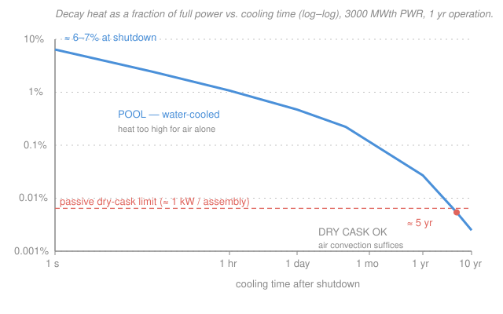

# Nuclear Fuel Cycle & Policy · Lesson 3.1: Decay heat & the spent-fuel source term

> ⏱ ~15 min · Module 3: The Back End — Spent Fuel, Reprocessing & Waste · Builds on: [intro-nuclear-engineering](../../intro-nuclear-engineering/syllabus.md) (radioactive decay), [2.4 In-core fuel-cycle economics](02-04-in-core-fuel-cycle-economics.md) · Unlocks: [3.2 Spent-fuel isotopics & radiotoxicity](03-02-spent-fuel-isotopics-radiotoxicity.md), [3.3 Waste classification & interim storage](03-03-waste-classification-interim-storage.md)

## Why this matters

You can drop the control rods, kill the chain reaction, and the reactor still pours out heat — hundreds of megawatts of it, seconds after "shutdown." The fission chain stopped, but the pile of fission products it created keeps decaying, and every decay dumps energy. This **decay heat** is why a reactor is never truly off, why loss-of-cooling accidents (Three Mile Island, Fukushima) melt cores *after* scram, and why a spent fuel assembly must sit in a water pool for years before it is cool enough to move into a passively cooled cask. The back end of the fuel cycle begins with this one number: how hot is the fuel, and for how long?

## The idea

While a reactor runs, roughly 7% of its thermal power comes not from fission itself but from the radioactive decay of fission products piling up in the fuel — a huge inventory of unstable nuclei, each waiting its turn to emit a beta and a gamma. Fission you can switch off instantly (stop the neutrons). That decaying inventory you **cannot** switch off; it has to burn itself down on its own schedule.

So at the instant of shutdown, the fission part vanishes but the decay part is still there: about 6–7% of full power, delivered by the fresh fission-product inventory. It then falls — fast at first (the short-lived isotopes go first), then agonizingly slowly (the long-lived ones drag on for years). A 3000 MWth reactor is still making ~200 MW a second after scram, ~30 MW an hour later, ~14 MW a day later. That is a space-heater the size of a building that you cannot unplug — it just gets quieter over time.

The engineering consequence writes itself: right after discharge you need aggressive, active cooling (a pumped water pool). Only after years of decay does the heat fall low enough that plain air convection around a concrete-and-steel cask can carry it away. The whole pool-then-cask architecture of spent fuel storage is a direct read-off of the decay-heat curve.

## The formal version

Let $P_0$ be the reactor's steady thermal power before shutdown and $P(t)$ the decay-heat power at time $t$ (in seconds) after shutdown. The classic **Way–Wigner correlation** estimates the fission-product decay heat:

$$\frac{P(t)}{P_0} = 0.066\left[\,t^{-0.2} - (t+t_0)^{-0.2}\,\right],$$

where $t$ is the cooling time since shutdown and $t_0$ is the length of time the reactor operated at power $P_0$ (both in seconds).

In words: decay heat is a small fraction of full power that falls off roughly as $t^{-0.2}$ — a slow power-law decline — and the second term subtracts the contribution of isotopes that never had time to build up during a finite run $t_0$.

Two sanity checks build intuition:

- **At shutdown** ($t \to 0$ for a long run, so $t^{-0.2} \gg (t+t_0)^{-0.2}$): the bracket approaches $\approx 1$, giving $P/P_0 \approx 6.6\%$ — the famous "6–7% at shutdown."
- **Long operation** ($t_0 \gg t$): the second term is negligible and $P(t)/P_0 \approx 0.066\,t^{-0.2}$. A reactor run for years has effectively saturated its long-lived inventory.

Way–Wigner is a first-cut engineering estimate. It counts only fission-product decay and **underpredicts at long cooling times**, where actinide decay (e.g. from Pu, Am, Cm) matters. For licensing, the industry uses the **ANS-5.1 decay-heat standard** — a tabulated, isotope-resolved model with an uncertainty band — but Way–Wigner captures the shape and the order of magnitude, which is what we need here.

**The source term.** "Decay heat" is the thermal half of a spent assembly's **source term** — the full specification of what it emits: heat *plus* penetrating radiation (gammas and neutrons). The heat sets your *cooling* requirement; the radiation sets your *shielding* requirement. Both fall on essentially the same decay clock, which is why "let it cool" simultaneously means "let it get cooler *and* less radioactive."

## Picture

The curve is nearly a straight line on log–log axes — the signature of the $t^{-0.2}$ power law. The coral line marks the passive dry-cask thermal limit (~1 kW per assembly); the fuel lives in the **pool** regime above it and only becomes castable once the curve drops below it, around five years.

## Worked examples

**Example 1 (the boss shape — decay heat of a 3000 MWth PWR).** The reactor runs one year, then shuts down. Take $t_0 = 1\ \text{yr} = 3.156\times10^{7}\ \text{s}$ and $P_0 = 3000\ \text{MW}$. Find the decay heat at 1 hour, 1 day, and 1 year after shutdown.

Plug each cooling time into Way–Wigner. Every calculation is the same three steps: evaluate $t^{-0.2}$, evaluate $(t+t_0)^{-0.2}$, take the bracketed difference times $0.066$, then times $P_0$.

*At $t = 1\ \text{hr} = 3600\ \text{s}$:*
$$t^{-0.2} = 3600^{-0.2} = 0.1944,\qquad (t+t_0)^{-0.2} = (3.156\times10^7)^{-0.2} = 0.0316,$$
$$\frac{P}{P_0} = 0.066\,(0.1944 - 0.0316) = 0.0107 = 1.07\%,\qquad P = 0.0107 \times 3000 \approx 32\ \text{MW}.$$

*At $t = 1\ \text{day} = 86{,}400\ \text{s}$:*
$$t^{-0.2} = 0.1030,\qquad (t+t_0)^{-0.2} = 0.0316,$$
$$\frac{P}{P_0} = 0.066\,(0.1030 - 0.0316) = 0.0047 = 0.47\%,\qquad P \approx 14\ \text{MW}.$$

*At $t = 1\ \text{yr} = 3.156\times10^7\ \text{s}$ (now $t = t_0$):*
$$t^{-0.2} = 0.03164,\qquad (t+t_0)^{-0.2} = (2t_0)^{-0.2} = 0.02754,$$
$$\frac{P}{P_0} = 0.066\,(0.03164 - 0.02754) = 2.70\times10^{-4} = 0.027\%,\qquad P \approx 0.81\ \text{MW}.$$

So the same core that made 3000 MW is making **32 MW** an hour later, **14 MW** a day later, and still **0.8 MW** a full year later — enough to heat a small town, from fuel that has been "off" for twelve months. (Remember Way–Wigner underpredicts here; ANS-5.1 would put the one-year value somewhat higher.)

**Example 2 (pool-then-cask — why the water is not optional).** Why can't you just pull a freshly discharged assembly and stand it in an air-cooled cask? Do the arithmetic per assembly. A 3000 MWth PWR core holds about 193 assemblies, so each carries, on average,
$$\frac{3000\ \text{MW}}{193} \approx 15.5\ \text{MW of full-power thermal duty}.$$
Multiply by the decay-heat fraction to get each assembly's heat load at cooling time $t$:

- **At shutdown** ($\approx 6.6\%$): $15.5\ \text{MW} \times 0.066 \approx 1.0\ \text{MW}$ per assembly.
- **At 1 year** ($0.027\%$): $15.5\ \text{MW} \times 2.70\times10^{-4} \approx 4.2\ \text{kW}$ per assembly.
- **At 5 years** ($5.4\times10^{-5}$): $15.5\ \text{MW} \times 5.42\times10^{-5} \approx 0.84\ \text{kW}$ per assembly.

A passively cooled dry cask can shed only about **1 kW per assembly** and keep the fuel cladding below its ~400 °C temperature limit. A fresh assembly runs at **1 MW** — a thousand times over the passive limit — so nothing but pumped water can carry that away without the cladding cooking. Only after roughly **five years** does the per-assembly load fall under ~1 kW, and *then* a cask can take it. The pool isn't a bureaucratic waiting room; it is the only heat sink big enough for the first few years. That is the entire logic of interim storage in one calculation.

## Watch out

- **You might think** shutting down means the heat stops. **Actually** decay heat is ~7% of full power the instant the rods drop and is still kilowatts per assembly years later — "off" removes the fission source, never the decay source. Every loss-of-cooling accident is decay heat with nowhere to go.
- **You might think** a longer power-law like $t^{-0.2}$ decays quickly. **Actually** $t^{-0.2}$ is *brutally* slow: going from 1 hour to 1 year (a factor of ~8800 in time) drops the fraction only ~40-fold, not thousands-fold. The heat lingers precisely because the exponent is small.
- **You might think** Way–Wigner is conservative (safe) because it's simple. **Actually** it *under*predicts at long cooling times because it ignores actinide decay — so a cask or repository heat load must come from ANS-5.1 with its uncertainty margin, not from this back-of-envelope estimate.

## One-liner

> A reactor never really turns off: fission-product decay leaves ~7% of full power at shutdown, falling as $t^{-0.2}$, and that curve alone dictates years in a pool before a cask can hold the fuel.

## Problems

**P1 (🟢)** A 1000 MWth reactor has operated long enough that the second Way–Wigner term is negligible, so $P(t)/P_0 \approx 0.066\,t^{-0.2}$. Find the decay heat (in MW) at (a) 10 s and (b) 1 hour after shutdown. What fraction of full power is each?

**P2 (🟡)** One day after the 3000 MWth PWR of Example 1 shuts down, its freshly discharged core sits in a spent-fuel pool holding $1.2\times10^6\ \text{kg}$ of water ($c = 4186\ \text{J/kg·K}$). Using the 1-day decay-heat fraction $0.47\%$, (a) find the pool's cooling load in MW, and (b) if all active cooling is lost, estimate how long the water takes to heat from 40 °C to boiling (100 °C). What real accident does this illuminate?

**P3 (🔴, optional)** A dry storage cask can reject about 30 kW total by passive air convection while keeping cladding below its temperature limit. Using the per-assembly heat loads from Example 2, roughly how many assemblies can one cask hold if the fuel has cooled (a) 1 year, (b) 5 years? Comment on which is realistic for a licensed cask (typical designs hold ~24–37 assemblies).

Solutions

**P1** Use $P/P_0 \approx 0.066\,t^{-0.2}$ with $P_0 = 1000\ \text{MW}$.

(a) $t = 10\ \text{s}$: $10^{-0.2} = 0.6310$, so $P/P_0 = 0.066 \times 0.6310 = 0.0416 = 4.16\%$, giving $P = 0.0416 \times 1000 \approx 41.6\ \text{MW}$.

(b) $t = 3600\ \text{s}$: $3600^{-0.2} = 0.1944$, so $P/P_0 = 0.066 \times 0.1944 = 0.01283 = 1.28\%$, giving $P = 0.01283 \times 1000 \approx 12.8\ \text{MW}$.

An order of magnitude of megawatts, from a reactor that is "shut down." (Dropping the second term is the long-operation limit; with a finite $t_0$ the values are marginally lower.)

**P2** (a) Cooling load = decay-heat power = $0.0047 \times 3000\ \text{MW} \approx 14.1\ \text{MW}$.

(b) With cooling lost, all 14.1 MW goes into heating the water. Energy to raise it by $\Delta T = 60\ \text{K}$:
$$Q = m c\,\Delta T = (1.2\times10^6)(4186)(60) = 3.01\times10^{11}\ \text{J}.$$
Time to deliver that at $P = 14.1\times10^6\ \text{W}$:
$$\Delta t = \frac{Q}{P} = \frac{3.01\times10^{11}}{14.1\times10^{6}} \approx 2.13\times10^{4}\ \text{s} \approx 5.9\ \text{hours}.$$
So a full pool starts boiling within about six hours of losing cooling — after which the water boils off, uncovers the fuel, and the cladding overheats. This is the **Fukushima Daiichi** spent-fuel-pool scenario (and, for the in-vessel core, the mechanism behind every station-blackout meltdown): the hazard is not the chain reaction, which had stopped, but the decay heat with no working heat sink.

**P3** Divide the cask limit by the per-assembly load from Example 2.

(a) At 1 year, ~4.2 kW/assembly: $30\ \text{kW} / 4.2\ \text{kW} \approx 7$ assemblies. Far below a cask's capacity — one-year-old fuel is still too hot to load a cask efficiently (or at all, within cladding limits).

(b) At 5 years, ~0.84 kW/assembly: $30\ \text{kW} / 0.84\ \text{kW} \approx 36$ assemblies. This lands right in the real range of licensed cask capacities — which is exactly why ~5 years of pool cooling is the practical minimum before dry casking. The decay-heat curve and the cask heat limit together *set* the storage timeline.

## Flashback

**From Lesson 2.3 (Burnup & the linear reactivity model):** Under the linear reactivity model, an $n$-batch reload scheme reaches equilibrium discharge burnup $B_n = \frac{2n}{n+1}B_1$, where $B_1$ is the single-batch (whole-core) burnup. A fuel design gives $B_1 = 18\ \text{GWd/tHM}$. Find the equilibrium discharge burnup for a 2-batch and a 3-batch scheme, and state in one sentence why the 3-batch fuel is a hotter decay-heat source at discharge.

Solution

$$B_2 = \frac{2(2)}{2+1}B_1 = \frac{4}{3}(18) = 24\ \text{GWd/tHM},\qquad B_3 = \frac{2(3)}{3+1}B_1 = \frac{6}{4}(18) = 27\ \text{GWd/tHM}.$$

Splitting the core into more batches lets each assembly ride through more cycles and reach higher burnup before discharge. Higher burnup means each discharged tonne has fissioned more atoms and accumulated a larger fission-product (and actinide) inventory — so the 27 GWd/tHM fuel carries more decay heat and a stronger source term than the 24 GWd/tHM fuel, needing longer pool cooling before casking. (This is the direct back-end cost of the front-end/economics push toward high burnup you weighed in [2.4](02-04-in-core-fuel-cycle-economics.md).)

## Connections

- **Backward:** this is the radioactive-decay law from [intro-nuclear-engineering](../../intro-nuclear-engineering/syllabus.md) summed over a whole reactor's fission-product inventory — an exponential per isotope, a $t^{-0.2}$ power law in aggregate. The heavier the fuel's discharge burnup ([2.3](02-03-burnup-depletion-linear-reactivity-model.md)), the bigger that inventory and the hotter the source term.
- **Forward:** the *thermal* half of the source term drives cooling-system design in [reactor-thermal-hydraulics](../../reactor-thermal-hydraulics/syllabus.md), where passive and active decay-heat removal is the core safety question; the *radiological* half feeds [3.2 Spent-fuel isotopics & radiotoxicity](03-02-spent-fuel-isotopics-radiotoxicity.md) and the pool-vs-cask decision in [3.3 Waste classification & interim storage](03-03-waste-classification-interim-storage.md), and ultimately sets how far apart canisters must sit in a repository ([3.6](03-06-geological-disposal-repository.md)).
- **Sideways (thermal engineering):** "power in, cooling out, or the temperature runs away" is the same lumped-capacitance heat balance you'd write for any thermal system — P2 is Newton's heating law with a fixed source, exactly the transient-conduction setup that reactor-thermal-hydraulics formalizes for the whole plant.
