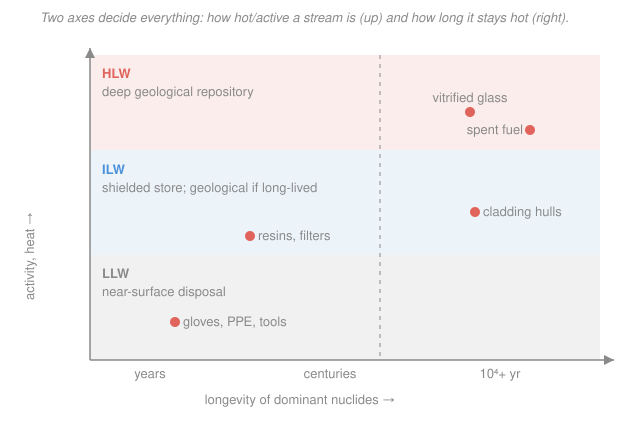

# Nuclear Fuel Cycle & Policy · Lesson 3.3: Waste classification & interim storage

> ⏱ ~15 min · Module 3: The Back End · Builds on: [3.1 Decay heat & the spent-fuel source term](03-01-decay-heat-source-term.md), [3.2 Spent-fuel isotopics & radiotoxicity](03-02-spent-fuel-isotopics-radiotoxicity.md) · Unlocks: [3.6 Geological disposal & the repository](03-06-geological-disposal-repository.md)

## Why this matters

"Nuclear waste" is not one thing — it's a spectrum spanning nine orders of magnitude in activity, from a contaminated glove to a fuel assembly that would kill you in minutes at arm's length. Lumping them together is the single most expensive mistake in the back end: you'd either bury gloves in a billion-dollar granite vault, or leave lethal fuel in a shed. Classification is the triage that routes each stream to the cheapest disposal that's still safe. And for the hottest stream of all — spent fuel — there's a prior question: it's too hot to bury the day it comes out, so where does it *wait*? That's the pool-versus-cask decision, and it's set by one number you already know how to compute: decay heat.

## The idea

Two properties decide a waste stream's fate. **How radioactive is it** (activity, and its cousin, heat output)? And **how long does it stay that way** (the half-lives of the nuclides in it)? A high-activity, long-lived stream needs deep, permanent isolation; a low-activity, short-lived one can decay to background in a shallow trench in a human lifetime.

Those two knobs give three practical bins:

- **HLW (high-level waste)** — intensely radioactive *and* thermally hot: spent fuel itself, or the concentrated liquid left after reprocessing. It boils its own coolant; it needs cooling now and deep geological disposal later.
- **ILW (intermediate-level waste)** — active enough that you can't handle it bare-handed (needs shielding), but *not* hot enough to need cooling: the zirconium cladding hulls left after dissolving fuel, spent ion-exchange resins, reactor internals.
- **LLW (low-level waste)** — the bulk by volume, trivial by hazard: gloves, tools, wipes, protective clothing. Contact-handled, near-surface disposal.

The tell between ILW and HLW is *heat*, not just activity. And heat is exactly why fresh spent fuel can't go straight into a dry cask: right out of the reactor an assembly puts out kilowatts, so it lives in a **pool** — deep water that both cools it and shields the radiation — until decay heat falls far enough that **passive air cooling** in a sealed steel-and-concrete **cask** can carry it away. The whole interim-storage story is a race between the clock and a thermal limit.

## The formal version

**Classification by activity and longevity.** Characterize a stream by its activity concentration $a$ (becquerels per kilogram, $\text{Bq/kg}$), its volumetric heat output $q$ ($\text{W/m}^3$, which tracks $a$), and the half-life $t_{1/2}$ of its dominant nuclides. The IAEA three-tier scheme sorts on these:

$$
\begin{aligned}
\textbf{LLW:}\quad & \text{low } a,\ \ q \approx 0, \ \ \text{mostly short-lived} &&\rightarrow\ \text{near-surface disposal}\\
\textbf{ILW:}\quad & \text{high } a \ (\text{needs shielding}),\ \ q \approx 0,\ \ \text{often long-lived} &&\rightarrow\ \text{geological / intermediate depth}\\
\textbf{HLW:}\quad & \text{very high } a,\ \ q \gtrsim 2\,\text{kW/m}^3,\ \ \text{long-lived} &&\rightarrow\ \text{deep geological repository}
\end{aligned}
$$

*In words: activity sets whether you need shielding to handle it, heat is the line between ILW and HLW, and longevity sets how deep and how permanent the grave must be.* The $q \gtrsim 2\ \text{kW/m}^3$ figure is the rough IAEA marker for "self-heating matters" — above it, the waste warms its surroundings enough that a repository must space the canisters out (that's [3.6](03-06-geological-disposal-repository.md)'s problem).

**The pool-to-cask criterion.** A discharged assembly's decay heat follows the Way–Wigner curve from [3.1](03-01-decay-heat-source-term.md):

$$P(t) = 0.066\,P_0\left[\,t^{-0.2} - (t+t_0)^{-0.2}\,\right],$$

with $P_0$ the assembly's operating thermal power (W), $t_0$ its irradiation time and $t$ the cooling time (both in **seconds**). Fresh fuel goes to a **spent-fuel pool**: ~12 m of borated water giving active cooling *and* radiation shielding, high-density racked. It can move to a **dry cask** — a sealed steel canister inside a concrete overpack, cooled only by natural air convection — once

$$P(t)\ \le\ P_\text{cask},$$

where $P_\text{cask}$ is the cask's rated per-assembly heat limit, set so the peak cladding temperature stays below $\sim 400^\circ\text{C}$ (above that the zirconium cladding creeps and can rupture). *In words: the fuel waits in the pool until its own heat drops under what passive air cooling can shed without cooking the cladding — solve $P(t)=P_\text{cask}$ for the cooling time, and that's how long it sits.*

## Picture

## Worked examples

**Example 1 (classify four streams and route them).** A reprocessing plant and its host reactor generate these. Assign a class and a disposal route to each.

| Stream | Activity / heat | Longevity | Class → route |
|---|---|---|---|
| Spent fuel assemblies (once-through) | very high, hot (kW/assembly) | long-lived actinides | **HLW** → deep geological |
| Zircaloy cladding hulls (after dissolution) | high (activated metal + clinging actinides), but cool | long-lived | **ILW** → geological / intermediate depth |
| Contaminated PPE — gloves, booties, wipes | low, no meaningful heat | short-lived surface contamination | **LLW** → near-surface |
| Vitrified reprocessing raffinate (glass logs) | very high, hot | long-lived fission products + minor actinides | **HLW** → deep geological |

The logic, applied in order: **Is it hot?** Spent fuel and the vitrified raffinate both self-heat (kilowatts) → HLW, deep disposal, both need interim cooling first. **If not hot, does it need shielding?** The cladding hulls are activated metal carrying residual actinides — you can't handle them bare, but they don't need cooling → ILW. **Neither hot nor needing shielding?** The PPE is contact-handled, dominated by short-lived contamination → LLW, a shallow engineered trench. Notice the raffinate and the fuel land in the *same* bin from opposite directions: reprocessing (3.4) doesn't abolish HLW, it just changes its *form* from solid fuel to glass — the heat and longevity ride along.

**Example 2 (pool-to-cask: how long must it cool?).** A PWR assembly ran at $P_0 = 16\ \text{MW}$ thermal for $t_0 = 4$ years, then was discharged. A dry-storage cask holds 24 such assemblies and is rated for $36\ \text{kW}$ total — a per-assembly limit of $P_\text{cask} = 36/24 = 1.5\ \text{kW}$. When can this assembly leave the pool?

Use Way–Wigner with $P_0 = 1.6\times 10^7\ \text{W}$, so $0.066\,P_0 = 1.056\times 10^6\ \text{W}$, and $t_0 = 4\times 3.156\times 10^7 = 1.262\times 10^8\ \text{s}$. Evaluate at two candidate cooling times (1 year $= 3.156\times 10^7$ s):

At $t = 5\ \text{yr} = 1.578\times 10^8\ \text{s}$ (so $t+t_0 = 9\ \text{yr}$):
$$P = 1.056\times 10^6\left[(1.578\times 10^8)^{-0.2} - (2.840\times 10^8)^{-0.2}\right] = 1.056\times 10^6\,[0.02293 - 0.02039] = 2.69\ \text{kW}.$$

At $t = 10\ \text{yr} = 3.156\times 10^8\ \text{s}$ (so $t+t_0 = 14\ \text{yr}$):
$$P = 1.056\times 10^6\left[(3.156\times 10^8)^{-0.2} - (4.418\times 10^8)^{-0.2}\right] = 1.056\times 10^6\,[0.01996 - 0.01866] = 1.37\ \text{kW}.$$

At 5 years the assembly is still at $2.69\ \text{kW}$ — well over the $1.5\ \text{kW}$ limit, so the pool is mandatory. By 10 years it's dropped to $1.37\ \text{kW}$, under the limit. Interpolating between the two (the heat is falling roughly $0.16\ \text{kW/yr}$ across this window), $P = 1.5\ \text{kW}$ is reached near **$t \approx 9$ years**. That's the Way–Wigner *conservative* answer; because Way–Wigner over-predicts heat at long cooling times (see Watch out), a real measured heat curve for this assembly would clear the limit closer to the industry rule-of-thumb of ~5 years. Either way the lesson is the same: the pool isn't a formality, it's a years-long thermal necessity dictated by one decay-heat curve.

## Watch out

- **You might think "low-level" means "small amount."** It's the opposite by volume: LLW is ~90% of waste volume but a tiny fraction of the activity. HLW is a few percent of the volume and essentially *all* the hazard. Volume and hazard are anti-correlated — never size the disposal problem by tonnage.
- **You might think activity alone sorts ILW from HLW.** The discriminator is *heat*. A stream can be fiercely radioactive yet cool (long-lived alpha emitters, activated metal) and still be ILW — because heat, not raw activity, is what forces active cooling and canister spacing. Cladding hulls are the poster child: hot in becquerels, cold in watts.
- **You might think decay heat is negligible by the time fuel is "spent."** At shutdown an assembly is still at ~7% of full power, and even after 5 years in the pool a single assembly is a multi-kilowatt space heater. That's why pools need *active* cooling and backup power — the Fukushima pools were a crisis precisely because that heat never switches off.
- **You might trust Way–Wigner far out in time.** It's fit to short-cooling data and over-predicts heat beyond ~1 year; the ANS-5.1 standard is the accurate tool for the pool-to-cask decision. Way–Wigner gives a *conservative* (safe, high) estimate — fine for a "can it move yet?" screen, wrong for a tight cask-loading optimization.

## One-liner

> Activity says whether you shield it, heat says whether you cool it and how deep it's buried, and half-life says for how long — and for spent fuel, decay heat alone sets the years it must cool in a pool before a passively-cooled cask can take it.

## Problems

**P1 (🟢)** A decommissioning project produces three streams: (a) a batch of spent ion-exchange resins that removed dissolved fission products from primary coolant — highly active, negligible self-heating, contains long-lived nuclides; (b) reactor pressure-vessel steel that was neutron-activated over 40 years — needs shielding, no meaningful heat; (c) a truckload of paper coveralls with trace surface contamination that decays away in a few years. Classify each as HLW / ILW / LLW and give its disposal route.

**P2 (🟡)** A cask vendor rates a system for fuel whose per-assembly decay heat is at or below $1.2\ \text{kW}$. Using the assembly from Example 2 ($P_0 = 16\ \text{MW}$, $t_0 = 4\ \text{yr}$) and the Way–Wigner values there, decide whether a 10-year-cooled assembly ($1.37\ \text{kW}$) qualifies. If not, roughly how much longer must it cool? (You may use that the heat is falling about $0.13\ \text{kW/yr}$ near 10 years.)

**P3 (🔴, optional)** A single cask position is rated at $1.5\ \text{kW}$, but a utility wants to load *higher-burnup* fuel that ran at $P_0 = 18\ \text{MW}$ for $t_0 = 4.5$ years. Compute its decay heat at $t = 10$ years and state whether it can be loaded. (One Way–Wigner evaluation; $1\ \text{yr} = 3.156\times 10^7$ s.)

Solutions

**P1.** Apply the "hot? / shielded? / neither?" ladder.

- (a) Resins: highly active but *cool* → not HLW. They need shielding and hold long-lived nuclides → **ILW**, routed to geological / intermediate-depth disposal.
- (b) Activated vessel steel: needs shielding, no heat, long-lived activation products (e.g. Ni-63, Nb-94) → **ILW**, geological / intermediate-depth.
- (c) Contaminated coveralls: low activity, no heat, short-lived → **LLW**, near-surface trench.

The point: two very different physical objects (resins and steel) share a bin because they share the decision-relevant properties — shielding yes, cooling no, long-lived yes.

**P2.** The 10-year assembly sits at $1.37\ \text{kW}$, which is **above** the $1.2\ \text{kW}$ rating — it does *not* qualify. The excess is $1.37 - 1.20 = 0.17\ \text{kW}$. At a fall rate of about $0.13\ \text{kW/yr}$:

$$\Delta t \approx \frac{0.17\ \text{kW}}{0.13\ \text{kW/yr}} \approx 1.3\ \text{yr},$$

so it needs roughly **1–1.5 more years**, i.e. ~11–12 years total cooling. (A lower cask rating simply pushes the pool residence out — the whole curve has to slide further down.)

**P3.** Way–Wigner with $P_0 = 1.8\times 10^7\ \text{W}$ ($0.066\,P_0 = 1.188\times 10^6\ \text{W}$), $t_0 = 4.5\ \text{yr} = 1.420\times 10^8\ \text{s}$, $t = 10\ \text{yr} = 3.156\times 10^8\ \text{s}$, so $t+t_0 = 14.5\ \text{yr} = 4.576\times 10^8\ \text{s}$:

$$
(3.156\times 10^8)^{-0.2} = 0.01996,\qquad (4.576\times 10^8)^{-0.2} = 0.01853,
$$
$$
P = 1.188\times 10^6\,[0.01996 - 0.01853] = 1.188\times 10^6 \times 0.00143 = 1.70\ \text{kW}.
$$

At $1.70\ \text{kW}$ it is **over** the $1.5\ \text{kW}$ position rating — it cannot be loaded at 10 years. Higher burnup means higher $P_0$ and longer irradiation, so it runs hotter for longer and needs still more pool time; this is exactly why high-burnup fuel strains dry-storage schedules.

*Check.* Larger $P_0$ and $t_0$ than Example 2 (which gave $1.37\ \text{kW}$ at 10 yr) should give more heat — and $1.70 > 1.37$. ✓

## Flashback

**From Lesson 3.1 (Decay heat & the spent-fuel source term):** A 2400 MWth PWR operates for 18 months and then scrams. Using Way–Wigner $P(t)/P_0 = 0.066\,[\,t^{-0.2} - (t+t_0)^{-0.2}\,]$ (times in seconds, $t_0$ the operating time), find the decay heat 1 hour after shutdown. (Fresh variant — different power and operating time from the module boss problem.)

Solution

Set $P_0 = 2400\ \text{MW}$, $t_0 = 1.5\ \text{yr} = 4.734\times 10^7\ \text{s}$, and $t = 1\ \text{hr} = 3600\ \text{s}$.

$$t^{-0.2} = 3600^{-0.2} = 0.1944,\qquad (t+t_0)^{-0.2} \approx (4.734\times 10^7)^{-0.2} = 0.02917.$$

$$P = 0.066 \times 2400\ \text{MW} \times (0.1944 - 0.02916) = 0.066 \times 2400 \times 0.1653 = 26.2\ \text{MW}.$$

*Check.* That's about $26.2/2400 = 1.1\%$ of full power one hour after shutdown — the right order of magnitude (roughly 7% at shutdown, falling to ~1% within an hour or so). ✓ This is the same source term that, one assembly at a time, forces the pool residence in this lesson.

## Connections

- **Backward:** the two axes of the classification chart are the two previous lessons made into a decision. Heat is [3.1](03-01-decay-heat-source-term.md)'s decay-heat curve — it draws the ILW/HLW line and sets the pool-to-cask clock. Longevity is [3.2](03-02-spent-fuel-isotopics-radiotoxicity.md)'s fission-product-vs-actinide crossover — it decides near-surface versus deep, because a stream is only as "disposable" as its longest-lived nuclide.
- **Forward:** [3.4 PUREX & separations](03-04-reprocessing-purex-separations.md) is where the ILW cladding hulls and the HLW raffinate in Example 1 are physically born — reprocessing re-partitions spent fuel into these very streams. And [3.6 Geological disposal](03-06-geological-disposal-repository.md) takes the HLW bin and asks how its heat (the same $P(t)$) sets canister spacing and repository footprint.
- **Sideways (radiation shielding):** the "needs shielding?" test that separates ILW from LLW, and the concrete overpack that shields a dry cask, are gamma/neutron attenuation problems — the exponential $I = I_0 e^{-\mu x}$ buildup-and-attenuation machinery from [radiation-detection-shielding](../../radiation-detection-shielding/syllabus.md). Water depth in the pool is the same calculation with water as the shield.
