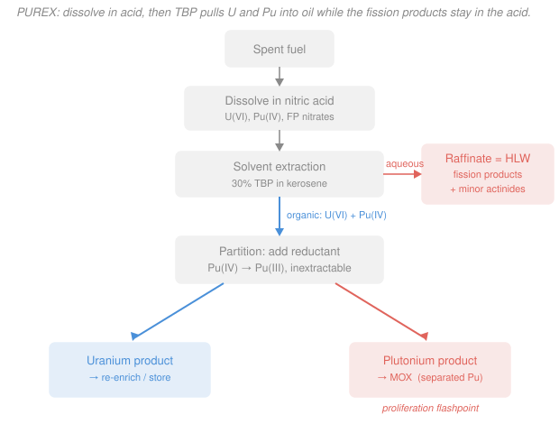

# Nuclear Fuel Cycle & Policy · Lesson 3.4: Reprocessing — PUREX & separations

> ⏱ ~15 min · Module 3: The Back End — Spent Fuel, Reprocessing & Waste · Builds on: [3.2 Spent-fuel isotopics & radiotoxicity](03-02-spent-fuel-isotopics-radiotoxicity.md), [3.3 Waste classification & interim storage](03-03-waste-classification-interim-storage.md) · Unlocks: [3.5 Recycling: MOX & the plutonium balance](03-05-recycling-mox-plutonium-balance.md), [4.3 Nonproliferation, safeguards & security](04-03-nonproliferation-safeguards-security.md)

## Why this matters

Spent fuel is still about 95% uranium and 1% plutonium by mass — genuine fuel, not garbage. Reprocessing is the chemistry that pries that fuel back out from the 4% that is truly waste, and PUREX is the industrial process the whole world uses to do it. But the same step that recovers usable material also produces *separated plutonium* — a clean, weapons-usable powder no longer hidden behind spent fuel's lethal gamma field. So this one lesson sits on the exact fault line of the fuel cycle: it is simultaneously the key to recycling and the sharpest proliferation worry in the business.

## The idea

Spent fuel is a rock — a hot ceramic pellet with uranium, plutonium, and a zoo of fission products all locked together. To separate them you first have to make everything mobile, so step one is brute force: **dissolve the fuel in boiling nitric acid** until it's a clear, intensely radioactive solution of metal nitrates.

Now the clever part. Add an organic solvent that doesn't mix with the acid — think oil floating on water. The trick is a molecule called **TBP** (tributyl phosphate, diluted in kerosene) that is *picky*: it grabs uranium and plutonium out of the acid and carries them up into the oil, but it ignores almost all the fission products, which stay down in the acid. Shake, let the layers separate, and you've split the fuel in two: **U + Pu in the oil, fission products left behind in the acid** (that leftover acid is called the *raffinate* — it is your high-level waste).

One problem remains: U and Pu are riding together in the oil, and you often want them apart. TBP grabs plutonium only when it's in a particular electrical state (the +4 charge). So you **chemically nudge the plutonium into a +3 state that TBP can't hold** — and it falls back into the water, leaving uranium alone in the oil. That deliberate switch is called *partitioning*. Three streams come out: uranium, plutonium, and waste.

## The formal version

**Dissolution.** Chop the fuel, strip the cladding, and dissolve in hot nitric acid. Illustratively,

$$\ce{UO2 + 4 HNO3 -> UO2(NO3)2 + 2 NO2 ^ + 2 H2O}.$$

In words: uranium dioxide reacts with nitric acid to give dissolved *uranyl nitrate* (uranium in the +6 state, the ion $\ce{UO2^2+}$) plus nitrogen-oxide gas; plutonium likewise dissolves as $\ce{Pu^4+}$, and every fission product becomes a dissolved nitrate. Everything that was a solid is now in one aqueous soup.

**Selective extraction.** Contact that acidic soup with ~30% TBP in kerosene. The split is governed by each species' **distribution ratio**

$$D_i = \frac{[\,i\,]_{\text{org}}}{[\,i\,]_{\text{aq}}},$$

the ratio of a species $i$'s concentration in the organic phase to its concentration in the aqueous phase.

In words: $D_i \gg 1$ means "goes into the oil," $D_i \ll 1$ means "stays in the acid." TBP forms neutral complexes only with the highly charged $\ce{UO2^2+}$ and $\ce{Pu^4+}$ (both get $D \gg 1$); the mostly +1, +2, and +3 fission-product nitrates get $D \ll 1$ and are left behind in the **raffinate**. That one difference in distribution ratio *is* the separation.

**Partitioning.** Add a reductant (historically ferrous sulfamate or U(IV); modern plants use hydroxylamine) to the loaded organic to drive

$$\ce{Pu^4+ ->[+e^-] Pu^3+}.$$

In words: knock plutonium down from +4 to +3. TBP can't complex $\ce{Pu^3+}$, so its distribution ratio collapses ($D_{\text{Pu}}\!\gg\!1 \to D_{\text{Pu}}\!\ll\!1$) and it strips back into a fresh acid stream — while $\ce{UO2^2+}$, whose +6 state is untouched by the reductant, stays in the oil. Uranium and plutonium are now in separate liquids. A final water strip pulls the uranium out of the oil too, and the TBP is recycled. Net output: **three streams — uranium, plutonium, raffinate (HLW).**

## Picture

## Worked examples

**Example 1 (mechanical — the mass split).** Take a representative tonne of LWR spent fuel with mass fractions U 95%, Pu 1%, fission products + minor actinides 4%. Per tonne of heavy metal (1000 kg), what mass comes out each PUREX stream, and how much separated plutonium is that in safeguards terms?

Multiply each fraction by 1000 kg:

$$m_{\text{U}} = 0.95 \times 1000 = 950\ \text{kg} \quad(\text{uranium product}),$$
$$m_{\text{Pu}} = 0.01 \times 1000 = 10\ \text{kg} \quad(\text{plutonium product}),$$
$$m_{\text{FP+MA}} = 0.04 \times 1000 = 40\ \text{kg} \quad(\text{raffinate} = \text{HLW}).$$

Check: $950 + 10 + 40 = 1000$ kg. ✓ So each tonne of spent fuel yields ~950 kg recyclable uranium, ~10 kg plutonium, and only 40 kg of genuine high-level waste.

Now the safeguards read. The IAEA "significant quantity" (SQ) for plutonium — the rough amount needed for one weapon — is 8 kg. So each tonne of spent fuel holds

$$\frac{10\ \text{kg Pu}}{8\ \text{kg/SQ}} \approx 1.25\ \text{SQ},$$

more than one weapon's worth of plutonium *per tonne*. Hold that number; Lesson [4.3](04-03-nonproliferation-safeguards-security.md) builds the safeguards regime around it.

**Example 2 (why you'd care — disposal burden vs. proliferation).** Scale Example 1 to a commercial plant reprocessing 1000 tonnes of heavy metal per year. What does separating the raffinate buy the back end — and what does it cost in proliferation risk?

*Annual streams* (Example 1 fractions × 1000 tHM):

$$\text{U: } 950\ \text{t/yr}, \qquad \text{Pu: } 10\ \text{t/yr}, \qquad \text{HLW (FP+MA): } 40\ \text{t/yr}.$$

*Disposal payoff.* Of the 1000 t of spent fuel, only 40 t — **4%** by mass — is the long-lived, deep-disposal HLW once uranium and plutonium are pulled out. The other 96% leaves the repository path: uranium is low-activity and storable/re-enrichable, and the plutonium becomes fuel. Better still, plutonium and the minor actinides are what dominate spent-fuel ingestion radiotoxicity beyond a few hundred years (Lesson [3.2](03-02-spent-fuel-isotopics-radiotoxicity.md)). Stripping ~99.5% of the plutonium collapses that long tail: vitrified raffinate decays back toward uranium-ore radiotoxicity in roughly $10^3$ years rather than $\sim\!10^5$. That is the quantitative case *for* closing the cycle.

*The honest caveat.* Reprocessing does **not** erase the near-term heat. The first-century decay heat is driven by the fission products $\ce{^{137}Cs}$ and $\ce{^{90}Sr}$ (both ~30-year half-lives) — and those go straight into the raffinate. PUREX concentrates that heat into glass; it doesn't remove it. The wins are the recovered material and the shorter long-term hazard, not a cooler package on day one.

*The proliferation cost.* Those 10 t/yr of plutonium are

$$\frac{10{,}000\ \text{kg/yr}}{8\ \text{kg/SQ}} = 1250\ \text{SQ/yr}$$

of **separated** plutonium. Unlike spent fuel — whose intense gamma field is itself a barrier ("self-protecting") — separated Pu is a clean powder anyone could handle and, in principle, weaponize. A single stream now carries ~1250 weapons-equivalents a year through one building. That is exactly why PUREX is the fuel cycle's proliferation flashpoint, and why the safeguards effort in [4.3](04-03-nonproliferation-safeguards-security.md) concentrates on reprocessing plants.

## Watch out

- **You might think reprocessing "gets rid of the heat."** Actually the dominant early decay heat is fission products ($\ce{^{137}Cs}$, $\ce{^{90}Sr}$), which stay in the raffinate. Reprocessing concentrates the heat into HLW glass; what it removes is the *very-long-term* actinide radiotoxicity, not the near-term thermal load.
- **You might think TBP grabs everything valuable at once.** Actually extraction is oxidation-state selective: $\ce{UO2^2+}$ (U +6) and $\ce{Pu^4+}$ (Pu +4) are extracted, but $\ce{Pu^3+}$ is not. That valency dependence isn't a nuisance — it *is* the partitioning lever that splits Pu from U.
- **You might think "reactor-grade" plutonium is too poor for a weapon and so doesn't count.** Actually the high $\ce{^{240}Pu}$ content makes it a worse weapon, not a harmless one; the IAEA counts all plutonium isotope mixes (except nearly pure $\ce{^{238}Pu}$) toward a significant quantity. Separated is separated.

## One-liner

> PUREX dissolves spent fuel in acid and lets a picky solvent (TBP) carry uranium and plutonium into oil while the fission-product waste stays behind — recovering ~96% of the mass as fuel, but leaving separated plutonium as the price.

## Problems

**P1 (🟢)** A reprocessing plant treats 800 tonnes of heavy metal per year of spent fuel with composition U 94%, Pu 1.2%, fission products + minor actinides 4.8%. Compute the annual mass of each of the three PUREX output streams. Which stream is the high-level waste?

**P2 (🟡)** Using the plant in P1 and an IAEA significant quantity of 8 kg for plutonium: (a) how many significant quantities of plutonium does the plant separate per year? (b) In two sentences, explain why that separated plutonium is a bigger safeguards concern than the same plutonium left inside un-reprocessed spent fuel.

**P3 (🔴, optional)** In the partition step you reduce $\ce{Pu^4+}$ to $\ce{Pu^3+}$ to strip plutonium out of the organic phase, while uranium stays behind as $\ce{UO2^2+}$. Explain in terms of the distribution ratio $D$ why this reductant splits Pu from U — and predict what would go wrong with the separation if the reductant were strong enough to also reduce U(VI) to U(IV). *(Hint: like Pu(IV), U(IV) is a small, highly-charged ion that TBP complexes well.)*

Solutions

**P1** Mass fractions × 800 tHM:

- Uranium product: $0.94 \times 800 = 752$ t/yr
- Plutonium product: $0.012 \times 800 = 9.6$ t/yr
- Raffinate: $0.048 \times 800 = 38.4$ t/yr

Check: $752 + 9.6 + 38.4 = 800$ t/yr. ✓ The **raffinate** (fission products + minor actinides) is the high-level waste — it holds the intensely radioactive fission products and gets vitrified for disposal.

**P2** (a) The plant separates 9.6 t/yr = 9600 kg/yr of plutonium, so

$$\frac{9600\ \text{kg/yr}}{8\ \text{kg/SQ}} = 1200\ \text{SQ/yr}.$$

(b) Inside spent fuel the plutonium is dilute (~1%) and shielded by the fuel's lethal fission-product gamma field, so diverting or handling it means moving a hot, hard-to-process assembly — the radiation is itself a barrier ("self-protecting"). After PUREX the plutonium is a nearly pure, low-radiation solid that can be handled, moved, and shaped directly, so a diversion of a few kilograms is both easier and far harder to detect — the entire point of the safeguards effort in Lesson 4.3.

**P3** Extraction into the organic phase happens only for species with a large distribution ratio $D = [\,i\,]_{\text{org}}/[\,i\,]_{\text{aq}}$. TBP forms extractable neutral complexes with the highly-charged $\ce{Pu^4+}$ and $\ce{UO2^2+}$, so both start with $D \gg 1$ (in the oil). Reducing $\ce{Pu^4+ -> Pu^3+}$ produces an ion TBP cannot complex, collapsing $D_{\text{Pu}}$ to $\ll 1$: plutonium strips into the aqueous stream. Uranium's +6 state is untouched by that mild reductant, so $D_{\text{U}}$ stays $\gg 1$ and it remains in the oil — hence the split.

If the reductant were strong enough to also make U(IV): like Pu(IV), $\ce{U^4+}$ is small and highly charged, so TBP *would* still complex and extract it — meaning $D_{\text{U}}$ would stay high (or U(IV) could even follow the changed chemistry unpredictably) and, more to the point, you'd lose the clean valency contrast that lets you move Pu without moving U. The separation depends on reducing Pu while leaving uranium in a non-reducible +6 state; a too-aggressive reductant erases exactly the difference PUREX exploits.

## Flashback

**From Lesson 3.3 (Waste classification & interim storage):** A dry-storage cask is licensed to a total decay-heat limit of 26 kW and is designed to hold 24 PWR assemblies. A freshly discharged assembly gives off about 2.2 kW; after cooling in the pool its heat falls to about 0.9 kW. (a) What is the per-assembly heat budget if the cask is filled to capacity? (b) Can the cask be loaded straight out of the reactor, and if not, what has to happen first? (c) What waste class is this material?

Solution

(a) Split the total limit over 24 assemblies:

$$\frac{26\ \text{kW}}{24} \approx 1.08\ \text{kW per assembly}.$$

(b) No. A freshly discharged assembly puts out 2.2 kW, well above the 1.08 kW budget — 24 of them would give $24 \times 2.2 = 52.8$ kW, double the cask's 26 kW limit. The assemblies must first sit in the **spent-fuel pool** until decay heat drops below the budget; at the cooled value of 0.9 kW each the loaded cask holds $24 \times 0.9 = 21.6$ kW $< 26$ kW, so it can now be sealed. This is the physical reason pool storage precedes dry-cask storage — the pool buys the years of cooling the passively-cooled cask can't handle.

(c) Spent nuclear fuel is **high-level waste (HLW)**: high specific activity plus significant decay heat, requiring both shielding and active or passive cooling.

## Connections

- **Backward:** the raffinate is exactly the HLW you learned to classify in [3.3](03-03-waste-classification-interim-storage.md), and the "who goes where" split (fission products vs. actinides) is the isotopic inventory of [3.2](03-02-spent-fuel-isotopics-radiotoxicity.md) sorted by chemistry rather than by half-life.
- **Forward:** the plutonium stream is the feedstock for [3.5 MOX](03-05-recycling-mox-plutonium-balance.md), the vitrified raffinate is what gets buried in [3.6](03-06-geological-disposal-repository.md), and the "separated Pu" problem is the whole motivation for the safeguards regime in [4.3](04-03-nonproliferation-safeguards-security.md).
- **Sideways:** the oxidation-state-selective liquid–liquid extraction here is the same physical chemistry as any analytical separation by distribution ratio — and the plutonium you're recovering was *bred* in-core from $\ce{^{238}U ->[(n,\gamma)] ^{239}U ->[\beta^-] ^{239}Np ->[\beta^-] ^{239}Pu}$, the conversion-ratio physics of [intro-nuclear-engineering](../../intro-nuclear-engineering/syllabus.md) and Lesson [2.3](02-03-burnup-depletion-linear-reactivity-model.md).
