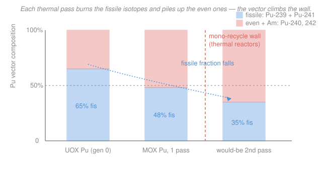

# Nuclear Fuel Cycle & Policy · Lesson 3.5: Recycling — MOX & the plutonium balance

> ⏱ ~15 min · Module 3: The Back End — Spent Fuel, Reprocessing & Waste · Builds on: [3.4 Reprocessing: PUREX & separations](03-04-reprocessing-purex-separations.md) · Unlocks: [4.1 Fast reactors & breeding](04-01-fast-reactors-breeding.md), [4.3 Nonproliferation, safeguards & security](04-03-nonproliferation-safeguards-security.md)

## Why this matters

PUREX hands you a jar of separated plutonium. The whole case for reprocessing rests on what you do next: burn that plutonium as fuel instead of burying it. **MOX** — mixed-oxide fuel — is how the world actually does this, and France, Japan, and others run it at scale. But the plutonium you get back is not the plutonium you started with: every trip through a thermal reactor makes it *dirtier* and *less fissile*, and the arithmetic of how much you consume versus how much you keep breeding decides whether recycling actually closes the fuel cycle — or barely dents it.

## The idea

Enriched \ce{UO2} fuel gets its reactivity from \ce{^{235}U}. Plutonium's fissile isotopes (\ce{^{239}Pu}, \ce{^{241}Pu}) do the same job. So instead of paying the enrichment plant for more \ce{^{235}U}, you can blend separated \ce{PuO2} into cheap **depleted** \ce{UO2} (the tails left over from enrichment, mostly \ce{^{238}U}) and press pellets from the mix. That is MOX: plutonium standing in for enrichment.

Here's the catch the brochures skip. Reactor-grade plutonium is not pure \ce{^{239}Pu} — it's a *vector*, a mix of isotopes 238 through 242. In a thermal (slow-neutron) reactor the fissile isotopes get preferentially eaten, while the even-numbered ones (\ce{^{240}Pu}, \ce{^{242}Pu}) mostly just capture neutrons and pile up. Think of it like distilling the same bottle twice: each pass strips out the good stuff and concentrates the dregs. After **one** MOX pass the plutonium is degraded enough that a *second* thermal recycle stops paying off — that's the **mono-recycle wall**. Getting past it takes a fast reactor, which fissions the dregs too.

## The formal version

**MOX composition.** A MOX pellet is
$$\ce{PuO2} \;(\text{fraction } w_{\text{Pu}}) \;+\; \ce{UO2}\ (\text{depleted, } 1-w_{\text{Pu}}),$$
where $w_{\text{Pu}}$ is the total-plutonium weight fraction of the heavy metal, typically $7\text{–}10\%$. *In words:* a few percent of separated plutonium blended into otherwise-inert depleted uranium, chosen so the assembly's reactivity matches the enriched \ce{UO2} (UOX) assemblies it sits beside.

**The plutonium vector and its fissile fraction.** Write the vector as the mass fractions $(f_{238}, f_{239}, f_{240}, f_{241}, f_{242})$ summing to 1. The quantity that matters for reactivity is the **fissile fraction**
$$f_{\text{fis}} = f_{239} + f_{241}.$$
*In words:* only the odd-mass isotopes fission readily on thermal neutrons; $f_{\text{fis}}$ is the fraction of the plutonium that actually pulls its weight in a slow-neutron core. Reactor-grade Pu from spent UOX runs $f_{\text{fis}}\approx 0.60\text{–}0.65$.

**Isotopic degradation.** In a thermal spectrum each isotope has a capture-vs-fission fate. \ce{^{239}Pu} absorbs a neutron and *either* fissions ($\sim 65\%$) *or* captures ($\sim 35\%$) up to \ce{^{240}Pu}. \ce{^{240}Pu} is nearly non-fissile thermally, so it mostly captures to \ce{^{241}Pu}; \ce{^{241}Pu} fissions or climbs to \ce{^{242}Pu}; \ce{^{242}Pu} is a near-inert thermal poison. The ladder runs
$$\ce{^{239}Pu ->[(n,\gamma)] ^{240}Pu ->[(n,\gamma)] ^{241}Pu ->[(n,\gamma)] ^{242}Pu}.$$
*In words:* neutrons burn the fissile rungs and shove survivors up the ladder into the dead even isotopes, so $f_{\text{fis}}$ falls with every pass. On top of that, \ce{^{241}Pu} beta-decays to \ce{^{241}Am} (half-life $\approx 14.3$ yr, a strong non-fissile absorber), so the vector *keeps degrading on the shelf* between separation and fabrication.

**Mono-recycle limit.** After one thermal MOX pass, $f_{\text{fis}}$ drops from $\sim 0.65$ to $\sim 0.45$–$0.50$. To hold reactivity you would have to load so much total Pu into a second-generation MOX that the reactor physics turns hostile (spectrum hardening degrades the void/moderator feedback and depresses control-rod and boron worth). *In words:* thermal reactors get essentially **one** productive recycle out of a batch of plutonium; multi-recycle needs a fast spectrum (Lesson 4.1).

## Picture

## Worked examples

**Example 1 (the plutonium balance — how much UOX feeds one MOX).**

A UOX assembly discharged at typical burnup contains about $1.0\%$ plutonium by heavy-metal mass. Take a MOX design at $w_{\text{Pu}} = 8\%$ total plutonium. Work per tonne of heavy metal (tHM).

*Plutonium bred by UOX.* One tonne of spent UOX at $1.0\%$ Pu holds
$$m_{\text{Pu}}^{\text{UOX}} = 0.010 \times 1000\ \text{kg} = 10\ \text{kg Pu / tHM}.$$

*Plutonium needed by MOX.* One tonne of MOX at $8\%$ Pu needs
$$m_{\text{Pu}}^{\text{MOX}} = 0.08 \times 1000\ \text{kg} = 80\ \text{kg Pu / tHM}.$$

*The ratio.* To source one tonne of MOX you must reprocess
$$\frac{m_{\text{Pu}}^{\text{MOX}}}{m_{\text{Pu}}^{\text{UOX}}} = \frac{80}{10} = 8\ \text{tonnes of spent UOX}.$$
Assemblies of like heavy-metal mass, that is roughly **8 UOX assemblies reprocessed per MOX assembly built** — matching the industry rule-of-thumb of about 7–8 to 1.

*Does it close the cycle?* Load $80$ kg Pu/t; MOX spent fuel discharges around $5.5\%$ Pu $\approx 55$ kg/t (it started so Pu-rich, and the even isotopes accumulate). So one MOX pass nets
$$\Delta m_{\text{Pu}} = 55 - 80 = -25\ \text{kg / tHM},$$
destroying only about $\tfrac{25}{80}\approx 30\%$ of the plutonium you fed it — and *degrading* the $55$ kg that survives into a form only a fast reactor can reuse. Meanwhile the surrounding UOX fleet keeps breeding $\sim 10$ kg/t. **Net: MOX shaves the plutonium-accumulation rate and draws down separated-Pu stockpiles, but it does not zero them.** That modest, one-shot reduction is the whole reason people say MOX "barely closes the cycle" in light-water reactors.

**Example 2 (why the fissile fraction falls, and why that caps you at one pass).**

Toy the degradation quantitatively. Start with $100$ kg of reactor-grade Pu: $65$ kg fissile (239 + 241), $35$ kg even (240 + 242). Track it through one thermal MOX irradiation.

The fissile isotopes have the largest thermal absorption cross sections, so they get consumed fastest — say the $65$ kg fissile shrinks to $\sim 40$ kg (some fissioned for energy, some captured upward into the even column). The even isotopes lose a little to fast fission but *gain* the captures raining down from above, so $35$ kg rises to $\sim 40$ kg. Total mass falls to $\sim 80$ kg (the fissioned atoms left as energy + fission products). New vector:
$$f_{\text{fis}} = \frac{40}{40+40} = 50\% \quad(\text{down from } 65\%).$$
Then let the separated Pu sit a decade before you refabricate: \ce{^{241}Pu} decays to \ce{^{241}Am}, moving a few more kg from the fissile column to a non-fissile poison, pushing $f_{\text{fis}}$ lower still.

Now try a *second* thermal pass. Reactivity roughly tracks the fissile mass you load, so to match a fresh MOX assembly's $0.08 \times 0.65 = 0.052$ fissile-Pu weight fraction, you would need
$$w_{\text{Pu}}^{(2)} = \frac{0.052}{f_{\text{fis}}^{(2)}} \approx \frac{0.052}{0.40} \approx 13\%$$
total plutonium — a lot more \ce{PuO2}, dominated by dead even isotopes and \ce{^{241}Am}. That much plutonium hardens the neutron spectrum, worsens the moderator/void feedback, and eats away control-rod and soluble-boron worth — the safety margins a licensed core needs. So thermal recycling stops at **one productive pass**: the mono-recycle wall is set by degraded physics, not by chemistry. Fast reactors (Lesson 4.1) fission the even isotopes directly, which is exactly why *they* can multi-recycle.

## Watch out

- **You might think MOX "gets rid of" the plutonium.** It removes only ~30% per pass and *downgrades* the rest into a stranded, hard-to-use vector. Without a fast-reactor tier behind it, LWR MOX manages plutonium — it does not eliminate it.
- **You might think reactor-grade Pu is "just weaker weapons material."** For fuel accounting the point is different: the growing \ce{^{240}Pu}/\ce{^{242}Pu} content is a *reactivity* penalty and a heat/neutron nuisance in fabrication. (Its proliferation angle is Lesson [4.3](04-03-nonproliferation-safeguards-security.md).)
- **You might think separated plutonium is stable in the jar.** It isn't: \ce{^{241}Pu} beta-decays to \ce{^{241}Am} on a ~14-year clock, so aged plutonium loses fissile worth and gains a gamma-active poison — MOX plants must fabricate reasonably promptly or strip the americium back out.

## One-liner

> MOX lets plutonium stand in for enrichment, but each thermal pass burns the fissile isotopes and concentrates the dead ones — so light-water recycling gets one productive lap, destroys only a third of the plutonium it loads, and needs a fast reactor to truly close the loop.

## Problems

**P1 (🟢)** A MOX design uses $w_{\text{Pu}} = 9\%$ total plutonium, and the spent UOX being reprocessed assays $1.2\%$ Pu by heavy metal. Working per tonne, how many tonnes of spent UOX must be reprocessed to build one tonne of MOX?

**P2 (🟡)** Reactor-grade plutonium has vector $(f_{238},f_{239},f_{240},f_{241},f_{242}) = (0.02,\,0.55,\,0.24,\,0.13,\,0.06)$.
(a) Compute the fissile fraction $f_{\text{fis}}$.
(b) After ~14 years of storage, half of the \ce{^{241}Pu} has decayed to \ce{^{241}Am}. Recompute $f_{\text{fis}}$ (treat the total mass as unchanged; \ce{^{241}Am} is non-fissile). By how many percentage points did it drop, and what does that force MOX fabricators to do?

**P3 (🔴, optional)** Using Example 1's numbers ($10$ kg Pu bred per t UOX; MOX loads $80$ kg/t and discharges $55$ kg/t), consider a fleet that reprocesses $8$ t of spent UOX to fuel $1$ t of MOX. Over that whole $8\text{ t UOX} + 1\text{ t MOX}$ chunk, how many kg of plutonium exist at the end versus the $80$ kg that were separated to start the MOX? What fraction of the fed plutonium was actually fissioned, and why does this make LWR MOX a poor *stand-alone* strategy for eliminating plutonium?

Solutions

**P1** Per tonne of MOX you need $0.09 \times 1000 = 90$ kg Pu. Each tonne of spent UOX supplies $0.012 \times 1000 = 12$ kg Pu. So
$$\frac{90}{12} = 7.5\ \text{tonnes of spent UOX per tonne of MOX}.$$
Right in the industry's 7–8 : 1 band.

**P2** (a) $f_{\text{fis}} = f_{239} + f_{241} = 0.55 + 0.13 = 0.68$.
(b) Half the \ce{^{241}Pu} ($0.13$) decays: $\ce{^{241}Pu}$ falls to $0.065$, and \ce{^{241}Am} grows to $0.065$ (non-fissile). New fissile fraction
$$f_{\text{fis}}' = 0.55 + 0.065 = 0.615.$$
Drop $= 0.68 - 0.615 = 0.065$, i.e. **6.5 percentage points** of fissile worth lost just sitting on the shelf. It forces fabricators to use the plutonium promptly after separation (or chemically strip the in-grown \ce{^{241}Am} before pressing pellets), and to over-load $w_{\text{Pu}}$ to compensate for aging.

**P3** Start: $80$ kg separated Pu (from the $8$ t UOX, which bred $8\times 10 = 80$ kg — consistent). After the MOX pass, the $1$ t MOX discharges $55$ kg Pu. So the chunk ends with **55 kg** of plutonium versus **80 kg** at the start:
$$\text{fissioned} = 80 - 55 = 25\ \text{kg}, \qquad \frac{25}{80} \approx 31\%.$$
Only ~31% of the plutonium was actually destroyed; ~69% survives, now *degraded* (low $f_{\text{fis}}$, high even-isotope + \ce{^{241}Am}) and stranded because a second thermal pass hits the mono-recycle wall. As a stand-alone plutonium-elimination scheme it fails: it removes a minority of the inventory per pass and cannot recurse in thermal reactors — you need a fast-reactor tier (Lesson 4.1) to fission the remainder.

## Flashback

**From Lesson 3.4 (PUREX mass split):** A reprocessing plant runs $5$ tHM of light-water spent fuel through PUREX. The feed splits into uranium ($95.0\%$), plutonium ($1.0\%$), and combined minor actinides + fission products ($4.0\%$) by mass. Find the mass of each product stream, and state how much MOX (at $8\%$ Pu) that plutonium could fabricate.

Solution

Total heavy-metal mass $= 5000$ kg. Apply the fractions:
$$m_U = 0.950 \times 5000 = 4750\ \text{kg},$$
$$m_{\text{Pu}} = 0.010 \times 5000 = 50\ \text{kg},$$
$$m_{\text{MA+FP}} = 0.040 \times 5000 = 200\ \text{kg}.$$
Check: $4750 + 50 + 200 = 5000$ kg. ✓ The uranium stream dwarfs the rest — that is why PUREX is built around recovering \ce{U} and \ce{Pu} while the small, intensely radioactive raffinate carries almost all the hazard.

MOX at $w_{\text{Pu}} = 8\%$ needs $80$ kg Pu per tonne, so $50$ kg makes
$$\frac{50}{80} = 0.625\ \text{tHM of MOX}.$$
Just over half a tonne of fresh fuel from five tonnes of spent fuel's plutonium — the plutonium balance of Example 1, seen from the separations side.

## Connections

- **Backward:** the separated \ce{PuO2} that MOX consumes comes straight out of [3.4 PUREX](03-04-reprocessing-purex-separations.md); the plutonium was bred in-core by \ce{^{238}U} capture, first tracked in [2.3 Burnup & the linear reactivity model](02-03-burnup-depletion-linear-reactivity-model.md), and its hazard characterized in [3.2 Spent-fuel isotopics & radiotoxicity](03-02-spent-fuel-isotopics-radiotoxicity.md).
- **Forward:** the mono-recycle wall is exactly the problem [4.1 Fast reactors & breeding](04-01-fast-reactors-breeding.md) solves — a fast spectrum fissions the even isotopes and enables multi-recycle — while the existence of separated, fabricable plutonium is the central worry of [4.3 Nonproliferation, safeguards & security](04-03-nonproliferation-safeguards-security.md).
- **Sideways (reactor physics):** why a core can only take so much MOX before the void/moderator feedback and control-rod worth degrade is spectrum physics — the same neutron-economy reasoning developed in [reactor-physics](../../reactor-physics/syllabus.md).
