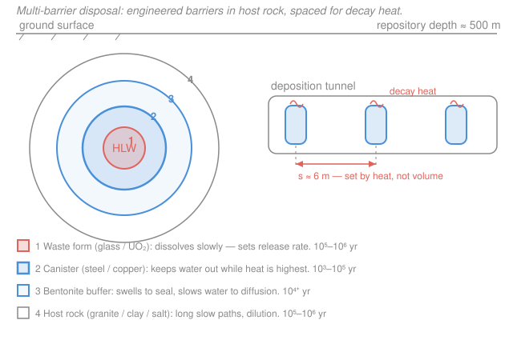

# Nuclear Fuel Cycle & Policy · Lesson 3.6: Geological disposal & the repository

> ⏱ ~15 min · Module 3: The Back End — Spent Fuel, Reprocessing & Waste · Builds on: [3.1 Decay heat & the source term](03-01-decay-heat-source-term.md), [3.2 Spent-fuel isotopics & radiotoxicity](03-02-spent-fuel-isotopics-radiotoxicity.md), [3.3 Waste classification & interim storage](03-03-waste-classification-interim-storage.md) · Unlocks: Module 4 (alternative cycles that change the waste, starting [4.1 Fast reactors & breeding](04-01-fast-reactors-breeding.md))

## Why this matters

Everything upstream — mining, enrichment, burnup, reprocessing — eventually funnels to one question the industry has spent fifty years and billions of dollars circling: *where does the high-level waste finally go?* The answer almost everyone converges on is **deep geological disposal**: bury it roughly 500 m down in a stable rock formation and let a stack of barriers hold it for longer than human civilization has existed. This lesson closes Module 3 by making two quantitative claims precise — that safety comes from *many imperfect barriers*, not one perfect one, and that the repository's size is set by **heat, not volume**. Finland's Onkalo is now licensed to start emplacing; the physics below is why its canisters sit meters apart in the granite.

## The idea

Two ideas do the whole job.

**Defense in depth.** You don't trust any single thing to last a million years. You trust a *chain* of independent barriers, each buying time on its own timescale: a waste form that dissolves at a crawl, a metal canister that keeps water out, a clay buffer that seals the canister in and throttles any water to a slow ooze, and finally the geology — hundreds of meters of undisturbed rock with no fast path to the surface. Water has to defeat *all* of them, in sequence, to carry a radionuclide back to the biosphere. If the canister is breached early, the buffer and rock still stand; if the glass leaches faster than hoped, the canister and clay still stand. Safety is the *product* of many "good enough" barriers.

**Heat sets the footprint.** Spent fuel is still warm — decay heat ([3.1](03-01-decay-heat-source-term.md)) doesn't switch off at shutdown, and even after decades of cooling a canister radiates on the order of a kilowatt. Pack canisters too tightly and their heat overlaps, driving the rock and the bentonite clay above the temperature where the clay dries out, cracks, and stops sealing (and the rock itself can microfracture). So the engineers don't pack by volume — they *space canisters apart* until each one's heat can escape without the neighbors piling on. The repository sprawls not because the waste is bulky (all the world's HLW would fit in a large building) but because it's *hot*.

## The formal version

**Multi-barrier system.** Model the containment as a series of barriers $B_1, B_2, \dots, B_n$, each with a probability $p_i$ of failing to contain over the period of interest. If they fail independently, the probability that a radionuclide escapes all of them is

$$P_\text{escape} = \prod_{i=1}^{n} p_i .$$

*In words: because the barriers are in series and independent, their failure probabilities multiply — four barriers each only 90% reliable still give $0.1^4 = 10^{-4}$ escape, which is why "good enough, many times over" beats "perfect, once."* (This is a heuristic for the intuition; a real safety case tracks time-dependent release rates, not a single number.)

**Steady-state heat spread from one canister.** Treat a canister as a small sphere of radius $a$ (m) releasing thermal power $Q$ (W) into rock of thermal conductivity $k$ (W·m⁻¹·K⁻¹). Steady radial conduction gives the temperature rise a distance $r$ from the canister center:

$$\Delta T(r) = \frac{Q}{4\pi k\, r}, \qquad r \ge a .$$

*In words: heat spreads outward over spheres of area $4\pi r^2$, so the temperature rise falls off like $1/r$ — hottest at the canister wall, fading with distance.* The canister's own surface therefore sits at a **self-heating** rise

$$\Delta T_\text{self} = \frac{Q}{4\pi k\, a}.$$

**Superposition sets the spacing.** Conduction is linear, so temperatures from several canisters add. A neighbor a distance $s$ away raises the temperature at *our* canister by $\Delta T(s) = Q/(4\pi k\, s)$. If our canister has $N$ nearby neighbors, the hottest point (its own wall) must satisfy

$$\Delta T_\text{self} + N\,\frac{Q}{4\pi k\, s} \;\le\; \Delta T_\text{max} = T_\text{limit} - T_\text{rock},$$

where $T_\text{limit}$ is the buffer/rock temperature ceiling (often ~100 °C, set by drying the bentonite) and $T_\text{rock}$ is the ambient rock temperature at depth. Solving for the spacing,

$$\boxed{\,s \;\ge\; \frac{N\,Q}{4\pi k\,\bigl(\Delta T_\text{max} - \Delta T_\text{self}\bigr)}\,}$$

*In words: the more heat each canister makes ($Q$), and the less thermal budget is left after its own self-heating, the farther apart they must sit — heat, not waste volume, drives the pitch.* Notice the pathology hiding in the denominator: if self-heating alone eats most of $\Delta T_\text{max}$, the required spacing blows up — which is exactly why fuel is cooled for decades first (lowering $Q$) before emplacement.

## Picture

## Worked examples

**Example 1 — thermal spacing (heat drives the footprint).** A spent-fuel canister releases $Q = 1000$ W into granite with $k = 2.5$ W·m⁻¹·K⁻¹. The canister radius is $a = 0.5$ m, the rock at depth sits at $T_\text{rock} = 25$ °C, and we must keep the bentonite buffer below $T_\text{limit} = 100$ °C, so $\Delta T_\text{max} = 75$ °C. Along a deposition tunnel each canister has $N = 2$ nearest neighbors. Find the minimum spacing.

*Step 1 — self-heating.* The canister's own wall rise:

$$\Delta T_\text{self} = \frac{Q}{4\pi k\, a} = \frac{1000}{4\pi (2.5)(0.5)} = \frac{1000}{15.71} = 63.7\ \text{°C}.$$

A *lone* canister therefore sits at $25 + 63.7 = 88.7$ °C — already most of the way to the 100 °C ceiling, and this comes entirely from its own heat crossing the buffer.

*Step 2 — budget left for neighbors.* Only $\Delta T_\text{max} - \Delta T_\text{self} = 75 - 63.7 = 11.3$ °C of thermal headroom remains before the buffer overheats.

*Step 3 — spacing from superposition.* Each neighbor contributes $Q/(4\pi k\, s) = 1000/(31.42\,s) = 31.8/s$ °C at our canister. With two neighbors,

$$2\times\frac{31.8}{s} \le 11.3 \;\Longrightarrow\; s \ge \frac{63.7}{11.3} \approx 5.6\ \text{m}.$$

So the canisters must sit at least ~5.6 m apart — strikingly close to the ~6 m deposition-hole pitch of Finland's KBS-3 design. **The waste itself is tiny; the 5.6 m of empty rock between canisters is pure thermal management.** Fill a repository "by volume" and you'd cook the clay.

**Example 2 — barrier logic (walk the defense in depth).** Take a single emplaced canister and follow water's uphill battle to release a radionuclide, naming what each barrier does and on what timescale:

1. **Waste form (vitrified borosilicate glass, or the UO₂ ceramic itself).** Even if water reaches it, the glass dissolves at microns per thousand years, so it *meters out* radionuclides rather than dumping them. This sets the release *rate* for the whole system — the slowest, longest-acting barrier, relevant across $10^5$–$10^6$ yr.
2. **Canister (thick steel, often a copper overpack).** Its job is brute exclusion: keep liquid water off the waste form entirely during the period when heat and radiation are most intense and the inventory most hazardous. Design lifetimes run $10^3$–$10^5$ yr; corrosion in the near-anoxic deep is slow.
3. **Bentonite clay buffer.** Packed around the canister, it *swells* on contact with trace water to seal every gap, cutting water movement down to molecular *diffusion* (no flow), buffering the chemistry, and cushioning small rock shifts. It protects the canister and retards any escaped ions for $\gtrsim 10^4$ yr — as long as it stays below the temperature that would dry and crack it (the very limit Example 1 enforces).
4. **Host rock (granite, clay, or salt).** The natural barrier: hundreds of meters of undisturbed, low-permeability rock chosen for slow groundwater and no fast path up. It dilutes and delays whatever finally gets through, over $10^5$–$10^6$ yr.

No single barrier is asked to be perfect for a million years. Each covers the era it's best at, and they overlap — that's defense in depth (and why $P_\text{escape}=\prod p_i$ is so forgiving).

## Watch out

- **You might think a repository is sized by how much waste there is — actually it's sized by heat.** Footprint is set by thermal loading, so *cooler* waste packs tighter: longer surface cooling, or removing the heat-generating actinides by reprocessing ([3.4](03-04-reprocessing-purex-separations.md)/[3.5](03-05-recycling-mox-plutonium-balance.md)), can shrink the required area several-fold for the same tonnage.
- **You might think the goal is one flawless, eternal barrier — actually it's many imperfect ones.** The safety case rests on the *geology* plus redundancy, not on any engineered part surviving $10^6$ yr, and not on human institutions guarding the site that long. Passive safety is the whole point.
- **You might think retrievability and permanence contradict each other — they don't.** Designs keep canisters retrievable for decades (mistakes, better ideas, resource recovery) while remaining *passively* safe forever. WIPP (defense transuranic waste, in New Mexico salt) is operating; the salt slowly creeps in and self-seals. Yucca Mountain (Nevada tuff) was the U.S. HLW plan but was defunded politically — a reminder that repositories die of consent, not physics.

## One-liner

> Bury it deep behind a chain of independent barriers, then space the canisters so their own decay heat — not their volume — can't cook the rock.

## Problems

**P1 (🟢)** A single canister emits $Q = 1200$ W into a clay host rock with $k = 1.5$ W·m⁻¹·K⁻¹. The canister radius is $a = 0.45$ m and the ambient rock is at $30$ °C. Using $\Delta T_\text{self} = Q/(4\pi k a)$, find the canister-wall temperature for a *lone* canister. If the buffer limit is $100$ °C, what does your answer imply the designers must do *before* they even worry about spacing?

**P2 (🟡)** Canisters emit $Q = 1400$ W into granite with $k = 3.0$ W·m⁻¹·K⁻¹, radius $a = 0.5$ m, ambient rock $20$ °C, buffer limit $100$ °C, and $N = 2$ nearest neighbors along a tunnel. (a) Find $\Delta T_\text{self}$ and confirm a lone canister is within limit. (b) Find the minimum spacing $s$. (c) In one sentence, why is $s$ so sensitive here?

**P3 (🔴)** Suppose advanced reprocessing/partitioning ([3.5](03-05-recycling-mox-plutonium-balance.md)) removes enough heat-generating actinides to *halve* the per-canister power in P2, from $1400$ W to $700$ W (all else identical). Recompute the minimum spacing and comment on what that does to the repository's footprint — and what that implies for the reprocessing-vs-direct-disposal debate.

Solutions

**P1.** Self-heating:

$$\Delta T_\text{self} = \frac{Q}{4\pi k\, a} = \frac{1200}{4\pi(1.5)(0.45)} = \frac{1200}{8.48} = 141.5\ \text{°C}.$$

Canister wall $= 30 + 141.5 = 171.5$ °C — already **far above** the 100 °C buffer limit, for a *single* canister with no neighbors at all. Clay's low conductivity ($k=1.5$) is punishing: the heat can't get away. Spacing can't fix this — the fix must come *first*, by lowering $Q$ (cool the fuel much longer at surface, so more decay heat has died away — [3.1](03-01-decay-heat-source-term.md)), reducing the fuel loading per canister, or enlarging the buffer/canister geometry. *Lesson: sometimes it's the self term, not the neighbors, that binds.*

**P2.** (a) Self-heating:

$$\Delta T_\text{self} = \frac{1400}{4\pi(3.0)(0.5)} = \frac{1400}{18.85} = 74.3\ \text{°C} \;\Rightarrow\; \text{wall} = 20 + 74.3 = 94.3\ \text{°C} < 100\ \text{°C}. \checkmark$$

A lone canister just fits. (b) Headroom for neighbors: $\Delta T_\text{max} - \Delta T_\text{self} = (100-20) - 74.3 = 5.7$ °C. Each neighbor adds $Q/(4\pi k\,s) = 1400/(37.70\,s) = 37.1/s$ °C, so with two:

$$2\times\frac{37.1}{s} \le 5.7 \;\Longrightarrow\; s \ge \frac{74.3}{5.7} \approx 13.0\ \text{m}.$$

(c) Because self-heating already ate almost all of the $80$ °C budget, only $5.7$ °C is left for neighbors — a tiny denominator in $s \ge NQ/[4\pi k(\Delta T_\text{max}-\Delta T_\text{self})]$ — so the spacing balloons. Near the thermal limit, spacing is hypersensitive to how hot each canister runs.

**P3.** With $Q = 700$ W (half of P2), everything scales:

$$\Delta T_\text{self} = \frac{700}{18.85} = 37.1\ \text{°C} \;\Rightarrow\; \text{wall} = 57.1\ \text{°C}, \quad \Delta T_\text{max}-\Delta T_\text{self} = 80 - 37.1 = 42.9\ \text{°C}.$$

Each neighbor now adds $700/(37.70\,s) = 18.6/s$ °C, so

$$2\times\frac{18.6}{s} \le 42.9 \;\Longrightarrow\; s \ge \frac{37.1}{42.9} \approx 0.87\ \text{m}.$$

Spacing collapses from ~13 m to under 1 m — halving the heat cut the required pitch by more than $10\times$ (both because self-heating dropped *and* the leftover budget grew). Since footprint scales with pitch, the same tonnage now fits in a dramatically smaller repository — or one repository holds far more waste. *This is the core quantitative argument for reprocessing/partitioning: its payoff is not really volume but **thermal loading and long-term heat/radiotoxicity** ([3.2](03-02-spent-fuel-isotopics-radiotoxicity.md)).* Caveat worth stating: most *near-term* heat is Cs-137/Sr-90 (~30 yr half-lives), which ordinary U/Pu reprocessing does **not** remove — the big, durable footprint gain comes from stripping the long-lived minor actinides (Am, Cm), which dominate heat and hazard past a few centuries. Whether that gain justifies reprocessing's cost and proliferation risk is exactly the Module 3 → Module 4 debate.

## Flashback

**From Lesson 3.1 (Decay heat & the source term).** A reactor operating steadily at $P_0 = 2000$ MWth for $t_0 = 3$ years is scrammed. Using the Way–Wigner correlation $P(t)/P_0 = 0.066\,[\,t^{-0.2} - (t+t_0)^{-0.2}\,]$ (all times in seconds), estimate the decay heat one hour after shutdown. Why does this rule out shipping fuel straight from the core to a repository?

Solution

Convert times to seconds: $t = 1\ \text{h} = 3600$ s, and $t_0 = 3\ \text{yr} = 3(3.156\times10^7) = 9.47\times10^7$ s, so $t + t_0 \approx 9.47\times10^7$ s.

$$t^{-0.2} = 3600^{-0.2} = 0.1946, \qquad (t+t_0)^{-0.2} = (9.47\times10^7)^{-0.2} = 0.0254.$$

$$\frac{P}{P_0} = 0.066\,(0.1946 - 0.0254) = 0.066 \times 0.1692 = 0.0112 = 1.12\%.$$

So the decay heat is $0.0112 \times 2000\ \text{MW} \approx 22\ \text{MW}$ — one hour after "shutdown," a scrammed 2 GW reactor still dumps 22 megawatts of pure decay heat with no chain reaction at all. That's why fuel goes to a water-filled pool for years first ([3.3](03-03-waste-classification-interim-storage.md)): the heat must decay by orders of magnitude before a passively cooled dry cask — let alone a sealed repository canister, where Example 1 showed even ~1 kW forces meters of spacing — can safely take it. Decay heat isn't zero at shutdown, and that single fact shapes the entire back end.

## Connections

- **Backward:** this lesson is where [3.1](03-01-decay-heat-source-term.md)'s decay heat, [3.2](03-02-spent-fuel-isotopics-radiotoxicity.md)'s long-lived actinide hazard, and [3.3](03-03-waste-classification-interim-storage.md)'s HLW classification and cooling requirement all cash out: heat sets the spacing, radiotoxicity sets the timescale the barriers must cover, and the cooling history sets the $Q$ you emplace with.
- **Forward:** Module 4's alternative cycles are, in part, attempts to *change the waste itself* — [4.1 fast reactors & breeding](04-01-fast-reactors-breeding.md) and partitioning-and-transmutation aim to burn the long-lived actinides that dominate repository heat and hazard, directly shrinking the footprint you just computed; [4.4 nuclear economics](04-04-nuclear-economics-lcoe.md) prices the back end.
- **Sideways (thermal-hydraulics & policy):** the conduction estimate here is the steady, single-source cousin of the transient decay-heat removal studied in nuclear thermal-hydraulics (see [reactor-thermal-hydraulics](../../reactor-thermal-hydraulics/syllabus.md)); and the fact that Yucca died politically while Onkalo advanced on consent is a live case for the political economy of infrastructure ([political-economy](../../political-economy/syllabus.md)) — repositories are solved in physics and unsolved in governance.
