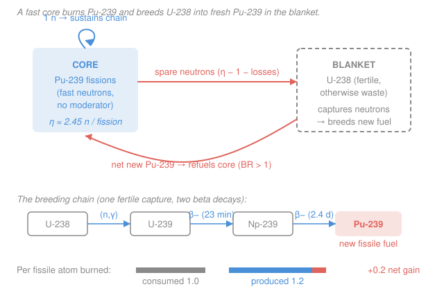

# Nuclear Fuel Cycle & Policy · Lesson 4.1: Fast reactors & breeding

> ⏱ ~15 min · Module 4: Alternative Cycles, Proliferation & Economics · Builds on: [3.5 Recycling: MOX & the plutonium balance](03-05-recycling-mox-plutonium-balance.md), [`reactor-physics`](../../reactor-physics/syllabus.md) · Unlocks: [4.2 The thorium cycle](04-02-thorium-cycle.md)

## Why this matters

A once-through light-water reactor fissions less than **one percent** of the uranium you dig up — it burns the 0.7% that is $^{235}$U (plus a little bred plutonium) and throws the rest away as depleted-uranium tails. The other 99% is $^{238}$U, "fertile" but not directly fissionable. A **breeder reactor** rewrites that story: it uses spare neutrons to turn $^{238}$U into fissile $^{239}$Pu *faster than it burns fissile*, making more fuel than it consumes. Do that and the known uranium resource stretches by a factor of ~60 — centuries of fuel from material we currently call waste. The catch is buried in two numbers you'll compute today: the **breeding ratio** (can it really make more than it burns?) and the **doubling time** (how long to breed enough surplus to start a second reactor?).

## The idea

Every fission of a fissile nucleus releases a handful of neutrons — call the yield-per-absorption $\eta$ ("eta"). Those neutrons have a to-do list. **Exactly one** must go on to trigger the next fission, or the chain reaction dies. Whatever neutrons are left over after that one — and after the unavoidable losses to leakage and parasitic capture in structure and coolant — are *spare*. A breeder's whole trick is to aim those spare neutrons at $^{238}$U nuclei sitting in a **blanket** around the core. A $^{238}$U that swallows a neutron becomes $^{239}$U, which beta-decays twice into $^{239}$Pu — brand-new fuel.

So the question "does it breed?" is really "how many spare neutrons do I have?" You need **more than one** left over per fissile atom destroyed: one to make the next fission's fuel by conversion, and enough margin to beat the losses. That is why the reactor is **fast** — no moderator, so neutrons stay at fission energies (~1 MeV) instead of being slowed to thermal. In a *fast* spectrum, $^{239}$Pu emits noticeably more neutrons per absorption ($\eta \approx 2.4$–$2.5$) than it does thermally ($\eta \approx 2.1$), because fewer absorptions end in a sterile (non-fission) capture and each fission spits out a bit more. That extra fraction of a neutron is the entire difference between a **converter** (makes some fuel, but less than it burns) and a **breeder** (net-positive fuel).

The second number, **doubling time**, is the sobering one. Making a little surplus per atom is easy; making a *whole reactor's worth* of surplus fissile is slow, because the surplus is a small slice of a very large inventory. That arithmetic — surplus is small, inventory is huge — is why breeders are measured in decades, and why the promised uranium bonanza has always been a long game.

## The formal version

**Breeding ratio.** Bookkeep neutrons *per fissile atom destroyed* (destroyed = fissioned or captured). Of the $\eta$ neutrons produced, one is spent sustaining the chain, a number $L$ is lost to leakage and parasitic (non-fuel, non-fertile) capture, and the rest are captured in fertile $^{238}$U to breed new $^{239}$Pu. Define the **breeding ratio**

$$\text{BR} = \frac{\text{fissile atoms produced}}{\text{fissile atoms consumed}} \;\approx\; \eta - 1 - L.$$

*In words: BR counts how many new fissile atoms you make for each one you burn; it equals your neutron yield minus the one neutron the chain reaction demands minus your losses.* $\text{BR} > 1$ is a **breeder** (net fuel gain); $\text{BR} = 1$ exactly replaces itself (a break-even converter); $\text{BR} < 1$ is a **converter** that slowly runs down its fissile. The surplus is the **breeding gain** $G = \text{BR} - 1$.

The fertile-to-fissile conversion the spare neutrons drive is

$$\ce{^{238}U ->[(n,\gamma)] ^{239}U ->[\beta^-] ^{239}Np ->[\beta^-] ^{239}Pu}$$

*In words: $^{238}$U absorbs a neutron to become $^{239}$U, which beta-decays (half-life ~23 min) to $^{239}$Np, which beta-decays again (~2.4 days) to the fissile end-product $^{239}$Pu.* (The thorium cycle in [4.2](04-02-thorium-cycle.md) runs the same play with $\ce{^{232}Th -> ^{233}U}$.)

**Doubling time.** A breeder produces surplus fissile at a net rate

$$\dot M_{\text{net}} = G \cdot \dot M_{\text{burn}} = (\text{BR} - 1)\,\dot M_{\text{burn}},$$

where $\dot M_{\text{burn}}$ (kg/yr) is the rate at which the reactor destroys fissile. To fuel a *second* reactor you must accumulate one full fissile inventory $M_0$ (kg) — the amount tied up in the core plus the out-of-core fuel-cycle pipeline. The **linear (simple) doubling time** is just inventory over surplus rate:

$$\boxed{\,t_D \;=\; \frac{M_0}{\dot M_{\text{net}}} \;=\; \frac{M_0}{(\text{BR}-1)\,\dot M_{\text{burn}}}\,}$$

*In words: the doubling time is how long the net surplus takes to pile up one reactor's worth of fissile — a big inventory divided by a small annual gain, so it lands in the decades.* (If instead you immediately reinvest each bit of surplus into building reactors, the fleet grows exponentially and the *compound* doubling time is $t_D\ln 2 \approx 0.69\,t_D$ — shorter, but still decades.)

## Picture

## Worked examples

**Example 1 (breeding ratio — count the neutrons).** A sodium-cooled fast reactor runs on $^{239}$Pu. In its fast spectrum the reproduction factor is $\eta = 2.45$. Estimate losses to leakage and parasitic capture at $L = 0.25$ neutrons per fissile atom destroyed. Find the breeding ratio, the breeding gain, and interpret.

Neutron budget per fissile atom destroyed: start with $\eta = 2.45$ produced, subtract the 1 that must sustain the chain, subtract the $L = 0.25$ lost:

$$\text{BR} = \eta - 1 - L = 2.45 - 1 - 0.25 = 1.20.$$

Breeding gain $G = \text{BR} - 1 = 0.20$. **Interpretation:** for every fissile atom the reactor burns, it lays down 1.2 new ones in the blanket — a net gain of 0.2, i.e. it ends each pass with **20% more fissile than it started**. That surplus is manufactured out of $^{238}$U that a light-water reactor would have discarded.

Why couldn't a *thermal* reactor do this? Thermal $^{235}$U has $\eta \approx 2.07$: after the 1 neutron for the chain, only ~0.07 is spare, and real losses ($L \sim 0.4$–$0.5$) devour it — so a thermal converter runs $\text{BR} \approx 0.6 < 1$. The fast spectrum's extra ~0.35 neutron of $\eta$ is the whole margin that flips converter into breeder.

**Example 2 (doubling time — inventory over surplus).** The same reactor holds a fissile inventory (core plus out-of-core pipeline) of $M_0 = 4000\ \text{kg}$ and destroys fissile at $\dot M_{\text{burn}} = 1000\ \text{kg/yr}$. (That burn rate is roughly what a ~2700-MW-thermal core does — complete fission of about 1 g of fissile yields ~1 MW·day of heat.) With $\text{BR} = 1.20$ from Example 1, find the linear doubling time.

Net surplus rate:

$$\dot M_{\text{net}} = (\text{BR}-1)\,\dot M_{\text{burn}} = 0.20 \times 1000\ \text{kg/yr} = 200\ \text{kg/yr}.$$

Linear doubling time:

$$t_D = \frac{M_0}{\dot M_{\text{net}}} = \frac{4000\ \text{kg}}{200\ \text{kg/yr}} = 20\ \text{years}.$$

*Check:* units $\text{kg} / (\text{kg/yr}) = \text{yr}$ ✓. **Why so long?** The surplus (200 kg/yr) is only a fifth of the burn rate, and it has to accumulate a *whole* 4000-kg inventory before reactor #2 can start. Even reinvesting continuously (compound) only cuts it to $20\ln 2 \approx 14$ years. This decades-long horizon — not physics, but arithmetic — is why the world never built its way to a breeder economy: by the time a breeder doubles, cheap mined uranium has usually undercut the whole rationale.

## Watch out

- **You might think any $\eta > 2$ breeds.** Not quite — breeding needs $\eta - 1 - L > 1$, i.e. $\eta > 2 + L$. With losses $L \approx 0.25$ you need $\eta > 2.25$. Thermal $^{235}$U ($\eta \approx 2.07$) and even thermal $^{239}$Pu ($\eta \approx 2.1$) fall short once losses are counted; only the *fast*-spectrum $\eta \approx 2.45$ clears the bar. The spectrum, not just the isotope, decides it.
- **You might think a breeder makes energy from nothing.** It doesn't — it still fissions fissile atoms for its power, and it can only breed as many neutrons as fission provides. What it "creates" is *fuel*, by upgrading otherwise-useless fertile $^{238}$U into fissile $^{239}$Pu. Conservation is intact; the win is resource utilization (~60× more energy per tonne of mined uranium), not free energy.
- **You might expect doubling times of a year or two.** No — they're decades, because the surplus is a small fraction of a large inventory. Shrinking the inventory $M_0$ (compact core, fast out-of-core reprocessing turnaround) helps doubling time as much as raising the breeding ratio does.

## One-liner

> A fast spectrum gives $^{239}$Pu enough spare neutrons ($\eta \approx 2.45$) to both sustain the chain and breed $^{238}$U into new fuel, so $\text{BR} = \eta - 1 - L > 1$ — but the surplus is a thin slice of a big inventory, so doubling takes decades.

## Problems

**P1 (🟢)** A fast reactor running on $^{239}$Pu has reproduction factor $\eta = 2.40$ in its spectrum, and losses to leakage plus parasitic capture of $L = 0.30$ per fissile atom destroyed. (a) Compute the breeding ratio. (b) Is it a breeder? (c) State the breeding gain and say in one sentence what it means physically.

**P2 (🟡)** A fast breeder holds a fissile inventory of $M_0 = 5000\ \text{kg}$ (core plus out-of-core), destroys fissile at $\dot M_{\text{burn}} = 1200\ \text{kg/yr}$, and has a breeding ratio $\text{BR} = 1.15$. (a) Find the net surplus production rate. (b) Find the linear doubling time. (c) Name one design change that would shorten it, and say whether it changes the numerator or the denominator.

**P3 (🔴)** A fast-reactor concept expects neutron losses of $L = 0.35$ per fissile atom destroyed. (a) What is the minimum reproduction factor $\eta$ needed just to break even ($\text{BR} = 1$)? (b) Given thermal $^{235}$U ($\eta \approx 2.07$), thermal $^{239}$Pu ($\eta \approx 2.10$), and fast $^{239}$Pu ($\eta \approx 2.45$), which of the three can breed against these losses, and what is the one-sentence physical reason the fast option clears the bar?

Solutions

**P1** (a) $\text{BR} = \eta - 1 - L = 2.40 - 1 - 0.30 = 1.10$. (b) Yes — $\text{BR} = 1.10 > 1$, so it makes more fissile than it burns. (c) Breeding gain $G = \text{BR} - 1 = 0.10$: for every fissile atom consumed, the reactor breeds 0.1 extra fissile atom out of fertile $^{238}$U, a 10% net fuel surplus per pass. *Check:* smaller $\eta$ and larger $L$ than Example 1 both push BR down, and indeed $1.10 < 1.20$ ✓.

**P2** (a) $\dot M_{\text{net}} = (\text{BR}-1)\,\dot M_{\text{burn}} = 0.15 \times 1200 = 180\ \text{kg/yr}$.
(b) $t_D = M_0 / \dot M_{\text{net}} = 5000 / 180 \approx 27.8 \approx 28\ \text{years}$. *Check:* units $\text{kg}/(\text{kg/yr}) = \text{yr}$ ✓; lower BR and bigger inventory than Example 2 both lengthen it, and $28 > 20$ ✓.
(c) Any of: **raise the breeding ratio** (harder spectrum, thicker/better blanket) — increases the *denominator* via $(\text{BR}-1)$; or **shrink the inventory $M_0$** (more compact core, faster out-of-core reprocessing so less fissile sits idle in the pipeline) — decreases the *numerator*. Either shortens $t_D$. (Reinvesting surplus to grow a fleet instead switches you to the compound time $t_D\ln 2$.)

**P3** (a) Break-even means $\text{BR} = \eta - 1 - L = 1$, so $\eta = 2 + L = 2 + 0.35 = 2.35$. (b) Only **fast $^{239}$Pu** ($\eta = 2.45 > 2.35$) breeds; thermal $^{235}$U (2.07) and thermal $^{239}$Pu (2.10) both fall below 2.35 and would run $\text{BR} < 1$. The physical reason: $\eta$ rises with neutron energy for $^{239}$Pu — at fast energies a smaller fraction of absorptions are sterile captures and each fission releases slightly more neutrons — so removing the moderator is what buys the ~0.35 extra neutron that clears the $2 + L$ threshold. *Check:* consistent with Example 1's remark that the fast spectrum's higher $\eta$ is the margin that flips converter into breeder ✓.

## Flashback

**From Lesson 3.5 (MOX & the plutonium balance):** Reprocessing spent light-water-reactor fuel (UO₂ discharged near 45 GWd/tHM) recovers about 12 kg of plutonium per tonne of heavy metal, of which roughly 60% is fissile ($^{239}$Pu + $^{241}$Pu). A fast reactor needs a startup fissile inventory of 4000 kg. How many tonnes of spent LWR fuel must be reprocessed to bootstrap one fast reactor's first core-plus-pipeline load? Comment on what this implies for the breeder transition.

Solution

Fissile plutonium recovered per tonne of spent fuel: $0.60 \times 12\ \text{kg} = 7.2\ \text{kg fissile Pu per tHM}$.

Tonnes needed: $\dfrac{4000\ \text{kg}}{7.2\ \text{kg/tHM}} \approx 556\ \text{tHM}$ of spent LWR fuel.

*Check:* units $\text{kg}/(\text{kg/tHM}) = \text{tHM}$ ✓. A single large LWR discharges only ~20–25 tHM of spent fuel per year, so ~556 tHM is on the order of **25 reactor-years** of accumulated spent fuel to start just *one* fast reactor. This "startup inventory" bottleneck reinforces the doubling-time story: even before a breeder can begin doubling itself, you need a large stockpile of separated plutonium — from reprocessing (3.4/3.5) or from a slow initial breeding campaign — to fill its first inventory. Fissile scarcity at the front end, not the breeding ratio, is often the binding constraint on how fast a breeder economy can grow.

## Connections

- **Backward:** the spare-neutron bookkeeping is the four-factor $\eta$ from [`intro-nuclear-engineering` 3.4](../../intro-nuclear-engineering/lessons/03-04-criticality-four-factor-formula.md) pushed to its limit, and breeding is the **conversion ratio** of [2.3](02-03-burnup-depletion-linear-reactivity-model.md) driven above 1. The plutonium that seeds a fast core comes from the MOX/reprocessing balance in [3.5](03-05-recycling-mox-plutonium-balance.md).
- **Forward:** [4.2 The thorium cycle](04-02-thorium-cycle.md) runs the same conversion logic on $\ce{^{232}Th -> ^{233}U}$ — which, uniquely, can breed even in a *thermal* spectrum — and [4.3 Nonproliferation & safeguards](04-03-nonproliferation-safeguards-security.md) confronts the flip side of a blanket full of near-weapons-grade plutonium.
- **Sideways (reactor physics):** the entire argument hinges on how $\eta$ and the fission/capture cross-sections shift between thermal and fast spectra — the neutron-energy dependence developed in [`reactor-physics`](../../reactor-physics/syllabus.md). The blanket-and-core neutron economy here is a spatial multi-region version of the criticality balance you meet there.
