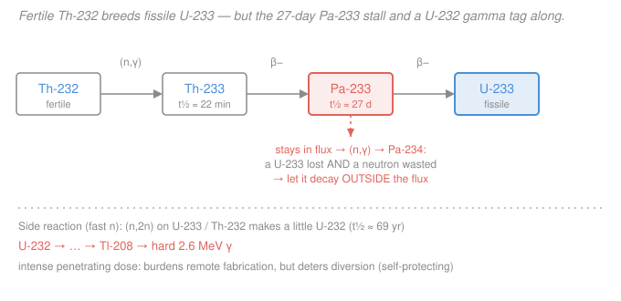

# Nuclear Fuel Cycle & Policy · Lesson 4.2: The thorium cycle

> ⏱ ~15 min · Module 4: Alternative Cycles, Proliferation & Economics · Builds on: [4.1 Fast reactors & breeding](04-01-fast-reactors-breeding.md) · Unlocks: [4.3 Nonproliferation, safeguards & security](04-03-nonproliferation-safeguards-security.md)

## Why this matters

Thorium is the perennial "road not taken" of nuclear power. It is three to four times more abundant than uranium, it breeds fissile fuel **in a slow (thermal) reactor** — something the uranium–plutonium cycle cannot do — and its waste carries far fewer long-lived transuranics. So why does no country run a thorium economy? Because the same chain that makes it attractive hands you two nasty engineering bills: a 27-day bottleneck isotope that eats neutrons, and a gamma-blazing contaminant that makes the fuel a nightmare to fabricate. This lesson weighs the promises against the headaches — the honest version, with numbers.

## The idea

Recall the breeding logic from [4.1](04-01-fast-reactors-breeding.md): a **fertile** nucleus (can't sustain a chain reaction) soaks up a neutron and transmutes into a **fissile** one (can). In the uranium cycle that's $\ce{^{238}U -> ^{239}Pu}$. Thorium's version is $\ce{^{232}Th -> ^{233}U}$: natural thorium is 100% Th-232, purely fertile — there is *no* natural fissile thorium isotope — so you must breed U-233 (or seed the reactor with U-235/Pu to get started).

The one number that decides whether breeding is even possible is $\eta$ (eta): **neutrons released per neutron absorbed in the fuel**. Every neutron a fissile atom absorbs has to do at least two jobs — one to keep the chain alive, one to convert a fertile atom — plus pay for parasitic losses. So breeding needs $\eta > 2$ with margin to spare.

Here is thorium's superpower. In a *thermal* (slow-neutron) spectrum, uranium and plutonium have $\eta$ barely above 2 — not enough after losses — so U–Pu breeding **only** works in a fast reactor. But U-233 keeps $\eta \approx 2.29$ in the thermal range, comfortably clearing the bar. **Thorium can breed with slow neutrons.** That means simpler, well-understood thermal reactors (even molten-salt designs) can be breeders — the cycle's signature advantage.

## The formal version

**The breeding chain.** Thorium climbs to fissile U-233 through two beta decays:

$$\ce{^{232}Th ->[(n,\gamma)] ^{233}Th ->[\beta^-] ^{233}Pa ->[\beta^-] ^{233}U}$$

*In words: fertile Th-232 captures a neutron to become Th-233, which beta-decays (half-life ~22 min) to protactinium-233, which beta-decays (half-life ~27 d) to fissile U-233.*

**The breeding condition.** Let $\eta$ be neutrons produced per neutron absorbed in fissile fuel, and let $L$ be the average parasitic loss (capture in structure/coolant/fission products + leakage) per fissile absorption. The **conversion ratio** $\text{CR}$ (fissile atoms bred per fissile atom destroyed) exceeds 1 — i.e. you *breed* — when

$$\eta \;>\; 2 + L .$$

*In words: one neutron sustains the chain, one replaces the fissile atom you just burned, and anything left over (beyond losses) makes net new fuel.* With a realistic $L \approx 0.2$, the threshold is $\eta \gtrsim 2.2$. Thermal values: U-233 $\approx 2.29$ (clears it), U-235 $\approx 2.07$, Pu-239 $\approx 2.11$ (both fall short — hence *fast* breeders for U–Pu).

**Headache 1 — the Pa-233 hold-up.** The intermediate Pa-233 has a *long* 27-day half-life, so a would-be U-233 atom spends weeks sitting in the neutron flux as protactinium. If Pa-233 absorbs a neutron before it decays, it becomes Pa-234 (→ U-234, a dead end), and you lose **both** a future U-233 atom **and** the neutron. Whether Pa-233 decays or captures is a race between its decay rate $\lambda$ and its capture rate $\sigma_a\phi$ (with $\sigma_a$ the absorption cross-section and $\phi$ the flux):

$$f_{\text{decay}} = \frac{\lambda}{\lambda + \sigma_a\phi}, \qquad \lambda = \frac{\ln 2}{27\ \text{d}} = 2.97\times10^{-7}\ \text{s}^{-1}.$$

*In words: the fraction of Pa-233 that survives to become U-233 falls as the flux rises.* The fix: keep the flux modest, or — the molten-salt trick — chemically pull protactinium out of the fuel into a shielded decay tank and return the U-233 afterward.

**Headache 2 — the U-232 contaminant.** Fast neutrons drive side reactions such as $\ce{^{233}U ->[(n,2n)] ^{232}U}$ (plus a Th-232 route), so a trace of U-232 ($t_{1/2}\approx 69$ yr) always rides along with the U-233. Its decay chain ends through thallium-208:

$$\ce{^{232}U -> ^{228}Th -> \; \cdots \; -> ^{212}Bi -> ^{208}Tl ->[\beta^-] ^{208}Pb}$$

and **Tl-208 emits a 2.6 MeV gamma** — one of the hardest, most penetrating gammas in the whole decay landscape. So spent (and even bred) thorium fuel is intensely, unavoidably radioactive: a real handling burden for fabrication, but also a built-in **proliferation deterrent** (see [4.3](04-03-nonproliferation-safeguards-security.md)).

## Picture

## Worked examples

**Example 1 (the Pa-233 hold-up, quantified).** How much of the bred protactinium actually reaches U-233? Use $\lambda = 2.97\times10^{-7}\ \text{s}^{-1}$ and $\sigma_a \approx 40\ \text{b} = 40\times10^{-24}\ \text{cm}^2$ for Pa-233, and compare two fluxes.

*A modest thermal breeder,* $\phi = 5\times10^{14}\ \text{cm}^{-2}\text{s}^{-1}$:

$$\sigma_a\phi = (40\times10^{-24})(5\times10^{14}) = 2.0\times10^{-8}\ \text{s}^{-1}, \qquad f_{\text{decay}} = \frac{2.97\times10^{-7}}{2.97\times10^{-7} + 2.0\times10^{-8}} = 0.94 .$$

So ~94% of the Pa-233 decays to U-233; ~6% is lost to capture. Tolerable.

*A high-flux core,* $\phi = 3\times10^{15}\ \text{cm}^{-2}\text{s}^{-1}$:

$$\sigma_a\phi = 1.2\times10^{-7}\ \text{s}^{-1}, \qquad f_{\text{decay}} = \frac{2.97\times10^{-7}}{2.97\times10^{-7} + 1.2\times10^{-7}} = 0.71 .$$

Now **29% of your would-be U-233 is destroyed before it is even born** — and every one of those captures also stole a neutron. Lesson: thorium breeding rewards *lower* flux (longer irradiation) or *removing* the protactinium from the flux entirely. This is exactly why fluid-fuel molten-salt designs, which can continuously extract Pa-233 to an out-of-core decay tank, are the natural home of thermal thorium breeding.

**Example 2 (the U-232 gamma: deterrent and burden).** Contrast handling U-233 with handling separated plutonium from PUREX ([3.4](03-04-reprocessing-purex-separations.md)).

Separated Pu-239 is essentially a pure **alpha** emitter — alphas are stopped by skin or a glovebox wall, so weapons-usable Pu can be machined and fabricated by hand behind thin shielding. That is precisely why PUREX-separated plutonium is such a proliferation concern.

U-233 comes bundled with U-232, whose chain produces the **2.6 MeV Tl-208 gamma**. That radiation is far too penetrating to glovebox: contact dose rates from aged U-233 with a few hundred ppm of U-232 reach the range that demands *remote, shielded* handling. Two consequences:

- **Deterrent / self-protection.** A would-be diverter can't casually carry or fabricate the material; the gamma signature also makes it easy to *detect*. The U-232 tag is often cited as intrinsic proliferation resistance.
- **Burden.** The *legitimate* fuel fabricator faces the same wall — remote hot-cell fabrication is slow and expensive, one of the practical reasons thorium fuel never went mainstream.

Crucially the gamma **grows in over ~1–2 years** after chemical separation (the chain must build back up through Th-228, $t_{1/2}\approx 1.9$ yr, before Tl-208 reaches its peak). So freshly separated U-233 is briefly "cleaner" — meaning the deterrent is real but not absolute, and U-233 remains genuinely weapons-usable (its IAEA significant quantity is 8 kg, the same as plutonium — [4.3](04-03-nonproliferation-safeguards-security.md)).

## Watch out

- **You might think thorium is a fuel you can just load and burn — it isn't.** Th-232 is 100% *fertile*. With no natural fissile thorium isotope, every thorium reactor needs a fissile starter (U-235, Pu, or U-233 from a prior cycle) and only becomes self-sustaining once it has bred up a U-233 inventory.
- **You might think "breeding needs a fast spectrum," carrying over the U–Pu rule from [4.1](04-01-fast-reactors-breeding.md).** For thorium it's the opposite selling point: U-233's $\eta \approx 2.29$ lets it breed *thermally*. The margin is slim (CR only slightly above 1), which is why the Pa-233 losses of Example 1 matter so much — they can push you back below break-even.
- **You might think the U-232 gamma makes U-233 "proliferation-proof."** It's a burden and a deterrent, not a barrier. U-233 is weapons-usable, the gamma takes ~1–2 years to build in, and denaturing or fresh chemistry can blunt it. Treat it as raising the cost of diversion, not forbidding it.

## One-liner

> Thorium breeds fissile U-233 in a *thermal* spectrum because $\eta \approx 2.29$ — a real advantage — but the 27-day Pa-233 hold-up steals neutrons and the U-232 / Tl-208 hard gamma makes the fuel both self-protecting and painful to handle.

## Problems

**P1 (🟢)** Breeding needs $\eta > 2 + L$. Take a parasitic-loss allowance $L = 0.2$ (threshold $\eta > 2.2$) and thermal values $\eta = 2.29$ (U-233), $2.07$ (U-235), $2.11$ (Pu-239). Which of the three can breed in a thermal reactor, and what does your answer say about why U–Pu breeders must run in a fast spectrum?

**P2 (🟡)** At what neutron flux $\phi_{1/2}$ does Pa-233 capture become *as likely* as its decay (i.e. $f_{\text{decay}} = \tfrac12$)? Use $\lambda = 2.97\times10^{-7}\ \text{s}^{-1}$ and $\sigma_a = 40\ \text{b}$. Compare your answer to a typical thermal power-reactor flux ($\sim 3\times10^{14}\ \text{cm}^{-2}\text{s}^{-1}$) and comment on what it implies for high-flux thorium cores.

**P3 (🔴)** A reprocessor separates a batch of U-233 for fuel fabrication. Explain (a) why the batch is *easiest* to handle in the first weeks after separation and hardest ~2 years later, and (b) why that same time-dependence cuts two ways — helping a would-be diverter but also aiding the safeguards inspector of [4.3](04-03-nonproliferation-safeguards-security.md).

Solutions

**P1** Compare each $\eta$ to the threshold $2 + L = 2.2$:

- U-233: $2.29 > 2.2$ ✓ — breeds thermally (margin $\approx 0.09$, thin but positive).
- U-235: $2.07 < 2.2$ ✗.
- Pu-239: $2.11 < 2.2$ ✗.

Only U-233 clears the bar in a thermal spectrum. U-235 and Pu-239 don't have enough spare neutrons per absorption when neutrons are slow. To breed with them you must move to a *fast* spectrum, where $\eta$ (especially Pu-239's) climbs well above 2 — exactly the U–Pu fast-breeder logic of [4.1](04-01-fast-reactors-breeding.md). This single comparison is the whole reason the thorium cycle is interesting: it unlocks *thermal* breeding.

*Check.* The U-233 margin is only ~0.09 neutron per absorption, so real thorium breeders have conversion ratios barely above 1 (e.g. the Shippingport Light Water Breeder demonstrated CR $\approx$ 1.01). Consistent with a "thin but positive" answer. ✓

**P2** Set the decay and capture rates equal, $\lambda = \sigma_a \phi_{1/2}$, and solve for the flux:

$$\phi_{1/2} = \frac{\lambda}{\sigma_a} = \frac{2.97\times10^{-7}\ \text{s}^{-1}}{40\times10^{-24}\ \text{cm}^2} = 7.4\times10^{15}\ \text{cm}^{-2}\text{s}^{-1}.$$

At $f_{\text{decay}} = \tfrac12$ half the protactinium is lost to capture. Compared to a typical thermal power-reactor flux $\sim 3\times10^{14}$, the crossover is ~25× higher — so at ordinary thermal fluxes Pa-233 losses are modest (there $f_{\text{decay}} = \lambda/(\lambda+\sigma_a\phi) = 2.97\text{e-}7/(2.97\text{e-}7 + 1.2\text{e-}8) \approx 0.96$, only ~4% lost). But push toward breeder-class high flux and you approach $\phi_{1/2}$, where the hold-up devours your bred fuel. Implication: thermal thorium breeding wants *lower* flux and long irradiations, or physical removal of protactinium from the flux (the molten-salt approach).

*Check.* Units: $\text{s}^{-1} / \text{cm}^2 = \text{cm}^{-2}\text{s}^{-1}$ ✓ (a flux). And plugging $\phi_{1/2}$ back gives $\sigma_a\phi = \lambda$, so $f_{\text{decay}} = \lambda/(2\lambda) = 0.5$ ✓.

**P3** (a) The U-232 chain that produces the 2.6 MeV Tl-208 gamma is *broken* by chemical separation — you strip out the intermediate decay products (notably Th-228, $t_{1/2}\approx 1.9$ yr) along with the other elements. Right after separation the daughters must **grow back in**, so the hard-gamma dose is low for the first weeks and climbs over roughly one to two years toward its equilibrium value as Th-228 (and hence Tl-208) rebuilds. So the freshly separated batch is the easiest to handle; a two-year-old batch is the hardest.

(b) The same clock cuts both ways. *For a diverter:* the low-dose window just after separation is when U-233 is most handleable and most fabricable — the U-232 "self-protection" is weakest exactly when stolen material would be most useful, so the deterrent is real but time-limited. *For the inspector:* that strong, penetrating, growing-in 2.6 MeV signature is a gift — it is hard to shield and easy to detect at a distance, so any aged U-233 is conspicuous to gamma monitoring, and its predictable ingrowth even time-stamps when a batch was last chemically processed. The physics that burdens the fabricator also arms the safeguards regime.

*Check.* Consistent with Example 2: dose peaks on the ~1–2 yr Th-228 ingrowth timescale, and U-233's weapons-usability (SQ = 8 kg) means the barrier is a cost-raiser, not an absolute block. ✓

## Flashback

**From Lesson 4.1 (Fast reactors & breeding — doubling time):** A U–Pu fast breeder holds a fissile inventory of $M_0 = 3000$ kg and runs with breeding ratio $\text{BR} = 1.20$. It destroys fissile material (fission + capture) at a net rate $\dot D = 1.05$ kg/day. Find (a) the breeding gain, (b) the net rate of new fissile production, and (c) the **linear doubling time** — the time to breed a second full inventory — in years.

Solution

(a) Breeding gain is the excess over unity: $G = \text{BR} - 1 = 1.20 - 1 = 0.20$. *In words: for every fissile atom destroyed, 0.20 net new fissile atoms are made.*

(b) Net production rate = gain × destruction rate:

$$\dot P_{\text{net}} = G\,\dot D = 0.20 \times 1.05\ \text{kg/day} = 0.21\ \text{kg/day}.$$

(c) The linear doubling time is the inventory divided by the net production rate:

$$t_{\text{LDT}} = \frac{M_0}{\dot P_{\text{net}}} = \frac{3000\ \text{kg}}{0.21\ \text{kg/day}} = 1.43\times10^{4}\ \text{day} \approx 39\ \text{yr}.$$

*Check.* Units: $\text{kg}/(\text{kg/day}) = \text{day}$ ✓. Sanity: a ~40-year linear doubling time is squarely in the sluggish range that makes fast breeders economically hard to justify — the same physics whether the fertile feed is U-238 or, in this lesson, Th-232. (If bred fuel is reinvested to start new reactors, the *compound* doubling time is shorter by a factor $\ln 2$: $\approx 27$ yr.)

## Connections

- **Backward:** this is the thorium mirror of [4.1](04-01-fast-reactors-breeding.md). The breeding condition $\eta > 2 + L$ and the conversion ratio are the same machinery; the twist is that U-233's thermal $\eta \approx 2.29$ lets thorium do in a *slow* reactor what U–Pu needs a *fast* one to do.
- **Forward:** [4.3 Nonproliferation, safeguards & security](04-03-nonproliferation-safeguards-security.md) picks up the proliferation thread — U-233's 8 kg significant quantity, and how the U-232 gamma signature both resists diversion and helps material accounting detect it.
- **Sideways (radiation shielding):** the 2.6 MeV Tl-208 gamma is a textbook hard-photon shielding problem — attenuation, buildup, and dose that decide how thick a hot cell must be. See [`radiation-detection-shielding`](../../radiation-detection-shielding/syllabus.md). The reduced long-lived transuranic content of thorium waste also reshapes the radiotoxicity curves of [3.2](03-02-spent-fuel-isotopics-radiotoxicity.md).
