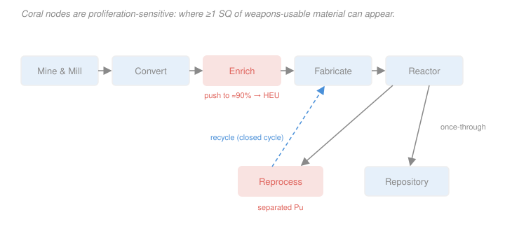
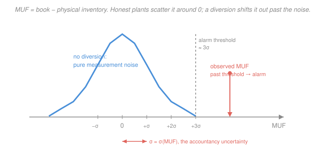

# Nuclear Fuel Cycle & Policy · Lesson 4.3: Nonproliferation, safeguards & security

> ⏱ ~15 min · Module 4: Alternative Cycles, Proliferation & Economics · Builds on: [3.4 Reprocessing: PUREX & separations](03-04-reprocessing-purex-separations.md), [3.5 Recycling: MOX & the plutonium balance](03-05-recycling-mox-plutonium-balance.md), [4.2 The thorium cycle](04-02-thorium-cycle.md) · Unlocks: [4.4 Nuclear economics & LCOE](04-04-nuclear-economics-lcoe.md)

## Why this matters

Every gram of fissile material in the civilian cycle is also, in principle, a gram someone could try to make a bomb from. That single fact shapes the entire back end: it is *why* separated plutonium is politically radioactive, *why* enrichment plants are the most-watched buildings in the industry, and *why* a reactor's economics quietly carry the cost of an international inspectorate. The whole regime rests on two quantitative ideas — **how much material is "enough"** (the significant quantity) and **how tightly you can close a mass balance** (material accountancy). Get those two numbers and you can reason about diversion the way an inspector does: not with slogans, but with kilograms and error bars.

## The idea

Start with the deceptively simple question: how much fissile material does one weapon take? The IAEA answers with the **significant quantity (SQ)** — a deliberately round, conservative figure: roughly **8 kg of plutonium** or **25 kg of $\ce{^{235}U}$ contained in highly enriched uranium (HEU)**. It is not a bomb design; it is an accounting yardstick that says "below this, one device is implausible; above it, start counting."

The SQ instantly tells you *where in the cycle to worry*. Trace a uranium atom through the map: natural uranium, low-enriched fuel, and spent fuel are all either too dilute or too radioactive to weaponize directly. The danger concentrates at exactly two nodes. **Enrichment** — because the same centrifuges that make 4.5% reactor fuel can, re-plumbed, make 90% HEU. And **reprocessing** — because PUREX (Lesson 3.4) deliberately *separates* plutonium out of the intensely radioactive spent fuel that was protecting it. Everywhere else the material guards itself; at those two nodes it comes out clean.

So how do you catch someone skimming? You do what a bank does: you **count**. Material accountancy weighs and assays everything going into a facility and everything coming out, then asks whether the books balance. The catch — and the whole science of safeguards — is that you can never weigh anything *perfectly*. The books never balance exactly, even when nobody stole a thing. The art is separating a real theft from the ordinary noise of imperfect measurement, and that turns out to be a statistics problem you already know how to do.

## The formal version

**The significant quantity.** The SQ is the approximate mass of fissile material sufficient, allowing for losses, for one nuclear device:

$$\text{SQ}_{\text{Pu}} \approx 8\ \text{kg Pu}, \qquad \text{SQ}_{\text{HEU}} \approx 25\ \text{kg of }\ce{^{235}U}\ (\text{in U enriched} \geq 20\%).$$

*In words: 8 kg of plutonium of essentially any isotopic mix, or 25 kg of the $\ce{^{235}U}$ actually contained in HEU, is one bomb's worth for safeguards purposes.* (For low-enriched uranium the SQ is defined on contained $\ce{^{235}U}$ too but LEU is not directly weapons-usable — see Watch out.)

**The three pillars of IAEA safeguards.** The inspectorate combines:

1. **Material accountancy** — the quantitative core: measure all inventories and flows, close the mass balance. This is what *detects* diversion.
2. **Containment & surveillance (C/S)** — tamper-indicating seals, cameras, and monitors that maintain *continuity of knowledge* between physical counts, so material can't be moved unobserved. This is what makes the accountancy *credible*.
3. **Inspections** — routine and short-notice visits that verify the operator's declared numbers against independent measurements.

**Material Unaccounted For (MUF).** Over a material-balance period, define

$$\text{MUF} = \underbrace{\big(P_{\text{begin}} + X\big)}_{\text{book inventory}} - \underbrace{\big(P_{\text{end}} + Y\big)}_{\text{physical + removals}},$$

where $P_{\text{begin}}, P_{\text{end}}$ are the measured physical inventories at the start and end, $X$ is total receipts (material in), and $Y$ is total shipments/removals (material out), all in kg of the element of interest. *In words: MUF is what the books say should be on hand minus what a physical count actually finds — the gap between paper and reality.*

If nobody diverted anything, MUF is not zero — it is a random number scattered about zero by measurement error. Let $\sigma_{\text{MUF}}$ be its standard deviation. You declare a possible diversion only when

$$|\text{MUF}| > k\,\sigma_{\text{MUF}}, \qquad k \approx 3,$$

*In words: flag an alarm only when the imbalance is several times bigger than the measurement noise — otherwise you'd cry wolf on every accounting period.* This is a hypothesis test: the null is "no diversion, $\text{MUF}\sim \mathcal{N}(0,\sigma_{\text{MUF}}^2)$," and $k$ trades the false-alarm rate against the chance of missing a real theft (bridge to [`prob-stat-refresher`](../../prob-stat-refresher/syllabus.md)).

**Where $\sigma_{\text{MUF}}$ comes from — the $\sqrt{n}$ that matters.** Suppose the plant handles a throughput $M$ (kg) as $n$ batches of mass $m = M/n$, each measured with **random** relative uncertainty $\varepsilon_r$. Independent errors add *in quadrature*, so

$$\sigma_{\text{random}} = \varepsilon_r\, m\,\sqrt{n} = \varepsilon_r\,\frac{M}{\sqrt{n}}.$$

*In words: random errors partly cancel across many small batches — cut the batch size (raise $n$) and the random part of the noise falls like $1/\sqrt{n}$.* But a **systematic** error $\varepsilon_s$ (a mis-calibrated scale that's wrong the same way every time) does *not* average down:

$$\sigma_{\text{systematic}} = \varepsilon_s\, M, \qquad \sigma_{\text{MUF}} = \sqrt{\sigma_{\text{random}}^2 + \sigma_{\text{systematic}}^2}.$$

The systematic term is the villain: it scales with the *full* throughput, sets the detection floor, and is why calibration standards and independent inspector measurements exist.

## Picture

The two coral nodes are where a significant quantity of weapons-usable material can appear clean. The MUF picture below is the detector:

## Worked examples

**Example 1 (significant quantities set the inspection clock).** A 1.2 GWe light-water reactor discharges spent fuel containing roughly $230\ \text{kg}$ of (reactor-grade) plutonium per year. (a) How many SQ is that? (b) What does that imply for how often a reprocessing plant handling this fuel must be inspected?

(a) Divide by the plutonium SQ:

$$N_{\text{SQ}} = \frac{230\ \text{kg}}{8\ \text{kg/SQ}} = 28.75 \approx 29\ \text{SQ per year}.$$

A *single* power reactor generates on the order of **thirty weapons-equivalents of plutonium every year** — safely locked inside self-protecting spent fuel, but thirty SQ nonetheless.

(b) In spent fuel that Pu is irradiated and hard to touch, so the IAEA "timeliness goal" for detecting its diversion is relatively long (months). But *reprocess* that fuel and you produce ~29 SQ of **separated** plutonium flowing through the plant. Unirradiated plutonium carries the shortest timeliness goal — about **one month** — because a determined actor could convert a diverted SQ to a device on roughly that timescale. So the material balance at a reprocessing plant must be closed and verified on a monthly cadence, not annually. *The SQ throughput sets the inspection frequency.*

**Example 2 (the smallest diversion you can catch).** A reprocessing plant separates $M = 800\ \text{kg}$ of plutonium per year, processed as $n = 80$ batches of $m = 10\ \text{kg}$, each measured with a random relative uncertainty $\varepsilon_r = 1\%$. (a) Find $\sigma_{\text{MUF}}$ from random error. (b) With a $3\sigma$ alarm threshold, what is the smallest diversion you can reliably detect, and how does it compare to 1 SQ? (c) What if that $1\%$ were systematic instead?

(a) Per-batch error is $\varepsilon_r m = 0.01 \times 10 = 0.10\ \text{kg}$. Over 80 independent batches, add in quadrature:

$$\sigma_{\text{MUF}} = \varepsilon_r\, m\,\sqrt{n} = 0.10\,\sqrt{80} = 0.10 \times 8.94 = 0.89\ \text{kg}.$$

(Same thing via $\varepsilon_r M/\sqrt{n} = 0.01 \times 800 / 8.94 = 0.89\ \text{kg}$. ✓)

(b) The alarm fires at $3\sigma_{\text{MUF}} = 3 \times 0.89 \approx 2.7\ \text{kg}$. So a diversion of about $2.7\ \text{kg}$ or more is caught — comfortably **below** one SQ ($8\ \text{kg}$). Good: the plant can catch a would-be diverter well before they accumulate a bomb's worth.

(c) If instead the $1\%$ were a systematic bias, it does not shrink with batching:

$$\sigma_{\text{systematic}} = \varepsilon_s\, M = 0.01 \times 800 = 8\ \text{kg} \approx 1\ \text{SQ}.$$

Now $3\sigma \approx 24\ \text{kg}$ — you could miss *three* SQ walking out the door. **This is the whole reason safeguards obsess over calibration:** random noise you beat with more measurements, but a systematic bias sets a hard floor at $\varepsilon_s M$, and that floor is what has to stay well under a significant quantity.

## Watch out

- **You might think** spent fuel is a ready plutonium source, so the back end is the danger. **Actually** the ~29 SQ in a reactor's annual discharge are diluted in intensely radioactive, unseparated spent fuel — *self-protecting*, lethal to handle, and useless as-is. The proliferation risk is created by the step that *removes* that protection: reprocessing. This is exactly why the **once-through** cycle is more proliferation-resistant than a **closed** (PUREX/MOX) cycle — no separated Pu ever exists.
- **You might think** reactor-grade plutonium (high $\ce{^{240}Pu}$) is unusable for weapons, so recycled Pu is "safe." **Actually** it is still weapons-usable: $\ce{^{240}Pu}$ spontaneous fission makes a *reliable, predictable* device harder, not impossible. That is precisely why the IAEA assigns a single 8 kg SQ to *any* plutonium vector rather than exempting reactor-grade material.
- **You might think** any nonzero MUF proves theft. **Actually** MUF is essentially never exactly zero — every weighing and assay has error, so MUF is a random draw around zero. Diversion is only signalled when MUF exceeds several $\sigma_{\text{MUF}}$; and because systematic errors scale with the full throughput and *don't* average away, a large bulk-handling plant can hide a surprising amount below the noise. Detection is a statistics problem, not a bookkeeping certainty.

## One-liner

> A significant quantity (~8 kg Pu, ~25 kg $\ce{^{235}U}$) is one bomb's worth of material; safeguards close the mass balance so tightly that a diverted SQ pokes above the measurement noise $\sigma_{\text{MUF}}$ — which is why separated plutonium and HEU, not spent fuel, are the nodes inspectors watch.

## Problems

**P1 (🟢)** A 1 GWe reactor produces about $200\ \text{kg}$ of plutonium per year in its spent fuel. (a) How many SQ of plutonium is that? (b) A country operates ten such reactors; if all their annual plutonium were separated by reprocessing, how many SQ of separated Pu would be in circulation each year?

**P2 (🟡)** A reprocessing plant handles $M = 500\ \text{kg}$ of plutonium per year in $n = 50$ batches of $10\ \text{kg}$, each measured with a random relative uncertainty $\varepsilon_r = 0.8\%$. (a) Compute $\sigma_{\text{MUF}}$ from random error and the $3\sigma$ detection threshold in kg. (b) Is a diversion of 1 SQ detectable? (c) The plant operator proposes doubling the batch size (so $n = 25$, $m = 20\ \text{kg}$) to save labor. What happens to $\sigma_{\text{MUF}}$, and why do the inspectors object?

**P3 (🔴, optional)** A clandestine cascade produces uranium enriched to $90\%$ $\ce{^{235}U}$ (weapons-grade HEU). (a) Using $\text{SQ}_{\text{HEU}} = 25\ \text{kg}$ of *contained* $\ce{^{235}U}$, how many kilograms of $90\%$ HEU material make up one SQ? (b) How many kilograms of ordinary $4.5\%$ LEU reactor fuel contain that same $25\ \text{kg}$ of $\ce{^{235}U}$? (c) In one sentence, use the contrast to explain why *enrichment level*, not just $\ce{^{235}U}$ mass, defines the proliferation risk — and why enrichment plants are a sensitive node.

Solutions

**P1** (a) $N_{\text{SQ}} = 200/8 = 25\ \text{SQ per reactor-year}$. (b) Ten reactors give $10 \times 200 = 2{,}000\ \text{kg Pu/yr}$, i.e. $2{,}000/8 = 250\ \text{SQ}$ of separated plutonium per year. The scale is the point: a modest reactor fleet, once its fuel is reprocessed, puts *hundreds* of weapons-equivalents into a form that must be tracked to a fraction of one SQ.

**P2** (a) Per-batch error $\varepsilon_r m = 0.008 \times 10 = 0.08\ \text{kg}$. Over 50 batches:
$$\sigma_{\text{MUF}} = 0.08\,\sqrt{50} = 0.08 \times 7.07 = 0.566\ \text{kg}.$$
Threshold $= 3\sigma_{\text{MUF}} = 3 \times 0.566 = 1.70\ \text{kg}$.
(b) Yes — $1.70\ \text{kg}$ is far below $1\ \text{SQ} = 8\ \text{kg}$, so a full-SQ diversion is caught with margin to spare (indeed anything above ~1.7 kg trips the alarm).
(c) With $n = 25$, $m = 20$: $\sigma_{\text{MUF}} = \varepsilon_r m \sqrt{n} = 0.008 \times 20 \times \sqrt{25} = 0.16 \times 5 = 0.80\ \text{kg}$ (equivalently $\varepsilon_r M/\sqrt{n} = 0.008\times500/5 = 0.80$). The noise **rises** from $0.566$ to $0.80\ \text{kg}$ (threshold $2.4\ \text{kg}$) because fewer, larger batches give random errors less room to cancel ($\sigma \propto 1/\sqrt{n}$). Coarser batching degrades detection sensitivity — inspectors want *more, smaller* accounting units, not fewer big ones.

**P3** (a) $90\%$ of the HEU mass is $\ce{^{235}U}$, so one SQ of contained $\ce{^{235}U}$ sits in
$$\frac{25\ \text{kg}}{0.90} = 27.8\ \text{kg of }90\%\ \text{HEU}.$$
(b) At $4.5\%$ enrichment, $25\ \text{kg}$ of $\ce{^{235}U}$ is contained in
$$\frac{25\ \text{kg}}{0.045} = 556\ \text{kg of LEU}.$$
(c) The same 25 kg of $\ce{^{235}U}$ is a compact ~28 kg of bomb-ready metal at $90\%$ but is diluted through more than half a tonne of $\ce{^{238}U}$ at $4.5\%$ — LEU cannot go critical fast, so it is the **enrichment level** that turns a mass of $\ce{^{235}U}$ into a weapon, which is exactly why an enrichment plant (able to re-cascade LEU up to HEU) is a proliferation-sensitive node.

## Flashback

**From Lesson 3.5 (Recycling: MOX & the plutonium balance):** Reactor-grade plutonium from a typical LWR has the approximate mass vector $\ce{^{238}Pu}$ 2%, $\ce{^{239}Pu}$ 55%, $\ce{^{240}Pu}$ 25%, $\ce{^{241}Pu}$ 12%, $\ce{^{242}Pu}$ 6%. (a) What fraction is fissile (the odd-$A$ isotopes $\ce{^{239}Pu} + \ce{^{241}Pu}$)? (b) In one sentence, why does the IAEA still count 8 kg of *this* mix as a full SQ, even though it is a poorer weapons material than weapons-grade Pu?

Solution

(a) Fissile fraction $= 55\% + 12\% = 67\%$ (the odd-neutron-number isotopes that fission on thermal *and* fast neutrons). The even isotopes $\ce{^{240}Pu}$ and $\ce{^{242}Pu}$ are the "ballast" that makes the vector less desirable.

(b) Because *every* plutonium isotopic mixture (short of very high $\ce{^{238}Pu}$ content) can sustain a fast critical mass and is therefore treated as weapons-usable — the high $\ce{^{240}Pu}$ raises the technical difficulty (spontaneous-fission neutrons, heat) but does not remove the threat, so the SQ is set conservatively at 8 kg independent of vector. This is the same conservative logic behind the single Pu SQ used throughout this lesson.

## Connections

- **Backward:** the separated plutonium these safeguards chase is exactly the PUREX product of [3.4](03-04-reprocessing-purex-separations.md) and the feed to MOX fabrication in [3.5](03-05-recycling-mox-plutonium-balance.md); and the $\ce{^{232}U}$ hard-gamma barrier from [4.2](04-02-thorium-cycle.md) is itself a proliferation-resistance feature — self-protection built into the isotope rather than bolted on by inspectors.
- **Forward:** [4.4](04-04-nuclear-economics-lcoe.md) prices what this lesson describes qualitatively — safeguards, security, and the choice of a proliferation-resistant (often once-through) cycle are real costs and constraints that sit on top of the busbar LCOE.
- **Sideways (probability & statistics):** MUF detection is a textbook hypothesis test — null "no diversion" with $\text{MUF}\sim\mathcal{N}(0,\sigma_{\text{MUF}}^2)$, an alarm threshold $k\sigma$ trading false-alarm probability $\alpha$ against missed-detection probability $\beta$, and the $1/\sqrt{n}$ shrinkage of random error being the standard error of a sum ([`prob-stat-refresher`](../../prob-stat-refresher/syllabus.md)). The distinction between random and systematic error is the same one that governs any precision measurement in physics.
