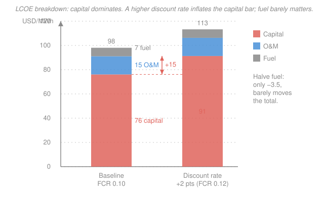

# Nuclear Fuel Cycle & Policy · Lesson 4.4: Nuclear economics & LCOE

> ⏱ ~15 min · Module 4: Alternative Cycles, Proliferation & Economics · Builds on: [2.4 In-core fuel-cycle economics](02-04-in-core-fuel-cycle-economics.md), [4.3 Nonproliferation, safeguards & security](04-03-nonproliferation-safeguards-security.md) · Unlocks: *course end* — economics of [fusion-plasma](../../fusion-plasma/syllabus.md) and [political-economy](../../political-economy/syllabus.md)

## Why this matters

We have followed a uranium atom from the ground to the repository, pricing each step: ore, conversion, separative work, fabrication, carrying charges, disposal. Now we collapse the whole cycle into a single number a grid planner actually cares about — the **busbar price**, the dollars per MWh a plant must charge to break even over its life. The punchline of this course's economics is blunt and consequential: for nuclear, that number is decided almost entirely by *how much the plant cost to build and how the money was borrowed* — not by the fuel cycle we just spent three modules costing out. Understanding why is understanding why nuclear lives or dies on financing and construction, not on uranium.

## The idea

Imagine you build a plant, then run it for 60 years. Over that life you spend money at wildly different times: a huge lump up front to build it, a steady trickle for staff and fuel every year after. And you generate a huge pile of MWh, spread over decades. **LCOE** — the Levelized Cost Of Electricity — is the one constant price per MWh that, charged on every MWh you ever produce, exactly pays back all of that spending (with a return on the borrowed money).

Think of it as amortizing a mortgage over the electricity instead of over the months. The house (the reactor) costs a fortune on day one; you don't pay it back in a lump, you spread it over every unit of "output" the house produces. Nuclear is a plant with a *very* expensive house and *very* cheap groceries (fuel). So its rent is dominated by the mortgage. Change the interest rate on that mortgage and the rent swings hard; change the grocery bill and you barely notice.

That single sentence — expensive house, cheap groceries — is the whole lesson. The rest is turning it into numbers.

## The formal version

The honest definition of LCOE discounts every future dollar and every future MWh back to today, because a dollar (or a MWh) next year is worth less than one now:

$$\text{LCOE} = \frac{\displaystyle\sum_{t} \frac{I_t + M_t + Q_t}{(1+r)^t}}{\displaystyle\sum_{t} \frac{E_t}{(1+r)^t}}$$

where in year $t$: $I_t$ is investment (capital) spending, $M_t$ is operations-and-maintenance, $Q_t$ is fuel spending, $E_t$ is electricity generated (MWh), and $r$ is the **discount rate** — the annual return the capital must earn.

**In words:** LCOE is discounted lifetime cost divided by discounted lifetime energy — the flat price that makes the plant break even in present-value terms.

For a plant with a roughly steady output, this collapses into three clean pieces. Let

- $\text{OCC}$ = **overnight capital cost** (dollars per kW) — what the plant would cost if you could build it *overnight*, i.e. with no interest piling up during construction.
- $\text{FCR}$ = **fixed charge rate** (per year) — the fraction of the capital you must recover *every year* to cover return on capital, depreciation, and taxes. It rises with the discount rate $r$ and with build time.
- $\text{CF}$ = **capacity factor** (dimensionless) — the fraction of the year the plant actually runs at full power.
- $8760$ = hours in a year.

Then

$$\boxed{\;\text{LCOE} = \underbrace{\frac{\text{FCR}\cdot\text{OCC}}{8760\cdot\text{CF}}}_{\text{capital}} \;+\; \underbrace{\text{O\&M}}_{\text{fixed operations}} \;+\; \underbrace{c_{\text{fuel}}}_{\text{fuel}}\;}$$

with O&M and $c_{\text{fuel}}$ expressed directly in dollars per MWh.

**In words:** each year you owe $\text{FCR}\cdot\text{OCC}$ dollars per kW on the build; spread that over the $8760\cdot\text{CF}$ hours of energy each kW produces, and you get the capital cost of a MWh — then just add the running costs.

Watch the units on the capital term. $\text{FCR}\cdot\text{OCC}$ is dollars per kW per year; dividing by $8760\cdot\text{CF}$ hours per year gives dollars per **kWh**; multiply by $1000$ to land in dollars per **MWh**. The denominator is why the capacity factor matters so much: idle capital still owes its annual charge, so every hour the plant *doesn't* run makes each MWh it *does* produce carry more of the mortgage.

## Picture

The coral capital block is most of the bar. Raising the discount rate (right bar) grows *only* the coral block — fuel and O&M sit still. That is capital dominance drawn to scale.

## Worked examples

**Example 1 (the boss shape — build the LCOE stack).** A plant has $\text{OCC} = 6{,}000$ dollars per kW, $\text{FCR} = 0.10$ per year, and $\text{CF} = 90\%$. Its fixed O&M is $15$ dollars per MWh and its fuel is $7$ dollars per MWh. Find the LCOE and the capital share.

Capital term first. The annual capital charge per kW is
$$\text{FCR}\cdot\text{OCC} = 0.10 \times 6{,}000 = 600 \ \text{dollars per kW-yr}.$$
Each kW generates
$$8760 \times 0.90 = 7{,}884 \ \text{hours (i.e. kWh) per year}.$$
So the capital cost of electricity is
$$\frac{600}{7{,}884} = 0.0761 \ \text{dollars per kWh} = 76.1 \ \text{dollars per MWh}.$$
Now stack the running costs:
$$\text{LCOE} = 76.1 + 15 + 7 = 98.1 \approx 98 \ \text{dollars per MWh}.$$
Capital share:
$$\frac{76.1}{98.1} = 0.776 \approx 78\%.$$
**More than three-quarters of the busbar price is the mortgage.** O&M is $15\%$, fuel a mere $7\%$ — after everything we costed in Modules 1–3, the entire fuel cycle is the thinnest slice of the bar.

**Example 2 (turn the two knobs — the capital-dominance punchline).** Take the Example 1 plant and ask what actually moves its price. Compare two "improvements":

*Knob 1 — halve the fuel cost.* Suppose a slicker fuel cycle (lower tails assay, higher burnup — everything Modules 1–2 fought for) cuts fuel from $7$ to $3.5$ dollars per MWh. The new LCOE:
$$76.1 + 15 + 3.5 = 94.6 \ \text{dollars per MWh}.$$
A change of $-3.5$ dollars per MWh — about $3.5\%$. All that fuel-cycle optimization barely dents the price.

*Knob 2 — raise the discount rate by two points.* Suppose financing gets more expensive and the fixed charge rate climbs $0.10 \to 0.12$ (higher interest, or a longer, riskier build). Only the capital term moves:
$$\frac{0.12 \times 6{,}000}{7{,}884} = \frac{720}{7{,}884} = 0.0913 \ \text{dollars per kWh} = 91.3 \ \text{dollars per MWh}.$$
New LCOE:
$$91.3 + 15 + 7 = 113.3 \ \text{dollars per MWh}.$$
A change of **$+15.2$** dollars per MWh — about $+15\%$ — from a two-point move in the interest rate.

Put the two side by side: **halving the fuel cost saves $3.5$ dollars per MWh; a two-point rise in the discount rate costs $15$ dollars per MWh.** The financing knob is four times more powerful than the entire fuel bill. That is why nuclear's competitiveness is a story about capital and interest, and why the fuel cycle — for all its physics — is an economic afterthought.

## Watch out

- **You might think** a cheaper fuel cycle is how you make nuclear competitive. **Actually** fuel is under $10\%$ of LCOE, so even large fuel-cycle savings move the busbar price only slightly (Example 2). The levers that matter are overnight cost, build time, and the discount rate. (This is the opposite of a gas plant, where fuel is most of the cost — which is exactly why a gas plant *can* afford to sit idle and nuclear cannot.)
- **You might think** a low overnight capital cost guarantees cheap power. **Actually** the same OCC produces very different LCOEs depending on $\text{FCR}$: a long build accrues interest during construction (which inflates the effective capital), and a high discount rate raises the annual charge. Financing and schedule can dominate the headline sticker price.
- **You might think** capacity factor is a secondary operational detail. **Actually** $\text{CF}$ sits in the denominator of the capital term, so it scales the *largest* piece of the bar. Dropping from $90\%$ to $75\%$ CF raises the capital component by a factor of $0.90/0.75 = 1.2$ — a $20\%$ jump in most of the LCOE. Capital-heavy plants must run flat-out; idle capital is still fully billed.

## One-liner

> LCOE is the flat price that pays back a plant's whole life, and for nuclear it is a mortgage payment: capital (overnight cost × fixed charge rate, spread over $8760\cdot\text{CF}$ hours) is ~three-quarters of the bar, so the discount rate and build time — not the fuel cycle — decide whether nuclear competes.

## Problems

**P1 (🟢)** A reactor has $\text{OCC} = 5{,}000$ dollars per kW, $\text{FCR} = 0.09$ per year, $\text{CF} = 92\%$, fixed O&M of $14$ dollars per MWh, and fuel of $6$ dollars per MWh. Compute the capital component of LCOE, the total LCOE, and the capital share.

**P2 (🟡)** Take the P1 plant but suppose grid conditions force it to load-follow, dropping its capacity factor from $92\%$ to $75\%$ (O&M and fuel per MWh unchanged). Recompute the total LCOE and explain, in one sentence, which term moved and why.

**P3 (🔴, optional)** For the Example 1 plant ($\text{OCC} = 6{,}000$ dollars per kW, $\text{CF} = 90\%$, O&M $15$, fuel $7$, all in the usual units), find the fixed charge rate $\text{FCR}$ at which the LCOE reaches $120$ dollars per MWh. Then say in one sentence what this implies for how a project's *financing terms* — a policy/political-economy variable — set its viability.

Solutions

**P1** Capital term:
$$\frac{\text{FCR}\cdot\text{OCC}}{8760\cdot\text{CF}} = \frac{0.09 \times 5{,}000}{8760 \times 0.92} = \frac{450}{8{,}059.2} = 0.05583 \ \text{dollars per kWh} = 55.8 \ \text{dollars per MWh}.$$
Total LCOE:
$$55.8 + 14 + 6 = 75.8 \ \text{dollars per MWh}.$$
Capital share: $55.8/75.8 = 0.736 \approx 74\%$ — again the mortgage is roughly three-quarters of the price.

**P2** Only the capital term depends on CF. At $\text{CF} = 75\%$:
$$\frac{450}{8760 \times 0.75} = \frac{450}{6{,}570} = 0.06849 \ \text{dollars per kWh} = 68.5 \ \text{dollars per MWh}.$$
Total LCOE:
$$68.5 + 14 + 6 = 88.5 \ \text{dollars per MWh},$$
up from $75.8$ — a $+12.7$ dollars per MWh jump, entirely in the capital term. **The capital charge is fixed per year regardless of how much you run, so spreading it over fewer MWh raises the cost of each one** (equivalently, the ratio $0.92/0.75 = 1.23$ scaled the $55.8$ up to $68.5$). Cheap running costs don't help; the mortgage is owed whether the plant spins or not.

**P3** The two running terms contribute $15 + 7 = 22$ dollars per MWh, so to hit an LCOE of $120$ the capital term must supply
$$120 - 22 = 98 \ \text{dollars per MWh} = 0.098 \ \text{dollars per kWh}.$$
The capital term is $\dfrac{\text{FCR} \times 6{,}000}{8760 \times 0.90} = \dfrac{\text{FCR} \times 6{,}000}{7{,}884} = 0.7611\,\text{FCR}$ dollars per kWh. Set equal:
$$0.7611\,\text{FCR} = 0.098 \quad\Rightarrow\quad \text{FCR} = \frac{0.098}{0.7611} = 0.129 \ \text{per year}.$$
So a fixed charge rate of about $0.13$ — a rise of only $\sim 3$ points from the baseline $0.10$ — is enough to push the price from $98$ to $120$ dollars per MWh. **In one sentence:** because a few points of financing cost swing the LCOE more than the entire fuel bill, a plant's viability is set less by its engineering than by the interest rate and risk premium it can secure — which is why loan guarantees, power-purchase agreements, and construction-risk policy are the real levers of nuclear economics.

## Flashback

**From Lesson 2.4 (In-core fuel-cycle economics):** A fabricated fuel batch costs $2{,}500$ dollars per kg of heavy metal (all front-end costs rolled in) and reaches a discharge burnup of $45\ \text{GWd/tHM} = 45\ \text{MWd/kgHM}$ (thermal) at a plant thermal efficiency of $34\%$. Compute the **levelized fuel cost** in dollars per MWh(electric), and note in one line how it compares with the $7$ dollars per MWh fuel figure used in this lesson.

Solution

The levelized fuel cost is the batch cost divided by the *electrical* energy that kilogram of fuel produces over its life. First convert burnup (thermal energy per kg) into electrical MWh per kg. A megawatt-day is $24$ MWh, so
$$45\ \frac{\text{MWd}_{\text{th}}}{\text{kgHM}} \times 24\ \frac{\text{h}}{\text{d}} = 1{,}080\ \frac{\text{MWh}_{\text{th}}}{\text{kgHM}}.$$
Apply the thermal efficiency to get electrical energy:
$$1{,}080 \times 0.34 = 367.2\ \frac{\text{MWh}_e}{\text{kgHM}}.$$
Levelized fuel cost:
$$\frac{2{,}500\ \text{dollars/kgHM}}{367.2\ \text{MWh}_e/\text{kgHM}} = 6.8\ \text{dollars per MWh}.$$
That $6.8$ dollars per MWh is right in line with the $7$ dollars per MWh fuel slice used above — and notice the two ways to shrink it: cheaper fuel (numerator) or *higher burnup* (denominator), the Module 2 optimization. Either way it stays a single-digit slice of a $\sim 100$ dollar per MWh bar — the levelized-cost view is exactly why fuel-cycle savings barely move the busbar price.

## Connections

- **Backward:** the fuel term $c_{\text{fuel}}$ *is* the levelized fuel cost you built in [2.4](02-04-in-core-fuel-cycle-economics.md) (front-end material and SWU from [1.5](01-05-enrichment-cascade-front-end-cost.md), spread over burnup), and it lands here as the smallest slice of the LCOE bar — the quantitative close to the whole cycle's cost story.
- **Forward (course end):** this same $\text{FCR}\cdot\text{OCC}/(8760\cdot\text{CF})$ logic drives the economics of [fusion-plasma](../../fusion-plasma/syllabus.md) (where capital dominance is even starker, since fuel is nearly free) and becomes a policy variable in [political-economy](../../political-economy/syllabus.md), where the discount rate, loan guarantees, and construction-risk allocation are choices a government makes.
- **Sideways (engineering economics & finance):** LCOE is a discounted-cash-flow / net-present-value calculation, and the fixed charge rate is the **capital recovery factor** of an annuity — the identical amortization math that prices a mortgage or any capital-budgeting decision in microeconomics of investment.
