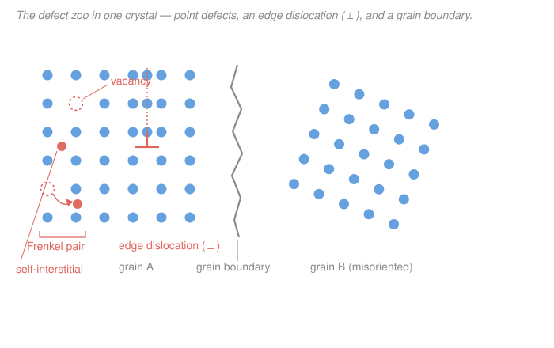

# Nuclear Materials · Lesson 1.1: Crystals and their defects (fast refresher)

> ⏱ ~15 min · Module 1: Structure, defects, and radiation damage · Builds on: [`materials-science` 1.2 Crystal structures](../../materials-science/lessons/01-02-crystal-structures-unit-cells.md), [1.3 Miller indices](../../materials-science/lessons/01-03-miller-indices-directions-planes.md), [2.1 Point defects](../../materials-science/lessons/02-01-point-defects-solid-solutions.md), [2.2 Dislocations](../../materials-science/lessons/02-02-dislocations-plastic-flow.md), [2.3 Interfaces & grain boundaries](../../materials-science/lessons/02-03-interfaces-grain-boundaries.md) · Unlocks: [1.2 How radiation deposits energy](01-02-how-radiation-deposits-energy.md)

## Why this matters

You already know the defect zoo — you built it in `materials-science`. So why open a whole nuclear course with a refresher? Because in `materials-science` defects were **thermal residents**: heat the crystal and a lawful, tiny equilibrium population of vacancies appears; cool it and they mostly vanish. Inside a reactor that logic breaks. A neutron flux is a firehose that *knocks atoms clean off their lattice sites*, manufacturing defects **athermally** — with no regard for what temperature says the equilibrium population should be — and in numbers that dwarf the thermal count by many orders of magnitude. Every failure mode in this course (swelling, hardening, embrittlement, fuel cracking) is downstream of that one fact. This lesson is the same defect zoo you know, re-labeled with a single question stapled to each animal: **what will irradiation do to it?**

## The idea

A crystal is an orderly parking lot: atoms on a repeating lattice, every spot filled. A **defect** is any way that order breaks, and defects sort by dimensionality — how many directions the disruption runs:

- **0-D, point defects:** one site is wrong. An empty spot (**vacancy**) or an extra atom crammed in where none belongs (**self-interstitial**). Their inseparable duo — a vacancy plus the very atom knocked out to make it — is the **Frenkel pair**, and it is *the* fundamental unit of radiation damage. Everything in Module 1 is about counting Frenkel pairs.
- **1-D, line defects:** a line where the lattice register slips — an **edge** or **screw dislocation**. These carry plastic flow and, under irradiation, act as *sinks* that swallow point defects (Module 2's whole engine).
- **2-D, planar defects:** surfaces and **grain boundaries** — where two misoriented crystals meet. They're everywhere in a polycrystal and they're where segregation and cracking happen.
- **3-D, volume defects:** **voids** (vacancy clusters that grew into holes) and **precipitates**. In `materials-science` these were mostly a metallurgical choice; here, irradiation *grows them out of nothing*, and they swell and harden the metal. That's a forward reference to [2.3](02-03-voids-void-swelling.md) — but notice the whole point: irradiation walks a defect *up* the dimensional ladder, from lone Frenkel pairs to loops to voids.

The reframing to carry through the course: **thermal defects are made one at a time, reversibly, at equilibrium; radiation defects are made in equal-and-opposite pairs, athermally, in enormous excess.**

## The formal version

**The three lattices that run a reactor.** (Recall [`materials-science` 1.2](../../materials-science/lessons/01-02-crystal-structures-unit-cells.md).)

- **bcc** (body-centered cubic, packing fraction $0.68$): $\alpha$-iron and the **ferritic/martensitic steels** — the swelling-resistant structural alloys.
- **fcc** (face-centered cubic, close-packed, $0.74$): $\gamma$-iron and **austenitic stainless (Type 316)**, plus Ni and Al — strong and tough, but swelling-*prone*.
- **hcp** (hexagonal close-packed, $0.74$): **zirconium** (Zircaloy cladding), Ti, Mg — close-packed but crystallographically **anisotropic**, which is exactly why Zr suffers irradiation *growth* ([2.4](02-04-irradiation-creep-growth.md)).

*In words: bcc steel, fcc steel, and hcp zirconium are the three horses; their crystal symmetry already predicts how each misbehaves under a neutron beam.*

**Point defects.** A **vacancy** is a missing atom; a **self-interstitial atom (SIA)** is an extra host atom wedged into the space between normal sites. Create one by plucking an atom from its site and stuffing it into an interstitial slot nearby, and you have made a **Frenkel pair**: exactly one vacancy and exactly one interstitial, born together. *In words: a Frenkel pair is a displaced atom (the interstitial) plus the hole it left behind (the vacancy) — conserve atoms and the two counts are always equal.*

**Line defects.** An **edge dislocation** is the edge of an extra half-plane of atoms jammed into the lattice; a **screw dislocation** is a spiral ramp in the atomic planes. Both are quantified by the **Burgers vector** $\mathbf{b}$ — the closure failure of a loop drawn atom-to-atom around the line (magnitude $\approx$ one atomic spacing, $\sim 0.25\ \mathrm{nm}$). *In words: $\mathbf{b}$ measures how much, and in which direction, the crystal is offset across the dislocation.* (See [`materials-science` 2.2](../../materials-science/lessons/02-02-dislocations-plastic-flow.md).)

**Planar defects.** **Grain boundaries** separate crystallites of different orientation; **free surfaces** cap the solid. Both are efficient sinks and preferred sites for chemistry to concentrate.

**Defect energetics — the crux.** Making a vacancy costs a **formation energy** $E_\mathrm{f}^{v}$ (energy to remove one atom to a surface, $\sim 1$–$2\ \mathrm{eV}$ in metals). At temperature $T$, statistical mechanics fixes the **equilibrium** fraction of empty sites:

$$\frac{n_v}{N} = \exp\!\left(-\frac{E_\mathrm{f}^{v}}{k_\mathrm{B}T}\right),$$

with $n_v$ the number of vacancies, $N$ the number of lattice sites, $k_\mathrm{B} = 8.617\times10^{-5}\ \mathrm{eV/K}$ the Boltzmann constant, and $T$ in kelvin. *In words: the crystal tolerates exponentially few vacancies, and only because entropy pays for a handful — cool it down and they freeze out.* Two more energies matter downstream. A defect **migrates** by hopping with rate

$$\Gamma = \nu\,\exp\!\left(-\frac{E_\mathrm{m}}{k_\mathrm{B}T}\right),$$

where $E_\mathrm{m}$ is the **migration energy** and $\nu \sim 10^{13}\ \mathrm{Hz}$ is the atomic attempt frequency. Crucially, **interstitials migrate far more easily than vacancies** ($E_\mathrm{m}^{i}\sim 0.1$–$0.3\ \mathrm{eV}$ vs. $E_\mathrm{m}^{v}\sim 1\ \mathrm{eV}$) — remember that asymmetry; it becomes the *dislocation bias* that powers void swelling ([2.2](02-02-dislocation-loops-bias.md)).

Here is the whole reason this course exists. Thermal equilibrium sets $n_v/N$ at, say, $10^{-14}$ near reactor temperature. Irradiation doesn't ask permission: at a displacement rate of order $10^{-6}$ atoms displaced per second (we'll compute this in [1.4](01-04-kinchin-pease-nrt-dpa.md)), it *forces* the defect population to a **steady-state supersaturation orders of magnitude above** that equilibrium value. Defects that thermodynamics says shouldn't exist are present in overwhelming numbers — and now they must go somewhere.

## Picture

## Worked examples

**Example 1 (the Frenkel pair vs. the thermal vacancy — same defect, opposite origin).** Heat a crystal and vacancies appear *singly*: an atom on the interior migrates out to a free surface or grain boundary, leaving a hole behind but adding **no** interstitial (this is the **Schottky** mechanism). The atom count in the bulk isn't conserved — the surface absorbed the extra atom. Interstitials stay negligible because $E_\mathrm{f}^{i}$ ($\sim 3$–$5\ \mathrm{eV}$) is far larger than $E_\mathrm{f}^{v}$, so thermally you essentially never pay for one.

Irradiation works differently. A neutron slams an atom off its site and *into* an interstitial position in one violent event. Atoms are conserved locally, so you get a **matched pair**: $+1$ vacancy and $+1$ interstitial, athermally, whether or not the temperature "wants" them. Over a dose producing $N_\mathrm{FP}$ Frenkel pairs you have created $N_\mathrm{FP}$ vacancies **and** $N_\mathrm{FP}$ interstitials. That equality — a flood of *both* species at once — is what makes recombination, loop formation, and voids all possible. Thermal vacancies alone can do none of it.

**Example 2 (thermal population vs. irradiation-forced population — the orders of magnitude).** Take iron, $E_\mathrm{f}^{v} = 1.6\ \mathrm{eV}$, at a representative cladding temperature $T = 600\ \mathrm{K}$ (about $327\,^\circ\mathrm{C}$). Then $k_\mathrm{B}T = (8.617\times10^{-5})(600) = 0.0517\ \mathrm{eV}$, so

$$\frac{n_v}{N} = \exp\!\left(-\frac{1.6}{0.0517}\right) = \exp(-30.9) \approx 4\times10^{-14}.$$

Four vacancies for every hundred trillion sites — practically a perfect crystal. Now switch on a fast-reactor flux. Freely-migrating point defects pile up to a steady-state fraction of roughly $10^{-6}$ (set by production racing against annihilation at sinks — the rate-theory balance of [2.1](02-01-defect-migration-radiation-enhanced-diffusion.md)). That's a vacancy supersaturation of about

$$\frac{10^{-6}}{4\times10^{-14}} \approx 3\times10^{7}$$

— **seven to eight orders of magnitude** more vacancies than equilibrium allows, plus an equal army of highly mobile interstitials that thermal processes never supply. *That gap is the entire subject of this course.* Everything from here — cascades, loops, voids, swelling, hardening, embrittlement — is the crystal trying, and failing, to cope with a defect population it was never built to hold.

## Watch out

- **You might think a reactor just "heats and ages" the metal, so thermal-defect intuition carries over.** It doesn't. Thermal defects sit at equilibrium and scale smoothly with $T$; radiation defects are *athermal* — produced by momentum transfer, not temperature — and drive the system into a steady state that has nothing to do with the equilibrium formula. A component can run cold and still be saturated with defects.
- **You might think vacancies and interstitials are symmetric partners that mostly cancel.** They're created in equal numbers, but they are **not** interchangeable: interstitials hop orders of magnitude faster and are captured by dislocations slightly more eagerly. That tiny built-in asymmetry (the *bias*) is precisely why the two don't just recombine — instead vacancies are left behind to cluster into voids. Symmetry broken here is swelling later.
- **You might picture the Frenkel pair as one thing.** It's *two* separate defects that happen to be born adjacent. Within a nanosecond most pairs recombine (the interstitial falls back into the nearby vacancy); only the minority that escape each other survive to matter — which is why [1.5](01-05-cascade-to-defect-population.md) cares so much about the *survival fraction*, not the raw production number.

## One-liner

> A Frenkel pair is one displaced atom and its empty seat, made athermally and in equal numbers — and irradiation makes so many that the crystal carries a defect population millions of times above anything temperature would ever allow.

## Problems

**P1 (🟢)** A metal has vacancy formation energy $E_\mathrm{f}^{v} = 1.0\ \mathrm{eV}$. Compute the equilibrium vacancy fraction $n_v/N$ at $T = 1000\ \mathrm{K}$ and at $T = 300\ \mathrm{K}$, and take the ratio. What does the size of that ratio tell you about "freezing out" defects on cooldown?

**P2 (🟡)** An irradiation produces $N$ Frenkel pairs in a sample. (a) How many vacancies and how many interstitials is that, and why must the two counts be equal? (b) Suppose instead you produced the same number $N$ of vacancies purely by heating. Where did the displaced atoms go, and roughly how many interstitials came with them? (c) In one sentence, say why the irradiation case — but not the thermal case — can seed both voids and interstitial dislocation loops.

**P3 (🔴)** Interstitials migrate with $E_\mathrm{m}^{i} = 0.2\ \mathrm{eV}$; vacancies with $E_\mathrm{m}^{v} = 1.0\ \mathrm{eV}$. Using the hop rate $\Gamma = \nu\exp(-E_\mathrm{m}/k_\mathrm{B}T)$ with the same attempt frequency $\nu$ for both, find the ratio $\Gamma_i/\Gamma_v$ of interstitial to vacancy hop rates at $T = 600\ \mathrm{K}$. Why does this asymmetry, more than any other single number, foreshadow void swelling?

Solutions

**P1** Use $n_v/N = \exp(-E_\mathrm{f}^{v}/k_\mathrm{B}T)$ with $k_\mathrm{B} = 8.617\times10^{-5}\ \mathrm{eV/K}$.

At $T = 1000\ \mathrm{K}$: $k_\mathrm{B}T = 0.0862\ \mathrm{eV}$, so
$$\frac{n_v}{N} = \exp\!\left(-\frac{1.0}{0.0862}\right) = \exp(-11.6) \approx 9\times10^{-6}.$$

At $T = 300\ \mathrm{K}$: $k_\mathrm{B}T = 0.02585\ \mathrm{eV}$, so
$$\frac{n_v}{N} = \exp\!\left(-\frac{1.0}{0.02585}\right) = \exp(-38.7) \approx 1.6\times10^{-17}.$$

Ratio: $\dfrac{9\times10^{-6}}{1.6\times10^{-17}} \approx 6\times10^{11}$.

*Interpretation.* The equilibrium population collapses by nearly *twelve orders of magnitude* over that cooldown — so a crystal cooled slowly ends up with essentially zero thermal vacancies. That is exactly why thermal defects are the "background" and why any appreciable defect population at reactor temperature must have been *forced in* athermally by irradiation, not thermally activated.

*Check.* Exponential of a bigger positive number gives a smaller fraction, so the hotter case has more vacancies ✓; both fractions are $\ll 1$, as a dilute defect population must be ✓; $k_\mathrm{B}T$ carries eV, matching $E_\mathrm{f}^{v}$ in eV, so the exponent is dimensionless ✓.

**P2** (a) $N$ vacancies and $N$ interstitials. Each Frenkel pair is made by moving *one* atom from a lattice site (creating one vacancy) into an interstitial position (creating one interstitial); atoms are conserved, so the two counts are locked equal by construction.

(b) Thermally, an atom migrates from the bulk to a free surface or grain boundary (the Schottky mechanism), leaving a vacancy but adding **no** bulk interstitial — the extra atom is absorbed at the surface. Because $E_\mathrm{f}^{i} \gg E_\mathrm{f}^{v}$, the thermal interstitial population is negligible: essentially **zero** interstitials accompany the $N$ vacancies.

(c) Void nucleation needs a vacancy supersaturation *and* the interstitial loops need a supply of interstitials; only irradiation delivers both species at once (equal, mobile, and in excess), so only irradiation can seed both structures — thermal heating gives you vacancies alone.

**P3** With equal $\nu$, the ratio is
$$\frac{\Gamma_i}{\Gamma_v} = \exp\!\left(-\frac{E_\mathrm{m}^{i} - E_\mathrm{m}^{v}}{k_\mathrm{B}T}\right) = \exp\!\left(\frac{1.0 - 0.2}{0.0517}\right) = \exp\!\left(\frac{0.8}{0.0517}\right) = \exp(15.5) \approx 5\times10^{6}.$$

Interstitials hop roughly **five million times** more often than vacancies at this temperature.

*Why it foreshadows swelling.* Because interstitials are so much more mobile, they reach and are absorbed by sinks (dislocations) long before the sluggish vacancies do. Dislocations also pull interstitials in slightly preferentially (the *bias*). The interstitials drain away to dislocations; the vacancies, left behind and in excess, have nowhere to go but to cluster with each other — into voids. The mobility asymmetry computed here is the seed of that entire partition ([2.2](02-02-dislocation-loops-bias.md), [2.3](02-03-voids-void-swelling.md)).

*Check.* Vacancies have the *larger* migration energy, so they should hop *less* often — the ratio $\Gamma_i/\Gamma_v > 1$ confirms interstitials are the faster species ✓; the exponent $(1.0-0.2)/0.0517$ is dimensionless (eV over eV) ✓.

## Connections

- **Backward:** this is the [`materials-science` 2.1](../../materials-science/lessons/02-01-point-defects-solid-solutions.md) point-defect picture and the [2.2](../../materials-science/lessons/02-02-dislocations-plastic-flow.md) dislocation picture, re-viewed through equilibrium thermodynamics — the same $n_v/N = \exp(-E_\mathrm{f}/k_\mathrm{B}T)$ Boltzmann factor you met for thermal vacancies, now used as the *baseline that irradiation blows past*.
- **Forward:** [1.2 How radiation deposits energy](01-02-how-radiation-deposits-energy.md) explains *how* a neutron makes a Frenkel pair; [1.3](01-03-pka-displacement-cascades.md)–[1.4](01-04-kinchin-pease-nrt-dpa.md) count them into the **dpa** dose unit; and the vacancy/interstitial mobility asymmetry flagged here drives loops ([2.2](02-02-dislocation-loops-bias.md)), voids and swelling ([2.3](02-03-voids-void-swelling.md)), and — through hcp anisotropy — irradiation growth in zirconium cladding ([4.1](04-01-zirconium-alloys-cladding.md)).
- **Sideways:** the "firehose" that forces this defect population is the neutron flux and cross section from [`intro-nuclear-engineering` 2.2](../../intro-nuclear-engineering/lessons/02-02-macroscopic-cross-section-mean-free-path.md) — the same $\phi\sigma$ product that governs reaction rates there will, with a displacement cross section, become the *damage* rate here. The equilibrium-vs-forced-population contrast is also the materials-science echo of a driven system held far from equilibrium — the same conceptual move as a steady state maintained by continuous input rather than by relaxation to rest.
