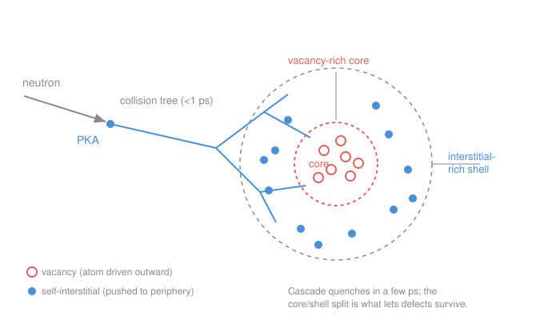

# Nuclear Materials · Lesson 1.3: The primary knock-on atom and displacement cascades

> ⏱ ~15 min · Module 1: Structure, defects, and radiation damage · Builds on: [1.2 How radiation deposits energy](01-02-how-radiation-deposits-energy.md) · Unlocks: [1.4 Kinchin–Pease, NRT, and dpa](01-04-kinchin-pease-nrt-dpa.md)

## Why this matters

In [1.2](01-02-how-radiation-deposits-energy.md) a fast neutron handed a chunk of energy $T$ to a single lattice atom and then flew on. That struck atom is where *material* damage actually begins — the neutron itself, being uncharged, does almost nothing to the metal directly. Everything the reactor does to steel over decades — the swelling, the hardening, the embrittlement — traces back to what that one recoiling atom does in the next trillionth of a second. This lesson follows it. By the end you'll know why a single collision can uproot hundreds of atoms, and why the wreckage it leaves is *organized* in a way that turns out to control whether the damage sticks.

## The idea

Imagine the break on a pool table. The cue ball (the neutron) barely slows, but the ball it strikes (the **primary knock-on atom**) rockets into the packed rack and detonates it — that ball hits two, those hit four, and in a blink a whole region is churning. A lattice is a *very* tightly packed rack: every atom has a dozen neighbors touching it. So a fast recoiling atom can't travel far without smashing into someone, and that someone smashes into someone else. One collision becomes a branching avalanche.

But there's a catch a pool table doesn't have: it takes real energy to *permanently* evict an atom from its lattice site. Nudge an atom gently and its neighbors' bonds spring it right back home — no damage. Only if it's hit hard enough to break past its cage does it end up stranded somewhere else, leaving a hole behind. That energy threshold is the gatekeeper of the whole process.

And here's the part that matters most downstream. When the dust settles (picoseconds later), the debris isn't random. The violent center of the cascade *melts* for an instant and atoms get shoved outward — so the middle is left starved of atoms (full of empty sites) while a shell of displaced atoms piles up around the edge. Vacancies in the core, interstitials on the rim. That spatial sorting is not a detail; it's the reason any damage survives at all.

## The formal version

**Primary knock-on atom (PKA).** The first lattice atom set in motion by an incident particle, carrying the transferred energy $T$ (from [1.2](01-02-how-radiation-deposits-energy.md), $T$ up to $T_{\max}=\frac{4M_1M_2}{(M_1+M_2)^2}E$). *In words: the neutron's messenger — the atom that inherits the neutron's punch and delivers it to the crystal.*

**Displacement threshold energy $E_d$.** The minimum kinetic energy a lattice atom must receive to be knocked off its site *permanently* — i.e. far enough that it doesn't just relax back. A struck atom is displaced only if the energy it receives $T > E_d$; if $T < E_d$ the atom recoils, jostles its neighbors, and the energy ends up as heat (lattice vibration) with no lasting defect.

$$T > E_d \;\Rightarrow\; \text{permanent displacement (a Frenkel pair)}; \qquad T < E_d \;\Rightarrow\; \text{just heat.}$$

*In words: there's a bouncer at the door — below $E_d$ you get turned away and nothing happens; above it you're evicted for good.* Typical values are $E_d \approx 25\text{–}40\ \mathrm{eV}$, and the field's working number for iron is $E_d \approx 40\ \mathrm{eV}$. (A displaced atom becomes an interstitial and leaves a vacancy — the **Frenkel pair** from [1.1](01-01-crystals-defects-refresher.md).) Note the scale: a 40 eV threshold against a PKA carrying *tens of thousands* of eV — one PKA has energy to spend on many displacements.

**Displacement cascade.** When a PKA's energy is far above $E_d$, it doesn't make just one Frenkel pair. It strikes a neighbor with enough energy that *that* atom (a secondary knock-on) is itself displaced with energy to spare, and so on — a branching tree of collisions that fully develops in **less than a picosecond** ($<10^{-12}\ \mathrm{s}$). *In words: one hard hit spawns a chain reaction of hits, each child collision softer than its parent, until every branch drops below $E_d$ and the tree stops.*

**Thermal spike.** At the peak of the cascade the local energy density is so high that a small region — a few nanometers across, thousands of atoms — briefly behaves like a *melt*: atoms lose their lattice order and move liquid-like for a few picoseconds. Then the surrounding cold crystal drains the heat away almost instantly (the **quench**), and the region refreezes. *In words: the cascade flash-melts a tiny pocket and the bulk snap-freezes it — and how it refreezes decides what defects are left.*

**Cascade morphology.** The refrozen debris is spatially sorted (see the figure):

- A compact **vacancy-rich core**: in the melt, atoms are pushed *outward* from the center, leaving that region depleted — a cluster of empty sites.
- An **interstitial-rich shell** around it: those ejected atoms come to rest just outside the core as self-interstitials.

*In words: the middle is left with holes, the rim is left with extra atoms.* Because vacancies and interstitials are physically *separated*, they can't all immediately find each other and annihilate — which is exactly why some damage survives (that's [1.5](01-05-cascade-to-defect-population.md)) and why the two defect types later drift to different sinks (the bias story of [2.2](02-02-dislocation-loops-bias.md)).

**Sub-cascade break-up.** At very high PKA energy the cascade doesn't stay one blob. The PKA travels far enough between hard collisions that it seeds *several* separate smaller cascades along its path — **sub-cascades**. *In words: past a certain energy, one giant cascade splits into a string of ordinary-sized ones rather than growing without limit.*

## Picture

## Worked examples

**Example 1 (how big is a cascade?).** In [1.2](01-02-how-radiation-deposits-energy.md) a 1 MeV neutron striking iron produced a PKA of up to $T_{\max}=\frac{4(1)(56)}{(57)^2}(1\ \mathrm{MeV})\approx 69\ \mathrm{keV}$. With $E_d = 40\ \mathrm{eV}$, roughly how many atoms can it displace?

Crudest possible bound: every collision that displaces an atom costs *at least* $E_d$ to break it free, and by momentum sharing each such event drains on the order of $2E_d$ from the moving pool (the freed atom carries away energy too). So

$$N_d \;\lesssim\; \frac{E_{\text{PKA}}}{2E_d} = \frac{69{,}000\ \mathrm{eV}}{2(40\ \mathrm{eV})} \approx 860\ \text{displaced atoms.}$$

*In words: a single fast-neutron hit can uproot on the order of a thousand atoms.* This $E_{\text{PKA}}/2E_d$ estimate is precisely the **Kinchin–Pease** count we'll build properly in [1.4](01-04-kinchin-pease-nrt-dpa.md) — there we'll also subtract the energy the PKA wastes on *ionization* (which doesn't displace anything) before dividing, so the real number is lower. But the order of magnitude — hundreds, from *one* neutron — is the headline.

*Sanity check.* Units: $\mathrm{eV}/\mathrm{eV}$ = dimensionless (a count) ✓. And it must be far more than 1 (a fast neutron obviously does more than make a single Frenkel pair) yet far less than Avogadro-scale (it's a local event) — hundreds sits sensibly in between ✓.

**Example 2 (why the core/shell split is the whole point).** Suppose those ~860 displacements produced ~860 vacancies and ~860 interstitials, dumped into the *same* few-nanometer volume. A vacancy and an interstitial that meet simply recombine — the atom drops back into the hole, erasing both. If they were uniformly mixed, almost all 1,720 defects would find a partner within picoseconds and the cascade would heal itself to nearly zero. Reactor steel would be immortal.

It isn't — and the reason is the morphology. Because the melt shoves interstitials *out* to the shell while vacancies are left in the core, the two populations start life spatially *segregated*. Most do still recombine during the quench, but the separation lets a surviving minority escape: a few percent of the vacancies stay clustered in the core, and a few percent of the interstitials get away into the surrounding crystal. *That surviving, pre-sorted population is the seed of everything downstream* — the core vacancy clusters and the freed interstitials are what later feed voids and dislocation loops. Quantifying the survival fraction is [1.5](01-05-cascade-to-defect-population.md); the fact that interstitials and vacancies, once separated, drift to *different* sinks is the dislocation **bias** of [2.2](02-02-dislocation-loops-bias.md) that drives void swelling. No spatial separation, no surviving defects, no bias, no swelling — the geometry is load-bearing.

## Watch out

- **You might think the neutron does the damage.** It doesn't, really — a neutron is uncharged and interacts only rarely, in a single hard collision. The *PKA* it creates is a charged, fast-moving atom that plows through the lattice and does essentially all the displacing. The neutron is the trigger; the PKA is the bullet.
- **You might think every atom the PKA touches is displaced.** No — only atoms that receive $T > E_d$ end up as permanent defects. Countless glancing hits deliver less than $E_d$ and just deposit heat. This threshold is why you can't simply count collisions; you must count collisions *above* $E_d$.
- **You might picture the cascade as a slow spreading of damage.** It's the opposite of slow: the whole branching tree forms and the thermal spike quenches in **a few picoseconds**, faster than atoms can diffuse. What you're left with at the end of that flash — the sorted core and shell — is the *initial* condition for the slow (seconds-to-years) defect evolution that follows in Module 2.

## One-liner

> A neutron's real damage is done by proxy: it makes one fast primary knock-on atom, which detonates a picosecond collision cascade that flash-melts a few nanometers and refreezes into a vacancy core wrapped in an interstitial shell — and that separation is why any damage survives at all.

## Problems

**P1 (🟢)** A copper PKA is created with 20 keV of kinetic energy; take $E_d = 30\ \mathrm{eV}$ for copper. Using the crude $N_d \approx E_{\text{PKA}}/2E_d$ estimate, about how many atoms does it displace? What physical process makes the *true* number smaller?

**P2 (🟡)** A lattice atom in iron ($E_d \approx 40\ \mathrm{eV}$) is struck and receives $T = 25\ \mathrm{eV}$ in one case and $T = 5\ \mathrm{keV}$ in another. In each case, does a permanent defect form? For the second case, does the struck atom stop after making a single Frenkel pair? Explain in one or two sentences each.

**P3 (🔴)** Two hypothetical cascades deposit the *same* total energy and make the *same* number of Frenkel pairs. In cascade A the vacancies and interstitials are thoroughly intermixed; in cascade B they are separated into a vacancy core and an interstitial shell. Which cascade leaves *more* surviving damage after the picosecond quench, and why? What does your answer imply about which PKA — a light-atom or heavy-atom target of the same energy — might leave more surviving damage per displacement? (Qualitative reasoning; connect to recombination.)

Solutions

**P1** Direct plug-in:

$$N_d \approx \frac{E_{\text{PKA}}}{2E_d} = \frac{20{,}000\ \mathrm{eV}}{2(30\ \mathrm{eV})} = \frac{20{,}000}{60} \approx 333\ \text{atoms.}$$

So roughly **300 displaced atoms** from one 20 keV PKA. The true number is smaller because part of the PKA's energy is lost to **electronic excitation / ionization** — it drags on the electron cloud instead of knocking atomic nuclei — and that energy displaces nothing. Only the *nuclear* (elastic-collision) portion of the energy, the "damage energy," is available for displacements, which is exactly the correction Kinchin–Pease → NRT makes in [1.4](01-04-kinchin-pease-nrt-dpa.md).

*Check.* Units $\mathrm{eV}/\mathrm{eV}$ = pure number ✓; hundreds of displacements from a 20 keV hit is the right order of magnitude (compare Example 1's ~860 from 69 keV — scaling linearly, $69/20 \approx 3.5\times$ the energy gives $\approx 3.5\times$ the count, and $860/333 \approx 2.6$; the mild discrepancy is just the different $E_d$, 40 vs. 30 eV ✓).

**P2** *Case $T = 25\ \mathrm{eV}$:* $25 < E_d = 40$, so **no permanent defect** — the atom is jostled but its neighbors' bonds spring it back to its site; the 25 eV becomes lattice heat. *Case $T = 5\ \mathrm{keV}$:* $5000 \gg 40$, so **yes**, a defect forms — and the atom does *not* stop at one Frenkel pair. With 5 keV it is itself a knock-on atom carrying ~125× the threshold energy; it goes on to strike and displace many more atoms, seeding a small cascade. The single-Frenkel-pair picture only holds when a struck atom receives just barely more than $E_d$.

**P3** **Cascade A** (intermixed) leaves *less* surviving damage; **cascade B** (separated core/shell) leaves *more*. Reason: surviving damage is set by how much *recombination* happens during the quench. A vacancy and interstitial that are close together annihilate almost immediately (the interstitial atom just falls into the neighboring hole). In A, every defect has a partner right beside it, so recombination is near-total and little survives. In B, the melt has already carried the interstitials out to the shell, away from the vacancy-filled core, so many defects have no nearby partner to annihilate with and are frozen in when the region refreezes — more survives.

Implication for target mass: a **heavy-atom** target tends to produce a *denser, more compact* cascade (the heavy PKA moves shorter distances between hard collisions, concentrating the damage), which means *more* overlap of vacancies and interstitials and thus *more* in-cascade recombination — so **fewer surviving defects per displacement**. A light-atom target spreads the same energy over a more dilute, extended cascade with less overlap, so a *larger fraction* survives. (This "cascade density → recombination efficiency" link is exactly what the defect-survival efficiency in [1.5](01-05-cascade-to-defect-population.md) captures.)

## Flashback

**From Lesson 1.2 (How radiation deposits energy):** A 1 MeV neutron scatters elastically off a **tungsten** atom (mass number $A = 184$) in a fusion first-wall material. Using $T_{\max} = \frac{4M_1M_2}{(M_1+M_2)^2}\,E$ with $M_1 = 1$ (neutron) and $M_2 = 184$, find the maximum PKA energy. Compare it to the ~69 keV a 1 MeV neutron gives an iron atom, and say in one sentence what that difference means for how much a heavy target is displaced.

Solution

$$T_{\max} = \frac{4(1)(184)}{(1+184)^2}(1\ \mathrm{MeV}) = \frac{736}{185^2}\,E = \frac{736}{34{,}225}(1\ \mathrm{MeV}) \approx 0.0215 \times 1\ \mathrm{MeV} \approx 21.5\ \mathrm{keV}.$$

*Compared to iron:* a 1 MeV neutron gives Fe up to ~69 keV but W only ~21.5 keV — about **3× less**, because the energy-transfer efficiency $\frac{4M_1M_2}{(M_1+M_2)^2}$ falls as the target gets heavier relative to the neutron (the light neutron bounces off a heavy atom, transferring little). *Meaning:* per neutron collision, a heavy target like tungsten receives a smaller PKA energy, so a smaller cascade and fewer displacements — one reason tungsten is attractive as a plasma-facing material ([4.5](04-05-materials-for-fusion.md)), though the harder 14 MeV fusion spectrum complicates that story.

*Check.* Efficiency is dimensionless and $\le 1$: $0.0215 \le 1$ ✓; and it's smaller than iron's $\frac{4(56)}{57^2}=0.069$ since 184 > 56 ✓. Units: (dimensionless)(MeV) = MeV ✓.

## Connections

- **Backward:** the transferred energy $T$ that starts a PKA is the elastic-scattering result from [1.2](01-02-how-radiation-deposits-energy.md); the vacancy-plus-interstitial Frenkel pair each displacement creates is the point-defect vocabulary from [1.1](01-01-crystals-defects-refresher.md) and, more fully, from [materials-science 2.1](../../materials-science/lessons/02-01-point-defects-solid-solutions.md).
- **Forward:** [1.4](01-04-kinchin-pease-nrt-dpa.md) turns the Example-1 estimate $E_{\text{PKA}}/2E_d$ into the rigorous Kinchin–Pease and NRT displacement counts and the **dpa** dose unit; [1.5](01-05-cascade-to-defect-population.md) quantifies what fraction of those displacements actually *survive* the quench — the survival efficiency that the core/shell separation makes nonzero.
- **Sideways:** the spatial separation of vacancies (core) and interstitials (shell) is the seed of the **dislocation bias** in [2.2](02-02-dislocation-loops-bias.md) — interstitials and vacancies, once apart, migrate to *different* sinks, and that asymmetry is the engine of void swelling ([2.3](02-03-voids-void-swelling.md)). The same picosecond thermal-spike physics reappears in ion-beam materials processing outside reactors.
