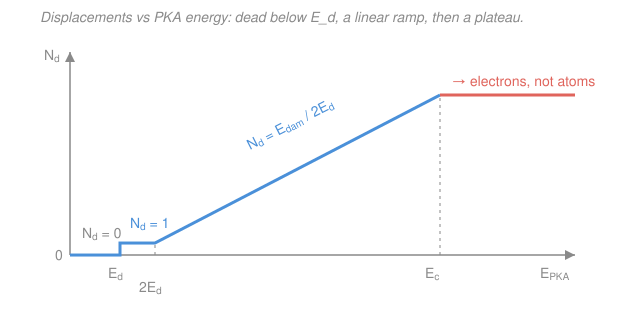

# Nuclear Materials · Lesson 1.4: Counting displacements — Kinchin–Pease, NRT, and dpa

> ⏱ ~15 min · Module 1: From radiation to atomic damage · Builds on: [1.3 PKA & displacement cascades](01-03-pka-displacement-cascades.md), [1.2 How radiation deposits energy](01-02-how-radiation-deposits-energy.md) · Unlocks: [1.5 From cascade to defect population](01-05-cascade-to-defect-population.md), and the whole dose-based field

## Why this matters

Two engineers argue about which reactor is harder on its steel. One runs a thermal spectrum for 30 years; the other, a fast spectrum for 5. Their neutron fluences (neutrons per cm²) are wildly different — but fluence counts *neutrons*, and a slow neutron and a fast neutron do wildly different amounts of atomic damage. You need a currency that measures **damage to the lattice**, not neutrons in flight, so that "10 units here" and "10 units there" mean the same wear-and-tear regardless of spectrum.

That currency is **dpa** — displacements per atom. This lesson builds it from the ground up: take a PKA's energy, throw away the part that just heats the electrons, count the stable atom-kicks that survive, and turn a count-per-atom into a dose rate. dpa is the x-axis of essentially every radiation-damage plot you will ever read — swelling, hardening, embrittlement all get graphed against it.

## The idea

In [1.3](01-03-pka-displacement-cascades.md) a primary knock-on atom (PKA) tore through the lattice, kicking secondaries, kicking tertiaries — a branching **cascade**. We now want a single number: *how many atoms end up knocked off their lattice sites and stay off?* Three honest simplifications get us there.

**First, not all the PKA's energy makes displacements.** A moving atom loses energy two ways: by *smacking other nuclei* (that's what displaces them) and by *dragging through the electron sea* (that just makes heat, no displacement). Only the nuclear part — the **damage energy** $E_{dam}$ — is available to break bonds. Rule of thumb: about 70 % of a PKA's energy ends up as damage energy; the other 30 % is lost to electrons.

**Second, each displacement has a fixed price.** It costs a certain minimum energy, the **displacement threshold** $E_d$ (tens of eV), to knock an atom permanently off its site. So a naive count is "budget divided by price": $E_{dam}/E_d$. But there's a subtlety — when one atom knocks another, the energy *splits* between them, and on average this halving means the true count is $E_{dam}/2E_d$. That's **Kinchin–Pease**.

**Third, real cascades are messier than the model** — atoms recombine, some displacements are wasted re-hits. A single fudge factor $\kappa = 0.8$ patches this: the **NRT** standard is $0.8 \times$ Kinchin–Pease. Multiply that count by how often each atom gets displaced per second, times seconds of exposure, and you have **dpa**.

## The formal version

**Damage energy (Lindhard partition).** Of a PKA's kinetic energy $E_{PKA}$, only a fraction goes into elastic nuclear collisions; the rest ionizes and excites electrons. Write the useful part as

$$E_{dam} \approx 0.7\,E_{PKA}.$$

*In words: knock 30 % off the PKA energy to account for energy lost heating the electrons — only what's left can displace atoms.* (This 0.7 is a rule of thumb for metals at $\sim$100 keV; the exact partition is the Lindhard function, which depends on energy and atomic number. Below a few keV nearly all energy is nuclear, so $E_{dam}\to E_{PKA}$; at MeV energies electronic loss dominates.)

**Kinchin–Pease displacement count.** The number of stable Frenkel pairs (vacancy + interstitial) produced is

$$N_d = \frac{E_{dam}}{2E_d},$$

where $E_d$ is the **displacement threshold energy** (typically 25–90 eV; e.g. $\approx 40$ eV for iron, $\approx 90$ eV for tungsten). *In words: the surviving-displacement count is the damage-energy budget divided by twice the per-atom cost.* The factor **2** comes from energy sharing: in a hard collision the incoming atom hands off roughly half its energy, so on average it takes $\sim 2E_d$ of budget to net one lasting displacement. The model also has a **plateau**: above a cutoff energy $E_c$, any extra PKA energy is spent on electronic losses (ionization) rather than displacements, so $N_d$ stops climbing — this is exactly what the modern $E_{dam}$ partition captures more smoothly. Below $E_d$, $N_d = 0$ (not enough to displace anything); between $E_d$ and $2E_d$, $N_d = 1$.

**NRT (Norgett–Robinson–Torrens).** The international standard adds a **displacement efficiency** $\kappa = 0.8$:

$$\boxed{\,N_d = \frac{0.8\,E_{dam}}{2E_d} = \frac{0.4\,E_{dam}}{E_d}\,}$$

*In words: NRT is Kinchin–Pease scaled down to 80 %, correcting for in-cascade recombination and wasted re-collisions.* This is *the* formula used to report dpa; when a paper says "dpa," it almost always means NRT-dpa.

**dpa — turning a count into a dose.** One atom's chance of being displaced per unit time is the **displacement cross section** $\sigma_d$ (cm², already folded through NRT and averaged over the neutron spectrum) times the **neutron flux** $\phi$ (neutrons·cm⁻²·s⁻¹). So

$$\text{dpa rate} = \sigma_d\,\phi \quad(\text{s}^{-1}), \qquad \text{dpa} = \sigma_d\,\phi\,t,$$

with $t$ the exposure time (s). *In words: dpa is the expected number of times an average atom has been knocked off its site — 10 dpa means each atom has been displaced, on average, ten times.* $\sigma_d$ itself bundles the spectrum-averaged displacement count per collision: $\sigma_d = \int \sigma_{scatter}(E)\,N_d(E)\,dE$ over the neutron energy distribution, which is why it already "knows" whether the neutrons are fast or thermal.

## Picture

The whole model in one curve: dead zone → single displacement → linear ramp (slope set by $1/2E_d$) → plateau where the extra energy just heats electrons instead of moving atoms.

## Worked examples

These are parts (a) and (b) of Module 1's boss problem — the full chain from flux to displacements.

**Example 1 (dpa from flux — mind the barns).** A steel component sits in a flux $\phi = 1\times10^{15}\ \text{n·cm}^{-2}\text{·s}^{-1}$ with a spectrum-averaged displacement cross section $\sigma_d = 2000\ \text{b}$. How much dpa in one full-power year?

First convert barns to cm²: $1\ \text{b} = 10^{-24}\ \text{cm}^2$, so

$$\sigma_d = 2000\ \text{b} = 2000\times10^{-24}\ \text{cm}^2 = 2\times10^{-21}\ \text{cm}^2.$$

The dpa rate is

$$\sigma_d\,\phi = (2\times10^{-21}\ \text{cm}^2)(1\times10^{15}\ \text{cm}^{-2}\text{s}^{-1}) = 2\times10^{-6}\ \text{s}^{-1}.$$

One full-power year is $t = 3.15\times10^7\ \text{s}$, so

$$\text{dpa} = (2\times10^{-6}\ \text{s}^{-1})(3.15\times10^{7}\ \text{s}) \approx 63\ \text{dpa}.$$

*Sanity check:* units cancel to dimensionless (cm² · cm⁻²s⁻¹ · s = 1), as a "per atom" count must. 63 dpa in a year is heavy — each atom bumped off its site 63 times over. That's the neighborhood of a fast-reactor core internal; a typical light-water pressure vessel sees a fraction of a dpa over its whole life.

**Example 2 (displacements from one PKA — the two models).** A 100 keV PKA is created in iron ($E_d = 40\ \text{eV}$). How many stable displacements by Kinchin–Pease, and by NRT?

Damage energy first:

$$E_{dam} \approx 0.7\times 100\ \text{keV} = 70\ \text{keV} = 70{,}000\ \text{eV}.$$

Kinchin–Pease:

$$N_d = \frac{E_{dam}}{2E_d} = \frac{70{,}000\ \text{eV}}{2\times 40\ \text{eV}} = \frac{70{,}000}{80} = 875.$$

NRT scales by $\kappa = 0.8$:

$$N_d^{\text{NRT}} = 0.8\times 875 = 700.$$

*Sanity check:* keep the same energy units top and bottom (eV / eV) and the count is a pure number, good. One 100 keV recoil makes a cascade of order several hundred lasting Frenkel pairs — and NRT's 700 is the number a code like SPECTER or a damage-dose report would actually quote. (How many *survive* long-term is smaller still — recombination in [1.5](01-05-cascade-to-defect-population.md).)

## Watch out

- **You might think dpa counts how many defects are *left* in the material — it doesn't.** dpa is a *bookkeeping* dose: the number of displacements the NRT formula *predicts*, not the number of vacancies and interstitials you'd find afterward. Most displaced atoms recombine within picoseconds; the surviving fraction can be well under 30 %. dpa is a comparable exposure unit, not a defect census — that census is [1.5](01-05-cascade-to-defect-population.md)'s job.
- **You might think fluence and dpa are interchangeable.** Fluence (n/cm²) counts neutrons crossing an area; dpa counts atomic kicks. A thermal reactor can rack up huge fluence with little dpa (slow neutrons barely displace anything), while a fast reactor does more dpa per neutron. Only dpa lets you compare damage across spectra — that's its entire reason to exist. And neither is **burnup** (fissions per heavy-metal atom, or MWd/kg), which measures how much *fuel* was consumed, a separate axis entirely.
- **You might forget to strip the electronic losses.** Plugging $E_{PKA}$ straight into $E_{dam}/2E_d$ overcounts by $\sim$40 % (you'd get $100{,}000/80 = 1250$ instead of 875 above). Always take $E_{dam}\approx 0.7E_{PKA}$ *first*, then divide.

## One-liner

> dpa is damage energy, de-electron-ed and halved and 0.8-ed into a displacement count, then multiplied by $\sigma_d\phi t$ — a spectrum-proof yardstick for "how beaten up is this lattice."

## Problems

**P1 (🟢)** A 500 keV PKA forms in tungsten, where $E_d = 90\ \text{eV}$. Using $E_{dam}\approx 0.7E_{PKA}$, estimate the NRT displacement count.

**P2 (🟡)** A cladding tube sees $\phi = 3\times10^{14}\ \text{n·cm}^{-2}\text{·s}^{-1}$ with $\sigma_d = 1500\ \text{b}$. How many years to accumulate 30 dpa? (Use 1 year $=3.15\times10^7$ s.)

**P3 (🔴)** For the Example 2 iron PKA, NRT predicts 700 displacements, but molecular-dynamics simulations of that cascade find only about 200 defects still present after the cascade cools. (a) What surviving fraction is that? (b) In one sentence, explain why the two numbers differ and which one a swelling model should use.

Solutions

**P1** Damage energy: $E_{dam}\approx 0.7\times 500\ \text{keV} = 350\ \text{keV} = 350{,}000\ \text{eV}$. NRT:

$$N_d^{\text{NRT}} = \frac{0.8\,E_{dam}}{2E_d} = \frac{0.8\times 350{,}000}{2\times 90} = \frac{280{,}000}{180} \approx 1560.$$

About **1,560 displacements**. (Kinchin–Pease alone would give $350{,}000/180 \approx 1940$; the 0.8 knocks it to $\sim$1560.) Units check: eV/eV, dimensionless. Larger than the iron case despite tungsten's higher $E_d$, because the PKA energy is 5× bigger.

**P2** Convert: $\sigma_d = 1500\times10^{-24} = 1.5\times10^{-21}\ \text{cm}^2$. dpa rate:

$$\sigma_d\phi = (1.5\times10^{-21})(3\times10^{14}) = 4.5\times10^{-7}\ \text{s}^{-1}.$$

Time to 30 dpa:

$$t = \frac{30}{4.5\times10^{-7}\ \text{s}^{-1}} = 6.67\times10^{7}\ \text{s}.$$

In years: $6.67\times10^{7} / 3.15\times10^{7} \approx \mathbf{2.1\ \text{years}}$. Sanity check: this flux is $\sim$3× lower than Example 1's, and 30 dpa is $\sim$half of 63, so a couple of years feels right.

**P3** (a) Surviving fraction $= 200/700 \approx 0.29$, i.e. about **29 %**. (b) NRT is a *fixed formula* that ignores what happens after the initial knock-ons — but in the real cascade most interstitials fall straight back into nearby vacancies (recombination) within picoseconds, so far fewer defects persist; a swelling or hardening model needs the **survivors** (200), not the NRT bookkeeping count (700), which is why [1.5](01-05-cascade-to-defect-population.md) introduces a survival efficiency on top of NRT-dpa.

## Flashback

**From Lesson 1.3 (PKA & displacement cascades):** A 2 MeV neutron scatters elastically off an iron nucleus ($A = 56$). Recall the maximum recoil (PKA) energy from a head-on elastic collision, $E_{PKA}^{\max} = \dfrac{4A}{(1+A)^2}\,E_n$. Compute it, then feed that PKA into NRT ($E_d = 40$ eV) to estimate the worst-case displacement count from a single such neutron hit.

Solution

Maximum energy transfer fraction:

$$\frac{4A}{(1+A)^2} = \frac{4\times 56}{57^2} = \frac{224}{3249} \approx 0.0689.$$

So $E_{PKA}^{\max} \approx 0.0689 \times 2\ \text{MeV} \approx 138\ \text{keV}$. Damage energy: $E_{dam}\approx 0.7\times 138 \approx 96\ \text{keV} = 96{,}000\ \text{eV}$. NRT:

$$N_d^{\text{NRT}} = \frac{0.8\times 96{,}000}{2\times 40} = \frac{76{,}800}{80} \approx 960\ \text{displacements}.$$

So one hard hit from a fast neutron can spawn a cascade of order a thousand displacements — and a fast reactor delivers $\sim 10^{15}$ such neutrons per cm² per second. That's the bridge from a single collision to reactor-scale dpa. (Note this is the *maximum*; an average scatter transfers about half the max, so typical PKAs and their cascades are smaller.)

## Connections

- **Backward:** this closes the [1.3](01-03-pka-displacement-cascades.md) cascade story with a number, and it reuses the elastic energy-transfer picture from [1.2](01-02-how-radiation-deposits-energy.md). The "electronic vs nuclear stopping" split behind $E_{dam}$ is the same physics as charged-particle stopping in [`intro-nuclear-engineering` 4.3](../../intro-nuclear-engineering/lessons/04-03-charged-particles-through-matter.md).
- **Forward:** [1.5](01-05-cascade-to-defect-population.md) corrects NRT-dpa for recombination and clustering to get the *surviving* defect population; every later module (swelling, hardening, embrittlement) is plotted against dpa. The $\sigma_d = \int \sigma(E)N_d(E)\,dE$ construction leans on the microscopic cross section of [`intro-nuclear-engineering` 2.1](../../intro-nuclear-engineering/lessons/02-01-microscopic-cross-section.md) and the flux from [`reactor-physics`](../../reactor-physics/syllabus.md).
- **Sideways:** dpa is a *dose* unit built the same way as radiological dose in [`intro-nuclear-engineering` 4.4](../../intro-nuclear-engineering/lessons/04-04-dose-quantities.md) — energy deposited, weighted by how much damage it does, per unit of target. Here the target is the crystal lattice instead of tissue, but the "deposited energy → effective damage" logic is identical. Fusion first-wall design (materials for fusion, [4.5](04-05-materials-for-fusion.md)) lives and dies by keeping lifetime dpa under a limit.
