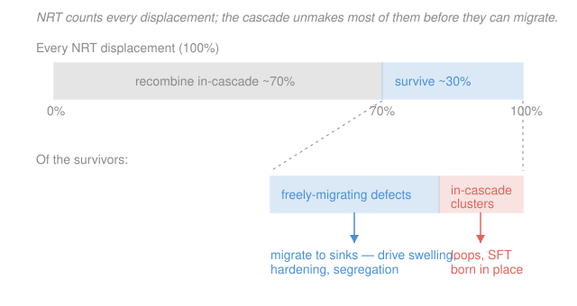

# Nuclear Materials · Lesson 1.5: From cascade to defect population

> ⏱ ~15 min · Module 1: Structure, defects, and radiation damage · Builds on: [1.4 Kinchin–Pease, NRT, and dpa](01-04-kinchin-pease-nrt-dpa.md), [1.3 The PKA and displacement cascades](01-03-pka-displacement-cascades.md) · Unlocks: [2.1 Defect migration and radiation-enhanced diffusion](02-01-defect-migration-radiation-enhanced-diffusion.md)

## Why this matters

In [1.4](01-04-kinchin-pease-nrt-dpa.md) you learned to turn a neutron fluence into **dpa** — displacements per atom — the dose unit the whole field runs on. But here is the uncomfortable truth: dpa counts every atom the cascade *knocks off its site*, and the overwhelming majority of those atoms are back home nanoseconds later, as if nothing happened. If you predicted swelling or hardening straight from dpa, you would overshoot by a factor of three to a hundred. This lesson is the correction: what actually survives a cascade, why so little does, and why two components at the *same dpa* can end up in very different shape. It is the bridge from "how much damage was dealt" to "how much damage stuck."

## The idea

Picture the end of a displacement cascade from [1.3](01-03-pka-displacement-cascades.md). For a few picoseconds a tiny region is a molten **thermal spike** — hundreds of atoms shoved off their lattice sites all at once. The geometry is not random: the energetic recoils fling **interstitials** (extra atoms jammed between sites) outward to the cascade's edge, leaving a **vacancy-rich core** in the middle. So you have a hollow shell of interstitials wrapped around an empty core.

Now the spike cools. Vacancies and interstitials are opposite defects — put one next to the other and they cancel, restoring a perfect atom on a perfect site. And they are packed together, hot, and mobile. So most of them find a partner and **recombine on the spot**, inside the cascade, before anything migrates anywhere. Only a small fraction escape: some survive as isolated point defects free to wander off — the ones that matter — and some get locked into tiny **clusters** (little dislocation loops or vacancy tetrahedra) that were assembled right there in the cascade, no long-range travel required.

The defects that escape as isolated, mobile point defects have a name — **freely-migrating defects (FMD)** — because they are the ones that actually travel to sinks (grain boundaries, dislocations, surfaces) and rewrite the microstructure. Everything downstream in this course — swelling, hardening, segregation — is driven by FMD, not by raw dpa. And crucially, the surviving fraction depends on *how fast* you deposit the dose, not just how much: that is the **dose-rate effect**, and it is why dpa alone underdetermines the damage.

## The formal version

**Defect survival (production) efficiency.** Of the $N_{\mathrm{NRT}}$ displacements the NRT model of [1.4](01-04-kinchin-pease-nrt-dpa.md) says a cascade produced, only a fraction survives in-cascade recombination:

$$\xi \;=\; \frac{\text{point defects that survive the cascade}}{N_{\mathrm{NRT}}}, \qquad \xi \approx 0.01\text{–}0.30.$$

Here $\xi$ (dimensionless) is the **survival efficiency**. *In words: for every hundred displacements NRT counts, only somewhere between one and thirty are still around once the spike has cooled — the rest annihilated.* The value drops with **PKA energy** (denser cascades recombine harder), rises at **low temperature** (frozen defects cannot find partners), and shifts with **dose rate** (below).

**Freely-migrating defects.** The survivors split two ways:

$$\xi\,N_{\mathrm{NRT}} \;=\; \underbrace{N_{\mathrm{FMD}}}_{\text{isolated, mobile}} \;+\; \underbrace{N_{\mathrm{clust}}}_{\text{born in clusters}}.$$

*In words: some survivors are lone point defects free to migrate to distant sinks (FMD); the rest are already tied up in cascade-produced clusters — small interstitial loops and vacancy **stacking-fault tetrahedra (SFT)** — that formed without any long-range diffusion.* The FMD fraction that truly reaches distant sinks can be smaller still (a few percent of NRT in strict estimates); in this course we lump the effective mobile survivors into one number.

**Surviving-defect production rate.** In [1.4](01-04-kinchin-pease-nrt-dpa.md) the dpa rate was the displacement cross section times the flux, $\dot{d} = \sigma_d\,\phi$ (units: displacements per atom per second). The rate at which *surviving* defects are produced is just that scaled by efficiency:

$$\boxed{\;\dot{d}_{\mathrm{surv}} \;=\; \xi\,\dot{d} \;=\; \xi\,\sigma_d\,\phi\;}$$

*In words: multiply the raw dpa rate by the surviving fraction to get the rate of defects that actually go on to do damage.* Units are still (defects per atom per second); integrate over time to get surviving-displacements per atom.

**The dose-rate effect.** Two irradiations to the *same total dpa* at different flux $\phi$ are **not** equivalent. Higher $\phi$ packs the same dose into less time, so at any instant the point-defect concentrations are higher — which enhances mutual **recombination** and leaves less time per dpa for defects to reach sinks or thermally anneal. The net result is that the whole microstructural response (especially void swelling, [2.3](02-03-voids-void-swelling.md)) **shifts to higher temperature** as dose rate rises. *In words: dpa tells you the size of the hammer blow, not how the metal digests it; the flux and temperature decide that.* This is why a **materials test reactor** at high flux cannot simply mimic a **power reactor** at the same dpa — you must correct for the shift.

## Picture

## Worked examples

**Example 1 (the surviving-defect rate — Boss Problem 1c).** Take the fast-reactor case from [1.4](01-04-kinchin-pease-nrt-dpa.md): flux $\phi = 1\times10^{15}\ \mathrm{n\,cm^{-2}\,s^{-1}}$ and displacement cross section $\sigma_d = 2000\ \mathrm{b} = 2\times10^{-21}\ \mathrm{cm^2}$. The raw dpa rate is

$$\dot{d} = \sigma_d\,\phi = (2\times10^{-21})(1\times10^{15}) = 2\times10^{-6}\ \mathrm{dpa/s},$$

which over one full-power year ($3.156\times10^{7}\ \mathrm{s}$) is about $63\ \mathrm{dpa}$. Now suppose in-cascade recombination leaves only $\xi \approx 0.30$ as freely-migrating. The surviving-defect production rate is

$$\dot{d}_{\mathrm{surv}} = \xi\,\dot{d} = 0.30\times(2\times10^{-6}) = 6\times10^{-7}\ \text{defects per atom per second},$$

or about $19$ surviving displacements per atom over the year, versus the $63$ dpa the dose meter reads.

*Why swelling tracks this number and not dpa:* voids and loops grow only when point defects actually **migrate to sinks and pile up** there ([2.1](02-01-defect-migration-radiation-enhanced-diffusion.md), [2.3](02-03-voids-void-swelling.md)). The $\sim 70\%$ of displacements that recombine inside the cascade never leave — they contribute exactly zero to the vacancy supersaturation that feeds a growing void. So the microstructure "sees" $\dot{d}_{\mathrm{surv}}$, not $\dot{d}$. Because $\xi$ itself drifts with PKA spectrum, temperature, and dose rate, two components at identical dpa can swell by quite different amounts — which is precisely why measured swelling correlates far better with the surviving-defect dose than with raw dpa.

**Example 2 (dose-rate effect — test reactor vs. power reactor).** You want to qualify a steel for a commercial reactor where it will see $\phi_{\text{pwr}} \sim 5\times10^{13}$ over decades, reaching (say) 30 dpa. Waiting decades is impossible, so you use a materials test reactor at $\phi_{\text{test}} \sim 5\times10^{15}$ — a hundred times the flux — and hit 30 dpa in months. Same dpa. Same microstructure?

No. At $100\times$ the dose rate, point-defect concentrations run far higher, so vacancies and interstitials recombine more aggressively and spend less time per dpa wandering to sinks. If you irradiated at the *same temperature*, the test-reactor sample would show **less swelling** — the higher recombination throttles the vacancy flux to voids. To reproduce the power-reactor microstructure you must **raise the test-reactor temperature** by roughly 50–100 °C, giving vacancies enough thermal mobility to escape recombination and restore the same balance (the "temperature-shift" rule). The lesson: dpa fixes the *amount* of displacement, but flux and temperature together fix what survives and where it goes. Report a dose without its dose rate and temperature and you have not fully specified the damage.

## Watch out

- **You might think dpa is a direct measure of damage.** It is a measure of *displacement events*, not of surviving damage. Most displacements self-heal in-cascade; the engineering effect scales with the surviving fraction $\xi\,N_{\mathrm{NRT}}$, which can be 3–100× smaller. dpa is a useful common currency across facilities — just never read it as "atoms permanently displaced."
- **You might think a bigger, more energetic PKA is more efficient at making lasting defects.** Per displacement, it is *less* efficient: a high-energy PKA makes a denser cascade with a hotter spike, and denser cascades recombine harder, so $\xi$ *falls* with PKA energy. It makes more total defects but a smaller fraction of them survive.
- **You might think clustered survivors and freely-migrating survivors do the same thing.** They do not. FMD travel to distant sinks and drive long-range effects (segregation, void growth). In-cascade clusters are born in place and act as immobile obstacles or dislocation sources from the start ([2.2](02-02-dislocation-loops-bias.md)) — they never had to migrate to exist.

## One-liner

> A cascade counts a hundred displacements, heals seventy of them on the spot, and lets maybe thirty survive as freely-migrating defects — so real damage tracks $\xi\,\sigma_d\phi$, and $\xi$ depends on how fast and how hot you deposit the dose.

## Problems

**P1 (🟢)** A component sees a raw displacement rate $\dot{d} = 8\times10^{-7}\ \mathrm{dpa/s}$, and its cascade survival efficiency is $\xi = 0.20$. (a) Give the surviving-defect production rate per atom per second. (b) How many surviving displacements per atom accumulate over 3 full-power years ($1\ \mathrm{FPY} = 3.156\times10^{7}\ \mathrm{s}$)?

**P2 (🟡)** Two identical alloy coupons are each irradiated to exactly 20 dpa at the same temperature: coupon A in a high-flux test reactor (months), coupon B in a low-flux power reactor (years). Which one is likely to show *more* void swelling, and why? What single knob could you turn on the test-reactor irradiation to make coupon A's microstructure better match coupon B's?

**P3 (🔴)** A 60 keV PKA forms in iron. Take the damage energy as 70% of the PKA energy, $E_d = 40\ \mathrm{eV}$, and NRT efficiency $\kappa = 0.8$ (all from [1.4](01-04-kinchin-pease-nrt-dpa.md)). (a) Compute $N_{\mathrm{NRT}}$, the NRT Frenkel-pair count. (b) If in-cascade recombination gives $\xi = 0.15$, how many defects actually survive? (c) In one sentence, say which of the two numbers a rate-theory swelling model should be fed.

Solutions

**P1** (a) The surviving rate is efficiency times raw rate:

$$\dot{d}_{\mathrm{surv}} = \xi\,\dot{d} = 0.20\times(8\times10^{-7}) = 1.6\times10^{-7}\ \text{defects per atom per second.}$$

(b) Total time $t = 3\times3.156\times10^{7} = 9.47\times10^{7}\ \mathrm{s}$. Multiply:

$$\dot{d}_{\mathrm{surv}}\,t = (1.6\times10^{-7})(9.47\times10^{7}) \approx 15\ \text{surviving displacements per atom.}$$

*Check.* Equivalently, raw dose is $\dot{d}\,t = (8\times10^{-7})(9.47\times10^{7}) \approx 76\ \mathrm{dpa}$, and $0.20\times76 \approx 15$ ✓. Units: (defects/atom/s)·(s) = defects/atom ✓.

**P2** Coupon B (low flux, power reactor) is likely to swell **more**. At the same temperature, the high-flux coupon A builds up much higher point-defect concentrations, which drives more mutual recombination and leaves less time per dpa for vacancies to migrate to voids — throttling swelling. So same dpa does *not* mean same damage; the high dose rate suppresses the surviving vacancy flux to sinks. The knob to turn: **raise coupon A's irradiation temperature** (by roughly 50–100 °C). The extra thermal mobility lets vacancies escape recombination and restores the balance the power reactor achieves at lower flux — the temperature-shift compensation for dose rate.

**P3** (a) Damage energy $E_{\mathrm{dam}} = 0.70\times 60{,}000 = 42{,}000\ \mathrm{eV}$. NRT count:

$$N_{\mathrm{NRT}} = \frac{\kappa\,E_{\mathrm{dam}}}{2E_d} = \frac{0.8\times 42{,}000}{2\times 40} = \frac{33{,}600}{80} = 420\ \text{Frenkel pairs.}$$

(b) Surviving defects: $\xi\,N_{\mathrm{NRT}} = 0.15\times 420 = 63$ defects.

(c) The swelling model should be fed the **63 surviving defects** — only the survivors migrate to sinks and grow voids; the other 357 recombined in-cascade and drive nothing.

*Check.* $63/420 = 0.15$ ✓, and $420$ is a sensible cascade size for a 60 keV PKA (hundreds of pairs), consistent with [1.4](01-04-kinchin-pease-nrt-dpa.md). Units are pure counts throughout ✓.

## Flashback

**From Lesson 1.4 (Kinchin–Pease, NRT, and dpa):** A structural component sits in a thermal-reactor position with flux $\phi = 5\times10^{13}\ \mathrm{n\,cm^{-2}\,s^{-1}}$ and an effective displacement cross section $\sigma_d = 500\ \mathrm{b}$. How many dpa does it accumulate in 2 full-power years ($1\ \mathrm{FPY} = 3.156\times10^{7}\ \mathrm{s}$)? (Fresh numbers — no survival efficiency here, just the raw dpa from 1.4.)

Solution

Convert the cross section: $\sigma_d = 500\ \mathrm{b} = 500\times10^{-24} = 5\times10^{-22}\ \mathrm{cm^2}$. The dpa rate is

$$\dot{d} = \sigma_d\,\phi = (5\times10^{-22})(5\times10^{13}) = 2.5\times10^{-8}\ \mathrm{dpa/s}.$$

Total time $t = 2\times 3.156\times10^{7} = 6.31\times10^{7}\ \mathrm{s}$, so

$$\text{dpa} = \dot{d}\,t = (2.5\times10^{-8})(6.31\times10^{7}) \approx 1.6\ \mathrm{dpa}.$$

*Check.* Same answer via fluence: $\Phi = \phi t = (5\times10^{13})(6.31\times10^{7}) = 3.16\times10^{21}\ \mathrm{n/cm^2}$, and $\sigma_d\Phi = (5\times10^{-22})(3.16\times10^{21}) \approx 1.6\ \mathrm{dpa}$ ✓. Magnitude sanity: a couple of dpa over two years at LWR-scale flux is right — power-reactor internals accumulate only a handful of dpa per decade, versus tens per year in a fast reactor. ✓

## Connections

- **Backward:** this refines [1.4](01-04-kinchin-pease-nrt-dpa.md) — NRT gave $N_{\mathrm{NRT}}$, and this lesson multiplies it by the survival efficiency $\xi$ to get what is real. The vacancy-core / interstitial-shell geometry that makes recombination so efficient comes straight from the cascade morphology of [1.3](01-03-pka-displacement-cascades.md). The surviving vacancies and interstitials are the same point defects catalogued in materials-science [2.1 Point defects](../../materials-science/lessons/02-01-point-defects-solid-solutions.md).
- **Forward:** [2.1 Defect migration](02-01-defect-migration-radiation-enhanced-diffusion.md) picks up exactly the freely-migrating survivors and tracks them to sinks; [2.3 Void swelling](02-03-voids-void-swelling.md) shows the temperature/dose-rate window this lesson previews, and [2.2 Dislocation loops](02-02-dislocation-loops-bias.md) is where the in-cascade clusters go.
- **Sideways (diffusion):** "freely-migrating" is a radiation-damage word for the mobile species of ordinary diffusion — the same vacancy-hopping that carries atoms in materials-science [2.4 Fick's first law](../../materials-science/lessons/02-04-diffusion-i-ficks-first-law.md). Irradiation just manufactures those mobile defects far above their thermal-equilibrium concentration, which is why diffusion runs anomalously fast under a flux ("radiation-enhanced diffusion," [2.1](02-01-defect-migration-radiation-enhanced-diffusion.md)).
