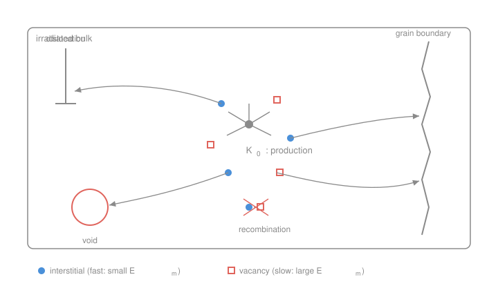

# Nuclear Materials · Lesson 2.1: Point-defect migration and radiation-enhanced diffusion

> ⏱ ~15 min · Module 2: Property changes under irradiation · Builds on: [1.5 From cascade to surviving defect population](01-05-cascade-to-defect-population.md), [`materials-science` 2.4 Fick's first law](../../materials-science/lessons/02-04-diffusion-i-ficks-first-law.md), [`materials-science` 2.5 Transient diffusion and Arrhenius](../../materials-science/lessons/02-05-diffusion-ii-transient-arrhenius.md) · Unlocks: 2.2 (dislocation loops & bias), 2.3 (voids & swelling)

## Why this matters

[Lesson 1.5](01-05-cascade-to-defect-population.md) left you with a metal full of freely-migrating vacancies and interstitials — the few percent of cascade damage that escaped in-cascade recombination. That population is not the end of the story; it's the *start*. Those defects hop around, find each other and annihilate, or reach a sink and get absorbed. Where they go decides everything downstream: whether the metal swells (voids), climbs and hardens (loops), or segregates its alloying elements at grain boundaries and cracks (IASCC). This lesson is the bookkeeping — the **point-defect balance equations** of rate theory — that governs the entire module. It also delivers a genuinely surprising result: under irradiation a cold metal can diffuse as if it were hundreds of degrees hotter.

## The idea

A vacancy or interstitial doesn't teleport to a sink. It **random-walks**: thermal jitter lets it hop to a neighboring site, over and over, in no particular direction. Every jump must clear an energy hump — the **migration energy** $E_m$. The key asymmetry of radiation damage lives here: an interstitial is a squeezed-in extra atom straining its whole neighborhood, and it slips to the next site with a tiny barrier (fractions of an eV), while a vacancy has to wait for a neighbor atom to jump *into* it, which costs much more ($\sim 1$ eV in metals). **Interstitials migrate orders of magnitude faster than vacancies at the same temperature.** Hold that fact — half of Module 2 is a consequence of it.

Now zoom out. Defects are being *created* everywhere in the bulk at a steady rate (that's the irradiation). They wander. Two things can remove them:

1. **They meet their opposite and annihilate** — a vacancy and interstitial recombine, healing the lattice. This needs *both* species present, so its rate scales with the product $C_i C_v$.
2. **They reach a sink and get swallowed** — a dislocation, grain boundary, void, precipitate, or free surface. A sink is any lattice feature that permanently absorbs defects. This scales with how much sink there is and how mobile the defect is.

The whole of rate theory is: production in, recombination and sink-absorption out. Write that balance and you can predict the steady-state defect concentrations — which is what feeds swelling, hardening, and segregation.

## The formal version

**Migration and the jump rate.** A defect's hop frequency is Arrhenius (exactly the temperature law from [`materials-science` 2.5](../../materials-science/lessons/02-05-diffusion-ii-transient-arrhenius.md)):

$$D = D_0 \exp\!\left(-\frac{E_m}{k_B T}\right),$$

where $D$ is the defect diffusion coefficient (m²/s), $D_0$ a prefactor set by attempt frequency and geometry, $E_m$ the migration energy (eV), $k_B = 8.617\times10^{-5}$ eV/K the Boltzmann constant, and $T$ the temperature (K). *In words: raise the temperature and each defect hops exponentially faster.* Because $E_m^i \ll E_m^v$, at any given $T$ the interstitial's $D_i$ towers over the vacancy's $D_v$.

**The point-defect balance equations.** Track the volume-averaged concentrations $C_v$ and $C_i$ (dimensionless site fractions, atoms of defect per lattice atom). Each obeys production − recombination − sink loss:

$$\frac{dC_v}{dt} = K_0 \;-\; K_{iv}\,C_i C_v \;-\; k_v^2\, D_v\, C_v,$$

$$\frac{dC_i}{dt} = K_0 \;-\; K_{iv}\,C_i C_v \;-\; k_i^2\, D_i\, C_i.$$

*In words: defects appear at rate $K_0$, disappear in pairs by recombination, and disappear one at a time by falling into sinks.* Term by term:

- $K_0$ — the **effective defect production rate** (per atom per second), the freely-migrating survivors from [1.5](01-05-cascade-to-defect-population.md): $K_0 = \xi \cdot (\text{dpa rate})$, where $\xi$ is the surviving fraction after in-cascade recombination. Vacancies and interstitials are produced in **equal numbers** (each Frenkel pair is one of each) — that's why both equations share the same $K_0$.
- $K_{iv} C_i C_v$ — the **mutual recombination** term. $K_{iv}$ (per second) is the recombination rate coefficient, essentially set by how fast the faster species (interstitials) sweeps through the volume around a vacancy. It removes vacancies and interstitials at the *same* rate — they die together.
- $k^2 D C$ — the **sink-absorption** term. $k^2$ is the **sink strength** (units m⁻²): the total "catchment capacity" of all sinks, summed as $k^2 = \sum_j k_j^2$ over dislocations, grain boundaries, voids, precipitates. A dense forest of dislocations means a large $k^2$. The product $k^2 D$ has units of s⁻¹ — an absorption rate — so $k^2 D C$ is defects lost to sinks per unit time. Interstitials and vacancies have **different** sink strengths ($k_i^2 \ne k_v^2$); that small difference, the sink *bias*, is the engine of [Lesson 2.2](02-02-dislocation-loops-bias.md).

**Radiation-enhanced diffusion (RED).** Atoms move by riding defects — a substitutional atom advances only when a vacancy or interstitial passes through its site. So the **atom** self-diffusion coefficient is proportional to the defect concentration:

$$D_{\text{atom}} \;\propto\; D_v C_v + D_i C_i.$$

Thermally, $C_v^{\text{eq}} = \exp(-E_f^v/k_B T)$ with $E_f^v$ the vacancy *formation* energy — vanishingly small when $T$ is low. Under irradiation, $K_0$ pumps $C_v$ and $C_i$ far *above* those equilibrium values, so $D_{\text{atom}}$ rises far above its thermal value. *In words: thermal diffusion is starved of defects at low temperature; irradiation manufactures the defects, so diffusion-driven processes run in a cold reactor that thermal aging could never drive.*

**Radiation-induced segregation (RIS).** The defect fluxes to sinks are not chemically neutral. If a solute preferentially binds to vacancies (or exchanges with them), it gets *dragged along* the vacancy flux; against the vacancy flux runs an equal atom flux, so a solute that migrates fast by the vacancy mechanism gets swept *away* from the sink — the **inverse-Kirkendall effect**. The upshot in austenitic stainless steel: **chromium is depleted at grain boundaries** while nickel and silicon enrich there. That Cr-depleted boundary is the metallurgical seed of irradiation-assisted stress-corrosion cracking — flagged now, cashed in at [Lesson 4.4](04-04-scc-iascc.md).

## Picture

The defect population is born in the bulk (center), then either recombines mid-flight (a vacancy meets an interstitial and both vanish) or random-walks to a sink — dislocation, void, grain boundary — and is absorbed. Rate theory is just the accounting of these three fates.

## Worked examples

**Example 1 (steady state — the sink-dominated regime).** After a short transient, production balances loss and $dC_v/dt = 0$. Suppose sinks are plentiful (heavily cold-worked, high-dislocation steel) so sink absorption dominates recombination. Drop the recombination term:

$$0 \approx K_0 - k_v^2 D_v C_v \quad\Longrightarrow\quad \boxed{\,C_v \approx \dfrac{K_0}{k_v^2 D_v}\,}.$$

*In words: the steady vacancy level is production divided by the rate at which sinks drain it.* Put numbers on it: a fast-reactor flux gives $K_0 \sim 10^{-6}$ s⁻¹ (dpa rate $\sim10^{-6}$/s with survival $\xi \sim 1$ folded in loosely). Take a dislocation density giving $k_v^2 \sim 10^{14}$ m⁻² and, at $\sim 400^\circ\mathrm{C}$, $D_v \sim 10^{-15}$ m²/s. Then

$$C_v \approx \frac{10^{-6}}{(10^{14})(10^{-15})} = \frac{10^{-6}}{10^{-1}} = 10^{-5}.$$

A vacancy site-fraction of $10^{-5}$ — enormous next to the thermal-equilibrium $C_v^{\text{eq}}$ at this temperature (with $E_f^v \approx 1.6$ eV, $C_v^{\text{eq}} = e^{-1.6/(8.617\times10^{-5}\cdot 673)} \approx e^{-27.6}\approx 10^{-12}$). Irradiation has raised the vacancy population by **seven orders of magnitude**. That gap *is* radiation-enhanced diffusion.

*Contrast — the recombination-dominated regime.* Flip the assumption: few sinks (well-annealed metal) or very high flux, so recombination dwarfs sink loss. With $C_i \approx C_v \equiv C$ (equal production, symmetric loss) the balance becomes $K_0 \approx K_{iv} C^2$, giving

$$C \approx \sqrt{K_0/K_{iv}}\,.$$

Now $C$ scales as the *square root* of dose rate, not linearly — double the flux and the defect level rises only by $\sqrt 2$, because the extra defects find each other and annihilate faster. Which regime you're in (linear $K_0/k^2D$ vs. $\sqrt{K_0/K_{iv}}$) controls how swelling and hardening scale with flux — a recurring theme in the rest of Module 2.

**Example 2 (RED — why a 300 °C reactor drives what no oven could).** A common failure mode is asking whether thermal diffusion "does anything" at reactor operating temperature. Take $T = 300^\circ\mathrm{C} = 573$ K and a vacancy formation energy $E_f^v = 1.6$ eV. The thermal-equilibrium vacancy fraction is

$$C_v^{\text{eq}} = \exp\!\left(-\frac{E_f^v}{k_B T}\right) = \exp\!\left(-\frac{1.6}{(8.617\times10^{-5})(573)}\right) = \exp(-32.4) \approx 8\times10^{-15}.$$

Essentially no vacancies exist thermally — self-diffusion is frozen; unirradiated steel at 300 °C does not measurably age over a reactor lifetime. But irradiation holds $C_v$ at $\sim10^{-5}$ (Example 1). Since $D_{\text{atom}} \propto D_v C_v$ at fixed $D_v$, atom mobility is boosted by the ratio

$$\frac{C_v^{\text{irr}}}{C_v^{\text{eq}}} \approx \frac{10^{-5}}{8\times10^{-15}} \approx 10^{9}.$$

*In words: irradiation makes a 300 °C alloy diffuse like it holds a billion times more vacancies — enough to drive segregation, precipitate dissolution, and void growth that thermal aging at that temperature never could.* This is why microstructural evolution in a reactor is a radiation phenomenon, not a thermal one, whenever the temperature is low enough that $C_v^{\text{eq}} \ll C_v^{\text{irr}}$.

## Watch out

- **You might think RED means the metal is literally hotter.** It isn't — the temperature is still 300 °C, and the *jump barrier* $E_m$ is unchanged. What irradiation raises is the *number of defects available to jump* ($C_v$, $C_i$), not the speed of an individual jump ($D$). Thermal diffusion is throttled by defect *supply*; irradiation lifts the throttle.
- **You might expect the defect level to just keep climbing with dose.** In the recombination-dominated regime it saturates as $\sqrt{K_0/K_{iv}}$ — the more defects you make, the faster pairs annihilate, so the population self-limits. Only in the sink-dominated regime does $C$ track $K_0$ linearly.
- **You might treat vacancies and interstitials as symmetric because production is equal.** Production is equal ($K_0$ for both), but *loss* is not: $D_i \gg D_v$ (asymmetric migration) and $k_i^2 \ne k_v^2$ (asymmetric sink bias). That broken symmetry is not a footnote — it is exactly why loops and voids grow ([2.2](02-02-dislocation-loops-bias.md), [2.3](02-03-voids-void-swelling.md)).

## One-liner

> Irradiation floods a cold metal with vacancies and interstitials far above thermal equilibrium; rate theory (production = recombination + sink loss) fixes how many survive, and that surplus makes the alloy diffuse — and segregate — as if it were hundreds of degrees hotter.

## Problems

**P1 (🟢)** A steel under irradiation has effective defect production $K_0 = 10^{-6}$ s⁻¹. Sinks dominate. The vacancy sink strength is $k_v^2 = 5\times10^{14}$ m⁻² and $D_v = 2\times10^{-15}$ m²/s at the operating temperature. Estimate the steady-state vacancy site-fraction $C_v$.

**P2 (🟡)** At $350^\circ\mathrm{C}$ ($623$ K) the thermal-equilibrium vacancy fraction is $C_v^{\text{eq}} = 10^{-13}$. Irradiation raises the steady vacancy fraction to $C_v^{\text{irr}} = 4\times10^{-6}$. By what factor is defect-mediated atom diffusion enhanced over the thermal rate, assuming the vacancy $D_v$ is the same in both cases? One sentence: why does the enhancement shrink as you raise the temperature?

**P3 (🔴)** In a nearly sink-free (well-annealed) specimen, recombination dominates and $C_i \approx C_v \equiv C$. Starting from the steady-state balance $K_0 = K_{iv}C^2$, find how $C$ scales with dose rate, and then find how the *atom* diffusion coefficient $D_{\text{atom}} \propto D_v C$ scales with dose rate. Contrast with the sink-dominated scaling of $C$ with $K_0$.

Solutions

**P1** Sink-dominated steady state, $C_v \approx K_0/(k_v^2 D_v)$:

$$C_v \approx \frac{10^{-6}}{(5\times10^{14})(2\times10^{-15})} = \frac{10^{-6}}{10^{0}} = 10^{-6}.$$

*Check.* Units: $\dfrac{\mathrm{s^{-1}}}{(\mathrm{m^{-2}})(\mathrm{m^2\,s^{-1}})} = \dfrac{\mathrm{s^{-1}}}{\mathrm{s^{-1}}} = $ dimensionless ✓ — a site-fraction, as required. The denominator $k_v^2 D_v = 1\ \mathrm{s^{-1}}$ is the vacancy sink-absorption rate; production $10^{-6}\,\mathrm{s^{-1}}$ divided by it gives $C_v = 10^{-6}$, vastly above any plausible thermal $C_v^{\text{eq}}$ at reactor temperature. ✓

**P2** Since $D_{\text{atom}} \propto D_v C_v$ and $D_v$ is unchanged, the enhancement is the concentration ratio:

$$\frac{D_{\text{atom}}^{\text{irr}}}{D_{\text{atom}}^{\text{eq}}} = \frac{C_v^{\text{irr}}}{C_v^{\text{eq}}} = \frac{4\times10^{-6}}{10^{-13}} = 4\times10^{7}.$$

About a **40-million-fold** boost. It shrinks as $T$ rises because $C_v^{\text{eq}} = e^{-E_f^v/k_B T}$ climbs steeply with temperature, while the irradiation-driven $C_v^{\text{irr}}$ (set by $K_0/k_v^2 D_v$) grows only weakly; once thermal vacancies are as plentiful as radiation-made ones, RED disappears and ordinary thermal diffusion takes over.

*Check.* Ratio of two site-fractions is dimensionless ✓, and it's $\gg 1$, consistent with 350 °C still being in the RED regime. ✓

**P3** Recombination-dominated: $K_0 = K_{iv}C^2 \Rightarrow C = \sqrt{K_0/K_{iv}} \propto K_0^{1/2}$. So the defect concentration goes as the **square root** of dose rate. Then

$$D_{\text{atom}} \propto D_v C \propto D_v\,K_0^{1/2},$$

i.e. atom diffusion also scales as $K_0^{1/2}$ — quadruple the flux, double the diffusion. Contrast: in the **sink-dominated** regime $C \approx K_0/(k^2 D) \propto K_0^{1}$ (linear), so there $D_{\text{atom}}\propto K_0$.

*Check.* Dimensions: $\sqrt{K_0/K_{iv}} = \sqrt{\mathrm{s^{-1}}/\mathrm{s^{-1}}}$ = dimensionless ✓. Physical sense: the square-root law reflects self-limiting annihilation — extra defects find partners and recombine faster, so the population grows sub-linearly in flux, exactly as expected when no sinks are present to drain them. ✓

## Flashback

**From Lesson 1.4 (Kinchin–Pease and NRT dpa):** A steel component absorbs a fast-neutron fluence that deposits an average damage energy giving $2.0$ displacements per atom (dpa) over its service life. Iron has an atomic density of $8.5\times10^{28}$ atoms/m³. How many displacement events occur per cubic meter over the life? (Fresh variant — you're going from dpa back to an absolute event count.)

Solution

By definition, dpa is the number of times an average atom is displaced. Total displacements per unit volume = (dpa) × (atomic number density):

$$N_{\text{disp}} = 2.0 \times 8.5\times10^{28} = 1.7\times10^{29}\ \text{displacements/m}^3.$$

*Check.* Units: (dimensionless dpa) × (atoms/m³) = displacements/m³ ✓. Sanity: at 2 dpa every atom has been knocked off its site twice on average, so the event count should be a small multiple of the atom count — $1.7\times10^{29}$ vs. $8.5\times10^{28}$ atoms is exactly $2\times$ ✓. (Most of these displacements heal by in-cascade recombination — only the surviving fraction $\xi$ becomes the $K_0$ of this lesson, tying 1.4 → 1.5 → 2.1 together.)

## Connections

- **Backward:** the production term $K_0$ is the freely-migrating survivor population from [1.5](01-05-cascade-to-defect-population.md), which was itself the small residue of the NRT-dpa displacements of [1.4](01-04-kinchin-pease-nrt-dpa.md). The Arrhenius $D = D_0 e^{-E_m/k_BT}$ and the flux picture come straight from materials-science diffusion, [2.4](../../materials-science/lessons/02-04-diffusion-i-ficks-first-law.md) and [2.5](../../materials-science/lessons/02-05-diffusion-ii-transient-arrhenius.md) — this lesson just adds a *source* term the equilibrium theory never had.
- **Forward:** the sink-strength asymmetry $k_i^2 \ne k_v^2$ (the **bias**) drives [2.2 dislocation loops](02-02-dislocation-loops-bias.md); the resulting net vacancy flux to voids drives [2.3 void swelling](02-03-voids-void-swelling.md); and the Cr-depleted grain boundary from RIS is the seed of [4.4 IASCC](04-04-scc-iascc.md).
- **Sideways:** the balance equations are the same production-minus-loss accounting used for neutron populations in reactor physics (production − absorption − leakage) — here defects replace neutrons, recombination replaces absorption, and sinks replace leakage. The inverse-Kirkendall coupling of solute to defect flux is the radiation cousin of ordinary Kirkendall interdiffusion in metallurgy, where unequal diffusion of two species shifts a marker plane.
