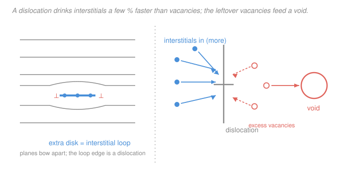

# Nuclear Materials · Lesson 2.2: Dislocation loops and the dislocation bias

> ⏱ ~15 min · Module 2: Property changes under irradiation · Builds on: [2.1 Point-defect migration and radiation-enhanced diffusion](02-01-defect-migration-radiation-enhanced-diffusion.md), [`materials-science` 2.2 Dislocations and plastic flow](../../materials-science/lessons/02-02-dislocations-plastic-flow.md) · Unlocks: 2.3 (voids and void swelling), 2.5 (radiation hardening)

## Why this matters

Last lesson the surviving point defects were still loose — vacancies and interstitials wandering to sinks. This lesson they start *building things*. They pile up into **dislocation loops**, the first new microstructure irradiation grows from scratch, and those loops are simultaneously new obstacles (they harden the metal, [2.5](02-05-radiation-hardening.md)) and new sinks (they change where every future defect goes).

But the real payload here is one small, systematic asymmetry called the **dislocation bias**. It is only a few percent — and it is the reason reactor steel *swells*, *creeps*, and *grows* at all. Get this one idea and the entire back half of the module (voids, swelling, irradiation creep) is downhill. No bias, no swelling. That strong.

## The idea

A cascade leaves behind roughly equal numbers of vacancies and interstitials ([2.1](02-01-defect-migration-radiation-enhanced-diffusion.md)). They don't all reach a grain boundary and vanish — when two of the same kind bump into each other, they can stick. A knot of interstitials, packed shoulder-to-shoulder, *is* an extra little patch of atomic plane: an **interstitial dislocation loop**. A knot of vacancies is a missing patch: a **vacancy loop**, essentially a collapsed disk of empty sites. Either way the edge of the patch is a dislocation line — you've manufactured a tiny loop of the same defect you met in [`materials-science` 2.2](../../materials-science/lessons/02-02-dislocations-plastic-flow.md). Loops nucleate small and then *grow* by eating more point defects out of the surrounding gas.

Now the crucial part. A dislocation has a strain field around it — the lattice is squeezed on one side, stretched on the other. A point defect drifting nearby feels that strain, because it too distorts the lattice. Here's the asymmetry: **an interstitial shoves the lattice apart far more than a vacancy pulls it in.** An interstitial is an extra atom crammed into a space that has no room; a vacancy is just a missing atom, and the neighbors barely relax inward. So the interstitial's "elastic handshake" with the dislocation is *stronger*. The dislocation reaches out and grabs interstitials a little more eagerly than vacancies.

That's the whole bias: **a dislocation absorbs interstitials slightly preferentially.** A few percent. But it never flips sign, and it never rests.

Follow the bookkeeping. If every dislocation in the metal is quietly net-swallowing interstitials, then the interstitials are being *removed from circulation faster than the vacancies are*. The vacancies get left behind — a slow, persistent **excess of vacancies** builds up in the matrix. Those leftover vacancies need somewhere to go. If some *other* sink will happily take vacancies without the same interstitial preference — a **void** ([2.3](02-03-voids-void-swelling.md)) — the vacancies pour in and the void grows. The metal is now full of holes. It has swelled.

Turn the bias off and the story collapses: if dislocations took interstitials and vacancies equally, the two would drain in lockstep, no excess of either would build up, and voids would have nothing to feed on. **No bias &#8594; equal absorption &#8594; no net vacancy excess &#8594; no swelling.** The few-percent asymmetry is the engine; everything downstream is just where the exhaust goes.

## The formal version

**Loops as biased sinks.** Give each sink type a dimensionless *capture efficiency* $Z$ — how effectively it grabs a passing defect of a given kind. For a dislocation (straight line or loop), write

$$Z_i = Z_v\,(1 + B), \qquad B \sim 0.01\text{–}0.05,$$

where $Z_i$ is its efficiency for **interstitials**, $Z_v$ for **vacancies**, and $B$ is the **dislocation bias factor** (dimensionless). *In words: a dislocation is a few percent better at catching interstitials than vacancies.* The value of $B$ comes from the elastic size-misfit interaction — bigger for interstitials because their **relaxation (misfit) volume** $\Omega_i$ is large, small for vacancies whose $\Omega_v$ is near zero.

**The net current into dislocations.** In steady state the flux of each defect species arriving at the dislocation population scales as (efficiency) × (mobility) × (concentration). Because the two species are produced in equal numbers but the dislocation prefers interstitials, dislocations run a **net interstitial current**

$$J_{\text{net}}^{\text{disl}} \;\propto\; Z_i - Z_v \;=\; Z_v\,B.$$

*In words: the surplus of interstitials that dislocations remove — over and above the vacancies they remove — is proportional to the bias $B$.* Conservation then forces an equal and opposite surplus elsewhere: an excess **vacancy** current that must be absorbed by the unbiased sinks (voids). So the vacancy flux feeding the voids is

$$J_v^{\text{void}} \;\propto\; B.$$

*In words: kill the bias ($B \to 0$) and the void-feeding vacancy flux goes to zero — swelling switches off.* This is the exact statement of the paragraph above; the swelling rate the next lesson computes is, at bottom, this $B$.

## Picture

## Worked examples

**Example 1 (classification — which loop wins, and why).** Under irradiation both loop types can nucleate: interstitial loops from clustered interstitials, vacancy loops from the vacancy-rich collapsing core of a cascade. Which one *grows* as dose piles up?

A loop is a dislocation, so *the bias applies to the loop itself.* Both loop types therefore preferentially absorb interstitials.

- An **interstitial loop** grows when it absorbs an interstitial (adds to its extra disk). Since it is biased to catch interstitials, it drinks exactly the defect that enlarges it. It **grows**.
- A **vacancy loop** grows when it absorbs a *vacancy* (extends its missing disk) but *shrinks* when it absorbs an interstitial (an interstitial fills one of its empty sites). The same bias means it catches interstitials preferentially — so it is fed the very defect that heals it. It tends to **shrink and disappear**.

So early in life, when point defects are the currency and voids haven't nucleated yet, **interstitial loops dominate**: they are the sink the bias favors and the vacancy loops get eaten from the inside. This growing forest of interstitial loops is the obstacle population that the hardening lesson ([2.5](02-05-radiation-hardening.md)) will count.

**Example 2 (the bias, quantitatively-lite — why a few percent matters).** Suppose the bias is $B = 0.01$ (a stingy 1 %). How can something that small produce swelling measured in percent per dpa — enough to bulge fuel cladding over a few years?

Recall the dose unit: **1 dpa** means, on average, *every atom has been displaced once* ([1.4](01-04-kinchin-pease-nrt-dpa.md)). So per dpa a large number of point defects are created and a good fraction of the survivors migrate to sinks. Model the swelling rate as

$$\frac{1}{V}\frac{dV}{d(\text{dpa})} \;\approx\; B \times \eta,$$

where $\eta$ is the fraction of the surviving migrating defects that actually reach sinks each dpa (order unity — call it $\eta \sim 1$). Then

$$\frac{1}{V}\frac{dV}{d(\text{dpa})} \;\approx\; 0.01 \times 1 = 0.01 = 1\%\ \text{per dpa}.$$

The point isn't the exact prefactor; it's the *scaling*. The swelling rate inherits the bias directly — 1 % bias buys of order 1 % swelling per dpa. Now put in a fast-reactor lifetime: cladding easily reaches tens of dpa (100+ dpa in the hottest positions). At $\sim 1\%$ per dpa, even after incubation that's **tens of percent volume increase** — cladding that no longer fits its assembly. A "negligible" few-percent asymmetry, integrated over $10^{22}$ displacements per cubic centimetre and several years, becomes a first-order engineering failure. That is why $B$, small as it is, is the number the whole module orbits.

*Sanity check.* Units: $B$ and $\eta$ are dimensionless, dpa is dimensionless (displacements per atom), so $dV/V$ per dpa is dimensionless — a pure fractional swelling. ✓ And with $B = 0$ the rate is exactly zero, matching the "no bias, no swelling" logic. ✓

## Watch out

- **You might think vacancies and interstitials are symmetric because they're produced in equal numbers.** They are born equal but they do not *behave* equal: interstitials migrate faster (lower migration energy, [2.1](02-01-defect-migration-radiation-enhanced-diffusion.md)) *and* are absorbed preferentially. Both asymmetries push the same way — interstitials leave the matrix first — and that broken symmetry is the source of everything here.
- **You might think a bigger bias means faster loop growth is the "damage."** The loops themselves aren't the disaster — the *leftover vacancies* are. The bias is dangerous because of what it leaves behind (a vacancy supersaturation that voids convert into swelling), not merely because it grows loops. Loops mostly matter later, as hardening obstacles.
- **You might expect vacancy loops to grow since irradiation makes plenty of vacancies.** No — because a vacancy loop is *also* a biased dislocation, it preferentially catches interstitials, which fill its vacancies and shrink it. Vacancy accumulation happens in **voids** (3-D cavities), not in vacancy loops, precisely because a void is a much less biased sink.

## One-liner

> A dislocation catches interstitials a few percent more eagerly than vacancies (their extra bulk gives a stronger elastic grip); that tiny, systematic bias leaves a vacancy surplus that voids devour — and *that* is swelling.

## Problems

**P1 (🟢)** A cluster of self-interstitials condenses onto a close-packed plane. (a) Is the resulting loop an interstitial or a vacancy loop, and does it represent an *extra* or a *missing* disk of atoms? (b) As irradiation continues, does this loop tend to grow or shrink, and which point defect drives that change?

**P2 (🟡)** State in one line each what happens to (a) void swelling and (b) the net interstitial current into dislocations if the bias factor $B$ were exactly zero. Then explain in a sentence why equal capture efficiencies ($Z_i = Z_v$) forbid a steady vacancy excess.

**P3 (🔴)** Two candidate alloys are identical except that alloy A has a bias $B_A = 0.02$ and alloy B has $B_B = 0.005$. Using the scaling $\tfrac{1}{V}\tfrac{dV}{d(\text{dpa})} \approx B\,\eta$ with the same $\eta \approx 1$ for both, estimate the ratio of their swelling rates, and the swelling each reaches after 60 dpa (ignore incubation). Which would you pick for high-dose cladding, and what single microstructural knob might a metallurgist turn to lower $B$? (Hint: think about what "$\eta$" and total sink strength do — a denser sink structure spreads the same excess over more sinks.)

Solutions

**P1** (a) Interstitials condensing into a disk add material, so it is an **interstitial loop** — an **extra** disk of atoms inserted between two existing planes (its edge is a dislocation line). (b) It tends to **grow**: the loop is a dislocation, so it is biased to absorb **interstitials** preferentially, and each absorbed interstitial extends its extra disk. Absorbing an occasional vacancy would shrink it, but the bias means it nets interstitials, so growth wins.

**P2** (a) Void swelling &#8594; **zero**. (b) The net interstitial current into dislocations $\propto Z_i - Z_v = Z_v B$ &#8594; **zero**. Why equal efficiencies forbid a vacancy excess: if dislocations remove interstitials and vacancies at the same rate, the two species drain from the matrix in lockstep; produced equally and removed equally, neither builds up a surplus, so there is no leftover vacancy current for voids to absorb. A steady vacancy excess *requires* one sink to prefer interstitials — i.e. requires $B \ne 0$.

**P3** The swelling rate scales linearly with $B$, so

$$\frac{\dot S_A}{\dot S_B} = \frac{B_A}{B_B} = \frac{0.02}{0.005} = 4.$$

Alloy A swells **4× faster**. After 60 dpa (linear estimate, $\eta \approx 1$):

$$S_A \approx B_A \times 60 = 0.02 \times 60 = 1.2 = 120\%, \qquad S_B \approx 0.005 \times 60 = 0.3 = 30\%.$$

(These are order-of-magnitude — real curves saturate and have an incubation dose, so treat them as "A is catastrophic, B is merely bad.") Pick **alloy B**: lower bias means less vacancy surplus per dpa and far less swelling at end-of-life. The knob: raise the **total sink strength** — e.g. a fine dispersion of stable sinks (precipitates, oxide particles, a high dislocation or grain-boundary density) that soak up the excess vacancies harmlessly and dilute the flux each void sees. This is exactly why swelling-resistant steels (ferritic/martensitic, ODS) are engineered with dense, stable sink structures — previewed in [2.3](02-03-voids-void-swelling.md) and used in the alloy-selection lesson [4.2](04-02-steels-austenitic-ferritic-martensitic.md).

*Check.* Ratio is dimensionless ✓; both swelling figures are pure fractions ✓; and the linear scaling makes the design lesson obvious — halve the bias, halve the swelling. ✓

## Flashback

**From Lesson 2.1 (Point-defect migration and radiation-enhanced diffusion):** In the sink-dominated regime, the steady-state concentration of a migrating point defect is set by balancing production against loss to sinks (recombination negligible):

$$P = D\,k^2\,C \quad\Longrightarrow\quad C = \frac{P}{D\,k^2},$$

where $P$ is the defect production rate (atom fraction per second), $D$ the defect diffusion coefficient (m²/s), and $k^2$ the total **sink strength** (m⁻²). Interstitials are produced at $P = 1\times10^{-6}\ \mathrm{s^{-1}}$, diffuse with $D_i = 1\times10^{-13}\ \mathrm{m^2/s}$, and see a sink strength $k^2 = 1\times10^{15}\ \mathrm{m^{-2}}$. Find the steady-state interstitial atom fraction $C_i$. Then, in one sentence, say what would raise $C_i$: adding *more* sinks, or *fewer*?

Solution

Plug into $C_i = P/(D_i k^2)$:

$$C_i = \frac{1\times10^{-6}\ \mathrm{s^{-1}}}{(1\times10^{-13}\ \mathrm{m^2/s})(1\times10^{15}\ \mathrm{m^{-2}})} = \frac{1\times10^{-6}}{1\times10^{2}\ \mathrm{s^{-1}}} = 1\times10^{-8}.$$

*Check.* The denominator $D_i k^2 = 10^{-13}\times10^{15} = 10^{2}\ \mathrm{s^{-1}}$ is a loss *rate* (per second), so $P/(D_i k^2)$ has units $\mathrm{s^{-1}}/\mathrm{s^{-1}}$ = dimensionless — an atom fraction ✓, and a tiny one ($10^{-8}$), as steady-state defect populations should be.

Raising $C_i$ requires **fewer** sinks: $C_i \propto 1/k^2$, so a lower sink strength lets defects linger and their concentration climbs. (This is the same lever as P3 above, run in reverse — more sinks means lower defect concentrations and less damage accumulation per sink.)

## Connections

- **Backward:** the loop's edge is the same dislocation from [`materials-science` 2.2](../../materials-science/lessons/02-02-dislocations-plastic-flow.md), and its strain field is the elastic distortion introduced there; the point defects being sorted are the vacancies and interstitials of [`materials-science` 2.1](../../materials-science/lessons/02-01-point-defects-solid-solutions.md). The migration-to-sinks and sink-strength language is straight out of [2.1](02-01-defect-migration-radiation-enhanced-diffusion.md).
- **Forward:** [2.3 Voids and void swelling](02-03-voids-void-swelling.md) is the direct payoff — it takes the bias-driven vacancy excess and turns it into a swelling rate and a temperature window. [2.5 Radiation hardening](02-05-radiation-hardening.md) counts the loops as obstacles in the dispersed-barrier model, and [2.4 Irradiation creep and growth](02-04-irradiation-creep-growth.md) reuses the same biased-absorption idea (SIPA) to explain dimensional change under stress.
- **Sideways:** the elastic size-misfit interaction that sets $B$ is the very same elasticity that pins solute atoms to dislocations (Cottrell atmospheres) and drives precipitate–dislocation attraction in physical metallurgy — a defect distorts the lattice, and dislocations feel that distortion. Same physics, different actor.
