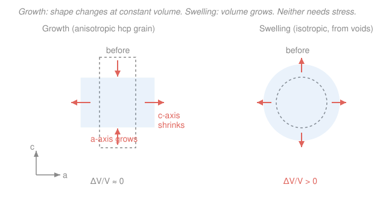

# Nuclear Materials · Lesson 2.4: Irradiation creep and growth

> ⏱ ~15 min · Module 2: Property changes under irradiation · Builds on: [2.2 Dislocation loops and the bias](02-02-dislocation-loops-bias.md), [2.3 Voids and void swelling](02-03-voids-void-swelling.md), [`materials-science` 4.4 (creep)](../../materials-science/lessons/04-04-failure-fracture-fatigue-creep.md) · Unlocks: [4.1 Zirconium alloys](04-01-zirconium-alloys-cladding.md), [4.2 Steels](04-02-steels-austenitic-ferritic-martensitic.md)

## Why this matters

A fuel rod is a thin metal tube holding a stack of hot ceramic pellets, pressurized from inside by fission gas and squeezed from outside by coolant. Over years it slowly changes shape — bows, elongates, ovalizes, grips the pellets. Two irradiation phenomena drive that creep of dimensions, and neither is the textbook thermal creep you met in [`materials-science` 4.4](../../materials-science/lessons/04-04-failure-fracture-fatigue-creep.md). **Irradiation creep** lets metal flow under stress at temperatures far too cold for ordinary creep. **Irradiation growth** changes a component's *shape* with no applied stress at all, purely because the crystal is anisotropic. Together with swelling ([2.3](02-03-voids-void-swelling.md)) they are the three ways a reactor quietly resizes its own parts — and getting the bookkeeping straight is how you predict whether a Zircaloy tube still fits its channel after a decade.

## The idea

Recall the engine from [2.2](02-02-dislocation-loops-bias.md): irradiation makes vacancies and interstitials in equal numbers, but dislocations pull in interstitials slightly harder (the **bias**). That imbalance is what makes point defects *do* things instead of just recombining.

**Irradiation creep** is what happens when you add a stress. Thermal creep also works by dislocations climbing, but climb needs a supply of vacancies — and at reactor operating temperatures (say 300 °C for a water-reactor clad) that thermal supply is a trickle, so thermal creep is negligible. Irradiation hands the dislocations a firehose of point defects for free. Now the applied stress just has to *bias which dislocations get them*: a dislocation lined up favorably with the stress absorbs a few extra interstitials, climbs, and lets the crystal deform in the stress direction. The metal flows in the cold. Double the stress or double the dose rate and you roughly double the flow.

**Irradiation growth** is stranger: shape change with *zero* applied stress. It happens only in **anisotropic** crystals — hexagonal metals like zirconium, or graphite — where the different crystal axes are not equivalent. Interstitials prefer to condense into loops on one family of crystal planes, vacancies on another. The interstitial loops *insert* extra atomic planes and push the crystal longer along one axis; the vacancy loops *remove* planes and pull it shorter along another. Atoms are only being shuffled between axes, so the **volume doesn't change** — the crystal just gets longer one way and shorter another. In a cubic metal all axes are equivalent, the two effects cancel by symmetry, and growth is essentially zero. This is why textured Zircaloy tubing elongates in service while a stainless-steel part of the same size does not.

## The formal version

**Irradiation creep.** To leading order the creep strain rate is linear in both stress and damage rate:

$$\dot\varepsilon = B_0\,\sigma\,\dot\phi_{\mathrm{dpa}},$$

where $\dot\varepsilon$ is the creep strain rate (1/s), $\sigma$ is the applied stress (MPa), $\dot\phi_{\mathrm{dpa}}$ is the displacement rate (dpa/s) from [1.4](01-04-kinchin-pease-nrt-dpa.md), and $B_0$ is the **irradiation-creep compliance** (units $\mathrm{MPa^{-1}\,dpa^{-1}}$), a material constant of order $10^{-6}\,\mathrm{MPa^{-1}\,dpa^{-1}}$. *In words: how fast the metal flows is proportional to how hard you push it times how fast you damage it.* Two microscopic mechanisms feed $B_0$:

- **SIPA** (stress-induced preferential absorption): stress makes differently-oriented dislocations absorb interstitials at slightly different rates, so climb — and hence strain — is biased toward the stress direction. No glide required.
- **Climb-and-glide**: irradiation-driven climb lets dislocations bypass obstacles and then glide, adding shear strain.

The signature that separates this from thermal creep is temperature: because the point-defect supply comes from the flux, not from thermal equilibrium, $\dot\varepsilon$ is only weakly temperature-dependent and persists hundreds of degrees below where thermal creep dies.

**Irradiation growth.** Dimensional change at constant volume and zero applied stress, quantified by a growth strain $\varepsilon_g$ (dimensionless) that grows with dose. For an hcp single crystal the strain is opposite along the two crystal axes, with volume conserved:

$$\varepsilon_a > 0,\quad \varepsilon_c < 0,\qquad \frac{\Delta V}{V} = 2\varepsilon_a + \varepsilon_c \approx 0.$$

Here $\varepsilon_a$ is the strain along each of the two equivalent hexagonal $a$-axes and $\varepsilon_c$ along the $c$-axis (see the hcp structure in [`materials-science` 1.2](../../materials-science/lessons/01-02-crystal-structures-unit-cells.md)). *In words: the crystal stretches in the basal plane and shrinks along $c$ by just enough to keep its volume fixed.* A real component's growth depends on its **crystallographic texture** — the statistical alignment of grains ([`materials-science` 1.4](../../materials-science/lessons/01-04-order-disorder-grains.md)). Random texture averages to zero; the deliberate texture of Zircaloy tubing makes it elongate axially.

**The three-way contrast.** Keep these clean:

| Phenomenon | Needs stress? | Needs anisotropy? | Volume change |
|---|---|---|---|
| **Swelling** ([2.3](02-03-voids-void-swelling.md)) | no | no | $\Delta V/V > 0$ (voids) |
| **Growth** (this lesson) | no | **yes** | $\Delta V/V \approx 0$ |
| **Creep** (this lesson) | **yes** | no | $\approx 0$ (shape only) |

## Picture

## Worked examples

**Example 1 (irradiation creep accrues in the cold).** A stainless-steel core component carries a steady stress $\sigma = 100$ MPa in a fast-reactor flux giving a displacement rate $\dot\phi_{\mathrm{dpa}} = 1\times10^{-7}\,\mathrm{dpa/s}$. Take the creep compliance $B_0 = 1\times10^{-6}\,\mathrm{MPa^{-1}\,dpa^{-1}}$. Find the creep strain rate, and the strain accumulated by the time it reaches 20 dpa.

Strain rate:

$$\dot\varepsilon = B_0\,\sigma\,\dot\phi_{\mathrm{dpa}} = (1\times10^{-6})(100)(1\times10^{-7}) = 1\times10^{-11}\ \mathrm{s^{-1}}.$$

Time to reach 20 dpa is $t = 20/\dot\phi_{\mathrm{dpa}} = 20/(1\times10^{-7}) = 2\times10^{8}\ \mathrm{s}$ (about 6.3 years). Since $\dot\varepsilon$ is constant, the accumulated strain is

$$\varepsilon = \dot\varepsilon\, t = (1\times10^{-11})(2\times10^{8}) = 2\times10^{-3} = 0.2\%.$$

Equivalently and faster, strain depends only on *dose*, not on the path: $\varepsilon = B_0\,\sigma\,\phi_{\mathrm{dpa}} = (10^{-6})(100)(20) = 0.2\%$. A fifth of a percent of permanent flow — and the operating temperature (well under 400 °C) is one where thermal creep of steel is utterly negligible. Every bit of this deformation is irradiation's doing.

**Example 2 (why cubic metals don't grow but textured Zircaloy does).** Take an isotropic cubic metal (fcc 316 steel, say) under no stress. Interstitial and vacancy loops still form, but the three cube axes $\langle100\rangle$ are crystallographically identical: whatever lengthening one axis gets, symmetry demands the others get equally, and equal expansion in all directions with no volume change is a contradiction — so the growth strain is forced to $\approx 0$. Loops still cause *swelling* and *hardening*, just not directional growth.

Now take zirconium (hcp). The $c$-axis and the two $a$-axes are genuinely different environments, so vacancy and interstitial loops sort onto different habit planes and the crystal lengthens along $a$ while shrinking along $c$ — nonzero growth even in one crystal. A single grain oriented randomly in a bar would average out, but Zircaloy fuel tubing is **textured**: cold-working aligns most grains' $c$-axes roughly radial/circumferential, leaving the $a$-axes to point along the tube. The grains' $a$-axis growth then adds up coherently and the tube **elongates axially** with dose, at essentially constant volume. Same physics as Example 1's stress-free crystal, made macroscopic by texture ([`materials-science` 1.4](../../materials-science/lessons/01-04-order-disorder-grains.md)).

## Watch out

- **You might think growth and swelling are the same "it got bigger" effect.** They're opposites in the ledger: swelling *adds volume* (voids are empty space, [2.3](02-03-voids-void-swelling.md)); growth *conserves volume* and only redistributes it between axes. A part can grow with zero swelling, or swell with zero growth.
- **You might think creep needs the metal to be hot, like thermal creep.** The whole point of irradiation creep is that the flux, not temperature, supplies the point defects climb needs — so it operates at temperatures where thermal creep is dead. Don't reach for an Arrhenius factor to explain it away.
- **You might expect any anisotropic metal to grow the same way regardless of processing.** Growth is a *textured*, directional effect: a randomly-oriented polycrystal of the very same alloy grows far less than a strongly textured tube of it. The number on a datasheet is inseparable from the fabrication texture.

## One-liner

> Irradiation gives dislocations free point defects: with a stress that becomes creep (flow in the cold), and in an anisotropic crystal it becomes growth (shape change at fixed volume) — distinct from swelling, which alone adds volume.

## Problems

**P1 (🟢)** A Zircaloy cladding tube carries a hoop stress $\sigma = 80$ MPa and reaches a fluence corresponding to 15 dpa. Using an irradiation-creep compliance $B_0 = 0.5\times10^{-6}\,\mathrm{MPa^{-1}\,dpa^{-1}}$, estimate the irradiation-creep strain. Is this a shape change, a volume change, or both?

**P2 (🟡)** For each of the following, name which phenomenon dominates the dimensional change — swelling, growth, or irradiation creep — and state your one-line reason: (a) an unstressed, strongly textured Zircaloy tube slowly elongates axially with dose but its density barely changes; (b) an unstressed 316 austenitic steel spacer loses measurable density (becomes less dense) after high dose; (c) a pressurized steel tube at 350 °C bulges in diameter over years even though 350 °C is far too cold for ordinary creep.

**P3 (🔴)** A zirconium single crystal grows so that each of its two $a$-axes strains by $\varepsilon_a = +1.0\times10^{-3}$, with negligible volume change. Using $\Delta V/V \approx 2\varepsilon_a + \varepsilon_c$, find the $c$-axis strain $\varepsilon_c$. Interpret the sign and magnitude.

Solutions

**P1** Strain depends only on dose: $\varepsilon = B_0\,\sigma\,\phi_{\mathrm{dpa}} = (0.5\times10^{-6})(80)(15)$.

$$\varepsilon = 0.5\times10^{-6}\times 1200 = 6\times10^{-4} = 0.06\%.$$

*Check.* Units: $\mathrm{MPa^{-1}\,dpa^{-1}}\cdot\mathrm{MPa}\cdot\mathrm{dpa} = $ dimensionless ✓. Irradiation creep is a **shape change at essentially constant volume** — the material flows in response to stress, it does not gain volume the way swelling does.

**P2**
- (a) **Growth.** Elongation with no applied stress and near-constant density (hence near-constant volume) is the fingerprint of growth in a textured hcp metal — atoms shuffle between axes, volume is conserved.
- (b) **Swelling.** A density *drop* means volume increased; voids are the only one of the three that adds volume, and it needs no stress and no anisotropy (316 is cubic, so it can't grow).
- (c) **Irradiation creep.** Deformation under an applied stress at a temperature too low for thermal creep — the flux is supplying the point defects that let dislocations climb.

**P3** Solve $2\varepsilon_a + \varepsilon_c = 0$ for $\varepsilon_c$:

$$\varepsilon_c = -2\varepsilon_a = -2(1.0\times10^{-3}) = -2.0\times10^{-3} = -0.20\%.$$

*Check.* The sign is negative: the crystal **shrinks along $c$** while it stretches along both $a$-axes, exactly the growth pattern in the figure. Magnitude sanity: two axes each gain $+0.1\%$ of length ($+0.2\%$ total in-plane), so the third must lose $0.2\%$ to keep volume fixed — and it does. ✓

## Flashback

**From Lesson 2.3 (Voids and void swelling):** A stainless-steel component contains a void population of number density $N = 1\times10^{21}\ \mathrm{m^{-3}}$ with mean void radius $r = 10\ \mathrm{nm}$. Estimate the swelling $\Delta V/V$. (Fresh variant — different numbers than the worked lesson.)

Solution

Each void removes a spherical volume $v = \tfrac{4}{3}\pi r^3$ of solid, so the fractional volume increase is the void volume fraction:

$$\frac{\Delta V}{V} = N\cdot\frac{4}{3}\pi r^3.$$

With $r = 10\ \mathrm{nm} = 1\times10^{-8}\ \mathrm{m}$:

$$\frac{4}{3}\pi r^3 = \frac{4}{3}\pi (1\times10^{-8})^3 = 4.19\times10^{-24}\ \mathrm{m^3},$$

$$\frac{\Delta V}{V} = (1\times10^{21})(4.19\times10^{-24}) = 4.19\times10^{-3} \approx 0.42\%.$$

*Check.* Units: $\mathrm{m^{-3}}\cdot\mathrm{m^3}$ = dimensionless ✓. Sub-1% swelling from a modest void density is a realistic figure, and — unlike the growth in P3 — this is a genuine **volume increase**, the defining difference between swelling and growth. ✓

## Connections

- **Backward:** the dislocation **bias** from [2.2](02-02-dislocation-loops-bias.md) is the shared engine — creep is that bias *tilted by an applied stress* (SIPA), and growth is that bias *sorted by crystal anisotropy*. Both are the point-defect fluxes of [2.1](02-01-defect-migration-radiation-enhanced-diffusion.md) put to directional work. Contrast throughout with thermal creep from [`materials-science` 4.4](../../materials-science/lessons/04-04-failure-fracture-fatigue-creep.md).
- **Forward:** [4.1 Zirconium alloys](04-01-zirconium-alloys-cladding.md) makes growth a central design constraint — texture control of Zircaloy tubing is largely about managing axial growth — and both creep and growth set the dimensional-stability limits for the steels in [4.2](04-02-steels-austenitic-ferritic-martensitic.md).
- **Sideways (mechanical metallurgy):** irradiation creep is the same climb-and-glide dislocation mechanics as high-temperature thermal creep, only with the rate-limiting vacancy supply replaced by the radiation flux — the deformation-mechanism map you'd draw for a hot turbine blade, shifted bodily to lower temperature by the reactor's damage rate.
