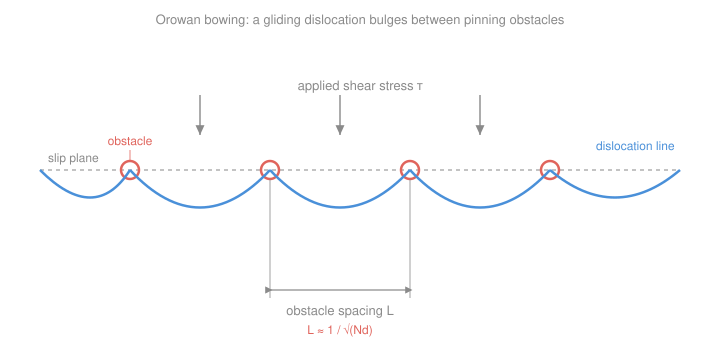

# Nuclear Materials · Lesson 2.5: Radiation hardening

> ⏱ ~15 min · Module 2: Property changes under irradiation · Builds on: [2.2 Dislocation loops & bias](02-02-dislocation-loops-bias.md), [2.3 Voids & void swelling](02-03-voids-void-swelling.md), [`materials-science` 4.3 Strengthening mechanisms](../../materials-science/lessons/04-03-strengthening-mechanisms.md), [`materials-science` 4.2 Plastic deformation & Schmid's law](../../materials-science/lessons/04-02-plastic-deformation-schmid.md) · Unlocks: [2.6 Embrittlement & the DBTT shift](02-06-embrittlement-dbtt-shift.md)

## Why this matters

Take a reactor pressure-vessel steel, expose it to years of neutron flux, pull a tensile bar, and it comes out *stronger* — the yield strength can climb by hundreds of MPa. That sounds like a gift. It isn't. In [`materials-science` 4.3](../../materials-science/lessons/04-03-strengthening-mechanisms.md) you learned there is exactly one way to strengthen a metal: make dislocations harder to move. Irradiation does that with a vengeance, littering the lattice with obstacles nobody designed. The strength you gain you pay for in ductility and toughness — which is why radiation hardening is the front half of the embrittlement story ([2.6](02-06-embrittlement-dbtt-shift.md)) that sets the operating life of a reactor. This lesson lets you *predict* the yield-strength jump from the defect population you built up in [2.2](02-02-dislocation-loops-bias.md) and [2.3](02-03-voids-void-swelling.md).

## The idea

You already know the mechanism — you just have to recognize the obstacles. In materials science the obstacles were solute atoms, grain boundaries, and tangled dislocations. Under irradiation the same slip planes get sprayed with a *new* set of obstacles, all of them made by the displacement cascades of Module 1:

- **dislocation loops** ([2.2](02-02-dislocation-loops-bias.md)) — little discs of clustered interstitials or vacancies,
- **voids and gas bubbles** ([2.3](02-03-voids-void-swelling.md)) — empty (or He-filled) cavities,
- **fine precipitates** — e.g. copper-rich clusters that radiation-enhanced diffusion ([2.1](02-01-defect-migration-radiation-enhanced-diffusion.md)) pulls out of solution in RPV steel.

A gliding dislocation now has to fight through a *dispersed field* of these. Confronted with an obstacle it can't cut, the line **bows out** between neighboring pinning points — like a rope pushed against a row of fence posts — until the bulge is sharp enough to break away. The tighter the obstacles are packed, the tighter the bow, and the more stress it takes to force the line through. So more obstacles, closer together, means higher yield strength. That's the whole picture, and it has a name from materials science: **dispersed-obstacle (Orowan) strengthening** — now with radiation-made obstacles.

The one twist irradiation adds: the obstacle field doesn't grow forever. Nucleation of new loops and clusters eventually balances their destruction, the density levels off, and the strengthening **saturates** at high dose.

## The formal version

**Dispersed-barrier (Orowan-type) model.** The yield-strength increase from a field of obstacles is

$$\boxed{\;\Delta\sigma_y = \alpha\, M\, \mu\, b\, \sqrt{N d}\;}$$

- $\Delta\sigma_y$ = rise in yield strength from the obstacles (Pa).
- $\alpha$ = **barrier strength**, dimensionless, between 0 and $\sim 1$ — how hard each obstacle is to break away from. Weak, shearable obstacles (small loops) sit near $\alpha \approx 0.1$–$0.2$; strong, impenetrable ones (voids, big precipitates) approach $\alpha \approx 0.5$–$1$.
- $M$ = **Taylor factor**, $\approx 3.06$ for a randomly oriented bcc or fcc polycrystal — the average conversion from shear stress *on a slip system* to tensile *yield stress* of the bulk. (It is the polycrystal average of the inverse Schmid factor from [`materials-science` 4.2](../../materials-science/lessons/04-02-plastic-deformation-schmid.md).)
- $\mu$ = shear modulus (Pa) — the lattice's stiffness against shear.
- $b$ = magnitude of the Burgers vector (m) — the "size" of one dislocation, one atomic spacing.
- $N$ = obstacle **number density** (m$^{-3}$) — how many obstacles per unit volume.
- $d$ = obstacle **diameter** (m).

*In words: the strength you gain grows with how strong the obstacles are, how stiff the lattice is, and — through $\sqrt{Nd}$ — how finely the slip plane is peppered with them.*

**Where $\sqrt{Nd}$ comes from.** The bare Orowan result is that a dislocation bowing between pins spaced a distance $L$ apart needs a shear stress $\tau \approx \mu b / L$. The mean spacing of obstacles *that a slip plane actually cuts through* is

$$L \approx \frac{1}{\sqrt{N d}}.$$

*In words: a plane sliced through a 3-D cloud of obstacles of density $N$ and diameter $d$ intersects about $Nd$ of them per unit area, so their in-plane spacing is $1/\sqrt{Nd}$.* Substitute $L$ into $\tau \approx \mu b/L = \mu b\sqrt{Nd}$, fold in the obstacle-strength factor $\alpha$, and convert shear-to-tensile with $M$: that is the boxed formula. The essential scaling to remember is $\Delta\sigma_y \propto \sqrt{Nd}$ — **denser, finer obstacle fields harden more, but only as a square root.**

**Source vs. friction hardening.** Two flavors hide inside $\Delta\sigma_y$:

- **Friction hardening** — the obstacles impede dislocations *everywhere along the glide path*, raising the stress needed to keep moving. This is what the boxed formula captures.
- **Source hardening** — defect clusters also pin down the *sources* that emit dislocations in the first place, so it takes an extra stress kick to start yielding at all. This produces a sharp **upper yield point** followed by a **yield drop**.

That yield drop has a nasty consequence. Once the first dislocations tear loose, they *sweep the obstacles out of a narrow band* — the passing dislocation shears and dissolves loops in its path — leaving a soft, cleared **channel**. Deformation then localizes into these channels (**dislocation channeling**) instead of spreading through the bulk. The macroscopic effect is loss of uniform ductility: the material can look strong but deform in unstable, concentrated bursts — the seed of embrittlement in [2.6](02-06-embrittlement-dbtt-shift.md).

**Dose saturation.** $N$ and $d$ grow with dose (measured in dpa — [1.4](01-04-kinchin-pease-nrt-dpa.md)) only while new obstacles are nucleating faster than they are destroyed. Early on, if the obstacle content scales roughly with dose ($Nd \propto \text{dpa}$), then

$$\Delta\sigma_y \propto \sqrt{Nd} \propto (\text{dpa})^{1/2}.$$

*In words: while obstacles are still nucleating, hardening rises as the square root of dose.* Eventually nucleation and destruction balance, $N$ and $d$ plateau, and $\Delta\sigma_y$ flattens to a **saturation** value — often reached within a few dpa. Beyond that, more dose buys little extra hardening.

## Picture

The line is pinned at each obstacle (coral) and bulges forward under the applied shear stress. Pack the obstacles closer — shrink $L \approx 1/\sqrt{Nd}$ — and each bow must curve more tightly, demanding more stress to push through.

## Worked examples

**Example 1 (dispersed-barrier — loops).** After irradiation a steel holds $N = 1\times10^{22}\ \mathrm{m^{-3}}$ dislocation loops of diameter $d = 10\ \mathrm{nm}$. Take $\alpha = 0.25$ (weakish loops), $M = 3.06$, $\mu = 80\ \mathrm{GPa}$, $b = 0.25\ \mathrm{nm}$. Find $\Delta\sigma_y$.

First the geometric factor:

$$\sqrt{Nd} = \sqrt{(1\times10^{22})(10\times10^{-9})} = \sqrt{1\times10^{14}} = 1\times10^{7}\ \mathrm{m^{-1}}.$$

Then

$$\Delta\sigma_y = (0.25)(3.06)(80\times10^{9})(0.25\times10^{-9})(1\times10^{7}) = 1.5\times10^{8}\ \mathrm{Pa} \approx 153\ \mathrm{MPa}.$$

A 150 MPa jump from loops alone — a serious fraction of the base yield strength of a structural steel.

**Example 2 (Boss-problem field — copper-rich precipitates).** A reactor pressure-vessel steel develops $N = 3\times10^{23}\ \mathrm{m^{-3}}$ copper-rich precipitates of diameter $d = 3\ \mathrm{nm}$. With $\alpha = 0.4$, $M = 3.06$, $\mu = 80\ \mathrm{GPa}$, $b = 0.25\ \mathrm{nm}$:

$$\sqrt{Nd} = \sqrt{(3\times10^{23})(3\times10^{-9})} = \sqrt{9\times10^{14}} = 3\times10^{7}\ \mathrm{m^{-1}}.$$

Now assemble the full unit chain:

$$\Delta\sigma_y = \underbrace{(0.4)}_{\text{—}}\,\underbrace{(3.06)}_{\text{—}}\,\underbrace{(80\times10^{9}\,\mathrm{Pa})}_{\mu}\,\underbrace{(0.25\times10^{-9}\,\mathrm{m})}_{b}\,\underbrace{(3\times10^{7}\,\mathrm{m^{-1}})}_{\sqrt{Nd}}.$$

Grouping the powers of ten: $0.4\times3.06 = 1.224$; times $80\times10^{9} = 9.79\times10^{10}$; times $0.25\times10^{-9} = 24.5$; times $3\times10^{7} = 7.34\times10^{8}\ \mathrm{Pa}$.

$$\Delta\sigma_y \approx 7.3\times10^{8}\ \mathrm{Pa} = \boxed{730\ \mathrm{MPa}.}$$

The units cancel cleanly: $\mathrm{Pa}\cdot\mathrm{m}\cdot\mathrm{m^{-1}} = \mathrm{Pa}$ ✓ (and note $\sqrt{Nd} = \sqrt{\mathrm{m^{-3}\cdot m}} = \mathrm{m^{-1}}$). This is a deliberately *dense* obstacle field to exercise the algebra — real RPV surveillance shifts are smaller (tens to ~150 MPa), because $N$ and $d$ don't both run this high at once.

**And the dose story.** Suppose that at 1 dpa this steel showed $\Delta\sigma_y = 150\ \mathrm{MPa}$, with the obstacle content still climbing roughly as $Nd \propto \text{dpa}$. Then at 4 dpa, before saturation,

$$\Delta\sigma_y(4) = 150\sqrt{\tfrac{4}{1}} = 150\times 2 = 300\ \mathrm{MPa}.$$

Quadrupling the dose only *doubles* the hardening — the $\sqrt{\ }$ at work. And once nucleation and destruction balance, the curve flattens: push to 16 dpa and you may still find ~300–350 MPa, not 600. Hardening saturates.

## Watch out

- **You might think denser obstacles harden proportionally — but it's only the square root.** Doubling $N$ raises $\Delta\sigma_y$ by just $\sqrt2 \approx 1.41$, and to *double* the hardening you need $4\times$ the obstacle content. The $\sqrt{Nd}$ is why saturated hardening is bounded, not runaway.
- **You might think a harder irradiated metal is a safer one — but the ductility you lose is the real story.** Source hardening and dislocation channeling localize the deformation; the material yields in narrow cleared bands rather than uniformly. Higher $\sigma_y$ with collapsing uniform elongation is exactly the trade that drives the DBTT shift in [2.6](02-06-embrittlement-dbtt-shift.md).
- **You might think every obstacle counts the same — but that's what $\alpha$ is for.** A 2 nm shearable loop ($\alpha\sim0.15$) and a 20 nm void ($\alpha\sim0.5$) at the *same* $Nd$ harden very differently. When several populations coexist, the increments are usually combined not by simple addition but by a root-sum-square, $\Delta\sigma_y \approx \sqrt{\sum_i \Delta\sigma_{y,i}^2}$, because the strongest obstacles dominate the bowing.

## One-liner

> Irradiation strengthens metals by the same dispersed-obstacle mechanism as any alloy — $\Delta\sigma_y = \alpha M\mu b\sqrt{Nd}$ — but the obstacles are self-inflicted, the gain saturates, and the ductility it costs is the point.

## Problems

**P1 (🟢)** An irradiated steel contains $N = 5\times10^{22}\ \mathrm{m^{-3}}$ dislocation loops of diameter $d = 8\ \mathrm{nm}$. Using $\alpha = 0.3$, $M = 3.06$, $\mu = 80\ \mathrm{GPa}$, $b = 0.25\ \mathrm{nm}$, compute the yield-strength increase $\Delta\sigma_y$.

**P2 (🟡)** A cladding alloy shows $\Delta\sigma_y = 120\ \mathrm{MPa}$ at 2 dpa, in the regime where the obstacle content grows as $Nd \propto \text{dpa}$. (a) Predict $\Delta\sigma_y$ at 8 dpa assuming that scaling still holds. (b) Measurement at 8 dpa instead gives 150 MPa. What physical process explains the shortfall, and what does it imply about pushing to 32 dpa?

**P3 (🔴)** A surveillance capsule for an RPV steel reports an irradiation yield-strength increase of $\Delta\sigma_y = 150\ \mathrm{MPa}$. Taking $\alpha = 0.4$, $M = 3.06$, $\mu = 80\ \mathrm{GPa}$, $b = 0.248\ \mathrm{nm}$, back out the obstacle factor $\sqrt{Nd}$ and the corresponding mean in-plane obstacle spacing $L \approx 1/\sqrt{Nd}$. Comment on whether that spacing (in nm) is physically reasonable for a fine defect population.

Solutions

**P1** Geometric factor first:

$$\sqrt{Nd} = \sqrt{(5\times10^{22})(8\times10^{-9})} = \sqrt{4\times10^{14}} = 2\times10^{7}\ \mathrm{m^{-1}}.$$

Then

$$\Delta\sigma_y = (0.3)(3.06)(80\times10^{9})(0.25\times10^{-9})(2\times10^{7}).$$

Step by step: $0.3\times3.06 = 0.918$; $\times 80\times10^{9} = 7.34\times10^{10}$; $\times 0.25\times10^{-9} = 18.36$; $\times 2\times10^{7} = 3.67\times10^{8}\ \mathrm{Pa}$.

$$\Delta\sigma_y \approx 3.7\times10^{8}\ \mathrm{Pa} = 367\ \mathrm{MPa}.$$

*Check.* Units $\mathrm{Pa}\cdot\mathrm{m}\cdot\mathrm{m^{-1}} = \mathrm{Pa}$ ✓. Relative to Example 1 (153 MPa), we raised $N$ by $5\times$ and $d$ by $0.8\times$, so $Nd$ by $4\times$, hence $\sqrt{Nd}$ by $2\times$ — and indeed $153 \times (2\times0.3/0.25)\ldots$ — more simply, same $\alpha$-scaled formula gives the $2.4\times$ jump. ✓

**P2** (a) In the $\sqrt{\text{dpa}}$ regime, $\Delta\sigma_y \propto \sqrt{\text{dpa}}$, so

$$\Delta\sigma_y(8) = 120\sqrt{\tfrac{8}{2}} = 120\sqrt{4} = 120\times2 = 240\ \mathrm{MPa}.$$

(b) The measured 150 MPa is far below the predicted 240 MPa: the obstacle density has begun to **saturate** — new loop/cluster nucleation is being offset by destruction (dislocations sweeping obstacles out, cascade overlap dissolving clusters), so $Nd$ no longer tracks dose. Implication: pushing to 32 dpa will add little further hardening — the curve is flattening toward its saturation plateau, likely staying near 150–170 MPa rather than the $120\sqrt{16}=480$ MPa the early-dose scaling would (wrongly) predict.

*Check.* The square-root law and its breakdown are the two halves of the dose-saturation story; a real irradiation-hardening curve rises as $\sqrt{\text{dpa}}$ then bends over to a plateau, exactly this pattern. ✓

**P3** Invert the boxed model, $\Delta\sigma_y = \alpha M\mu b\sqrt{Nd}$, for $\sqrt{Nd}$:

$$\sqrt{Nd} = \frac{\Delta\sigma_y}{\alpha M\mu b} = \frac{150\times10^{6}}{(0.4)(3.06)(80\times10^{9})(0.248\times10^{-9})}.$$

Denominator: $0.4\times3.06 = 1.224$; $\times 80\times10^{9} = 9.79\times10^{10}$; $\times 0.248\times10^{-9} = 24.3$. So

$$\sqrt{Nd} = \frac{1.50\times10^{8}}{24.3} = 6.2\times10^{6}\ \mathrm{m^{-1}}, \qquad L \approx \frac{1}{\sqrt{Nd}} = \frac{1}{6.2\times10^{6}} = 1.6\times10^{-7}\ \mathrm{m} \approx 160\ \mathrm{nm}.$$

*Comment.* A mean spacing of ~160 nm between pinning obstacles is entirely reasonable for irradiation defects — dislocation loops and nanoprecipitates sit tens to hundreds of nm apart, far closer than the micron-scale grain size but far larger than an atomic spacing ($b = 0.25$ nm). The dislocation only has to bow over these ~160 nm gaps, which is why even a "modest" 150 MPa shift comes from an enormously dense population by everyday standards.

*Check.* Units of the inversion: $\mathrm{Pa}/(\mathrm{Pa\cdot m}) = \mathrm{m^{-1}}$ ✓, and $L$ in metres ✓. Sanity: $b \ll L \ll$ grain size, as it must be for the Orowan picture to hold. ✓

## Flashback

**From Lesson 2.3 (Voids & void swelling):** A stainless steel irradiated at high temperature develops a void population of number density $N_v = 1\times10^{21}\ \mathrm{m^{-3}}$ with mean void diameter $40\ \mathrm{nm}$. Estimate the volumetric swelling $\Delta V/V$, treating the voids as spheres, and give the approximate linear (one-dimensional) strain. (Fresh variant — new numbers.)

Solution

Swelling is just the void volume fraction: $\dfrac{\Delta V}{V} = \dfrac{4}{3}\pi \bar r^3 N_v$, with radius $\bar r = 20\ \mathrm{nm} = 2\times10^{-8}\ \mathrm{m}$.

$$\bar r^3 = (2\times10^{-8})^3 = 8\times10^{-24}\ \mathrm{m^3}, \qquad \frac{4}{3}\pi\, \bar r^3 = 3.35\times10^{-23}\ \mathrm{m^3}.$$

$$\frac{\Delta V}{V} = (3.35\times10^{-23})(1\times10^{21}) = 3.35\times10^{-2} \approx 3.4\%.$$

Linear strain is roughly one-third of volumetric (for small, isotropic swelling $\Delta L/L \approx \tfrac13\,\Delta V/V$):

$$\frac{\Delta L}{L} \approx \frac{3.4\%}{3} \approx 1.1\%.$$

*Check.* Units: $\mathrm{m^3}\cdot\mathrm{m^{-3}}$ = dimensionless ✓. A few-percent volumetric swelling from a $10^{21}\ \mathrm{m^{-3}}$ void field of tens-of-nm cavities is squarely in the range that limits core-component life — consistent with 2.3. And note the same $N$-and-$d$ void population feeds *this* lesson too: those voids are strong obstacles ($\alpha$ near 0.5) contributing their own $\Delta\sigma_y$. ✓

## Connections

- **Backward:** this is [`materials-science` 4.3](../../materials-science/lessons/04-03-strengthening-mechanisms.md)'s dispersed-obstacle strengthening with radiation-made obstacles — the loops of [2.2](02-02-dislocation-loops-bias.md), the voids of [2.3](02-03-voids-void-swelling.md), and radiation-enhanced-diffusion precipitates ([2.1](02-01-defect-migration-radiation-enhanced-diffusion.md)) — and the Taylor factor $M$ is the polycrystal average of the Schmid geometry from [`materials-science` 4.2](../../materials-science/lessons/04-02-plastic-deformation-schmid.md).
- **Forward:** [2.6 Embrittlement & the DBTT shift](02-06-embrittlement-dbtt-shift.md) takes the yield-strength rise computed here and turns it into a shift of the ductile-to-brittle transition temperature — the loss of toughness that actually limits RPV life. The dose-saturation curve reappears there as the shape of the embrittlement-vs-fluence trend.
- **Sideways (reactor engineering):** the Cu-rich-precipitate hardening in Example 2 is the reason reactor-vessel steels are held to tight copper limits and monitored by surveillance capsules — the analytic model here is the backbone of pressure-vessel integrity assessment throughout a plant's licensed life.
