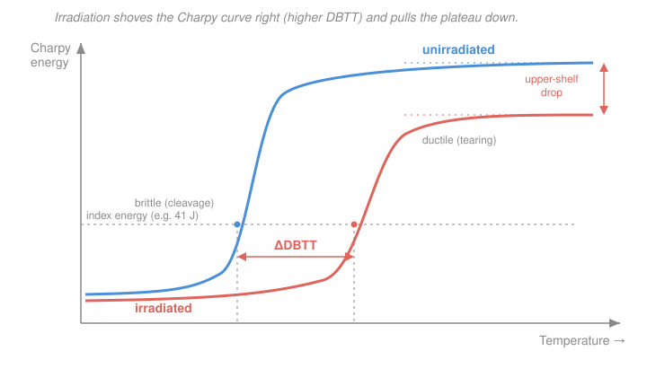

# Nuclear Materials · Lesson 2.6: Embrittlement and the DBTT shift

> ⏱ ~15 min · Module 2: Property changes under irradiation · Builds on: [2.5 Radiation hardening](02-05-radiation-hardening.md), [`materials-science` 4.4 (fracture, fatigue, creep)](../../materials-science/lessons/04-04-failure-fracture-fatigue-creep.md) · Unlocks: [4.2 (steel selection for the RPV)](04-02-steels-austenitic-ferritic-martensitic.md)

## Why this matters

The single most safety-critical piece of steel in a light-water reactor is the **reactor pressure vessel (RPV)** — the thick forging that holds the core, the coolant, and 150+ atmospheres of pressure, and that you can never replace. Over decades of neutron bombardment it does not corrode away or crack visibly. It does something quieter and more dangerous: it *gets more brittle*. The same irradiation hardening you computed in [2.5](02-05-radiation-hardening.md) — the yield strength climbing as defect clusters block dislocations — has a toll you have not yet paid. A stronger steel is a more brittle steel, and for the RPV that trade sets the life of the plant. This lesson is where "hardening" becomes "embrittlement," and where the number an operator actually tracks — the shift in the ductile-to-brittle transition temperature — comes from.

## The idea

Recall from [`materials-science` 4.4](../../materials-science/lessons/04-04-failure-fracture-fatigue-creep.md) that body-centered-cubic steels have a split personality. Warm, they are **ductile**: a crack tip blunts by plastic flow, soaking up energy before anything breaks. Cold, they are **brittle**: atomic planes simply cleave apart with almost no warning. The temperature where the steel flips between these two behaviors is the **ductile-to-brittle transition temperature (DBTT)**. You want your vessel operating comfortably *above* its DBTT, so that any flaw tears slowly instead of snapping.

Here is the mechanism that couples this to irradiation. Two things compete at a crack tip: the stress needed to make the metal *flow plastically* (the yield strength $\sigma_y$) and the stress needed to make it *cleave* (roughly fixed by the bonds, nearly temperature-independent). Whichever threshold you reach first wins. At warm temperatures $\sigma_y$ is low, so the steel yields and blunts the crack — ductile. As you cool, $\sigma_y$ rises; at the DBTT it catches up to the cleavage stress, and below that the crack cleaves before it can blunt — brittle.

Now irradiate. Hardening raises $\sigma_y$ *at every temperature*. So the temperature at which yield finally reaches the cleavage stress moves **up** — the whole transition shifts to warmer temperatures. Push $\sigma_y$ up by hardening and you have pushed the DBTT up with it. That is the entire story in one sentence: **irradiation hardens, hardening raises yield toward the fixed cleavage stress, so the brittle window creeps up into the operating range.**

There is a second, quieter cost. Even above the transition, the *amount* of energy a fully ductile break absorbs — the **upper-shelf energy (USE)** — drops, because the same obstacles that raise yield also limit how much the material can plastically deform before tearing. So the transition curve doesn't just slide right; its ductile plateau also sags down.

## The formal version

The standard laboratory probe is the **Charpy impact test**: a pendulum smashes a notched bar and you record the energy absorbed in the break, over a range of temperatures. Plot absorbed energy vs. temperature and you get an S-shaped curve — low "lower shelf" (brittle) at cold temperatures, high "upper shelf" (ductile) when warm, a steep transition between. The DBTT is read off at a fixed **index energy** (commonly 41 J, or a chosen fraction of the shelf).

Irradiation transforms that curve in two measurable ways:

$$\Delta\text{DBTT} > 0 \quad (\text{curve shifts right}), \qquad \Delta\text{USE} < 0 \quad (\text{plateau drops}).$$

*In words: after irradiation the steel needs to be warmer to stay ductile, and even when ductile it breaks less tough.*

The link back to hardening is empirical but robust. Across many RPV steels the transition shift scales linearly with the yield-strength increase:

$$\boxed{\;\Delta\text{DBTT} \approx C\,\Delta\sigma_y\;}, \qquad C \approx 0.6\ ^\circ\text{C/MPa}.$$

Here $\Delta\sigma_y$ (MPa) is the irradiation hardening from [2.5](02-05-radiation-hardening.md)'s dispersed-barrier model, and $C$ is a proportionality constant fitted to surveillance data. *In words: every 100 MPa of hardening buys you roughly 60 °C of upward DBTT shift.* The linearity is exactly what the crack-tip picture predicts — a fixed cleavage stress, a yield curve sliding up under it, so the crossing temperature moves in proportion to how far you raised yield.

**What controls the hardening (and so the shift): composition, fluence, and flux.** The obstacles doing the hardening in an RPV are not random. The chief culprits:

- **Copper-rich precipitates.** Copper is supersaturated in ferrite; irradiation gives vacancies the mobility to precipitate it into nanometer Cu-rich clusters — potent, dense obstacles. Old (pre-~1980) vessels and welds with 0.2–0.35 wt% Cu are the embrittlement problem children; modern steels hold Cu below ~0.05 wt%.
- **Ni/Mn-rich precipitates.** At high fluence, nickel and manganese form their own clusters (sometimes "late-blooming phases"), important where Cu is already low.
- **Phosphorus grain-boundary segregation.** Radiation-induced segregation ([2.1](02-01-defect-migration-radiation-enhanced-diffusion.md)) drives P onto grain boundaries, weakening them — a *non-hardening* embrittlement that adds directly to the shift without much raising $\sigma_y$.

All of **fluence** (total dose), **flux** (dose rate — the same slow-flux/fast-flux question from [2.5](02-05-radiation-hardening.md)), and **composition** enter the fitted *embrittlement correlations* (e.g. the U.S. regulatory trend curves) that predict $\Delta\text{DBTT}$ for a given vessel.

**Helium embrittlement — a separate, high-temperature mode.** Everything above is a *low-temperature*, hardening-driven, transgranular-cleavage story. There is a second embrittlement mechanism with a different physics and a different temperature regime. Transmutation reactions — especially $(n,\alpha)$ on nickel and boron — breed **helium** atoms in the lattice. Helium is insoluble and does not diffuse back out; at high temperature it collects on grain boundaries as **bubbles**. Those bubbles decohere the boundaries, so the metal fails **intergranularly** (along grain boundaries) instead of tearing through grains, and the upper-shelf toughness collapses. This is minor in a cool LWR vessel but becomes decisive at high dose and high temperature — above all for **fusion** first walls, whose 14 MeV neutrons make helium prolifically (see [4.5](04-05-materials-for-fusion.md)).

## Picture

The blue (unirradiated) curve rises from brittle to ductile at a cool temperature; the coral (irradiated) curve is the same shape shoved right — a positive $\Delta$DBTT read at the fixed index energy — and pulled down to a lower ductile plateau.

## Worked examples

These are **parts (b) and (c) of Boss Problem 2**. Part (a) was the hardening calculation in [2.5](02-05-radiation-hardening.md): a ferritic RPV steel with $N = 3\times10^{23}\ \mathrm{m^{-3}}$ copper-rich precipitates of diameter $d = 3\ \mathrm{nm}$ (and $M=3.06$, $\mu=80$ GPa, $b=0.25$ nm, $\alpha=0.4$) gives, from the dispersed-barrier model $\Delta\sigma_y = \alpha M \mu b\sqrt{Nd}$,

$$\Delta\sigma_y = 0.4\times3.06\times(80\times10^9)\times(0.25\times10^{-9})\times\sqrt{(3\times10^{23})(3\times10^{-9})} \approx 7.3\times10^{8}\ \mathrm{Pa} = 734\ \mathrm{MPa}.$$

We carry that $\Delta\sigma_y \approx 734\ \mathrm{MPa}$ forward.

**Example 1 — part (b): the transition shift, and why harder means more brittle.** Apply the empirical rule:

$$\Delta\text{DBTT} \approx C\,\Delta\sigma_y = 0.6\ (^\circ\text{C/MPa}) \times 734\ \mathrm{MPa} \approx 440\ ^\circ\text{C}.$$

*Physically:* the Cu clusters that raised the yield strength by 734 MPa raised it *at every temperature*. Cleavage fracture happens when the local stress to make the steel flow (yield) meets the roughly temperature-independent stress to split atomic planes (cleavage). Warmer steel yields first and blunts the crack; cool it and yield rises until it reaches cleavage, and below that crossing the crack cleaves — that crossing temperature *is* the DBTT. Hardening slides the yield curve bodily upward, so it now reaches the cleavage stress at a much warmer temperature: the ductile-to-brittle window climbs. Harder is more brittle because a higher yield reaches the cleavage ceiling sooner as you cool.

*Reality check.* A 440 °C shift is enormous — it would push the transition far above operating temperature and is a signature of this deliberately *dense-obstacle* textbook case (734 MPa of hardening is more than a real end-of-life RPV sees). Actual RPV shifts run from a few tens of °C up to perhaps ~150 °C, because real $\Delta\sigma_y$ values are smaller (tens to low hundreds of MPa). The rule $\Delta\text{DBTT}\approx0.6\,\Delta\sigma_y$ is the same; only the hardening input is milder. Units check: $(^\circ\text{C/MPa})\times\text{MPa} = {}^\circ\text{C}$ ✓.

**Example 2 — part (c): why choose a ferritic/martensitic steel for high dose, despite this embrittlement?** The vessel steel above is *ferritic* (bcc), and bcc is precisely the crystal class that *has* a ductile-to-brittle transition — the austenitic (fcc) steels like 316 essentially do not embrittle this way and stay tough to cryogenic temperatures. So why not just use austenitic steel everywhere the dose is high?

Because at high dose the dominant enemy is not embrittlement but **void swelling** ([2.3](02-03-voids-void-swelling.md)). Austenitic stainless steels swell badly — voids nucleate readily and the metal can grow by many percent in volume, distorting components and jamming clearances. Ferritic/martensitic (F/M) steels are strikingly **swelling-resistant**: their bcc lattice and high sink density soak up point defects with far less void formation, so they hold their dimensions to very high dpa. That is what you are buying. The price is exactly this lesson's problem — F/M steels *do* have a DBTT and *do* embrittle — but a transition shift you can manage by design (operating hot, controlling composition, tracking surveillance data) beats swelling you cannot undo. For high-dose structural service you accept a manageable embrittlement to escape an unmanageable swelling. This is the core of the selection argument developed in [4.2](04-02-steels-austenitic-ferritic-martensitic.md).

## Watch out

- **You might think "embrittled" means the steel got weaker — actually it got *stronger*.** Its yield strength went *up*; what it lost is *toughness* (the ability to absorb energy before fracturing). Strength and toughness are different axes, and irradiation trades one for the other. A hardened RPV steel would pull a *higher* number on a tensile test and a *lower* one on a Charpy test.
- **You might think fluence alone predicts the shift — actually composition and flux matter just as much.** Two vessels at identical fluence can embrittle very differently if one has 0.30 wt% Cu and the other 0.03 wt%. That is why regulatory embrittlement correlations take Cu, Ni, P *and* fluence (and increasingly flux) as inputs — not dose alone.
- **You might lump helium embrittlement in with the DBTT shift — they are different animals.** The DBTT shift is low-temperature, hardening-driven, and *transgranular* (cleavage through grains); helium embrittlement is high-temperature, bubble-driven, and *intergranular* (failure along grain boundaries). One is the RPV's problem; the other is the fusion first wall's ([4.5](04-05-materials-for-fusion.md)).

## One-liner

> Irradiation hardening raises yield toward the fixed cleavage stress, so the ductile-to-brittle transition climbs — $\Delta\text{DBTT}\approx0.6\,\Delta\sigma_y$ — and that upward creep, not corrosion, is what ends a pressure vessel's life.

## Problems

**P1 (🟢)** An RPV surveillance capsule, pulled after years in the beltline, shows a yield-strength increase of $\Delta\sigma_y = 150\ \mathrm{MPa}$. Estimate the transition-temperature shift $\Delta\text{DBTT}$, and say whether it lands in the range that would actually concern an operator.

**P2 (🟡)** Two heats of RPV steel are irradiated to the *same* fluence. Heat A contains 0.30 wt% copper; heat B contains 0.04 wt% copper. Which embrittles more, and by what physical mechanism? Name the single most effective composition change a vendor made to modern vessels to fight this, and one *non-hardening* contributor to embrittlement that lowering Cu does **not** fix.

**P3 (🔴)** A fusion first-wall steel accumulates helium at roughly 10 appm He/dpa (from 14 MeV $(n,\alpha)$ reactions), versus about 0.1 appm He/dpa in a fission spectrum. (a) After a service dose of 50 dpa, estimate the helium content in each case. (b) Explain why, at the *high* operating temperature of a first wall, this helium causes a *different* embrittlement than the RPV's DBTT shift — including where the fracture path goes and why you cannot simply anneal the damage out.

Solutions

**P1** Apply the empirical rule directly:

$$\Delta\text{DBTT} \approx C\,\Delta\sigma_y = 0.6\ (^\circ\text{C/MPa}) \times 150\ \mathrm{MPa} = 90\ ^\circ\text{C}.$$

A shift of ~90 °C sits squarely in the realistic RPV band (tens of °C up to ~150 °C at end of life), so yes — this is exactly the size of shift operators track against the vessel's pressurized-thermal-shock and reference-temperature screening limits. It is not a textbook exaggeration; it is a genuine cause for concern and surveillance. *Check.* Units $(^\circ\text{C/MPa})\times\text{MPa}={}^\circ\text{C}$ ✓; magnitude is consistent with the note in Example 1 that real shifts come from $\Delta\sigma_y$ of order 100 MPa. ✓

**P2** Heat A (high Cu) embrittles more. Copper is supersaturated in the ferrite matrix; irradiation supplies vacancies that give Cu atoms the mobility to cluster into dense nanometer-scale copper-rich precipitates. Those clusters are strong dislocation obstacles, so via the dispersed-barrier model they raise $\Delta\sigma_y$ far more in heat A — and through $\Delta\text{DBTT}\approx0.6\,\Delta\sigma_y$ they raise the transition shift proportionally. (Flux matters too, because slower dose rates give the Cu more time per dpa to precipitate.) The single most effective composition change: **cutting copper content**, from the old 0.2–0.35 wt% down to below ~0.05 wt% in modern steels and welds. The non-hardening contributor lowering Cu does *not* fix: **phosphorus segregation to grain boundaries** (radiation-induced segregation), which weakens boundaries and adds to embrittlement without much raising the bulk yield strength — controlled by limiting P, not Cu.

**P3** (a) Multiply rate by dose:

$$\text{fusion: } 10\ \tfrac{\text{appm}}{\text{dpa}}\times 50\ \text{dpa} = 500\ \text{appm He}; \qquad \text{fission: } 0.1\times 50 = 5\ \text{appm He}.$$

Two orders of magnitude more helium in the fusion wall — hundreds of appm versus a handful. (b) At high temperature the point-defect and cleavage story is not the issue; the metal is well above its DBTT and would tear ductilely. The problem is that helium is insoluble and immobile-as-gas: it precipitates into **bubbles on grain boundaries**, which decohere those boundaries. Fracture then runs **intergranularly** — along the grain boundaries rather than cleaving through grains — and the upper-shelf toughness collapses. You cannot anneal it away because annealing removes point defects and small loops, but the *helium atoms themselves do not leave the metal*; heat only lets the bubbles coarsen and grow, making the boundary embrittlement worse, not better. This is the high-temperature, gas-driven, grain-boundary mode that makes helium management a defining problem for fusion structural materials ([4.5](04-05-materials-for-fusion.md)). *Check.* The estimate says a fusion wall reaches in a *single* campaign the helium a fission component would need ~100× the dose to accumulate — consistent with why fusion needs purpose-designed low-activation, He-tolerant steels. ✓

## Flashback

**From Lesson 2.5 (Radiation hardening):** Early in a vessel's life, irradiation has produced small dislocation loops at a number density $N = 1\times10^{23}\ \mathrm{m^{-3}}$ with mean diameter $d = 1\ \mathrm{nm}$. Using the dispersed-barrier model $\Delta\sigma_y = \alpha M \mu b \sqrt{Nd}$ with $\alpha = 0.4$, $M = 3.06$, $\mu = 80$ GPa, $b = 0.25$ nm, estimate the hardening $\Delta\sigma_y$ — and, as a bonus, the DBTT shift it implies.

Solution

First the obstacle areal factor:

$$Nd = (1\times10^{23}\ \mathrm{m^{-3}})(1\times10^{-9}\ \mathrm{m}) = 1\times10^{14}\ \mathrm{m^{-2}}, \qquad \sqrt{Nd} = 1\times10^{7}\ \mathrm{m^{-1}}.$$

Then the dispersed-barrier hardening (SI throughout: $\mu = 80\times10^9$ Pa, $b = 0.25\times10^{-9}$ m):

$$\Delta\sigma_y = 0.4\times3.06\times(80\times10^9)\times(0.25\times10^{-9})\times(1\times10^{7}) \approx 2.45\times10^{8}\ \mathrm{Pa} = 245\ \mathrm{MPa}.$$

Bonus DBTT shift: $\Delta\text{DBTT}\approx 0.6\times245 \approx 147\ ^\circ\text{C}$ — a realistic (if high) end-of-life-scale shift, unlike the deliberately extreme 440 °C of the dense-precipitate boss problem. *Check.* Units of $\Delta\sigma_y$: $\mathrm{Pa\cdot m\cdot m^{-1}} = \mathrm{Pa}$ ✓ (the $\alpha, M$ are dimensionless). Sanity: this $N,d$ gives $\sqrt{Nd}$ smaller than the boss problem's $3\times10^7\ \mathrm{m^{-1}}$ by a factor 3, so the hardening is ~3× smaller (734 → 245 MPa), exactly as $\Delta\sigma_y \propto \sqrt{Nd}$ demands. ✓

## Connections

- **Backward:** this is the toll on [2.5](02-05-radiation-hardening.md)'s hardening — the *same* $\Delta\sigma_y$ from the dispersed-barrier model, now read as a toughness loss through $\Delta\text{DBTT}\approx0.6\,\Delta\sigma_y$. The ductile-vs-brittle competition itself is [`materials-science` 4.4](../../materials-science/lessons/04-04-failure-fracture-fatigue-creep.md)'s cleavage-vs-flow picture, and the phosphorus segregation piece rides on radiation-induced segregation from [2.1](02-01-defect-migration-radiation-enhanced-diffusion.md).
- **Forward:** the embrittlement-vs-swelling trade decided here is the spine of [4.2 (steel selection)](04-02-steels-austenitic-ferritic-martensitic.md) — you accept an F/M steel's DBTT shift to escape an austenitic steel's [void swelling](02-03-voids-void-swelling.md). Helium embrittlement is the opening for the fusion first-wall problem in [4.5](04-05-materials-for-fusion.md).
- **Sideways:** the crack-tip logic — a rising yield stress racing a fixed cleavage stress, and whichever is reached first setting the failure mode — is the same threshold-competition reasoning used across structural integrity and fracture mechanics, wherever a temperature-sensitive flow stress meets a temperature-insensitive fracture criterion.
