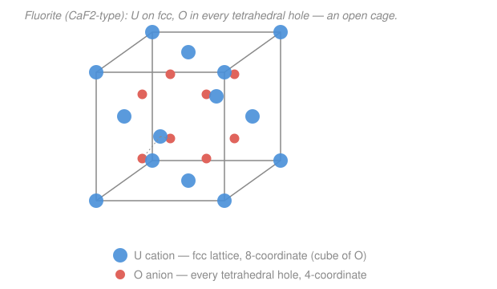

# Nuclear Materials · Lesson 3.1: UO₂ — the workhorse ceramic fuel

> ⏱ ~15 min · Module 3: Fuel · Builds on: [`materials-science` 1.2 (crystal structures & unit cells)](../../materials-science/lessons/01-02-crystal-structures-unit-cells.md), [`materials-science` 5.1 (electronic properties / band picture)](../../materials-science/lessons/05-01-electronic-properties-band-picture.md), [`intro-nuclear-engineering` 3.1 (the fission process & energy)](../../intro-nuclear-engineering/lessons/03-01-fission-process-energy.md) · Unlocks: [3.2 (fuel temperature profile & restructuring)](03-02-fuel-temperature-profile-restructuring.md)

## Why this matters

Almost every commercial power reactor on Earth burns the same fuel: sintered pellets of uranium dioxide, **UO₂**. On paper it looks like a strange choice — it conducts heat about as well as a firebrick, so its core runs blisteringly hot. Yet it beat the obvious rival, uranium *metal*, decisively. Understanding *why* a mediocre heat conductor won is the whole story of nuclear fuel design: you don't pick the material that performs best on any single number, you pick the one that *survives* years of fission inside a water-cooled tube. This lesson sets up everything downstream — the hot centerline of [3.2](03-02-fuel-temperature-profile-restructuring.md), where fission products go in [3.3](03-03-fission-products-fates.md), and the metallic-fuel comparison in [3.5](03-05-metallic-advanced-fuels.md).

## The idea

Fission ([`intro-nuclear-engineering` 3.1](../../intro-nuclear-engineering/lessons/03-01-fission-process-energy.md)) is a brutal tenant. Every splitting uranium atom dumps ~200 MeV of heat into a tiny volume and leaves behind two foreign atoms — the fission products — plus gas atoms (Xe, Kr) that want to bubble out. A good fuel has to (a) not melt when the inside runs past 1000 °C, (b) hold together while ~5% of its atoms are transmuted into strangers, and (c) not react violently with hot water if the cladding ever leaks. Uranium metal fails (b) and (c) badly: it melts at only ~1135 °C, swells and distorts under irradiation, and reacts with water.

UO₂ wins because of its **crystal structure**. It's an *open* ceramic — the fluorite lattice has room built in. Picture a rigid cage of uranium atoms with big empty pockets between them; those pockets swallow fission-product atoms and tolerate the fuel being slightly off perfect stoichiometry without the crystal falling apart. Add a melting point near 2865 °C, chemical calm around water and zirconium cladding, dirt-cheap fabrication, and cubic (direction-independent) symmetry, and you have a material that shrugs off abuse. The price you pay is heat: it's an electrical and thermal *insulator*, so heat crawls out slowly and the pellet center runs very hot. UO₂ is the compromise that trades cool operation for survivability.

## The formal version

**The fluorite structure (CaF₂-type).** UO₂ crystallizes in the fluorite lattice. The uranium cations (formally U⁴⁺) sit on a **face-centered cubic (fcc)** lattice — corners plus face centers of the cube ([`materials-science` 1.2](../../materials-science/lessons/01-02-crystal-structures-unit-cells.md)). The oxygen anions (O²⁻) fill **every one of the eight tetrahedral holes** inside that fcc cell.

*In words: build an fcc box of uranium, then drop an oxygen into all eight little tetrahedral pockets.* Counting atoms per conventional cell:

$$
N_{\mathrm U} = \underbrace{8\times\tfrac18}_{\text{corners}} + \underbrace{6\times\tfrac12}_{\text{faces}} = 4,
\qquad
N_{\mathrm O} = \underbrace{8\times 1}_{\text{interior holes}} = 8,
\qquad \frac{N_{\mathrm O}}{N_{\mathrm U}} = \frac{8}{4} = 2 .
$$

So the formula unit is UO₂, exactly. Coordination: each U is surrounded by a **cube of 8 oxygens** (8-coordinate); each O sits inside a **tetrahedron of 4 uraniums** (4-coordinate). Critically, half of the equivalent body-center-type interstitial sites are *empty* — this vacancy of space is what makes fluorite "open" and able to accommodate defects, extra oxygen, and fission products.

**Stoichiometry.** Real fuel is written $\mathrm{UO}_{2\pm x}$ — the **O/M ratio** (oxygen-to-metal) drifts from 2. Excess oxygen (hyper-stoichiometric, $\mathrm{UO}_{2+x}$) is absorbed as interstitial O; a deficit ($\mathrm{UO}_{2-x}$) leaves O vacancies. This is not a curiosity: $x$ shifts both the thermal conductivity and the chemistry that decides where fission products end up ([3.3](03-03-fission-products-fates.md)).

**Thermal conductivity.** UO₂ has no free electrons to carry heat (it's an insulator with a wide band gap — [`materials-science` 5.1](../../materials-science/lessons/05-01-electronic-properties-band-picture.md)'s band picture: full valence band, empty conduction band). Heat is carried almost entirely by **phonons** — lattice vibrations — and phonons scatter off *each other* more the hotter the crystal gets. The result is a conductivity that **falls** with temperature over the operating range, well modeled by

$$
k(T) \;\approx\; \frac{1}{A + B\,T},
$$

with $k$ in $\mathrm{W\,m^{-1}\,K^{-1}}$, $T$ in kelvin, and $A,B>0$ empirical constants. *In words: the hotter it gets, the worse it conducts.* Numerically $k$ slides from roughly $8\ \mathrm{W\,m^{-1}\,K^{-1}}$ near 200 °C down to about $3\ \mathrm{W\,m^{-1}\,K^{-1}}$ by ~1500 °C. (Only above ~1800 °C does a small electronic contribution bend the curve back up.) Excess oxygen and dissolved fission products scatter phonons too, dragging $k$ down further as the fuel burns.

## Picture

## Worked examples

**Example 1 (why the centerline runs hot).** For a fuel pellet generating heat uniformly, the temperature rise from the outer surface to the center of a cylinder is

$$
\Delta T \;=\; T_{\text{center}} - T_{\text{surface}} \;=\; \frac{q'}{4\pi\,k},
$$

where $q'$ is the **linear power** (heat generated per meter of rod, in W/m). Notice the pellet *radius cancels* — only the power-per-length and $k$ matter. Take a typical peak $q' = 25{,}000\ \mathrm{W/m}$.

If UO₂ conducted like its cold value $k = 8\ \mathrm{W\,m^{-1}\,K^{-1}}$:

$$
\Delta T = \frac{25{,}000}{4\pi(8)} = \frac{25{,}000}{100.5} \approx 249\ \mathrm{K}.
$$

But the center is the *hottest* place, so $k$ there is near its *low* value $k = 3$:

$$
\Delta T = \frac{25{,}000}{4\pi(3)} = \frac{25{,}000}{37.7} \approx 663\ \mathrm{K}.
$$

Two things fall out. First, even a few-hundred-kelvin rise over the coolant means a centerline near or above 1000 °C — routine for UO₂. Second, there's a **vicious feedback**: hot fuel conducts worse, which makes it hotter still, which lowers $k$ further. A constant-$k$ formula understates the truth; the honest calculation integrates $k(T)$ across the pellet, which is exactly [3.2](03-02-fuel-temperature-profile-restructuring.md)'s job. The high melting point (~2865 °C) is what buys the margin to survive this.

**Example 2 (structure decides the trade — UO₂ vs. metal fuel).** Why does uranium metal conduct heat ~10× better ($k \approx 35\ \mathrm{W\,m^{-1}\,K^{-1}}$)? Bonding. In a metal, delocalized conduction electrons ferry heat quickly ([`materials-science` 5.1](../../materials-science/lessons/05-01-electronic-properties-band-picture.md): partially filled band → free carriers). In ionic/covalent UO₂ there are no such carriers, so slow phonons do all the work. That single structural fact ripples into every property:

| | UO₂ (fluorite ceramic) | U metal |
|---|---|---|
| heat carrier | phonons | electrons |
| thermal conductivity $k$ | low (~3–8), *falls* with $T$ | high (~35) |
| melting point | ~2865 °C | ~1135 °C |
| water/clad reaction | benign | aggressive |
| under irradiation | dimensionally stable, brittle | swells, distorts |

The metal runs a *cool* center but has almost no thermal margin and misbehaves under flux; the ceramic runs a *hot* center but has enormous margin and stays put. This is the [`materials-science` 5.3](../../materials-science/lessons/05-03-materials-classes-selection.md) selection logic under a neutron flux: you don't optimize one property, you pick the structure whose *whole* property bundle survives service. UO₂ wins for water reactors; metal fuels come back only where their high $k$ is worth the trouble (fast reactors — [3.5](03-05-metallic-advanced-fuels.md)).

## Watch out

- **You might think a fuel this bad at conducting heat is a design failure — but actually the low $k$ is an accepted cost, paid for by the huge melting point.** The design question is never "does it conduct well?" but "does the centerline stay below melting with margin?" — and ~2865 °C gives a lot of room to be a poor conductor.
- **You might expect $k$ to rise with temperature the way a metal's ability to hold heat does — but for UO₂ it *falls*.** Phonon-phonon (Umklapp) scattering worsens with temperature, so the insulator conducts *less* when hot. Confusing this sign is the single most common UO₂ error; it's the opposite of the metal-electron intuition.
- **You might treat the fuel as perfect UO₂.₀₀ — but it lives as UO₂±x.** Small departures from O/M = 2 change $k$ (excess oxygen scatters phonons, lowering it) and set the oxygen potential that governs fission-product chemistry and cladding corrosion from the inside. Stoichiometry is a design variable, not a constant.

## One-liner

> UO₂ won because its open fluorite cage survives fission and melts near 2865 °C — you tolerate its insulator-grade, temperature-*falling* thermal conductivity and the hot centerline that comes with it.

## Problems

**P1 (🟢)** A UO₂ rod runs at linear power $q' = 30{,}000\ \mathrm{W/m}$ with a pellet-surface temperature of 400 °C. Using the constant-$k$ estimate $\Delta T = q'/(4\pi k)$, find the approximate centerline temperature for (a) $k = 8\ \mathrm{W\,m^{-1}\,K^{-1}}$ and (b) $k = 3\ \mathrm{W\,m^{-1}\,K^{-1}}$. Which is closer to reality, and why?

**P2 (🟡)** From the fluorite structure alone, confirm the UO₂ stoichiometry: count the U and O atoms belonging to one conventional unit cell, and state the coordination number of each ion. Then explain in one sentence what structural feature lets the crystal absorb fission-product atoms.

**P3 (🔴)** In one paragraph, argue from *bonding* why U metal conducts heat about ten times better than UO₂, and why that advantage does **not** make it the better fuel for a water-cooled reactor. Reference the property that actually caps a fuel's usable power.

Solutions

**P1** Use $\Delta T = q'/(4\pi k)$ with $q' = 30{,}000\ \mathrm{W/m}$.

(a) $k = 8$: $\ \Delta T = \dfrac{30{,}000}{4\pi(8)} = \dfrac{30{,}000}{100.5} \approx 299\ \mathrm{K}$, so $T_{\text{center}} \approx 400 + 299 = 699\ ^\circ\mathrm{C}$.

(b) $k = 3$: $\ \Delta T = \dfrac{30{,}000}{4\pi(3)} = \dfrac{30{,}000}{37.7} \approx 796\ \mathrm{K}$, so $T_{\text{center}} \approx 400 + 796 = 1196\ ^\circ\mathrm{C}$.

The $k=3$ case is closer to reality: the hottest material sits at the center, where $T$ is high and therefore $k$ is *low*. Because $k$ falls with temperature, the true profile is steeper than any single cold-$k$ estimate — the real centerline sits at or above the (b) value. (Units check: $\mathrm{(W/m)}/\mathrm{(W\,m^{-1}\,K^{-1})} = \mathrm{K}$ ✓.)

**P2** Uranium on fcc:
$$N_{\mathrm U} = 8\times\tfrac18 + 6\times\tfrac12 = 1 + 3 = 4.$$
Oxygen fills all 8 tetrahedral holes, each fully interior to the cell:
$$N_{\mathrm O} = 8\times 1 = 8.$$
Ratio $N_{\mathrm O}/N_{\mathrm U} = 8/4 = 2 \Rightarrow \mathrm{UO_2}$ ✓. Coordination: each U is surrounded by a cube of **8** O (8-coordinate); each O by a tetrahedron of **4** U (4-coordinate). The absorbing feature: fluorite leaves the body-center-type interstitial sites *empty*, so the lattice has built-in open space (plus tolerance for O/M ≠ 2) into which fission-product atoms and excess oxygen can lodge without wrecking the crystal.

**P3** In U metal, bonding is metallic: a sea of delocalized conduction electrons occupies a partially filled band, and these mobile carriers transport heat rapidly, giving $k \approx 35\ \mathrm{W\,m^{-1}\,K^{-1}}$. In UO₂ the bonding is ionic/covalent with a full valence band and a wide gap — no free carriers — so heat moves only by phonons, which scatter heavily (and worse as $T$ rises), leaving $k$ around 3–8. Yet the property that caps usable power is the **melting point**: the fuel must keep its centerline safely below melting at full power. U metal melts at only ~1135 °C, so its high conductivity is spent against a low ceiling, and it additionally swells and reacts with water under irradiation. UO₂'s ~2865 °C ceiling tolerates a hot, poorly conducting center while staying dimensionally and chemically stable — so for a water reactor the ceramic's *survivability* beats the metal's *conductivity*.

## Flashback

**From Lesson 2.3 (Voids & void swelling):** A stainless-steel duct in a fast reactor develops a void population of number density $N_v = 1\times10^{22}\ \mathrm{m^{-3}}$ with average void radius $r = 10\ \mathrm{nm}$. Estimate the fractional volumetric swelling $\Delta V/V$, and the approximate linear (length) swelling $\Delta L/L$.

Solution

Each void is a sphere of volume
$$V_{\text{void}} = \tfrac43\pi r^3 = \tfrac43\pi (1\times10^{-8}\ \mathrm{m})^3 = 4.19\times10^{-24}\ \mathrm{m^3}.$$
Volumetric swelling is the void volume per unit material volume:
$$\frac{\Delta V}{V} = N_v\, V_{\text{void}} = (1\times10^{22})(4.19\times10^{-24}) \approx 4.2\times10^{-2} = 4.2\%.$$
Swelling is isotropic in a cubic metal, so length change is one-third of the volume change:
$$\frac{\Delta L}{L} \approx \tfrac13\frac{\Delta V}{V} \approx 1.4\%.$$
(Units check: $\mathrm{m^{-3}}\cdot\mathrm{m^3}$ = dimensionless ✓. Sanity: a few-percent swelling from ~10 nm voids at $10^{22}\ \mathrm{m^{-3}}$ is the classic fast-reactor magnitude — enough to bow ducts and drive design limits.)

## Connections

- **Backward:** the fluorite lattice is just fcc ([`materials-science` 1.2](../../materials-science/lessons/01-02-crystal-structures-unit-cells.md)) with its tetrahedral holes filled; the phonon-only, temperature-falling conductivity follows directly from UO₂ being a wide-gap insulator ([`materials-science` 5.1](../../materials-science/lessons/05-01-electronic-properties-band-picture.md)), the mirror image of a metal's electron-carried heat. Choosing it over metal is the flux-service version of [`materials-science` 5.3](../../materials-science/lessons/05-03-materials-classes-selection.md) selection.
- **Forward:** [3.2](03-02-fuel-temperature-profile-restructuring.md) turns the low $k(T)$ into the real centerline temperature by integrating conductivity across the pellet, driving cracking and restructuring; the open fluorite cage is where the fission products of [3.3](03-03-fission-products-fates.md) and the swelling gases of [3.4](03-04-fission-gas-release-swelling.md) go; [3.5](03-05-metallic-advanced-fuels.md) revisits the metal-fuel trade for fast reactors.
- **Sideways:** the same phonon Umklapp scattering that makes UO₂ a poor conductor governs thermal transport in every non-metallic solid — the physics of thermoelectrics and of ceramic thermal-barrier coatings in jet engines is the same knob, run the other way.
