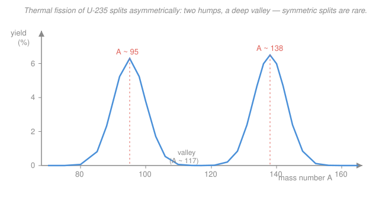

# Nuclear Materials · Lesson 3.3: Fission products and their fates

> ⏱ ~15 min · Module 3: Nuclear fuels and fission-product behavior · Builds on: [3.1 UO₂: the workhorse ceramic fuel](03-01-uo2-ceramic-fuel.md), [3.2 The fuel temperature profile and restructuring](03-02-fuel-temperature-profile-restructuring.md), [`intro-nuclear-engineering` 3.2 Fission products and neutron yield](../../intro-nuclear-engineering/lessons/03-02-fission-products-neutron-yield.md) · Unlocks: [3.4 Fission-gas release and gaseous swelling](03-04-fission-gas-release-swelling.md)

## Why this matters

Every fission does two jobs at once: it releases ~200 MeV of heat (the reactor's point), and it converts one uranium atom into **two brand-new atoms** that were never in the fuel design. Multiply by $10^{20}$-plus fissions per gram and the fuel slowly turns into a chemical zoo — noble gases, corrosive iodine, metallic specks, dissolved rare earths. That zoo is what *ruins* the fuel: it swells the pellet, pressurizes the cladding, shifts the internal chemistry until the cladding corrodes from the inside, and — if the pin ever breaches — becomes the radioactive **source term** that escapes. In [`intro-nuclear-engineering` 3.2](../../intro-nuclear-engineering/lessons/03-02-fission-products-neutron-yield.md) you met fission products as neutron-economy bookkeeping (yields, poisons). Here we care about them as *materials*: what gets made, and where each species goes.

## The idea

Picture the heavy nucleus as a wobbling drop of charged liquid. When it splits it almost never breaks into two equal halves — it prefers a **lopsided** split, one lighter fragment and one heavier. Do this over many fissions and plot how often each product mass appears: you get the famous **double-humped yield curve**, a light peak near mass 95 and a heavy peak near mass 137, with a deep valley in between where the (rare) symmetric splits would land. Two fragments per fission means **about two fission-product atoms are born per fission** — the yields sum to ~200%.

Now, what *are* those atoms chemically? That's the question that decides fuel performance, and the answer is: all over the periodic table. The trick is to stop thinking element-by-element and sort them into **four behavioral bins**, because everything in a bin does the same thing inside the pellet:

- **Noble gases** (xenon, krypton) — chemically inert, essentially *insoluble* in the ceramic. They have nowhere to go, so they clump into bubbles. (This is the whole story of [3.4](03-04-fission-gas-release-swelling.md).)
- **Volatiles** (cesium, iodine, tellurium) — low boiling points; they migrate down the steep temperature gradient toward the cooler pellet rim. These are the villains of accident **source terms** (radioiodine, radiocesium).
- **Solid metals** (molybdenum, technetium, ruthenium, rhodium, palladium) — won't oxidize in this environment, so they precipitate as tiny metallic beads, the "**white inclusions**" (also called the five-metal or ε-phase particles).
- **Oxides / soluble** (strontium, barium, zirconium, the rare earths) — chemically at home in the oxide, so they simply dissolve into the UO₂ lattice as substitute cations.

One more consequence hides in the chemistry. UO₂ starts perfectly balanced at two oxygens per metal atom. But when a U atom fissions, the two oxygens it was holding don't disappear — and the two fission products it becomes can't always re-bond all of them. **Oxygen is left over.** Over burnup that surplus oxygen raises the fuel's "oxygen potential," and that is what pushes on the cladding's inner wall chemically. Which brings up the last idea: **burnup**, the fuel's odometer — how far this whole process has gone.

## The formal version

**The fission-yield curve.** Let $Y(A)$ be the **fission yield**: the number of product atoms of mass number $A$ produced per 100 fissions (units: % per fission). For thermal fission of $^{235}\text{U}$ it is strongly asymmetric, peaking at $Y \approx 6\%$ near $A \approx 95$ and $A \approx 137$, and dropping to $\sim0.01\%$ at the symmetric point $A \approx 117$.

$$\sum_A Y(A) = 200\% \qquad\Longleftrightarrow\qquad \text{2 fragments per fission.}$$

*In words: add up the yields of every mass and you get 200%, because each fission makes two products.* (Careful with vocabulary: the two nuclei at the instant of scission are **fission fragments** — hot, neutron-rich; after they boil off prompt neutrons and beta-decay toward stability they are the **fission products** we inventory here.)

**Chemical classification.** Sort products by their behavior in hot UO₂:

| Class | Examples | Fate in the pellet |
|---|---|---|
| Noble gas | Xe, Kr | insoluble &#8594; bubbles, swelling, [gas release](03-04-fission-gas-release-swelling.md) |
| Volatile | Cs, I, Te | migrate to cooler rim; accident source term |
| Solid metal | Mo, Tc, Ru, Rh, Pd | metallic "white inclusion" precipitates |
| Oxide / soluble | Sr, Ba, Zr, rare earths | dissolve in the UO₂ matrix |

*In words: same fission, four completely different material outcomes — and each outcome maps to a different fuel-performance problem.*

**Oxygen redistribution.** In stoichiometric UO₂ the metal is U(IV), holding an oxygen-to-metal ratio $\mathrm{O/M} = 2.00$. Fission a U(IV) atom and its **2 oxygens are released**; the two product atoms re-bind them only partially (noble metals bind none; rare earths are trivalent, binding ~1.5 O each; gases bind none). On average the products consume *fewer* than 2 oxygens, so with burnup

$$\mathrm{O/M} \uparrow \quad\Longrightarrow\quad \text{oxygen potential } \Delta \bar{G}_{\mathrm{O}_2} \uparrow,$$

*In words: as uranium is eaten, leftover oxygen makes the fuel progressively more oxidizing* — which drives oxidation and corrosion of the cladding inner surface (the O/M story begun in [3.1](03-01-uo2-ceramic-fuel.md)).

**Burnup — the fuel's clock.** Two equivalent measures:

$$\text{FIMA} = \frac{\text{fissions}}{\text{initial metal atoms}}\;(\text{at\%}), \qquad B = \frac{\text{energy released}}{\text{initial fuel mass}} = \frac{\mathrm{MWd}}{\mathrm{kgU}}.$$

*In words: burnup is either the fraction of the original heavy-metal atoms that have fissioned (at% FIMA), or the energy extracted per unit fuel mass (MWd/kgU or, equivalently, MWd/tU / GWd/tU).* They are locked together by the energy per fission. Since one fission releases ~200 MeV $= 3.2\times10^{-11}\ \mathrm{J}$, and $1\ \mathrm{MWd} = 8.64\times10^{10}\ \mathrm{J}$,

$$\frac{\text{fissions}}{\mathrm{MWd}} = \frac{8.64\times10^{10}}{3.2\times10^{-11}} \approx 2.7\times10^{21}, \qquad\text{equivalently } \approx 0.95\ \frac{\mathrm{MWd}}{\text{gram fissioned}}.$$

Higher burnup = more fissions = larger fission-product inventory. **Burnup is the single number that says how much of everything above has accumulated.**

## Picture

## Worked examples

**Example 1 — how much gas does a pin make?** (Sets up the plenum pressure of [3.4](03-04-fission-gas-release-swelling.md).) Take the combined noble-gas yield $Y_{\text{gas}} \approx 0.30$ atoms of (Xe + Kr) per fission, and a rod section at burnup $B = 45\ \mathrm{MWd/kgU}$. How many moles of gas per kilogram of uranium?

Fissions per kgU:

$$\frac{\text{fissions}}{\mathrm{kgU}} = B \times \frac{\text{fissions}}{\mathrm{MWd}} = 45 \times 2.7\times10^{21} = 1.22\times10^{23}.$$

Gas atoms, then moles (using $N_A = 6.022\times10^{23}$):

$$N_{\text{gas}} = 0.30 \times 1.22\times10^{23} = 3.65\times10^{22}, \qquad n = \frac{3.65\times10^{22}}{6.022\times10^{23}} = 0.061\ \mathrm{mol\ per\ kgU}.$$

A single LWR pin holds roughly 1.7 kgU, so it brews about $0.061 \times 1.7 \approx 0.10\ \mathrm{mol}$ of noble gas. That is a *lot* of gas to store in a thin tube — hold that number; in [3.4](03-04-fission-gas-release-swelling.md) we push it through the ideal-gas law to get plenum pressure.

**Example 2 — read burnup as at% FIMA.** A fuel pin is discharged at $B = 50\ \mathrm{MWd/kgU}$. What fraction of its uranium atoms actually fissioned?

Use the rule $\approx 0.95\ \mathrm{MWd}$ per gram fissioned. Per kilogram of uranium we released 50 MWd, so the mass fissioned is

$$m_{\text{fiss}} = \frac{50\ \mathrm{MWd}}{0.95\ \mathrm{MWd/g}} = 52.6\ \mathrm{g\ out\ of\ 1000\ g\ U} = 5.3\%\ \text{by mass}.$$

Because a fissioned U atom and an average U atom weigh essentially the same (~238), mass fraction ≈ atom fraction, so

$$\boxed{\ B = 50\ \mathrm{MWd/kgU} \;\approx\; 5.3\ \text{at\% FIMA}.\ }$$

*Check.* Do it the long way through atoms: fissions/kgU $= 50 \times 2.7\times10^{21} = 1.35\times10^{23}$; initial U atoms/kgU $= (1000/238)\times6.022\times10^{23} = 2.53\times10^{24}$; ratio $= 0.053 = 5.3$ at% ✓. Rule of thumb worth memorizing: **~1 at% FIMA per 9.5 MWd/kgU**, so typical LWR discharge (45–55 MWd/kgU) means ~5% of the uranium is gone.

## Watch out

- **You might think fission splits the nucleus into two equal halves.** For thermal fission of the common fuels it doesn't — the symmetric split (the valley near $A\approx117$) is ~*hundreds of times less likely* than the asymmetric peaks. Equal halves become competitive only at high excitation energy (fast/high-energy fission fills in the valley).
- **You might treat all fission products as chemically alike.** They span from inert gases to refractory metals to lattice-soluble oxides, and a product's *chemical class*, not its yield, decides its fate — a high-yield soluble rare earth is harmless to pin integrity, while lower-yield xenon dominates swelling.
- **You might think burnup measures time.** It measures accumulated *fissions* (energy per mass), not calendar age: two pins at the same burnup carry the same stable-product inventory whether they got there in one year or three. (Only the short-lived, decaying species care about the actual timeline.)

## One-liner

> Every fission mints two atoms off a double-humped mass curve; bin them as gas, volatile, metal, or oxide and you've predicted how the fuel will swell, corrode, and leak — with burnup as the odometer for how far it's gone.

## Problems

**P1 (🟢)** Sort these fission products into the four chemical bins and give each bin's one-line fate in the pellet: Xe, Cs, Mo, Zr, Kr, I, Ru, Nd (neodymium, a rare earth), Ba.

**P2 (🟡)** A fuel pin contains 1.7 kgU and is taken to $B = 60\ \mathrm{MWd/kgU}$. Using a combined noble-gas yield of 0.28 atoms/fission, (a) find the total moles of Xe + Kr produced in the pin, and (b) express the burnup in at% FIMA.

**P3 (🔴)** In UO₂ each fissioned U(IV) atom frees the 2 oxygens it was bonding. Suppose that, averaged over all product classes, the two fission products re-bind only 1.9 of those 2 oxygens. (a) How many excess oxygen atoms are liberated per 100 fissions? (b) In one or two sentences, explain why this pushes the fuel's O/M ratio and oxygen potential up with burnup, and name the cladding failure mode it drives (link back to [3.1](03-01-uo2-ceramic-fuel.md)).

Solutions

**P1**
- **Noble gas:** Xe, Kr — insoluble; coalesce into bubbles, swell the fuel, eventually vent (→ [3.4](03-04-fission-gas-release-swelling.md)).
- **Volatile:** Cs, I — low boiling point; migrate toward the cooler pellet rim/gap and dominate the accident source term.
- **Solid metal:** Mo, Ru — don't oxidize here; precipitate as metallic "white inclusion" beads.
- **Oxide / soluble:** Zr, Nd, Ba — dissolve substitutionally in the UO₂ matrix (Nd is a rare earth; Ba/Zr form oxides at home in the lattice).

*Check.* Nine species, four bins, each fate distinct — exactly the point that yield is irrelevant to fate; chemistry rules.

**P2** (a) Fissions in the pin:

$$N_f = B \times \frac{\text{fissions}}{\mathrm{MWd}} \times m_U = 60 \times 2.7\times10^{21} \times 1.7 = 2.75\times10^{23}.$$

Gas atoms and moles:

$$N_{\text{gas}} = 0.28 \times 2.75\times10^{23} = 7.71\times10^{22}, \qquad n = \frac{7.71\times10^{22}}{6.022\times10^{23}} = 0.13\ \mathrm{mol}.$$

(b) By the rule $\approx 0.95\ \mathrm{MWd/g}$ fissioned: $60/0.95 = 63\ \mathrm{g}$ per 1000 g U $= 6.3\%$ by mass $\approx \mathbf{6.3}$ **at% FIMA**. (Or: $60/9.5 \approx 6.3$ at%.)

*Check.* Higher burnup than Example 1's pin, so more gas (0.13 vs ~0.10 mol) and higher FIMA — both scale up with $B$, as they must ✓.

**P3** (a) Excess per fission $= 2 - 1.9 = 0.1$ oxygen atom, so per 100 fissions:

$$0.1 \times 100 = 10\ \text{excess oxygen atoms per 100 fissions.}$$

(b) The freed oxygen has no metal partner to fully re-bond, so it accumulates in the lattice: the oxygen-to-metal ratio $\mathrm{O/M}$ creeps above 2.00 (hyperstoichiometric), which raises the fuel's **oxygen potential** — it becomes progressively more oxidizing with burnup. That oxidizing atmosphere attacks the Zircaloy cladding's inner surface: **inner-wall (fuel-side) oxidation/corrosion**, the mechanism whose starting point was the O/M sensitivity in [3.1](03-01-uo2-ceramic-fuel.md).

*Check.* Sign is right — fewer oxygens consumed than released means O/M rises, not falls; and a more oxidizing fuel corroding its container is the physically expected outcome ✓.

## Flashback

**From Lesson 3.2 (The fuel temperature profile):** A UO₂ pin runs at linear power $q' = 20\ \mathrm{kW/m}$ with a pellet outer-surface temperature $T_s = 430\,^\circ\mathrm{C}$. Modeling the conductivity crudely as constant $k \approx 2.8\ \mathrm{W\,m^{-1}\,K^{-1}}$, use the cylindrical-pin result $q' = 4\pi\!\int_{T_s}^{T_0} k\,dT$ to find the centerline temperature $T_0$. Does the pellet center reach the ~1000 °C fission-gas-release threshold — i.e., will Xe/Kr from Example 1 start escaping there?

Solution

With constant $k$, the integral is just $k(T_0 - T_s)$, so $q' = 4\pi k (T_0 - T_s)$ and

$$T_0 - T_s = \frac{q'}{4\pi k} = \frac{20{,}000\ \mathrm{W/m}}{4\pi \times 2.8\ \mathrm{W\,m^{-1}K^{-1}}} = \frac{20{,}000}{35.2} \approx 568\ \mathrm{K}.$$

So $T_0 \approx 430 + 568 = 998\,^\circ\mathrm{C} \approx 1000\,^\circ\mathrm{C}$.

The centerline sits right at the ~1000 °C threshold: the hot core of the pellet is just entering the regime where gas atoms become mobile enough to diffuse out of the grains, while the cooler outer radii stay below it and retain their gas. *That radial split — hot center releasing, cold rim retaining — is exactly the setup for [3.4](03-04-fission-gas-release-swelling.md).*

*Check.* Units: $\mathrm{(W/m)}/\mathrm{(W\,m^{-1}K^{-1})} = \mathrm{K}$ ✓. And $T_0 > T_s$ with a several-hundred-kelvin rise is the expected steep UO₂ gradient (its low conductivity is the whole reason the center runs so hot) ✓.

## Connections

- **Backward:** this fills in the *material* content of the fission products that [`intro-nuclear-engineering` 3.2](../../intro-nuclear-engineering/lessons/03-02-fission-products-neutron-yield.md) introduced as neutron-economy objects, and it uses the O/M / oxygen-potential sensitivity from [3.1](03-01-uo2-ceramic-fuel.md). The migration of volatiles rides the temperature gradient computed in [3.2](03-02-fuel-temperature-profile-restructuring.md), and "migrate to a cooler region" is the same driven diffusion you built in [`materials-science` 2.5](../../materials-science/lessons/02-05-diffusion-ii-transient-arrhenius.md).
- **Forward:** the noble-gas inventory (Example 1) is the raw material for [3.4 Fission-gas release and gaseous swelling](03-04-fission-gas-release-swelling.md); the solid and oxide products drive *solid* swelling there too, and the oxygen-potential rise feeds the cladding corrosion of [4.3 Corrosion in reactor coolant](04-03-corrosion-reactor-coolant.md).
- **Sideways:** the double-humped yield curve is a fingerprint of the fissioning nucleus — reactor physics and safeguards read isotopic ratios of these very products (e.g. cesium and neodymium isotopes) to back out a fuel's burnup and even which nuclide fissioned, the everyday practice of nuclear forensics and post-irradiation examination.
