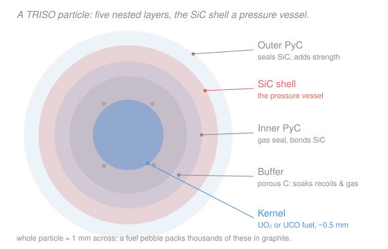

# Nuclear Materials · Lesson 3.5: Metallic and advanced fuels

> ⏱ ~15 min · Module 3: Nuclear Fuel · Builds on: [3.1 UO₂ ceramic fuel](03-01-uo2-ceramic-fuel.md), [3.2 Fuel temperature profile & restructuring](03-02-fuel-temperature-profile-restructuring.md), [3.4 Fission-gas release & swelling](03-04-fission-gas-release-swelling.md) · Unlocks: [4.1 Zirconium-alloy cladding](04-01-zirconium-alloys-cladding.md) (the clad has to match the fuel)

## Why this matters

UO₂ (Lessons 3.1–3.4) is the workhorse, but it has one crippling flaw you already met: it's a lousy heat conductor, so its center runs blisteringly hot — often over $1000\ ^\circ$C hotter than its surface. Almost every "advanced" fuel is an answer to a specific UO₂ pain point: run the center cooler, cram in more fissile atoms, or contain fission products so well you can push burnup far higher. None is free — each fixes one thing and hands you a new failure mode. Knowing the trades is how you read *why a reactor picked the fuel it did*, and it sets up Module 4, where the cladding is chosen to survive whatever the fuel does to it.

## The idea

Think of a fuel as making three promises: **hold the fissile atoms, get the heat out, and keep the fission-product mess bottled up.** UO₂ keeps the first and third promises well and the second one badly. So designers swap the chemistry:

- Make the fuel a **metal** (U alloyed with Zr, or U–Pu–Zr) and heat pours out roughly ten times faster — the center barely rises above the surface. But metals melt at lower temperatures, swell hard, and *chemically attack the cladding*. You trade a thermal problem for a chemical one.
- Keep the oxide but swap some uranium for **plutonium** (MOX) — same familiar ceramic behavior, now burning recycled Pu.
- Wrap each speck of fuel in its own **armored shell** (TRISO) so the fuel form *is* the containment — then you can run hot and burn deep.
- Or pick a compound that is both **dense and conductive** (uranium nitride or carbide) — more fissile atoms per cm³ *and* good heat flow, attractive for compact or space reactors.

The unifying lens: pick your poison. Every gain shows up as a cost somewhere else in the fuel's three promises.

## The formal version

Recall the workhorse result from [3.2](03-02-fuel-temperature-profile-restructuring.md). For a cylindrical fuel pin generating a **linear power** $q'$ (watts per meter of pin, W/m) with a roughly constant thermal conductivity $k$ (watts per meter-kelvin, W/m·K), the temperature drop from centerline $T_0$ to pellet surface $T_s$ is

$$T_0 - T_s = \frac{q'}{4\pi k}.$$

*In words: the center-to-surface temperature rise depends only on how much power you push per unit length and how well the fuel conducts — not on the pin radius.* This one equation drives the whole comparison, because $k$ is where the fuel forms differ most.

Rough properties at operating conditions (order-of-magnitude — the point is the ratios, not the third digit):

| Fuel | $k$ (W/m·K) | melting point | density of U (g/cm³) | headline trait |
|---|---|---|---|---|
| UO₂ | ~3–4 | ~2850 $^\circ$C | ~9.7 | baseline; poor $k$, high $T_\text{melt}$ |
| U–Zr metal | ~30–40 | ~1100–1200 $^\circ$C | high | ~10× $k$; runs cool, low margin |
| MOX (U,Pu)O₂ | ~3–4 | ~2750 $^\circ$C | ~9.7 | UO₂-like, burns Pu |
| UN / UC | ~15–25 | ~2400–2800 $^\circ$C | ~13–14 | dense **and** conductive |

**Metallic fuel** (U–Zr; U–Pu–Zr for fast reactors — EBR-II and the Integral Fast Reactor). High $k$ means the $q'/(4\pi k)$ rise is small, so the whole pin sits far below melting during normal operation — a large **safety margin** and the basis of the famous EBR-II passive-shutdown tests. The costs:

- **Low melting point.** The alloy's solidus is near $1100\ ^\circ$C, so despite running cool the *margin to melting* can still be tight in a transient.
- **Fuel–clad chemical interaction (FCCI).** Fuel constituents and lanthanide fission products diffuse into the steel clad and form **low-melting eutectics** (see [`materials-science` 3.2 Eutectics](../../materials-science/lessons/03-02-eutectics-microstructure.md)) that thin and weaken the cladding from the inside.
- **Constituent redistribution.** Zr migrates up the steep thermal gradient (a thermotransport / uphill-diffusion effect built on [`materials-science` diffusion](../../materials-science/lessons/02-04-diffusion-i-ficks-first-law.md)), so the alloy composition — and local melting point — is *not* uniform across the radius.
- **High swelling.** Metallic fuel swells fast from fission gas.

The engineering fixes all live in the pin design: a **sodium thermal bond** in the fuel–clad gap (liquid Na conducts heat across the gap far better than the He gas UO₂ uses), a **low smear density** (fuel deliberately under-fills the clad, ~75%, leaving room to swell before it touches the clad), and a large **gas plenum** to hold released fission gas at tolerable pressure ([3.4](03-04-fission-gas-release-swelling.md)).

**MOX**, $(\mathrm{U,Pu})\mathrm{O}_2$: UO₂ with some U replaced by recycled or weapons Pu. It's still the same fluorite ceramic, so it behaves UO₂-like — poor $k$, hot center, familiar restructuring — with shifted numbers (slightly lower melting point and $k$). The reason to use it is fuel-cycle, not thermal: it recycles plutonium.

**TRISO** (TRi-structural ISOtropic coated particles; high-temperature gas reactors). Each fuel kernel is wrapped in four coatings — a porous carbon **buffer**, **inner pyrolytic carbon (IPyC)**, a **silicon carbide (SiC)** shell, and **outer pyrolytic carbon (OPyC)**. The SiC layer is a miniature **pressure vessel**: it holds in the fission gas the buffer releases, so each particle contains its own inventory. Thousands of particles are pressed into a graphite pebble or compact. Because containment is per-particle **defense-in-depth**, TRISO tolerates very high burnup and temperature — the fuel form itself is the last barrier, not the metal clad.

**Nitride / carbide** (UN, UC): high uranium density *and* good conductivity, so you get more fissile atoms per cm³ and a cooler center at once — attractive for compact, high-power-density, or space reactors. (UN wants ¹⁵N enrichment to avoid parasitic neutron capture on ¹⁴N; UC is chemically reactive.)

**Accident-tolerant fuel (ATF)** is the umbrella term for the current push: higher-conductivity fuels (doped UO₂, UN, U₃Si₂) paired with tougher claddings (coated Zr, SiC composites, FeCrAl) that oxidize far slower in a loss-of-coolant accident — the cladding half is [4.x](04-01-zirconium-alloys-cladding.md).

## Picture

## Worked examples

**Example 1 (Boss problem 3(c) — why metallic fuel runs cool, and what it costs).** A pin runs at linear power $q' = 30\ \mathrm{kW/m} = 30{,}000\ \mathrm{W/m}$. Compare the centerline-to-surface rise for UO₂ ($k \approx 3.5$ W/m·K) versus a U–Zr metal fuel ($k \approx 35$ W/m·K).

Using $T_0 - T_s = q'/(4\pi k)$:

$$\Delta T_{\mathrm{UO_2}} = \frac{30{,}000}{4\pi (3.5)} \approx \frac{30{,}000}{44} \approx 680\ ^\circ\mathrm{C}, \qquad \Delta T_{\mathrm{metal}} = \frac{30{,}000}{4\pi (35)} \approx \frac{30{,}000}{440} \approx 68\ ^\circ\mathrm{C}.$$

Ten times the conductivity, one tenth the temperature rise — exactly what the formula predicts, since $\Delta T \propto 1/k$ at fixed $q'$. The UO₂ center sits ~680 $^\circ$C above its surface; the metal center only ~68 $^\circ$C above. That huge margin below melting is metallic fuel's headline safety advantage.

**But you don't get it free.** The *new* failure mode you take on is **fuel–clad chemical interaction**: fuel constituents and lanthanide fission products interdiffuse with the steel clad and form low-melting eutectics that eat into the cladding wall — a chemistry problem that has nothing to do with how cool the fuel core runs. Combined with the alloy's low ~1100 $^\circ$C melting point, the design constraint moves from "keep the center from melting" (UO₂'s worry) to "keep the fuel from chemically attacking the clad" (metal's worry).

**Example 2 (why TRISO tolerates very high burnup).** A bare UO₂ pellet leans on **one** engineered barrier between fission products and coolant — the metal cladding tube. Puncture or crack that tube and the whole pin's fission-product inventory is exposed; push burnup too high and swelling plus gas pressure threaten exactly that tube. TRISO inverts the geometry: every kernel — half a millimeter across — carries its own four-layer armor, and the **SiC shell is an individual pressure vessel**. The porous buffer soaks up recoil damage and gives released fission gas somewhere to go without over-pressurizing SiC; the PyC layers seal gas and protect the SiC.

So containment is **distributed and redundant**: if one particle in ten thousand fails, you lose one particle's inventory, not the core's. This defense-in-depth is why HTGRs run TRISO to burnups and temperatures that would breach a single clad tube — the fuel form itself is the containment, engineered with margin at the scale of each grain rather than each rod.

## Watch out

- **You might think a fuel that runs cool is automatically the safest — but the number that matters is the *margin to melting*, not the operating temperature.** Metallic fuel runs cool yet melts near 1100 $^\circ$C; UO₂ runs hot yet melts near 2850 $^\circ$C. A cool fuel with a low melting point can have *less* headroom in a transient than a hot fuel with a high one.
- **You might think TRISO's SiC is "just a coating."** It's a load-bearing structural pressure vessel — the whole particle is designed (buffer volume, PyC strength) so the SiC never sees a pressure or a crack it can't hold. Treat it as the containment barrier, not surface finish.
- **You might think MOX is a fundamentally new fuel.** It isn't — it's UO₂ chemistry with plutonium substituted onto the same fluorite lattice. It behaves UO₂-like (hot center, familiar restructuring) with slightly shifted melting point and $k$; the reason to use it is recycling Pu, not thermal performance.

## One-liner

> Every advanced fuel is a UO₂ trade: metal buys a $10\times$-cooler center ($\Delta T = q'/4\pi k$) at the price of low melting margin, FCCI, and swelling; TRISO buys deep burnup by making each grain its own SiC pressure vessel.

## Problems

**P1 (🟢)** A fuel pin runs at $q' = 25\ \mathrm{kW/m}$. Using $T_0 - T_s = q'/(4\pi k)$, find the centerline-to-surface temperature rise for (a) UO₂, $k = 3\ \mathrm{W/m\,K}$, and (b) uranium nitride, $k = 20\ \mathrm{W/m\,K}$. By what factor does UN cut the rise?

**P2 (🟡)** A metallic U–Zr pin runs cool: its whole fuel column sits near $600\ ^\circ$C, over $500\ ^\circ$C below its ~$1130\ ^\circ$C solidus. Yet EBR-II designers still worried about the fuel–clad interface. Name the failure mode this reflects and explain in two sentences why a large melting margin does *not* protect against it.

**P3 (🔴, optional)** A TRISO pebble and a conventional UO₂ pin both suffer a single localized breach of their outermost barrier — one particle's OPyC in the pebble, the clad tube in the pin. Argue why the *consequence* differs by orders of magnitude, in terms of how each design distributes containment.

Solutions

**P1** With $q' = 25{,}000\ \mathrm{W/m}$:

$$\Delta T_{\mathrm{UO_2}} = \frac{25{,}000}{4\pi(3)} = \frac{25{,}000}{37.7} \approx 663\ ^\circ\mathrm{C}, \qquad \Delta T_{\mathrm{UN}} = \frac{25{,}000}{4\pi(20)} = \frac{25{,}000}{251} \approx 100\ ^\circ\mathrm{C}.$$

The factor is just the conductivity ratio, since $\Delta T \propto 1/k$ at fixed $q'$: $20/3 \approx 6.7\times$ smaller rise. (Check: $663/100 \approx 6.6$ ✓.)

*Check.* Units: $(\mathrm{W/m})/(\mathrm{W/m\,K}) = \mathrm{K}$ ✓, a temperature. Sense: UN's higher $k$ *and* higher U density is exactly why it's eyed for compact and space reactors — cooler center, more fissile atoms per cm³.

**P2** The failure mode is **fuel–clad chemical interaction (FCCI)**: fuel constituents and lanthanide fission products interdiffuse into the steel clad and form low-melting eutectics that thin and weaken the cladding wall. A large melting margin only guarantees the *bulk fuel* stays solid — it says nothing about *chemistry* at the fuel–clad boundary, where interdiffusion and eutectic formation attack the clad even while everything is comfortably below its own melting point. FCCI is driven by composition and temperature at the interface, not by proximity to the fuel's solidus.

**P3** A UO₂ pin concentrates its entire fission-product inventory behind a **single** barrier — the clad tube — so one breach exposes the whole pin's inventory to the coolant. TRISO **distributes** containment: each of the thousands of kernels in a pebble sits inside its own SiC pressure vessel, so breaching one particle's coating releases only *that one particle's* tiny inventory (roughly one part in ten thousand of the pebble), while every other particle stays sealed. Defense-in-depth at the grain scale means a localized failure is a localized consequence — which is exactly why TRISO can be pushed to high burnup and temperature without a single-point containment failure.

## Flashback

**From Lesson 3.4 (Fission-gas release & swelling):** A fuel pin's plenum has a free volume $V = 2\ \mathrm{cm^3} = 2\times10^{-6}\ \mathrm{m^3}$ and sits at $T = 650\ \mathrm{K}$. Over life, $n = 1.0\times10^{-3}\ \mathrm{mol}$ of fission gas (Xe + Kr) is released into it. Treating the gas as ideal, find the plenum pressure. (Take $R = 8.314\ \mathrm{J/mol\,K}$.)

Solution

Ideal gas law, $PV = nRT \Rightarrow P = nRT/V$:

$$P = \frac{(1.0\times10^{-3})(8.314)(650)}{2\times10^{-6}} = \frac{5.40}{2\times10^{-6}} \approx 2.7\times10^{6}\ \mathrm{Pa} \approx 2.7\ \mathrm{MPa}.$$

*Check.* Units: $(\mathrm{mol})(\mathrm{J/mol\,K})(\mathrm{K})/\mathrm{m^3} = \mathrm{J/m^3} = \mathrm{Pa}$ ✓. Sense: a few MPa is the right order for end-of-life plenum pressure — which is exactly why the plenum is sized large and, in metallic fuel, why the gas plenum is a headline design feature. A smaller plenum (halve $V$) would double the pressure, tightening the margin against clad lift-off.

## Connections

- **Backward:** this lesson is one equation — $T_0 - T_s = q'/(4\pi k)$ from [3.2](03-02-fuel-temperature-profile-restructuring.md) — read across different $k$ values, and it reuses [3.4](03-04-fission-gas-release-swelling.md)'s fission-gas swelling and plenum pressure to explain why metallic fuel needs low smear density and a big plenum. FCCI and constituent redistribution are [`materials-science` eutectics](../../materials-science/lessons/03-02-eutectics-microstructure.md) and [diffusion](../../materials-science/lessons/02-04-diffusion-i-ficks-first-law.md) wearing a reactor uniform.
- **Forward:** [4.1 Zirconium-alloy cladding](04-01-zirconium-alloys-cladding.md) and the steels of [4.2](04-02-steels-austenitic-ferritic-martensitic.md) pick up the other half of every trade here — the clad is chosen to survive what the fuel does to it (FCCI attacks steel; ATF pairs new fuels with tougher claddings).
- **Sideways:** metallic and TRISO fuels are the fuel forms of the fast reactors and high-temperature gas reactors surveyed in [`intro-nuclear-engineering` 4.5 Reactor types](../../intro-nuclear-engineering/lessons/04-05-reactor-types-nuclear-landscape.md) — the fuel choice and the reactor concept are two sides of one design decision.
