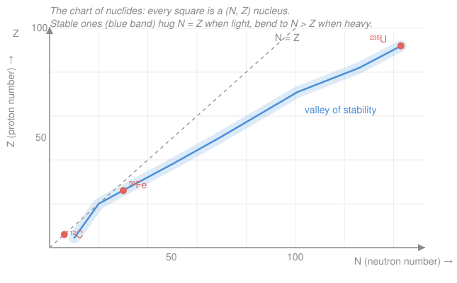

# Nuclear & Particle Physics · Lesson 1.1: Anatomy of the nucleus

> ⏱ ~15 min · Module 1: Nuclear structure & models · Builds on: [`quantum-mechanics` syllabus](../../quantum-mechanics/syllabus.md) · Unlocks: [1.2 Binding energy & the mass defect](01-02-binding-energy-mass-defect.md)

## Why this matters

Everything else in this course — decay half-lives, reaction energies, the whole particle zoo — is bookkeeping on top of one object: a tiny knot of protons and neutrons about $10^{-14}$ m across, ten thousand times smaller than the atom that surrounds it, yet holding essentially all of its mass. Before we can ask *why* a nucleus decays or *how much* energy fission releases, we need to name its parts, quote its size, and locate it on the one map that organizes all $\sim$3300 known nuclides: the **chart of nuclides**. By the end you can point at any square on that chart and say what it is, how big it is, and roughly what it will do next.

## The idea

A nucleus is just **protons and neutrons stuck together** — collectively **nucleons**. Protons carry charge $+e$; neutrons carry none. The count of protons, $Z$, is the whole identity of the element: $Z=6$ *is* carbon, $Z=26$ *is* iron, no exceptions. The chemistry — how many electrons orbit, how the atom bonds — is set by $Z$ alone. The number of neutrons, $N$, you can slide up and down without changing the element; you just get a heavier or lighter version, an **isotope**.

Two surprises make the nucleus worth a whole course. First, it holds together *at all*: cram $92$ protons into a lead-sized ball and their mutual Coulomb repulsion is enormous — something stronger has to win. That something is the **strong nuclear force**, short-ranged (it reaches only a nucleon or two, $\sim 1$–$2$ fm) and **charge-independent** (it pulls on protons and neutrons alike). Second, nuclei are all *the same density*. Add more nucleons and the ball grows just enough to keep the packing constant, like water drops of different sizes — a nucleon only ever touches its immediate neighbors. That "saturation" is our first clue to the strong force's short range, and it's the seed of the liquid-drop model in [1.3](01-03-semi-empirical-mass-formula.md).

## The formal version

**Composition and notation.** A nucleus has $Z$ protons and $N$ neutrons, for a total of

$$A = Z + N \quad(\text{the } \textbf{mass number}),$$

and we write the nuclide as ${}^{A}_{Z}\mathrm{X}$, where $\mathrm{X}$ is the chemical symbol. *In words: top number = total nucleons, bottom number = protons.* Since the symbol already fixes $Z$, the subscript is redundant — ${}^{56}\mathrm{Fe}$ and ${}^{56}_{26}\mathrm{Fe}$ mean the same thing. Three family words you must keep straight:

- **Isotopes** — same $Z$, different $N$ (same element): ${}^{12}_{6}\mathrm{C}$ and ${}^{14}_{6}\mathrm{C}$.
- **Isotones** — same $N$, different $Z$: ${}^{13}_{6}\mathrm{C}$ and ${}^{14}_{7}\mathrm{N}$ (both have $N=7$).
- **Isobars** — same $A$, different split: ${}^{14}_{6}\mathrm{C}$ and ${}^{14}_{7}\mathrm{N}$.

Mnemonic: isoto**P** = same **P**rotons ($Z$); isoto**N** = same **N**eutrons; iso**bar** = same mass ("bar" as in weight).

**Size.** Scattering experiments (which we'll derive in [3.4](03-04-rutherford-form-factors.md)) show the nuclear radius follows a strikingly simple law:

$$\boxed{\,R = r_0\, A^{1/3}, \qquad r_0 \approx 1.2\ \text{fm}\,}\qquad (1\ \text{fm} = 10^{-15}\,\text{m}).$$

*In words: radius grows as the cube root of the nucleon count.* Cube-root is exactly what you'd expect if **volume** is proportional to $A$: since $V = \tfrac{4}{3}\pi R^3 \propto R^3$, having $V \propto A$ forces $R \propto A^{1/3}$. Volume-per-nucleon constant means **constant density** — the saturation we met above. The number density is

$$n = \frac{A}{\frac{4}{3}\pi R^3} = \frac{A}{\frac{4}{3}\pi r_0^3\, A} = \frac{3}{4\pi r_0^3} \approx 0.14\ \text{nucleons/fm}^3,$$

with the $A$ cancelling — the same for a tiny helium nucleus and a huge uranium one. (Real nuclei aren't perfectly uniform; the measured *central* saturation density is a bit higher, $\approx 0.16$ nucleons/fm³.) Turning that into mass density, with each nucleon $\approx 1.66\times10^{-27}$ kg:

$$\rho \approx \frac{1.66\times10^{-27}\ \text{kg}}{7.24\times10^{-45}\ \text{m}^3} \approx 2.3\times10^{17}\ \text{kg/m}^3,$$

about $10^{14}$ times denser than water. A teaspoon of it would weigh a billion tonnes — this is the stuff of neutron stars.

**The two building blocks.** Their rest energies (we quote mass as $mc^2$ in MeV throughout this course):

$$m_p c^2 = 938.3\ \text{MeV}, \qquad m_n c^2 = 939.6\ \text{MeV}.$$

The neutron is *slightly heavier* than the proton (by $1.3$ MeV, about $2.5$ electron masses). That small excess is why a **free** neutron is unstable — it can shed energy by turning into a proton, $n \to p + e^- + \bar{\nu}_e$, the $\beta^-$ decay we'll unpack in [2.3](02-03-beta-decay-neutrino.md).

**Reading the chart of nuclides.** Plot every nuclide as a square on a grid — $N$ across, $Z$ up — and color each by how it decays. The stable nuclides trace a narrow diagonal **valley of stability**: for light nuclei it hugs the $N = Z$ line, but as $A$ grows the valley bends toward **$N > Z$** (extra neutrons help dilute the proton–proton Coulomb repulsion — the "why" waits for [1.4](01-04-stability-valley.md)). To read the chart: find the square at your $(N, Z)$, read off $Z$ (element), $N$, and $A = Z+N$; whether it sits above, on, or below the valley tells you which way it must decay to get back.

## Picture

## Worked examples

**Example 1 (name and measure a nucleus).** Take carbon-12, ${}^{12}_{6}\mathrm{C}$. The subscript gives $Z = 6$ (it's carbon by definition), the superscript $A = 12$, so $N = A - Z = 6$: six protons, six neutrons, sitting right on the $N=Z$ line. Its radius:

$$R = r_0\, A^{1/3} = 1.2 \times 12^{1/3} = 1.2 \times 2.29 \approx 2.7\ \text{fm}.$$

So carbon's nucleus is a ball under $3$ fm in radius holding all $12$ nucleons — yet its density is the universal $2.3\times10^{17}$ kg/m³, identical to uranium's.

**Example 2 (locate it, predict its fate).** Cobalt-60, ${}^{60}_{27}\mathrm{Co}$, the classic medical/industrial $\gamma$ source. Here $Z = 27$, $A = 60$, so $N = 33$. Compare to its stable sibling ${}^{59}_{27}\mathrm{Co}$ ($N=32$): cobalt-60 carries one extra neutron, placing it **above** the valley of stability (too neutron-rich). A nucleus above the valley slides back down by converting a neutron into a proton — $\beta^-$ decay — landing on ${}^{60}_{28}\mathrm{Ni}$, an isobar ($A=60$ unchanged). We just read a decay direction straight off the chart's geometry, before knowing any decay physics. That's the whole point of the map.

## Watch out

- **You might think $A$ is a mass in grams.** It isn't — $A$ is a pure *count* of nucleons, dimensionless. It happens to nearly equal the atomic mass measured in unified atomic mass units (u), because each nucleon is $\approx 1$ u, but that's a numerical coincidence of the unit, not a definition. (The small deviation is the mass defect — the subject of [1.2](01-02-binding-energy-mass-defect.md).)
- **You might think twice the nucleons means twice the radius.** No — radius goes as $A^{1/3}$, so to *double* $R$ you need *eight* times the nucleons. Uranium ($A=238$) has $\sim 20\times$ carbon's nucleons but only $\sim 2.7\times$ its radius. Density stays flat; that's the saturation.
- **You might swap isotone and isobar.** Anchor on the mnemonic: same-$Z$ = isoto**P**e, same-$N$ = isoto**N**e, same-$A$ = iso**bar**. Getting these backwards will scramble every decay-chain diagram later.
- **You might read the axes the wrong way.** The convention here (and in Module 2's decay diagrams) is $N$ horizontal, $Z$ vertical — but some references flip them. Always check which axis is which before quoting a nuclide.

## One-liner

> A nucleus is $Z$ protons plus $N$ neutrons ($A=Z+N$) packed at one universal density into a sphere of radius $R = r_0 A^{1/3}$; $Z$ names the element, and the chart of nuclides maps every $(N,Z)$ to its fate.

## Problems

**P1 (🟢)** Iron-56 is the nuclide with the highest binding energy per nucleon (you'll meet its peak in [1.2](01-02-binding-energy-mass-defect.md)). Its proton number is $Z = 26$. (a) Give its $N$, its $A$, and write it in full ${}^{A}_{Z}\mathrm{X}$ notation. (b) Compute its nuclear radius. (c) How many times denser than water ($10^3$ kg/m³) is its nucleus?

**P2 (🟡)** Classify every same-*something* pair among these four nuclides — which are isotopes, which isobars, which isotones? ${}^{14}_{6}\mathrm{C}$, ${}^{14}_{7}\mathrm{N}$, ${}^{12}_{6}\mathrm{C}$, ${}^{13}_{7}\mathrm{N}$.

**P3 (🔴, optional)** A carbon atom has an atomic radius of about $70$ pm ($1\ \text{pm} = 10^{-12}$ m). Using the nuclear radius from Example 1, estimate the fraction of the atom's *volume* actually occupied by its nucleus. Comment on what this says about ordinary matter.

Solutions

**P1** (a) $A = 56$ (given as iron-56), so $N = A - Z = 56 - 26 = 30$. In full: ${}^{56}_{26}\mathrm{Fe}$ — 26 protons, 30 neutrons.

(b) $R = r_0 A^{1/3} = 1.2 \times 56^{1/3}$. Since $56^{1/3} \approx 3.83$ (because $3.83^3 \approx 56$),

$$R \approx 1.2 \times 3.83 \approx 4.6\ \text{fm}.$$

(c) Nuclear density is the universal value, independent of $A$: $\rho \approx 2.3\times10^{17}$ kg/m³. Compared to water,

$$\frac{\rho_{\text{nuc}}}{\rho_{\text{water}}} = \frac{2.3\times10^{17}}{10^{3}} = 2.3\times10^{14}.$$

*Check.* Units of $R$: fm × (dimensionless) = fm ✓. Order of magnitude: iron sits between carbon ($2.7$ fm) and uranium ($\sim 7.4$ fm), as it should for its intermediate $A$ ✓. The density ratio needed no computation of $R$ at all — saturation means every nucleus is $\sim 10^{14}\times$ water. ✓

**P2** Tabulate $(Z, N, A)$: ${}^{14}_{6}\mathrm{C}=(6,8,14)$; ${}^{14}_{7}\mathrm{N}=(7,7,14)$; ${}^{12}_{6}\mathrm{C}=(6,6,12)$; ${}^{13}_{7}\mathrm{N}=(7,6,13)$.

- **Isotopes** (same $Z$): ${}^{14}_{6}\mathrm{C}$ & ${}^{12}_{6}\mathrm{C}$ (both $Z=6$); ${}^{14}_{7}\mathrm{N}$ & ${}^{13}_{7}\mathrm{N}$ (both $Z=7$).
- **Isobars** (same $A$): ${}^{14}_{6}\mathrm{C}$ & ${}^{14}_{7}\mathrm{N}$ (both $A=14$).
- **Isotones** (same $N$): ${}^{12}_{6}\mathrm{C}$ & ${}^{13}_{7}\mathrm{N}$ (both $N=6$).

*Check.* Every pair is accounted for by exactly one relationship, and no nuclide is its own sibling — consistent with the definitions. As a bonus, ${}^{14}\mathrm{C}\to{}^{14}\mathrm{N}$ (the isobar pair) is precisely the radiocarbon $\beta^-$ decay used for dating. ✓

**P3** Volume ratio scales as the cube of the radius ratio. Convert to common units: atomic radius $r_{\text{atom}} = 70\ \text{pm} = 70\,000\ \text{fm} = 7.0\times10^{4}$ fm; nuclear radius $R \approx 2.7$ fm.

$$\frac{V_{\text{nuc}}}{V_{\text{atom}}} = \left(\frac{R}{r_{\text{atom}}}\right)^3 = \left(\frac{2.7}{7.0\times10^{4}}\right)^3 = (3.9\times10^{-5})^3 \approx 6\times10^{-14}.$$

So the nucleus fills roughly one part in $10^{13}$ of the atom's volume. **Ordinary matter is almost entirely empty space** — the atom is a stadium and the nucleus a marble at the center — yet that marble holds $99.9\%$ of the mass. That emptiness is exactly what let Rutherford's alpha particles punch through gold foil ([3.4](03-04-rutherford-form-factors.md)).

*Check.* Radius ratio $\sim 10^{4}$–$10^{5}$ and volume ratio $\sim 10^{-13}$–$10^{-15}$ are the standard textbook figures for the atom-to-nucleus scale ✓. Both radii are positive lengths in matching units before cubing ✓.

## Connections

- **Backward:** the length and energy scales here come straight from [`quantum-mechanics`](../../quantum-mechanics/syllabus.md). Confining a nucleon to a box a few fm wide forces, via the uncertainty principle, a momentum $p \sim \hbar/\Delta x$ and hence kinetic energies of tens of MeV — the combination $\hbar c \approx 197$ MeV·fm is the exchange rate between femtometers and MeV that we'll use all course. The strong force's short range likewise anticipates the massive force-carrier idea of Module 5.
- **Forward:** [1.2 Binding energy & the mass defect](01-02-binding-energy-mass-defect.md) takes the proton and neutron masses quoted here and asks why a nucleus weighs *less* than its parts; [1.3](01-03-semi-empirical-mass-formula.md) turns the constant-density "liquid drop" picture into a formula; [1.4](01-04-stability-valley.md) explains *why* the valley of stability bends to $N>Z$ and reads decay directions off the chart quantitatively.
- **Sideways:** the astonishing nuclear density ($2.3\times10^{17}$ kg/m³) is the density of a neutron star — one lesson's arithmetic reaches from the femtometer to the astrophysical, a bridge back to gravitation and equation-of-state ideas in [`stat-mech`](../../stat-mech/syllabus.md).
</content>
</invoke>
