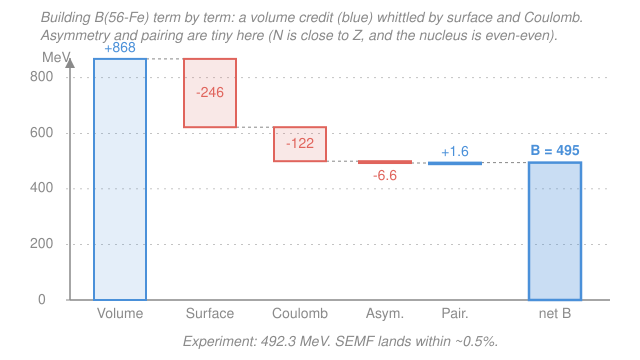

# Nuclear & Particle Physics · Lesson 1.3: The semi-empirical mass formula

> ⏱ ~15 min · Module 1: Nuclear structure & models · Builds on: [1.2 Binding energy & the mass defect](01-02-binding-energy-mass-defect.md), [1.1 Anatomy of the nucleus](01-01-anatomy-of-the-nucleus.md) · Unlocks: [1.4 Stability & the valley](01-04-stability-valley.md)

## Why this matters

[Lesson 1.2](01-02-binding-energy-mass-defect.md) taught you to *measure* binding energy $B$ from a table of masses — but that only tells you what a nucleus binds to *after* someone weighed it. The semi-empirical mass formula (SEMF) does the opposite: it *predicts* $B$ for any $(Z,A)$ you name, from five terms you can compute on the back of an envelope, to about 1% accuracy across the whole chart. That single formula is the workhorse of the next two lessons — it draws the [valley of stability](01-04-stability-valley.md), tells you which way a nucleus will decay, and (in Boss problem 1) picks out the most stable nucleus at a given mass number. It's the first place the crude "nucleus as a drop of liquid" picture pays real dividends.

## The idea

Here is the leap: treat the nucleus as a **tiny drop of incompressible charged liquid**. That sounds absurd for a quantum object, but recall two facts from [1.1](01-01-anatomy-of-the-nucleus.md) — nuclear matter has a *constant density* (radius $R = r_0 A^{1/3}$, so volume $\propto A$), and each nucleon binds only to its *immediate neighbors* (the force saturates). Both are exactly the properties of a liquid drop: constant density, and a fixed energy per bond.

So build up $B$ the way you'd reason about a water droplet, then add the two things a droplet doesn't have — electric charge and quantum statistics:

- **Volume** — every nucleon is glued to its neighbors, and there are $A$ of them, so you get a big binding *credit* proportional to $A$. This is the whole show; the rest are corrections that eat into it.
- **Surface** — nucleons at the surface have fewer neighbors, so they're under-bound. That's an energy *penalty* proportional to the surface area, $\propto A^{2/3}$.
- **Coulomb** — the protons all repel each other. That electrostatic energy is a penalty proportional to (charge)$^2$/(radius).
- **Asymmetry** — a purely quantum penalty: Pauli exclusion makes it costly to have many more neutrons than protons (or vice versa). Nature prefers $N = Z$.
- **Pairing** — nucleons like to couple up spin-up/spin-down. Nuclei with even numbers get a small bonus; odd-odd nuclei get a small penalty.

Add the credit, subtract the four penalties, and you've reconstructed the curve of binding energy.

## The formal version

The **Bethe–Weizsäcker semi-empirical mass formula** for the binding energy of a nucleus with $Z$ protons, $N = A - Z$ neutrons, and mass number $A$:

$$\boxed{\,B(Z,A) = a_V A \;-\; a_S A^{2/3} \;-\; a_C \frac{Z(Z-1)}{A^{1/3}} \;-\; a_A \frac{(A-2Z)^2}{A} \;+\; \delta(Z,A)\,}$$

*In words: total binding = volume credit − surface penalty − Coulomb penalty − asymmetry penalty ± a small pairing correction.* "Semi-empirical" means the *form* of each term comes from physics but the *coefficients* $a_V,\dots$ are fitted to measured masses. Term by term:

**Volume term** $\;a_V A$. Each nucleon contributes a fixed binding energy to its neighbors; with $A$ nucleons and saturation, the total scales with $A$. If this were the *only* term, $B/A$ would be the constant $a_V \approx 15.5$ MeV — the flat "bulk" value the curve tries to reach.

**Surface term** $\;-a_S A^{2/3}$. Surface nucleons are missing neighbors, so the volume term over-counted. The correction is proportional to the surface area $4\pi R^2 \propto (A^{1/3})^2 = A^{2/3}$. *In words: this is a "you counted the skin wrong" refund — largest, relatively, for small nuclei with a lot of surface per nucleon.*

**Coulomb term** $\;-a_C\, Z(Z-1)/A^{1/3}$. The electrostatic energy of a uniformly charged sphere of charge $Q \propto Z$ and radius $R \propto A^{1/3}$ goes like $Q^2/R$. We write $Z(Z-1)$ rather than $Z^2$ because a proton doesn't repel *itself* — there are $\binom{Z}{2}=\tfrac12 Z(Z-1)$ distinct proton pairs. *In words: pack more protons into the same-density ball and their mutual shoving costs binding energy.* This penalty *grows* with size and is what eventually kills heavy nuclei.

**Asymmetry term** $\;-a_A (A-2Z)^2/A$. Note $A - 2Z = N - Z$, the neutron excess. The penalty is *quadratic* in the imbalance and vanishes when $N = Z$. *In words: protons and neutrons each fill their own ladder of quantum levels; piling extra neutrons forces them into higher, less-bound rungs (Pauli exclusion), so lopsided nuclei are penalized.* We re-derive this Pauli-ladder picture properly in [1.5](01-05-shell-model-magic-numbers.md); here just trust that mismatch costs energy.

**Pairing term** $\;\delta(Z,A)$. Nucleons of the same kind pair off (opposite spins) into especially bound configurations:

$$\delta = \begin{cases} +a_P/\sqrt{A} & \text{even }Z,\ \text{even }N \quad(\text{even--even})\\[2pt] 0 & \text{odd }A \quad(\text{odd--even or even--odd})\\[2pt] -a_P/\sqrt{A} & \text{odd }Z,\ \text{odd }N \quad(\text{odd--odd}) \end{cases}$$

*In words: two complete pairs (even–even) get a bonus; one broken pair on each side (odd–odd) gets a penalty; a single unpaired nucleon (odd $A$) is neutral.* This is why even–even nuclei dominate the stable chart and stable odd–odd nuclei are almost nonexistent.

**Coefficient set (this lesson).** I'll use, in MeV:

$$a_V = 15.5,\quad a_S = 16.8,\quad a_C = 0.72,\quad a_A = 23,\quad a_P = 12.$$

(Fitted sets vary by a few percent — you'll see $a_V$ from 15.5 to 15.8, and pairing sometimes written $a_P/A^{3/4}$ with $a_P \approx 34$. Any consistent set gives ~1% accuracy; state yours and stick with it.)

## Picture

## Worked examples

**Example 1 (the showcase — ${}^{56}_{26}\mathrm{Fe}$, term by term).** Iron-56 sits near the peak of the binding curve. Here $Z = 26$, $A = 56$, $N = 30$ — even–even, so $\delta > 0$. Compute $A^{1/3} = 56^{1/3} = 3.826$ and $A^{2/3} = 14.64$.

$$
\begin{aligned}
\text{Volume:} &\quad a_V A = 15.5 \times 56 = 868.0\ \text{MeV}\\
\text{Surface:} &\quad -a_S A^{2/3} = -16.8 \times 14.64 = -245.9\ \text{MeV}\\
\text{Coulomb:} &\quad -a_C \frac{Z(Z-1)}{A^{1/3}} = -0.72 \times \frac{26\cdot 25}{3.826} = -122.3\ \text{MeV}\\
\text{Asymmetry:} &\quad -a_A \frac{(A-2Z)^2}{A} = -23 \times \frac{(56-52)^2}{56} = -23\times\frac{16}{56} = -6.6\ \text{MeV}\\
\text{Pairing:} &\quad +\frac{a_P}{\sqrt A} = +\frac{12}{\sqrt{56}} = +1.6\ \text{MeV}
\end{aligned}
$$

Sum: $B = 868.0 - 245.9 - 122.3 - 6.6 + 1.6 = 494.8\ \text{MeV}$, so $B/A = 494.8/56 = 8.84$ MeV/nucleon.

*Check.* The measured value is $B = 492.3$ MeV ($B/A = 8.79$ MeV/nucleon). The SEMF is high by 2.5 MeV — **0.5%**. Notice the story the numbers tell: the volume credit is enormous, surface and Coulomb do all the real damage, and because iron has $N \approx Z$ and is even–even, the asymmetry and pairing terms are almost negligible. That's the diagram above.

**Example 2 (why you'd care — at fixed $A$, $B$ is a parabola in $Z$).** Freeze the mass number $A$ and ask which $Z$ binds best. Only two terms depend on $Z$: Coulomb (grows with $Z$) and asymmetry (minimized at $Z = A/2$). Dropping the "$-1$" in $Z(Z-1)\approx Z^2$ for a moment,

$$B(Z) = \underbrace{a_V A - a_S A^{2/3} + \delta}_{\text{constant in }Z} \;-\; \frac{a_C}{A^{1/3}}Z^2 \;-\; \frac{a_A}{A}(A-2Z)^2.$$

Both $Z$-dependent terms are *downward* parabolas in $Z$, so $B(Z)$ is a downward parabola: there is a single $Z$ that maximizes binding at each $A$. *In words: for a fixed number of nucleons, nature trades off "keep $N=Z$" (asymmetry) against "don't crowd the protons" (Coulomb) — and the winner is a specific proton number.* The asymmetry term alone wants $Z = A/2$; the Coulomb term pulls the optimum to slightly *fewer* protons, which is exactly why heavy stable nuclei are neutron-rich. Setting $dB/dZ = 0$ gives the most-bound $Z^*$ — that derivation is **Boss problem 1**, and the resulting curve of optima *is* the [valley of stability](01-04-stability-valley.md).

## Watch out

- **You might write $Z^2$ in the Coulomb term.** Use $Z(Z-1)$: a proton feels the other $Z-1$ protons, not itself. It barely matters for uranium but it's real for light nuclei (and it's the honest count of pairs).
- **You might think pairing is always a bonus.** Its *sign* flips: $+$ for even–even, $0$ for odd-$A$, $-$ for odd–odd. Getting the sign wrong is the most common SEMF error — always classify $Z$ and $N$ parity first.
- **You might expect SEMF to nail every nucleus.** It's a *smooth* fit — it knows nothing about closed shells. At the magic numbers (2, 8, 20, 28, 50, 82, 126) real nuclei are noticeably *more* bound than the formula predicts; those bumps are the SEMF's failure and the motivation for the [shell model in 1.5](01-05-shell-model-magic-numbers.md).
- **You might confuse binding energy with mass.** More binding means *less* mass (mass defect, [1.2](01-02-binding-energy-mass-defect.md)). Maximizing $B$ at fixed $A$ is the same as minimizing the atomic mass — the two statements are identical, which is why this is called a *mass* formula.

## One-liner

> Treat the nucleus as a charged liquid drop and its binding is one credit minus four penalties — volume $-$ surface $-$ Coulomb $-$ asymmetry $\pm$ pairing — good to ~1% everywhere except the magic numbers.

## Problems

**P1 (🟢)** Use the SEMF (coefficients above) to estimate the binding energy of ${}^{120}_{50}\mathrm{Sn}$ (tin-120; $Z=50$, $N=70$, even–even). Give $B$ and $B/A$, and compare to the measured $B/A \approx 8.50$ MeV/nucleon. Which single term is the largest *penalty*?

**P2 (🟡)** The curve of $B/A$ rises to a peak near iron and then declines for heavy nuclei. Divide each SEMF term by $A$ to get its per-nucleon contribution, and use $Z \approx A/2$ to find how each scales with $A$. Which term is responsible for the *decline* at high $A$, and which for the *rise* at low $A$?

**P3 (🔴, optional)** (a) State the pairing term $\delta$ (sign and size, using $a_P = 12$ MeV) for ${}^{16}_{8}\mathrm{O}$, ${}^{13}_{6}\mathrm{C}$, and ${}^{14}_{7}\mathrm{N}$. (b) There are only *four* stable odd–odd nuclei in all of nature (${}^{2}\mathrm{H}, {}^{6}\mathrm{Li}, {}^{10}\mathrm{B}, {}^{14}\mathrm{N}$). Using the pairing term, explain in one or two sentences why odd–odd nuclei are so rarely stable.

Solutions

**P1** With $A = 120$: $A^{1/3} = 4.932$, $A^{2/3} = 24.33$, and $A - 2Z = 120 - 100 = 20$.

$$
\begin{aligned}
\text{Volume:} &\quad 15.5 \times 120 = 1860.0\ \text{MeV}\\
\text{Surface:} &\quad -16.8 \times 24.33 = -408.7\ \text{MeV}\\
\text{Coulomb:} &\quad -0.72 \times \frac{50\cdot 49}{4.932} = -0.72\times\frac{2450}{4.932} = -357.6\ \text{MeV}\\
\text{Asymmetry:} &\quad -23 \times \frac{20^2}{120} = -23\times\frac{400}{120} = -76.7\ \text{MeV}\\
\text{Pairing:} &\quad +\frac{12}{\sqrt{120}} = +1.1\ \text{MeV}
\end{aligned}
$$

Sum: $B = 1860.0 - 408.7 - 357.6 - 76.7 + 1.1 = 1018.1\ \text{MeV}$, so $B/A = 1018.1/120 = 8.48$ MeV/nucleon.

The largest penalty is **surface** ($-408.7$ MeV), just edging out Coulomb ($-357.6$).

*Check.* Measured $B/A \approx 8.50$, so we're within $0.02$ MeV/nucleon — about **0.2%**. Order-of-magnitude sanity: everything lands on the ~8.8 MeV/nucleon scale of the binding curve. ✓ (Note the asymmetry penalty is now $\sim 12\times$ bigger than for iron — tin is neutron-rich, $N - Z = 20$.)

**P2** Divide by $A$ and substitute $Z \approx A/2$ (so $Z^2 \approx A^2/4$, and $A - 2Z \approx 0$ only *on the $N=Z$ line*; off it the excess grows roughly $\propto A$ for the valley, but the point here is the trend of the *shape*):

$$
\frac{B}{A} \approx a_V \;-\; \underbrace{a_S A^{-1/3}}_{\text{surface}} \;-\; \underbrace{a_C\,\frac{Z(Z-1)}{A^{4/3}}}_{\text{Coulomb}} \;-\; \dots
$$

- **Surface per nucleon:** $a_S A^{-1/3}$ — *decreases* as $A$ grows. Huge for light nuclei (lots of surface per nucleon), so it's what holds $B/A$ *down at low $A$*; as $A$ rises this penalty fades and $B/A$ **rises**.
- **Coulomb per nucleon:** with $Z \approx A/2$, $\ \dfrac{Z^2}{A\cdot A^{1/3}} \approx \dfrac{A^2/4}{A^{4/3}} = \tfrac14 A^{2/3}$ — it *grows* with $A$. So the Coulomb penalty per nucleon climbs steadily and is what drives $B/A$ **down at high $A$**.

The rising surface refund and the growing Coulomb cost cross over near $A \approx 56$ — that competition *is* the peak of the binding curve at iron.

*Check.* Volume per nucleon is constant ($a_V$), so it can't create a peak; a maximum requires one term that helps as $A$ grows (surface, $\propto A^{-1/3}$) and one that hurts (Coulomb, $\propto A^{2/3}$). Two opposing power laws → a single interior maximum. ✓

**P3** (a) Classify parity first:
- ${}^{16}_{8}\mathrm{O}$: $Z=8$ even, $N=8$ even → even–even → $\delta = +\dfrac{12}{\sqrt{16}} = +\dfrac{12}{4} = +3.0$ MeV.
- ${}^{13}_{6}\mathrm{C}$: $A=13$ odd (odd $N=7$) → $\delta = 0$.
- ${}^{14}_{7}\mathrm{N}$: $Z=7$ odd, $N=7$ odd → odd–odd → $\delta = -\dfrac{12}{\sqrt{14}} = -3.2$ MeV.

(b) An odd–odd nucleus carries the pairing *penalty* ($-a_P/\sqrt A$), so it is under-bound relative to its even–even neighbor isobars. Converting one of its odd nucleons into the other type (a $\beta$ decay, $A$ fixed) lands on an even–even nucleus, which gets the pairing *bonus* — a jump of $\sim 2a_P/\sqrt A$ in binding. That downhill step is almost always energetically available, so nearly every odd–odd nucleus $\beta$-decays away; only a handful of very light ones (where no more-bound isobar exists) survive.

*Check.* Sign and magnitude sanity: $\delta$ shrinks with $A$ (from 3 MeV at $A=16$ toward $<1$ MeV for heavy nuclei), matching the $1/\sqrt A$ law, and the even–even/odd–odd gap of $\sim 6$ MeV at $A\approx 14$ is exactly the scale that makes odd–odd nuclei unstable. ✓

## Flashback

**From Lesson 1.2 (Binding energy & the mass defect):** Compute the binding energy per nucleon of the alpha particle ${}^{4}_{2}\mathrm{He}$ directly from atomic masses. Use $M({}^{1}\mathrm{H}) = 1.007825\ \text{u}$, $m_n = 1.008665\ \text{u}$, $M({}^{4}\mathrm{He}) = 4.002602\ \text{u}$, and $1\ \text{u} = 931.494\ \text{MeV}/c^2$. (Using atomic masses lets the electron masses cancel, since ${}^{4}\mathrm{He}$ has 2 electrons and so do two ${}^{1}\mathrm{H}$ atoms.)

Solution

The mass defect is (2 hydrogens + 2 neutrons) minus the helium atom:

$$\Delta m = 2M({}^{1}\mathrm{H}) + 2m_n - M({}^{4}\mathrm{He}) = 2(1.007825) + 2(1.008665) - 4.002602 = 0.030378\ \text{u}.$$

$$B = \Delta m\, c^2 = 0.030378 \times 931.494 = 28.3\ \text{MeV}, \qquad B/A = \frac{28.3}{4} = 7.07\ \text{MeV/nucleon}.$$

*Check.* This is the famous $\sim 28$ MeV binding of the alpha particle — anomalously tight for such a light nucleus (a doubly-magic, even–even sweet spot the *smooth* SEMF would actually *underestimate*). It sits just below the ~8.8 MeV/nucleon plateau, consistent with the low-$A$ part of the binding curve. ✓

## Connections

- **Backward:** the two liquid-drop assumptions come straight from [1.1](01-01-anatomy-of-the-nucleus.md) — constant density ($R = r_0 A^{1/3}$, volume $\propto A$) and force saturation — and the whole formula is a *model* for the $B$ you learned to measure in [1.2](01-02-binding-energy-mass-defect.md).
- **Forward:** freezing $A$ and reading off the best $Z$ (Example 2) builds the isobaric mass parabolas of [1.4 Stability & the valley](01-04-stability-valley.md) and is set up formally in **Boss problem 1**; the SEMF's *failures* at the magic numbers motivate the [shell model in 1.5](01-05-shell-model-magic-numbers.md). The volume-vs-Coulomb competition also underlies fission energetics in [2.6](02-06-fission-fusion.md).
- **Sideways:** the asymmetry term is a Pauli-exclusion cost — the same "fermions fill separate ladders" bookkeeping you met for electrons in [`quantum-mechanics`](../../quantum-mechanics/syllabus.md); we make the ladder picture explicit in 1.5. The Coulomb term is just the electrostatic self-energy of a charged sphere from classical E&M.
