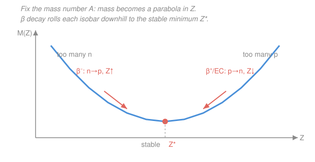

# Nuclear & Particle Physics · Lesson 1.4: Stability & the valley

> ⏱ ~15 min · Module 1: Nuclear structure & models · Builds on: [1.3 The semi-empirical mass formula](01-03-semi-empirical-mass-formula.md) · Unlocks: [1.5 The shell model & magic numbers](01-05-shell-model-magic-numbers.md)

## Why this matters

The SEMF from [1.3](01-03-semi-empirical-mass-formula.md) does more than estimate binding energies — it tells you *which nuclei survive and which ones decay, and in which direction*. Handed any unstable nucleus, you should be able to say "this one turns a neutron into a proton" or "this one grabs an electron" before knowing any of the weak-force machinery (that's [2.3](02-03-beta-decay-neutrino.md)). The whole chart of nuclides organizes itself around one curved line — the **valley of stability** — and every radioactive nucleus is just something perched on a hillside, waiting to roll in.

## The idea

Slice the nuclear landscape at a **fixed mass number** $A$ (a family of **isobars** — same total nucleon count, different proton/neutron split). Now plot each isobar's mass against its proton number $Z$. Two SEMF terms fight over $Z$: the **Coulomb** term wants *few* protons (protons repel), and the **asymmetry** term wants $N = Z$ (a lopsided neutron/proton count costs energy). Both penalties grow quadratically as you move away from their preferred $Z$, so their sum is a **parabola** — a valley cross-section, with the lightest (most bound, most stable) isobar sitting at the bottom.

A nucleus off to one side is literally uphill. It rolls down the only way it can at fixed $A$: **beta decay**, which swaps a proton for a neutron or vice-versa, stepping $Z$ by one without changing $A$. Too many neutrons (left wall, low $Z$)? Convert one to a proton — **$\beta^-$ decay**, $Z$ goes *up*. Too many protons (right wall, high $Z$)? Convert one to a neutron — **$\beta^+$ decay** or **electron capture**, $Z$ goes *down*. The side of the parabola you're on dictates the direction; the mechanism waits for [2.3](02-03-beta-decay-neutrino.md).

One wrinkle: the **pairing** term makes even numbers of like nucleons extra-bound. For odd $A$ it's a wash and you get one clean parabola. For even $A$ it splits the isobars into **two** stacked parabolas — even-even (lower, more bound) and odd-odd (higher) — which is why some even-$A$ mass numbers have two or even three stable isobars.

## The formal version

Take the SEMF for the binding energy of a nucleus with $Z$ protons and $N = A - Z$ neutrons ([1.3](01-03-semi-empirical-mass-formula.md)):

$$B(Z,A) = a_V A - a_S A^{2/3} - a_C \frac{Z(Z-1)}{A^{1/3}} - a_A \frac{(A-2Z)^2}{A} - \delta,$$

with (Krane values) $a_C \approx 0.72\ \text{MeV}$ the Coulomb coefficient and $a_A \approx 23\ \text{MeV}$ the asymmetry coefficient; $\delta$ is the pairing term. The atomic mass is $M(Z,A)c^2 = Z\,m_{\mathrm H}c^2 + N\,m_n c^2 - B(Z,A)$. *In words: the more bound a nucleus (larger $B$), the lighter it is, so the most stable isobar is both the maximum of $B$ and the minimum of $M$ at fixed $A$.*

**Find the bottom.** At fixed $A$, only the Coulomb and asymmetry terms depend on $Z$; the volume, surface, and pairing terms are constants of the slice. Set $\partial B/\partial Z = 0$ (using $Z(Z-1)\approx Z^2$):

$$\frac{\partial B}{\partial Z} = -\frac{2a_C Z}{A^{1/3}} + \frac{4a_A (A-2Z)}{A} = 0 \quad\Longrightarrow\quad \boxed{\,Z^* = \frac{A/2}{1 + \dfrac{a_C}{4a_A}A^{2/3}}\,}$$

*In words: the most stable proton number for a given mass number.* This is **Boss problem 1**. Read the formula two ways:

- **Light nuclei** ($A$ small): $A^{2/3}$ is small, the denominator $\to 1$, so $Z^* \to A/2$, i.e. $N = Z$. The asymmetry term wins; nature wants a balanced count.
- **Heavy nuclei** ($A$ large): $A^{2/3}$ is large, the denominator grows, so $Z^* < A/2$, i.e. **$N > Z$**. The Coulomb term — which grows faster ($\sim Z^2$ over the whole volume) than asymmetry — forces a *neutron surplus* to dilute the proton repulsion. Lead needs 44 extra neutrons.

**The valley of stability.** Plot every stable nuclide on the $N$–$Z$ chart. They trace a narrow band — the valley floor $Z^*(A)$ — that starts on the $N = Z$ diagonal for light nuclei and **curves toward $N > Z$** as $A$ grows, exactly as $Z^*$ predicts. *In words: the stable nuclei form a curving line, and radioactive nuclei are the hillsides on either side of it.*

**Drip lines.** Move far enough off the valley and adding one more nucleon releases *zero* binding: the **separation energy** hits zero, $S_n = 0$ (neutron drip line) or $S_p = 0$ (proton drip line), where $S_n = B(Z,A) - B(Z,A-1)$. Beyond those lines the last nucleon is unbound and simply **drips off** — no beta decay needed. The drip lines are the hard edges of the chart; the valley is its floor.

## Picture

## Worked examples

**Example 1 (find the stable isobar).** Take $A = 133$ (odd, so one clean parabola). With $a_C/4a_A = 0.72/(4\times 23) = 7.83\times 10^{-3}$ and $A^{2/3} = 133^{2/3} \approx 26.0$:

$$Z^* = \frac{133/2}{1 + (7.83\times 10^{-3})(26.0)} = \frac{66.5}{1.204} \approx 55.2.$$

Round to the nearest integer: $Z^* = 55$, **cesium**. Indeed ${}^{133}_{55}\mathrm{Cs}$ is the stable isobar at $A = 133$. Note $Z^* = 55.2 < A/2 = 66.5$ — the neutron surplus (here $N = 78$ vs $Z = 55$) is the Coulomb term at work.

**Example 2 (name the decay of an off-valley nucleus).** Consider ${}^{133}_{54}\mathrm{Xe}$ ($Z = 54$, $N = 79$). It sits at $Z = 54$, one step *left* of the minimum $Z^* = 55$ — the **neutron-rich** wall. To roll downhill it must raise $Z$ by one, converting a neutron into a proton:

$$\beta^-:\quad {}^{133}_{54}\mathrm{Xe} \;\to\; {}^{133}_{55}\mathrm{Cs} + e^- + \bar\nu_e.$$

And it does: ${}^{133}\mathrm{Xe}$ is a real $\beta^-$ emitter with a 5.2-day half-life. Had we instead started at ${}^{133}_{56}\mathrm{Ba}$ ($Z = 56$, one step *right* of $Z^*$, proton-rich), the roll would go the other way — $Z$ *down* by $\beta^+$ or electron capture. The parabola told us the direction without any weak-interaction detail.

**The heavy end.** Push $A$ up and the valley floor climbs, but Coulomb repulsion eventually makes *every* isobar unstable to a bigger move. The heaviest truly stable nuclide is ${}^{208}_{82}\mathrm{Pb}$ (and near-stable ${}^{209}_{83}\mathrm{Bi}$); beyond lead, beta decay no longer reaches a stable floor and nuclei shed whole chunks — **$\alpha$ decay** ([2.2](02-02-alpha-decay-tunneling.md)) or **fission** ([2.6](02-06-fission-fusion.md)) — instead. **Even-even** nuclei, doubly favored by pairing, dominate the stable list ($\sim$160 of them) and include every one of these heavy anchors.

## Watch out

- **You might think $Z^* = A/2$ always.** Only for light nuclei. The Coulomb term drags $Z^*$ below $A/2$ as $A$ grows, so heavy stable nuclei have $N > Z$ — the neutron surplus is a feature, not a defect.
- **You might read "too many neutrons" as "big $N$" absolutely.** It's relative to $Z^*$ at *that* $A$. ${}^{208}\mathrm{Pb}$ has 126 neutrons and is perfectly stable; a light nucleus with 126 neutrons would be far past the drip line. What matters is which *side of the parabola* you're on.
- **You might expect one stable isobar per $A$.** True for odd $A$ (single parabola). For even $A$ the pairing split gives two parabolas, so there are often two — sometimes three — stable even-even isobars, and odd-odd nuclei are almost all unstable (they sit on the upper parabola with a lower even-even neighbor on each side).

## One-liner

> Fix $A$ and mass is a parabola in $Z$; beta decay rolls every isobar to the bottom at $Z^* = (A/2)/(1 + \tfrac{a_C}{4a_A}A^{2/3})$, which bends the valley of stability toward $N > Z$ as nuclei get heavier.

## Problems

**P1 (🟢)** Using $Z^* = (A/2)/(1 + \tfrac{a_C}{4a_A}A^{2/3})$ with $a_C = 0.72$ MeV and $a_A = 23$ MeV, find $Z^*$ for $A = 127$ and identify the stable isobar. Then say which way ${}^{127}_{51}\mathrm{Sb}$ (antimony) must decay to reach it. *(Boss problem 1 flavor.)*

**P2 (🟡)** ${}^{22}_{11}\mathrm{Na}$ has $A = 22$, $Z = 11$, $N = 11$. Compute $Z^*$ for $A = 22$. Is sodium-22 neutron-rich or proton-rich relative to $Z^*$, and does it decay by $\beta^-$ or by $\beta^+$/electron capture? (Sanity: $A = 22$ is light, so expect $Z^* \approx A/2$.)

**P3 (🔴, optional)** Explain quantitatively why the heaviest stable nuclei must have $N > Z$. Specifically: in $Z^* = (A/2)/(1 + \tfrac{a_C}{4a_A}A^{2/3})$, why does the *denominator* grow with $A$, and which SEMF term is responsible? Then estimate $N/Z$ at $Z^*$ for $A = 208$.

Solutions

**P1** $a_C/4a_A = 0.72/92 = 7.83\times10^{-3}$; $A^{2/3} = 127^{2/3} \approx 25.3$. Then

$$Z^* = \frac{63.5}{1 + (7.83\times10^{-3})(25.3)} = \frac{63.5}{1.198} \approx 53.0.$$

So $Z^* = 53$, **iodine**: ${}^{127}_{53}\mathrm{I}$ is the stable isobar (the only stable iodine isotope). Antimony ${}^{127}_{51}\mathrm{Sb}$ sits at $Z = 51 < 53$ — the neutron-rich side — so it must **raise $Z$ by $\beta^-$ decay** (each step converts a neutron to a proton), climbing $51 \to 52 \to 53$ to reach iodine.

*Check.* $Z^* = 53.0$ rounds cleanly and matches the observed stable nuclide — the SEMF nails this one. Order of magnitude: $Z^*/A = 53/127 \approx 0.42 < 0.5$, the expected sub-half for a mid-heavy nucleus. ✓

**P2** $A^{2/3} = 22^{2/3} \approx 7.85$, so

$$Z^* = \frac{11}{1 + (7.83\times10^{-3})(7.85)} = \frac{11}{1.0615} \approx 10.4.$$

Round to $Z^* = 10$ (neon). Sodium-22 has $Z = 11 > Z^* \approx 10$, so it is **proton-rich** — the right wall of the parabola — and must **lower $Z$**: it decays by $\beta^+$ / electron capture, $Z: 11 \to 10$. (Real: ${}^{22}\mathrm{Na}\to{}^{22}\mathrm{Ne}$ by $\beta^+$/EC, a classic positron source.)

*Check.* As predicted for light $A$, $Z^* = 10.4 \approx A/2 = 11$ — the asymmetry term dominates and pushes toward $N = Z$. The offset from $A/2$ is tiny ($0.6$), consistent with the small $A^{2/3}$. ✓

**P3** The denominator is $1 + \tfrac{a_C}{4a_A}A^{2/3}$. The $A^{2/3}$-dependent piece comes from the ratio of the **Coulomb** term ($\sim a_C Z^2/A^{1/3}$, whose $Z$-derivative scales as $1/A^{1/3}$) to the **asymmetry** term ($\sim a_A(A-2Z)^2/A$, whose $Z$-derivative scales as $1/A$). The ratio of those slopes goes as $(1/A^{1/3})/(1/A) = A^{2/3}$, so Coulomb's relative pull on $Z^*$ **grows with $A$**. As it grows, the denominator exceeds 1 and drives $Z^* < A/2$, i.e. $N > Z$.

For $A = 208$: $A^{2/3} = 208^{2/3} \approx 35.1$, so $Z^* = 104/(1 + (7.83\times10^{-3})(35.1)) = 104/1.275 \approx 81.6$, round to $82$ (lead — correct!). Then $N = 208 - 82 = 126$ and $N/Z = 126/82 \approx 1.54$.

*Check.* $Z^* \approx 82 = $ observed ${}^{208}\mathrm{Pb}$, and $N/Z \approx 1.54$ is well above 1 — the strong neutron surplus of heavy stable nuclei. Physically: more nucleons means more mutually-repelling proton pairs (Coulomb energy $\sim Z^2$), so the balance point shifts to dilute them with neutrons. ✓

## Flashback

**From Lesson 1.3 (The semi-empirical mass formula):** Which single SEMF term is responsible for the fact that, at fixed $A$, the binding energy is a *downward*-opening parabola in $Z$ (equivalently, mass is upward-opening)? Name the two terms that supply the $Z$-dependence and state, in one sentence each, what each one "wants" $Z$ to be. *(Fresh conceptual variant — no arithmetic.)*

Solution

Two terms carry all the $Z$-dependence at fixed $A$: the **Coulomb term** $-a_C Z(Z-1)/A^{1/3}$ and the **asymmetry term** $-a_A(A-2Z)^2/A$. Both are negative (they *reduce* binding) and both are quadratic in $Z$, so their sum makes $B(Z)$ a downward-opening parabola and $M(Z)$ an upward-opening one. The Coulomb term "wants" $Z$ as *small* as possible (fewer protons, less repulsion); the asymmetry term "wants" $Z = A/2$ so that $N = Z$ (a balanced count). Their tug-of-war fixes the minimum at $Z^*$.

*Check.* No single term is responsible — it's the *competition* of two. The volume, surface, and (for odd $A$) pairing terms don't depend on $Z$ at fixed $A$, so they only shift the parabola vertically, not its shape or vertex. ✓

## Connections

- **Backward:** this is the SEMF of [1.3](01-03-semi-empirical-mass-formula.md) read as a function of $Z$ at fixed $A$ — the same five terms, now sorted into "constant on the slice" (volume, surface, pairing) versus "shapes the parabola" (Coulomb, asymmetry). $Z^*$ is just $\partial B/\partial Z = 0$.
- **Forward:** the *direction* of the roll is settled here, but the *mechanism* — how the weak force turns a neutron into a proton, and why a neutrino must come out — is [2.3 Beta decay & the neutrino](02-03-beta-decay-neutrino.md). The heavy-end failure of beta decay to reach a stable floor is what motivates [2.2 Alpha decay](02-02-alpha-decay-tunneling.md) and [2.6 Fission & fusion](02-06-fission-fusion.md). The magic numbers of [1.5](01-05-shell-model-magic-numbers.md) add local extra-stability the liquid drop can't see, sharpening the valley near closed shells.
- **Sideways:** finding $Z^*$ by setting a derivative to zero at fixed $A$ is a constrained optimization — the same "extremize subject to a constraint" move as a Lagrange multiplier in [`calc-refresher`](../../calc-refresher/syllabus.md); here the constraint ($A$ fixed) is simple enough to substitute directly. The parabola-near-a-minimum idea is the universal harmonic well of [`mechanics-refresher` 3.1](../../mechanics-refresher/lessons/03-01-simple-harmonic-motion.md), transplanted from position to proton number.
