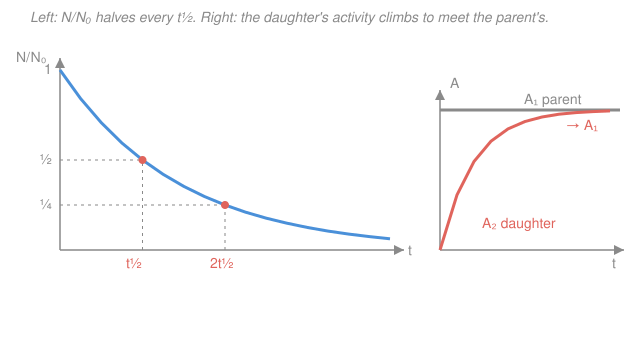

# Nuclear & Particle Physics · Lesson 2.1: The decay law & chains

> ⏱ ~15 min · Module 2: Radioactivity & nuclear reactions · Builds on: [1.5 The shell model & magic numbers](01-05-shell-model-magic-numbers.md) · Unlocks: [2.2 Alpha decay & tunneling](02-02-alpha-decay-tunneling.md)

## Why this matters

Module 1 told you *which* nuclei are unstable — off the valley floor, past the drip lines. This lesson tells you *how fast* they fall apart, and the answer is astonishingly simple: an individual radioactive nucleus has no memory, no age, no plan. It just carries a fixed probability of decaying in the next second. That single fact — a constant hazard rate — forces the entire population onto one curve, the exponential, and hands you carbon dating, the activity of a medical source, and the "cows" that supply hospitals their imaging isotope. It's also your first physical instance of the first-order ODE from [`ode-refresher`](../../ode-refresher/syllabus.md), wearing a lab coat.

## The idea

Picture a stadium of nuclei. Each second, a fair (but heavily loaded) coin is flipped for every nucleus: heads, it decays; tails, it survives unchanged — *and its odds next second are exactly the same*. A nucleus that has waited a billion years is no more "due" than a fresh one. This memorylessness is the whole story.

If a fixed *fraction* leaves every second, the number leaving is proportional to how many are left. Lots of nuclei → lots of decays per second; few nuclei → few decays. So the population falls fast at first, then ever more slowly, tracing the exponential. The natural clock isn't "how long until they're all gone" (never, in principle) but **how long until half are gone** — the half-life. And what your Geiger counter actually hears is not the number of nuclei but the *rate* of decays: the **activity**. Since the rate is proportional to the population, the activity decays on the very same exponential.

## The formal version

**The decay law.** Let $N(t)$ be the number of undecayed nuclei and $\lambda$ the **decay constant** — the probability per unit time that any one nucleus decays (units $\text{s}^{-1}$). "Constant fraction per time" is the statement

$$\frac{dN}{dt} = -\lambda N.$$

*In words: the population shrinks at a rate proportional to itself.* This is a first-order linear ODE (see [`ode-refresher`](../../ode-refresher/lessons/01-02-separable-and-linear-first-order.md)); separating and integrating from $N_0 \equiv N(0)$ gives

$$\boxed{\,N(t) = N_0\, e^{-\lambda t}\,}.$$

**Half-life vs mean life.** Two timescales summarize $\lambda$:

$$t_{1/2} = \frac{\ln 2}{\lambda}, \qquad \tau = \frac{1}{\lambda}, \qquad t_{1/2} = \tau \ln 2 \approx 0.693\,\tau.$$

*In words: the half-life $t_{1/2}$ is the time for the population to halve; the mean life $\tau$ is the average lifetime of a single nucleus, always the longer of the two.* Set $N = N_0/2$ in the decay law to see $e^{-\lambda t_{1/2}} = \tfrac12 \Rightarrow \lambda t_{1/2} = \ln 2$. After $n$ half-lives the fraction left is simply $N/N_0 = (1/2)^{n}$.

**Activity.** What a detector measures is the decays per second,

$$A(t) = -\frac{dN}{dt} = \lambda N(t) = A_0\, e^{-\lambda t}, \qquad A_0 = \lambda N_0.$$

*In words: activity is the count rate, and it rides the same exponential as $N$.* Units: the **becquerel**, $1\ \text{Bq} = 1\ \text{decay/s}$, and the older **curie**, $1\ \text{Ci} = 3.7\times10^{10}\ \text{Bq}$ (roughly the activity of a gram of radium).

**Decay chains (Bateman).** Often the daughter is itself unstable: parent $\xrightarrow{\lambda_1}$ daughter $\xrightarrow{\lambda_2} \cdots$. The daughter is fed by the parent and drained by its own decay:

$$\frac{dN_2}{dt} = \underbrace{\lambda_1 N_1}_{\text{fed}} - \underbrace{\lambda_2 N_2}_{\text{drained}}.$$

With $N_1(t) = N_{1,0}e^{-\lambda_1 t}$ and $N_2(0)=0$, this linear ODE has the **Bateman solution**

$$N_2(t) = N_{1,0}\,\frac{\lambda_1}{\lambda_2 - \lambda_1}\left(e^{-\lambda_1 t} - e^{-\lambda_2 t}\right).$$

*In words: the daughter builds up as the fast term dies away, then decays away governed by whichever parent/daughter is slower.*

**Equilibria.** Compare the two rates:

- **Secular equilibrium** ($\lambda_1 \ll \lambda_2$, i.e. parent *far* longer-lived — e.g. ${}^{226}_{88}\mathrm{Ra}$, $t_{1/2}=1600\ \text{yr}$, feeding ${}^{222}_{86}\mathrm{Rn}$, $t_{1/2}=3.82\ \text{d}$). After many daughter half-lives the daughter's activity rises to *equal* the parent's: $A_2 \to A_1$, i.e. $\lambda_2 N_2 = \lambda_1 N_1$. *In words: the daughter decays exactly as fast as it's made.*
- **Transient equilibrium** ($\lambda_1 < \lambda_2$ but comparable). The daughter activity climbs, slightly *overshoots* the parent's, then tracks it — thereafter the whole chain decays with the *parent's* slow rate $\lambda_1$.

## Picture

## Worked examples

**Example 1 (mechanical — convert and decay).** Iodine-131, a thyroid tracer, has $t_{1/2} = 8.0\ \text{d}$. Find $\lambda$, the mean life $\tau$, and the fraction remaining after 24 days.

$$\lambda = \frac{\ln 2}{t_{1/2}} = \frac{0.693}{8.0\ \text{d}} = 0.0866\ \text{d}^{-1}, \qquad \tau = \frac1\lambda = \frac{8.0}{0.693} = 11.5\ \text{d}.$$

Since $24\ \text{d} = 3\,t_{1/2}$, the fraction left is $(1/2)^3 = 1/8 = 0.125$. The activity drops by the identical factor — a 40 mCi source is down to 5 mCi. No integration needed once you count half-lives.

**Example 2 (why you'd care — secular equilibrium).** A sealed ${}^{226}\mathrm{Ra}$ source ($t_{1/2}=1600\ \text{yr}$) continuously produces radon gas, ${}^{222}\mathrm{Rn}$ ($t_{1/2}=3.82\ \text{d}$). Because the parent barely depletes over any human timescale, $A_1$ is essentially constant, and after a few weeks (several radon half-lives) the $e^{-\lambda_2 t}$ term in the Bateman solution has died, leaving

$$\lambda_2 N_2 \to \lambda_1 N_1 \quad\Longrightarrow\quad A_2 \to A_1.$$

The trapped radon becomes exactly as active as the radium — that's the flat-line-meets-rising-curve in the figure. Note how *few* radon atoms this takes: $N_2/N_1 = \lambda_1/\lambda_2 = t_{1/2,2}/t_{1/2,1} = 3.82\ \text{d} / (1600\times365\ \text{d}) \approx 6.5\times10^{-6}$. A microscopic pinch of daughter carries the same decay rate as the whole parent stockpile, because each daughter nucleus is so much twitchier.

## Watch out

- **You might think a nucleus "ages" toward decay.** It doesn't — the hazard rate $\lambda$ is constant, so survival is memoryless. "Half-life" describes a *population*, not a countdown timer inside any one nucleus.
- **You might set $\tau = t_{1/2}$.** They differ by $\ln 2$: $\tau = t_{1/2}/0.693 \approx 1.44\,t_{1/2}$, always longer. The mean life is where $N$ falls to $1/e$ ($\approx 37\%$), not to half.
- **You might read secular equilibrium as "$N_2 = N_1$".** It's the *activities* that equalize, $A_2=A_1$; the *numbers* are lopsided by $\lambda_1/\lambda_2$, which can be a millionth. Equilibrium means equal decay rates, not equal populations.

## One-liner

> A constant per-nucleus decay chance $\lambda$ forces $N(t)=N_0e^{-\lambda t}$; the count rate $A=\lambda N$ rides the same curve, and in a chain the daughter climbs until its activity matches the parent it's fed by.

## Problems

**P1 (🟢)** A ${}^{60}\mathrm{Co}$ source ($t_{1/2} = 5.27\ \text{yr}$) reads $A_0 = 3.7\times10^{10}\ \text{Bq}$ (1 Ci) today. (a) Find $\lambda$ in $\text{s}^{-1}$. (b) What is its activity after 10.5 years? (Use $1\ \text{yr} \approx 3.16\times10^7\ \text{s}$.)

**P2 (🟡)** A charcoal fragment from a hearth has a ${}^{14}\mathrm{C}$ activity per gram of carbon equal to $0.40$ of that in living wood. With $t_{1/2}({}^{14}\mathrm{C}) = 5730\ \text{yr}$, estimate the age of the fire. *(Living matter keeps a fixed ${}^{14}\mathrm{C}$ level from the atmosphere; once dead, no fresh ${}^{14}\mathrm{C}$ comes in and it decays.)*

**P3 (🔴, optional)** A parent with $t_{1/2}=15\ \text{h}$ feeds a daughter with $t_{1/2}=2.5\ \text{h}$ (daughter starts at zero). (a) Is this secular or transient equilibrium? (b) Find the time $t_\text{max}$ at which the daughter's activity peaks. *(Hint: set $dN_2/dt = 0$ in the Bateman solution.)*

Solutions

**P1** (a) In seconds, $t_{1/2} = 5.27 \times 3.16\times10^7 = 1.665\times10^{8}\ \text{s}$, so

$$\lambda = \frac{0.693}{1.665\times10^{8}\ \text{s}} = 4.16\times10^{-9}\ \text{s}^{-1}.$$

(b) $10.5\ \text{yr} \approx 2\,t_{1/2}$, so $A = A_0 (1/2)^2 = 3.7\times10^{10}/4 = 9.3\times10^{9}\ \text{Bq}$.

*Check.* $\lambda$ has units $\text{s}^{-1}$ ✓; two half-lives should quarter the source, and $9.3\times10^9$ is a quarter of $3.7\times10^{10}$ ✓.

**P2** The number of half-lives isn't a whole number, so work with the exponential. From $A/A_0 = e^{-\lambda t}$,

$$t = \frac{1}{\lambda}\ln\frac{A_0}{A} = \tau \ln\frac{A_0}{A} = \frac{t_{1/2}}{\ln 2}\ln\frac{1}{0.40} = \frac{5730}{0.693}\times \ln(2.5) = 8267 \times 0.916 \approx 7600\ \text{yr}.$$

*Check.* A ratio of $0.40$ sits between $\tfrac12$ (one half-life, 5730 yr) and $\tfrac14$ (two, 11460 yr), and 7600 yr lands squarely in between ✓.

**P3** (a) The half-lives differ by only a factor of 6 — comparable, not $\ll$ — and the parent is the longer-lived ($\lambda_1<\lambda_2$), so this is **transient** equilibrium. (Secular would need the parent astronomically longer-lived, e.g. thousands of years vs hours.)

(b) $\lambda_1 = 0.693/15 = 0.0462\ \text{h}^{-1}$, $\lambda_2 = 0.693/2.5 = 0.277\ \text{h}^{-1}$. Differentiating the Bateman solution and setting the derivative to zero, $-\lambda_1 e^{-\lambda_1 t} + \lambda_2 e^{-\lambda_2 t}=0$, gives

$$t_\text{max} = \frac{\ln(\lambda_2/\lambda_1)}{\lambda_2 - \lambda_1} = \frac{\ln(0.277/0.0462)}{0.277 - 0.0462} = \frac{\ln 6}{0.231} = \frac{1.792}{0.231} \approx 7.8\ \text{h}.$$

*Check.* The peak must fall after a couple of daughter half-lives (enough to build up) but well before the parent noticeably depletes; $7.8\ \text{h} \approx 3\,t_{1/2}^{(2)}$ and $\ll 15\ \text{h}$ ✓.

## Flashback

**From Lesson 1.5 (The shell model & magic numbers):** Predict the ground-state spin-parity $j^\pi$ of ${}^{41}_{20}\mathrm{Ca}$. *(Recall the level ordering fills up through the magic closures at $2, 8, 20$, after which the next orbital up is $1f_{7/2}$. Parity is $(-1)^\ell$ with $\ell = 0,1,2,3$ for $s,p,d,f$.)*

Solution

${}^{41}\mathrm{Ca}$ has $Z=20$ (a closed, magic proton shell — all paired, contributing $0^+$) and $N=21$. Twenty neutrons fill exactly up to the magic gap at 20; the single leftover neutron sits alone in the next orbital, $1f_{7/2}$. That unpaired nucleon sets the whole nucleus's spin and parity: $j = 7/2$, and parity $= (-1)^{\ell} = (-1)^{3} = -1$.

$$j^\pi = \tfrac{7}{2}^{-}.$$

*Check.* One nucleon past a magic number is the cleanest shell-model case (no coupling of multiple valence particles), and the measured ground state of ${}^{41}\mathrm{Ca}$ is indeed $7/2^-$ ✓.

## Connections

- **Backward:** Module 1 located instability (off the [valley of stability](01-04-stability-valley.md)); this lesson quantifies its *rate*. The decay constant $\lambda$ is the phenomenological input — Lesson [2.2](02-02-alpha-decay-tunneling.md) will *derive* it for alpha decay from the tunneling probability.
- **Forward:** activity and the exponential law underpin every later measurement — reaction yields ([2.5](02-05-nuclear-reactions-q-values.md)), and the chain-reaction bookkeeping of fission ([2.6](02-06-fission-fusion.md)); the branching-ratio idea generalizes when a nucleus has several competing decay modes.
- **Sideways (ODEs):** $dN/dt = -\lambda N$ is the archetypal first-order linear ODE, and the Bateman equation $dN_2/dt = \lambda_1 N_1 - \lambda_2 N_2$ is a linear ODE with a source term — both solved with the integrating-factor method of [`ode-refresher` 1.2](../../ode-refresher/lessons/01-02-separable-and-linear-first-order.md). The same exponential-decay math models drug clearance, RC circuits, and cooling.
