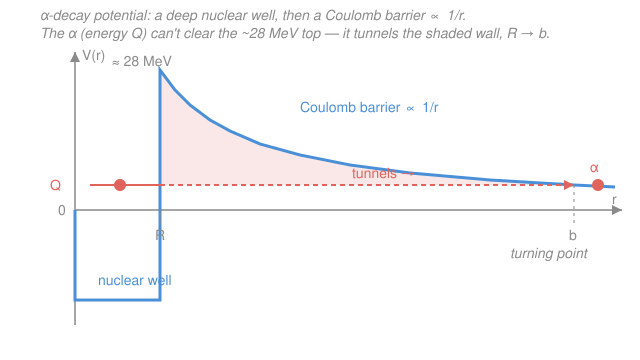

# Nuclear & Particle Physics · Lesson 2.2: Alpha decay & tunneling

> ⏱ ~15 min · Module 2: Radioactivity & nuclear reactions · Builds on: [2.1 The decay law & chains](02-01-decay-law-chains.md), [`quantum-mechanics` syllabus](../../quantum-mechanics/syllabus.md) · Unlocks: [2.3 Beta decay & the neutrino](02-03-beta-decay-neutrino.md)

## Why this matters

In [2.1](02-01-decay-law-chains.md) we took the decay constant $\lambda$ as *given* and ran the bookkeeping. Now we compute one from scratch — and the story is one of the great triumphs of early quantum mechanics. Alpha half-lives span **thirty orders of magnitude**, from ${}^{232}_{90}\mathrm{Th}$ at $1.4\times10^{10}$ yr to ${}^{212}_{84}\mathrm{Po}$ at $0.3\ \mu\text{s}$, yet the escaping alphas differ in energy by only a factor of two. In 1928 Gamow explained that absurd range with a single mechanism — quantum tunneling — turning a mystery into a formula you can evaluate on a napkin. It was the first application of the brand-new wave mechanics to the nucleus, and it still works.

## The idea

**Alpha decay** is a heavy nucleus spitting out an alpha particle — a ${}^{4}_{2}\mathrm{He}$ nucleus, two protons and two neutrons. Why *that* clump and not a lone proton or a lithium chunk? Because the alpha is extraordinarily tightly bound (recall the $B/A$ curve from Module 1: ${}^{4}\mathrm{He}$ is a local peak at $\approx 7.07$ MeV/nucleon). Packing the escapee into an alpha releases the most energy, so that channel wins:

$${}^{A}_{Z}\mathrm{X} \to {}^{A-4}_{Z-2}\mathrm{Y} + \alpha.$$

The puzzle is *how it gets out*. Picture the alpha already formed inside the nucleus, rattling against the walls. Outside, the daughter's positive charge repels it — a **Coulomb barrier** rising as $1/r$ as you approach. The alpha carries only $Q_\alpha \approx 4$–$9$ MeV of energy, but the barrier peaks above **25 MeV**. Classically, a ball with 5 units of energy facing a 28-unit hill *cannot cross* — full stop. Yet alphas come out. Gamow's resolution: a quantum particle is a wave, and a wave leaks through a barrier it can't climb. The alpha **tunnels**. The thicker and taller the wall, the more the wave dies away crossing it — exponentially — and that exponential is the whole reason for the thirty-order-of-magnitude spread.

## The formal version

**The energy released.** The $Q$-value is the mass lost, times $c^2$:

$$Q_\alpha = \big[M_X - M_Y - M_\alpha\big]c^2.$$

*In words: the parent is heavier than daughter-plus-alpha, and that missing mass comes out as kinetic energy.* Decay happens only when $Q_\alpha > 0$, which holds for essentially all nuclei beyond $A \approx 150$. Using **atomic** masses, the $Z$ electrons on the parent match $(Z-2)+2$ on the products, so they cancel — no electron correction needed.

The energy $Q_\alpha$ is shared between the alpha and the recoiling daughter. Momentum conservation (the parent is at rest, so the two fly apart with equal and opposite momentum $p$) fixes the split. Non-relativistically $K = p^2/2m$, so

$$K_\alpha = Q_\alpha\,\frac{M_Y}{M_Y + M_\alpha} = Q_\alpha\,\frac{A-4}{A}.$$

*In words: the light alpha carries away almost all of it* (~98%), the heavy daughter barely recoils.

**The turning point.** Outside the nuclear radius $R$, the potential energy is pure Coulomb between charge $2e$ (alpha) and $(Z-2)e$ (daughter — call its charge $Z_d\,e$):

$$V(r) = \frac{2 Z_d\, e^2}{4\pi\epsilon_0\, r}, \qquad \frac{e^2}{4\pi\epsilon_0} = 1.44\ \text{MeV·fm}.$$

The alpha, with energy $Q_\alpha$, is classically forbidden from $r=R$ out to where $V(r)$ drops back to $Q_\alpha$ — the **classical turning point**

$$b = \frac{2 Z_d\, e^2}{4\pi\epsilon_0\, Q_\alpha}.$$

*In words: $b$ is where the barrier finally falls to the alpha's energy — the far wall of the tunnel.*

**The Gamow factor (WKB sketch).** Quantum mechanics says a wave crossing a classically-forbidden region is attenuated by $e^{-G}$, where $G$ sums up "how forbidden" the path is — the [WKB](../../quantum-mechanics/syllabus.md) barrier integral of the imaginary momentum:

$$G = \frac{1}{\hbar}\int_R^{b} \sqrt{2m\big[V(r) - Q_\alpha\big]}\ dr .$$

*In words: add up $\sqrt{\text{how far below the barrier you are}}$ across the whole wall; a taller or wider wall means a bigger $G$ and far less leakage.* The **transmission probability** is $P = e^{-2G}$. For a pure Coulomb barrier in the thick-wall limit $R \ll b$, the integral has a clean closed form, and dropping the small $R/b$ correction gives the result worth memorizing:

$$\boxed{\,2G \;\approx\; \frac{\pi\,(2 Z_d)\,e^2}{4\pi\epsilon_0\,\hbar}\sqrt{\frac{2m}{Q_\alpha}} \;\approx\; 3.96\,\frac{Z_d}{\sqrt{Q_\alpha}}\,}$$

with $Q_\alpha$ in MeV and $m$ the alpha mass ($mc^2 = 3727$ MeV). The numeric $3.96$ bundles all the constants. **Everything hangs on $Z_d/\sqrt{Q_\alpha}$.**

**From tunneling to half-life.** The alpha bangs on the wall at an *assault frequency* $f \sim v/2R \sim 10^{21}\ \text{s}^{-1}$ — that many escape attempts per second, each succeeding with probability $e^{-2G}$. So $\lambda = f\,e^{-2G}$ and

$$t_{1/2} = \frac{\ln 2}{\lambda} = \frac{\ln 2}{f}\,e^{2G} \quad\Longrightarrow\quad \log_{10} t_{1/2} \approx \underbrace{0.43\times 3.96}_{\approx\,1.72}\,\frac{Z_d}{\sqrt{Q_\alpha}} + C.$$

This is the **Geiger–Nuttall law**: $\log_{10} t_{1/2}$ is linear in $1/\sqrt{Q_\alpha}$. *In words: the half-life is (attempts per second)⁻¹ divided by the tunneling odds.* Because $2G$ sits in an exponent and scales as $Q_\alpha^{-1/2}$, a **1 MeV** bump in $Q_\alpha$ can swing $t_{1/2}$ by ~20 orders of magnitude — the entire observed spread falls out of that one exponential.

## Picture

## Worked examples

**Example 1 (mechanical — $Q_\alpha$ and the alpha's energy).** Take ${}^{238}_{92}\mathrm{U} \to {}^{234}_{90}\mathrm{Th} + \alpha$. Atomic masses (u): $M_U = 238.050788$, $M_{Th} = 234.043601$, $M_\alpha = 4.002603$, with $1\ \text{u} = 931.494\ \text{MeV}/c^2$.

$$Q_\alpha = (238.050788 - 234.043601 - 4.002603)(931.494) = (0.004584)(931.494) = 4.27\ \text{MeV}.$$

The alpha's kinetic energy after recoil:

$$K_\alpha = Q_\alpha\,\frac{A-4}{A} = 4.27\times\frac{234}{238} = 4.20\ \text{MeV},$$

leaving just $0.07$ MeV for the ${}^{234}\mathrm{Th}$ recoil. The measured alpha energy is $4.20$ MeV — spot on. Notice how *little* energy this is compared to the barrier: with $Z_d = 90$ and $R + r_\alpha \approx 9$ fm, the barrier top is $V(R) = 2(90)(1.44)/9 \approx 28$ MeV. The alpha faces a 28 MeV wall with 4.3 MeV in hand and still escapes — every emitted alpha is a tunneling event.

**Example 2 (why you'd care — a half-life ratio).** The sensitivity is easiest to feel by comparing two isotopes of the *same* element, so the daughter charge $Z_d$ is identical and only $Q_\alpha$ moves. Both polonium isotopes decay to lead ($Z_d = 82$):

| isotope | $Q_\alpha$ (MeV) | observed $t_{1/2}$ |
|---|---|---|
| ${}^{210}\mathrm{Po}$ | 5.41 | 138 days |
| ${}^{212}\mathrm{Po}$ | 8.95 | 0.3 μs |

A $3.5$ MeV change in $Q_\alpha$; a $10^{13}$ change in lifetime. Does Gamow reproduce it? Compute $2G = 3.96\,Z_d/\sqrt{Q_\alpha}$ for each:

$$2G(^{210}\mathrm{Po}) = \frac{3.96\times 82}{\sqrt{5.41}} = 139.6, \qquad 2G(^{212}\mathrm{Po}) = \frac{3.96\times 82}{\sqrt{8.95}} = 108.5.$$

Since $t_{1/2} \propto e^{2G}$ (the assault frequencies are nearly equal), the ratio is

$$\frac{t_{1/2}(^{210}\mathrm{Po})}{t_{1/2}(^{212}\mathrm{Po})} \approx e^{\,139.6 - 108.5} = e^{31.1} = 10^{13.5}.$$

The observed ratio is $\dfrac{138\times 86400\ \text{s}}{0.3\times10^{-6}\ \text{s}} \approx 10^{13.6}$. A one-line barrier estimate lands within a factor of a few of thirteen decades — that is the power of Geiger–Nuttall.

## Watch out

- **You might think a *higher* $Q_\alpha$ means a *longer* life — more energy, bigger bang.** It's the opposite: higher $Q_\alpha$ raises the alpha's energy line, thinning the barrier (smaller $b$) and *shortening* $t_{1/2}$. In $2G \propto 1/\sqrt{Q_\alpha}$, larger $Q$ means smaller $2G$ means easier escape. Hot alphas leave fast.
- **You might use the parent's charge in the barrier.** The alpha tunnels away from the **daughter**, so $Z_d = Z - 2$. For ${}^{238}\mathrm{U}$ (parent $Z=92$) the barrier is set by $Z_d = 90$.
- **Don't over-trust the intercept.** The $Z_d/\sqrt{Q_\alpha}$ *scaling* is superb, but the constant $C$ (and the exact $3.96$) hide the crude thick-barrier limit, the guessed assault frequency $f$, and the alpha-preformation probability. Trust ratios and orders of magnitude; don't quote a Gamow half-life to three significant figures.

## One-liner

> An alpha escapes by tunneling a Coulomb wall it can't climb, and since the tunneling probability is $e^{-2G}$ with $2G \approx 3.96\,Z_d/\sqrt{Q_\alpha}$, a small change in $Q_\alpha$ swings the half-life by many orders of magnitude — the Geiger–Nuttall law.

## Problems

**P1 (🟢)** For ${}^{226}_{88}\mathrm{Ra} \to {}^{222}_{86}\mathrm{Rn} + \alpha$, use atomic masses $M_{Ra} = 226.025410$ u, $M_{Rn} = 222.017578$ u, $M_\alpha = 4.002603$ u ($1\ \text{u} = 931.494\ \text{MeV}/c^2$) to find $Q_\alpha$, then the alpha's kinetic energy after recoil.

**P2 (🟡)** ${}^{226}\mathrm{Ra}$ ($Q_\alpha = 4.87$ MeV, $t_{1/2} = 1600$ yr) and ${}^{224}\mathrm{Ra}$ ($Q_\alpha = 5.79$ MeV) both decay to a radon daughter, $Z_d = 86$. Using $2G = 3.96\,Z_d/\sqrt{Q_\alpha}$ and $t_{1/2}\propto e^{2G}$, *predict* the half-life of ${}^{224}\mathrm{Ra}$. (Observed: 3.66 days — how close is your order of magnitude?)

**P3 (🔴, optional)** For ${}^{212}\mathrm{Po} \to {}^{208}\mathrm{Pb} + \alpha$ ($Q_\alpha = 8.95$ MeV, daughter $Z_d = 82$), find the classical turning point $b$, and the barrier height $V(R)$ at $R + r_\alpha \approx 9$ fm. By what factor does the barrier top exceed the alpha's energy?

Solutions

**P1** Mass difference:

$$\Delta m = 226.025410 - 222.017578 - 4.002603 = 0.005229\ \text{u}, \qquad Q_\alpha = 0.005229\times 931.494 = 4.87\ \text{MeV}.$$

Alpha kinetic energy after recoil:

$$K_\alpha = Q_\alpha\,\frac{A-4}{A} = 4.87\times\frac{222}{226} = 4.79\ \text{MeV}.$$

*Check.* The daughter takes $4.87 - 4.79 = 0.08$ MeV — about $\tfrac{4}{226}\approx 1.8\%$ of $Q_\alpha$, as the $M_Y/(M_Y+M_\alpha)$ split demands. The measured ${}^{226}\mathrm{Ra}$ alpha is $4.78$ MeV. ✓

**P2** Compute $2G$ for each ($Z_d = 86$):

$$2G(^{226}\mathrm{Ra}) = \frac{3.96\times 86}{\sqrt{4.87}} = 154.3, \qquad 2G(^{224}\mathrm{Ra}) = \frac{3.96\times 86}{\sqrt{5.79}} = 141.5.$$

Since $t_{1/2}\propto e^{2G}$,

$$\frac{t_{1/2}(^{224}\mathrm{Ra})}{t_{1/2}(^{226}\mathrm{Ra})} \approx e^{\,141.5 - 154.3} = e^{-12.8} = 2.8\times10^{-6}.$$

So $t_{1/2}(^{224}\mathrm{Ra}) \approx (1600\ \text{yr})(2.8\times10^{-6}) = 4.5\times10^{-3}\ \text{yr} \approx 1.6\ \text{days}$.

*Check.* Observed is 3.66 days — the estimate is low by about a factor of 2, i.e. correct to well within one order of magnitude, which is all the thick-barrier limit promises. The point stands: a $0.9$ MeV rise in $Q_\alpha$ compresses the half-life by ~5.5 orders of magnitude. ✓

**P3** Turning point:

$$b = \frac{2 Z_d\, e^2}{4\pi\epsilon_0\, Q_\alpha} = \frac{2(82)(1.44\ \text{MeV·fm})}{8.95\ \text{MeV}} = \frac{236.2}{8.95} = 26.4\ \text{fm}.$$

Barrier height at contact ($r = R + r_\alpha \approx 9$ fm):

$$V(R) = \frac{2(82)(1.44)}{9} = \frac{236.2}{9} = 26.2\ \text{MeV}.$$

The barrier top is $26.2 / 8.95 \approx 2.9$ times the alpha's energy.

*Check.* $b$ should be $R \times V(R)/Q_\alpha = 9\times 2.93 \approx 26$ fm — consistent, since $V\propto 1/r$. Units: $\text{MeV·fm}/\text{MeV} = \text{fm}$. ✓ The alpha tunnels from ~9 fm out to ~26 fm through a wall nearly three times its energy — and ${}^{212}\mathrm{Po}$ still lasts only $0.3\ \mu$s because its high $Q_\alpha$ makes even that barrier leaky.

## Flashback

**From Lesson 2.1 (The decay law & chains):** A pure ${}^{222}\mathrm{Rn}$ source ($t_{1/2} = 3.82$ days) reads an activity of $8.0$ kBq today. (a) What was its activity $11.46$ days ago? (b) How many ${}^{222}\mathrm{Rn}$ atoms are present now?

Solution

(a) $11.46\ \text{days} = 3\times 3.82\ \text{days}$ — exactly three half-lives *in the past*, so the activity was higher by $2^3 = 8$:

$$A_{\text{past}} = 8.0\ \text{kBq}\times 2^3 = 64\ \text{kBq}.$$

(b) Activity is $A = \lambda N$, with

$$\lambda = \frac{\ln 2}{t_{1/2}} = \frac{0.693}{3.82\times 86400\ \text{s}} = 2.10\times10^{-6}\ \text{s}^{-1}, \qquad N = \frac{A}{\lambda} = \frac{8000\ \text{s}^{-1}}{2.10\times10^{-6}\ \text{s}^{-1}} = 3.8\times10^{9}\ \text{atoms}.$$

*Check.* Going back in time *increases* activity (decay depletes the source), and three half-lives is a clean factor of 8 — no calculator needed. The atom count is tiny in chemical terms ($\sim 10^{-14}$ mol), a reminder that a measurable radioactive "sample" can be almost nothing by mass. ✓

## Connections

- **Backward:** this turns [2.1](02-01-decay-law-chains.md)'s abstract $\lambda$ into something computed — $\lambda = f\,e^{-2G}$ — and leans on Module 1's $B/A$ curve to explain *why* the ejected fragment is a ${}^{4}\mathrm{He}$ nucleus rather than anything else.
- **Forward:** [2.3 Beta decay & the neutrino](02-03-beta-decay-neutrino.md) attacks the *other* decay mode, where the culprit is not a Coulomb barrier but the weak force — and the energy spectrum comes out continuous, not sharp, forcing a new particle into existence.
- **Sideways (quantum mechanics):** the Gamow factor *is* barrier tunneling / the [WKB approximation](../../quantum-mechanics/syllabus.md) applied to a Coulomb wall — the same $e^{-2G}$ that governs scanning tunneling microscopes and cold field emission. The nucleus is just an especially dramatic barrier.
