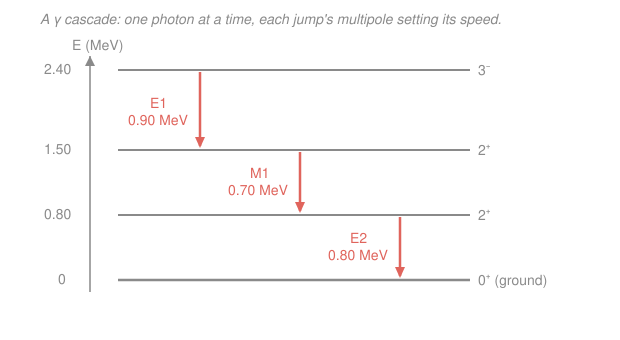

# Nuclear & Particle Physics · Lesson 2.4: Gamma decay & the excited nucleus

> ⏱ ~15 min · Module 2: Radioactivity & nuclear reactions · Builds on: [2.3 Beta decay & the neutrino](02-03-beta-decay-neutrino.md), [1.5 The shell model & magic numbers](01-05-shell-model-magic-numbers.md) · Unlocks: [2.5 Nuclear reactions & Q-values](02-05-nuclear-reactions-q-values.md)

## Why this matters

When a nucleus decays by $\alpha$ or $\beta$, or gets hit in a reaction, it usually lands not in its ground state but in an **excited** one — vibrating or spinning with a few hundred keV to a few MeV of extra energy. It gets rid of that energy the way an excited atom does: it emits a photon. But because nuclear energy levels are **discrete** (that's the whole point of the shell model, [1.5](01-05-shell-model-magic-numbers.md)), the photons come out at sharp, characteristic energies. A $\gamma$-ray spectrum is a **fingerprint**: see a 1173 and 1332 keV pair and you're looking at cobalt-60, no chemistry required. This lesson is how you read that fingerprint, and why some excited states dump their energy in a picosecond while others (nuclear **isomers**) hang around for hours.

## The idea

Think of the nucleus as a tiny quantum system with a ladder of allowed energies — exactly like the hydrogen atom's levels, just spaced a million times wider (MeV instead of eV). Put it on a high rung and it wants to fall to the bottom. Falling releases a fixed chunk of energy $\Delta E$, and that energy leaves as a single high-energy photon, the $\gamma$-ray, with $E_\gamma \approx \Delta E$.

Two things decide *which* jumps happen and *how fast*. First, the photon is not just energy — it carries away **angular momentum** (at least one unit) and a **parity**. So a jump is only allowed if the spins and parities of the start and end rungs can balance the photon's books. Second, the photon strongly prefers to carry the *least* angular momentum it can get away with. Jumps that are forced to hand the photon a lot of angular momentum are throttled — sometimes so severely that the excited state lives for hours or years. That's an **isomer**, and it's why $^{99m}\mathrm{Tc}$ can be shipped to a hospital and injected before it decays.

## The formal version

**The transition energy and the recoil.** A nucleus of rest mass $M$ drops from an excited level $E_i$ to a lower level $E_f$, releasing

$$\Delta E = E_i - E_f.$$

*In words: the energy released is just the gap between the two rungs.* Momentum must be conserved, so if the photon flies off with momentum $p_\gamma = E_\gamma/c$, the nucleus recoils with the same momentum, carrying kinetic energy

$$E_\text{recoil} = \frac{p_\gamma^2}{2M} = \frac{E_\gamma^2}{2Mc^2}.$$

*In words: the nucleus kicks back like a rifle, stealing a sliver of the energy.* Energy conservation then reads $\Delta E = E_\gamma + E_\text{recoil}$, so

$$E_\gamma = \Delta E - \frac{E_\gamma^2}{2Mc^2} \;\approx\; \Delta E\left(1 - \frac{\Delta E}{2Mc^2}\right).$$

The correction is minuscule — for a 1 MeV photon off a mass-100 nucleus ($Mc^2 \approx 100 \times 931.5\ \text{MeV}$) the recoil is only about 5 eV, a fraction $\sim 5\times10^{-6}$. So for almost all purposes **$E_\gamma = \Delta E$**. (The one place those few eV matter is the Mössbauer effect — see *Watch out*.)

**Multipolarity and selection rules.** The emitted radiation is classified by the angular momentum $L$ (in units of $\hbar$) the photon carries and by whether it is **electric** ($EL$) or **magnetic** ($ML$): $E1$ (electric dipole), $M1$ (magnetic dipole), $E2$ (electric quadrupole), and so on. For a transition $J_i^{\pi_i} \to J_f^{\pi_f}$ (spin $J$, parity $\pi = \pm$), two rules fix what's allowed:

$$\textbf{Angular momentum:}\quad |J_i - J_f| \le L \le J_i + J_f, \qquad L \ge 1.$$

*In words: the photon must carry off enough angular momentum to bridge the two spins, but at least one unit — there is no $L=0$ photon, so a $0 \to 0$ jump cannot emit a single $\gamma$ at all.*

$$\textbf{Parity:}\quad \pi(EL) = (-1)^{L}, \qquad \pi(ML) = (-1)^{L+1},$$

and the transition is allowed only if $\pi_i\,\pi_f$ equals the radiation's parity. In practice:

- **No parity change** ($\pi_i = \pi_f$): allowed multipoles are $M1, E2, M3, E4, \dots$
- **Parity change** ($\pi_i \ne \pi_f$): allowed multipoles are $E1, M2, E3, M4, \dots$

*In words: pick the multipoles whose parity matches; electric and magnetic alternate as $L$ goes up.*

**Why the lowest multipole wins.** The emission rate falls off ferociously with $L$: each extra unit of angular momentum multiplies the rate by roughly $(kR)^2 = (E_\gamma R/\hbar c)^2$, where $R$ is the nuclear radius. For a nucleus $E_\gamma R/\hbar c \sim 10^{-2}$, so **each step up in $L$ slows the transition by $\sim 10^{-4}$**. The lowest allowed $L$ therefore dominates overwhelmingly. Lifetimes span an enormous range: an allowed $E1$ can go in sub-picoseconds, while a transition that requires high $L$ (a big spin change) can be stalled into a long-lived **isomer** — e.g. $^{99m}\mathrm{Tc}$, whose ${\tfrac12}^-$ state decays to the $\tfrac{9}{2}^+$ ground band only through a heavily forbidden high-multipole path and so lives ~6 hours.

**Internal conversion.** A competing channel: instead of emitting a photon, the nucleus can hand its energy directly to an atomic electron (usually a K-shell electron), ejecting it. This **internal conversion** competes with $\gamma$ emission and dominates for high-$Z$, low-energy transitions. It is also the *only* way to de-excite a $0 \to 0$ transition (an $E0$), since no single $\gamma$ can be emitted there.

## Picture

The staircase is a real cascade: the $3^-$ level empties to the ground state one rung at a time, each jump obeying the selection rules. Read off the multipoles — a parity flip forces $E1$, a same-parity spin-1 jump gives $M1$, and $2^+ \to 0^+$ can only be $E2$.

## Worked examples

**Example 1 (read $E_\gamma$ off a level scheme, and check the recoil).** Using the diagram above, a nucleus is left in the $3^-$ state at 2.40 MeV and cascades to the ground state. The three photon energies are just successive gaps:

$$E_{\gamma,1} = 2.40 - 1.50 = 0.90\ \text{MeV}\ (3^-\!\to 2^+),$$
$$E_{\gamma,2} = 1.50 - 0.80 = 0.70\ \text{MeV}\ (2^+\!\to 2^+),$$
$$E_{\gamma,3} = 0.80 - 0.00 = 0.80\ \text{MeV}\ (2^+\!\to 0^+).$$

Note the three add to 2.40 MeV — the full de-excitation energy, as they must. Now check the recoil for the first, taking the nucleus at $A \approx 100$, so $Mc^2 \approx 100 \times 931.5 = 9.32\times10^4\ \text{MeV}$:

$$E_\text{recoil} = \frac{E_\gamma^2}{2Mc^2} = \frac{(0.90)^2}{2(9.32\times10^4)}\ \text{MeV} \approx 4.3\times10^{-6}\ \text{MeV} = 4.3\ \text{eV}.$$

That's a fraction $E_\text{recoil}/E_\gamma \approx 5\times10^{-6}$ — utterly negligible for the measured photon energy, which is why level schemes are quoted straight as $E_\gamma$.

**Example 2 (allowed multipoles and the dominant one).** What radiation de-excites a $\tfrac{5}{2}^+ \to \tfrac{1}{2}^-$ transition? First the angular-momentum window:

$$|{\tfrac52 - \tfrac12}| \le L \le {\tfrac52 + \tfrac12} \quad\Rightarrow\quad 2 \le L \le 3.$$

Parity **changes** ($+ \to -$), so we take the parity-change series $E1, M2, E3, \dots$ and keep only $L = 2, 3$: that leaves $\boxed{M2 \text{ and } E3}$. The lowest allowed is $M2$, and since each extra unit of $L$ costs $\sim10^{-4}$ in rate, the $M2$ dominates and the $E3$ is a tiny admixture. Because even the fastest option here is a slow $M2$ (no $E1$ is allowed — $E1$ needs $L=1$, below the window), this state will be relatively long-lived: a candidate isomer.

## Watch out

- **You might think $E_\gamma$ tells you the excitation energy directly and exactly.** It's short by the recoil $E_\gamma^2/2Mc^2$. Usually those few eV are noise — but they are *not* zero, and they exceed the natural linewidth of the state, so a free nucleus's emitted photon is red-shifted just enough to miss being resonantly reabsorbed by an identical nucleus. Embedding the nucleus in a crystal lattice makes the *whole crystal* recoil (enormous $M$), driving $E_\text{recoil}\to 0$: this is the **Mössbauer effect**, and its recoil-free lines are sharp enough for eV-precision (even sub-neV) spectroscopy.
- **You might expect every spin change to be allowed as a $\gamma$.** A $0^+ \to 0^+$ transition emits **no** single photon — there is no $L=0$ radiation. It goes by internal conversion (an $E0$) or, if energetically possible, internal pair production, never by a lone $\gamma$.
- **You might assume electric always beats magnetic.** Not necessarily — the *multipole order* $L$ dominates the rate, not the E/M label. When parity forbids the lowest electric option, a magnetic multipole of the same or lower $L$ wins (e.g. an $M1$ beats an $E2$ for a same-parity $\Delta J = 1$ jump).

## One-liner

> A $\gamma$-ray is a nucleus falling between discrete rungs, $E_\gamma \approx \Delta E$; angular-momentum and parity balancing fixes the multipole, and the lowest allowed multipole — vastly the fastest — decides whether the state lives femtoseconds or, as an isomer, hours.

## Problems

**P1 (🟢)** A nucleus is excited to a level at 1.60 MeV. It can de-excite either by a single $\gamma$ straight to the ground state, or by a cascade through an intermediate level at 0.60 MeV. Give the photon energy of the direct transition and the two photon energies of the cascade, and verify the cascade energies sum to the direct one.

**P2 (🟡)** A $2^+$ excited state of a mass-$A=60$ nucleus emits a 1.33 MeV $\gamma$-ray to the ground state. Compute the recoil energy $E_\text{recoil}$ and the fractional shift $E_\text{recoil}/E_\gamma$. (Use $Mc^2 \approx A \times 931.5\ \text{MeV}$.) Comment on whether $E_\gamma = \Delta E$ is a safe approximation here.

**P3 (🔴, optional)** List the allowed multipoles for a $4^+ \to 2^+$ transition and name the one that dominates. Then do the same for $3^+ \to 3^+$, and explain why a $0^+ \to 0^+$ transition appears in neither the electric nor the magnetic series.

Solutions

**P1** Direct transition: $E_\gamma = 1.60 - 0 = 1.60\ \text{MeV}$. Cascade: $1.60 - 0.60 = 1.00\ \text{MeV}$ then $0.60 - 0 = 0.60\ \text{MeV}$.

$$1.00 + 0.60 = 1.60\ \text{MeV} = E_\gamma(\text{direct}). \checkmark$$

*Check.* Energy is a state function — the total released depends only on the endpoints (1.60 MeV above ground), not the path. The cascade just splits it into two photons, exactly as in Example 1.

**P2** With $Mc^2 = 60 \times 931.5 = 5.589\times10^4\ \text{MeV}$ and $E_\gamma = 1.33\ \text{MeV}$:

$$E_\text{recoil} = \frac{E_\gamma^2}{2Mc^2} = \frac{(1.33)^2}{2(5.589\times10^4)}\ \text{MeV} = \frac{1.769}{1.118\times10^5}\ \text{MeV} \approx 1.58\times10^{-5}\ \text{MeV} \approx 16\ \text{eV}.$$

$$\frac{E_\text{recoil}}{E_\gamma} = \frac{E_\gamma}{2Mc^2} = \frac{1.33}{1.118\times10^5} \approx 1.2\times10^{-5}.$$

*Check.* Order of magnitude: $\sim10\ \text{eV}$ out of $1.3\times10^6\ \text{eV}$, i.e. a part in $10^5$ — negligible for reading the photon energy, so $E_\gamma = \Delta E$ is perfectly safe. (These are in fact the real numbers for the 1.33 MeV line of $^{60}\mathrm{Co}$.) Units: $\text{MeV}^2/\text{MeV} = \text{MeV}$. ✓

**P3** *$4^+ \to 2^+$:* angular momentum $|4-2| \le L \le 4+2$, so $2 \le L \le 6$. Parity does **not** change ($+ \to +$), so take the series $M1, E2, M3, E4,\dots$ and keep $L = 2$–$6$: allowed multipoles are $E2, M3, E4, M5, E6$. Lowest is $L=2$, so **$E2$ dominates**. (This $E2$ is the workhorse of rotational bands.)

*$3^+ \to 3^+$:* $|3-3| \le L \le 6$ gives $0 \le L \le 6$, but $L \ge 1$ always, so $1 \le L \le 6$. No parity change $\Rightarrow$ $M1, E2, M3, E4, M5, E6$; the **$M1$ dominates** (with an $E2$ admixture typical of $\Delta J = 0$ jumps).

*$0^+ \to 0^+$:* the window is $0 \le L \le 0$, i.e. only $L=0$ — but $L \ge 1$ is required (no monopole radiation), so *no* multipole is allowed in either series. The transition proceeds by internal conversion ($E0$), not by a single photon.

*Check.* Every list starts at $L=|J_i-J_f|$ and the correct series (same-parity $\Rightarrow$ $M1,E2,\dots$; parity-change $\Rightarrow$ $E1,M2,\dots$); the lowest $L$ dominates in each, consistent with the $(kR)^2$-per-step suppression.

## Flashback

**From Lesson 2.1 (The decay law & chains):** The isomer $^{99m}\mathrm{Tc}$ de-excites to $^{99}\mathrm{Tc}$ with a half-life $t_{1/2} = 6.0$ hours. A freshly prepared sample contains $N_0$ isomeric nuclei. What fraction remains undecayed after 18 hours, and what is the mean life $\tau$?

Solution

Eighteen hours is exactly three half-lives, so the surviving fraction is

$$\frac{N}{N_0} = \left(\tfrac12\right)^{18/6.0} = \left(\tfrac12\right)^3 = \tfrac18 = 0.125.$$

The mean life is the half-life divided by $\ln 2$:

$$\tau = \frac{t_{1/2}}{\ln 2} = \frac{6.0}{0.693} \approx 8.7\ \text{hours}.$$

*Check.* $\tau > t_{1/2}$ always (the mean is pulled up by the long tail of the exponential), and equivalently $N/N_0 = e^{-18/8.7} = e^{-2.08} \approx 0.125$ — the two forms agree. ✓ The 6-hour clock is exactly what makes this $\gamma$-emitting isomer practical for medical imaging: long enough to inject and scan, short enough to clear.

## Connections

- **Backward:** the discrete rungs a $\gamma$ falls between are the nuclear energy levels of the [shell model (1.5)](01-05-shell-model-magic-numbers.md); the *reason* a nucleus is excited in the first place is usually the recoil of an $\alpha$ ([2.2](02-02-alpha-decay-tunneling.md)) or $\beta$ ([2.3](02-03-beta-decay-neutrino.md)) decay, or a reaction, leaving a daughter in an excited state. The decay-law bookkeeping for isomer lifetimes is [2.1](02-01-decay-law-chains.md).
- **Forward:** in [2.5 Nuclear reactions & Q-values](02-05-nuclear-reactions-q-values.md), reaction products are frequently born excited and then $\gamma$-decay; the $\gamma$ energies you measure are how you know which excited state was populated and pin down the reaction $Q$.
- **Sideways (quantum mechanics):** the selection rules here are the *same* angular-momentum-and-parity conservation you met for atomic transitions in [`quantum-mechanics`](../../quantum-mechanics/syllabus.md) — the photon is a spin-1, negative-intrinsic-parity particle either way. The emission rate itself comes from Fermi's golden rule (time-dependent perturbation theory), and its $(kR)^2$-per-multipole suppression is the long-wavelength expansion of that matrix element; the full field-theoretic amplitude for photon emission is deferred to [`qft`](../../qft/syllabus.md).
