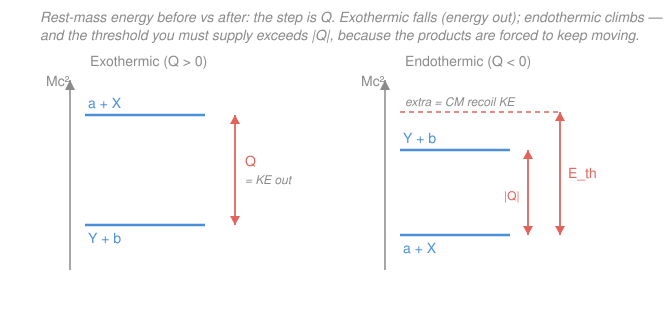

# Nuclear & Particle Physics · Lesson 2.5: Nuclear reactions & Q-values

> ⏱ ~15 min · Module 2: Radioactivity & nuclear reactions · Builds on: [2.4 Gamma decay & the excited nucleus](02-04-gamma-decay.md) · Unlocks: [2.6 Fission & fusion energetics](02-06-fission-fusion.md)

## Why this matters

Decay is a nucleus rearranging itself alone. A **reaction** is what happens when you *hit* it — fire a projectile at a target and watch what comes out. Every source of nuclear energy, every way we've ever measured a nuclear cross-section, and the entire experimental program of particle physics is built on this. The single number that governs whether a reaction gives energy or demands it is the **Q-value**, and it comes from exactly the mass-difference bookkeeping you already did for $\alpha$ and $\beta$ decay in [2.2](02-02-alpha-decay-tunneling.md)/[2.3](02-03-beta-decay-neutrino.md). Here we make it systematic, add the wrinkle that a *lab* experiment costs more energy than the naive $|Q|$ (the **threshold**), and set up both the energetics of fission/fusion ([2.6](02-06-fission-fusion.md)) and the relativistic kinematics of Module 3.

## The idea

Weigh everything going in. Weigh everything coming out. If the products are *lighter*, that missing mass didn't vanish — by $E = mc^2$ it came out as kinetic energy, and the reaction runs on its own, happy to proceed even if the projectile crawls in at a standstill. That's **exothermic**. If the products are *heavier*, you have to *pay* the mass difference out of pocket, as kinetic energy of the projectile. That's **endothermic**, and nothing happens until you bring enough.

Here's the twist that trips everyone: for an endothermic reaction it's not enough to supply $|Q|$. Momentum has to be conserved too. Fire a projectile at a sitting target and the whole mess has to keep moving forward afterward — that forward motion is kinetic energy you can never claw back to build the products. So the **threshold** kinetic energy you must supply in the lab is always *more* than $|Q|$. The lighter the target relative to the projectile, the worse the penalty (imagine a truck hitting a ping-pong ball — almost all the energy stays as forward motion).

## The formal version

**Reaction notation.** A projectile $a$ strikes a target nucleus $X$, producing a heavy residual nucleus $Y$ and a light ejectile $b$:

$$a + X \;\longrightarrow\; Y + b, \qquad\text{written compactly}\qquad X(a,b)Y.$$

*In words: target-in-parentheses lists the projectile you shot and the light particle that flew out.* Example: Rutherford's 1919 reaction ${}^{14}_{7}\mathrm{N}(\alpha,p){}^{17}_{8}\mathrm{O}$ means ${}^{4}_{2}\mathrm{He} + {}^{14}_{7}\mathrm{N} \to {}^{17}_{8}\mathrm{O} + p$ — the first time humans transmuted one element into another.

**Conservation laws.** Every nuclear reaction must conserve:

- **Charge** (total $Z$): $Z_a + Z_X = Z_Y + Z_b$.
- **Nucleon number** (total $A$): $A_a + A_X = A_Y + A_b$.
- **Energy and momentum** (together — this is what fixes the outgoing energies).

*In words: protons+neutrons are neither created nor destroyed here, net charge is fixed, and the total relativistic energy and the total momentum each balance.* (Check the Rutherford example: $Z$: $2+7=8+1$ ✓; $A$: $4+14=17+1$ ✓.)

**The Q-value.** Define

$$\boxed{\,Q = \big(m_a + m_X - m_Y - m_b\big)c^2 = \big(T_Y + T_b\big) - \big(T_a + T_X\big)\,}$$

where $m$ are rest masses and $T$ are kinetic energies. *In words: Q is the rest-mass energy lost by the ingredients, which is exactly the kinetic energy gained by the products.* The two expressions are equal because total relativistic energy (rest + kinetic) is conserved.

- $Q > 0$ — **exothermic**: products lighter, energy released; can proceed even with the projectile at rest.
- $Q < 0$ — **endothermic**: products heavier, energy absorbed; needs a minimum input to happen at all.

This is the *same* formula as the decay Q-value from [2.2](02-02-alpha-decay-tunneling.md) — a decay $X \to Y + b$ is just a reaction with no projectile.

**Electron bookkeeping (atomic vs nuclear mass).** Tables list *atomic* masses (nucleus + $Z$ electrons). Because a nuclear reaction conserves total $Z$, the total number of electrons is the same on both sides, so their masses **cancel** in $Q$ — you may plug atomic masses in directly. *In words: for reactions (unlike $\beta$ decay in [2.3](02-03-beta-decay-neutrino.md), where $Z$ changes), you don't have to track electrons — just be consistent and use atomic masses throughout.* The tiny differences in electron *binding* energy (eV–keV) are negligible against MeV nuclear scales. Handy constant: $1\,\mathrm{u} \cdot c^2 = 931.494\ \text{MeV}$.

**Threshold energy (endothermic, fixed target).** Fire $a$ (kinetic energy $T_a$) at $X$ at rest. Only the kinetic energy *in the center-of-momentum (CM) frame* is available to make products; the forward CM motion is locked away. Nonrelativistically the available energy is $T_{\text{cm}} = T_a\,\dfrac{m_X}{m_a + m_X}$, and the reaction needs $T_{\text{cm}} \ge |Q|$, giving

$$\boxed{\,T_{\text{th}} = |Q|\left(1 + \frac{m_a}{m_X}\right)\,}$$

*In words: the lab threshold is $|Q|$ inflated by the recoil penalty $1 + m_a/m_X$ — always more than $|Q|$, and much more when the target is light.* (The exact relativistic version comes from the invariant $s$ in [3.2](03-02-collision-decay-kinematics.md); this nonrelativistic form is fine while $T \ll mc^2$.)

## Picture

## Worked examples

**Example 1 (endothermic Q and its threshold — the Rutherford reaction).** Compute $Q$ for ${}^{14}_{7}\mathrm{N}(\alpha,p){}^{17}_{8}\mathrm{O}$ and its lab threshold. Atomic masses (u): ${}^{4}\mathrm{He}=4.002602$, ${}^{14}\mathrm{N}=14.003074$, ${}^{1}\mathrm{H}=1.007825$, ${}^{17}\mathrm{O}=16.999132$.

$$Q = \big[(4.002602 + 14.003074) - (16.999132 + 1.007825)\big]\,\mathrm{u}\cdot c^2 = (-0.001281\,\mathrm{u})c^2.$$

$$Q = -0.001281 \times 931.494\ \text{MeV} = -1.19\ \text{MeV}.$$

Endothermic ($Q<0$): products are heavier, so this reaction cannot happen unless the $\alpha$ brings enough energy. With projectile $a=\alpha$ ($m_a \approx 4$) on target $X={}^{14}\mathrm{N}$ ($m_X \approx 14$):

$$T_{\text{th}} = |Q|\left(1 + \frac{m_a}{m_X}\right) = 1.19\left(1 + \frac{4.003}{14.003}\right) = 1.19 \times 1.286 = 1.53\ \text{MeV}.$$

So $\alpha$ particles below 1.53 MeV bounce off ${}^{14}\mathrm{N}$ without reacting; Rutherford's natural $\alpha$ source (several MeV) cleared it easily.

**Example 2 (exothermic Q and splitting the energy — a neutron detector).** The reaction ${}^{10}_{5}\mathrm{B}(n,\alpha){}^{7}_{3}\mathrm{Li}$ is how ${}^{10}\mathrm{B}$-lined counters detect slow neutrons. Atomic masses (u): ${}^{10}\mathrm{B}=10.012937$, $n=1.008665$, ${}^{4}\mathrm{He}=4.002602$, ${}^{7}\mathrm{Li}=7.016004$.

$$Q = \big[(10.012937 + 1.008665) - (4.002602 + 7.016004)\big]\,\mathrm{u}\cdot c^2 = (0.002996\,\mathrm{u})c^2 = +2.79\ \text{MeV}.$$

Exothermic — releases 2.79 MeV regardless of the neutron's (thermal, essentially zero) energy. **How does it split between the $\alpha$ and the ${}^{7}\mathrm{Li}$?** A thermal neutron carries almost no momentum, so total momentum $\approx 0$: the two products fly apart back-to-back with equal and opposite momenta, $p_\alpha = p_{\text{Li}} \equiv p$. Then

$$T_\alpha + T_{\text{Li}} = Q, \qquad T_\alpha = \frac{p^2}{2m_\alpha},\quad T_{\text{Li}} = \frac{p^2}{2m_{\text{Li}}} \;\Longrightarrow\; \frac{T_\alpha}{T_{\text{Li}}} = \frac{m_{\text{Li}}}{m_\alpha}.$$

*The lighter particle gets the bigger share* (same $p$, so $T = p^2/2m$ favors small $m$). Solving with $T_\alpha = Q\,\dfrac{m_{\text{Li}}}{m_\alpha + m_{\text{Li}}}$:

$$T_\alpha = 2.79 \times \frac{7.016}{4.003 + 7.016} = 2.79 \times 0.637 = 1.78\ \text{MeV}, \qquad T_{\text{Li}} = 2.79 - 1.78 = 1.01\ \text{MeV}.$$

Those two fixed energies (deposited in the gas) are the crisp signature the detector reads. This back-to-back split is the same logic you'll use for the fusion products in [2.6](02-06-fission-fusion.md).

## Watch out

- **You might think an endothermic reaction just needs $T_a = |Q|$.** It needs *more* — $T_{\text{th}} = |Q|(1 + m_a/m_X)$ — because momentum conservation forces the products to keep moving forward, and that CM kinetic energy is unavailable to build them. Only in the CM *frame* (or an ideal collider) does the bar drop to exactly $|Q|$.
- **You might mix atomic and nuclear masses.** For reactions, total $Z$ is conserved, so electron masses cancel and **atomic masses work throughout** — but never use a nuclear mass on one side and an atomic mass on the other. (Contrast $\beta$ decay in [2.3](02-03-beta-decay-neutrino.md), where $Z$ changes and the electrons *don't* fully cancel.)
- **You might flip the sign of $Q$.** It's (reactants $-$ products) for *rest mass*, but (products $-$ reactants) for *kinetic energy*. Both give the same $Q$; getting one backward flips exo/endothermic.
- **A tiny mass difference is a big energy.** Here $0.003\,\mathrm{u}$ — a rounding error on a bathroom scale — is 2.8 MeV. Carry masses to at least 5–6 decimal places or the whole $Q$ washes out.

## One-liner

> Q is the rest mass that turns into kinetic energy: positive means the reaction pays you (runs at rest), negative means you pay it — and in the lab you always overpay by the recoil factor $1 + m_a/m_X$.

## Problems

**P1 (🟢)** Compute the Q-value of the deuteron-stripping reaction ${}^{16}_{8}\mathrm{O}(d,p){}^{17}_{8}\mathrm{O}$ and state whether it is exo- or endothermic. Atomic masses (u): ${}^{16}\mathrm{O}=15.994915$, ${}^{2}\mathrm{H}=2.014102$, ${}^{1}\mathrm{H}=1.007825$, ${}^{17}\mathrm{O}=16.999132$. (First check charge and nucleon number balance.)

**P2 (🟡)** The reaction $p + {}^{7}\mathrm{Li} \to {}^{7}\mathrm{Be} + n$ has $Q = -1.64\ \text{MeV}$. Find the minimum proton kinetic energy (lab threshold) needed to make it go, using $m_p \approx 1.008\,\mathrm{u}$ and $m_{{}^{7}\mathrm{Li}} \approx 7.016\,\mathrm{u}$.

**P3 (🔴, optional)** A thermal neutron is captured in ${}^{6}\mathrm{Li}$: ${}^{6}\mathrm{Li}(n,\alpha){}^{3}\mathrm{H}$, with $Q = +4.78\ \text{MeV}$. Taking the neutron's momentum as negligible, find the kinetic energies of the $\alpha$ and the triton ${}^{3}\mathrm{H}$ (use $m_\alpha \approx 4.00\,\mathrm{u}$, $m_{{}^{3}\mathrm{H}} \approx 3.02\,\mathrm{u}$).

Solutions

**P1** Balance first: $Z$: $8+1 = 8+1$ ✓; $A$: $16+2 = 17+1$ ✓. Then

$$Q = \big[(15.994915 + 2.014102) - (16.999132 + 1.007825)\big]\,\mathrm{u}\cdot c^2 = (0.002060\,\mathrm{u})c^2.$$

$$Q = 0.002060 \times 931.494 = +1.92\ \text{MeV}.$$

$Q>0$, so **exothermic**.

*Check.* Reactants sum $18.009017$ u, products $18.006957$ u; the products are lighter, consistent with $Q>0$. Order of magnitude: a few $\times 10^{-3}$ u → a couple MeV, the right scale for a light-ion reaction. ✓

**P2** Projectile $a=p$ ($m_a \approx 1.008\,\mathrm{u}$), target $X={}^{7}\mathrm{Li}$ ($m_X \approx 7.016\,\mathrm{u}$):

$$T_{\text{th}} = |Q|\left(1 + \frac{m_a}{m_X}\right) = 1.64\left(1 + \frac{1.008}{7.016}\right) = 1.64 \times 1.1437 = 1.88\ \text{MeV}.$$

*Check.* $T_{\text{th}} > |Q|$ as it must be for a fixed target ✓, and the inflation is modest ($\sim 14\%$) because the target is $\sim 7\times$ heavier than the proton. Units: MeV ✓.

**P3** Neutron momentum $\approx 0$, so products go back-to-back with equal momenta $p$: $T_\alpha/T_t = m_t/m_\alpha$ and $T_\alpha + T_t = Q$. Then

$$T_\alpha = Q\,\frac{m_t}{m_\alpha + m_t} = 4.78 \times \frac{3.02}{4.00 + 3.02} = 4.78 \times 0.4302 = 2.06\ \text{MeV},$$

$$T_t = Q - T_\alpha = 4.78 - 2.06 = 2.72\ \text{MeV}.$$

*Check.* The lighter particle (the triton, $m=3.02 < 4.00$) carries the larger share ✓, and $T_\alpha + T_t = 4.78 = Q$ ✓. These are the two fixed energies a ${}^{6}\mathrm{Li}$ neutron detector records.

## Flashback

**From Lesson 2.2 (Alpha decay & tunneling):** ${}^{210}_{84}\mathrm{Po}$ is a pure $\alpha$ emitter, ${}^{210}\mathrm{Po} \to {}^{206}\mathrm{Pb} + \alpha$. Using atomic masses ${}^{210}\mathrm{Po}=209.982874$, ${}^{206}\mathrm{Pb}=205.974465$, ${}^{4}\mathrm{He}=4.002602$ (u), find $Q_\alpha$, and then the kinetic energy of the emitted $\alpha$ particle. (Recall the parent is at rest.)

Solution

The decay Q-value is the same mass-difference bookkeeping:

$$Q_\alpha = \big[209.982874 - (205.974465 + 4.002602)\big]\,\mathrm{u}\cdot c^2 = (0.005807\,\mathrm{u})c^2 = 5.41\ \text{MeV}.$$

The parent is at rest, so the daughter ${}^{206}\mathrm{Pb}$ and the $\alpha$ recoil back-to-back with equal momenta — exactly the two-body split from Example 2. The lighter particle (the $\alpha$) takes almost all the energy:

$$T_\alpha = Q_\alpha\,\frac{m_{\text{Pb}}}{m_{\text{Pb}} + m_\alpha} = 5.41 \times \frac{205.974}{209.977} = 5.41 \times 0.9809 = 5.31\ \text{MeV}.$$

*Check.* $T_\alpha < Q_\alpha$ by just $\sim 2\%$ — the heavy lead barely recoils, so nearly all of $Q$ goes to the $\alpha$, matching the tabulated ${}^{210}\mathrm{Po}$ alpha energy of 5.30 MeV. ✓

## Connections

- **Backward:** the Q-value is the *same* rest-mass-minus-rest-mass calculation as the $\alpha$-decay energy in [2.2](02-02-alpha-decay-tunneling.md) and the $\beta$ endpoint in [2.3](02-03-beta-decay-neutrino.md) — a decay is just a reaction with no incoming projectile. The two-body energy split reuses momentum conservation from those lessons.
- **Forward:** [2.6 Fission & fusion energetics](02-06-fission-fusion.md) is pure Q-value accounting on a grand scale — fission ($Q \approx +200\ \text{MeV}$ per ${}^{235}\mathrm{U}$) and D–T fusion ($Q = +17.6\ \text{MeV}$) both release energy because the products sit lower on the binding-energy curve; you'll split the fusion energy between the $\alpha$ and the neutron exactly as in Example 2.
- **Sideways (relativity):** the nonrelativistic threshold $|Q|(1+m_a/m_X)$ is the low-energy limit of the exact result from the Mandelstam invariant $s$ in [3.2 Collision & decay kinematics](03-02-collision-decay-kinematics.md) — which you need once projectile energies approach $mc^2$ (e.g. antiproton production, Boss problem 3), and which explains why a *collider* beats a fixed target by dodging the recoil penalty entirely.
